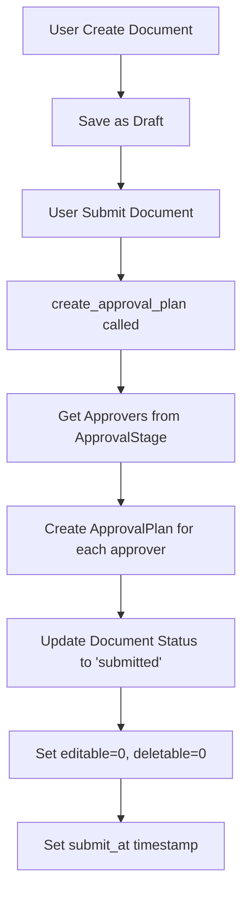
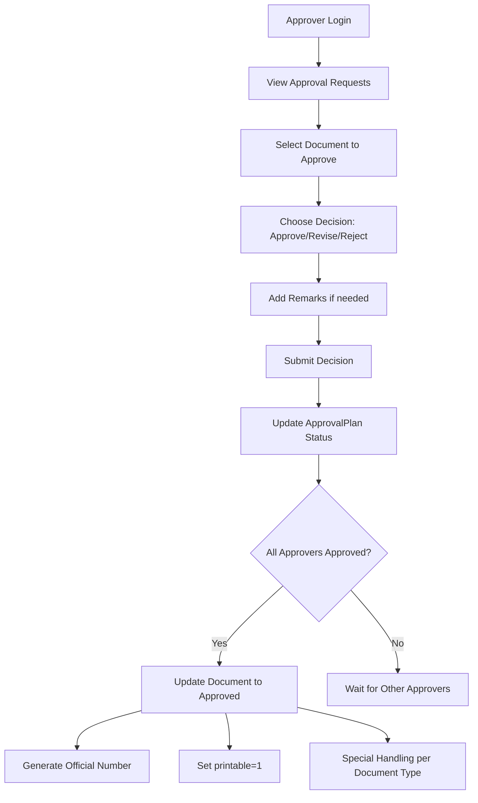

# Sistem Approval ArkaHERO

## 📋 Daftar Isi

1. [Overview Sistem Approval](#overview-sistem-approval)
2. [Arsitektur Database](#arsitektur-database)
3. [Model dan Relasi](#model-dan-relasi)
4. [Controller dan Logic](#controller-dan-logic)
5. [View dan UI](#view-dan-ui)
6. [Workflow Approval](#workflow-approval)
7. [Permission dan Role](#permission-dan-role)
8. [Penerapan pada Dokumen](#penerapan-pada-dokumen)
9. [Fitur Khusus](#fitur-khusus)
10. [API dan Integration](#api-dan-integration)

---

## 🎯 Overview Sistem Approval

Sistem approval di ArkaHERO adalah sistem workflow yang kompleks untuk mengelola persetujuan dokumen keuangan. Sistem ini mendukung 2 jenis dokumen utama:

-   **Official Travel (LOT)**
-   **Recruitment Request (FPTK)**

### Karakteristik Utama

-   **Multi-level Approval**: Setiap dokumen dapat memiliki multiple approver
-   **Project-based**: Approval berdasarkan project dan department
-   **Flexible Configuration**: Approval stages dapat dikonfigurasi per project, department, dan document type
-   **Status Tracking**: Tracking lengkap status approval dengan remarks
-   **Bulk Operations**: Support untuk bulk approval
-   **Document Lifecycle**: Manajemen siklus hidup dokumen dari draft hingga approved

---

## 🗄️ Arsitektur Database

### 1. Tabel `approval_stages`

```sql
CREATE TABLE approval_stages (
    id BIGINT PRIMARY KEY AUTO_INCREMENT,
    project VARCHAR(255) NOT NULL,
    department_id VARCHAR(255) NOT NULL,
    approver_id VARCHAR(255) NOT NULL,
    document_type VARCHAR(20) NULL, -- officialtravel / recruitment_request
    created_at TIMESTAMP NULL,
    updated_at TIMESTAMP NULL
);
```

**Fungsi**: Menyimpan konfigurasi approval stages untuk setiap kombinasi project, department, dan document type.

### 2. Tabel `approval_plans`

```sql
CREATE TABLE approval_plans (
    id BIGINT PRIMARY KEY AUTO_INCREMENT,
    document_id CHAR NOT NULL, -- uuid
    document_type VARCHAR(255) NOT NULL, -- officialtravel / recruitment_request
    approver_id BIGINT UNSIGNED NOT NULL,
    status INT DEFAULT 0, -- pending=0 | approved=1 | revised=2 | rejected=3 | cancelled=4
    remarks VARCHAR(255) NULL,
    is_open BOOLEAN DEFAULT TRUE, -- approval yg disetujui dihitung hanya yg is_open=true
    is_read BOOLEAN DEFAULT TRUE,
    created_at TIMESTAMP NULL,
    updated_at TIMESTAMP NULL
);
```

**Fungsi**: Menyimpan instance approval untuk setiap dokumen yang disubmit.

### 3. Tabel Dokumen Utama

#### `officialtravels`

```sql
-- Fields terkait approval
status VARCHAR(50) NULL, -- draft/submitted/approved/rejected/closed/canceled
submit_at TIMESTAMP NULL
approved_at TIMESTAMP NULL
```

#### `recruitment_requests`

```sql
-- Fields terkait approval
status VARCHAR(50) NULL, -- draft/submitted/approved/rejected/closed/canceled
submit_at TIMESTAMP NULL,
approved_at TIMESTAMP NULL,
```

---

## 🏗️ Model dan Relasi

### 1. Model `ApprovalStage`

```php
class ApprovalStage extends Model
{
    protected $guarded = [];

    public function approver()
    {
        return $this->belongsTo(User::class, 'approver_id');
    }

    public function department()
    {
        return $this->belongsTo(Department::class);
    }
}
```

### 2. Model `ApprovalPlan`

```php
class ApprovalPlan extends Model
{
    protected $guarded = [];

    public function approver()
    {
        return $this->belongsTo(User::class, 'approver_id')->withDefault([
            'name' => 'Not Available',
        ]);
    }

    public function officialtravel()
    {
        return $this->belongsTo(Officialtravel::class, 'document_id', 'id');
    }

    public function recruitment_request()
    {
        return $this->belongsTo(RecruitmentRequest::class, 'document_id', 'id');
    }
}
```

### 3. Model Dokumen dengan Approval

#### `Officialtravel`

```php
public function approval_plans()
{
    return $this->hasMany(ApprovalPlan::class);
}
```

#### `RecruitmentRequest`

```php
public function approval_plans()
{
    return $this->hasMany(ApprovalPlan::class);
}
```

### 4. Model `User`

```php
public function approval_stages()
{
    return $this->hasMany(ApprovalStage::class, 'approver_id', 'id');
}
```

---

## 🎮 Controller dan Logic

### 1. `ApprovalPlanController`

Controller utama yang menangani workflow approval untuk semua jenis dokumen.

#### Method `create_approval_plan($document_type, $document_id)`

```php
/**
 * Create approval plans for a document
 *
 * This function creates approval plans for a specific document based on its type.
 * It identifies the appropriate approvers from the ApprovalStage model and
 * creates an approval plan entry for each approver.
 *
 * @param string $document_type Type of document ('officialtravel', 'recruitment_request', 'rab')
 * @param int $document_id ID of the document
 * @return int|bool Number of approvers created or false if failed
 */
public function create_approval_plan($document_type, $document_id)
{
    // Retrieve the document based on its type
    if ($document_type == 'officialtravel') {
        $document = Officialtravel::findOrFail($document_id);
    } elseif ($document_type == 'recruitment_request') {
        $document = RecruitmentRequest::findOrFail($document_id);
    } else {
        return false; // Invalid document type
    }

    // Get all approvers for this document type, project and department
    $approvers = ApprovalStage::where('project', $document->project)
        ->where('department_id', $document->department_id)
        ->where('document_type', $document_type)
        ->get();

    // If approvers exist, create approval plans
    if ($approvers->count() > 0) {
        // Create an approval plan for each approver
        foreach ($approvers as $approver) {
            ApprovalPlan::create([
                'document_id' => $document_id,
                'document_type' => $document_type,
                'approver_id' => $approver->approver_id,
            ]);
        }

        // Update document to mark it as submitted and no longer editable
        $document->submit_at = Carbon::now();
        $document->save();

        return $approvers->count(); // Return number of approvers
    }

    // Return false if no approvers found
    return false;
}
```

#### Method `update(Request $request, $id)`

```php
/**
 * Update approval decision
 *
 * This function processes an approval decision (approve, revise, reject)
 * and updates both the approval plan and the associated document.
 *
 * Approval status codes:
 * 0 = Pending
 * 1 = Approved
 * 2 = Revise
 * 3 = Reject
 * 4 = Canceled
 *
 * @param Request $request The HTTP request containing approval data
 * @param int $id The ID of the approval plan to update
 * @return \Illuminate\Http\RedirectResponse Redirect to appropriate page
 */
public function update(Request $request, $id)
{
    // Find and update the approval plan with the decision
    $approval_plan = ApprovalPlan::findOrFail($id);
    $approval_plan->update([
        'status' => $request->status,
        'remarks' => $request->remarks,
        'is_read' => $request->remarks ? 0 : 1, // Mark as unread if there are remarks
    ]);

    // Get document type and retrieve the associated document
    $document_type = $approval_plan->document_type;

    if ($document_type == 'officialtravel') {
        $document = Officialtravel::where('id', $approval_plan->document_id)->first();
    } elseif ($document_type == 'recruitment_request') {
        $document = RecruitmentRequest::findOrFail($approval_plan->document_id);
    } else {
        return false; // Invalid document type
    }

    // Get all active approval plans for this document
    $approval_plans = ApprovalPlan::where('document_id', $document->id)
        ->where('document_type', $document_type)
        ->where('is_open', 1)
        ->get();

    // Count different approval decisions
    $rejected_count = 0;
    $revised_count = 0;
    $approved_count = 0;

    foreach ($approval_plans as $approval_plan) {
        if ($approval_plan->status == 3) { // Rejected
            $rejected_count++;
        }
        if ($approval_plan->status == 2) { // Revised
            $revised_count++;
        }
        if ($approval_plan->status == 1) { // Approved
            $approved_count++;
        }
    }

    // Handle document revision request
    if ($revised_count > 0) {
        $document->update([
            'status' => 'revise',
        ]);

        // Close all open approval plans for this document
        $this->closeOpenApprovalPlans($document_type, $document->id);
    }

    // Handle document rejection
    if ($rejected_count > 0) {
        $document->update([
            'status' => 'rejected',
        ]);

        // Close all open approval plans for this document
        $this->closeOpenApprovalPlans($document_type, $document->id);
    }

    // Handle document approval (when all approvers have approved)
    if ($approved_count === $approval_plans->count()) {
        // Update document status to approved
        $updateData = [
            'status' => 'approved',
            'approved_at' => $approval_plan->updated_at,
        ];

        $document->update($updateData);
    }

    // Determine the appropriate success message based on the approval status
    $status_text = '';
    if ($request->status == 1) {
        $status_text = 'approved';
    } elseif ($request->status == 2) {
        $status_text = 'sent back for revision';
    } elseif ($request->status == 3) {
        $status_text = 'rejected';
    } else {
        $status_text = 'updated';
    }

    // Check if the request is AJAX
    if ($request->ajax()) {
        return response()->json([
            'success' => true,
            'message' => ucfirst($document_type) . ' has been ' . $status_text,
            'document_type' => $document_type
        ]);
    }

    // Redirect to appropriate page based on document type for non-AJAX requests

    return redirect()->route('approvals.request.requests.index')->with('success', ucfirst($document_type) . ' has been ' . $status_text);
}
```

#### Method `approvalStatus()`

```php
/**
 * Get approval status descriptions
 *
 * Returns an array mapping status codes to their text descriptions
 *
 * @return array Array of approval status descriptions
 */
public function approvalStatus()
{
    return [
        0 => 'Pending',
        1 => 'Approved',
        2 => 'Revised',
        3 => 'Rejected',
        4 => 'Canceled',
    ];
}
```

#### Method `closeOpenApprovalPlans($document_type, $document_id)`

```php
/**
 * Close all open approval plans for a document
 *
 * This function is called when a document is rejected or needs revision.
 * It marks all open approval plans for the document as closed (is_open = 0).
 *
 * @param string $document_type Type of document
 * @param int $document_id ID of the document
 * @return void
 */
public function closeOpenApprovalPlans($document_type, $document_id)
{
    // Find all open approval plans for this document
    $approval_plans = ApprovalPlan::where('document_id', $document_id)
        ->where('document_type', $document_type)
        ->where('is_open', 1)
        ->get();

    // Close all open approval plans
    if ($approval_plans->count() > 0) {
        foreach ($approval_plans as $approval_plan) {
            $approval_plan->update(['is_open' => 0]);
        }
    }
}
```

#### Method `cekExistingAndDisableOpen($document_type, $document_id)` (Deprecated)

```php
/**
 * @deprecated Use closeOpenApprovalPlans() instead
 */
public function cekExistingAndDisableOpen($document_type, $document_id)
{
    return $this->closeOpenApprovalPlans($document_type, $document_id);
}
```

#### Method `bulkApprove(Request $request)`

```php
/**
 * Bulk approve multiple documents
 *
 * This method allows approving multiple documents at once.
 *
 * @param Request $request The HTTP request containing the IDs of documents to approve
 * @return \Illuminate\Http\JsonResponse JSON response with success/error message
 */
public function bulkApprove(Request $request)
{
    // Validate request
    $request->validate([
        'ids' => 'required|array',
        'ids.*' => 'required|integer',
        'document_type' => 'required|string|in:officialtravel,recruitment_request,rab',
        'remarks' => 'nullable|string',
    ]);

    $successCount = 0;
    $failCount = 0;
    $document_type = $request->document_type;

    // Process each approval plan
    foreach ($request->ids as $id) {
        $approval_plan = ApprovalPlan::findOrFail($id);

        // Skip if not the correct document type or already processed
        if ($approval_plan->document_type !== $document_type || $approval_plan->status !== 0 || $approval_plan->is_open !== 1) {
            $failCount++;
            continue;
        }

        // Update the approval plan
        $approval_plan->update([
            'status' => 1, // Approved
            'remarks' => $request->remarks,
            'is_read' => $request->remarks ? 0 : 1,
        ]);

        // Get the document
        if ($document_type == 'officialtravel') {
            $document = Officialtravel::where('id', $approval_plan->document_id)->first();
        } elseif ($document_type == 'recruitment_request') {
            $document = RecruitmentRequest::findOrFail($approval_plan->document_id);
        } else {
            $failCount++;
            continue;
        }

        // Get all active approval plans for this document
        $approval_plans = ApprovalPlan::where('document_id', $document->id)
            ->where('document_type', $document_type)
            ->where('is_open', 1)
            ->get();

        // Count approved plans
        $approved_count = $approval_plans->where('status', 1)->count();

        // Check if all approvers have approved
        if ($approved_count === $approval_plans->count()) {
            // Set printable = 1 untuk semua dokumen
            $printable_value = 1;

            // Update document status to approved
            $updateData = [
                'status' => 'approved',
                'approved_at' => now(),
            ];


            $document->update($updateData);
        }

        $successCount++;
    }

    // Return response
    if ($successCount > 0) {
        $documentTypeLabel = ucfirst($document_type);
        if ($document_type === 'officialtravel') {
            $documentTypeLabel = 'Official Travel';
        } elseif ($document_type === 'recruitment_request') {
            $documentTypeLabel = 'Recruitment Request';
        }

        return response()->json([
            'success' => true,
            'message' => $successCount . ' ' . $documentTypeLabel . ($successCount > 1 ? 's' : '') . ' have been approved successfully' . ($failCount > 0 ? ' (' . $failCount . ' failed)' : ''),
        ]);
    } else {
        return response()->json([
            'success' => false,
            'message' => 'Failed to approve any documents',
        ], 422);
    }
}
```

### 2. `ApprovalStageController`

Controller untuk mengelola konfigurasi approval stages.

#### Method `index()`

```php
public function index()
{
    // $approvers = User::role('approver')->select('id', 'name')->get();
    $approvers = User::select('id', 'name')->get();
    $projects = Project::orderBy('project_code', 'asc')->get();
    $departments = Department::orderBy('department_name', 'asc')->get();

    return view('approval-stages.index', compact('approvers', 'projects', 'departments'));
}
```

#### Method `store(Request $request)`

```php
public function store(Request $request)
{
    $request->validate([
        'approver_id' => 'required',
        'project' => 'required',
        'departments' => 'required',
        'documents' => 'required',
    ]);

    $departments = Department::whereIn('id', $request->departments)->get();

    // $stage = new ApprovalStage();
    foreach ($departments as $department) {
        foreach ($request->documents as $document) {

            // check for duplication
            $check = ApprovalStage::where('department_id', $department->id)
                ->where('approver_id', $request->approver_id)
                ->where('project', $request->project)
                ->where('document_type', $document)
                ->first();

            if ($check) {
                continue;
            }

            ApprovalStage::create([
                'department_id' => $department->id,
                'approver_id' => $request->approver_id,
                'project' => $request->project,
                'document_type' => $document,
            ]);
        }
    }

    return redirect()->route('approval-stages.index')->with('success', 'Approval stage created successfully.');
}
```

#### Method `auto_generate(Request $request)`

```php
public function auto_generate(Request $request)
{
    $request->validate([
        'approver_id' => 'required',
        'project' => 'required',
    ]);

    $departments = Department::all();
    $documents = ['officialtravel', 'recruitment_request'];

    foreach ($departments as $department) {
        foreach ($documents as $document) {

            // check for duplication
            $check = ApprovalStage::where('department_id', $department->id)
                ->where('approver_id', $request->approver_id)
                ->where('project', $request->project)
                ->where('document_type', $document)
                ->first();

            if ($check) {
                continue;
            }

            ApprovalStage::create([
                'department_id' => $department->id,
                'approver_id' => $request->approver_id,
                'project' => $request->project,
                'document_type' => $document,
            ]);
        }
    }

    return redirect()->route('approval-stages.index')->with('success', 'Approval stages created successfully for approver: ' . User::find($request->approver_id)->name . ' and on Project: ' . $request->project);
}
```

#### Method `destroy($id)`

```php
public function destroy($id)
{
    ApprovalStage::destroy($id);
    return response()->json(['success' => 'Approval stage deleted successfully.']);
}
```

#### Method `data()`

```php
public function data()
{
    // list of users where has role approver
    $approvers = User::select('id', 'name')
        ->whereHas('approval_stages')
        ->get();

    return datatables()->of($approvers)
        ->addColumn('approver', function ($approver) {
            return $approver->name;
        })
        ->addColumn('stages', function ($approver) {
            // $stages = ApprovalStage::select('project', 'department_id', 'approver_id')
            //         ->where('approver_id', $approver->id)
            //         ->groupBy(['department_id', 'project', 'approver_id'])
            //         ->get();

            $stages = ApprovalStage::where('approver_id', $approver->id)->orderBy('department_id', 'asc')->get();
            $html = '<ul class="list-group">';

            foreach ($stages as $stage) {
                // $stage_documents = ApprovalStage::where('approver_id', $approver->id)
                //     ->where('department_id', $stage->department_id)->get();
                // $documents = '';
                // foreach ($stage_documents as $stage_document) {
                //     $documents .= ucfirst($stage_document->document_type) . ', ';
                // }
                $delete_button = '<button type="button" class="btn btn-danger btn-xs" onclick="deleteApprovalStage(' . $stage->id . ')"><i class="fas fa-trash"></i></button>';
                $html .= '<li class="list-group-item d-flex justify-content-between align-items-center">' . $stage->project . ' - ' . $stage->department->department_name . ' - ' . ucfirst($stage->document_type === 'officialtravel' ? 'Officiial Travel' : $stage->document_type) . $delete_button . '</li>';
            }
            $html .= '</ul>';
            return $html;
        })
        ->addIndexColumn()
        ->addColumn('action', 'approval-stages.action')
        ->rawColumns(['action', 'stages'])
        ->toJson();
}
```

### 3. Controller Request Approval (Unified Controller)

#### `ApprovalRequestController`

Controller terpadu untuk menangani approval request untuk semua jenis dokumen.

##### Method `index()`

```php
public function index()
{
    return view('approvals-request.index', compact('document_count'));
}
```

##### Method `show($id)`

```php
public function show($id)
{
    $document = ApprovalPlan::find($id);
    $document_type = $document->document_type;

    // Get document data based on type
    switch ($document_type) {
        case 'officialtravel':
            $document_data = $document->officialtravel;
            $view_data = [
                'document' => $document,
                'document_data' => $document_data,
                'document_type' => $document_type
            ];
            break;

        case 'recruitment_request':
            $document_data = $document->recruitment_request;
            $view_data = [
                'document' => $document,
                'document_data' => $document_data,
                'document_type' => $document_type
            ];
            break;

        default:
            abort(404, 'Document type not found');
    }

    return view('approvals-request.show', $view_data);
}
```

##### Method `data()`

```php
public function data()
{
    $approval_requests = ApprovalPlan::where('is_open', 1)
        ->where('status', 0)
        ->where('approver_id', auth()->user()->id)
        ->get();

    return datatables()->of($approval_requests)
        ->addColumn('id', function ($approval_request) {
            return $approval_request->id;
        })
        ->addColumn('document_type', function ($approval_request) {
            return ucfirst(str_replace('_', ' ', $approval_request->document_type));
        })
        ->addColumn('nomor', function ($approval_request) {
            switch ($approval_request->document_type) {
                case 'officialtravel':
                    return $approval_request->officialtravel->nomor ?? 'N/A';
                case 'recruitment_request':
                    return $approval_request->recruitment_request->nomor ?? 'N/A';
                default:
                    return 'N/A';
            }
        })
        ->addColumn('created_at', function ($approval_request) {
            switch ($approval_request->document_type) {
                case 'officialtravel':
                    return $approval_request->officialtravel->created_at->addHours(8)->format('d-M-Y H:i:s');
                case 'recruitment_request':
                    return $approval_request->recruitment_request->created_at->addHours(8)->format('d-M-Y H:i:s');
                default:
                    return 'N/A';
            }
        })
        ->addColumn('submit_at', function ($approval_request) {
            switch ($approval_request->document_type) {
                case 'officialtravel':
                    return $approval_request->officialtravel->submit_at ?
                        \Carbon\Carbon::parse($approval_request->officialtravel->submit_at)->addHours(8)->format('d-M-Y H:i:s') . ' wita' :
                        'N/A';
                case 'recruitment_request':
                    return $approval_request->recruitment_request->submit_at ?
                        \Carbon\Carbon::parse($approval_request->recruitment_request->submit_at)->addHours(8)->format('d-M-Y H:i:s') . ' wita' :
                        'N/A';
                default:
                    return 'N/A';
            }
        })
        ->addColumn('requestor', function ($approval_request) {
            switch ($approval_request->document_type) {
                case 'officialtravel':
                    return $approval_request->officialtravel->requestor->name ?? 'N/A';
                case 'recruitment_request':
                    return $approval_request->recruitment_request->requestor->name ?? 'N/A';
                default:
                    return 'N/A';
            }
        })

        ->addColumn('days', function ($approval_request) {
            switch ($approval_request->document_type) {
                case 'officialtravel':
                    return $approval_request->officialtravel->created_at->diffInDays(now());
                case 'recruitment_request':
                    return $approval_request->recruitment_request->created_at->diffInDays(now());
                default:
                    return 0;
            }
        })
        ->addColumn('status_badge', function ($approval_request) {
            $status_class = 'badge badge-warning';
            $status_text = 'Pending';

            switch ($approval_request->status) {
                case 0:
                    $status_class = 'badge badge-warning';
                    $status_text = 'Pending';
                    break;
                case 1:
                    $status_class = 'badge badge-success';
                    $status_text = 'Approved';
                    break;
                case 2:
                    $status_class = 'badge badge-info';
                    $status_text = 'Revised';
                    break;
                case 3:
                    $status_class = 'badge badge-danger';
                    $status_text = 'Rejected';
                    break;
                case 4:
                    $status_class = 'badge badge-secondary';
                    $status_text = 'Cancelled';
                    break;
            }

            return '<span class="' . $status_class . '">' . $status_text . '</span>';
        })
        ->addIndexColumn()
        ->addColumn('action', 'approvals-request.action')
        ->rawColumns(['action', 'status_badge'])
        ->toJson();
}
```

##### Method `filterByType(Request $request)`

```php
public function filterByType(Request $request)
{
    $document_type = $request->get('document_type', 'all');

    $query = ApprovalPlan::where('is_open', 1)
        ->where('status', 0)
        ->where('approver_id', auth()->user()->id);

    if ($document_type !== 'all') {
        $query->where('document_type', $document_type);
    }

    $approval_requests = $query->get();

    return response()->json([
        'success' => true,
        'data' => $approval_requests
    ]);
}
```

---

## 🎨 View dan UI

### 1. Approval Stages Management

#### `resources/views/approval-stages/index.blade.php`

-   Interface untuk mengelola approval stages
-   Form untuk create manual dan auto-generate
-   DataTable untuk menampilkan stages per approver
-   Modal untuk create dan auto-generate

### 2. Approval Request Interface

#### `resources/views/approvals-request/index.blade.php`

-   DataTable dengan semua dokumen yang perlu diapprove
-   Filter dropdown untuk document type (All, Official Travel, Recruitment Request)
-   Bulk approval functionality
-   Search dan pagination
-   Badge counter untuk pending documents
-   Status badges untuk setiap dokumen

#### `resources/views/approvals-request/action.blade.php`

-   Modal untuk approval decision
-   Form dengan status options (Approve/Revise/Reject)
-   Remarks field
-   Document details display berdasarkan tipe dokumen

### 3. Document Show Views

#### `resources/views/approvals-request/show.blade.php`

-   Detail lengkap dokumen berdasarkan tipe
-   Approval history
-   Action buttons untuk approval
-   Dynamic content berdasarkan document_type

### 4. Menu Navigation

#### `resources/views/templates/partials/menu/approvals.blade.php`

```php
@can('akses_approval_stage')
<li><a href="{{ route('approval-stages.index') }}">Approval Stages</a></li>
@endcan
@can('akses_approval_request')
<li><a href="{{ route('approvals.request.requests.index') }}">Approval Requests</a></li>
@endcan
```

---

## 🔄 Workflow Approval

### 1. Document Submission



### 2. Approval Process



### 3. Status Flow

#### Payment Request

```
draft → submitted → approved → paid → close
                ↓
            rejected/revise
```

#### RecruitmentRequest

```
draft → submitted → approved → verification-complete
                ↓
            rejected/revise
```

#### RAB (Anggaran)

```
draft → submitted → approved → active
                ↓
            rejected/revise
```

### 4. Approval Status Codes

```php
0 = Pending
1 = Approved
2 = Revised
3 = Rejected
4 = Canceled
```

---

## 🔐 Permission dan Role

### 1. Permission System

Sistem menggunakan **Spatie Laravel Permission** package.

#### Permission Registration

```php
// app/Http/Kernel.php
'permission' => \Spatie\Permission\Middlewares\PermissionMiddleware::class,
'role' => \Spatie\Permission\Middlewares\RoleMiddleware::class,
'role_or_permission' => \Spatie\Permission\Middlewares\RoleOrPermissionMiddleware::class,
```

#### Approval-related Permissions

```php
'akses_approval_stage'     // Access to approval stages management
'akses_approval_request'   // Access to approval requests
'akses_reports'           // Access to approval reports
```

### 2. Role-based Access

#### Manager Role

```php
// ApprovalStageController.php
$approvers = User::select('id', 'name')->get();
```

#### Approver Selection

```php
// Get users who have approval_stages
$approvers = User::select('id', 'name')
    ->whereHas('approval_stages')
    ->get();
```

### 3. View-level Protection

```php
@can('akses_approval_stage')
<li><a href="{{ route('approval-stages.index') }}">Approval Stages</a></li>
@endcan

@can('akses_approval_request')
<li><a href="{{ route('approvals.request.index') }}">Approval Request</a></li>
@endcan
```

---

## 🚀 Future Enhancements

### 1. Planned Features

-   **Email Notifications**: Auto-email untuk approval requests
-   **Mobile App**: Approval via mobile application
-   **Advanced Workflow**: Conditional approval paths
-   **Integration**: SAP/ERP integration
-   **Analytics**: Advanced approval analytics dashboard

### 2. Performance Optimizations

-   **Caching**: Cache approval configurations
-   **Queue**: Background processing untuk bulk operations
-   **Database**: Optimize queries dengan proper indexing
-   **API**: RESTful API untuk external integrations

---

## 📝 Kesimpulan

Sistem approval ArkaHERO adalah sistem yang kompleks dan fleksibel yang mendukung:

1. **Multi-document Type**: Officialtravel, RecruitmentRequest, dan RAB
2. **Flexible Configuration**: Approval stages per project, department, dan document type
3. **Comprehensive Tracking**: Status tracking dengan remarks dan timestamps
4. **Bulk Operations**: Support untuk bulk approval
5. **Permission-based Access**: Role-based access control
6. **Special Handling**: Custom logic untuk setiap document type
7. **Integration Ready**: API endpoints untuk external integrations

Sistem ini dirancang untuk menangani workflow approval yang kompleks dalam lingkungan enterprise dengan multiple projects dan departments.
