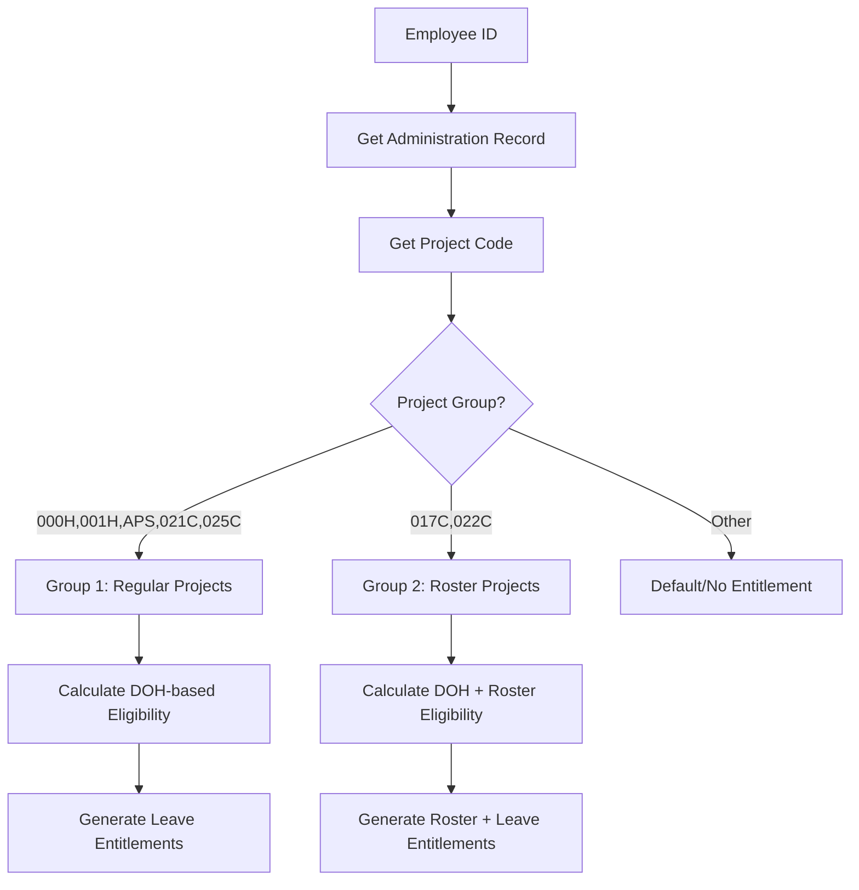

# Leave Entitlement Technical Flow Documentation

## Overview

This document outlines the technical flow for determining employee leave entitlements based on their project assignment, position level, and Date of Hire (DOH).

## System Architecture

### Key Database Tables

-   `employees` - Employee basic information
-   `administrations` - Employee project assignment and DOH data
-   `projects` - Project codes and details
-   `positions` - Position names and details
-   `levels` - Position levels (Non Staff, Foreman, Supervisor, etc.)
-   `leave_types` - Leave type definitions (annual, paid, unpaid, lsl, periodic)
-   `leave_entitlements` - Employee leave allocations by period
-   `roster_templates` - Roster configurations by project and level

## Business Rules

### Project Groups

#### Group 1: Regular Projects

**Project Codes:** `000H`, `001H`, `APS`, `021C`, `025C`

**Available Leave Types:**

-   Annual Leave (`annual`)
-   Paid Leave (`paid`)
-   Unpaid Leave (`unpaid`)
-   Long Service Leave (`lsl`)

**Eligibility Rules:**

-   **0-12 months:** `paid`, `unpaid` only
-   **12-60 months (Staff) / 12-72 months (Non-Staff):** `paid`, `unpaid`, `annual`
-   **After 60 months (Staff) / 72 months (Non-Staff):** `paid`, `unpaid`, `annual`, `lsl`

#### Group 2: Roster-Based Projects

**Project Codes:** `017C`, `022C`

**Available Leave Types:**

-   Periodic Leave (`periodic`) - based on roster cycle
-   Paid Leave (`paid`)
-   Unpaid Leave (`unpaid`)
-   Long Service Leave (`lsl`)

**Eligibility Rules:**

-   **From 0 months onwards:** `paid`, `unpaid`, `periodic`
-   **After 60 months (Staff) / 72 months (Non-Staff):** `paid`, `unpaid`, `periodic`, `lsl`

**Special LSL Rule for Group 2:**

-   LSL can be taken once per calendar year (2025, 2026, etc.)
-   Must be combined with 10 days of periodic leave
-   Tracking required per calendar year

### Roster Configuration for Group 2

| Level                   | Position Examples                           | Work Weeks | Leave Weeks | Pattern |
| ----------------------- | ------------------------------------------- | ---------- | ----------- | ------- |
| Manager/Project Manager | Project Manager                             | 6          | 2           | 6/2     |
| Superintendent          | Mining Superintendent, Plant Superintendent | 6          | 2           | 6/2     |
| Supervisor              | Production Supervisor, Mechanic Supervisor  | 8          | 2           | 8/2     |
| Foreman                 | Production Foreman, Mechanic Foreman        | 9          | 2           | 9/2     |
| Non Staff               | General Helper, Driver, Operator            | 10         | 2           | 10/2    |

## Technical Implementation Flow

### 1. Employee Classification Flow



### 2. DOH Calculation Algorithm

```php
class LeaveEntitlementCalculator
{
    public function calculateMonthsOfService($doh): int
    {
        return Carbon::parse($doh)->diffInMonths(now());
    }

    public function isStaff($levelId): bool
    {
        // Based on levels table - Staff levels vs Non-Staff
        $staffLevels = [
            'Manager', 'Superintendent', 'Supervisor',
            'Director', 'Foreman/Officer'
        ];

        $level = Level::find($levelId);
        return in_array($level->name, $staffLevels);
    }

    public function getEligibilityThreshold($isStaff): int
    {
        return $isStaff ? 60 : 72; // months
    }
}
```

### 3. Leave Type Eligibility Matrix

```php
class LeaveEligibilityMatrix
{
    public function getEligibleLeaveTypes($projectCode, $monthsOfService, $isStaff): array
    {
        $eligibleTypes = [];
        $threshold = $isStaff ? 60 : 72;

        if (in_array($projectCode, ['000H', '001H', 'APS', '021C', '025C'])) {
            // Group 1: Regular Projects
            $eligibleTypes[] = 'paid';
            $eligibleTypes[] = 'unpaid';

            if ($monthsOfService >= 12) {
                $eligibleTypes[] = 'annual';
            }

            if ($monthsOfService >= $threshold) {
                $eligibleTypes[] = 'lsl';
            }

        } elseif (in_array($projectCode, ['017C', '022C'])) {
            // Group 2: Roster Projects
            $eligibleTypes[] = 'paid';
            $eligibleTypes[] = 'unpaid';
            $eligibleTypes[] = 'periodic';

            if ($monthsOfService >= $threshold) {
                $eligibleTypes[] = 'lsl';
            }
        }

        return $eligibleTypes;
    }
}
```

### 4. Roster-Based Leave Calculation

```php
class RosterLeaveCalculator
{
    public function calculatePeriodicLeave($levelId, $projectId): int
    {
        $template = RosterTemplate::where('project_id', $projectId)
            ->where('level_id', $levelId)
            ->where('is_active', true)
            ->first();

        if (!$template) {
            return $this->getDefaultPeriodicDays($levelId);
        }

        return $template->off_days_local * 7; // Convert weeks to days
    }

    private function getDefaultPeriodicDays($levelId): int
    {
        $level = Level::find($levelId);

        $defaults = [
            'Manager' => 14,        // 2 weeks
            'Superintendent' => 14, // 2 weeks
            'Supervisor' => 14,     // 2 weeks
            'Foreman/Officer' => 14,// 2 weeks
            'Non Staff-Non Skill' => 14 // 2 weeks
        ];

        return $defaults[$level->name] ?? 14;
    }
}
```

### 5. LSL Special Rules Implementation

```php
class LSLCalculator
{
    public function canTakeLSLThisYear($employeeId, $year): bool
    {
        // Check if LSL already taken this calendar year
        $existingLSL = LeaveRequest::where('employee_id', $employeeId)
            ->whereHas('leaveType', function($q) {
                $q->where('category', 'lsl');
            })
            ->whereYear('start_date', $year)
            ->where('status', 'approved')
            ->exists();

        return !$existingLSL;
    }

    public function validateLSLWithPeriodic($leaveRequest): bool
    {
        // For Group 2 projects, LSL must be combined with 10 days periodic
        $employee = $leaveRequest->employee;
        $projectCode = $employee->administration->project->project_code;

        if (!in_array($projectCode, ['017C', '022C'])) {
            return true; // No restriction for Group 1
        }

        // Check if there's a corresponding periodic leave request
        $periodicLeave = LeaveRequest::where('employee_id', $employee->id)
            ->whereHas('leaveType', function($q) {
                $q->where('category', 'periodic');
            })
            ->where('start_date', '<=', $leaveRequest->end_date)
            ->where('end_date', '>=', $leaveRequest->start_date)
            ->where('total_days', '>=', 10)
            ->exists();

        return $periodicLeave;
    }
}
```

### 6. Leave Entitlement Generation Process

```php
class LeaveEntitlementService
{
    public function generateAnnualEntitlements($employeeId, $year): void
    {
        $employee = Employee::with('administration.project', 'administration.level')->find($employeeId);

        if (!$employee->administration) {
            throw new Exception('Employee has no active administration record');
        }

        $projectCode = $employee->administration->project->project_code;
        $doh = $employee->administration->doh;
        $levelId = $employee->administration->level_id;

        $calculator = new LeaveEntitlementCalculator();
        $monthsOfService = $calculator->calculateMonthsOfService($doh);
        $isStaff = $calculator->isStaff($levelId);

        $eligibilityMatrix = new LeaveEligibilityMatrix();
        $eligibleTypes = $eligibilityMatrix->getEligibleLeaveTypes($projectCode, $monthsOfService, $isStaff);

        foreach ($eligibleTypes as $category) {
            $leaveType = LeaveType::where('category', $category)->where('is_active', true)->first();

            if (!$leaveType) continue;

            $entitlementDays = $this->calculateEntitlementDays($leaveType, $employee, $year);

            LeaveEntitlement::updateOrCreate([
                'employee_id' => $employeeId,
                'leave_type_id' => $leaveType->id,
                'period_start' => Carbon::create($year, 1, 1),
                'period_end' => Carbon::create($year, 12, 31)
            ], [
                'entitled_days' => $entitlementDays,
                'withdrawable_days' => $entitlementDays,
                'deposit_days' => $leaveType->deposit_days_first ?? 0,
                'carried_over' => 0,
                'taken_days' => 0,
                'remaining_days' => $entitlementDays
            ]);
        }
    }

    private function calculateEntitlementDays($leaveType, $employee, $year): int
    {
        switch ($leaveType->category) {
            case 'annual':
                return $leaveType->default_days ?? 12;

            case 'periodic':
                $rosterCalculator = new RosterLeaveCalculator();
                return $rosterCalculator->calculatePeriodicLeave(
                    $employee->administration->level_id,
                    $employee->administration->project_id
                );

            case 'lsl':
                return $leaveType->default_days ?? 30;

            case 'paid':
            case 'unpaid':
                return $leaveType->default_days ?? 0; // Usually calculated per request

            default:
                return 0;
        }
    }
}
```

## Database Schema Requirements

### Existing Tables to Modify

1. **leave_entitlements** - Already exists, no changes needed
2. **leave_types** - Ensure categories match: `annual`, `paid`, `unpaid`, `lsl`, `periodic`
3. **roster_templates** - Link to projects and levels for Group 2 calculations

### New Indexes for Performance

```sql
-- Optimize leave entitlement queries
CREATE INDEX idx_leave_entitlements_employee_period ON leave_entitlements(employee_id, period_start, period_end);
CREATE INDEX idx_leave_entitlements_type_period ON leave_entitlements(leave_type_id, period_start, period_end);

-- Optimize administration queries
CREATE INDEX idx_administrations_employee_active ON administrations(employee_id, is_active);
CREATE INDEX idx_administrations_project_level ON administrations(project_id, level_id);

-- Optimize leave request queries for LSL validation
CREATE INDEX idx_leave_requests_employee_year ON leave_requests(employee_id, start_date);
```

## API Endpoints

### Employee Leave Entitlements

```
GET /api/employees/{id}/leave-entitlements/{year}
POST /api/employees/{id}/leave-entitlements/generate/{year}
```

### Leave Eligibility Check

```
GET /api/employees/{id}/leave-eligibility
```

### Roster Information (Group 2 only)

```
GET /api/employees/{id}/roster-schedule
```

## Error Handling

1. **Missing Administration Record**: Employee not assigned to project
2. **Invalid Project Code**: Project not in defined groups
3. **Missing Roster Template**: Group 2 project without roster configuration
4. **LSL Validation Failure**: LSL requested without required periodic leave
5. **DOH Validation**: Invalid or missing Date of Hire

## Testing Scenarios

1. **Group 1 Employee with 6 months DOH**: Should get `paid`, `unpaid` only
2. **Group 1 Staff with 18 months DOH**: Should get `paid`, `unpaid`, `annual`
3. **Group 1 Non-Staff with 70 months DOH**: Should get all leave types including `lsl`
4. **Group 2 Employee**: Should get `periodic` leave based on roster template
5. **Group 2 LSL Request**: Should validate 10-day periodic leave requirement
6. **LSL Calendar Year Restriction**: Should prevent duplicate LSL in same year

## UI/UX Flow for Leave Entitlement Management

### 1. Initial Page Load

**Behavior:**

-   Display empty data table with loading state
-   Show project filter dropdown populated with all active projects
-   No employee data displayed initially

**UI Elements:**

-   Project filter dropdown (required selection)
-   Empty data table with placeholder message
-   "Generate Entitlements" button (disabled until project selected)

### 2. Project Filter Selection

**Behavior:**

-   User selects project from dropdown
-   System fetches all active employees assigned to selected project
-   Data table updates with employee list
-   Table columns change based on project type

**API Call:**

```
GET /api/projects/{projectId}/employees/active
```

### 3. Non-Roster Project Display (Group 1)

**Project Codes:** `000H`, `001H`, `APS`, `021C`, `025C`

**Table Columns:**
| Column | Description | Data Source |
|--------|-------------|-------------|
| No | Row number | Sequential |
| NIK | Employee ID | `employees.employee_id` |
| Nama | Employee Name | `employees.name` |
| DOH | Date of Hire | `administrations.doh` |
| Paid | Paid Leave Days | `leave_entitlements` where `leave_type.category = 'paid'` |
| Unpaid | Unpaid Leave Days | `leave_entitlements` where `leave_type.category = 'unpaid'` |
| Annual | Annual Leave Days | `leave_entitlements` where `leave_type.category = 'annual'` |
| LSL | Long Service Leave Days | `leave_entitlements` where `leave_type.category = 'lsl'` |

**Actions Available:**

-   View entitlement details
-   Edit individual entitlements
-   Generate annual entitlements for all employees
-   Export to Excel

### 4. Roster Project Display (Group 2)

**Project Codes:** `017C`, `022C`

**Table Columns:**
| Column | Description | Data Source |
|--------|-------------|-------------|
| No | Row number | Sequential |
| NIK | Employee ID | `employees.employee_id` |
| Nama | Employee Name | `employees.name` |
| DOH | Date of Hire | `administrations.doh` |
| Paid | Paid Leave Days | `leave_entitlements` where `leave_type.category = 'paid'` |
| Unpaid | Unpaid Leave Days | `leave_entitlements` where `leave_type.category = 'unpaid'` |
| LSL | Long Service Leave Days | `leave_entitlements` where `leave_type.category = 'lsl'` |
| Level | Position Level | `levels.name` |
| Periodic | Periodic Leave Days | `leave_entitlements` where `leave_type.category = 'periodic'` |

**Additional Features:**

-   Roster schedule display
-   Periodic leave cycle information
-   LSL + Periodic combination validation

### 5. CRUD Operations Update

#### Project Model Enhancement

**New Fields Required:**

```php
// Add to projects table migration
$table->enum('leave_type', ['non_roster', 'roster'])->default('non_roster');
$table->boolean('has_periodic_leave')->default(false);
```

**Project Model Updates:**

```php
class Project extends Model
{
    protected $fillable = [
        'project_code', 'project_name', 'leave_type', 'has_periodic_leave'
    ];

    public function isRosterProject(): bool
    {
        return $this->leave_type === 'roster';
    }

    public function isNonRosterProject(): bool
    {
        return $this->leave_type === 'non_roster';
    }

    public function getEligibleLeaveTypes(): array
    {
        if ($this->isRosterProject()) {
            return ['paid', 'unpaid', 'periodic', 'lsl'];
        }

        return ['paid', 'unpaid', 'annual', 'lsl'];
    }
}
```

### 6. Frontend Implementation Flow

#### Laravel MVC Structure

Based on existing system patterns, the leave entitlement management will use standard Laravel MVC approach:

#### Controller Implementation

```php
// LeaveEntitlementController.php
class LeaveEntitlementController extends Controller
{
    public function index(Request $request)
    {
        $projects = Project::where('is_active', true)
            ->select('id', 'project_code', 'project_name', 'leave_type')
            ->get();

        $selectedProject = null;
        $employees = collect();

        if ($request->filled('project_id')) {
            $selectedProject = Project::findOrFail($request->project_id);
            $employees = $this->getProjectEmployees($selectedProject);
        }

        return view('leave-entitlements.management', compact(
            'projects',
            'selectedProject',
            'employees'
        ));
    }

    public function generateEntitlements(Request $request)
    {
        $request->validate([
            'project_id' => 'required|exists:projects,id',
            'year' => 'required|integer|min:2020|max:2030'
        ]);

        $project = Project::findOrFail($request->project_id);
        $employees = $this->getProjectEmployees($project);

        foreach ($employees as $employee) {
            $this->generateEmployeeEntitlements($employee, $request->year);
        }

        return redirect()
            ->route('leave-entitlements.management', ['project_id' => $project->id])
            ->with('success', 'Entitlements generated successfully for all employees.');
    }

    public function exportExcel(Request $request)
    {
        $request->validate([
            'project_id' => 'required|exists:projects,id'
        ]);

        $project = Project::findOrFail($request->project_id);
        $employees = $this->getProjectEmployees($project);

        return Excel::download(
            new LeaveEntitlementExport($employees, $project),
            "Leave_Entitlements_{$project->project_code}_{now()->year}.xlsx"
        );
    }

    private function getProjectEmployees($project)
    {
        return Employee::whereHas('administration', function($q) use ($project) {
            $q->where('project_id', $project->id)
              ->where('is_active', true);
        })
        ->with([
            'administration.level',
            'leaveEntitlements.leaveType' => function($q) {
                $q->where('is_active', true);
            }
        ])
        ->get();
    }

    private function generateEmployeeEntitlements($employee, $year)
    {
        $project = $employee->administration->project;
        $eligibleTypes = $project->getEligibleLeaveTypes();

        foreach ($eligibleTypes as $category) {
            $leaveType = LeaveType::where('category', $category)->first();
            if (!$leaveType) continue;

            $entitlementDays = $this->calculateEntitlementDays($leaveType, $employee);

            LeaveEntitlement::updateOrCreate([
                'employee_id' => $employee->id,
                'leave_type_id' => $leaveType->id,
                'period_start' => Carbon::create($year, 1, 1),
                'period_end' => Carbon::create($year, 12, 31)
            ], [
                'entitled_days' => $entitlementDays,
                'withdrawable_days' => $entitlementDays,
                'remaining_days' => $entitlementDays
            ]);
        }
    }
}
```

#### Blade Template Structure

```blade
{{-- resources/views/leave-entitlements/management.blade.php --}}
@extends('layouts.main')

@section('title', 'Leave Entitlement Management')

@section('content')
    <div class="content-header">
        <div class="container-fluid">
            <div class="row mb-2">
                <div class="col-sm-6">
                    <h1 class="m-0">Leave Entitlement Management</h1>
                </div>
                <div class="col-sm-6">
                    <ol class="breadcrumb float-sm-right">
                        <li class="breadcrumb-item"><a href="{{ route('dashboard') }}">Home</a></li>
                        <li class="breadcrumb-item active">Leave Entitlements</li>
                    </ol>
                </div>
            </div>
        </div>
    </div>

    <section class="content">
        <div class="container-fluid">
            <!-- Project Filter Card -->
            <div class="card">
                <div class="card-header">
                    <h3 class="card-title">Project Filter</h3>
                    <div class="card-tools">
                        <button type="button" class="btn btn-tool" data-card-widget="collapse">
                            <i class="fas fa-minus"></i>
                        </button>
                    </div>
                </div>
                <div class="card-body">
                    <form method="GET" action="{{ route('leave-entitlements.management') }}">
                        <div class="row">
                            <div class="col-md-6">
                                <div class="form-group">
                                    <label for="project_id">Select Project</label>
                                    <select name="project_id" id="project_id" class="form-control" required>
                                        <option value="">Choose Project...</option>
                                        @foreach($projects as $project)
                                            <option value="{{ $project->id }}"
                                                    {{ $selectedProject && $selectedProject->id == $project->id ? 'selected' : '' }}>
                                                {{ $project->project_code }} - {{ $project->project_name }}
                                            </option>
                                        @endforeach
                                    </select>
                                </div>
                            </div>
                            <div class="col-md-6">
                                <div class="form-group">
                                    <label>&nbsp;</label>
                                    <div>
                                        <button type="submit" class="btn btn-primary">
                                            <i class="fas fa-search"></i> Load Employees
                                        </button>
                                        <a href="{{ route('leave-entitlements.management') }}" class="btn btn-secondary">
                                            <i class="fas fa-times"></i> Clear
                                        </a>
                                    </div>
                                </div>
                            </div>
                        </div>
                    </form>
                </div>
            </div>

            @if($selectedProject)
                <!-- Generate Entitlements Card -->
                <div class="card">
                    <div class="card-header">
                        <h3 class="card-title">Generate Entitlements</h3>
                    </div>
                    <div class="card-body">
                        <form method="POST" action="{{ route('leave-entitlements.generate') }}">
                            @csrf
                            <input type="hidden" name="project_id" value="{{ $selectedProject->id }}">
                            <div class="row">
                                <div class="col-md-4">
                                    <div class="form-group">
                                        <label for="year">Year</label>
                                        <select name="year" id="year" class="form-control" required>
                                            @for ($year = now()->year - 1; $year <= now()->year + 1; $year++)
                                                <option value="{{ $year }}" {{ $year == now()->year ? 'selected' : '' }}>
                                                    {{ $year }}
                                                </option>
                                            @endfor
                                        </select>
                                    </div>
                                </div>
                                <div class="col-md-4">
                                    <div class="form-group">
                                        <label>&nbsp;</label>
                                        <div>
                                            <button type="submit" class="btn btn-success"
                                                    onclick="return confirm('Generate entitlements for all employees in {{ $selectedProject->project_code }}?')">
                                                <i class="fas fa-plus"></i> Generate Entitlements
                                            </button>
                                        </div>
                                    </div>
                                </div>
                                <div class="col-md-4">
                                    <div class="form-group">
                                        <label>&nbsp;</label>
                                        <div>
                                            <a href="{{ route('leave-entitlements.export', ['project_id' => $selectedProject->id]) }}"
                                               class="btn btn-info">
                                                <i class="fas fa-file-excel"></i> Export Excel
                                            </a>
                                        </div>
                                    </div>
                                </div>
                            </div>
                        </form>
                    </div>
                </div>

                <!-- Employee Entitlements Card -->
                <div class="card">
                    <div class="card-header">
                        <h3 class="card-title">
                            Employee Leave Entitlements - {{ $selectedProject->project_code }}
                            <span class="badge badge-{{ $selectedProject->leave_type === 'roster' ? 'warning' : 'info' }}">
                                {{ ucfirst($selectedProject->leave_type) }} Project
                            </span>
                        </h3>
                    </div>
                    <div class="card-body">
                        <div class="table-responsive">
                            <table class="table table-bordered table-striped">
                                <thead>
                                    <tr>
                                        <th>No</th>
                                        <th>NIK</th>
                                        <th>Nama</th>
                                        <th>DOH</th>
                                        <th>Paid</th>
                                        <th>Unpaid</th>
                                        @if($selectedProject->leave_type === 'roster')
                                            <th>LSL</th>
                                            <th>Level</th>
                                            <th>Periodic</th>
                                        @else
                                            <th>Annual</th>
                                            <th>LSL</th>
                                        @endif
                                        <th>Actions</th>
                                    </tr>
                                </thead>
                                <tbody>
                                    @forelse($employees as $index => $employee)
                                        <tr>
                                            <td>{{ $index + 1 }}</td>
                                            <td>{{ $employee->employee_id }}</td>
                                            <td>{{ $employee->name }}</td>
                                            <td>{{ $employee->administration->doh ? $employee->administration->doh->format('d/m/Y') : 'N/A' }}</td>

                                            @php
                                                $entitlements = $employee->leaveEntitlements->keyBy('leaveType.category');
                                            @endphp

                                            <td>{{ $entitlements->get('paid')->entitled_days ?? 0 }}</td>
                                            <td>{{ $entitlements->get('unpaid')->entitled_days ?? 0 }}</td>

                                            @if($selectedProject->leave_type === 'roster')
                                                <td>{{ $entitlements->get('lsl')->entitled_days ?? 0 }}</td>
                                                <td>{{ $employee->administration->level->name ?? 'N/A' }}</td>
                                                <td>{{ $entitlements->get('periodic')->entitled_days ?? 0 }}</td>
                                            @else
                                                <td>{{ $entitlements->get('annual')->entitled_days ?? 0 }}</td>
                                                <td>{{ $entitlements->get('lsl')->entitled_days ?? 0 }}</td>
                                            @endif

                                            <td>
                                                <div class="btn-group" role="group">
                                                    <a href="{{ route('leave-entitlements.employee.show', $employee->id) }}"
                                                       class="btn btn-info btn-sm">
                                                        <i class="fas fa-eye"></i>
                                                    </a>
                                                    <a href="{{ route('leave-entitlements.employee.edit', $employee->id) }}"
                                                       class="btn btn-warning btn-sm">
                                                        <i class="fas fa-edit"></i>
                                                    </a>
                                                </div>
                                            </td>
                                        </tr>
                                    @empty
                                        <tr>
                                            <td colspan="{{ $selectedProject->leave_type === 'roster' ? '10' : '9' }}" class="text-center">
                                                No employees found for this project.
                                            </td>
                                        </tr>
                                    @endforelse
                                </tbody>
                            </table>
                        </div>
                    </div>
                    <div class="card-footer">
                        <div class="row">
                            <div class="col-sm-5">
                                <div class="dataTables_info">
                                    Showing {{ $employees->count() }} employees
                                </div>
                            </div>
                        </div>
                    </div>
                </div>
            @else
                <!-- Empty State Card -->
                <div class="card">
                    <div class="card-body text-center">
                        <i class="fas fa-filter fa-3x text-muted mb-3"></i>
                        <h4 class="text-muted">Select a Project to View Employee Entitlements</h4>
                        <p class="text-muted">Choose a project from the filter above to load employee leave entitlements.</p>
                    </div>
                </div>
            @endif
        </div>
    </section>
@endsection

@push('scripts')
<script>
$(document).ready(function() {
    // Auto-submit form on project selection
    $('#project_id').change(function() {
        if ($(this).val()) {
            $(this).closest('form').submit();
        }
    });
});
</script>
@endpush
```

### 7. Routes Configuration

#### Web Routes Required

```php
// routes/web.php

// Leave Entitlement Management Routes
Route::middleware(['auth'])->group(function () {

    // Main management page
    Route::get('/leave-entitlements/management', [LeaveEntitlementController::class, 'index'])
        ->name('leave-entitlements.management');

    // Generate entitlements for project
    Route::post('/leave-entitlements/generate', [LeaveEntitlementController::class, 'generateEntitlements'])
        ->name('leave-entitlements.generate');

    // Export Excel
    Route::get('/leave-entitlements/export', [LeaveEntitlementController::class, 'exportExcel'])
        ->name('leave-entitlements.export');

    // Individual employee entitlement management
    Route::get('/leave-entitlements/employee/{employee}', [LeaveEntitlementController::class, 'showEmployee'])
        ->name('leave-entitlements.employee.show');

    Route::get('/leave-entitlements/employee/{employee}/edit', [LeaveEntitlementController::class, 'editEmployee'])
        ->name('leave-entitlements.employee.edit');

    Route::put('/leave-entitlements/employee/{employee}', [LeaveEntitlementController::class, 'updateEmployee'])
        ->name('leave-entitlements.employee.update');
});
```

#### Controller Methods Enhancement

```php
// LeaveEntitlementController.php - Additional Methods

public function showEmployee(Employee $employee)
{
    $employee->load([
        'administration.project',
        'administration.level',
        'leaveEntitlements.leaveType'
    ]);

    return view('leave-entitlements.employee.show', compact('employee'));
}

public function editEmployee(Employee $employee)
{
    $employee->load([
        'administration.project',
        'administration.level',
        'leaveEntitlements.leaveType'
    ]);

    $leaveTypes = LeaveType::where('is_active', true)->get();

    return view('leave-entitlements.employee.edit', compact('employee', 'leaveTypes'));
}

public function updateEmployee(Request $request, Employee $employee)
{
    $request->validate([
        'entitlements' => 'required|array',
        'entitlements.*.leave_type_id' => 'required|exists:leave_types,id',
        'entitlements.*.entitled_days' => 'required|integer|min:0',
        'entitlements.*.year' => 'required|integer|min:2020|max:2030'
    ]);

    foreach ($request->entitlements as $entitlementData) {
        LeaveEntitlement::updateOrCreate([
            'employee_id' => $employee->id,
            'leave_type_id' => $entitlementData['leave_type_id'],
            'period_start' => Carbon::create($entitlementData['year'], 1, 1),
            'period_end' => Carbon::create($entitlementData['year'], 12, 31)
        ], [
            'entitled_days' => $entitlementData['entitled_days'],
            'withdrawable_days' => $entitlementData['entitled_days'],
            'remaining_days' => $entitlementData['entitled_days']
        ]);
    }

    return redirect()
        ->route('leave-entitlements.employee.show', $employee)
        ->with('success', 'Employee entitlements updated successfully.');
}
```

### 8. User Experience Flow

1. **Page Load**: Empty state with project filter
2. **Project Selection**: Loading state while fetching employees
3. **Data Display**: Dynamic table based on project type
4. **Actions**: Context-sensitive actions based on project type
5. **Validation**: Real-time validation for roster-specific rules

## Future Enhancements

1. **Carry-over Logic**: Handle unused annual leave carry-over to next year
2. **Pro-rata Calculations**: For mid-year joiners or project transfers
3. **Leave Balance Integration**: Real-time balance updates from approved requests
4. **Roster Cycle Tracking**: Advanced roster cycle management for Group 2
5. **Bulk Entitlement Generation**: Annual batch processing for all employees
6. **Advanced Filtering**: Filter by level, DOH range, leave status
7. **Bulk Operations**: Mass entitlement updates, approvals, rejections

---

## References

-   Current leave types in system: Annual, Paid (various), Unpaid, Long Service Leave
-   Project codes: 000H, 001H, APS, 017C, 021C, 022C, 025C
-   Position levels: Manager, Superintendent, Supervisor, Foreman, Non Staff
