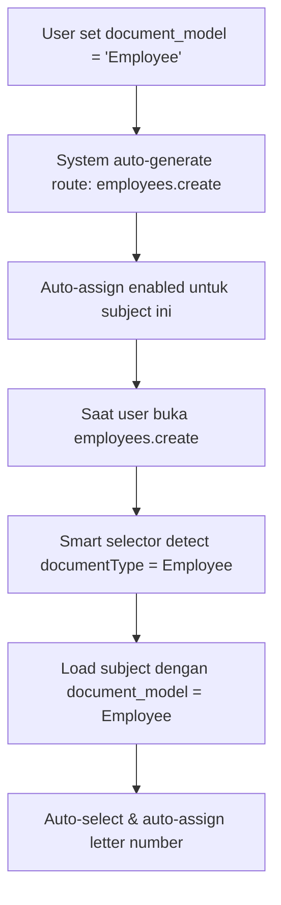

# 🚀 Simple Document Integration Example

## 📋 Overview

Dengan pendekatan **1 kolom saja** (`document_model`), menambahkan document type baru menjadi sangat sederhana!

---

## 🎯 **Contoh: Menambah Employee Contract Integration**

### **Step 1: Setup Subject di Database**

```sql
-- Tambah subject baru atau update yang sudah ada
INSERT INTO letter_subjects (subject_name, category_code, document_model, is_active, user_id)
VALUES ('Kontrak Kerja Karyawan', 'PKWT', 'Employee', 1, 1);

-- Atau via Management UI:
-- 1. Buka: /letter-subjects/simple-integration
-- 2. Edit subject "Kontrak Kerja Karyawan"
-- 3. Set Document Model: "Employee"
-- 4. Save ✅
```

### **Step 2: Model sudah Support (Employee model sudah ada)**

Tidak perlu edit apapun! System otomatis:

-   Route: `employees.create` (auto-generated)
-   Auto-assign: `true` (karena ada document_model)
-   Priority: berdasarkan nama subject

### **Step 3: Update Employee Controller (opsional)**

```php
// File: app/Http/Controllers/EmployeeController.php

class EmployeeController extends BaseDocumentController // Extend BaseDocumentController
{
    // Implement required methods
    protected function getDocumentType(): string
    {
        return 'employee'; // lowercase model name
    }

    protected function getDefaultCategory(): string
    {
        return 'PKWT'; // atau kategori yang sesuai
    }

    protected function getModelClass(): string
    {
        return Employee::class;
    }

    // ... other required methods
}
```

### **Step 4: Update Employee Create View**

```blade
{{-- File: resources/views/employees/create.blade.php --}}

{{-- Tambahkan smart letter selector --}}
@include('components.smart-letter-number-selector', [
    'documentType' => 'Employee',
    'categoryCode' => 'PKWT',
    'autoDetect' => true,
])
```

### **Step 5: Done! ✨**

Sekarang Employee Contract sudah otomatis terintegrasi:

-   Saat buka `employees.create`, system deteksi documentType = 'Employee'
-   Load subject "Kontrak Kerja Karyawan" untuk kategori PKWT
-   Auto-assign letter number PKWT0001/2024
-   User experience yang seamless!

---

## 📊 **Perbandingan: Sebelum vs Sesudah**

### **❌ Sebelum (Complex)**

```sql
-- 5 kolom yang harus diset
document_model: 'Employee'
document_route: 'employees.create'
auto_assign_number: true
priority: 8
document_config: '{"category":"PKWT","fields":[...]}'
```

### **✅ Sesudah (Simple)**

```sql
-- 1 kolom saja!
document_model: 'Employee'
```

**System otomatis handle:**

-   Route: `employee` → `employees.create`
-   Auto-assign: ada `document_model` = auto-assign enabled
-   Priority: order by subject name
-   Config: default values

---

## 🔄 **Flow Integration yang Simpel**



---

## 🎨 **Management UI yang Simple**

**Route**: `/letter-subjects/simple-integration`

**Features:**

-   ✅ **Simple Table**: Category, Subject, Document Model, Status, Auto Route
-   ✅ **1-Click Edit**: Modal dengan 1 dropdown saja (Document Model)
-   ✅ **Auto Preview**: Route auto-generated saat pilih model
-   ✅ **Quick Test**: Test integration connectivity
-   ✅ **Real-time Stats**: Total subjects, integrated, not integrated

---

## 🚀 **Benefits Pendekatan Simple**

### **👨‍💻 Developer Experience**

-   **Minimal Configuration**: 1 field saja
-   **Auto-Convention**: Route naming by convention
-   **No JSON Config**: Simple boolean logic
-   **Quick Setup**: 2 menit untuk document type baru

### **👤 User Experience**

-   **Clean Interface**: Less confusion
-   **Smart Defaults**: System choose best options
-   **Consistent Behavior**: Same experience semua document
-   **Zero Training**: Intuitive untuk semua user

### **🔧 Maintenance**

-   **Less Complexity**: Fewer moving parts
-   **Easier Debugging**: Simple logic flow
-   **Future-Proof**: Convention over configuration
-   **Scalable**: Easy to add new document types

---

## 💡 **Conventions yang Digunakan**

### **Route Generation**

```php
// Model: 'Employee' → Route: 'employees.create'
// Model: 'Officialtravel' → Route: 'officialtravels.create'
// Model: 'Project' → Route: 'projects.create'

// Formula: strtolower($model) + 's.create'
```

### **Auto-Assign Logic**

```php
// Jika document_model != null → auto-assign enabled
// Jika document_model == null → manual only
```

### **Subject Ordering**

```php
// Order by: subject_name ASC (alphabetical)
// Simple & predictable!
```

---

## 🎉 **Conclusion**

**Dengan 1 kolom `document_model` saja**, kita berhasil membuat integration yang:

-   ✅ **Simple to configure**
-   ✅ **Easy to understand**
-   ✅ **Quick to implement**
-   ✅ **Scalable for future**

**Perfect balance antara simplicity dan functionality!** 🚀
