# Supplies — User Manual

**Modul:** Supplies (Office Supply & Consumable)  
**Versi dokumen:** 1.1  
**Terakhir diperbarui:** 2026-09-02  
**Bahasa UI:** English (label menu, kolom, status)  
**Referensi teknis:** `docs/SUPPLIES_DESIGN.md`, `docs/adr/0012-supply-workbook-cutover-seed.md`

---

## 1. Tentang modul ini

Modul **Supplies** mengelola persediaan kantor dan barang consumable di ARKA HERO:

- **Catalog** — daftar barang (kode, nama, satuan)
- **Stock In** — pencatatan barang masuk ke gudang/project
- **Stock Out** — pencatatan barang keluar (pemakaian)
- **Supply Order** — permintaan pembelian / pengadaan ulang barang

Stok dihitung **per Project** (bukan gudang terpisah). Saldo akhir = Stock In − Stock Out untuk item tersebut di project yang dipilih.

**Kategori default:**

| Kategori | Prefix kode | Contoh |
|----------|-------------|--------|
| Office Supply | GAA | GAA001, GAA002 |
| Consumable | GAC | GAC001, GAC002 |

---

## 2. Siapa menggunakan apa?

| Peran | Menu utama | Kegiatan |
|-------|------------|----------|
| **GA / HCS** | GAMMA → Supplies | Kelola catalog, Stock In/Out, semua Supply Orders, dashboard, laporan |
| **Karyawan** | My Features → My Office Supply Orders | Buat permintaan ATK (Office Supply) untuk project aktif |
| **Approver** | Approval Requests | Menyetujui / menolak Supply Order yang diajukan |
| **Admin master data** | Master Data → Supplies Data → Item Categories | Kelola kategori barang |

Akses menu bergantung **permission** role Anda. Jika menu tidak muncul, hubungi administrator.

---

## 3. Navigasi menu

### GAMMA → Supplies

| Menu | URL | Fungsi |
|------|-----|--------|
| Dashboard | `/dashboard/supplies-management` | Ringkasan KPI, grafik, stok rendah, aktivitas terbaru |
| Catalog | `/supplies/catalog` | Daftar barang + saldo per project |
| Stock In | `/supplies/stock-ins` | Dokumen barang masuk |
| Stock Out | `/supplies/stock-outs` | Dokumen barang keluar |
| Orders | `/supplies/orders` | Semua Supply Order (GA) |
| Reports | `/supplies/reports` | Laporan stok & order |

### My Features

| Menu | URL | Fungsi |
|------|-----|--------|
| My Office Supply Orders | `/supplies/orders/my-orders` | Order ATK milik Anda (kategori Office Supply / GAA saja) |

### Master Data → Supplies Data

| Menu | URL | Fungsi |
|------|-----|--------|
| Item Categories | `/supplies/item-categories` | Kategori barang (nama, prefix, deskripsi) |

<p align="center">
    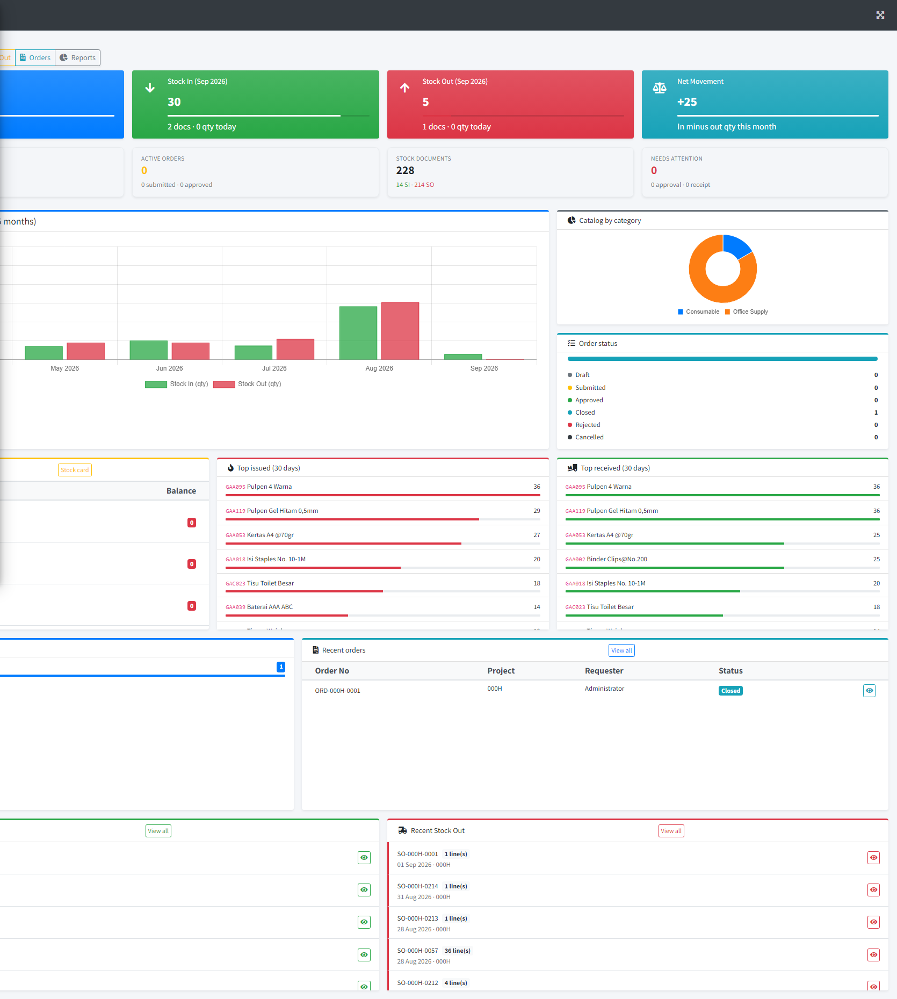
</p>
<p align="center"><em>Gambar 1 — Supplies Dashboard (GAMMA → Supplies → Dashboard)</em></p>

---

## 4. Konsep penting

### 4.1 Project dan saldo stok

- Setiap pergerakan stok terikat pada **satu Project** (mis. `000H` = HO Balikpapan).
- **Ending balance** hanya terlihat di Catalog setelah Anda memilih **filter Project**.
- Tidak ada dokumen transfer antar project; pindah lokasi fisik tetap dicatat sebagai Stock Out di project asal.

### 4.2 Penomoran dokumen

Nomor unik per project, per jenis dokumen:

| Jenis | Format | Contoh |
|-------|--------|--------|
| Supply Order | `ORD-{projectCode}-{seq}` | ORD-000H-0001 |
| Stock In | `SI-{projectCode}-{seq}` | SI-000H-0001 |
| Stock Out | `SO-{projectCode}-{seq}` | SO-000H-0001 |

`seq` = urutan 4 digit per project (0001, 0002, …).

### 4.3 Status Supply Order

| Status | Arti |
|--------|------|
| **Draft** | Masih diedit, belum diajukan |
| **Submitted** | Menunggu approval |
| **Approved** | Disetujui; siap diterima via Stock In |
| **Rejected** | Ditolak approver |
| **Cancelled** | Dibatalkan pembuat / GA |
| **Closed** | Selesai (biasanya setelah penerimaan barang) |

**Penting:** Approval **tidak** mengubah stok. Stok baru bertambah setelah GA membuat **Stock In**.

### 4.4 Stock Out — Location & PIC

Setiap baris Stock Out wajib diisi:

- **Location** — tempat pemakaian (teks bebas, mis. "Office Lt. 1", "HCS")
- **PIC** (Person in Charge) — penanggung jawab pemakaian (teks bebas)

Ini **bukan** field Project; Project tetap di header dokumen.

### 4.5 Stok negatif

Sistem **menolak** Stock Out jika saldo tidak cukup, dan **menolak** hapus Stock In jika akan membuat saldo negatif.

---

## 5. Item Categories (Master Data)

**Menu:** Master Data → Supplies Data → Item Categories

| Field | Keterangan |
|-------|------------|
| Name | Nama kategori (mis. Office Supply) |
| Prefix | Awalan kode item (mis. GAA) — unik |
| Description | Keterangan opsional |
| Status | Active / Inactive |

**Aturan:**

- Prefix tidak bisa diubah jika kategori sudah punya item di catalog.
- Item baru otomatis mendapat kode `{prefix}{nomor urut 3 digit}` (GAA001, GAA002, …).

<p align="center">
    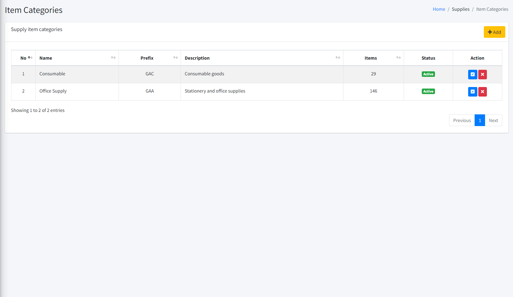
</p>
<p align="center"><em>Gambar 2 — Item Categories (Master Data → Supplies Data)</em></p>

---

## 6. Catalog

**Menu:** GAMMA → Supplies → Catalog

### Melihat saldo

1. Buka halaman Catalog.
2. Pilih **Project** di filter atas tabel.
3. Kolom **Stock In**, **Stock Out**, dan **Ending balance** akan terisi untuk project tersebut.

> Tanpa memilih project, kolom saldo kosong — ini perilaku normal.

<p align="center">
    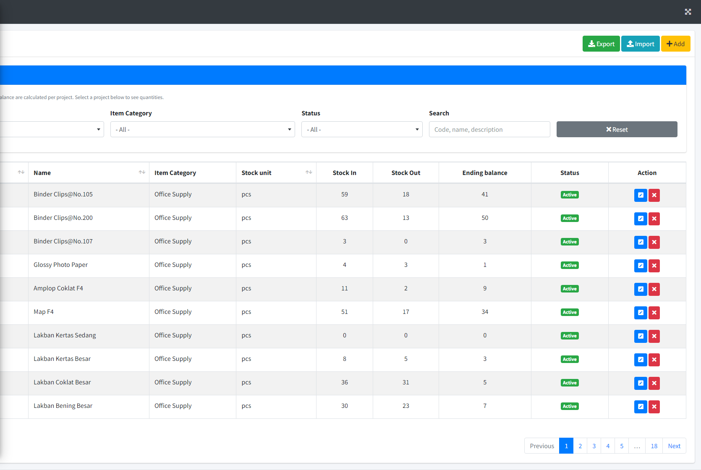
</p>
<p align="center"><em>Gambar 3 — Catalog dengan filter Project terpilih</em></p>

### Menambah item

1. Klik **Add**.
2. Isi: Item Category, Name, Description, Stock unit (mis. `pcs`, `box`).
3. Kode item di-generate otomatis dari prefix kategori.
4. Simpan.

### Import / Export Excel

- **Export** — unduh daftar catalog saat ini.
- **Import** — unggah Excel sesuai template (**Template** tersedia di modal Import).
- Kolom template: `code`, `category_prefix`, `name`, `description`, `stock_unit`, `status`.
- Jika `code` sudah ada → baris tersebut di-update; jika kosong → item baru dibuat.

### Edit / Nonaktifkan

- Edit nama, deskripsi, satuan, status.
- Item yang sudah punya pergerakan stok **tidak bisa dihapus** (gunakan status Inactive).

---

## 7. Stock In

**Menu:** GAMMA → Supplies → Stock In

Mencatat barang **masuk** ke project (pembelian, donasi, saldo awal cutover, penerimaan dari Supply Order).

<p align="center">
    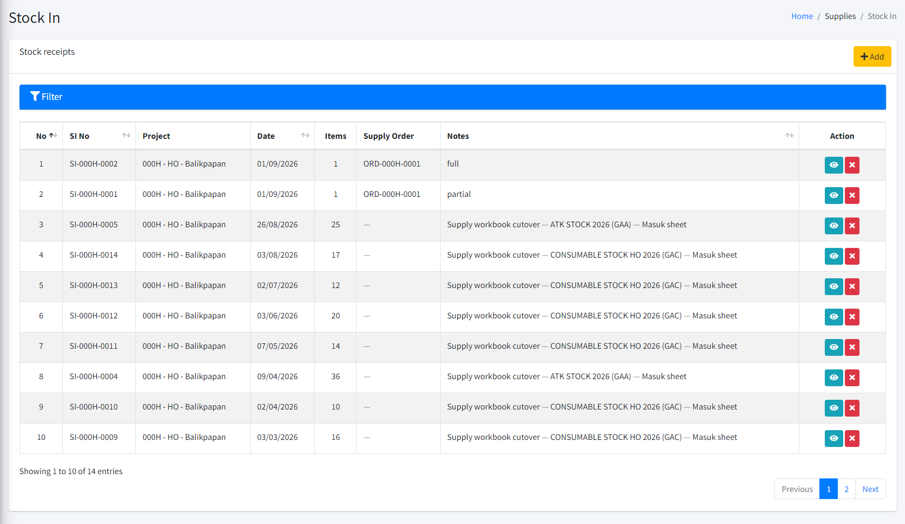
</p>
<p align="center"><em>Gambar 4 — Daftar Stock In</em></p>

### Membuat Stock In manual

1. Klik **Add New** / **Create**.
2. Isi header:
   - **Project** — project penerima
   - **Date** — tanggal penerimaan
   - **Notes** — catatan opsional
3. Tambah baris item:
   - Pilih **Item** dari catalog
   - Isi **Qty in** (bilangan bulat positif)
   - **Remarks** opsional per baris
4. Klik **Add line** untuk baris tambahan.
5. **Save** — nomor `SI-…` terbit otomatis.

<p align="center">
    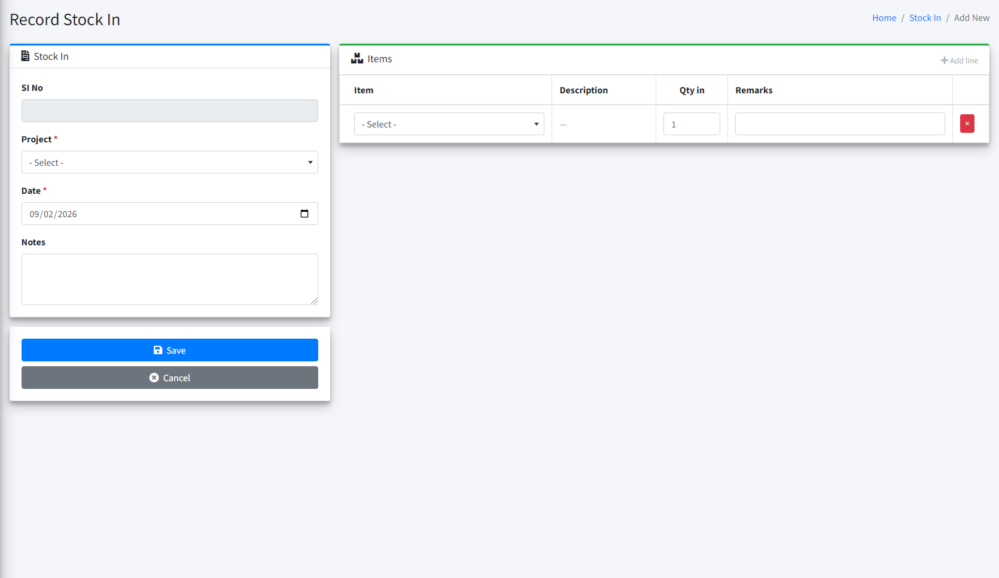
</p>
<p align="center"><em>Gambar 5 — Form buat Stock In (multi-line)</em></p>

### Stock In dari Supply Order (penerimaan)

1. Buka Supply Order berstatus **Approved**.
2. Klik aksi **Receive** / buat Stock In dari order.
3. Form terisi baris order; qty bisa diterima sebagian (partial receipt).
4. Simpan Stock In — qty diterima terhubung ke baris order.

Setelah semua barang diterima, GA dapat **Close** order dari halaman detail order.

### Melihat & cetak

- Klik nomor dokumen untuk detail (header + semua baris).
- **Print** untuk versi cetak.

<p align="center">
    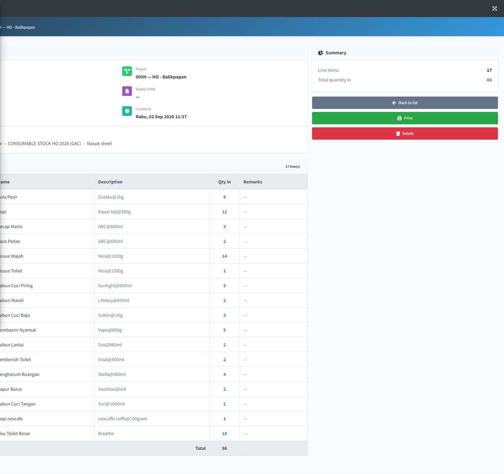
</p>
<p align="center"><em>Gambar 6 — Detail Stock In</em></p>

### Edit Stock In

1. Dari daftar atau detail, klik **Edit** (permission `supplies.stock-in.edit`).
2. **Project** dan nomor SI tidak bisa diubah.
3. Ubah tanggal, notes, baris item, lalu **Update**.
4. Sistem menolak update jika ending balance menjadi negatif, atau qty melebihi outstanding order (jika SI terhubung Supply Order).

### Import / Export Excel

- **Export** — unduh baris item (filter project/tanggal ikut terpakai). Kolom: `document_number`, `project_code`, `stock_date`, `notes`, `item_code`, `quantity`, `remarks`.
- **Import** — unggah Excel sesuai template:
  - `document_number` kosong → buat SI baru (baris dengan project + tanggal + notes sama digabung jadi satu dokumen).
  - `document_number` terisi nomor SI yang ada → update dokumen tersebut (baris diganti).
- Import **tidak** membuat link ke Supply Order (gunakan form Receive untuk penerimaan order).

### Menghapus Stock In

- Hanya jika Anda punya permission delete.
- Sistem cek saldo: penghapusan ditolak jika membuat ending balance negatif.

---

## 8. Stock Out

**Menu:** GAMMA → Supplies → Stock Out

Mencatat barang **keluar** dari stok project (pemakaian harian). Pengambilan fisik dari lemari tidak otomatis — GA yang mencatat Stock Out.

<p align="center">
    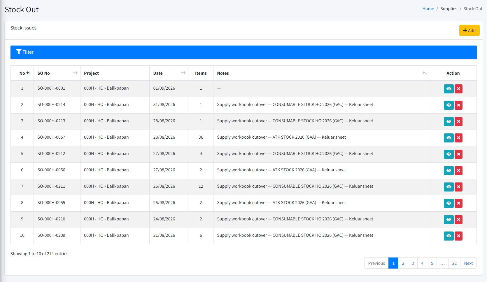
</p>
<p align="center"><em>Gambar 7 — Daftar Stock Out</em></p>

### Membuat Stock Out

1. Klik **Add New**.
2. Isi header: **Project**, **Date**, **Notes**.
3. Per baris isi:
   - **Item**
   - **Qty out** — tidak boleh melebihi saldo tersedia
   - **Location** — lokasi pemakaian
   - **PIC** — penanggung jawab
4. **Save** — nomor `SO-…` terbit otomatis.

<p align="center">
    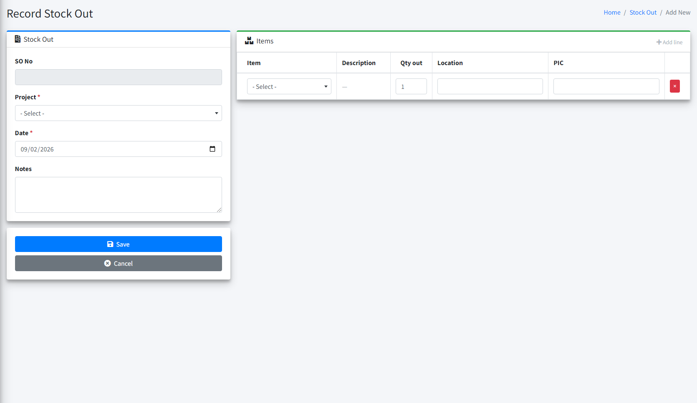
</p>
<p align="center"><em>Gambar 8 — Form buat Stock Out (Location & PIC per baris)</em></p>

<p align="center">
    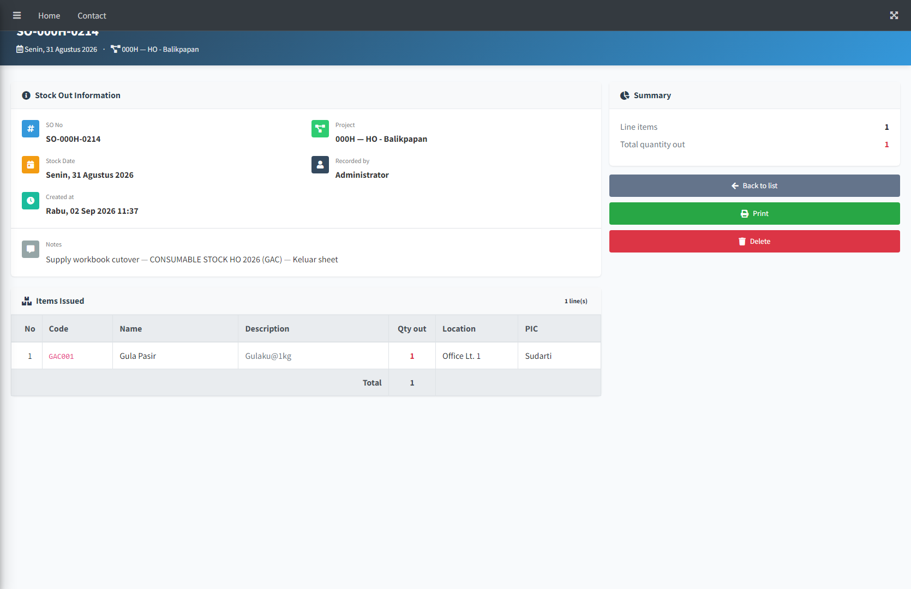
</p>
<p align="center"><em>Gambar 9 — Detail Stock Out</em></p>

### Edit Stock Out

1. Dari daftar atau detail, klik **Edit** (permission `supplies.stock-out.edit`).
2. **Project** dan nomor SO tidak bisa diubah.
3. Ubah tanggal, notes, baris item (qty, location, PIC), lalu **Update**.
4. Sistem menolak jika qty melebihi saldo tersedia (saldo dihitung dengan mengembalikan qty lama dokumen ini terlebih dahulu).

### Import / Export Excel

- **Export** — unduh baris item sesuai filter. Kolom: `document_number`, `project_code`, `stock_date`, `notes`, `item_code`, `quantity`, `location`, `person_in_charge`.
- **Import** — sama pola Stock In: nomor kosong = create, nomor terisi = update. `location` dan `person_in_charge` wajib.

### Tips

- Satu dokumen bisa multi-baris (beberapa item sekaligus).
- Jika qty ditolak, cek saldo di Catalog untuk project yang sama.

---

## 9. Supply Order

### 9.1 My Office Supply Orders (karyawan)

**Menu:** My Features → My Office Supply Orders

Untuk meminta pengadaan **Office Supply (GAA)** saja.

<p align="center">
    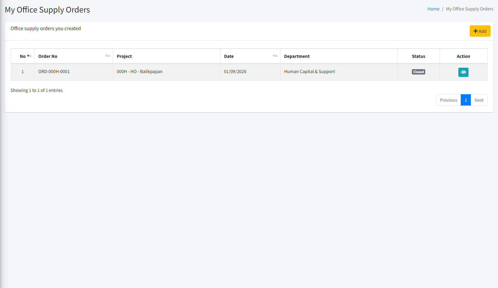
</p>
<p align="center"><em>Gambar 10 — My Office Supply Orders (My Features)</em></p>

**Alur:**

1. **Create** — isi tanggal, department (otomatis dari data Anda), baris item + qty + remarks.
2. **Save** — status **Draft**.
3. Pilih **manual approvers** (sama seperti modul approval lain).
4. **Submit for Approval** — status **Submitted**.
5. Tunggu approval di menu **Approval Requests**.
6. Setelah **Approved**, GA akan menerima barang via Stock In.
7. Anda bisa **Cancel** selama masih Draft atau Submitted.

**Catatan:**

- Project mengikuti **administration aktif** Anda — tidak ada pilihan project manual.
- Hanya item kategori Office Supply (GAA) yang bisa dipilih.

### 9.2 Supply Orders (GA / HCS)

**Menu:** GAMMA → Supplies → Orders

<p align="center">
    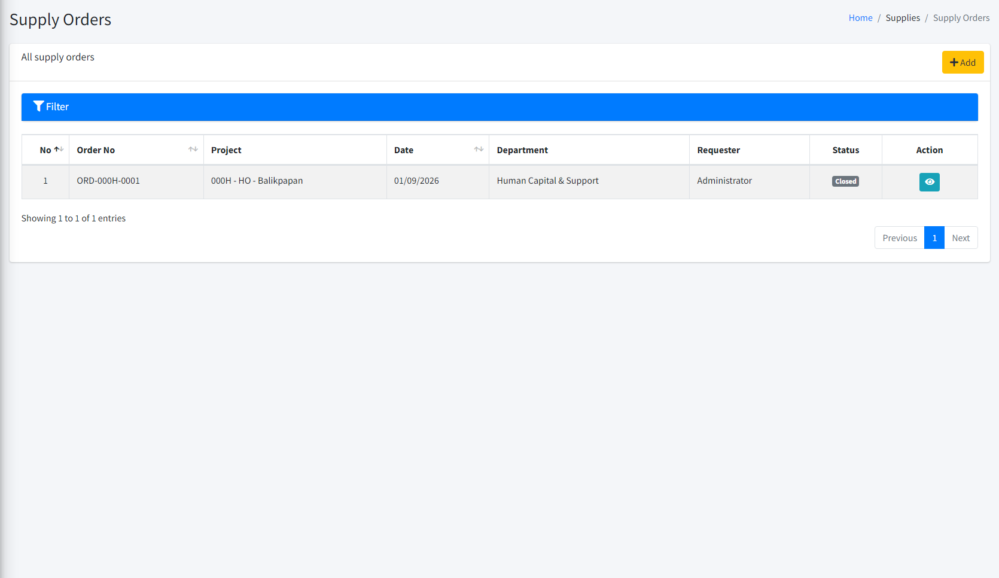
</p>
<p align="center"><em>Gambar 11 — Supply Orders (GA / HCS)</em></p>

<p align="center">
    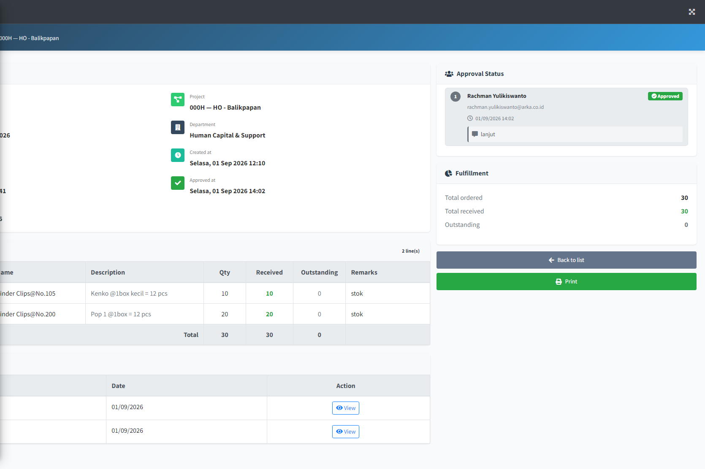
</p>
<p align="center"><em>Gambar 12 — Detail Supply Order</em></p>

Sama seperti order karyawan, tetapi:

- Bisa membuat order untuk semua kategori item (GAA + GAC).
- Melihat semua order di project yang Anda akses.
- Bisa **Close** order yang sudah Approved setelah penerimaan selesai.

### 9.3 Partial receipt

Order bisa diterima bertahap:

- Stock In pertama: terima sebagian qty.
- Stock In berikutnya: sisa qty.
- Laporan **Order Fulfillment Gap** menampilkan qty yang belum diterima.

---

## 10. Dashboard Supplies

**Menu:** GAMMA → Supplies → Dashboard  
**URL:** `/dashboard/supplies-management`

Ringkasan untuk GA:

| Bagian | Isi |
|--------|-----|
| KPI cards | Jumlah catalog, Stock In/Out bulan ini, net movement |
| Grafik 6 bulan | Trend qty masuk vs keluar |
| Low stock (≤ 10) | Item saldo rendah di project scope Anda |
| Top issued / received | Barang paling sering keluar / masuk (30 hari) |
| Top projects | Project dengan order terbanyak |
| Recent orders / SI / SO | Aktivitas terbaru (area scroll) |

**Quick actions** di atas dashboard: Catalog, Stock In, Stock Out, Orders, Reports.

<p align="center">
    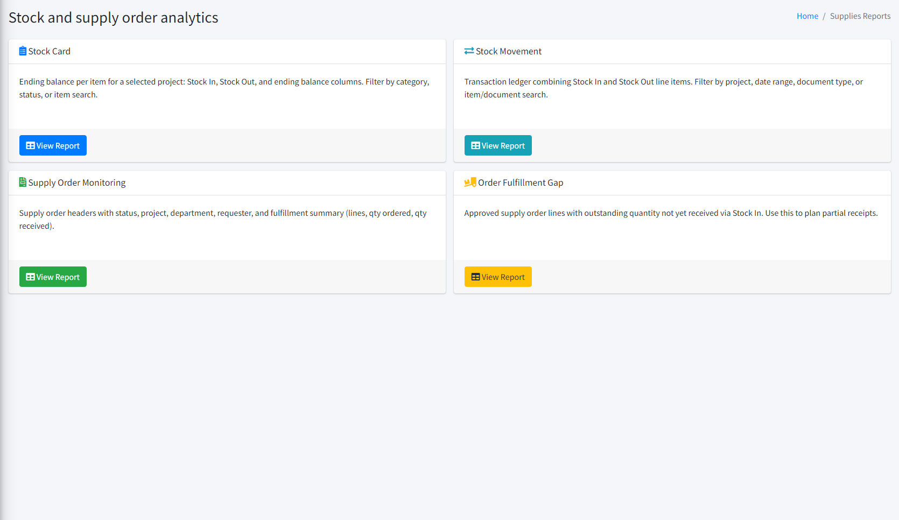
</p>
<p align="center"><em>Gambar 13 — Menu Reports</em></p>

---

## 11. Laporan (Reports)

**Menu:** GAMMA → Supplies → Reports

| Laporan | Kegunaan |
|---------|----------|
| **Stock Card** | Saldo akhir per item per project (Stock In, Stock Out, ending balance) |
| **Stock Movement** | Buku besar transaksi: semua baris SI & SO dengan filter tanggal |
| **Supply Order Monitoring** | Daftar order + status + ringkasan penerimaan |
| **Order Fulfillment Gap** | Baris order Approved yang qty-nya belum lunas diterima |

Semua laporan mendukung **filter** (project, tanggal, kategori, pencarian) dan **Export** ke Excel.

<p align="center">
    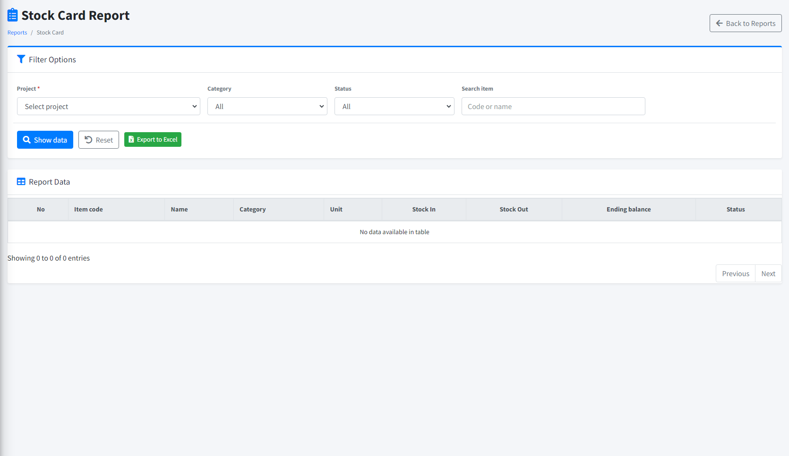
</p>
<p align="center"><em>Gambar 14 — Laporan Stock Card</em></p>

---

## 12. Alur kerja lengkap (contoh)

### Skenario A — Karyawan minta ATK

```
Karyawan: buat My Office Supply Order (Draft)
    → Submit + pilih approver
Approver: approve di Approval Requests
GA: buat Stock In dari order (partial atau full)
GA: Close order
```

### Skenario B — GA catat pemakaian harian

```
Karyawan ambil barang dari lemari (di luar sistem)
GA: buat Stock Out (item, qty, location, PIC)
Saldo catalog project berkurang
```

### Skenario C — GA beli consumable tanpa order

```
GA: buat Stock In langsung (tanpa link order)
Saldo catalog project bertambah
```

### Skenario D — Cek stok sebelum order

```
GA: buka Catalog → pilih Project 000H
GA: lihat Ending balance per item
GA: buat Supply Order jika perlu restock (meski saldo > 0)
```

---

## 13. FAQ & pemecahan masalah

### Catalog saldo kosong semua?

Pilih **Project** di filter Catalog. Saldo selalu per project.

### Stock Out ditolak "insufficient balance"?

Saldo item di project tersebut tidak cukup. Cek Catalog atau laporan Stock Card.

### Order sudah Approved tapi stok belum naik?

Normal. Buat **Stock In** dan hubungkan ke order tersebut.

### Saya tidak melihat menu Supplies?

Permission belum diberikan. Hubungi administrator untuk role GA/HCS.

### My Office Supply Orders tidak bisa pilih item GAC?

By design — menu personal hanya untuk **Office Supply (GAA)**. Consumable diorder oleh GA melalui **Supplies → Orders**.

### Bisakah mengubah nomor dokumen?

Tidak. Nomor `ORD-`, `SI-`, `SO-` di-generate sistem.

### Data awal dari Excel lama?

Saat go-live, GA menjalankan **cutover seed** sekali dari workbook Excel (Katalog + Masuk + Keluar). Setelah itu semua transaksi baru lewat aplikasi.

---

## 14. Glosarium singkat

| Istilah | Arti |
|---------|------|
| Catalog | Master daftar barang |
| Ending balance | Saldo akhir = total Stock In − total Stock Out |
| Opening balance | Saldo awal saat cutover (dicatat sebagai Stock In pembukaan) |
| Project | Lokasi kepemilikan stok (mis. 000H) |
| Location (Stock Out) | Tempat pemakaian baris keluar — bukan project |
| PIC | Penanggung jawab pemakaian pada baris Stock Out |
| Partial receipt | Penerimaan order tidak harus sekaligus |

---

## 15. Kontak & dukungan

Untuk masalah akses, permission, atau data awal cutover, hubungi **tim GA/HCS** atau **administrator sistem ARKA HERO**.

Untuk permintaan fitur baru, dokumentasikan kebutuhan bisnis dan ajukan ke tim pengembang dengan merujuk modul **Supplies** di ARKA HERO.
