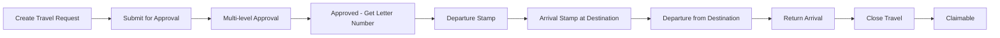
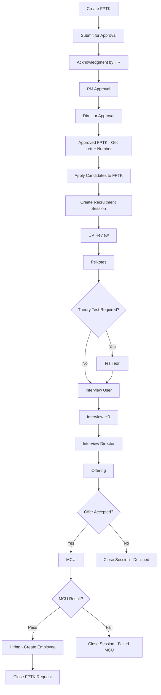
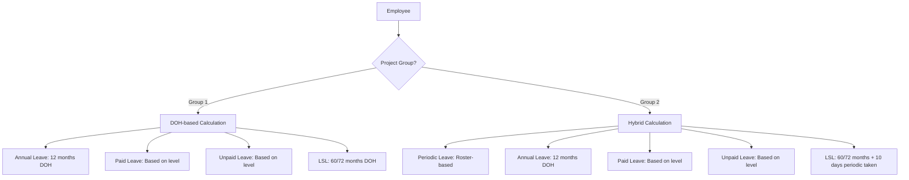
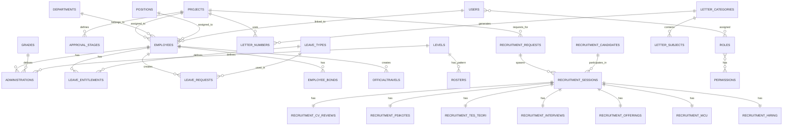
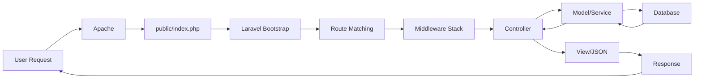
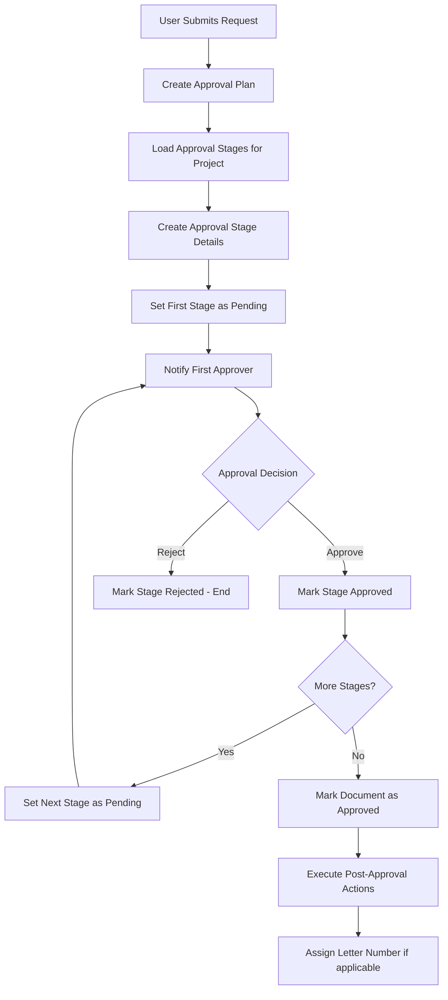
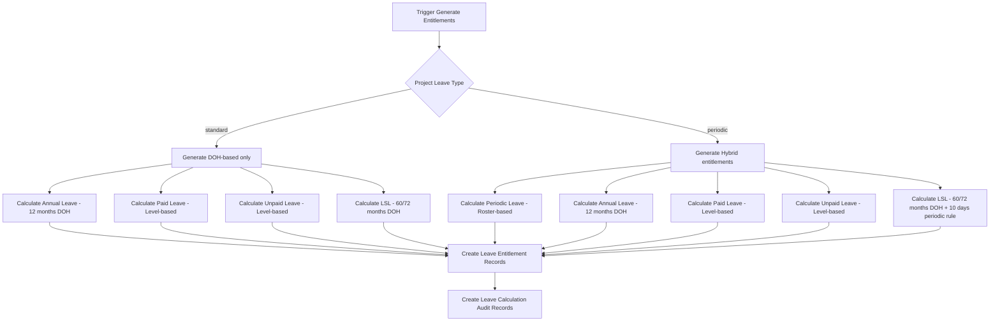
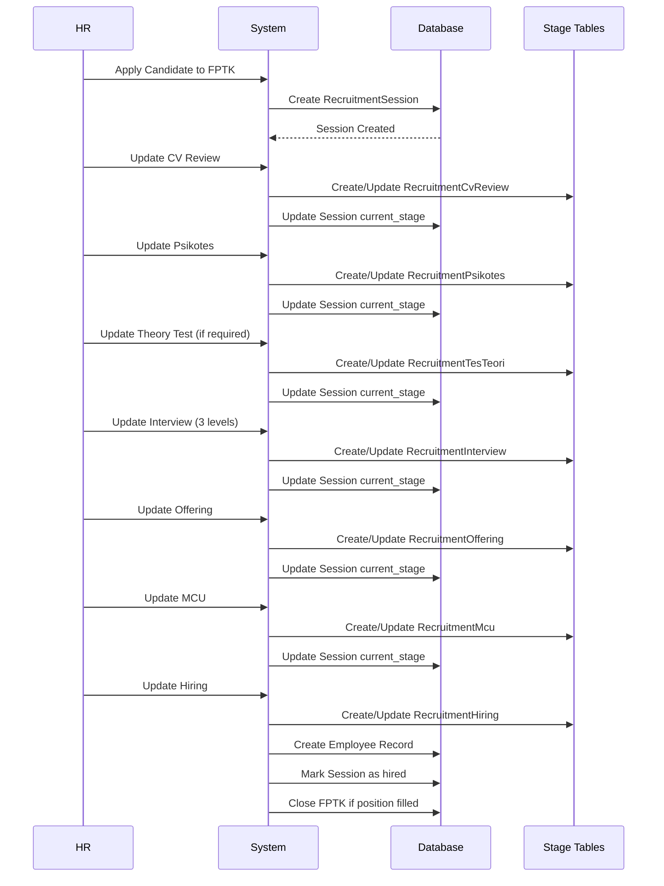

Purpose: Technical reference for understanding system design and development patterns
Last Updated: 2026-01-09

## Architecture Documentation Guidelines

### Document Purpose

This document describes the CURRENT WORKING STATE of the application architecture. It serves as:

-   Technical reference for understanding how the system currently works
-   Onboarding guide for new developers
-   Design pattern documentation for consistent development
-   Schema and data flow documentation reflecting actual implementation

### What TO Include

-   **Current Technology Stack**: Technologies actually in use
-   **Working Components**: Components that are implemented and functional
-   **File and Function Descriptions**: Short descriptions of ALL the files and functions in the codebase
-   **Actual Database Schema**: Tables, fields, and relationships as they exist
-   **Implemented Data Flows**: How data actually moves through the system
-   **Working API Endpoints**: Routes that are active and functional
-   **Deployment Patterns**: How the system is actually deployed
-   **Security Measures**: Security implementations that are active

### What NOT to Include

-   **Issues or Bugs**: These belong in `MEMORY.md` with technical debt entries
-   **Limitations or Problems**: Document what IS working, not what isn't
-   **Future Plans**: Enhancement ideas belong in `backlog.md`
-   **Deprecated Features**: Remove outdated information rather than marking as deprecated
-   **Wishlist Items**: Planned features that aren't implemented yet

### Update Guidelines

-   **Reflect Reality**: Always document the actual current state, not intended state
-   **Schema Notes**: When database schema has unused fields, note them factually
-   **Cross-Reference**: Link to other docs when appropriate, but don't duplicate content

### For AI Coding Agents

-   **Investigate Before Updating**: Use codebase search to verify current implementation
-   **Move Issues to Memory**: If you discover problems, document them in `MEMORY.md`
-   **Factual Documentation**: Describe what exists, not what should exist

---

# ARKA HERO - HR Management System Architecture

## Project Overview

**ARKA HERO** is a comprehensive Human Resource Management System (HRMS) built for ARKA company. It manages the complete employee lifecycle from recruitment to termination, including employee data management, official travel, leave management, recruitment workflows, letter administration, and employee performance tracking.

### Key Business Value

-   Centralized employee information management across multiple projects
-   Automated approval workflows for official travel, leave requests, and recruitment
-   Comprehensive leave entitlement system with roster-based and DOH-based calculations
-   Integrated letter numbering system for document administration
-   Multi-level recruitment process with stage tracking
-   Self-service portals for employees (registration, leave requests, travel history)

## Technology Stack

### Backend

-   **Framework**: Laravel 10.x (PHP 8.1+)
-   **Database**: MySQL (via Laravel Eloquent ORM)
-   **Authentication**: Laravel Sanctum (API token authentication)
-   **Authorization**: Spatie Laravel Permission (RBAC)
-   **Excel Processing**: Maatwebsite Laravel Excel
-   **PDF Generation**: Built-in Laravel PDF capabilities
-   **Email**: PHPMailer
-   **Development Tools**: Clockwork (debugging), Laravel Tinker
-   **Database Abstraction**: Doctrine DBAL

### Frontend

-   **UI Framework**: AdminLTE 3 (Bootstrap 4 based)
-   **JavaScript**: jQuery, DataTables
-   **Charts**: Chart.js (for dashboard visualizations)
-   **Icons**: Font Awesome
-   **Notifications**: SweetAlert2 (via RealRashid package)
-   **Date Pickers**: Bootstrap DateTimePicker
-   **Select2**: Enhanced select dropdowns

### Infrastructure

-   **Local Development**: Laragon (Apache, MySQL, PHP)
-   **Server**: Apache Web Server
-   **Base URL**: `http://localhost/arka-hero` (development)
-   **Session Storage**: Database-backed sessions
-   **File Storage**: Local filesystem (storage/app)

### Key Dependencies

```json
{
    "laravel/framework": "^10.0",
    "laravel/sanctum": "^3.2",
    "spatie/laravel-permission": "^6.16",
    "maatwebsite/excel": "^3.1",
    "yajra/laravel-datatables-oracle": "^10.0",
    "realrashid/sweet-alert": "^6.0",
    "phpmailer/phpmailer": "^6.7",
    "itsgoingd/clockwork": "^5.1",
    "cviebrock/eloquent-sluggable": "^10.0"
}
```

## Core Modules

### 1. Employee Management

**Controllers**: `EmployeeController`, `EmployeeRegistrationController`, `EmployeeRegistrationAdminController`
**Models**: `Employee`, `EmployeeRegistration`, `EmployeeRegistrationToken`, `RegistrationDocument`

**Features**:

-   Complete employee profile management (personal, family, education, work experience)
-   Employee self-service registration with token-based invitation system
-   Employee sub-modules: licenses, insurances, families, courses, educations, job experiences, bank accounts, tax identifications
-   Employee bonds tracking with violation management
-   Employee termination workflows
-   Import/Export functionality with Excel
-   Employee classification by project, department, staff type
-   Image gallery management for employee documents

**Key Routes**:

-   Web: `/employees/*` - Full CRUD + sub-resources
-   API: `/api/v1/employees/*` - RESTful API with authentication

### 2. Official Travel Management

**Controllers**: `OfficialtravelController`, `OfficialtravelApiController`
**Models**: `Officialtravel`, `OfficialtravelStop`, `Officialtravel_detail`

**Features**:

-   Official travel request creation with multi-destination support
-   Approval workflow integration (multi-level approval)
-   Arrival and departure stamp tracking per destination
-   Letter number integration for travel documents
-   Claim management system (claimable vs already-claimed)
-   Travel status tracking (draft, pending, approved, on-trip, completed, closed)
-   Self-service portal for employees to track their travels
-   Excel export with comprehensive travel data

**Key Routes**:

-   Web: `/officialtravels/*` - Full management interface
-   API: `/api/official-travels/*` - Search, detail, claim endpoints
-   Self-service: `/officialtravels/my-travels` - Employee portal

**Data Flow**:



### 3. Recruitment Management

**Controllers**: `RecruitmentRequestController`, `RecruitmentCandidateController`, `RecruitmentSessionController`, `RecruitmentReportController`, `ManPowerPlanController`
**Models**: `RecruitmentRequest` (FPTK), `RecruitmentCandidate`, `RecruitmentSession`, `RecruitmentCvReview`, `RecruitmentPsikotes`, `RecruitmentTesTeori`, `RecruitmentInterview`, `RecruitmentOffering`, `RecruitmentMcu`, `RecruitmentHiring`, `ManPowerPlan`, `ManPowerPlanDetail`

**Features**:

-   FPTK (Formasi Permintaan Tenaga Kerja) - Workforce requisition system
-   3-level approval workflow (Acknowledgment → PM Approval → Director Approval)
-   Candidate database with CV management and blacklist feature
-   Multi-stage recruitment process:
    1. CV Review
    2. Psychometric Test (Psikotes)
    3. Theory Test (optional, based on position requirements)
    4. Interview (User/Functional → HR → Director)
    5. Offering & Negotiation
    6. Medical Check-up (MCU)
    7. Hiring (Contract type selection)
-   Man Power Plan (MPP) integration
-   Session-based tracking per candidate per FPTK
-   Recruitment reports:
    -   Funnel analysis (conversion rates per stage)
    -   Time-to-hire metrics
    -   Offer acceptance rate
    -   Interview assessment analytics
    -   Stale candidates tracking
    -   Aging report
-   Self-service portal for hiring managers to create FPTK

**Key Routes**:

-   Web: `/recruitment/requests/*` - FPTK management
-   Web: `/recruitment/candidates/*` - Candidate database
-   Web: `/recruitment/sessions/*` - Session tracking
-   Web: `/recruitment/reports/*` - Analytics and reports
-   API: `/api/v1/recruitment/*` - Full RESTful API

**Recruitment Workflow**:



### 4. Leave Management

**Controllers**: `LeaveRequestController`, `LeaveEntitlementController`, `LeaveTypeController`, `LeaveReportController`, `BulkLeaveRequestController`, `RosterController`
**Models**: `LeaveRequest`, `LeaveEntitlement`, `LeaveType`, `LeaveCalculation`, `LeaveRequestCancellation`, `Roster`, `RosterDetail`, `RosterDailyStatus`

**Features**:

-   Comprehensive leave entitlement system with two calculation methods:
    -   **DOH-based** (Date of Hiring): Annual leave, Long Service Leave (LSL), Paid/Unpaid leave
    -   **Roster-based**: Periodic leave for shift workers (Group 2 projects)
-   Project group classification:
    -   **Group 1**: Standard projects (000H, 001H, APS, 021C, 025C) - DOH-based entitlements
    -   **Group 2**: Operational projects (017C, 022C) - Roster-based periodic + DOH-based
-   Leave request workflow with approval routing
-   Leave cancellation system with approval flow
-   Auto-conversion of unpaid to annual leave (configurable)
-   Bulk periodic leave request creation
-   Roster management with cycle-based patterns (6/2, 8/2, 9/2, 10/2)
-   LSL special rules:
    -   Staff: 60 months DOH eligibility
    -   Non-staff: 72 months DOH eligibility
    -   Group 2: Requires 10 days periodic leave taken before LSL
-   Leave reports:
    -   Monitoring report (all leave requests)
    -   Cancellation report
    -   Entitlement detailed report
    -   Auto-conversion tracking
-   Self-service portal for employees

**Key Routes**:

-   Web: `/leave/requests/*` - Leave request management
-   Web: `/leave/entitlements/*` - Entitlement configuration
-   Web: `/leave/types/*` - Master data for leave types
-   Web: `/leave/periodic-requests/*` - Bulk periodic leave creation
-   Web: `/rosters/*` - Roster management
-   API: `/api/v1/leave/*` - Full RESTful API
-   Self-service: `/leave/my-requests` - Employee portal

**Leave Entitlement Calculation Flow**:



### 5. Letter Numbering & Administration

**Controllers**: `LetterNumberController`, `LetterCategoryController`, `LetterSubjectController`
**Models**: `LetterNumber`, `LetterCategory`, `LetterSubject`

**Features**:

-   Centralized letter number management system
-   Integration with Official Travel and Recruitment (FPTK) documents
-   Category-based numbering with configurable formats
-   Subject template management per category
-   Letter number lifecycle:
    -   Available → Reserved → Used
    -   Cancellation support
-   Project-specific letter numbering
-   Auto-assignment via API integration
-   Manual assignment for non-integrated documents
-   Excel export/import for bulk operations

**Letter Number Format**:

-   Pattern: `{sequential_number}/{category_code}/{subject_code}/{project_code}/{month_roman}/{year}`
-   Example: `001/ST/DP/000H/I/2026`

**Key Routes**:

-   Web: `/letter-numbers/*` - Letter number management
-   Web: `/letter-categories/*` - Category configuration
-   Web: `/letter-subjects/*` - Subject templates
-   API: `/api/v1/letter-numbers/*` - Integration API for documents

### 6. Dashboard & Analytics

**Controllers**: `DashboardController`, `ProfileController`
**Features**:

-   Multi-dashboard architecture:
    -   **Main Dashboard**: Overview of all modules
    -   **Employee Dashboard**: Employee statistics by department, project, recent hires
    -   **Official Travel Dashboard**: Pending approvals, arrivals, departures
    -   **Recruitment Dashboard**: Pipeline overview, pending tasks
    -   **Letter Administration Dashboard**: Letters by category, recent letters, statistics
    -   **Leave Management Dashboard**: Open requests, pending cancellations, employees without entitlements, expiring entitlements
    -   **Personal Dashboard**: User-specific quick access
-   Project and department summary views
-   Employee classification views (staff, employment type)
-   Birthday tracking
-   Real-time statistics and charts

**Key Routes**:

-   Web: `/dashboard` - Main dashboard
-   Web: `/dashboard/employees` - Employee analytics
-   Web: `/dashboard/official-travel` - Travel analytics
-   Web: `/dashboard/recruitment` - Recruitment analytics
-   Web: `/dashboard/leave-management` - Leave analytics
-   API: `/api/v1/dashboard/*` - Dashboard data endpoints

### 7. User & Permission Management

**Controllers**: `UserController`, `RoleController`, `PermissionController`, `AuthController`
**Models**: `User`, Spatie Permission models (Role, Permission)

**Features**:

-   Role-Based Access Control (RBAC) using Spatie Laravel Permission
-   Predefined roles:
    -   Administrator (full system access)
    -   HR Supervisor
    -   HR Manager
    -   Division Manager
    -   User (employee self-service)
-   Permission-based feature access
-   User-project and user-department associations
-   Sanctum token authentication for API
-   Password change functionality
-   Profile management

**Key Routes**:

-   Web: `/users/*` - User management
-   Web: `/roles/*` - Role management
-   Web: `/permissions/*` - Permission management
-   Web: `/login`, `/logout` - Authentication
-   API: `/api/v1/auth/*` - API authentication

### 8. Master Data Management

**Controllers**: `BankController`, `ReligionController`, `ProjectController`, `DepartmentController`, `PositionController`, `GradeController`, `LevelController`, `TransportationController`, `AccommodationController`

**Features**:

-   Banks - Banking institutions master data
-   Religions - Religion master data
-   Projects - Company projects with leave type classification
-   Departments - Organizational departments
-   Positions - Job positions with import/export
-   Grades - Employee grade classifications
-   Levels - Employee level classifications with roster patterns
-   Transportations - Travel transportation types
-   Accommodations - Travel accommodation types

**Key Routes**:

-   Web: `/banks/*`, `/religions/*`, `/projects/*`, `/departments/*`, `/positions/*`, `/grades/*`, `/levels/*`, `/transportations/*`, `/accommodations/*`
-   API: `/api/v1/master/*` - Master data API endpoints

### 9. Employee Bonds & Violations

**Controllers**: `EmployeeBondController`, `BondViolationController`
**Models**: `EmployeeBond`, `BondViolation`

**Features**:

-   Employee bond tracking (training bonds, scholarships)
-   Bond expiry monitoring
-   Bond violation recording with penalty calculation
-   Document attachment support
-   Bond completion marking

**Key Routes**:

-   Web: `/employee-bonds/*` - Bond management
-   Web: `/bond-violations/*` - Violation tracking
-   API: `/api/v1/bond-violations/*` - API access

## Database Schema Overview

### Core Tables (140 migrations)

**User & Authentication**:

-   `users` - System users with role assignments
-   `personal_access_tokens` - Sanctum API tokens
-   `password_resets` - Password reset tokens
-   `failed_jobs` - Failed queue jobs
-   `notifications` - System notifications

**Employee Management**:

-   `employees` - Employee master data
-   `licenses` - Employee licenses
-   `insurances` - Employee insurance records
-   `families` - Employee family members
-   `educations` - Educational background
-   `courses` - Training courses
-   `emrgcalls` - Emergency contacts
-   `additionaldatas` - Additional employee data
-   `employeebanks` - Bank account information
-   `administrations` - Employment contracts and status
-   `jobexperiences` - Work experience
-   `operableunits` - Equipment/tools assigned
-   `taxidentifications` - Tax identification numbers
-   `images` - Employee photo gallery
-   `employee_bonds` - Training/scholarship bonds
-   `bond_violations` - Bond violation records

**Project & Organization**:

-   `projects` - Company projects (with `leave_type` field for group classification)
-   `departments` - Organizational departments
-   `positions` - Job positions
-   `banks` - Banking institutions
-   `religions` - Religion master data
-   `grades` - Employee grades
-   `levels` - Employee levels with roster configuration
-   `transportations` - Transportation types
-   `accommodations` - Accommodation types

**Official Travel**:

-   `officialtravels` - Travel request master
-   `officialtravel_details` - Travel expense details
-   `officialtravel_stops` - Multi-destination tracking (arrival/departure stamps)

**Recruitment**:

-   `recruitment_requests` - FPTK (Workforce requisition)
-   `recruitment_candidates` - Candidate database
-   `recruitment_sessions` - Candidate-FPTK session tracking
-   `recruitment_cv_reviews` - CV review stage data
-   `recruitment_psikotes` - Psychometric test results
-   `recruitment_tes_teori` - Theory test results
-   `recruitment_interviews` - Interview results (3 levels)
-   `recruitment_offerings` - Offer details and negotiation
-   `recruitment_mcu` - Medical check-up results
-   `recruitment_hiring` - Hiring decision and contract type
-   `recruitment_documents` - Supporting documents per stage
-   `man_power_plans` - Manpower planning
-   `man_power_plan_details` - MPP position details

**Leave Management**:

-   `leave_types` - Leave type master data
-   `leave_entitlements` - Employee leave balances
-   `leave_requests` - Leave request transactions
-   `leave_calculations` - Calculation audit trail
-   `leave_request_cancellations` - Cancellation requests
-   `rosters` - Employee roster assignments
-   `roster_details` - Roster cycle details
-   `roster_daily_status` - Daily roster status tracking

**Letter Administration**:

-   `letter_categories` - Letter categories (e.g., ST - Official Travel)
-   `letter_subjects` - Letter subject templates
-   `letter_numbers` - Letter number records with lifecycle status

**Approval System**:

-   `approval_stages` - Approval stage templates per project
-   `approval_stage_details` - Detailed stage configuration
-   `approval_plans` - Approval plan instances for documents

**Employee Registration**:

-   `employee_registration_tokens` - Invitation tokens
-   `employee_registrations` - Self-service registration data
-   `registration_documents` - Registration supporting documents

**Permission System** (Spatie):

-   `roles` - System roles
-   `permissions` - System permissions
-   `model_has_permissions` - Direct user permissions
-   `model_has_roles` - User role assignments
-   `role_has_permissions` - Role permissions

**Pivot Tables**:

-   `user_project` - User-project associations
-   `user_department` - User-department associations

### Key Relationships



## API Architecture

### API Versioning Strategy

-   **Legacy Endpoints**: `/api/{resource}` (no version prefix) - Used for backward compatibility
-   **Versioned Endpoints**: `/api/v1/{resource}` - Current standard for new endpoints

### Authentication

-   **Method**: Laravel Sanctum token-based authentication
-   **Header**: `Authorization: Bearer {token}`
-   **Endpoints**:
    -   `POST /api/v1/auth/login` - Login and get token
    -   `POST /api/v1/auth/logout` - Revoke token
    -   `GET /api/v1/auth/user` - Get authenticated user

### API Endpoints by Module

**Master Data**:

-   `GET/POST/PUT/DELETE /api/positions` - Positions CRUD
-   `GET/POST/PUT/DELETE /api/departments` - Departments CRUD
-   `GET/POST/PUT/DELETE /api/projects` - Projects CRUD
-   `GET/POST/PUT/DELETE /api/v1/master/banks` - Banks CRUD
-   `GET/POST/PUT/DELETE /api/v1/master/religions` - Religions CRUD
-   `GET/POST/PUT/DELETE /api/v1/master/grades` - Grades CRUD
-   `GET/POST/PUT/DELETE /api/v1/master/levels` - Levels CRUD
-   `GET/POST/PUT/DELETE /api/v1/master/transportations` - Transportations CRUD
-   `GET/POST/PUT/DELETE /api/v1/master/accommodations` - Accommodations CRUD

**Employees**:

-   `GET /api/employees` - List employees with pagination
-   `GET /api/employees/list` - Get employees for dropdowns
-   `GET /api/employees/active` - Active employees only
-   `POST /api/employees/search` - Search employees
-   `GET/POST/PUT/DELETE /api/v1/employees/{id}` - Full CRUD with auth
-   `GET/POST/DELETE /api/v1/employees/{id}/licenses` - Employee licenses
-   `GET/POST/DELETE /api/v1/employees/{id}/insurances` - Employee insurances
-   `GET/POST/DELETE /api/v1/employees/{id}/families` - Employee families
-   `GET/POST/DELETE /api/v1/employees/{id}/courses` - Employee courses
-   `GET/POST/DELETE /api/v1/employees/{id}/educations` - Employee educations
-   `GET/POST/DELETE /api/v1/employees/{id}/job-experiences` - Job experiences
-   `GET/POST/DELETE /api/v1/employees/{id}/banks` - Bank accounts
-   `GET/POST/PUT/DELETE /api/v1/employees/{id}/administrations` - Contracts
-   `GET/POST/DELETE /api/v1/employees/{id}/tax-identifications` - Tax IDs
-   `GET/POST/PUT/DELETE/PATCH /api/v1/employees/{id}/bonds` - Employee bonds

**Official Travels**:

-   `POST /api/official-travels/search` - Search travel requests
-   `POST /api/official-travels/search-claimed` - Already claimed travels
-   `POST /api/official-travels/search-claimable` - Claimable travels
-   `POST /api/official-travels/detail` - Get travel detail
-   `PUT /api/official-travels/claim` - Update claim status
-   `GET/POST/PUT/DELETE /api/v1/official-travels/{id}` - Full CRUD with auth
-   `POST /api/v1/official-travels/{id}/submit` - Submit for approval
-   `POST /api/v1/official-travels/{id}/arrival` - Arrival stamp
-   `POST /api/v1/official-travels/{id}/departure` - Departure stamp
-   `PATCH /api/v1/official-travels/{id}/close` - Close travel

**Recruitment**:

-   `GET/POST/PUT/DELETE /api/v1/recruitment/requests/*` - FPTK management
-   `POST /api/v1/recruitment/requests/{id}/submit` - Submit FPTK
-   `POST /api/v1/recruitment/requests/{id}/acknowledge` - Acknowledge FPTK
-   `POST /api/v1/recruitment/requests/{id}/approve-pm` - PM approval
-   `POST /api/v1/recruitment/requests/{id}/approve-director` - Director approval
-   `GET/POST/PUT/DELETE /api/v1/recruitment/candidates/*` - Candidate management
-   `POST /api/v1/recruitment/candidates/{id}/apply-to-fptk` - Apply candidate
-   `POST /api/v1/recruitment/candidates/{id}/blacklist` - Blacklist candidate
-   `GET/POST/PUT/DELETE /api/v1/recruitment/sessions/*` - Session management
-   `POST /api/v1/recruitment/sessions/{id}/update-cv-review` - Update CV review
-   `POST /api/v1/recruitment/sessions/{id}/update-psikotes` - Update psikotes
-   `POST /api/v1/recruitment/sessions/{id}/update-tes-teori` - Update theory test
-   `POST /api/v1/recruitment/sessions/{id}/update-interview` - Update interview
-   `POST /api/v1/recruitment/sessions/{id}/update-offering` - Update offering
-   `POST /api/v1/recruitment/sessions/{id}/update-mcu` - Update MCU
-   `POST /api/v1/recruitment/sessions/{id}/update-hiring` - Update hiring
-   `POST /api/v1/recruitment/sessions/{id}/close-request` - Close session

**Leave Management**:

-   `GET /api/leave/types` - List leave types
-   `GET /api/leave/types/{id}/statistics` - Leave type statistics
-   `GET /api/leave/employees/{id}/balance` - Employee leave balance
-   `GET/POST/PUT/DELETE /api/v1/leave/requests/*` - Leave request CRUD
-   `POST /api/v1/leave/requests/{id}/approve` - Approve leave
-   `POST /api/v1/leave/requests/{id}/reject` - Reject leave
-   `POST /api/v1/leave/requests/{id}/close` - Close leave
-   `POST /api/v1/leave/requests/{id}/cancellation` - Request cancellation
-   `POST /api/v1/leave/cancellations/{id}/approve` - Approve cancellation
-   `POST /api/v1/leave/cancellations/{id}/reject` - Reject cancellation
-   `GET/POST/PUT/DELETE /api/v1/leave/entitlements/*` - Entitlement management
-   `POST /api/v1/leave/entitlements/generate-project` - Generate entitlements
-   `POST /api/v1/leave/entitlements/clear-entitlements` - Clear all entitlements

**Letter Numbers**:

-   `POST /api/v1/letter-numbers/request` - Request new letter number
-   `POST /api/v1/letter-numbers/{id}/mark-as-used` - Mark as used
-   `POST /api/v1/letter-numbers/{id}/cancel` - Cancel letter number
-   `GET /api/v1/letter-numbers/available/{categoryId}` - Available numbers
-   `GET /api/v1/letter-numbers/subjects/{categoryId}` - Subjects by category
-   `POST /api/v1/letter-numbers/check-availability` - Check availability
-   `POST /api/v1/letter-numbers/preview-next-number` - Preview next number

**Dashboard**:

-   `GET /api/v1/dashboard/stats` - Overall statistics
-   `GET /api/v1/dashboard/pending-recommendations` - Pending recommendations
-   `GET /api/v1/dashboard/pending-approvals` - Pending approvals
-   `GET /api/v1/dashboard/employees` - Employee dashboard data
-   `GET /api/v1/dashboard/employees-by-department` - Employees by department
-   `GET /api/v1/dashboard/employees-by-project` - Employees by project
-   `GET /api/v1/dashboard/leave-management/stats` - Leave statistics
-   `GET /api/v1/dashboard/leave-management/open-requests` - Open leave requests

**User Management**:

-   `GET/POST/PUT/DELETE /api/v1/users/*` - User management
-   `GET/POST/PUT/DELETE /api/v1/roles/*` - Role management
-   `GET/POST/PUT/DELETE /api/v1/permissions/*` - Permission management

**Employee Registration**:

-   `GET /api/v1/employee-registrations` - List registrations
-   `GET /api/v1/employee-registrations/pending` - Pending registrations
-   `GET /api/v1/employee-registrations/tokens` - Registration tokens
-   `POST /api/v1/employee-registrations/invite` - Send invitation
-   `POST /api/v1/employee-registrations/bulk-invite` - Bulk invitation
-   `POST /api/v1/employee-registrations/{id}/approve` - Approve registration
-   `POST /api/v1/employee-registrations/{id}/reject` - Reject registration

**Other Endpoints**:

-   `GET/POST/PUT/DELETE /api/v1/terminations/*` - Termination management
-   `GET/POST/PUT/DELETE /api/v1/bond-violations/*` - Bond violations
-   `POST /api/v1/emails/send` - Send email

### API Response Format

Standard JSON response structure:

```json
{
    "success": true,
    "message": "Operation successful",
    "data": {
        /* response data */
    }
}
```

Error response:

```json
{
    "success": false,
    "message": "Error message",
    "errors": {
        /* validation errors */
    }
}
```

### API Rate Limiting

-   Public routes (employee registration): 10 requests per minute
-   Authenticated routes: Default Laravel throttle (60 per minute)

## Security Implementation

### Authentication & Authorization

-   **Session-based Auth**: For web interface (Laravel's default session driver)
-   **Token-based Auth**: Laravel Sanctum for API authentication
-   **RBAC**: Spatie Laravel Permission package for role and permission management
-   **Password Hashing**: Bcrypt hashing for user passwords
-   **Middleware Protection**: All authenticated routes protected with `auth` or `auth:sanctum` middleware

### CSRF Protection

-   CSRF token validation on all POST/PUT/DELETE/PATCH requests
-   Automatic token generation in Blade templates via `@csrf` directive

### Input Validation

-   Form Request classes for complex validation
-   Controller-level validation for simple cases
-   Database-level constraints (foreign keys, unique constraints)
-   XSS protection via Laravel's automatic escaping in Blade templates

### File Upload Security

-   File type validation (CV uploads, supporting documents)
-   File size limits
-   Storage in protected directories (storage/app)
-   Controlled file access via download routes with authentication check

### API Security

-   Token expiration (Sanctum tokens)
-   Request throttling/rate limiting
-   CORS configuration for API endpoints
-   Authentication required for sensitive endpoints

### Database Security

-   Parameterized queries via Eloquent ORM (SQL injection protection)
-   Database credentials in environment variables
-   Foreign key constraints for referential integrity

### Sensitive Data Protection

-   Employee personal data access restricted by role/permission
-   Salary information access restricted
-   Document access requires authentication and authorization check

## Deployment Architecture

### Development Environment

-   **Server**: Laragon (Windows) - Apache + MySQL + PHP
-   **Web Root**: `C:\laragon\www\arka-hero`
-   **URL**: `http://localhost/arka-hero`
-   **PHP Version**: 8.1+
-   **MySQL**: Latest version via Laragon
-   **Node.js**: For asset compilation (npm/Vite)

### Application Structure

```
arka-hero/
├── app/
│   ├── Console/Commands/         # Artisan commands
│   ├── Enums/                    # Enum classes
│   ├── Exports/                  # Excel export classes (19 exporters)
│   ├── Helpers/                  # Helper functions (Common.php)
│   ├── Http/
│   │   ├── Controllers/          # 62 controllers
│   │   ├── Middleware/           # 12 custom middleware
│   │   └── Resources/            # API resources
│   ├── Imports/                  # Excel import classes (24 importers)
│   ├── Mail/                     # Email templates
│   ├── Models/                   # 62 Eloquent models
│   ├── Observers/                # Model observers
│   ├── Providers/                # Service providers
│   ├── Services/                 # Business logic services
│   └── Traits/                   # Reusable traits
├── bootstrap/                    # Bootstrap files
├── config/                       # Configuration files
├── database/
│   ├── migrations/               # 140 migration files
│   ├── seeders/                  # 19 seeder classes
│   └── factories/                # Model factories
├── docs/                         # Documentation
│   ├── architecture.md           # This file
│   ├── todo.md                   # Task tracking
│   ├── backlog.md                # Feature backlog
│   └── decisions.md              # Technical decisions
├── public/                       # Web root
│   ├── assets/                   # AdminLTE assets
│   ├── images/                   # Public images
│   └── index.php                 # Entry point
├── resources/
│   ├── css/                      # Custom CSS
│   ├── js/                       # Custom JavaScript
│   └── views/                    # 266 Blade templates
├── routes/
│   ├── web.php                   # Web routes (762 lines)
│   ├── api.php                   # API routes (410 lines)
│   ├── console.php               # Console routes
│   └── channels.php              # Broadcast channels
├── storage/                      # File storage
│   ├── app/                      # Application files
│   ├── framework/                # Framework cache
│   └── logs/                     # Application logs
├── tests/                        # PHPUnit tests
└── vendor/                       # Composer dependencies
```

### Configuration Files

-   `.env` - Environment configuration (not in repository)
-   `.env.example` - Environment template
-   `config/app.php` - Application configuration
-   `config/database.php` - Database configuration
-   `config/sanctum.php` - API authentication configuration
-   `config/permission.php` - Permission system configuration
-   `config/excel.php` - Excel import/export configuration
-   `config/sweetalert.php` - SweetAlert notification configuration

### Asset Compilation

-   **Vite**: Modern asset bundler
-   **CSS**: Compiled from `resources/css/app.css`
-   **JavaScript**: Compiled from `resources/js/app.js`
-   **Build Command**: `npm run build`
-   **Dev Command**: `npm run dev`

### File Storage

-   **Driver**: Local filesystem
-   **Storage Path**: `storage/app`
-   **Subdirectories**:
    -   `storage/app/cv/` - Candidate CVs
    -   `storage/app/documents/` - Employee documents
    -   `storage/app/registration-documents/` - Registration documents
    -   `storage/app/bonds/` - Bond documents
    -   `storage/app/leaves/` - Leave supporting documents

### Logging

-   **Driver**: Daily log files
-   **Location**: `storage/logs/laravel-{date}.log`
-   **Log Level**: Configurable via `.env` (default: debug in development)
-   **Clockwork**: Development debugging tool (accessible at `/clockwork`)

### Database Migrations

-   **Total Migrations**: 140 files
-   **Migration Command**: `php artisan migrate`
-   **Seeding Command**: `php artisan db:seed`
-   **Fresh Install**: `php artisan migrate:fresh --seed`

### Backup & Maintenance

-   Database backups via MySQL dump
-   File storage backups (storage/app)
-   Log rotation configured in logging config

## Data Flow Patterns

### Request Lifecycle



### Approval Workflow Pattern



### Leave Entitlement Generation Pattern



### Recruitment Session Flow Pattern



### Letter Number Assignment Flow

```mermaid
graph LR
    A[Document Created] --> B{Requires Letter Number?}
    B -->|Yes| C[API: POST /letter-numbers/request]
    B -->|No| D[Document Complete]
    C --> E[System Generates Next Sequential Number]
    E --> F[Create LetterNumber Record - Status: reserved]
    F --> G[Assign to Document via related_document_id]
    G --> H[Document Submitted/Used]
    H --> I[API: POST /letter-numbers/{id}/mark-as-used]
    I --> J[Update Status: used]
    J --> D
```

## Helper Functions & Utilities

### Global Helper Functions (`app/Helpers/Common.php`)

-   `toast_success($message)` - Display success toast notification
-   `toast_error($message)` - Display error toast notification
-   `toast_warning($message)` - Display warning toast notification
-   `toast_info($message)` - Display info toast notification

### Traits

-   Custom traits in `app/Traits/` for code reusability

### Services

-   Business logic abstraction in `app/Services/`
-   6 service classes for complex operations

### Custom Commands

-   7 Artisan commands in `app/Console/Commands/` for maintenance tasks

## Frontend Architecture

### View Layer

-   **Template Engine**: Blade (Laravel's templating engine)
-   **Total Views**: 266 Blade templates
-   **Layout Pattern**: Master layout with section inheritance
-   **Main Layout**: `resources/views/layouts/app.blade.php` (AdminLTE 3 based)

### JavaScript Architecture

-   **Core Library**: jQuery
-   **DataTables**: Server-side processing for large datasets
-   **AJAX**: For dynamic content loading and form submissions
-   **Chart.js**: Dashboard visualizations
-   **Select2**: Enhanced select dropdowns with search
-   **SweetAlert2**: Beautiful modals and confirmations
-   **Custom Scripts**: Module-specific JavaScript in view files

### CSS Architecture

-   **Framework**: Bootstrap 4 (via AdminLTE 3)
-   **Icons**: Font Awesome 5
-   **Custom Styles**: `resources/css/app.css`
-   **AdminLTE**: Comprehensive admin template with widgets, cards, tables

### Form Handling

-   **Validation**: Client-side (HTML5 + jQuery) and server-side (Laravel)
-   **CSRF Protection**: Automatic token inclusion via `@csrf` directive
-   **Method Spoofing**: `@method('PUT')` for RESTful routes
-   **File Uploads**: `enctype="multipart/form-data"` with client-side preview

### Component Organization

```
resources/views/
├── layouts/
│   ├── app.blade.php                # Main layout
│   └── partials/                    # Reusable partials (sidebar, header, footer)
├── dashboard/                       # Dashboard views
├── employees/                       # Employee management views
├── officialtravels/                 # Official travel views
├── recruitment/                     # Recruitment module views
│   ├── requests/                    # FPTK views
│   ├── candidates/                  # Candidate views
│   └── sessions/                    # Session tracking views
├── leave/                           # Leave management views
│   ├── requests/                    # Leave request views
│   ├── entitlements/                # Entitlement views
│   └── reports/                     # Leave reports
├── letter-numbers/                  # Letter number management views
├── users/                           # User management views
├── roles/                           # Role management views
├── permissions/                     # Permission management views
└── auth/                            # Authentication views (login, register)
```

## Performance Considerations

### Database Optimization

-   **Indexing**: Foreign keys indexed by migrations
-   **Eager Loading**: Using `with()` to prevent N+1 queries
-   **Pagination**: All large datasets paginated (DataTables server-side processing)
-   **Query Optimization**: Select only needed columns

### Caching Strategy

-   **Config Cache**: `php artisan config:cache` for production
-   **Route Cache**: `php artisan route:cache` for production
-   **View Cache**: Blade templates compiled and cached

### Asset Optimization

-   **Minification**: CSS and JS minified in production build
-   **CDN**: AdminLTE and libraries loaded from local installation
-   **Browser Caching**: HTTP headers for static assets

### Code Optimization

-   **Lazy Loading**: Heavy modules loaded on-demand
-   **Service Layer**: Business logic separated for reusability
-   **Queue Jobs**: Email sending and heavy operations queued (configured but not extensively used)

## Testing Infrastructure

### Test Structure

-   **Framework**: PHPUnit 10.x
-   **Test Types**: Feature tests and Unit tests
-   **Test Location**: `tests/` directory
-   **Test Command**: `php artisan test`

### Current Test Coverage

-   Minimal test coverage (2 feature tests in `tests/Feature/`)
-   Opportunity for improvement in test coverage

## Known Patterns & Conventions

### Naming Conventions

-   **Controllers**: Singular resource name + `Controller` suffix
-   **Models**: Singular, CamelCase
-   **Database Tables**: Plural, snake_case
-   **Routes**: RESTful naming (index, create, store, show, edit, update, destroy)
-   **Views**: Folder structure mirrors controller structure

### Code Style

-   **PSR-12**: PHP coding standard
-   **Laravel Conventions**: Following Laravel best practices
-   **Blade Syntax**: Clean template syntax with minimal logic

### Error Handling

-   **Try-Catch**: Used in controllers for database operations
-   **Form Validation**: Request validation with custom error messages
-   **Toast Notifications**: User-friendly error messages via toast helper
-   **Log Errors**: Critical errors logged to `storage/logs/`

### Common Patterns

-   **Repository Pattern**: Not strictly implemented, using Eloquent directly
-   **Service Pattern**: Used for complex business logic
-   **Observer Pattern**: Model observers for automated actions
-   **Factory Pattern**: Database seeders use factories for test data

## Integration Points

### External Systems

-   **Email System**: PHPMailer for sending emails (registration invitations, notifications)
-   **No External APIs**: Currently self-contained system

### Internal Integrations

-   **Official Travel ↔ Letter Number**: Auto-assignment of letter numbers to approved travels
-   **Recruitment ↔ Letter Number**: Auto-assignment of letter numbers to approved FPTKs
-   **Recruitment ↔ Employee**: Hired candidates automatically create employee records
-   **Leave ↔ Roster**: Periodic leave calculation integrated with roster patterns
-   **Employee ↔ User**: Employees can be linked to user accounts for self-service
-   **Approval System ↔ Documents**: Generic approval workflow for multiple document types

## Monitoring & Debugging

### Development Tools

-   **Clockwork**: Performance profiling and debugging (`/clockwork`)
-   **Laravel Tinker**: Interactive REPL for testing
-   **Laravel Telescope**: Not installed (consider for advanced debugging)

### Error Tracking

-   **Log Files**: Daily log rotation in `storage/logs/`
-   **Error Pages**: Custom error pages for 404, 500, etc.
-   **Debug Mode**: Configurable via `.env` (APP_DEBUG)

### Performance Monitoring

-   **Query Logging**: Enabled in development via Clockwork
-   **Execution Time**: Tracked in Clockwork
-   **Memory Usage**: Monitored in Clockwork

---

## Quick Reference

### Key File Locations

-   **Routes**: `routes/web.php`, `routes/api.php`
-   **Controllers**: `app/Http/Controllers/`
-   **Models**: `app/Models/`
-   **Views**: `resources/views/`
-   **Migrations**: `database/migrations/`
-   **Seeders**: `database/seeders/`
-   **Helpers**: `app/Helpers/Common.php`
-   **Config**: `config/`
-   **Documentation**: `docs/`

### Common Artisan Commands

```bash
# Database
php artisan migrate
php artisan migrate:fresh --seed
php artisan db:seed

# Cache
php artisan config:cache
php artisan route:cache
php artisan view:clear
php artisan cache:clear

# Development
php artisan serve
php artisan tinker
php artisan make:controller ControllerName
php artisan make:model ModelName -m
php artisan make:migration create_table_name

# Testing
php artisan test
```

### Environment Variables

```env
APP_NAME="ARKA HERO"
APP_URL=http://localhost/arka-hero
DB_CONNECTION=mysql
DB_HOST=127.0.0.1
DB_PORT=3306
DB_DATABASE=arka_hero
DB_USERNAME=root
DB_PASSWORD=
```

---

**Last Updated**: 2026-01-09 by AI Agent
**Next Review**: When major architectural changes are implemented
