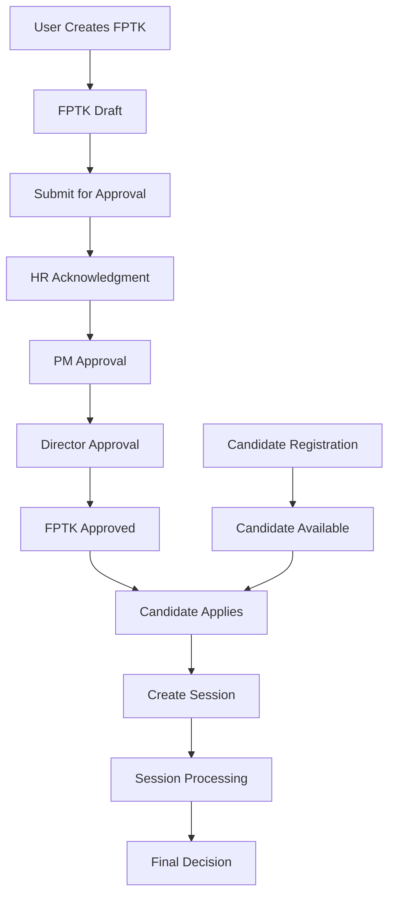

Purpose: Technical reference for understanding system design and development patterns
Last Updated: 2025-01-15

## Architecture Documentation Guidelines

### Document Purpose

This document describes the CURRENT WORKING STATE of the application architecture. It serves as:

-   Technical reference for understanding how the system currently works
-   Onboarding guide for new developers
-   Design pattern documentation for consistent development
-   Schema and data flow documentation reflecting actual implementation

### What TO Include

-   **Current Technology Stack**: Technologies actually in use
-   **Working Components**: Components that are implemented and functional
-   **Actual Database Schema**: Tables, fields, and relationships as they exist
-   **Implemented Data Flows**: How data actually moves through the system
-   **Working API Endpoints**: Routes that are active and functional
-   **Deployment Patterns**: How the system is actually deployed
-   **Security Measures**: Security implementations that are active

### What NOT to Include

-   **Issues or Bugs**: These belong in `MEMORY.md` with technical debt entries
-   **Limitations or Problems**: Document what IS working, not what isn't
-   **Future Plans**: Enhancement ideas belong in `backlog.md`
-   **Deprecated Features**: Remove outdated information rather than marking as deprecated
-   **Wishlist Items**: Planned features that aren't implemented yet

### Update Guidelines

-   **Reflect Reality**: Always document the actual current state, not intended state
-   **Schema Notes**: When database schema has unused fields, note them factually
-   **Cross-Reference**: Link to other docs when appropriate, but don't duplicate content

### For AI Coding Agents

-   **Investigate Before Updating**: Use codebase search to verify current implementation
-   **Move Issues to Memory**: If you discover problems, document them in `MEMORY.md`
-   **Factual Documentation**: Describe what exists, not what should exist

---

# System Architecture

## Project Overview

Arka Hero is a comprehensive HR management system built with Laravel, focusing on employee management, recruitment, and approval workflows. The system provides a complete solution for managing recruitment requests (FPTK), candidates, and recruitment sessions with integrated approval systems.

## Technology Stack

-   **Frontend**: Laravel Blade templates with Bootstrap 4, jQuery, DataTables, Select2
-   **Backend**: Laravel 10.x with PHP 8.x
-   **Database**: MySQL with Eloquent ORM
-   **Infrastructure**: Laragon development environment

## Core Components

### Recruitment System

-   **Recruitment Requests (FPTK)**: Complete CRUD with 3-level approval system (HR → PM → Director)
-   **Recruitment Candidates**: Full candidate management with DataTables, CV upload, and application tracking
-   **Recruitment Sessions**: Session management for candidate applications to specific FPTKs with comprehensive stage tracking
-   **Stage Status Display**: Visual stage progress indicators with fail/not recommended status icons
-   **Approval System**: Multi-level approval workflow with status tracking

### Employee Management

-   **Employee Records**: Comprehensive employee data management
-   **Department Management**: Organizational structure management
-   **Position Management**: Job position and level management

## Database Schema

### Recruitment Tables

-   `recruitment_requests`: FPTK data with approval workflow fields
-   `recruitment_candidates`: Candidate information with CV storage, position_applied, and remarks
-   `recruitment_sessions`: Application sessions linking candidates to FPTKs
-   `approval_plans`: Approval workflow configuration
-   `approval_requests`: Individual approval requests tracking

### Core Tables

-   `users`: System users with role-based permissions
-   `departments`: Organizational departments
-   `positions`: Job positions and levels
-   `projects`: Project information for FPTK assignment
-   `administrations`: Employee administration data including termination information

### Employee Termination System

-   **Termination Reasons**: 7 standardized reasons for employee termination
-   **Data Structure**: Stored in `administrations` table with `termination_date`, `termination_reason`, and `coe_no`
-   **Reasons Available**:
    1.  End of Contract
    2.  End of Project
    3.  Resign
    4.  Termination
    5.  Retired
    6.  Efficiency (performance-based)
    7.  Passed Away
-   **Features**: Single termination, mass termination, import/export via Excel, integration with letter numbering system

### Official Travel Tables

-   `officialtravels`: Core SPD document. Legacy recommendation/approval columns exist but the active approval workflow is handled via `approval_plans` with `document_type='officialtravel'`. Status field is `ENUM(draft, submitted, approved, rejected, cancelled, closed)`.
-   `officialtravel_details`: Followers linked to an official travel.
-   `approval_plans`: Generic approval workflow table. Used by multiple document types; filtered by `document_type` and `document_id`.

## API Design

### Recruitment Endpoints

-   `GET /recruitment/requests` - List FPTK requests with DataTables
-   `GET /recruitment/requests/data` - DataTables data for FPTK listing
-   `POST /recruitment/requests` - Create new FPTK
-   `GET /recruitment/candidates` - List candidates with DataTables
-   `GET /recruitment/candidates/data` - DataTables data for candidate listing
-   `POST /recruitment/candidates` - Create new candidate
-   `POST /recruitment/candidates/{id}/apply-to-fptk` - Apply candidate to FPTK

### Approval Endpoints

### Official Travel Endpoints

-   `POST /api/official-travels/search` — Filtered list, excludes `draft`, `is_claimed = no`.
-   `POST /api/official-travels/search-claimable` — Finished trips not yet claimed (`departure_from_destination` not null, `is_claimed = no`).
-   `POST /api/official-travels/search-claimed` — Claimed trips (`is_claimed = yes`).
-   `POST /api/official-travels/detail` — Detail by `official_travel_number` with `approval_plans` eager-loaded.
-   `PUT /api/official-travels/claim` — Update claim status; sets `claimed_at` only when claiming.

-   `POST /approval/requests/{id}/process` - Process approval requests
-   `POST /approval/plans/bulk-approve` - Bulk approval processing

## Data Flow

## Controller Patterns

### Standard Controller Structure

All controllers follow consistent patterns:

-   **DataTables Integration**: `get[Model]Data()` methods for listing
-   **Toast Messages**: `toast_success`/`toast_error` for user feedback
-   **Error Handling**: Try-catch blocks with proper logging
-   **Validation**: Laravel form request validation
-   **Eager Loading**: Proper relationship loading for performance

### View Structure

-   **Layout**: `@extends('layouts.main')` with `@section` content
-   **Forms**: Bootstrap 4 styling with validation feedback
-   **DataTables**: Server-side processing with filtering
-   **Modals**: AJAX-based interactions for dynamic content
-   **Stage Status Icons**: Comprehensive visual indicators for recruitment stages:
    -   Green check-circle: Completed stages
    -   Red times-circle: Failed/not recommended stages
    -   Yellow clock: In progress and waiting stages
    -   Gray ban: Not applicable (for rejected sessions)
    -   Muted circle: Pending stages
-   **Stage Validation System**: Prevents editing of failed stages and subsequent stages:
    -   PHP logic to detect failed stages in sequence
    -   Conditional modal triggers based on stage editability
    -   Visual lock indicators with tooltips
    -   JavaScript validation with user-friendly messages
    -   CSS styling for disabled/locked stages
-   **Tooltips**: Bootstrap tooltips for enhanced user experience

## Security Implementation

-   **Authentication**: Laravel's built-in authentication system
-   **Authorization**: Role-based permissions using Spatie Laravel Permission
-   **File Upload**: Secure CV file storage with validation
-   **CSRF Protection**: Laravel's CSRF token protection
-   **Input Validation**: Comprehensive form validation

## Deployment

-   **Development**: Laragon local development environment
-   **Database**: MySQL with proper indexing for performance
-   **File Storage**: Local storage with private disk for sensitive files
-   **Caching**: Laravel's caching system for improved performance

## File Storage

### CV File Storage Structure

-   **Disk**: `private` (secure storage for sensitive files)
-   **Root Path**: `storage/app/private/`
-   **Structure**: `cv_files/{candidate_uuid_id}/{original_filename}`
-   **Example**: `cv_files/550e8400-e29b-41d4-a716-446655440000/cv_john_doe.pdf`

### Supported File Formats

-   **Documents**: PDF, DOC, DOCX
-   **Archives**: ZIP, RAR
-   **Size Limit**: 10MB per file
-   **Security**: Private disk with access control

### File Management

-   **Upload**: UUID-based folder structure for organization
-   **Download**: Secure download through controller method
-   **Cleanup**: Automatic deletion when candidate is removed
-   **Update**: Old file deleted when new file uploaded
