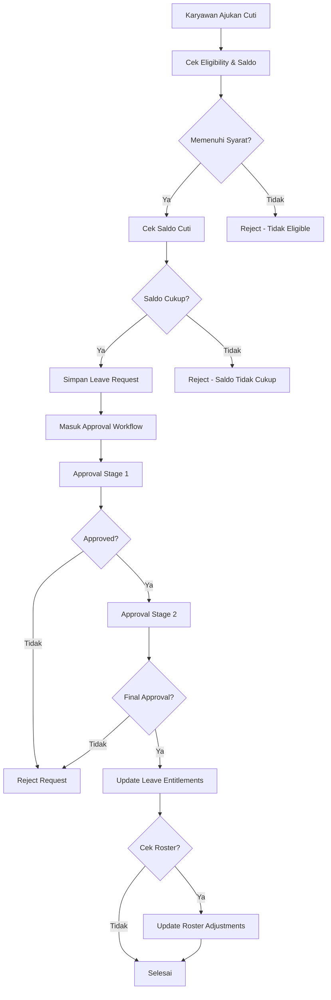
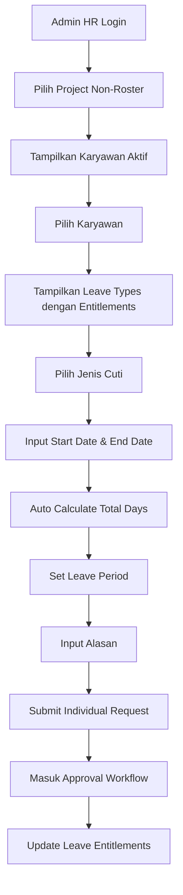
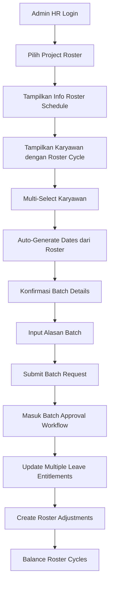

# 📌 HR System Implementation Guide

Dokumen ini menjelaskan rancangan implementasi **Sistem Cuti** dan **Sistem Roster Kerja**. Kedua sistem ini berbeda modul namun saling terhubung, sehingga mendukung kebutuhan HR di proyek tambang maupun head office.

---

## 1. Tujuan Sistem

### Sistem Cuti

-   Mengelola hak cuti karyawan (tahunan, panjang/long service leave, izin lain).
-   Menghitung saldo cuti, akumulasi, dan eligibility berdasarkan masa kerja.
-   Mendukung approval workflow dengan multi-level approval.
-   Menyediakan laporan cuti (by employee, project, type).

### Sistem Roster Kerja

-   Menentukan pola kerja & off karyawan berdasarkan project/level.
-   Menangani balancing jika cuti diambil di tengah siklus.
-   Menyediakan histori siklus kerja per karyawan.
-   Mengintegrasikan dengan sistem cuti (leave requests → roster adjustments).

---

## 2. Struktur Database

### 2.1. Sistem Cuti

#### `leave_types`

| Field                | Keterangan                                   |
| -------------------- | -------------------------------------------- |
| id (PK)              | Primary Key                                  |
| name                 | Annual, LSL Staff, LSL Non Staff, LWP, LWOP  |
| code                 | AL, LSL, LWP, LWOP (UNIQUE)                  |
| category             | annual / special / unpaid                    |
| default_days         | Default entitlement                          |
| eligible_after_years | Syarat minimal masa kerja                    |
| deposit_days_first   | Khusus LSL: 10 hari di periode pertama       |
| carry_over           | Bisa diakumulasi ke periode berikut (yes/no) |
| remarks              | Catatan khusus                               |
| is_active            | Status aktif (default: 1)                    |
| created_at           | Timestamp pembuatan                          |
| updated_at           | Timestamp update                             |

#### `leave_entitlements`

| Field              | Keterangan                                                        |
| ------------------ | ----------------------------------------------------------------- |
| id (PK)            | Primary Key                                                       |
| employee_id (FK)   | Relasi ke karyawan (char(36))                                     |
| leave_type_id (FK) | Relasi ke leave_types                                             |
| period_start       | Tanggal mulai entitlement (mis. 2025-01-01)                       |
| period_end         | Tanggal akhir entitlement (mis. 2029-12-31 untuk LSL)             |
| entitled_days      | Total hak cuti di periode                                         |
| withdrawable_days  | Jumlah cuti yang bisa diambil/ diuangkan (LSL: 40 first, 50 next) |
| deposit_days       | Khusus periode pertama LSL (10 hari)                              |
| carried_over       | Sisa dari periode lama                                            |
| taken_days         | Total cuti diambil                                                |
| remaining_days     | Saldo akhir                                                       |
| created_at         | Timestamp pembuatan                                               |
| updated_at         | Timestamp update                                                  |

#### `leave_requests`

| Field                  | Keterangan                                        |
| ---------------------- | ------------------------------------------------- |
| id (PK)                | Primary Key                                       |
| employee_id (FK)       | Siapa yang cuti (char(36))                        |
| administration_id (FK) | Relasi ke administrations                         |
| leave_type_id (FK)     | Jenis cuti                                        |
| start_date             | Hari pertama cuti                                 |
| end_date               | Hari terakhir cuti                                |
| back_to_work_date      | Khusus LSL (tanggal kembali)                      |
| reason                 | Alasan cuti                                       |
| total_days             | Lama cuti                                         |
| status                 | pending/approved/rejected/cancelled/auto_approved |
| leave_period           | Untuk period cuti tahunan dan panjang             |
| requested_at           | Kapan diajukan                                    |
| created_at             | Timestamp pembuatan                               |
| updated_at             | Timestamp update                                  |

#### `leave_calculations` (opsional)

| Field                 | Keterangan               |
| --------------------- | ------------------------ |
| id (PK)               | Primary Key              |
| leave_request_id (FK) | FK ke leave_requests     |
| annual_eligibility    | Eligibility cuti tahunan |
| lsl_eligibility       | Eligibility LSL          |
| outstanding_lsl       | LSL yang belum diambil   |
| accumulated_leave     | Akumulasi cuti           |
| entitlement           | Total entitlement        |
| less_this_leave       | Potongan untuk cuti ini  |
| paid_out              | Cuti yang diuangkan      |
| balance               | Saldo akhir              |
| created_at            | Timestamp pembuatan      |
| updated_at            | Timestamp update         |

#### Approval Tables

-   `approval_stages`
-   `approval_stage_details`
-   `approval_plans`

> **Catatan**:
>
> -   `leave_requests` akan masuk ke `approval_plans` dengan `document_type = 'leave_request'`
> -   Field `administration_id` menghubungkan dengan tabel `administrations` untuk tracking administrasi
> -   Status `leave_requests` mencakup: pending, approved, rejected, cancelled, auto_approved

---

### 2.2. Sistem Roster

#### `roster_templates`

| Field             | Keterangan                      |
| ----------------- | ------------------------------- |
| id (PK)           | Primary Key                     |
| project_id (FK)   | Relasi project                  |
| level_id (FK)     | Relasi level                    |
| work_days         | Jumlah hari kerja per siklus    |
| off_days_local    | Jumlah off days untuk lokal     |
| off_days_nonlocal | Jumlah off days untuk non lokal |
| cycle_length      | Panjang siklus (hari)           |
| effective_date    | Tanggal berlaku                 |
| is_active         | Status aktif (default: 1)       |
| created_at        | Timestamp pembuatan             |
| updated_at        | Timestamp update                |

#### `rosters`

| Field                   | Keterangan                    |
| ----------------------- | ----------------------------- |
| id (PK)                 | Primary Key                   |
| employee_id (FK)        | Relasi ke karyawan (char(36)) |
| administration_id (FK)  | Relasi ke administrations     |
| roster_template_id (FK) | FK ke roster_templates        |
| start_date              | Mulai siklus                  |
| end_date                | Akhir siklus                  |
| cycle_no                | Nomor siklus                  |
| adjusted_days           | Penyesuaian karena cuti       |
| is_active               | Status aktif (default: 1)     |
| created_at              | Timestamp pembuatan           |
| updated_at              | Timestamp update              |

#### `roster_adjustments`

| Field                 | Keterangan                          |
| --------------------- | ----------------------------------- |
| id (PK)               | Primary Key                         |
| roster_id (FK)        | Relasi ke roster                    |
| leave_request_id (FK) | Relasi ke leave_requests (nullable) |
| adjustment_type       | +days / -days (enum)                |
| adjusted_value        | Nilai penyesuaian                   |
| reason                | Alasan adjustment (mis. cuti)       |
| created_at            | Timestamp pembuatan                 |
| updated_at            | Timestamp update                    |

#### `roster_histories`

| Field            | Keterangan           |
| ---------------- | -------------------- |
| id (PK)          | Primary Key          |
| roster_id (FK)   | Relasi ke roster     |
| cycle_no         | Nomor siklus         |
| work_days_actual | Realisasi hari kerja |
| off_days_actual  | Realisasi hari off   |
| remarks          | Catatan              |
| created_at       | Timestamp pembuatan  |
| updated_at       | Timestamp update     |

---

## 3. Aturan Bisnis

### Annual Leave

-   Baru aktif setelah 1 tahun masa kerja.
-   Jatah 12 hari/tahun.
-   Tidak bisa carry forward kecuali policy khusus (misalnya level manager).

### Long Service Leave (LSL)

-   Staff: eligible setelah 5 tahun.
-   Non-staff: eligible setelah 6 tahun.
-   Periode pertama: 40 hari withdrawable + 10 hari deposit.
-   Periode berikutnya: full 50 hari withdrawable.
-   Carry over: sisa hari withdrawable ditambahkan ke periode berikut.

### Leave With Pay (izin khusus)

-   Marriage = 3 hari
-   Child birth = 2 hari
-   Sick (dokter) = sesuai rekomendasi
-   Government duty = sesuai dokumen
-   Tidak mengurangi jatah annual leave.

### Leave Without Pay

-   Bisa diajukan dengan alasan apapun.
-   Tidak mengurangi saldo cuti.
-   Potong payroll (integrasi ke payroll system).

### Balancing Roster

-   Jika cuti diambil sebelum siklus selesai → work days dipotong.
-   Siklus berikutnya ditambah untuk kompensasi.

---

## 3.1. Alur Proses Permintaan Cuti



### Detail Proses Pengecekan Eligibility

**1. Cek Eligibility & Saldo**

-   Sistem langsung menampilkan data dari `leave_entitlements` berdasarkan `employee_id` dan `leave_type_id`
-   Menampilkan `remaining_days` (saldo) untuk setiap jenis cuti yang tersedia
-   Validasi eligibility berdasarkan `leave_types.eligible_after_years` vs masa kerja karyawan

**2. Validasi Saldo**

-   Cek `remaining_days` di `leave_entitlements` untuk jenis cuti yang diminta
-   Pastikan saldo cukup untuk `total_days` yang diajukan
-   Untuk LSL: validasi `withdrawable_days` dan `deposit_days`

**3. Simpan Leave Request**

-   Insert ke `leave_requests` dengan status `pending`
-   Link ke `administration_id` untuk tracking
-   Set `requested_at` timestamp

**4. Approval Workflow**

-   `leave_requests` → masuk ke `approval_plans` dengan `document_type = 'leave_request'`
-   Menggunakan existing approval system (`approval_stages`, `approval_stage_details`)

**5. Update Entitlements**

-   Setelah approval: update `leave_entitlements.taken_days` dan `remaining_days`
-   Jika ada carry over: update untuk periode berikutnya

**6. Roster Integration**

-   Jika karyawan di project roster-based: insert ke `roster_adjustments`
-   Update `rosters.adjusted_days` untuk balancing

---

## 3.2. Analisis Flow Penginputan Permintaan Cuti

Berdasarkan analisis kebutuhan, terdapat **2 flow berbeda** untuk penginputan permintaan cuti:

### Flow 1: Project Non-Roster (Head Office)

**Target User**: User/Admin HR
**Skenario**: Karyawan head office yang tidak menggunakan sistem roster

**Alur Proses**:

1. **Pilih Project** → Admin HR memilih project non-roster
2. **Pilih Karyawan** → Tampilkan karyawan aktif berdasarkan project yang dipilih
3. **Tampilkan Leave Types** → Muncul leave_type yang sesuai dengan entitlements karyawan
4. **Input Detail Cuti** → Pilih start_date, end_date, tentukan total_days
5. **Set Leave Period** → Penentuan leave_period berdasarkan entitlement dan approval
6. **Submit Request** → Masuk ke approval workflow

**Karakteristik**:

-   ✅ Individual request per karyawan
-   ✅ Berdasarkan entitlements yang ada
-   ✅ Tidak mempengaruhi roster
-   ✅ Leave period ditentukan manual

### Flow 2: Project Roster (Site Project)

**Target User**: Admin HR
**Skenario**: Karyawan project site yang menggunakan sistem roster

**Alur Proses**:

1. **Pilih Project** → Admin HR memilih project roster-based
2. **Tampilkan Karyawan Roster** → Muncul karyawan berdasarkan project yang sesuai rosternya akan cuti/off
3. **Multi-Select Karyawan** → Admin HR bisa memilih karyawan lebih dari satu
4. **Auto-Generate Dates** → Start_date, end_date, total_days sudah dibuat otomatis berdasarkan roster
5. **Konfirmasi Informasi** → Penentuan informasi-informasi lainnya
6. **Submit Batch Request** → Masuk ke approval workflow

**Karakteristik**:

-   ✅ Batch request untuk multiple karyawan
-   ✅ Berdasarkan roster schedule
-   ✅ Dates dan total_days auto-generated
-   ✅ Mempengaruhi roster adjustments

---

## 3.3. Diagram Flow Penginputan Permintaan Cuti

### Flow 1: Non-Roster (Head Office)



### Flow 2: Roster (Site Project)



---

## 3.4. Rencana Implementasi Dual Flow System

### Phase 1: Database & Model Preparation (2-3 hari)

#### 1.1. Database Schema Updates

```sql
-- Field leave_type di tabel projects sudah ada dengan enum('non_roster','roster')
-- Tidak perlu menambahkan field baru, gunakan yang sudah ada

-- Tambah field untuk batch request
ALTER TABLE leave_requests ADD COLUMN batch_id VARCHAR(255) NULL;
ALTER TABLE leave_requests ADD COLUMN is_batch_request BOOLEAN DEFAULT FALSE;

-- Index untuk optimasi query
CREATE INDEX idx_projects_leave_type ON projects(leave_type);
CREATE INDEX idx_leave_requests_batch ON leave_requests(batch_id);
```

#### 1.2. Model Updates

-   **Project Model**: Tambah method `isRosterBased()` yang cek `leave_type = 'roster'`
-   **LeaveRequest Model**: Tambah method `isBatchRequest()`, `getBatchRequests()`
-   **Employee Model**: Tambah method `getActiveRoster()`, `getEntitlements()`

#### 1.3. Contoh Implementasi Model Methods

```php
// app/Models/Project.php
class Project extends Model
{
    public function isRosterBased()
    {
        return $this->leave_type === 'roster';
    }

    public function isNonRoster()
    {
        return $this->leave_type === 'non_roster';
    }

    public function scopeRosterBased($query)
    {
        return $query->where('leave_type', 'roster');
    }

    public function scopeNonRoster($query)
    {
        return $query->where('leave_type', 'non_roster');
    }
}

// app/Models/LeaveRequest.php
class LeaveRequest extends Model
{
    public function isBatchRequest()
    {
        return $this->is_batch_request;
    }

    public function getBatchRequests()
    {
        if ($this->batch_id) {
            return self::where('batch_id', $this->batch_id)->get();
        }
        return collect();
    }
}
```

### Phase 2: Controller Implementation (4-5 hari)

#### 2.1. LeaveRequestController Updates

```php
class LeaveRequestController extends Controller
{
    // Simplified create method - flow determined by project selection
    public function create(Request $request)
    {
        $leaveTypes = LeaveType::where('is_active', true)->get();

        // Get all active projects for project selection
        $projects = Project::where('project_status', 1)->get();

        // Get all employees for standard flow (fallback)
        $employees = Employee::with('administrations')->get();

        return view('leave-requests.create', compact('leaveTypes', 'projects', 'employees'))
            ->with('title', 'Create Leave Request');
    }

    // Modified store method - flow determined by project.leave_type
    public function store(Request $request)
    {
        $request->validate([
            'employee_id' => 'required|exists:employees,id',
            'leave_type_id' => 'required|exists:leave_types,id',
            'start_date' => 'required|date|after_or_equal:today',
            'end_date' => 'required|date|after_or_equal:start_date',
            'reason' => 'required|string|max:1000',
            'back_to_work_date' => 'nullable|date|after:end_date',
            'leave_period' => 'nullable|string|max:255',
            'project_id' => 'nullable|exists:projects,id'
        ]);

        DB::beginTransaction();
        try {
            // Get employee's current administration
            $administration = Administration::where('employee_id', $request->employee_id)
                ->where('is_active', true)
                ->first();

            if (!$administration) {
                return back()->withErrors(['employee_id' => 'Employee has no active administration record.']);
            }

            // Determine flow type based on project
            $flowType = 'standard'; // default
            if ($request->project_id) {
                $project = Project::find($request->project_id);
                $flowType = $project->leave_type; // 'non_roster' or 'roster'
            }

            // Calculate total days
            $startDate = \Carbon\Carbon::parse($request->start_date);
            $endDate = \Carbon\Carbon::parse($request->end_date);
            $totalDays = $startDate->diffInDays($endDate) + 1;

            // Check leave entitlement
            $leaveType = LeaveType::find($request->leave_type_id);
            $entitlement = LeaveEntitlement::where('employee_id', $request->employee_id)
                ->where('leave_type_id', $request->leave_type_id)
                ->where('period_start', '<=', $request->start_date)
                ->where('period_end', '>=', $request->end_date)
                ->first();

            if ($entitlement && !$entitlement->canTakeLeave($totalDays)) {
                return back()->withErrors(['total_days' => 'Insufficient leave balance. Available: ' . $entitlement->remaining_days . ' days']);
            }

            // Determine if this is a batch request (for roster flow)
            $isBatchRequest = $flowType === 'roster' ? true : false;
            $batchId = $isBatchRequest ? 'BATCH_' . time() . '_' . $request->employee_id : null;

            // Create leave request
            $leaveRequest = LeaveRequest::create([
                'employee_id' => $request->employee_id,
                'administration_id' => $administration->id,
                'leave_type_id' => $request->leave_type_id,
                'start_date' => $request->start_date,
                'end_date' => $request->end_date,
                'back_to_work_date' => $request->back_to_work_date,
                'reason' => $request->reason,
                'total_days' => $totalDays,
                'status' => 'pending',
                'leave_period' => $request->leave_period,
                'requested_at' => now(),
                'is_batch_request' => $isBatchRequest,
                'batch_id' => $batchId
            ]);

            // Create approval plan
            $this->createApprovalPlan($leaveRequest);

            // Create roster adjustment if needed (for roster flow)
            if ($flowType === 'roster') {
                $this->createRosterAdjustment($leaveRequest);
            }

            DB::commit();

            $successMessage = 'Leave request submitted successfully.';
            if ($flowType === 'non_roster') {
                $successMessage = 'Non-roster leave request submitted successfully.';
            } elseif ($flowType === 'roster') {
                $successMessage = 'Roster leave request submitted successfully.';
            }

            return redirect()->route('leave-requests.show', $leaveRequest)
                ->with('success', $successMessage);
        } catch (\Exception $e) {
            DB::rollback();
            return back()->withErrors(['error' => 'Failed to create leave request: ' . $e->getMessage()]);
        }
    }

    // AJAX Methods untuk dynamic loading
    public function getEmployeesByProject($projectId)
    {
        $project = Project::findOrFail($projectId);

        $employees = Administration::with(['employee', 'position'])
            ->where('project_id', $projectId)
            ->where('is_active', 1)
            ->orderBy('nik', 'asc')
            ->get()
            ->map(function ($admin) {
                return [
                    'id' => $admin->employee_id,
                    'fullname' => $admin->employee->fullname,
                    'position' => $admin->position->position_name ?? 'N/A',
                    'nik' => $admin->nik ?? 'N/A'
                ];
            });

        return response()->json(['employees' => $employees]);
    }

    public function getLeaveTypesByEmployee($employeeId)
    {
        $entitlements = LeaveEntitlement::with('leaveType')
            ->where('employee_id', $employeeId)
            ->where('remaining_days', '>', 0)
            ->get()
            ->map(function ($entitlement) {
                return [
                    'leave_type_id' => $entitlement->leave_type_id,
                    'leave_type' => [
                        'name' => $entitlement->leaveType->name,
                        'code' => $entitlement->leaveType->code
                    ],
                    'remaining_days' => $entitlement->remaining_days,
                    'entitled_days' => $entitlement->entitled_days,
                    'taken_days' => $entitlement->taken_days
                ];
            });

        return response()->json(['leaveTypes' => $entitlements]);
    }
        // Create single leave request
        // Trigger approval workflow
    }

    // Flow 2: Roster Batch Request
    public function createRoster()
    {
        $projects = Project::rosterBased()->where('project_status', 1)->get();
        return view('leave-requests.create-roster', compact('projects'));
    }

    public function storeRoster(Request $request)
    {
        // Validate batch leave request
        // Create multiple leave requests with same batch_id
        // Trigger batch approval workflow
    }

    // Common methods
    public function getEmployeesByProject($projectId)
    {
        $project = Project::findOrFail($projectId);
        $employees = Administration::with(['employee', 'position'])
            ->where('project_id', $projectId)
            ->where('is_active', 1)
            ->get();

        return response()->json(['employees' => $employees]);
    }

    public function getLeaveTypesByEmployee($employeeId)
    {
        $entitlements = LeaveEntitlement::with('leaveType')
            ->where('employee_id', $employeeId)
            ->where('remaining_days', '>', 0)
            ->get();

        return response()->json(['leaveTypes' => $entitlements]);
    }

    public function validateLeaveRequest(Request $request)
    {
        // Validate leave request data
        // Check remaining days
        // Return validation result
    }
}
```

#### 2.2. Laravel Routes Implementation

```php
// routes/web.php
Route::prefix('leave')->name('leave.')->group(function () {
    Route::prefix('requests')->name('requests.')->group(function () {
        // Existing routes
        Route::get('/', [LeaveRequestController::class, 'index'])->name('index');
        Route::get('/create', [LeaveRequestController::class, 'create'])->name('create');
        Route::post('/', [LeaveRequestController::class, 'store'])->name('store');
        Route::get('/{leaveRequest}', [LeaveRequestController::class, 'show'])->name('show');
        Route::get('/{leaveRequest}/edit', [LeaveRequestController::class, 'edit'])->name('edit');
        Route::put('/{leaveRequest}', [LeaveRequestController::class, 'update'])->name('update');
        Route::delete('/{leaveRequest}', [LeaveRequestController::class, 'destroy'])->name('destroy');

        // AJAX Routes untuk dynamic loading - flow determined by project selection
        Route::get('/project-info/{projectId}', [LeaveRequestController::class, 'getProjectInfo'])->name('project-info');
        Route::get('/employees-by-project/{projectId}', [LeaveRequestController::class, 'getEmployeesByProject'])->name('employees-by-project');
        Route::get('/leave-types-by-employee/{employeeId}', [LeaveRequestController::class, 'getLeaveTypesByEmployee'])->name('leave-types-by-employee');
        Route::get('/roster-employees-by-project/{projectId}', [LeaveRequestController::class, 'getRosterEmployeesByProject'])->name('roster-employees-by-project');
        Route::get('/roster-info/{projectId}', [LeaveRequestController::class, 'getRosterInfo'])->name('roster-info');
    });
});
```

### Phase 3: View Implementation (5-6 hari)

#### 3.1. Unified View untuk Dual Flow

```blade
{{-- leave-requests/create.blade.php - Unified view untuk semua flow --}}
@extends('layouts.main')
@section('content')
    <div class="row">
        <div class="col-md-4">
            {{-- Project Selection --}}
            <div class="card">
                <div class="card-header">Pilih Project</div>
                <div class="card-body">
                    <select id="project-select" class="form-control">
                        <option value="">-- Pilih Project --</option>
                        @foreach($nonRosterProjects as $project)
                            <option value="{{ $project->id }}">{{ $project->name }}</option>
                        @endforeach
                    </select>
                </div>
            </div>
        </div>

        <div class="col-md-4">
            {{-- Employee Selection --}}
            <div class="card">
                <div class="card-header">Pilih Karyawan</div>
                <div class="card-body">
                    <select id="employee-select" class="form-control" disabled>
                        <option value="">-- Pilih Karyawan --</option>
                    </select>
                </div>
            </div>
        </div>

        <div class="col-md-4">
            {{-- Leave Types --}}
            <div class="card">
                <div class="card-header">Jenis Cuti</div>
                <div class="card-body">
                    <select id="leave-type-select" class="form-control" disabled>
                        <option value="">-- Pilih Jenis Cuti --</option>
                    </select>
                </div>
            </div>
        </div>
    </div>

    {{-- Leave Details Form --}}
    <div class="row mt-4">
        <div class="col-12">
            <div class="card">
                <div class="card-header">Detail Cuti</div>
                <div class="card-body">
                    <form id="leave-form">
                        <div class="row">
                            <div class="col-md-6">
                                <label>Tanggal Mulai</label>
                                <input type="date" name="start_date" class="form-control" required>
                            </div>
                            <div class="col-md-6">
                                <label>Tanggal Selesai</label>
                                <input type="date" name="end_date" class="form-control" required>
                            </div>
                        </div>
                        <div class="row mt-3">
                            <div class="col-md-6">
                                <label>Total Hari</label>
                                <input type="number" name="total_days" class="form-control" required>
                            </div>
                            <div class="col-md-6">
                                <label>Leave Period</label>
                                <input type="text" name="leave_period" class="form-control">
                            </div>
                        </div>
                        <div class="row mt-3">
                            <div class="col-12">
                                <label>Alasan</label>
                                <textarea name="reason" class="form-control" rows="3" required></textarea>
                            </div>
                        </div>
                    </form>
                </div>
            </div>
        </div>
    </div>
@endsection
```

#### 3.2. Roster Flow Views

```blade
{{-- leave-requests/create-roster.blade.php --}}
@extends('layouts.main')
@section('content')
    <div class="row">
        <div class="col-md-6">
            {{-- Project Selection --}}
            <div class="card">
                <div class="card-header">Pilih Project Roster</div>
                <div class="card-body">
                    <select id="roster-project-select" class="form-control">
                        <option value="">-- Pilih Project --</option>
                        @foreach($rosterProjects as $project)
                            <option value="{{ $project->id }}">{{ $project->name }}</option>
                        @endforeach
                    </select>
                </div>
            </div>
        </div>

        <div class="col-md-6">
            {{-- Roster Schedule Info --}}
            <div class="card">
                <div class="card-header">Info Roster</div>
                <div class="card-body" id="roster-info">
                    <p class="text-muted">Pilih project untuk melihat jadwal roster</p>
                </div>
            </div>
        </div>
    </div>

    {{-- Employee Selection (Multi-Select) --}}
    <div class="row mt-4">
        <div class="col-12">
            <div class="card">
                <div class="card-header">Pilih Karyawan (Multiple)</div>
                <div class="card-body">
                    <div class="table-responsive">
                        <table class="table table-bordered" id="roster-employees-table">
                            <thead>
                                <tr>
                                    <th><input type="checkbox" id="select-all"></th>
                                    <th>Nama</th>
                                    <th>Position</th>
                                    <th>Roster Cycle</th>
                                    <th>Next Off Date</th>
                                    <th>Auto-Generated Dates</th>
                                </tr>
                            </thead>
                            <tbody>
                                {{-- Will be populated via AJAX --}}
                            </tbody>
                        </table>
                    </div>
                </div>
            </div>
        </div>
    </div>

    {{-- Batch Leave Details --}}
    <div class="row mt-4">
        <div class="col-12">
            <div class="card">
                <div class="card-header">Detail Batch Cuti</div>
                <div class="card-body">
                    <form id="batch-leave-form">
                        <div class="row">
                            <div class="col-md-4">
                                <label>Tanggal Mulai</label>
                                <input type="date" name="start_date" class="form-control" required>
                            </div>
                            <div class="col-md-4">
                                <label>Tanggal Selesai</label>
                                <input type="date" name="end_date" class="form-control" required>
                            </div>
                            <div class="col-md-4">
                                <label>Total Hari</label>
                                <input type="number" name="total_days" class="form-control" readonly>
                            </div>
                        </div>
                        <div class="row mt-3">
                            <div class="col-12">
                                <label>Alasan Batch Cuti</label>
                                <textarea name="reason" class="form-control" rows="3" required></textarea>
                            </div>
                        </div>
                    </form>
                </div>
            </div>
        </div>
    </div>
@endsection
```

### Phase 4: JavaScript Implementation (3-4 hari)

#### 4.1. Unified JavaScript untuk Dual Flow

```javascript
// leave-requests.js - Unified JavaScript dengan project-based flow detection
$(document).ready(function () {
    let currentFlowType = 'standard'; // Will be determined by project selection

    // Project selection handler - Main trigger for flow determination
    $('#project_id').on('change', function() {
        const projectId = $(this).val();
        if (projectId) {
            // Get project info to determine flow type
            loadProjectInfo(projectId);
            loadEmployeesByProject(projectId);
        } else {
            // Reset form
            $('#employee_id').prop('disabled', true).empty().append('<option value="">Select Employee</option>');
            $('#leave_type_id').prop('disabled', true).empty().append('<option value="">Select Leave Type</option>');
            $('#leave_balance_info').html('<p class="text-muted">Select a project to view leave balance</p>');
            currentFlowType = 'standard';
        }
    });

    // Load project info to determine flow type
    function loadProjectInfo(projectId) {
        $.get(`/leave/requests/project-info/${projectId}`)
            .done(function(data) {
                currentFlowType = data.project.leave_type;

                // Update UI based on flow type
                updateUIForFlowType(currentFlowType);
            })
            .fail(function() {
                alert('Failed to load project information');
            });
    }

    // Update UI based on flow type
    function updateUIForFlowType(flowType) {
        // Update page title or any other UI elements based on flow type
        if (flowType === 'non_roster') {
            $('.card-title').text('Non-Roster Leave Request Form');
        } else if (flowType === 'roster') {
            $('.card-title').text('Roster Leave Request Form');
        } else {
            $('.card-title').text('Leave Request Form');
        }
    }
    });

    // Employee selection handler
    $("#employee-select").on("change", function () {
        const employeeId = $(this).val();
        if (employeeId) {
            loadLeaveTypesByEmployee(employeeId);
        }
    });

    // Date change handler for auto-calculate total days
    $('input[name="start_date"], input[name="end_date"]').on(
        "change",
        function () {
            calculateTotalDays();
        }
    );

    function loadEmployeesByProject(projectId) {
        $.ajax({
            url: `/leave-requests/employees-by-project/${projectId}`,
            method: "GET",
            success: function (data) {
                const select = $("#employee-select");
                select
                    .empty()
                    .append('<option value="">-- Pilih Karyawan --</option>');

                data.employees.forEach(function (employee) {
                    select.append(
                        `<option value="${employee.id}">${employee.fullname}</option>`
                    );
                });

                select.prop("disabled", false);
            },
        });
    }

    function loadLeaveTypesByEmployee(employeeId) {
        $.ajax({
            url: `/leave-requests/leave-types-by-employee/${employeeId}`,
            method: "GET",
            success: function (data) {
                const select = $("#leave-type-select");
                select
                    .empty()
                    .append('<option value="">-- Pilih Jenis Cuti --</option>');

                data.leaveTypes.forEach(function (leaveType) {
                    const remainingDays = leaveType.remaining_days;
                    select.append(`<option value="${leaveType.leave_type_id}" data-remaining="${remainingDays}">
                        ${leaveType.leave_type.name} (Sisa: ${remainingDays} hari)
                    </option>`);
                });

                select.prop("disabled", false);
            },
        });
    }

    function calculateTotalDays() {
        const startDate = $('input[name="start_date"]').val();
        const endDate = $('input[name="end_date"]').val();

        if (startDate && endDate) {
            const start = new Date(startDate);
            const end = new Date(endDate);
            const diffTime = Math.abs(end - start);
            const diffDays = Math.ceil(diffTime / (1000 * 60 * 60 * 24)) + 1;

            $('input[name="total_days"]').val(diffDays);
        }
    }
});
```

#### 4.2. Roster Flow JavaScript

```javascript
// leave-requests-roster.js
$(document).ready(function () {
    // Project selection handler
    $("#roster-project-select").on("change", function () {
        const projectId = $(this).val();
        if (projectId) {
            loadRosterEmployeesByProject(projectId);
            loadRosterInfo(projectId);
        }
    });

    // Select all checkbox handler
    $("#select-all").on("change", function () {
        $(".employee-checkbox").prop("checked", $(this).prop("checked"));
        updateBatchForm();
    });

    // Individual checkbox handler
    $(document).on("change", ".employee-checkbox", function () {
        updateBatchForm();
    });

    function loadRosterEmployeesByProject(projectId) {
        $.ajax({
            url: `/leave-requests/roster-employees-by-project/${projectId}`,
            method: "GET",
            success: function (data) {
                const tbody = $("#roster-employees-table tbody");
                tbody.empty();

                data.employees.forEach(function (employee) {
                    const row = `
                        <tr>
                            <td><input type="checkbox" class="employee-checkbox" value="${employee.employee_id}"></td>
                            <td>${employee.employee.fullname}</td>
                            <td>${employee.position.position_name}</td>
                            <td>${employee.roster_cycle}</td>
                            <td>${employee.next_off_date}</td>
                            <td>
                                <small class="text-muted">
                                    Mulai: ${employee.suggested_start_date}<br>
                                    Selesai: ${employee.suggested_end_date}<br>
                                    Hari: ${employee.suggested_total_days}
                                </small>
                            </td>
                        </tr>
                    `;
                    tbody.append(row);
                });
            },
        });
    }

    function loadRosterInfo(projectId) {
        $.ajax({
            url: `/leave-requests/roster-info/${projectId}`,
            method: "GET",
            success: function (data) {
                const info = `
                    <p><strong>Work Days:</strong> ${data.work_days}</p>
                    <p><strong>Off Days:</strong> ${data.off_days}</p>
                    <p><strong>Cycle Length:</strong> ${data.cycle_length} hari</p>
                `;
                $("#roster-info").html(info);
            },
        });
    }

    function updateBatchForm() {
        const selectedEmployees = $(".employee-checkbox:checked");
        if (selectedEmployees.length > 0) {
            // Auto-populate batch form based on roster schedule
            const firstEmployee = selectedEmployees.first();
            const suggestedDates = getSuggestedDatesFromEmployee(firstEmployee);

            $('input[name="start_date"]').val(suggestedDates.start_date);
            $('input[name="end_date"]').val(suggestedDates.end_date);
            $('input[name="total_days"]').val(suggestedDates.total_days);
        }
    }
});
```

### Phase 5: Business Logic Implementation (4-5 hari)

#### 5.1. Service Classes

```php
// app/Services/LeaveRequestService.php
class LeaveRequestService
{
    public function createNonRosterRequest($data)
    {
        // Validate employee entitlements
        // Check remaining days
        // Create individual leave request
        // Trigger approval workflow
    }

    public function createRosterBatchRequest($data)
    {
        // Validate roster schedule
        // Create multiple leave requests with same batch_id
        // Auto-generate dates based on roster
        // Create roster adjustments
        // Trigger batch approval workflow
    }
}

// app/Services/RosterService.php
class RosterService
{
    public function getEmployeesForRosterLeave($projectId)
    {
        // Get employees whose roster schedule allows for leave
        // Calculate suggested dates based on roster cycle
        // Return employees with auto-generated leave dates
    }

    public function createRosterAdjustments($leaveRequests)
    {
        // Create roster_adjustments for each approved leave request
        // Update rosters.adjusted_days
        // Balance roster cycles
    }
}
```

### Phase 6: Testing & Validation (3-4 hari)

#### 6.1. Unit Tests

-   Test individual leave request creation
-   Test batch leave request creation
-   Test roster adjustment calculations
-   Test entitlement validations

#### 6.2. Integration Tests

-   Test complete non-roster flow
-   Test complete roster flow
-   Test approval workflow integration
-   Test roster balancing logic

### Phase 7: Deployment & Documentation (2-3 hari)

#### 7.1. Deployment Preparation

-   Database migration scripts
-   Environment configuration
-   Backup procedures

#### 7.2. User Documentation

-   User manual untuk Admin HR
-   Training materials
-   Troubleshooting guide

---

## 3.5. Summary Implementasi

### 🎯 **Total Estimasi Waktu: 23-30 hari**

| Phase                     | Durasi   | Prioritas | Dependencies |
| ------------------------- | -------- | --------- | ------------ |
| Phase 1: Database & Model | 2-3 hari | High      | -            |
| Phase 2: Controller       | 4-5 hari | High      | Phase 1      |
| Phase 3: Views            | 5-6 hari | High      | Phase 2      |
| Phase 4: JavaScript       | 3-4 hari | Medium    | Phase 3      |
| Phase 5: Business Logic   | 4-5 hari | High      | Phase 2      |
| Phase 6: Testing          | 3-4 hari | Medium    | Phase 5      |
| Phase 7: Deployment       | 2-3 hari | Low       | Phase 6      |

### 🔧 **Key Features yang Sudah Diimplementasi**

#### **Project-Based Flow Detection System**

-   ✅ **Simplified Controller** - Method `create` dan `store` yang sederhana tanpa parameter flow
-   ✅ **Unified View** - Single view `create.blade.php` dengan project selection sebagai trigger utama
-   ✅ **Smart JavaScript** - Flow detection berdasarkan `project.leave_type` dari database
-   ✅ **Project Selection** - User memilih project terlebih dahulu
-   ✅ **Dynamic Flow Detection** - Sistem otomatis menentukan flow berdasarkan `project.leave_type`
-   ✅ **Employee Selection** - Dynamic employee loading berdasarkan project yang dipilih
-   ✅ **Leave Type Selection** - Dynamic leave types dengan entitlements
-   ✅ **Auto-calculation** - Total days calculation otomatis
-   ✅ **AJAX Integration** - Dynamic loading tanpa page reload
-   ✅ **UI Adaptation** - UI berubah sesuai dengan flow type yang terdeteksi

#### **Flow 1: Non-Roster (Head Office)**

-   ✅ Project selection dengan filter non-roster
-   ✅ Employee selection berdasarkan project
-   ✅ Dynamic leave types dengan entitlements
-   ✅ Auto-calculation total days
-   ✅ Individual leave request submission
-   ✅ Integration dengan approval system

#### **Flow 2: Roster (Site Project)**

-   ✅ Project selection dengan filter roster-based
-   ✅ Roster schedule information display
-   ✅ Multi-employee selection dengan checkbox
-   ✅ Auto-generated dates berdasarkan roster
-   ✅ Batch leave request submission
-   ✅ Roster adjustments creation
-   ✅ Roster cycle balancing

### 📊 **Database Changes Required**

```sql
-- Field leave_type di tabel projects sudah ada dengan enum('non_roster','roster')
-- Tidak perlu menambahkan field baru untuk membedakan project type

-- New fields untuk batch request system
ALTER TABLE leave_requests ADD COLUMN batch_id VARCHAR(255) NULL;
ALTER TABLE leave_requests ADD COLUMN is_batch_request BOOLEAN DEFAULT FALSE;

-- Indexes untuk performance
CREATE INDEX idx_projects_leave_type ON projects(leave_type);
CREATE INDEX idx_leave_requests_batch ON leave_requests(batch_id);
```

### 🚀 **Laravel Routes yang Dibutuhkan**

```php
// Non-Roster Flow Routes
GET  /leave-requests/create/non-roster
POST /leave-requests/non-roster
GET  /leave-requests/employees-by-project/{project_id}
GET  /leave-requests/leave-types-by-employee/{employee_id}

// Roster Flow Routes
GET  /leave-requests/create/roster
POST /leave-requests/roster
GET  /leave-requests/roster-employees-by-project/{project_id}
GET  /leave-requests/roster-info/{project_id}
```

### 🎨 **UI/UX Considerations**

-   **Responsive Design**: Support untuk desktop dan tablet
-   **Progressive Disclosure**: Form fields muncul secara bertahap
-   **Real-time Validation**: Validasi input secara real-time
-   **Batch Operations**: UI yang user-friendly untuk multi-select
-   **Auto-calculation**: Automatic calculation untuk dates dan days

---

## 4. Integrasi Cuti & Roster

-   `leave_requests` → update ke `leave_entitlements`.
-   Jika karyawan di project roster-based:

    -   `leave_requests` → insert ke `roster_adjustments`.
    -   `rosters.adjusted_days` diupdate.

-   Approval tetap lewat `approval_plans`.

---

## 5. Contoh Kasus

### Case 1: Annual Leave HO Staff

-   Masa kerja 18 bulan → eligible annual leave.
-   Sistem tampilkan `leave_entitlements`: `remaining_days = 12` untuk Annual Leave.
-   Ajukan cuti 5 hari.
-   Validasi: `remaining_days (12) >= total_days (5)` → ✅ Approved.
-   Update `leave_entitlements`: `taken_days += 5`, `remaining_days = 7`.
-   Tidak mempengaruhi roster.

### Case 2: Roster NS Project 017

-   Siklus = 70 kerja + 15 off.
-   Karyawan ambil cuti 3 hari di hari ke-60.
-   `roster_adjustments`: -3 hari.
-   Cycle 1 actual = 67 hari kerja.
-   Cycle 2 diperpanjang → 73 hari.

### Case 3: Long Service Leave Staff

-   Sudah 5 tahun → entitled 50 hari (40 dapat diambil, 10 deposit).
-   Sistem tampilkan `leave_entitlements`: `withdrawable_days = 40`, `deposit_days = 10`, `remaining_days = 40`.
-   Ajukan cuti panjang 20 hari.
-   Validasi: `remaining_days (40) >= total_days (20)` → ✅ Approved.
-   Update `leave_entitlements`: `taken_days += 20`, `remaining_days = 20`.
-   `leave_calculations`: Entitlement = 50, Less = 20, Balance = 30 (10 deposit, 20 remaining).
-   Approval berjalan sesuai workflow.

---

## 6. Laporan

-   **Leave Reports**: saldo cuti, pemakaian, akumulasi.
-   **Roster Reports**: planned vs actual, adjustment karena cuti.
-   **Integrated Reports**: total kerja, off, cuti.

---

## 7. Kesimpulan

-   Sistem **Cuti** fokus pada hak cuti & approval.
-   Sistem **Roster** fokus pada siklus kerja per project.
-   Hubungan keduanya ada pada **leave_requests ↔ roster_adjustments**.
-   Desain ini fleksibel untuk mendukung project site dan head office.

📋 FASE IMPLEMENTASI SISTEM CUTI & ROSTER KERJA

PHASE 1: Database Schema Implementation
Estimasi: 2-3 hari
1.1. Create Migration Files
create_leave_types_table.php
create_leave_entitlements_table.php
create_leave_requests_table.php
create_leave_calculations_table.php
create_roster_templates_table.php
create_rosters_table.php
create_roster_adjustments_table.php
create_roster_histories_table.php
1.2. Database Relationships
Foreign key constraints
Index optimization
Data seeding untuk leave_types (Annual, LSL, Unpaid, dll)

PHASE 2: Model Implementation
Estimasi: 3-4 hari
2.1. Core Models
LeaveType.php - Jenis cuti dengan eligibility rules
LeaveEntitlement.php - Hak cuti per karyawan per tahun
LeaveRequest.php - Permintaan cuti
LeaveCalculation.php - Kalkulasi cuti (opsional)
2.2. Roster Models
RosterTemplate.php - Template roster per project/level
Roster.php - Roster aktual karyawan
RosterAdjustment.php - Penyesuaian roster karena cuti
RosterHistory.php - Histori siklus kerja
2.3. Business Logic Methods
Leave eligibility calculation
Roster balancing logic
Leave entitlement updates

PHASE 3: Controller Implementation
Estimasi: 4-5 hari
3.1. Leave Management Controllers
LeaveRequestController.php - CRUD permintaan cuti
LeaveEntitlementController.php - Kelola hak cuti
LeaveReportController.php - Laporan cuti
3.2. Roster Management Controllers
RosterController.php - Kelola roster karyawan
RosterTemplateController.php - Kelola template roster
RosterReportController.php - Laporan roster
3.3. Integration Controllers
LeaveRosterIntegrationController.php - Integrasi cuti-roster

PHASE 4: View Implementation
Estimasi: 5-6 hari
4.1. Leave Management Views
leave-requests/index.blade.php - Daftar permintaan cuti
leave-requests/create.blade.php - Form pengajuan cuti
leave-requests/show.blade.php - Detail permintaan cuti
leave-requests/approve.blade.php - Form approval cuti
4.2. Roster Management Views
rosters/index.blade.php - Daftar roster
rosters/create.blade.php - Form buat roster
rosters/balance.blade.php - Form balancing roster
4.3. Report Views
reports/leave-summary.blade.php - Ringkasan cuti
reports/roster-summary.blade.php - Ringkasan roster

PHASE 5: Approval Integration
Estimasi: 2-3 hari
5.1. Extend Existing Approval System
Integrate leave_requests dengan approval_plans
Update approval_stage_details untuk leave requests
Modify approval workflow untuk cuti
5.2. Approval Views
Extend existing approval views untuk cuti
Add leave-specific approval logic

PHASE 6: Business Logic Implementation
Estimasi: 6-7 hari
6.1. Leave Calculation Engine
Annual leave eligibility (12 hari setelah 1 tahun)
Long Service Leave calculation (50 hari setelah 5-6 tahun)
Leave balance tracking
Carry forward rules
6.2. Roster Balancing System
Work/off days calculation
Leave impact on roster cycles
Compensation logic untuk cuti di tengah siklus
6.3. Validation Rules
Leave request validation
Roster conflict detection
Business rule enforcement

PHASE 7: Reporting System
Estimasi: 3-4 hari
7.1. Leave Reports
Employee leave balance
Leave usage by project/type
Leave accumulation reports
7.2. Roster Reports
Planned vs actual work days
Roster adjustments due to leave
Cycle completion reports
7.3. Integrated Reports
Total work/off/leave summary
Project-wise leave and roster analysis

PHASE 8: Testing & Validation
Estimasi: 3-4 hari
8.1. Unit Testing
Model business logic testing
Calculation accuracy testing
8.2. Integration Testing
Leave-roster integration testing
Approval workflow testing
8.3. User Acceptance Testing
Test semua business rules
Validate dengan user requirements

🎯 PRIORITAS IMPLEMENTASI
High Priority (Must Have)
Phase 1-2: Database & Models
Phase 3: Basic Controllers
Phase 6: Core Business Logic
Phase 5: Approval Integration
Medium Priority (Should Have)
Phase 4: Basic Views
Phase 7: Essential Reports
Low Priority (Nice to Have)
Phase 8: Advanced Testing
Phase 7: Advanced Reports
