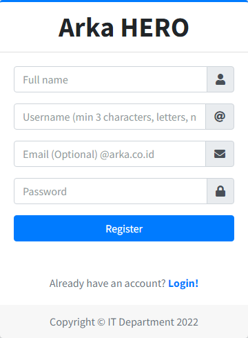

# Register dan Login

Panduan ini menjelaskan cara **mendaftar** (_register_) akun pertama kali dan cara **masuk** (_login_) ke ARKA HERO. Penjelasan memakai bahasa sehari-hari; nama tombol atau kolom di layar mengikuti bahasa Inggris seperti di aplikasi, dengan arti singkat di awal.

| Istilah di layar | Arti singkat                                                   |
| :--------------- | :------------------------------------------------------------- |
| **Register**     | Mendaftar — membuat akun baru.                                 |
| **Login**        | Masuk ke aplikasi setelah punya akun.                          |
| **Username**     | Nama pengguna unik untuk login (bukan nama lengkap).           |
| **Password**     | Kata sandi rahasia.                                            |
| **Sign In**      | Tombol untuk masuk setelah mengisi login dan password.         |
| **URL**          | Alamat aplikasi di browser; gunakan yang diberikan perusahaan. |

---

## 1. Register — membuat akun baru

### Kapan dipakai

Dipakai jika Anda **belum punya akun** dan perusahaan mengizinkan pendaftaran mandiri.

### Langkah-langkah

1. Buka **browser** (Chrome, Edge, Firefox, dll.).
2. Ketik atau tempel alamat: **`http://192.168.32.146:8080/register`**
3. Isi formulir:
    - **Full name** — nama lengkap Anda.
    - **Username** — wajib, minimal 3 karakter, hanya huruf, angka, tanda hubung (`-`), dan garis bawah (`_`). Harus belum dipakai orang lain.
    - **Email** — boleh dikosongkan. Jika diisi, harus valid dan berakhiran **`@arka.co.id`**.
    - **Password** — minimal **5** karakter. Simpan sendiri dan jangan dibagikan.
4. Klik tombol **Register**.

### Setelah Register berhasil

Halaman mengarah ke **Login** dan biasanya muncul pesan bahwa Anda perlu **menghubungi pihak yang mengurus akun** agar akun **diaktifkan**. Baru setelah aktif, Anda bisa **Login** (lihat bagian 2).

---

## 2. Login — masuk ke aplikasi

### Langkah-langkah

1. Buka **`http://192.168.32.146:8080/login`**  
   (Dari halaman Register ada tautan **Login!** jika tersedia.)
2. Isi **Username or Email** — boleh pakai **username** **atau** email kantor (**harus** `@arka.co.id` jika pakai email).
3. Isi **Password**.
4. Klik **Sign In**.

### Setelah berhasil

Anda masuk ke halaman utama aplikasi (biasanya alamat dimulai dari **`http://192.168.32.146:8080/`**).

---

## 3. Contoh kasus error (skenario)

**Situasi:** Anda baru selesai **Register** dan langsung mencoba **Login** dengan username dan password yang sama, tetapi muncul pesan seperti **Login failed!**

**Penjelasan:** Akun baru sering kali **belum diaktifkan**. Meskipun password benar, sistem menolak login sampai **administrator** atau **IT** mengaktifkan akun Anda.

**Yang perlu dilakukan:** Hubungi **administrator** atau **IT** sesuai prosedur perusahaan untuk **pengaktifan**; jangan mengulang **Register** berkali-kali dengan **username** sama agar tidak bentrok data.

---

## 4. Error lain yang mungkin muncul & tindakan singkat

| Gejala / pesan (contoh)                                     | Kemungkinan penyebab                                                     | Apa yang bisa Anda coba                               |
| :---------------------------------------------------------- | :----------------------------------------------------------------------- | :---------------------------------------------------- |
| **Login failed!**                                           | Akun belum aktif, salah ketik password, atau Caps Lock menyalahkan huruf | Pastikan **aktivasi**; periksa pengetikan; coba lagi. |
| **Username already exists**                                 | Username sudah dipakai                                                   | Ganti **username** lain.                              |
| Pesan **username** tidak valid                              | Karakter tidak diperbolehkan atau kurang dari 3 karakter                 | Pakai huruf/angka/`-`/`_` saja, minimal 3 karakter.   |
| Pesan tentang **email**                                     | Format salah, sudah terdaftar, atau bukan `@arka.co.id`                  | Perbaiki email atau kosongkan kolom email.            |
| **Password** terlalu pendek                                 | Kurang dari 5 karakter                                                   | Gunakan password minimal 5 karakter.                  |
| Pesan **email** harus `@arka.co.id` saat login dengan email | Bukan email kantor                                                       | Pakai **username** atau email kantor yang benar.      |
| Halaman tidak terbuka                                       | Jaringan atau alamat salah                                               | Periksa **URL** dan koneksi internet/intranet.        |

Jika sudah dicoba tetapi masih gagal, atau pesan **tidak tercantum** di atas, lanjut ke bagian 5.

---

## 5. Menghubungi administrator

Hubungi **administrator** (atau **IT** / helpdesk internal) jika:

- akun **tidak kunjung aktif** setelah Register,
- **Login** tetap gagal setelah Anda yakin data benar,
- muncul pesan yang **tidak jelas** atau **tidak ada di tabel** di atas,
- Anda tidak yakin apakah akun seharusnya sudah dibuat lewat jalur lain.

**Yang aman untuk disampaikan:** **username** Anda, kapan kejadiannya, dan ringkasan pesan di layar.

**Jangan mengirimkan _password_** lewat chat, email tidak aman, atau screenshot yang memuat data orang lain secara lengkap.

---
