# Table of Contents

- **[Register dan Login](#bab-05-register-dan-login)**
    - [1. Register — membuat akun baru](#bab-05-1-1-register-membuat-akun-baru)
    - [2. Login — masuk ke aplikasi](#bab-05-2-2-login-masuk-ke-aplikasi)
    - [3. Contoh kasus error (skenario)](#bab-05-3-3-contoh-kasus-error-skenario)
    - [4. Error lain yang mungkin muncul & tindakan singkat](#bab-05-4-4-error-lain-yang-mungkin-muncul-tindakan-singkat)
    - [5. Menghubungi administrator](#bab-05-5-5-menghubungi-administrator)
- **[User, Role, dan Permission](#bab-06-user-role-dan-permission)**
    - [1. User Management](#bab-06-1-1-user-management)
    - [2. Role Management (user, approver, superuser, administrator)](#bab-06-2-2-role-management-user-approver-superuser-administrator)
    - [3. Permission Management](#bab-06-3-3-permission-management)
- **[Master Data](#bab-07-master-data)**
    - [1. Mengakses menu Master Data](#bab-07-1-1-mengakses-menu-master-data)
    - [2. Employee Data (Positions, Departments, Grades, Levels, Projects, Religions, Banks)](#bab-07-2-2-employee-data-positions-departments-grades-levels-projects)
    - [3. Official Travel Data (Transportations, Accommodations)](#bab-07-3-3-official-travel-data-transportations-accommodations)
    - [4. Leave Data (Leave Types, National Holidays)](#bab-07-4-4-leave-data-leave-types-national-holidays)
    - [5. Flight Data (Business Partners)](#bab-07-5-5-flight-data-business-partners)
    - [6. Letter Management Data (Letter Categories & Letter Subjects)](#bab-07-6-6-letter-management-data-letter-categories-letter-subjects)
    - [7. Kesalahan umum & bantuan](#bab-07-7-7-kesalahan-umum-bantuan)
- **[Employee Management](#bab-08-employee-management)**
    - [1. Ringkasan menu Employee Management](#bab-08-1-1-ringkasan-menu-employee-management)
    - [2. Dashboard karyawan](#bab-08-2-2-dashboard-karyawan)
    - [3. Daftar karyawan (Employees)](#bab-08-3-3-daftar-karyawan-employees)
    - [4. Input manual data karyawan (Add Employee)](#bab-08-4-4-input-manual-data-karyawan-add-employee)
    - [5. Melihat detail, memperbarui data, mencetak, dan menghapus](#bab-08-5-5-melihat-detail-memperbarui-data-mencetak-dan-menghapus)
    - [6. Import dan export data karyawan](#bab-08-6-6-import-dan-export-data-karyawan)
    - [7. Termination karyawan](#bab-08-7-7-termination-karyawan)
    - [8. Employee Bonds (Ikatan Dinas)](#bab-08-8-8-employee-bonds-ikatan-dinas)
    - [9. Bond Violations (Pelanggaran Ikatan Dinas)](#bab-08-9-9-bond-violations-pelanggaran-ikatan-dinas)
    - [10. Kesalahan & bantuan](#bab-08-10-10-kesalahan-bantuan)
- **[Recruitment Management](#bab-09-recruitment-management)**
    - [1. Ringkasan Menu](#bab-09-1-1-ringkasan-menu)
    - [2. Untuk HR — Recruitment Dashboard](#bab-09-2-2-untuk-hr-recruitment-dashboard)
    - [3. Untuk HR — Requests (FPTK)](#bab-09-3-3-untuk-hr-requests-fptk)
    - [4. Untuk HR — Requests (MPP)](#bab-09-4-4-untuk-hr-requests-mpp)
    - [5. Untuk HR — Candidates (CV)](#bab-09-5-5-untuk-hr-candidates-cv)
    - [6. Untuk HR — Sessions](#bab-09-6-6-untuk-hr-sessions)
    - [7. Untuk HR — Reports](#bab-09-7-7-untuk-hr-reports)
    - [8. My Recruitment Request](#bab-09-8-8-my-recruitment-request)
    - [9. Kesalahan & bantuan](#bab-09-9-9-kesalahan-bantuan)
- **[Official Travel Management (LOT)](#bab-10-official-travel-management-lot)**
    - [1. Untuk HR — Dashboard LOT](#bab-10-1-1-untuk-hr-dashboard-lot)
    - [2. Untuk HR — Daftar permintaan (Requests)](#bab-10-2-2-untuk-hr-daftar-permintaan-requests)
    - [3. Formulir pengajuan HR — Letter Number, Official Travel Detail, Flight Request, Approver Selection](#bab-10-3-3-formulir-pengajuan-hr-letter-number-official-travel-detail)
    - [3.1 Mengubah approver pending (Update Approvers)](#mengubah-approver-pending-lot)
    - [4. Alur Perjalanan Dinas — Arrivals, Departures, Stops/Checkpoint, Edit Destination, Close](#bab-10-4-4-alur-perjalanan-dinas-arrivals-departures-stopscheckpoint-)
    - [5. Untuk HR — Reports](#bab-10-5-5-untuk-hr-reports)
    - [6. Karyawan (non–HR) — My Official Travel Request](#bab-10-6-6-karyawan-nonhr-my-official-travel-request)
    - [7. Kesalahan & bantuan](#bab-10-7-7-kesalahan-bantuan)
- **[Leave Management](#bab-11-leave-management)**
    - [1. Untuk HR — Leave Management Dashboard](#bab-11-1-1-untuk-hr-leave-management-dashboard)
    - [2. Untuk HR — Leave Entitlements](#bab-11-2-2-untuk-hr-leave-entitlements)
    - [3. Untuk HR — Requests (Pengajuan Cuti, Flight Request, Approver Selection, Pembatalan Cuti)](#bab-11-3-3-untuk-hr-requests-pengajuan-cuti-flight-request-approver-s)
    - [4. Untuk HR — Reports](#bab-11-4-4-untuk-hr-reports)
    - [5. Untuk karyawan secara personal — My Leave Request](#bab-11-5-5-untuk-karyawan-secara-personal-my-leave-request)
    - [6. Kesalahan & bantuan](#bab-11-6-6-kesalahan-bantuan)
- **[Roster Management](#bab-12-roster-management)**
    - [Glosarium](#bab-12-1-glosarium)
    - [1. Ringkasan Menu](#bab-12-2-1-ringkasan-menu)
    - [2. Dashboard](#bab-12-3-2-dashboard)
    - [3. Roster Management — Daftar & Siklus Kerja](#bab-12-4-3-roster-management-daftar-siklus-kerja)
    - [4. Periodic Leave Requests](#bab-12-5-4-periodic-leave-requests)
    - [5. Kesalahan & Bantuan](#bab-12-6-5-kesalahan-bantuan)
- **[Overtime Management](#bab-13-overtime-management)**
    - [Glosarium](#bab-13-1-glosarium)
    - [1. Ringkasan Menu](#bab-13-2-1-ringkasan-menu)
    - [2. Untuk HR — Dashboard](#bab-13-3-2-untuk-hr-dashboard)
    - [3. Untuk HR — Requests](#bab-13-4-3-untuk-hr-requests)
    - [4. Untuk HR — Reports](#bab-13-5-4-untuk-hr-reports)
    - [5. Untuk karyawan — My Overtime Request](#bab-13-6-5-untuk-karyawan-my-overtime-request)
    - [6. Kesalahan & bantuan](#bab-13-7-6-kesalahan-bantuan)
- **[Flight Management](#bab-14-flight-management)**
    - [Glosarium](#bab-14-1-glosarium)
    - [1. Ringkasan Menu](#bab-14-2-1-ringkasan-menu)
    - [2. Untuk HR — Flight Management Dashboard](#bab-14-3-2-untuk-hr-flight-management-dashboard)
    - [3. Untuk HR — Requests (membuat FRF)](#bab-14-4-3-untuk-hr-requests-membuat-frf)
    - [4. Untuk HR — Issuances (Letter of Guarantee)](#bab-14-5-4-untuk-hr-issuances-letter-of-guarantee)
    - [5. Untuk karyawan — My Flight Request](#bab-14-6-5-untuk-karyawan-my-flight-request)
    - [6. Kesalahan & bantuan](#bab-14-7-6-kesalahan-bantuan)
- **[Letter Administration](#bab-15-letter-administration)**
    - [Glosarium](#bab-15-1-glosarium)
    - [1. Ringkasan Menu](#bab-15-2-1-ringkasan-menu)
    - [2. Letter Administration Dashboard](#bab-15-3-2-letter-administration-dashboard)
    - [3. Letter Numbers — daftar dan filter](#bab-15-4-3-letter-numbers-daftar-dan-filter)
    - [4. Membuat nomor surat — Create Letter Number](#bab-15-5-4-membuat-nomor-surat-create-letter-number)
    - [5. Detail, ubah, dan aksi nomor surat](#bab-15-6-5-detail-ubah-dan-aksi-nomor-surat)
    - [6. Ekspor dan impor Excel](#bab-15-7-6-ekspor-dan-impor-excel)
    - [7. Integrasi dengan modul lain](#bab-15-8-7-integrasi-dengan-modul-lain)
    - [8. Master data terkait (Letter Categories)](#bab-15-9-8-master-data-terkait-letter-categories)
    - [9. Kesalahan & bantuan](#bab-15-10-9-kesalahan-bantuan)
- **[My Dashboard & My Features](#bab-16-my-dashboard-my-features)**
    - [Glosarium](#bab-16-1-glosarium)
    - [1. My Dashboard](#bab-16-2-1-my-dashboard)
    - [2. Update Profile](#bab-16-3-2-update-profile)
    - [3. My Profile](#bab-16-4-3-my-profile)
    - [4. My Leave Request](#bab-16-5-4-my-leave-request)
    - [5. My Official Travel Request](#bab-16-6-5-my-official-travel-request)
    - [6. My Flight Request](#bab-16-7-6-my-flight-request)
    - [7. My Overtime Request](#bab-16-8-7-my-overtime-request)
    - [8. My Recruitment Request](#bab-16-9-8-my-recruitment-request)
    - [9. Kesalahan & Bantuan](#bab-16-10-9-kesalahan-bantuan)
- **[My Approvals](#bab-17-my-approvals)**
    - [1. Membuka My Approvals dan menyaring daftar (Filters)](#bab-17-1-1-membuka-my-approvals-dan-menyaring-daftar-filters)
    - [2. Meninjau dan memutuskan satu dokumen — Review / View](#bab-17-2-2-meninjau-dan-memutuskan-satu-dokumen-review-view)
    - [3. Menyetujui banyak dokumen sekaligus — Bulk Approve](#bab-17-3-3-menyetujui-banyak-dokumen-sekaligus-bulk-approve)
    - [4. Panel status — Approval Status](#bab-17-4-4-panel-status-approval-status)
    - [Kesalahan & bantuan (end user)](#bab-17-5-kesalahan-bantuan-end-user)

---

---

# Register dan Login

Panduan ini menjelaskan cara **mendaftar** (_register_) akun pertama kali dan cara **masuk** (_login_) ke ARKA HERO. Penjelasan memakai bahasa sehari-hari; nama tombol atau kolom di layar mengikuti bahasa Inggris seperti di aplikasi, dengan arti singkat di awal.

| Istilah di layar | Arti singkat                                                   |
| :--------------- | :------------------------------------------------------------- |
| **Register**     | Mendaftar — membuat akun baru.                                 |
| **Login**        | Masuk ke aplikasi setelah punya akun.                          |
| **Username**     | Nama pengguna unik untuk login (bukan nama lengkap).           |
| **Password**     | Kata sandi rahasia.                                            |
| **Sign In**      | Tombol untuk masuk setelah mengisi login dan password.         |
| **URL**          | Alamat aplikasi di browser; gunakan yang diberikan perusahaan. |

---

## 1. Register — membuat akun baru

### Kapan dipakai

Dipakai jika Anda **belum punya akun** dan perusahaan mengizinkan pendaftaran mandiri.

### Langkah-langkah

1. Buka **browser** (Chrome, Edge, Firefox, dll.).
2. Ketik atau tempel alamat: **`http://192.168.32.146:8080/register`**
3. Isi formulir:
    - **Full name** — nama lengkap Anda.
    - **Username** — wajib, minimal 3 karakter, hanya huruf, angka, tanda hubung (`-`), dan garis bawah (`_`). Harus belum dipakai orang lain.
    - **Email** — boleh dikosongkan. Jika diisi, harus valid dan berakhiran **`@arka.co.id`**.
    - **Password** — minimal **5** karakter. Simpan sendiri dan jangan dibagikan.
4. Klik tombol **Register**.

### Setelah Register berhasil

Halaman mengarah ke **Login** dan biasanya muncul pesan bahwa Anda perlu **menghubungi pihak yang mengurus akun** agar akun **diaktifkan**. Baru setelah aktif, Anda bisa **Login** (lihat bagian 2).

---

## 2. Login — masuk ke aplikasi

### Langkah-langkah

1. Buka **`http://192.168.32.146:8080/login`**  
   (Dari halaman Register ada tautan **Login!** jika tersedia.)
2. Isi **Username or Email** — boleh pakai **username** **atau** email kantor (**harus** `@arka.co.id` jika pakai email).
3. Isi **Password**.
4. Klik **Sign In**.

### Setelah berhasil

Anda masuk ke halaman utama aplikasi (biasanya alamat dimulai dari **`http://192.168.32.146:8080/`**).

---

## 3. Contoh kasus error (skenario)

**Situasi:** Anda baru selesai **Register** dan langsung mencoba **Login** dengan username dan password yang sama, tetapi muncul pesan seperti **Login failed!**

**Penjelasan:** Akun baru sering kali **belum diaktifkan**. Meskipun password benar, sistem menolak login sampai **administrator** atau **IT** mengaktifkan akun Anda.

**Yang perlu dilakukan:** Hubungi **administrator** atau **IT** sesuai prosedur perusahaan untuk **pengaktifan**; jangan mengulang **Register** berkali-kali dengan **username** sama agar tidak bentrok data.

---

## 4. Error lain yang mungkin muncul & tindakan singkat

| Gejala / pesan (contoh)                                     | Kemungkinan penyebab                                                     | Apa yang bisa Anda coba                               |
| :---------------------------------------------------------- | :----------------------------------------------------------------------- | :---------------------------------------------------- |
| **Login failed!**                                           | Akun belum aktif, salah ketik password, atau Caps Lock menyalahkan huruf | Pastikan **aktivasi**; periksa pengetikan; coba lagi. |
| **Username already exists**                                 | Username sudah dipakai                                                   | Ganti **username** lain.                              |
| Pesan **username** tidak valid                              | Karakter tidak diperbolehkan atau kurang dari 3 karakter                 | Pakai huruf/angka/`-`/`_` saja, minimal 3 karakter.   |
| Pesan tentang **email**                                     | Format salah, sudah terdaftar, atau bukan `@arka.co.id`                  | Perbaiki email atau kosongkan kolom email.            |
| **Password** terlalu pendek                                 | Kurang dari 5 karakter                                                   | Gunakan password minimal 5 karakter.                  |
| Pesan **email** harus `@arka.co.id` saat login dengan email | Bukan email kantor                                                       | Pakai **username** atau email kantor yang benar.      |
| Halaman tidak terbuka                                       | Jaringan atau alamat salah                                               | Periksa **URL** dan koneksi internet/intranet.        |

Jika sudah dicoba tetapi masih gagal, atau pesan **tidak tercantum** di atas, lanjut ke bagian 5.

---

## 5. Menghubungi administrator

Hubungi **administrator** (atau **IT** / helpdesk internal) jika:

- akun **tidak kunjung aktif** setelah Register,
- **Login** tetap gagal setelah Anda yakin data benar,
- muncul pesan yang **tidak jelas** atau **tidak ada di tabel** di atas,
- Anda tidak yakin apakah akun seharusnya sudah dibuat lewat jalur lain.

**Yang aman untuk disampaikan:** **username** Anda, kapan kejadiannya, dan ringkasan pesan di layar.

**Jangan mengirimkan _password_** lewat chat, email tidak aman, atau screenshot yang memuat data orang lain secara lengkap.

---

---

# User, Role, dan Permission

Bagian ini untuk pengguna yang diberi akses ke menu **SYSTEMS** di sidebar: **Users**, **Roles**, dan **Permissions**. Biasanya hanya **administrator** atau staf **IT** yang melihat menu ini.

| Istilah                 | Arti singkat                                                                                    |
| :---------------------- | :---------------------------------------------------------------------------------------------- |
| **User**                | Akun orang yang bisa **login** ke ARKA HERO.                                                    |
| **Role** (_peran_)      | Kumpulan hak akses; satu orang bisa punya satu atau lebih **role**.                             |
| **Permission** (_izin_) | Hak detail per fitur (misalnya boleh melihat daftar cuti atau tidak).                           |
| **Administrator**       | Peran dengan akses pengaturan sistem, termasuk mengatur **user**, **role**, dan **permission**. |

---

## 1. User Management

Menu **Users** dipakai untuk melihat dan mengelola **akun pengguna** (nama login, status, karyawan terkait, **role**, dll.).

### Langkah-langkah — membuka halaman dan membaca daftar

1. **Login** ke ARKA HERO.
2. Di sidebar, grup **SYSTEMS**, klik **Users**.  
   Atau buka alamat: `http://192.168.32.146:8080/users`
3. Pada **List of Users**, gunakan kotak **pencarian** atau **Filter** (jika dibuka) untuk menyaring nama, email, **role**, status, dll.
4. Di atas area daftar biasanya ada ringkasan jumlah **Total Users**, **Total Roles**, dan **Total Permissions** (tautan singkat ke halaman terkait).

### Langkah-langkah — menambah pengguna baru (_Add User_)

1. Pada halaman **Users**, klik tombol **Add** (ikon **+**).
2. Isi **Full Name**, **Username**, **Email** (opsional, biasanya `@arka.co.id`), **Password**, **Status** (aktif/tidak aktif).
3. Pilih **Employee** untuk menghubungkan user dengan data personal karyawannya.
4. Pilih **Projects** untuk menentukan akses data, misal user dengan project **000H** hanya bisa melihat data project **000H**.
5. Pilih **Departments** untuk menentukan departemen yang sesuai.
6. Centang **Roles** minimal satu.
7. Simpan dengan tombol **Simpan** / **Submit** di formulir.

**Catatan:** **Role** khusus **administrator** sering hanya boleh diberikan oleh **administrator** lain.

### Langkah-langkah — melihat detail pengguna

1. Pada baris pengguna di **List of Users**, gunakan tombol **View** / ikon mata (sesuai tampilan) untuk membuka halaman detail.
2. Periksa data yang ditampilkan (nama, email, karyawan, proyek, departemen, **role**, status, dll.).
3. **Permission** yang muncul berdasarkan **role**.

### Langkah-langkah — meng-_edit_ pengguna dan mengaktifkan akun yang masih _Inactive_

Jika seseorang sudah **Register** tetapi belum bisa **Login**, sering karena status akun masih **Inactive**. Administrator dapat mengaktifkannya lewat edit user.

1. Pada baris pengguna, klik **Edit** (atau buka `http://192.168.32.146:8080/users/{id}/edit` dengan **id** yang benar).
2. Cari kolom **Status** pada formulir.
3. Ubah dari **Inactive** menjadi **Active** (atau nilai setara di layar Anda), lalu simpan.
4. Sesuaikan field lain jika perlu (**Roles**, **Employee**, dll.) lalu simpan lagi bila ada perubahan.

### Menonaktifkan atau menghapus

- Gunakan opsi **Inactive** pada edit user, atau **Delete** pada baris jika tersedia dan Anda punya hak; ikuti konfirmasi di layar.

### Jika ada masalah

- Tidak melihat menu **Users** → hubungi **administrator** untuk pemberian **role** yang tepat.

---

## 2. Role Management (_user_, _approver_, _superuser_, _administrator_)

Menu **Roles** dipakai untuk mengatur **nama peran** dan **permission** apa saja yang melekat pada peran itu. Di sistem, sering ada peran seperti **user** (karyawan biasa), **approver** (pemberi persetujuan), **superuser** (akses luas sesuai kebijakan), dan **administrator** (pengelola penuh). **Nama pasti** mengikuti yang tampil di layar Anda.

### Langkah-langkah — membuka halaman dan membaca daftar peran

1. **Login** ke ARKA HERO.
2. Di sidebar **SYSTEMS**, klik **Roles**.  
   Atau buka: `http://192.168.32.146:8080/roles`
3. Pada **List of Roles**, baca nama **role** dan cuplikan **Permissions** (badge); jika izin banyak, bisa ada tanda **+N more**.

### Langkah-langkah — menambah peran baru (_Add Role_)

1. Klik **Add** pada halaman **Roles**.
2. Isi **Role Name** (misalnya nama internal perusahaan; bisa mirip **user**, **approver**, **superuser**, **administrator** sesuai kebutuhan).
3. Centang **Permissions** yang boleh dipakai peran ini; gunakan **Select All** jika tersedia.
4. Simpan formulir.

### Langkah-langkah — menyunting peran (_Edit Role_)

1. Pada baris peran di **List of Roles**, klik **Edit**.
2. Ubah **Role Name** atau centang/uncentang **Permissions** sesuai kebijakan.
3. Simpan formulir.

### Menghapus peran

- Gunakan **Delete** jika ada dan diizinkan; hati-hati jika peran masih dipakai pengguna.

### Peran khusus

- **administrator** biasanya dilindungi: hanya **administrator** yang boleh mengubah atau menetapkan peran ini (pesan di layar akan menjelaskan jika Anda tidak berhak).

### Jika ada masalah

- Tidak bisa memberi **permission** tertentu → minta bantuan **administrator** atau **IT**.

---

## 3. Permission Management

Menu **Permissions** berisi daftar **izin** per fitur (nama pendek di kolom **Name**). **Permission** menentukan apa yang boleh dilihat atau diubah di aplikasi; untuk banyak pengguna, izin dikelompokkan lewat **Roles**.

### Langkah-langkah — membuka halaman dan membaca daftar izin

1. **Login** ke ARKA HERO.
2. Di **SYSTEMS**, klik **Permissions**.  
   Atau buka: `http://192.168.32.146:8080/permissions`
3. Tabel menampilkan nomor urut, **Name** (nama permission), dan kolom **Action**.

### Langkah-langkah — menambah izin baru

1. Klik **Add**.
2. Isi nama **permission** sesuai standar tim (biasanya diisi **IT** / **administrator**).
3. Simpan.

### Langkah-langkah — menyunting atau menghapus izin

1. Klik **Edit** pada baris; ubah nama jika diizinkan; simpan.
2. **Delete** jika tersedia; pastikan tidak merusak **role** yang masih memakai izin itu — tanyakan **IT** jika ragu.

### Jika ada masalah

- Menu tidak tampil atau akses ditolak → hubungi **administrator**.

---

---

# Master Data

Panduan ini untuk staf **HR** atau pihak yang diberi tugas mengelola **referensi** di ARKA HERO:

- **Employee Data** (Positions, Departments, Grades, Levels, Projects, Religions, Banks)
- **Official Travel Data** (Transportations, Accomodations)
- **Leave Data** (Leave Types, National Holidays)
- **Flight Data** (Business Partners)
- **Letter Number Data** (Letter Categories)

**Catatan:** Item menu **Master Data** hanya tampil jika akun Anda memiliki **hak akses** yang sesuai (baca/tulis master data, serta izin khusus bila suatu submenu hanya untuk peran tertentu, misalnya **Business Partners** / **National Holidays**). Jika menu tidak muncul, hubungi **administrator**.

---

## 1. Mengakses menu Master Data

### Langkah-langkah — membuka _Master Data_

1. **Login** ke ARKA HERO.
2. Di _sidebar_, temukan grup **GENERAL SECTION**.
3. Buka submenu **Master Data** (ikon _database_); akan terbuka daftar anak menu yang dikelompokkan per topik.
4. Klik jenis data yang ingin dikelola (lihat bagian 2–6).

---

## 2. Employee Data (Positions, Departments, Grades, Levels, Projects, Religions, Banks)

**Employee Data** berisi rujukan yang dipakai saat mengelola karyawan, struktur organisasi, dan pilihan pribadi (agama, bank).

### Kegunaan singkat

| Menu (_sidebar_) | Fungsi singkat                                                                      |
| :--------------- | :---------------------------------------------------------------------------------- |
| **Positions**    | Master jabatan/posisi (cth: Accounting Officer, Admin HR, Mechanic I)               |
| **Departments**  | Master departemen (cth: Accounting, HCS, Plant)                                     |
| **Grades**       | Master grade (cth: Senior, Major, General)                                          |
| **Levels**       | Master level; **Level Order** (hirarki) dan **Roster Cycle** (siklus kerja–libur)   |
| **Projects**     | Kode/nama project; **Leave Type** **Non-Roster** / **Roster** (pengaruh skema cuti) |
| **Religions**    | Data pilihan agama (cth: Islam, Kristen, Katholik, Hindu)                           |
| **Banks**        | Data bank (cth: BCA, Mandiri)                                                       |

### Langkah-langkah — pola umum (lihat, tambah, ubah, hapus)

1. Pilih menu yang diinginkan di bawah **Employee Data** (mis. **Departments**).  
   Atau buka contoh: `http://192.168.32.146:8080/departments`
2. Pada daftar, gunakan **Filter** / kolom pencarian jika ada untuk mencari data.
3. Klik **Add** untuk menambah baris baru, atau gunakan aksi di baris (**Edit** / **Delete** / ikon setelan) sesuai tampilan.
4. Isi form atau modal, lalu simpan (**Save** / **Submit** / setara di layar).

**Catatan:**

- **Departments** — di halaman index ada **Import** (unggah massal) dan **Add**; form biasanya meminta **Department Name** dan **Slug**; baris tabel memiliki **Status** (aktif/tidak aktif). Gunakan impor bila unggah banyak baris; ikuti format/ urutan kolom yang dinyatakan di layar atau di template unduhan bila tersedia.
- **Positions** — menyediakan **Export** (unduh), **Import**, dan **Add**; saat menambah/ menyunting, pilih **Department** jabatan tersebut dan atur **Status** (mis. **Active** / **Inactive**). Impor/ ekspor memudahkan diselaraskan dengan tabel lembar kerja; pastikan isi file sesuai aturan unik/ referensi (mis. departemen harus sudah terdaftar).
- **Projects** (atau bisa disebut _site_)— selain kode, nama, lokasi, **Bowheer**, dan **Status**, wajib menentukan **Leave Type** (**Non-Roster** atau **Roster**); penjelasan pengaruhnya ada di [Projects — Leave Type](#projects--leave-type-non-roster-dan-roster). Penempatan karyawan, cuti, dan modul lain merujuk **project** ini—hindari mengubah atau menghapus **Project Code** sembarangan jika data operasional sudah melekat.
- **Grades** — tabel dengan aksi **Edit** / ubah **status**; nonaktifkan alih-alih hapus bila kebijakan perusahaan melarang penghapusan.
- **Levels** — ada kolom **Level Order** dan kolom **Roster Cycle**; uraiannya di [Levels — Level Order dan Roster Cycle](#levels--level-order-dan-roster-cycle).
- **Religions** dan **Banks** — tampil sebagai daftar + **Add** lewat jendela _popup_ di halaman yang sama; daftar agama/ bank memang pendek, jadi penyesuaian kecil cukup lewat sana.
- **Urutan saran (operasional):** isi/ stabilkan **Departments** (dan impor) sebelum memetakan **Positions**; pastikan **Projects**, **Grades**, **Levels**, lalu pilihan **Religions** / **Banks** sudah rapi sebelum puncak pemuatan karyawan—banyak field di **Employees** memilih dari master di atas.
- **Dampak ke modul lain:** jabatan, departemen, project, grade, dan level dipakai alur pendataan karyawan, cuti, perjalanan dinas, rekrutmen, dan **Roster** untuk di site; bila _delete_ ditolak atau muncul peringatan terikat, jangan dipaksakan; hubungi **IT** bila butuh pembersihan data lama.

### Levels — Level Order dan Roster Cycle

Di **Master Data** → **Employee Data** → **Levels**, setiap level punya **Level Name**, **Level Order**, konfigurasi siklus roster (jika dipakai), dan **Status** (**Active**). Daftar memiliki kolom **Order** dan **Roster Cycle**.

| Isian / kolom                  | Penggunaan                                                                                                                                                                                                                                                                                                                     |
| :----------------------------- | :----------------------------------------------------------------------------------------------------------------------------------------------------------------------------------------------------------------------------------------------------------------------------------------------------------------------------- |
| **Level Order**                | Angka urutan **hirarki** jabatan: **1** = level terendah, angka **lebih besar** = level lebih tinggi. Tabel diurutkan menurut **Order** (naik). Saat menambah level baru, fokus ke field **Level Order** dapat mengusulkan nilai **berikutnya** (maksimum order sementara + 1)—sesuaikan bila perusahaan punya lompatan angka. |
| **Off Days**                   | Jumlah **hari libur** dalam **satu siklus** kerja (_roster_). Teks bantuan di form menyebut bawaan **14** hari; boleh diubah sesuai kebijakan (mis. durasi _off_ antar putaran kerja).                                                                                                                                         |
| **Work Days**                  | Jumlah **hari kerja** dalam **satu siklus** yang dipasangkan dengan **Off Days**. Isi bila level ini memakai pola **roster** (kerja–libur bergilir). **Kosongkan** bila level ini **tidak** memakai roster (bukan shift rotasi); petunjuk di layar: _leave empty for non-roster_.                                              |
| **Cycle Length**               | **Total hari** satu putaran siklus (**Work Days** + **Off Days**), umumnya **dihitung otomatis** saat **Off Days** / **Work Days** diubah. Boleh dipakai untuk periksa panjang siklus (mis. 28 hari = 2×14).                                                                                                                   |
| **Roster Cycle** (kolom tabel) | Ringkasan pola roster untuk level yang sudah diisi **Work Days**; jika level **non-roster** (tanpa hari kerja siklus), tampilan mengindikasikan tidak ada konfigurasi siklus. Format angka mengikuti tampilan aplikasi (perbandingan minggu/masa kerja vs libur).                                                              |

**Catatan:** Samakan kebijakan internal: karyawan di **project** bertipe **Roster** (lihat [Projects — Leave Type](#projects--leave-type-non-roster-dan-roster)) sebaiknya memakai **Level** yang juga punya konfigurasi siklus (isi **Work Days**) agar modul **Roster** dan perhitungan cuti konsisten.

### Projects — Leave Type (Non-Roster dan Roster)

Di formulir **Add** / **Edit** **Project**, field **Leave Type** wajib diisi. Daftar project menampilkan kolom **Leave Type**.

| Pilihan        | Maksud penggunaan                                                                                                                                                                                                                                                                                |
| :------------- | :----------------------------------------------------------------------------------------------------------------------------------------------------------------------------------------------------------------------------------------------------------------------------------------------- |
| **Non-Roster** | Project dengan pola kerja “kantor” / harian (bukan jadwal shift rotasi penuh). Jenis project ini memengaruhi **perangkat jenis cuti** yang boleh dipakai (mis. cuti tahunan **annual** bersama jenis cuti berbayar, tidak berbayar, dan cuti panjang layanan / **LSL** sesuai aturan di sistem). |
| **Roster**     | Project karyawan **shift / rotasi** (sesuai modul **Roster**). Skema jenis cuti disesuaikan (mis. penekanan ke cuti berbayar, tidak berbayar, dan **LSL** tanpa pola cuti tahunan standar kantor); pastikan **Level** karyawan dan master **Roster** selaras.                                    |

Pilih **Roster** hanya bila operasional project memang memakai penjadwalan siklus; pilih **Non-Roster** untuk pekerjaan non-shift sesuai definisi perusahaan. Setelah project dipakai massal, mengganti **Leave Type** dapat berdampak ke alur **Leave** dan **Roster**—koordinasikan dengan **HR** bila ragu.

---

## 3. Official Travel Data (Transportations, Accommodations)

Rujukan untuk modul perjalanan dinas (LOT): moda transportasi dan tipe akomodasi.

### Kegunaan singkat

| Menu (_sidebar_)    | Fungsi singkat                                                   |
| :------------------ | :--------------------------------------------------------------- |
| **Transportations** | Data referensi transportasi (cth: Company Car, Public Transport) |
| **Accomodations**   | Data referensi akomodasi (cth: Hotel, Mess, Site)                |

### Langkah-langkah

1. Buka **Master Data** → **Official Travel Data** → **Transportations** atau **Accommodations**.  
   Contoh: `http://192.168.32.146:8080/transportations` atau `http://192.168.32.146:8080/accommodations`
2. Gunakan tabel: **Add** untuk buat baru, **Edit** / **Delete** untuk sunting/hapus sesuai izin.
3. Simpan perubahan; pastikan data tidak terhapus jika masih dirujuk transaksi lama (biasanya muncul pesan jika terikat).

---

## 4. Leave Data (Leave Types, National Holidays)

Pengaturan jenis cuti/kalender untuk modul **Leave**.

### Kegunaan singkat

| Menu (_sidebar_)      | Fungsi singkat                                                              |
| :-------------------- | :-------------------------------------------------------------------------- |
| **Leave Types**       | Master jenis cuti: **Name**, **Code**, **Category**, **Default Days**, dll. |
| **National Holidays** | Hari libur nasional (cth: Tahun Baru, Hari Kemerdekaan Indonesia)           |

### Langkah-langkah — Leave Types

1. Buka `http://192.168.32.146:8080/leave/types`
2. **Add** untuk form tambah, **Edit** / **View** jika tersedia di baris. Isi form lalu simpan; di daftar tersedia tombol **Toggle** untuk mengaktifkan/menonaktifkan jenis cuti.
3. **Delete** hanya tersedia jika jenis cuti tersebut belum pernah dipakai untuk **hak cuti** atau **permintaan cuti**; jika sudah terikat, sistem menolak penghapusan (sesuai pesan di layar).

**Izin:** kelola jenis cuti hanya bila peran Anda memuat hak akses **Leave Types** (lihat, tambah, ubah, hapus) di pengaturan **Roles** / **Permissions**; nama persis mengikuti yang di sistem.

### Leave Types — field di form

Form memakai label layar **bahasa Inggris** (seperti di aplikasi). Teks bantuan di samping/m bawah isian mengikuti tampilan **Create/Edit Leave Type**.

| Field (layar)                   | Wajib              | Keterangan                                                                                                                                                            |
| :------------------------------ | :----------------- | :-------------------------------------------------------------------------------------------------------------------------------------------------------------------- |
| **Name**                        | Ya                 | Nama tampilan jenis cuti (maks. 255 karakter).                                                                                                                        |
| **Code**                        | Ya                 | Kode singkat; **tidak boleh duplikat** dengan jenis cuti lain (maks. 255 karakter).                                                                                   |
| **Category**                    | Ya                 | Pilih satu: **Annual**, **Paid**, **Unpaid**, **Long Service Leave**, **Periodic Leave** — menentukan perilaku jenis cuti di aplikasi.                                |
| **Default Days**                | Ya                 | Angka bulat **≥ 0**; hak hari default (hak jatah) untuk jenis ini.                                                                                                    |
| **Eligible After (Years)**      | Ya                 | Angka bulat **≥ 0**; lama minimum masa kerja (tahun) sebelum karyawan memenuhi syarat jenis cuti ini.                                                                 |
| **Deposit Days (First Period)** | Boleh 0            | Angka bulat **≥ 0**; bila tidak diisi diperlakukan sebagai 0. Teks bantuan form: _For LSL first period only_ — khusus terkait periode pertama **Long Service Leave**. |
| **Allow Carry Over**            | Opsional (centang) | Bila dicentang, hari yang tidak terpakai **boleh dibawa** ke periode berikut. Teks bantuan: _Allow unused days to carry over to next period_.                         |
| **Active** (daftar)             | Dikelola di sana   | Saat **tambah** baru, jenis disimpan **aktif**; nonaktifkan lewat **Edit** atau ikon **Toggle** di daftar. Teks bantuan: _Leave type is available for use_.           |
| **Remarks**                     | Opsional           | Catatan (maks. 1000 karakter).                                                                                                                                        |

### Leave Types — pilihan Category

Di _dropdown_ **Category** pilihan yang tersedia: **Annual**, **Paid**, **Unpaid**, **Long Service Leave**, **Periodic Leave**.

Rangkuman isi panel **Category Information** di halaman **Create Leave Type** (tersedia di sisi form):

- **Annual:** cuti tahunan reguler; contoh porsi 12 hari per tahun; umumnya baru memenuhi syarat setelah 1 tahun masa kerja.
- **Paid:** cuti **ber**gaji untuk keperluan khusus; contoh: pernikahan, kelahiran, dsb.; sering 2–3 hari per kejadian (nilai rincian disesuaikan perusahaan lewat **Default Days**).
- **Unpaid:** cuti **tanpa** gaji; untuk alasan pribadi (detail kebijakan gaji mengikuti aturan perusahaan / HR).
- **Long Service Leave (LSL):** cuti panjang setelah masa kerja panjang; contoh 50 hari per 5–6 tahun; contoh rincian periode pertama: 40 hari ditarik + **10 hari deposit** (selaras dengan maksud field **Deposit Days (First Period)** di form).
- **Periodic:** cuti yang berulang menurut siklus (mis. bulanan, triwulan, tahunan) untuk perawatan, pelatihan, acara, dsb. (mengacu teks panel).

**Persetujuan:** hanya jenis kategori **Paid** dan **Unpaid** yang di aplikasi memerlukan alur **approval**; kategori **Annual** / **LSL** / **Periodic** tidak mengikuti aturan persetujuan itu.

### Leave Types — nilai bawaan saat Category dipilih (form Create)

Saat **Category** diubah, form dapat mengisi ulang sejumlah field secara otomatis sebagai bantuan (Anda masih boleh mengubah sebelum simpan), sesuai perilaku halaman **Create**:

| **Category**           | **Default Days** | **Eligible After (Years)** | **Deposit Days (First Period)** | **Allow Carry Over** |
| :--------------------- | :--------------- | :------------------------- | :------------------------------ | :------------------- |
| **Annual**             | 12               | 1                          | 0                               | Tidak                |
| **Paid**               | 0                | 0                          | 0                               | Tidak                |
| **Unpaid**             | 0                | 0                          | 0                               | Tidak                |
| **Long Service (LSL)** | 50               | 5                          | 10                              | Ya                   |
| **Periodic**           | 1                | 0                          | 0                               | Tidak                |

### Leave Types — aturan simpan

- **Name**, **Code**, **Category**, **Default Days**, **Eligible After (Years)** wajib; **Default Days** dan **Eligible After** angka bulat, minimal **0**.
- **Code** tidak boleh sama dengan jenis cuti lain (pada **edit**, kode yang sama di baris saat ini diperbolehkan).
- **Deposit days** boleh kosong (diperlakukan sebagai 0), minimal **0** jika diisi.
- **Remarks** maks. 1000 karakter; **Carry over** lewat centang; **Status aktif** mengikuti uraian di atas.

### Langkah-langkah — National Holidays

1. Buka `http://192.168.32.146:8080/leave/national-holidays`
2. Tambah, ubah, atau hapus entri libur; simpan.  
   Tampilan bisa memakai tabel dengan pembaruan tanpa pindah halaman; ikuti konfirmasi sebelum **Delete**.

**Catatan:** Submenu **National Holidays** hanya muncul bila peran Anda punya hak tampil untuk modul ini (diminta ke **administrator** jika tidak terlihat).

---

## 5. Flight Data (Business Partners)

Mitra / pihak (misal travel agent atau maskapai) yang dirujuk modul penerbangan.

### Langkah-langkah

1. Pastikan peran Anda punya hak akses **Business Partners**; lalu buka **Master Data** → **Flight Management Data** → **Business Partners**.  
   Atau: `http://192.168.32.146:8080/business-partners`
2. **Add** untuk rekam mitra baru; isi data yang diminta; simpan.
3. **Edit** / **Delete** pada baris jika tersedia; hati-hati jika data sudah dipakai penerbitan/permintaan.

---

## 6. Letter Management Data (Letter Categories & Letter Subjects)

**Letter Category** mengelompokkan jenis surat untuk **penomoran** dan tampilan di **Letter Numbers**. **Letter Subject** (subjek) adalah rincian per kategori; satu kategori bisa punya banyak subjek. Setiap **nomor surat** terhubung ke satu **kategori** dan, bila dipilih, ke satu **subjek**.

**Catatan:** menu **Letter Numbers** (operasi penomoran) ada di **Letter Administration**, bukan di bawah _Master Data_; bab ini hanya **master** kategori & subjek.

### Letter Categories — isian dan perilaku

| Field (layar)          | Wajib    | Keterangan                                                                                                                                                                                                        |
| :--------------------- | :------- | :---------------------------------------------------------------------------------------------------------------------------------------------------------------------------------------------------------------- |
| **Category Code**      | Ya       | Kode singkat, **unik**, maks. **10** karakter.                                                                                                                                                                    |
| **Category Name**      | Ya       | Nama kategori, maks. **100** karakter.                                                                                                                                                                            |
| **Description**        | Opsional | Penjelasan tambahan.                                                                                                                                                                                              |
| **Numbering Behavior** | Ya       | **Annual Reset** — _Sequence number resets to 1 at the start of each year._ **Continuous** — _Sequence number keeps incrementing indefinitely._ Saat menambah kategori, pilihan bawaan biasanya **Annual Reset**. |
| **Status**             | Ya       | **Active** / **Inactive**.                                                                                                                                                                                        |

Kategori baru tercatat atas nama pengguna yang sedang login. Daftar menampilkan **Behavior** (**Annual Reset** / **Continuous**), jumlah **Subjects**, dan aksi.

**Hapus kategori:** tidak diizinkan jika kategori sudah punya **nomor surat** (data di **Letter Numbers**). Pesan di layar umumnya: _Cannot delete category that has letter numbers!_

**Ubah kategori:** lewat **Edit** (modal) pada baris yang sama.

### Letter Subjects — hubungan dengan kategori

- Setiap subjek selalu menempel pada **satu kategori**; di daftar kategori, gunakan tombol **Manage Subjects** (ikon daftar) untuk membuka halaman pengelolaan subjek **hanya untuk kategori tersebut**. Alamat mengikuti pola `http://192.168.32.146:8080/letter-subjects/` + identitas yang dipakai tautan (tekan tombol di layar, jangan susun alamat sendiri). Di atas tabel ada ringkasan **Code**, **Name**, **Description** kategori.
- Pada form subjek di halaman itu, isi **Subject Name** (maks. 255 karakter) dan **Status**; kategori sudah ditentukan oleh halaman yang Anda buka (bukan memilih kategori baru di setiap baris).

Tabel subjek menampilkan **Created By** (siapa yang membuat) dan **Created At**, urut nama subjek.

**Hapus subjek:** gunakan tombol hapus di baris tabel subjek. **Penting:** angka di alamat yang tampak mirip bisa berarti **buka daftar per kategori** (dari menu kategori) atau **hapus satu subjek** — selalu gunakan tombol di layar, jangan menyusun URL sendiri.

Jika subjek masih dipakai **nomor surat**, penghapusan ditolak dengan pesan seperti: _Cannot delete subject because it is still being used in letter numbers_. Di modul lain, daftar pilihan subjek biasanya hanya menampilkan subjek **aktif**, diurut nama.

### Langkah-langkah — ringkas

1. **Kategori** — Buka `http://192.168.32.146:8080/letter-categories` (**Master Data** → **Letter Management Data** → **Letter Categories**). **Add Category** isi kode, nama, perilaku **Numbering**, status; **Edit** / **Delete** dari ikon di baris.
2. **subjek** — Dari jumlah **Subjects** atau tombol **Manage Subjects** pada kategori, buka daftar subjek kategori itu; **Add Subject** isi **Subject Name** dan status, simpan.
3. Sebelum **Delete** kategori atau subjek, pastikan tidak dipakai oleh **nomor surat** yang masih aktif.

---

## 7. Kesalahan umum & bantuan

| Gejala / pesan                                           | Kemungkinan penyebab                                    | Apa yang bisa dicoba                                                                                    |
| :------------------------------------------------------- | :------------------------------------------------------ | :------------------------------------------------------------------------------------------------------ |
| Menu **Master Data** tidak tampil                        | Hak akses belum diberi                                  | Hubungi **administrator**; minta hak **master data** (dan modul khusus bila perlu).                     |
| **403** / Akses ditolak                                  | Izin baca / tulis tidak ada                             | Cek peran; minta hak **buat** / **ubah** / **hapus** sesuai pekerjaan Anda.                             |
| **Import** gagal (Departments)                           | Format berkas / sheet salah, atau tipe data tidak cocok | Unduh contoh, sesuaikan kolom, ulangi unggah.                                                           |
| **Delete** ditolak / gagal                               | Data masih dipakai modul lain                           | Nonaktifkan bila tersedia, atau rujuk **IT** untuk integritas data.                                     |
| Duplikat kode/ nama                                      | Kode atau nama sudah terpakai                           | Ganti kode / label; cek dulu di daftar.                                                                 |
| **National Holidays** / **Business Partners** tidak ada  | Modul hanya untuk peran tertentu                        | Mohon **administrator** mengaktifkan hak tampil untuk **National Holidays** atau **Business Partners**. |
| Pesan **Cannot delete category that has letter numbers** | Kategori punya data di **Letter Numbers**               | Hapus/ pindah nomor surat terkait dulu, atau jangan hapus kategori.                                     |
| Pesan subjek **still being used in letter numbers**      | **Letter Subject** terpakai **Letter Number**           | Hapus/ ganti rujukan nomor surat ke subjek lain jika memungkinkan, lalu coba lagi.                      |

### Menghubungi administrator atau IT

Sampaikan: **modul** yang dibuka, **username** atau email kantor, waktu kejadian, dan **teks error** (atau _screenshot_ tanpa data sensitif). **Jangan** mengirim **password** lewat chat. Untuk batasan aturan perusahaan (apa boleh dihapus, siapa yang meng-**Import** resmi) ikuti **SOP** internal HR/IT.

### Jika ada masalah (ringkas)

- Perubahan tidak tersimpan: periksa validasi form (warna merah di field) dan coba ulang.
- Perilaku tabel/ modal tidak wajar: segarkan halaman, coba peramban lain, laporkan ke **IT** bila terus terjadi.

---

---

# Employee Management

Panduan ini ditujukan untuk **HR** yang mengelola data karyawan di ARKA HERO, mulai dari dashboard, data karyawan aktif, input manual, import-export, termination, sampai ikatan dinas dan pelanggaran ikatan dinas. Teks pada tombol, menu, tab, dan nama field mengikuti label yang tampil di aplikasi, sehingga beberapa istilah tetap menggunakan Bahasa Inggris.

| **Istilah**             | Arti singkat                                                                                                                |
| :---------------------- | :-------------------------------------------------------------------------------------------------------------------------- |
| **Employee Management** | Grup menu HR untuk melihat dashboard karyawan, daftar karyawan, ikatan dinas, dan pelanggaran ikatan dinas.                 |
| **Dashboard**           | Ringkasan statistik dan pintasan cepat terkait data karyawan.                                                               |
| **Employees**           | Daftar utama data karyawan aktif maupun tidak aktif.                                                                        |
| **Personal**            | Tab data identitas, kelahiran, kontak, alamat, dan dokumen pribadi seperti KTP/KK.                                          |
| **Employment**          | Tab data kepegawaian seperti **Employee ID (NIK)**, **Date of Hire**, **Position**, **Project**, **Grade**, dan **Level**.  |
| **Termination**         | Proses mengubah status administrasi karyawan menjadi tidak aktif karena kontrak selesai, resign, retired, atau alasan lain. |
| **Employee Bonds**      | Pencatatan ikatan dinas karyawan, termasuk nomor surat, periode ikatan, nilai investasi, dan dokumen perjanjian.            |
| **Bond Violations**     | Pencatatan pelanggaran ikatan dinas dan nominal penalti yang perlu ditindaklanjuti.                                         |
| **Import** / **Export** | Fitur untuk unggah atau unduh data karyawan menggunakan file Excel sesuai format sistem.                                    |

---

## 1. Ringkasan menu **Employee Management**

| Menu                | Uraian singkat                                                                                                                                                                          |
| :------------------ | :-------------------------------------------------------------------------------------------------------------------------------------------------------------------------------------- |
| **Dashboard**       | Ringkasan total karyawan, komposisi staff/non-staff, status permanen/kontrak, ulang tahun bulan berjalan, grafik per department/project, karyawan baru, dan kontrak yang akan berakhir. |
| **Employees**       | Daftar karyawan, filter data, tombol **Add**, **Import**, **Export**, akses detail, dan tombol **Terminated** bila akun memiliki izin termination.                                      |
| **Employee Bonds**  | Daftar ikatan dinas, filter status/periode/karyawan, tambah ikatan dinas, dan akses pelanggaran.                                                                                        |
| **Bond Violations** | Daftar pelanggaran ikatan dinas, filter pembayaran, tambah pelanggaran, dan tindak lanjut pembayaran penalti.                                                                           |

**Catatan:** Menu atau tombol tertentu hanya tampil bila akun Anda memiliki **hak akses** yang sesuai. Jika menu tidak terlihat, hubungi administrator untuk pengecekan izin.

---

## 2. Dashboard karyawan

### Langkah-langkah - membuka **Employee Dashboard**

1. **Login** ke ARKA HERO.
2. Di sidebar, buka **HERO SECTION** -> **Employee Management** -> **Dashboard**.
3. Baca kartu ringkasan utama:
    - **Total Employees** - jumlah seluruh karyawan dalam cakupan akses akun Anda.
    - **Staff/Non-Staff** - perbandingan karyawan staff dan non-staff.
    - **Permanent/Contract** - perbandingan status kontrak/permanen.
    - **Born this [Month]** - jumlah karyawan yang ulang tahun pada bulan berjalan.
4. Gunakan **Quick Actions** bila tersedia:
    - **Personal Details**, **Administrations**, **Bank Accounts**, **Tax Identification**.
    - **Insurances**, **Driver Licenses**, **Employee Families**, **Emergency Calls**.
    - **Educations**, **Courses**, **Job Experiences**, **Additional Data**.
    - **Operable Units**, **Add New Employee**, **View All Employees**, **Import Data**.
5. Periksa grafik **Employees by Department** dan **Employees by Project** untuk melihat sebaran karyawan. Klik **View All Departments** atau **View All Projects** untuk daftar lebih lengkap.
6. Gunakan tabel **Recently Joined Employees in Last 30 Days** untuk melihat karyawan baru, dan tabel **Contracts Expiring Soon in Next 30 Days** untuk memantau kontrak yang akan selesai.

    

**Catatan:** Angka dashboard mengikuti cakupan project atau data yang boleh dilihat oleh akun Anda. Jika angka berbeda dengan rekap manual, pastikan filter project, status karyawan, dan hak akses sudah sesuai.

---

## 3. Daftar karyawan (**Employees**)

### Langkah-langkah - membuka **List of Employees**

1. **Login** ke ARKA HERO.
2. Di sidebar, buka **HERO SECTION** -> **Employee Management** -> **Employees**.
3. Pada halaman **Employees**, baca kartu **List of Employees**.
4. Gunakan tombol di kanan atas sesuai kebutuhan:
    - **Terminated** - membuka daftar karyawan yang sudah di-termination.
    - **Export** - mengunduh data karyawan.
    - **Import** - membuka modal **Import Data** untuk unggah file.
    - **Add** - membuat data karyawan baru secara manual.
5. Buka panel **Filter** untuk menyaring data berdasarkan **DOH From**, **DOH To**, **NIK**, **Full Name**, **Project**, **Department**, **Position**, **Grade**, **Level**, **Status**, dan **Staff**.
6. Tabel menampilkan kolom **No**, **NIK**, **Full Name**, **Project**, **Department**, **Position**, **Grade**, **Level**, **Status**, dan **Action**.
7. Pada kolom **Action**, klik ikon **Detail** untuk membuka profil lengkap karyawan.

    

**Catatan:** Filter **Status** biasanya otomatis menampilkan **Active**. Pilih **Not Active** atau **All** jika Anda perlu melihat data yang tidak aktif atau seluruh data.

---

## 4. Input manual data karyawan (**Add Employee**)

### Langkah-langkah - membuat karyawan baru

1. Dari halaman **Employees**, klik **Add**.
2. Sistem membuka halaman **Employee** dengan form **Add Employee**.
3. Isi data dari kiri ke kanan mengikuti tahapan pengisian. Anda dapat berpindah menggunakan tombol **Next** / **Previous** atau klik judul bagian di atas. Pengisian data karyawan minimal bagian **Personal** dan **Employment**
4. Setelah semua bagian yang diperlukan terisi, klik **Save**. Gunakan **Back** untuk kembali ke daftar tanpa menyimpan.

**1. Personal**  
Isi identitas pribadi pada bagian **Personal Information**, **Birth Information**, **Personal Details**, **Contact Information**, dan **Address Information**. Field penting mencakup **Full Name**, **Identity Card**, **Nationality**, **Upload Kartu Tanda Penduduk (KTP)**, **Upload Kartu Keluarga (KK)**, **Place of Birth**, **Date of Birth**, **Blood Type**, **Religion**, **Gender**, **Marital Status**, **Phone Number**, **Email Address**, **Street Address**, **Village**, **Ward**, **District**, dan **City**.

    

**Catatan:** File KTP dan KK menggunakan label upload **PDF/JPG/PNG (max 5MB)**. Pastikan dokumen terbaca jelas sebelum disimpan.

**2. Employment**  
Isi data pekerjaan pada **Employment Details**, **Hiring Information**, **Position Information**, dan **Certificates & References**. Field penting mencakup **Employee ID (NIK)**, **Employee Class** (**Staff** / **Non Staff**), **Date of Hire**, **Place of Hire**, **FOC Date**, **Agreement Type**, **Position**, **Department**, **Grade**, **Level**, **Project**, **Company Program**, **FPTK Number**, dan **Certificate Number**.

    

**Catatan:** **Department** biasanya mengikuti **Position** yang dipilih. Jika department tidak sesuai, periksa master data position terlebih dahulu.

**3. Bank**  
Isi rekening pembayaran karyawan. Data yang umum diperlukan meliputi pilihan bank, nomor rekening, nama pemilik rekening, cabang, dan dokumen pendukung seperti buku tabungan bila tersedia.

    

**4. Tax**  
Isi identitas pajak karyawan, termasuk nomor pajak dan dokumen pendukung jika diminta. Pastikan data pajak mengikuti dokumen resmi karyawan.

    

**5. Insurances**  
Isi data asuransi atau BPJS pada bagian **Insurances**. Bila ada lebih dari satu data, tambahkan baris sesuai kebutuhan dan unggah **supporting document** bila tersedia.

    

**6. Licenses**  
Isi data lisensi atau surat izin, misalnya SIM atau izin kerja tertentu. Perhatikan tanggal berlaku dan dokumen pendukung agar HR dapat memantau masa berlaku.

    

**7. Families**  
Isi data keluarga atau tanggungan karyawan. Gunakan informasi sesuai dokumen resmi karyawan.

    

**8. Educations**  
Isi riwayat pendidikan, jurusan, institusi, tahun, dan dokumen pendukung bila ada.

    

**9. Courses**  
Isi riwayat kursus, pelatihan, sertifikasi, atau training yang relevan.

    

**10. Experiences**  
Isi pengalaman kerja sebelumnya, posisi, perusahaan, periode kerja, dan keterangan lain bila diperlukan.

    

**11. Units**  
Isi data unit operasional yang terkait dengan karyawan, bila karyawan memegang atau menggunakan unit tertentu.

    

**12. Emergencies**  
Isi kontak darurat karyawan agar perusahaan memiliki nomor yang dapat dihubungi saat keadaan mendesak.

    

**13. Additional**  
Isi informasi tambahan yang tidak tercakup di tab lain, sesuai kebutuhan perusahaan.

    

**14. Images**  
Unggah gambar atau foto dokumen lain bila diperlukan. Gunakan file yang jelas dan hindari duplikasi dokumen yang sama.

    

**Catatan:** Field wajib akan menampilkan pesan validasi bila kosong atau tidak sesuai. Field yang sering wajib adalah **Full Name**, **Identity Card**, **Place of Birth**, **Date of Birth**, **Employee ID (NIK)**, **Place of Hire**, **Date of Hire**, **Employee Class**, **Position**, dan **Project**.

---

## 5. Melihat detail, memperbarui data, mencetak, dan menghapus

### Langkah-langkah - membuka detail karyawan

1. Buka **HERO SECTION** -> **Employee Management** -> **Employees**.
2. Cari karyawan menggunakan **Filter** atau pencarian tabel.
3. Pada kolom **Action**, klik ikon **Detail**.
4. Halaman detail menampilkan nama karyawan dan **tab** **Personal**, **Employment**, **Bank**, **Tax**, **Insurances**, **Licenses**, **Families**, **Educations**, **Courses**, **Experiences**, **Units**, **Emergencies**, **Additional**, dan **Images** untuk berpindah antar kategori data.
5. Gunakan tombol **Print** untuk mencetak profil karyawan bila diperlukan.
6. Gunakan tombol **Back** untuk kembali ke daftar.

    

### Langkah-langkah - memperbarui data per bagian

1. Di halaman detail karyawan, buka tab yang ingin diperbarui, misalnya **Personal**, **Employment**, **Bank**, **Tax**, **Insurances**, **Licenses**, atau **Educations**.
2. Gunakan tombol edit atau aksi yang tersedia di bagian tersebut.
3. Ubah data pada modal/form yang muncul.
4. Klik tombol simpan pada modal/form.
5. Periksa kembali tab terkait untuk memastikan data sudah berubah.

**Catatan:**

1. Beberapa bagian seperti **Bank**, **Tax**, **Insurances**, **Licenses**, dan **Educations** dapat memiliki dokumen pendukung. Jika mengganti dokumen, pastikan file baru adalah file final dan sesuai kebijakan perusahaan.
2. Khusus data **Employment**, jika menambahkan NIK baru, maka NIK lama akan otomatis **Inactive**, sementara NIK baru yang aktif tampil sebagai **Active**, sehingga riwayat NIK tercatat di tabel **Employment History** (contoh: Eko Prasetyo, NIK aktif **20025** - _data dummy_).

    

### Langkah-langkah - menghapus data karyawan

1. Buka halaman detail karyawan.
2. Jika akun Anda memiliki izin, tombol **Delete Employee** akan tampil.
3. Klik **Delete Employee** dan baca konfirmasi: **This employee and all associated data will be deleted. Are you sure?**
4. Lanjutkan hanya jika penghapusan memang sudah disetujui secara internal.

**Catatan:** Penghapusan karyawan berdampak pada data terkait. Untuk karyawan yang sudah tidak bekerja, gunakan alur **Termination** bila tujuannya hanya menonaktifkan status kerja.

---

## 6. Import dan export data karyawan

### Langkah-langkah - **Export**

1. Buka **HERO SECTION** -> **Employee Management** -> **Employees**.
2. Klik **Export**.
3. Simpan file yang diunduh.
4. Gunakan file hasil export sebagai bahan rekap atau acuan format import bila tim Anda memakai template yang sama.

### Langkah-langkah - **Import Data**

1. Buka **Employees**, lalu klik **Import**. Dari **Dashboard**, Anda juga dapat memakai **Quick Actions** -> **Import Data** bila tombol tersedia.
2. Pada modal **Import Data** atau **Import Employees**, klik **Choose file** / **Choose file...**.

    

3. Pilih file Excel karyawan. Pada dashboard, keterangan file adalah **Only Excel files (.xlsx, .xls) are allowed**.
4. Klik **Submit** atau **Import**.
5. Untuk mempercepat proses import, pastikan file Excel Anda sudah sesuai dengan template yang diberikan oleh sistem. Gunakan file hasil **Export** resmi sebagai dasar, **hanya isi data yang butuh perubahan/penambahan**, dan jangan mengubah nama sheet maupun judul kolom. Sebelum mengimpor, periksa juga kembali konsistensi data seperti:
    - Nama sheet dan header kolom tidak salah eja
    - Format field seperti **identity_card_no** (nomor KTP) harus unik dan dalam format yang benar
    - Nilai pada field yang menggunakan referensi master data (misal: agama, jabatan, class, termination reason) harus sama persis
    - Field wajib diisi (seperti NIK, full_name, identity_card_no) sudah terisi untuk semua data yang ingin diimpor.
6. Jika muncul **Import Validation Errors**, baca tabel **Sheet**, **Row**, **Column**, **Value**, dan **Error Message**. Perbaiki file Excel, lalu ulangi import.

#### Contoh tampilan **Import Validation Errors**

Kotak peringatan berwarna merah **Import Validation Errors** memuat tabel: **Sheet** (nama lembar di Excel), **Row** (nomor baris data), **Column** (kolom), **Value** (isi sel yang diperiksa), dan **Error Message** (alasan penolakan). Contoh tampilan nyata (beberapa error sekaligus):

    

Dari contoh di atas: **Gender** wajib berisi `male` atau `female` (bukan `laki-laki`). Di lembar **administration**, **Identity Card No** dan **Full Name** harus **sama persis** dengan baris karyawan di lembar **personal** (atau data yang sudah tersimpan di sistem); bila KTP belum pernah diimpor di lembar personal pada file yang sama, atau salah ketik, muncul pesan bahwa karyawan tidak ditemukan.

**Contoh pesan error lain (teks yang dapat muncul di kolom Error Message):**

| Lembar (Sheet) / konteks | Kolom (contoh)            | Contoh pesan (mengikuti logika impor)                                                                                                                     |
| :----------------------- | :------------------------ | :-------------------------------------------------------------------------------------------------------------------------------------------------------- |
| **personal**             | `religion`                | `Selected Religion does not exist in our database` (agama harus **persis** seperti di data master)                                                        |
| **personal**             | `email`                   | `Email must be a valid email address`                                                                                                                     |
| **personal**             | `identity_card_no`        | `Identity Card No '...' already exists for employee '...' who appears to be a different person` (KTP ganda diduga untuk orang berbeda)                    |
| **administration**       | `class`                   | `Class must be either "Staff" or "Non Staff" (case sensitive)`                                                                                            |
| **administration**       | `project_code`            | `Project with code '...' does not exist`                                                                                                                  |
| **administration**       | `position` / `department` | `Department '...' is not valid for position '...'. Valid departments are: ...` (departemen harus **sesuai** jabatan di master)                            |
| **administration**       | `project_name`            | `Project name '...' does not match the expected name for code '...'. It should be '...'` (nama proyek harus cocok dengan kode)                            |
| **administration**       | `nik`                     | `NIK '...' already exists for another employee` (NIK karyawan bentrok)                                                                                    |
| **health insurance**     | `health_insurance`        | `Health Insurance Type must be either "BPJS Kesehatan" or "BPJS Ketenagakerjaan"`                                                                         |
| **termination**          | `termination_reason`      | `Termination Reason must be one of: End of Contract, End of Project, Resign, Termination, Retired, Efficiency, Passed Away`                               |
| **termination**          | `project_code`            | `Kode proyek tidak ditemukan.` atau `Proyek di luar penugasan akun Anda (user_project).` bila proyek **tidak ada** atau di luar wewenang proyek akun Anda |
| **Unggahan file**        | (file)                    | `The file must be a file of type: xls, xlsx` bila jenis file bukan Excel                                                                                  |

Jika muncul **System Error** di baris error, baca isi pesannya; seringkali terkait data yang tidak memenuhi aturan bawaan database atau isian yang tidak terbaca.

**Catatan (aturan import data karyawan):**

1. **File dan hak akses** - Hanya file **.xlsx** atau **.xls**. Fitur import dan export hanya untuk akun yang punya izin impor karyawan; bila menu tidak tersedia, hubungi administrator.

2. **Isi buku kerja (workbook)** - Sistem membaca **beberapa lembar (sheet)** dengan nama **persis** seperti template bawaan (misalnya `personal`, `administration`, `bank accounts`, `tax identification no`, `health insurance`, `license`, `family`, `education`, `course`, `job experience`, `operable unit`, `emergency call`, `additional data`, `termination`). Lembar yang **namanya tidak dikenal** akan **dilewati**; setelah sukses, pesan impor dapat menyebut lembar yang di-skip. Pastikan tidak ada typo pada nama lembar.

3. **Baris judul (header) kolom** - **Jangan mengubah teks baris judul** pada template tanpa arahan administrator. Sistem memetakan data berdasarkan nama kolom tersebut.

4. **Hubungan antar lembar** - Lembar **personal** memuat identitas inti (termasuk **Identity Card No** = nomor KTP dan **Full Name**). Lembar berikut (administrasi, bank, pajak, dan seterusnya) mengisi data tambahan dengan **mencocokkan pasangan `full_name` + `identity_card_no`** ke karyawan yang **(a)** baru saja diimpor di lembar `personal` pada file yang sama, atau **(b)** sudah tersimpan di database. Jika nama dan KTP **tidak sama persis** dengan lembar personal (ejaan, spasi), baris di lembar lain dapat ditolak.

5. **Lembar personal (identitas)** - **Nomor KTP wajib unik** di seluruh sistem. Jika nomor KTP sudah terdaftar untuk orang lain, dan **nama** tidak cukup mirip, sistem **menolak** (mencegah menyalahgunakan nomor KTP). Jika KTP sudah ada dan **nama cukup mirip** dengan data lama, sistem memperlakukannya sebagai **pembaruan** data karyawan yang sama, bukan karyawan baru. **Religion (agama)** harus **sama persis** dengan isian di data master agama. **Gender** wajib **`male` atau `female`** (huruf kecil, sesuai sistem). **Email**, bila diisi, harus format email yang benar. Baris yang **tanpa nomor KTP** dianggap kosong dan diabaikan.

6. **Lembar administration (kepegawaian)** - Wajib ada **NIK (Employee ID)**. **Class** hanya **`Staff`** atau **`Non Staff`** (tulisan persis, termasuk huruf besar/kecil). **Kode proyek**, **nama jabatan (position)**, **grade**, **level** harus **sudah terdaftar** di master data aplikasi. Jika kolom **department** diisi, nilainya harus **sesuai** dengan jabatan yang dipilih (bukan sembarang departemen). Jika ada kolom **project name**, harus **cocok** dengan nama proyek resmi berdasarkan **project code** yang diisi. **NIK** tidak boleh **sudah dipakai karyawan lain**. Sistem memelihara **satu** baris administrasi **aktif** per karyawan lewat proses impor (sesuai logika unggah).

7. **Lembar bank, pajak, asuransi, sim, dan seterusnya** - Umumnya membutuhkan **Full Name** dan **Identity Card No** yang valid seperti di poin 4, serta field wajib per lembar (contoh: **tax identification no** untuk pajak, **BPJS** untuk asuransi kesehatan). Untuk tipe asuransi kesehatan, isian yang diterima **hanya** teks **persis** **`BPJS Kesehatan`** atau **`BPJS Ketenagakerjaan`**.

8. **Lembar termination (pemberhentian)** - **Termination reason** harus salah satu nilai resmi, misalnya **End of Contract**, **End of Project**, **Resign**, **Termination**, **Retired**, **Efficiency**, **Passed Away**, **Canceled** (tulisan persis, sesuai pilihan di aplikasi).

9. **Jika validasi gagal** - Sistem menampilkan tabel **Import Validation Errors** berisi lembar, baris, kolom, nilai, dan pesan. **Perbaiki file Excel** pada baris/kolom yang disebut, lalu unggah ulang. Satu baris yang salah pada satu lembar dapat menggagalkan pengecekan; sebaiknya perbaiki semua error yang tercantum, lalu impor kembali.

10. **Acuan aman** - Gunakan file **Export** resmi dari sistem sebagai **pola** nama lembar dan kolom, lalu hanya isi isian data, agar meminimalkan penolakan teknis.

### Hubungan khusus: lembar **personal**, **administration**, dan **termination**

Ketiga lembar ini saling berkaitan lewat **identitas orang yang sama** dan, untuk kepegawaian, lewat **NIK (Employee ID)**.

1. **Peran masing-masing lembar**
    - **`personal`** - Membuat atau memperbarui **profil karyawan** di sistem berdasarkan **nomor KTP** (`identity_card_no`) dan **nama lengkap** (`full_name`). Tanpa baris yang valid di sini, karyawan tidak punya “induk” data di aplikasi.
    - **`administration`** - Menyimpan **data kepegawaian yang masih aktif** untuk karyawan tersebut: antara lain **NIK**, jabatan, proyek, tanggal masuk, dan seterusnya. Lewat impor, sistem mengutamakan **satu** rangkaian data administrasi **aktif** per karyawan (sesuai logika unggah).
    - **`termination`** - **Bukan** lembar untuk menambah karyawan baru. Fungsinya **mengakhiri** hubungan kerja pada **data administrasi** yang sudah dikenal: mengisi **tanggal** dan **alasan** pemberhentian, lalu mengubah status administrasi menjadi **tidak aktif** untuk kombinasi karyawan + NIK yang sama.

2. **Rantai pencocokan identitas** - Sama seperti lembar lain, **termination** mencari karyawan lewat **`full_name` + `identity_card_no`** yang **sama persis** dengan lembar **personal** (atau dengan karyawan yang sudah ada di database). Setelah karyawan ketemu, sistem memproses **baris administrasi** yang **NIK**-nya sama dengan kolom **NIK** pada lembar **termination**. Artinya **NIK pada baris termination harus sama dengan NIK pada data kepegawaian (administration)** yang ingin Anda hentikan—biasanya NIK administrasi **aktif** terakhir untuk orang tersebut.

3. **Urutan dalam satu file impor** - Dalam satu kali unggah, sistem memproses lembar secara **berurutan** (dimulai dari **personal**, lalu **administration**, dan seterusnya hingga **termination** di bagian akhir). Untuk **karyawan baru** dalam file yang sama, isi **personal** dan **administration** terlebih dahulu agar nama, KTP, dan NIK sudah konsisten; baru kemudian baris di **termination** dapat merujuk ke orang dan NIK yang sama. Jika Anda hanya mengisi lembar **termination** (tanpa personal/administration di file itu), karyawan beserta data administrasi aktif **harus sudah tersimpan** di aplikasi dari sebelumnya, dan **NIK** di lembar termination harus cocok dengan administrasi yang akan dihentikan.

4. **Kesalahan yang sering terjadi** - **Nama atau KTP beda ejaan/spasi** antara lembar → karyawan tidak terhubung. **NIK di termination beda** dengan NIK di administration yang diinginkan → sistem tidak memperbarui baris yang Anda maksud. **Menghentikan orang yang administrasinya belum pernah diimpor** → baris tidak punya dasar administrasi yang jelas; pastikan data **administration** sudah ada (dari unggahan ini atau dari data lama di sistem).

**Catatan:** Alur pemberhentian lewat **layar** (bukan impor)—misalnya dari **detail karyawan** tab **Employment** atau halaman **Termination**—dijelaskan pada **§7 Termination karyawan**; prinsipnya sama soal memilih data administrasi **aktif** dan mencatat alasan, tetapi tanpa lembar Excel.

---

## 7. Termination karyawan

### Langkah-langkah - termination **satu karyawan** (dari **Detail**, tab **Employment**)

Cara ini memutus hubungan kerja **per orang** lewat data kepegawaian (baris **Employment History**) pada profil karyawan bila tidak memakai halaman **Termination** massal.

1. Buka **HERO SECTION** -> **Employee Management** -> **Employees**.
2. Pada **List of Employees**, klik ikon **Detail** pada karyawan yang akan di-terminate.
3. Di halaman **Detail Employee**, pilih tab / tahapan **Employment** (ikon **briefcase**, label **Employment**).
4. Scroll ke tabel **Employment History** dan cari **baris administrasi** yang statusnya masih **Active** (hijau). Satu karyawan dapat punya lebih dari satu baris sejarah; pilih **baris yang benar** (biasanya NIK/posisi yang masih dijalankan).
5. Pada kolom **Action** baris tersebut, klik **tombol panah** di samping **Edit** (menu tarik) lalu pilih **Terminate** (ikon siluet keluar, teks **Terminate**). Modal **Terminate Employment** terbuka.

    

    

6. Baca peringatan di atas: proses ini akan menandai **employment history** tersebut sebagai **tidak aktif** (bukan menghapus profil karyawan secara utuh).
7. Lengkapi **Termination Checklist** - centang **semua** item berikut agar isian bawahnya bisa diisi: **Exit Interview**, **Payment Request Clearance**, **IT Asset Clearance**, **Koperasi Clearance**. Sistem hanya mengaktifkan field tanggal, alasan, dan CoE setelah keempatnya tercentang; bilah informasi di bawah checklist akan berubah jadi pesan selesai bila semua sudah dicentang.
8. Isi **Termination Date** (tanggal pemberhentian) dengan tanggal yang sesuai kebijakan.
9. Pada **Termination Reason**, pilih salah satu: **End of Contract**, **End of Project**, **Resign**, **Termination**, **Retired**, **Efficiency**, **Passed Away**, atau **Canceled** (bukan -Select Reason-).
10. Bila perlu, isi **Certificate of Employment** (nomor sertifikat) pada lapangan teks; kolom ini opsional menurut tampilan form.
11. Klik **Terminate** (tombol merah). Konfirmasi muncul: **Are you sure you want to terminate this employment history?** pilih **OK** bila yakin, atau batal. Untuk membatalkan tanpa menyimpan, klik **Cancel** di modal.
12. Setelah tersimpan, baris di **Employment History** berubah jadi **Inactive**; **Termination Date** dan **Termination Reason** tampil di tabel. Karyawan tersebut dapat masuk pula ke daftar **List of Terminated Employees** melalui menu **Terminated** (sesuai alur data di sistem).

**Catatan:** Jika akun tidak memiliki izin terkait, tombol aksi mungkin tidak tampil. Jika karyawan sudah **Inactive** untuk baris itu, proses pemberhentian lewat aksi **Terminate** umumnya tidak perlu diulang—cek riwayat di tabel terlebih dahulu.

### Langkah-langkah - membuka daftar **Termination**

1. Buka **HERO SECTION** -> **Employee Management** -> **Employees**.
2. Klik tombol **Terminated**.
3. Halaman **Termination** menampilkan **List of Terminated Employees**.
4. Gunakan **Filter** untuk menyaring **DOH From**, **DOH To**, **NIK**, **Full Name**, **Project**, **POH**, **Department**, **Position**, **Termination Date From**, **Termination Date To**, **Termination Reason**, dan **Certificate of Employment (CoE No)**.
5. Tabel menampilkan **NIK**, **Full Name**, **Department**, **Position**, **Project**, **POH**, **DOH**, **Termination Date**, **Reason**, **CoE No**, dan **Action**.
6. Klik **Back** untuk kembali ke halaman **Employees**.

    

### Langkah-langkah - melakukan termination massal

1. Dari halaman **Termination**, klik **Add**.
2. Pada **Termination Form**, isi **Termination Date**.
3. Pilih **Termination Reason**: **End of Contract**, **End of Project**, **Resign**, **Termination**, **Retired**, **Efficiency**, **Passed Away**, atau **Canceled**.
4. Pada bagian **Active Employee**, gunakan **Filter** untuk mencari karyawan aktif berdasarkan **DOH From**, **DOH To**, **NIK**, **Full Name**, **POH**, **Department**, **Position**, **Project**, atau **Staff**.
5. Centang karyawan yang akan diproses. Gunakan checkbox paling atas bila perlu memilih semua hasil yang tampil.
6. Isi **CoE No** bila diperlukan oleh kebijakan internal.
7. Klik **Save**.
8. Setelah tersimpan, karyawan akan berpindah ke daftar **List of Terminated Employees** dan status administrasinya menjadi tidak aktif.

    

**Catatan:** Pastikan tanggal, alasan, dan nomor **CoE No** sudah benar sebelum klik **Save**. Jika termination perlu dibatalkan, gunakan aksi yang tersedia pada daftar terminated atau hubungi administrator sesuai prosedur perusahaan.

---

## 8. Employee Bonds (Ikatan Dinas)

### Langkah-langkah - membuka daftar **Employee Bonds**

1. Di sidebar, buka **HERO SECTION** -> **Employee Management** -> **Employee Bonds**.
2. Halaman **Employee Bonds (Ikatan Dinas Karyawan)** menampilkan **Employee Bond Management**.
3. Gunakan tombol:
    - **Add Bond** - membuat ikatan dinas baru.
    - **Add Violation** - mencatat pelanggaran ikatan dinas.
4. Buka **Filter** untuk menyaring **Status**, **Employee**, **Bond Name**, **Bond Number**, **Date From**, dan **Date To**. Gunakan **Reset Filter** untuk mengosongkan filter.
5. Tabel menampilkan **Employee**, **Bond Name**, **Bond Number**, **Start Date**, **End Date**, **Duration**, **Investment Value**, **Status**, **Remaining Days**, dan **Actions**.
6. Pada **Actions**, gunakan ikon **View**, **Edit**, atau **Delete** sesuai kebutuhan dan izin.

    

### Langkah-langkah - membuat **Create Employee Bond**

1. Dari halaman **Employee Bonds**, klik **Add Bond**.
2. Pada kartu **Letter Number**, pilih nomor surat. Nomor ini dipakai untuk membentuk **Employee Bond Number**.
3. Pada kartu **Create Employee Bond**, periksa **Employee Bond Number**. Field ini akan otomatis terisi setelah nomor surat dipilih.
4. Pilih **Employee**.
5. Isi **Bond Name** dan **Description**.
6. Isi **Investment Value**. Sistem menghitung **Duration (Months)** secara otomatis berdasarkan nilai investasi.
7. Isi **Start Date**. Sistem menghitung **End Date** berdasarkan durasi.
8. Unggah **Document** bila ada. Keterangan layar: **Upload bond agreement document (PDF, DOC, DOCX)**.
9. Baca panel **Bond Information** di sisi kanan untuk memeriksa ringkasan.
10. Klik **Create Bond**. Gunakan **Cancel** untuk membatalkan.

    

**Catatan:** Jika **Employee Bond Number** belum terbentuk, pastikan **Letter Number** sudah dipilih dan masih tersedia. Jika nomor surat tidak dapat dipakai, hubungi administrator atau tim yang mengelola **Letter Administration**.

---

## 9. Bond Violations (Pelanggaran Ikatan Dinas)

### Langkah-langkah - membuka daftar **Bond Violations**

1. Di sidebar, buka **HERO SECTION** -> **Employee Management** -> **Bond Violations**.
2. Halaman **Bond Violations** menampilkan **Bond Violation Management**.
3. Gunakan tombol **Add Violation** untuk mencatat pelanggaran baru, atau **All Bonds** untuk kembali ke daftar ikatan dinas.
4. Buka **Filter** untuk menyaring **Status**, **Employee**, **Bond Name**, **Reason**, **Date From**, dan **Date To**.
5. Tabel menampilkan **Employee**, **Bond Name**, **Violation Date**, **Reason**, **Days Worked**, **Days Remaining**, **Penalty Amount**, **Paid Amount**, **Status**, dan **Actions**.
6. Status pembayaran dapat tampil sebagai **Paid**, **Partial**, atau **Pending**.

    

### Langkah-langkah - membuat **Create Bond Violation**

1. Dari halaman **Bond Violations** atau **Employee Bonds**, klik **Add Violation**.
2. Pada field **Employee Bond**, pilih ikatan dinas aktif yang dilanggar.
3. Isi **Violation Date**.
4. Isi **Reason** sebagai keterangan pelanggaran.
5. Isi **Payment Due Date** bila sudah ditentukan.
6. Periksa panel **Penalty Calculation**. Setelah **Employee Bond** dan **Violation Date** dipilih, sistem menampilkan **Total Investment (Biaya Pelatihan)**, **Bond Period**, **Days Worked**, **Remaining Days**, dan **Total Penalty (Fixed)**.
7. Klik **Create Violation**. Gunakan **Cancel** untuk membatalkan.

    

**Catatan:** Setelah pelanggaran dibuat, status ikatan dinas terkait dapat berubah menjadi **Violated**. Pastikan pelanggaran sudah disetujui sesuai prosedur HR sebelum disimpan.

---

## 10. Kesalahan & bantuan

| Gejala / pesan (contoh)                                                | Kemungkinan penyebab                                                                                            | Apa yang bisa dicoba                                                                                                                           |
| :--------------------------------------------------------------------- | :-------------------------------------------------------------------------------------------------------------- | :--------------------------------------------------------------------------------------------------------------------------------------------- |
| Menu **Employee Management** atau tombol tertentu tidak muncul         | Akun tidak memiliki **hak akses** untuk fitur tersebut                                                          | Hubungi administrator agar izin akun disesuaikan dengan tugas HR Anda.                                                                         |
| Data karyawan tidak ditemukan di daftar                                | Filter terlalu sempit, status masih **Active** saja, atau data berada di project yang tidak termasuk akses akun | Klik **Reset**, ubah **Status** menjadi **All**, lalu cari ulang berdasarkan **NIK** atau **Full Name**.                                       |
| Saat **Save**, field wajib ditolak                                     | Data wajib belum diisi atau format tidak sesuai                                                                 | Periksa field bertanda wajib seperti **Full Name**, **Identity Card**, **Employee ID (NIK)**, **Date of Hire**, **Position**, dan **Project**. |
| **Identity Card No already exists** atau data NIK sudah pernah dipakai | Nomor identitas atau NIK sudah ada pada karyawan lain                                                           | Cari data lama terlebih dahulu; jangan membuat data ganda sebelum diverifikasi.                                                                |
| Upload dokumen gagal                                                   | Format atau ukuran file tidak sesuai ketentuan layar                                                            | Gunakan PDF/JPG/PNG untuk dokumen pendukung umum; untuk dokumen ikatan dinas gunakan PDF/DOC/DOCX sesuai keterangan form.                      |
| **Import Validation Errors** muncul setelah import                     | Ada baris Excel yang formatnya salah, data wajib kosong, atau referensi master data tidak cocok                 | Baca kolom **Sheet**, **Row**, **Column**, **Value**, dan **Error Message**, lalu perbaiki file Excel sebelum import ulang.                    |
| **Employee Bond Number** tidak otomatis terbentuk                      | **Letter Number** belum dipilih atau nomor surat tidak tersedia                                                 | Pilih ulang **Letter Number** yang benar; jika tetap gagal, minta bantuan administrator.                                                       |
| **Penalty Calculation** tidak muncul                                   | **Employee Bond** atau **Violation Date** belum dipilih                                                         | Pilih ikatan dinas aktif dan tanggal pelanggaran, lalu tunggu panel menghitung ulang.                                                          |
| Data termination salah tanggal/alasan                                  | Data **Termination Date**, **Termination Reason**, atau **CoE No** keliru saat disimpan                         | Gunakan aksi koreksi jika tersedia atau hubungi administrator/HR yang berwenang untuk perbaikan data.                                          |

### Menghubungi administrator

Hubungi **administrator** atau tim **IT/HR** jika menu tidak tampil padahal seharusnya, import selalu gagal setelah file diperbaiki, data karyawan tidak bisa dibuka, nomor surat ikatan dinas tidak tersedia, atau status karyawan/ikatan dinas tidak berubah setelah proses disimpan.

Jangan mengirim **password** lewat obrolan atau surel. Cukup sampaikan **username**, waktu kejadian, nama menu, **NIK** atau nama karyawan terkait, dan ringkasan pesan yang tampil di layar.

---

---

# Recruitment Management

| **Versi** | **Tanggal** | **Revisi (ringkas)**                                                                                                                                                                      |
| :-------- | :---------- | :---------------------------------------------------------------------------------------------------------------------------------------------------------------------------------------- |
| 1.1       | 2026-05-25  | **Update Approvers** pada detail FPTK **Submitted**: hanya langkah **Pending** yang dapat diganti; approver yang sudah **Approved**/**Rejected** terkunci.                                |
| 1.0       | 2026-05-25  | Panduan awal: dashboard HR, **Requests (FPTK)** & **Requests (MPP)**, **Candidates (CV)**, **Sessions** (alur tahap rekrutmen), **Reports**, **My Recruitment Request**, troubleshooting. |

Panduan ini menjelaskan modul rekrutmen di ARKA HERO untuk **staf HR** yang mengoperasikan menu grup **Recruitment Management** di **HERO SECTION** (dashboard, permintaan FPTK/MPP, kandidat, sesi rekrutmen, laporan) dan untuk **semua karyawan** yang mengajukan permintaan tenaga kerja lewat **My Features** → **My Recruitment Request**.

| **Istilah**                | Arti singkat                                                                                                                                                                                                                         |
| :------------------------- | :----------------------------------------------------------------------------------------------------------------------------------------------------------------------------------------------------------------------------------- |
| **Recruitment Management** | Grup menu di **HERO SECTION** untuk dashboard HR, permintaan rekrutmen, kandidat, sesi, dan laporan.                                                                                                                                 |
| **FPTK**                   | _Formulir Permintaan Tenaga Kerja_ — dokumen resmi permintaan rekrutmen; di sistem tercatat sebagai **Recruitment Request (FPTK)** dengan **Request Number** / **FPTK Number**.                                                      |
| **MPP**                    | _Man Power Plan_ — rencana kebutuhan tenaga kerja per proyek; di menu **Requests (MPP)**.                                                                                                                                            |
| **Letter Number**          | Nomor surat dari modul **Letter Administration**; dipilih saat HR membuat FPTK agar **FPTK Number** ter-generate otomatis.                                                                                                           |
| **Approver Selection**     | Pemilihan satu atau lebih **approver** sebelum **Save & Submit** atau **Submit for Approval**; alur persetujuan mengikuti **My Approvals**.                                                                                          |
| **Update Approvers**       | Tombol pada kartu **Approval Status** (detail FPTK **Submitted**) untuk mengganti approver yang masih **Pending**; approver yang sudah memutuskan tidak dapat diubah.                                                                |
| **Recruitment Session**    | Satu proses rekrutmen yang menghubungkan **kandidat** dengan FPTK/MPP yang **Approved**/**Active**; berjalan per tahap (**CV Review**, **Psikotes**, **Interview HR-User-Trainer**, **Offering**, **MCU**, **Hiring & Onboarding**). |
| **Transition Stage**       | Tombol HR pada **Recruitment Timeline** untuk memindahkan sesi kandidat ke tahap rekrutmen lain secara manual (dengan alasan audit); memerlukan izin khusus.                                                                         |
| **Candidate (CV)**         | Data pelamar beserta curriculum vitae di **bank CV** (pool kandidat); dapat dipilih dan dimasukkan ke FPTK **Approved** atau baris MPP **Active** lewat **Recruitment Session**.                                                     |
| **Global Status**          | Status kandidat di pool: **Available**, **In Process**, **Hired**, **Blacklisted**.                                                                                                                                                  |
| **Final Status**           | Status akhir sesi: **In Process**, **Hired**, **Rejected**, **Withdrawn**, **Cancelled**.                                                                                                                                            |
| **My Recruitment Request** | Submenu **My Features** bagi karyawan untuk mengajukan dan memantau FPTK mandiri (nomor sementara **REQxxxxx** sampai HR menetapkan nomor resmi).                                                                                    |
| **Close Request**          | Penutupan FPTK/MPP yang sudah terpenuhi atau tidak lagi dibuka rekrutmen; tersedia di halaman sesi FPTK/MPP yang disetujui.                                                                                                          |

---

## 1. Ringkasan Menu

| **Menu**                   | **Navigasi (sidebar)**                                              | **Uraian**                                                                                                   |
| :------------------------- | :------------------------------------------------------------------ | :----------------------------------------------------------------------------------------------------------- |
| **Dashboard**              | **HERO SECTION** → **Recruitment Management** → **Dashboard**       | Ringkasan FPTK aktif, pool kandidat, sesi, grafik tahap, dan sesi terbaru.                                   |
| **Requests (FPTK)**        | **HERO SECTION** → **Recruitment Management** → **Requests (FPTK)** | Daftar permintaan FPTK HR; filter, tambah, ubah, ajukan, cetak, assign nomor surat.                          |
| **Requests (MPP)**         | **HERO SECTION** → **Recruitment Management** → **Requests (MPP)**  | Daftar **Man Power Plan** per proyek; tambah dan kelola rencana kebutuhan tenaga kerja.                      |
| **Candidates (CV)**        | **HERO SECTION** → **Recruitment Management** → **Candidates (CV)** | **Bank CV** / pool kandidat; simpan profil pelamar, lalu pilih kandidat untuk FPTK/MPP lewat sesi rekrutmen. |
| **Sessions**               | **HERO SECTION** → **Recruitment Management** → **Sessions**        | Daftar FPTK/MPP yang siap rekrutmen beserta progres kandidat; pintu masuk ke detail sesi per kandidat.       |
| **Reports**                | **HERO SECTION** → **Recruitment Management** → **Reports**         | Pintu masuk laporan funnel, aging, time-to-hire, offer acceptance, assessment, stale candidates.             |
| **My Recruitment Request** | **My Features** → **My Recruitment Request**                        | Self-service karyawan: daftar, buat, ubah, lihat FPTK mandiri.                                               |

**Catatan peran:** Menu **Dashboard** sampai **Reports** hanya tampil jika akun memiliki hak akses rekrutmen HR. **My Recruitment Request** tampil terpisah di grup **My Features** dan tidak membuka submenu **Recruitment Management**.

---

## 2. Untuk HR — **Recruitment Dashboard**

### Langkah-langkah — membuka **Recruitment Dashboard** (_Recruitment Analytics and Overview_)

1. **Login** ke ARKA HERO.
2. Di sidebar, buka **HERO SECTION** → **Recruitment Management** → **Dashboard**.
3. Baca kartu ringkasan:

- **Active/Approved FPTK** — jumlah permintaan FPTK yang masih aktif/disahkan (**All requests currently active**).
- **Candidate Pool** — kandidat **Available** atau **In Process** (**Available or in process**).
- **Total Sessions** — total sesi rekrutmen sepanjang waktu (**All time applications**).
- **New Applications** — sesi baru pada bulan berjalan (**Applications in [bulan tahun]**).

4. Tinjau grafik **Active Sessions by Stage** (donut) dan panel **Quick Statistics**: **Success Rate**, **Active Rate**, **Rejection Rate**.
5. Pada tabel **Recent Sessions**, baca kolom **FPTK/MPP Number**, **Position**, **Candidate**, **Stage**, **Status**, **Applied Date**; gunakan ikon **View** atau tombol **View All** untuk ke halaman **Sessions**.
6. Panel **Stage Breakdown** menampilkan jumlah sesi per tahap aktif; **Quick Actions** → **View All Sessions** membuka daftar sesi lengkap.

    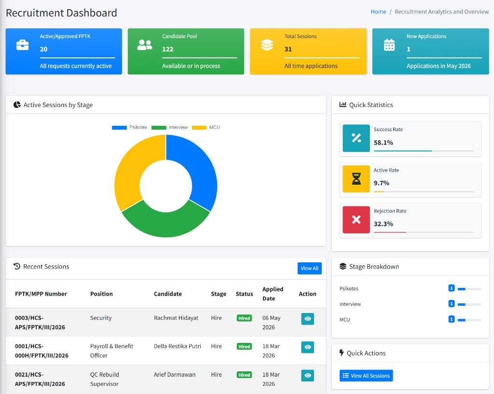
 <em>Gambar 2.1 — Recruitment Dashboard</em>

---

## 3. Untuk HR — **Requests (FPTK)**

### 3.1 Daftar dan filter **Recruitment Request (FPTK)**

1. **Login** → sidebar **HERO SECTION** → **Recruitment Management** → **Requests (FPTK)**.
2. Judul kartu: **Recruitment Request (FPTK)**. Tombol **Export** (jika tersedia) mengunduh data; tombol **Add** (kuning, ikon **+**) membuka form baru.
3. Buka panel **Filter** untuk menyaring:

- **Request Number**, **Department**, **Position**, **Level**
- **Date From** / **Date To**
- **Status** — **Draft**, **Submitted**, **Approved**, **Rejected**, **Cancelled**, **Closed**

4. Tabel menampilkan kolom **No**, **Request Number**, **Department**, **Position**, **Level**, **Employment Type**, **Status**, **Requested By**, **Action** (ikon **View**).
5. Klik **Reset** di filter untuk mengosongkan kriteria.

    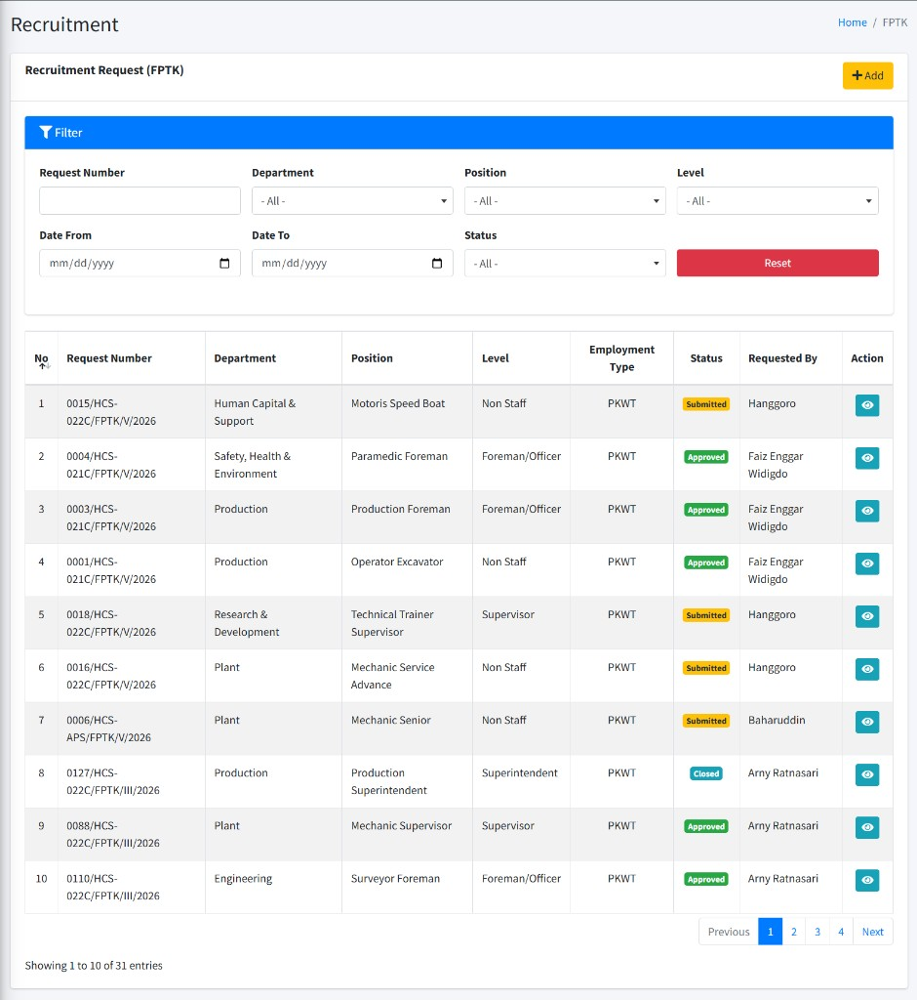
 <em>Gambar 3.1 — Daftar Requests (FPTK)</em>

### 3.2 Form tambah atau ubah FPTK (_Create Recruitment Request (FPTK)_ / _Edit Recruitment Request (FPTK)_)

Klik **Add** dari daftar, atau buka **Edit** dari detail FPTK berstatus **Draft**.

**1. Letter Number**

Pilih nomor surat kategori **FPTK** lewat komponen **Letter Number**. Setelah dipilih, field **FPTK Number** terisi otomatis (format mengikuti penomoran perusahaan, misalnya **[Letter Number]/HCS-[Project Code]/FPTK/[bulan Romawi]/[tahun]**). Jika nomor surat belum ada, gunakan opsi **Create New** dari selector (selaras modul **Letter Administration**).

**2. FPTK Information**

- **FPTK Number** — ter-generate dari **Letter Number**.
- **Request Date** — tanggal permintaan.
- **Department**, **Project**, **Position**, **Level** — wajib.
- **Job Description** — wajib; uraian tugas posisi.

**3. Request Details**

- **Required Quantity** — jumlah orang (1–50).
- **Required Date** — tanggal kebutuhan tenaga kerja.
- **Request Reason** — **Additional - Workplan**, **Replacement - Promotion, Mutation, Demotion**, atau **Replacement - Resign, Termination, End of Contract**.
- **Employment Type** — **PKWTT (Permanent)**, **PKWT (Contract)**, **Daily Worker**, **Internship**.

**4. Requirements**

- **Gender** — **Male**, **Female**, **Any**.
- **Marital Status** — **Single**, **Married**, **Any**.
- **Min Age** / **Max Age**, **Education**, **Required Skills**, **Required Experience** — pelengkap sesuai kebutuhan.

**5. Additional Requirements** _(panel kanan)_

- **Physical Requirements**, **Mental Requirements**, **Other Requirements**.
- Centang **Posisi ini memerlukan Tes Teori** jika posisi mekanik atau membutuhkan kompetensi teknis (**Tes Teori** akan muncul di alur sesi).

**6. Approver Selection**

Pilih approver sesuai dengan aturan approval yang berlaku. Klik **Approval Rules Information** untuk melihat aturanya. Wajib diisi sebelum pengajuan.

**7. Simpan**

- **Save as Draft** — dapat diedit kemudian.
- **Save & Submit** — langsung mengajukan; setelah submit FPTK **tidak dapat diedit** lagi (konfirmasi di layar).
- **Cancel** — kembali ke daftar tanpa menyimpan.

    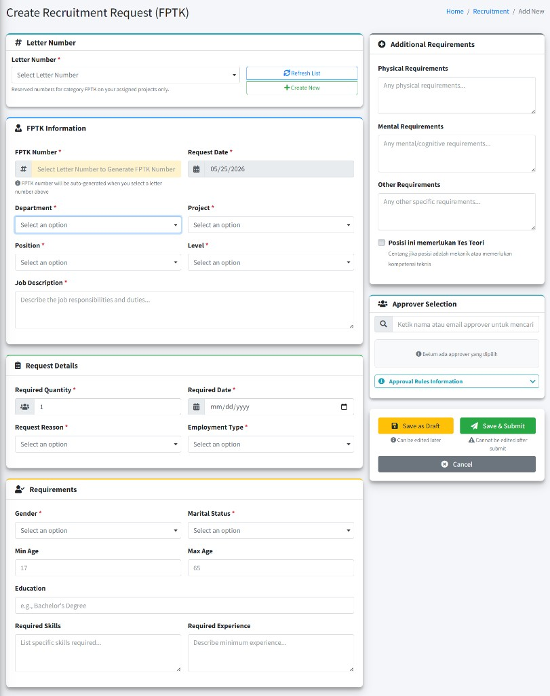
 <em>Gambar 3.2 — Form Create Recruitment Request (FPTK)</em>

**Catatan:** Pengajuan mandiri karyawan lewat **My Recruitment Request** tidak memakai **Letter Number** di form awal; nomor sementara **REQxxxxx** diganti HR setelah konfirmasi — lihat [bagian 8](#section-8-my-recruitment-request).

### 3.3 Detail FPTK, persetujuan, dan nomor resmi

Buka detail lewat ikon **View** pada daftar. Judul: **Detail Recruitment Request**; header menampilkan nomor FPTK, proyek, tanggal, dan badge status.

**Membaca halaman detail**

- Kartu **FPTK Information** — department, project, position, level, quantity, required date, employment type, alasan, kebutuhan tes teori, job description, requirements.
- **Approval Status** — daftar approver berurutan dengan badge status (**Pending**, **Approved**, **Rejected**, dll.) bila sudah diajukan. Pada FPTK **Submitted** yang masih punya langkah **Pending**, HR dapat membuka form **Approver Selection** di kartu yang sama (lihat [mengubah approver pending](#mengubah-approver-pending) di bawah).
- **Requested By** — pembuat permintaan.
- Tabel **Recruitment Sessions** — muncul setelah ada kandidat terdaftar; kolom tahap (**CV Review**, **Psikotes**, **Tes Teori**, **Interview HR**, **Interview User**, **Offering**, **MCU**, **Hiring & Onboarding**, **Final Status**).

    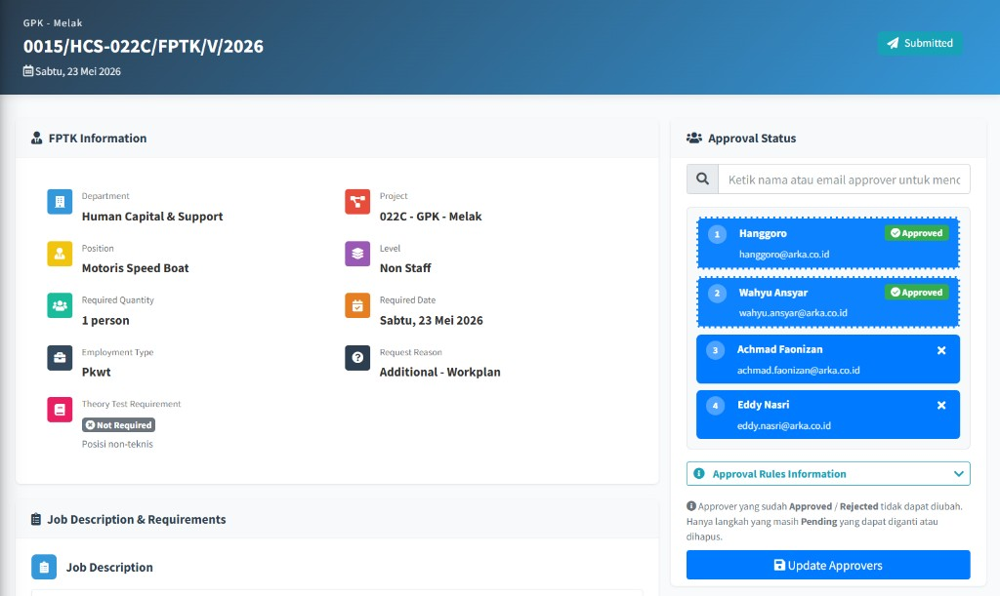
 <em>Gambar 3.3 — Membaca halaman detail FPTK Submitted: <strong>FPTK Information</strong> dan <strong>Approval Status</strong></em>

    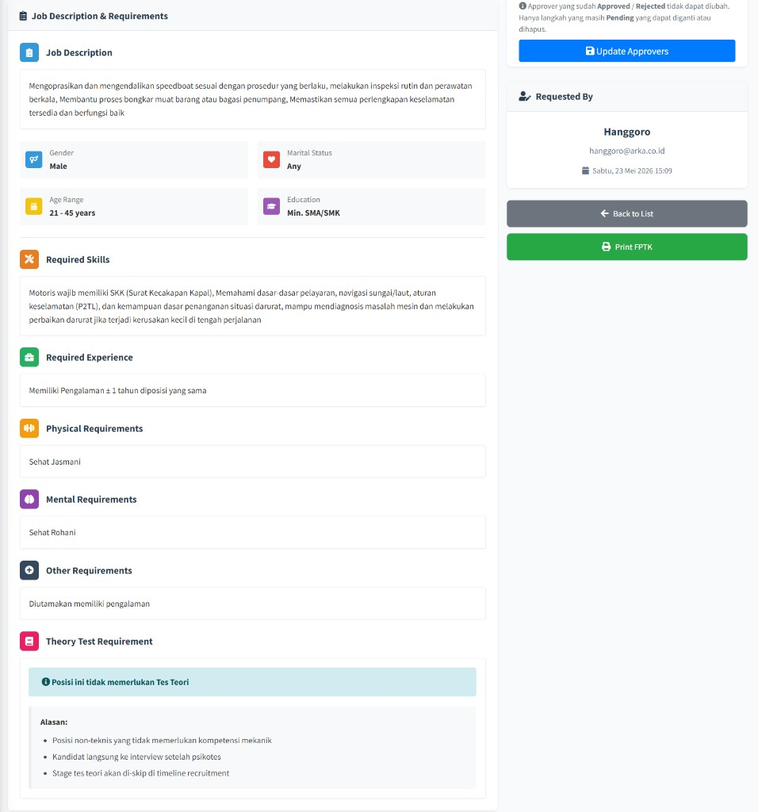
 <em>Gambar 3.4 — <strong>Job Description &amp; Requirements</strong>, kebutuhan posisi, dan <strong>Requested By</strong> pada detail FPTK Submitted</em>

**Aksi (panel kanan, sesuai status dan hak akses)**

| Status                        | Aksi umum                                                                                                                      |
| :---------------------------- | :----------------------------------------------------------------------------------------------------------------------------- |
| **Draft**                     | **Edit**, **Delete**, **Submit for Approval** (HR; konfirmasi SweetAlert — setelah submit isi FPTK tidak bisa diedit)          |
| **Submitted**                 | Approver memproses lewat **My Approvals**; HR dapat **Update Approvers** selama masih ada langkah **Pending** (lihat di bawah) |
| **Approved**                  | **Assign Letter Number** jika belum ada nomor surat resmi                                                                      |
| Semua (kecuali ditolak/batal) | **Print FPTK**, **Back to List**                                                                                               |

**Catatan:** Setelah **Submit for Approval**, field FPTK (department, posisi, quantity, dll.) **tidak dapat diedit** lagi; yang masih dapat disesuaikan HR hanya **approver pada langkah Pending** lewat **Update Approvers**.

**Penjelasan singkat — alur persetujuan FPTK**

1. Pembuat (HR atau karyawan via HR) menyimpan **Draft** atau mengajukan (**Submitted**).
2. **Approver** yang dipilih memberi keputusan di **My Approvals** (lihat panduan **My Approvals**, jenis dokumen **Recruitment Request**).
3. Setelah **Approved**, HR menetapkan **Letter Number** bila belum otomatis — tombol **Assign Letter Number**.
4. FPTK **Approved** dengan nomor resmi siap menerima kandidat di menu **Sessions**.

### Langkah-langkah — mengubah approver yang masih **Pending** (_Update Approvers_)

Fitur ini hanya untuk **HR** dengan hak **`recruitment-requests.edit`**, pada detail FPTK berstatus **Submitted**, dan **bukan** dari halaman **My Recruitment Request** karyawan.

1. Buka detail FPTK (**View** dari daftar **Requests (FPTK)**).
2. Pada kartu **Approval Status** di kolom kanan, baca daftar approver:
    - Approver yang sudah **Approved** atau **Rejected** ditampilkan dengan badge status dan **tidak** memiliki tombol hapus (terkunci).
    - Approver yang masih **Pending** dapat dihapus (ikon **×**) lalu diganti lewat kotak pencarian approver.
3. Untuk **mengganti** approver pending: klik **×** pada baris pending, ketik nama/email approver pengganti (minimal 2 karakter), pilih dari daftar — orang baru akan masuk pada **urutan yang sama**.
4. Anda juga dapat **menghapus** approver pending di akhir daftar atau **menambah** approver pending baru di urutan belakang, selama minimal satu approver tetap ada dan approver terkunci tidak diubah.
5. Klik **Update Approvers**. Pesan sukses mengonfirmasi pembaruan langkah pending; approver baru menerima antrean di **My Approvals**.

**Catatan:**

- Form **Update Approvers** **tidak** muncul jika semua langkah sudah diputuskan (tidak ada **Pending** tersisa) atau FPTK bukan **Submitted**.
- Urutan approver mengikuti nomor **1**, **2**, **3**, … pada badge; approver terkunci tetap di posisi semula.
- Approver **tidak boleh duplikat** dalam satu FPTK.

    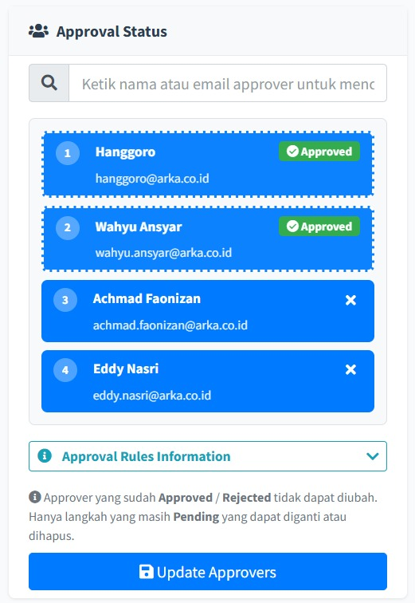
 <em>Gambar 3.5 — Kartu Approval Status: approver terkunci (Approved) dan pending (ikon ×) dengan tombol Update Approvers</em>

---

## 4. Untuk HR — **Requests (MPP)**

**Man Power Plan (MPP)** merencanakan kebutuhan tenaga kerja per **Project** untuk periode tertentu, terpisah dari FPTK per posisi.

### Langkah-langkah — daftar dan filter MPP

1. Sidebar **HERO SECTION** → **Recruitment Management** → **Requests (MPP)**.
2. Judul kartu: **Man Power Plan (MPP)**; tombol **Add** untuk MPP baru.
3. **Filter**: **MPP Number**, **Project**, **Status** (**Active** / **Closed**), **Year**; **Reset** mengosongkan filter.
4. Tabel: **No**, **MPP Number**, **Project**, **Title**, **Plan**, **Existing**, **Diff**, **Completion**, **Status**, **Action**.

    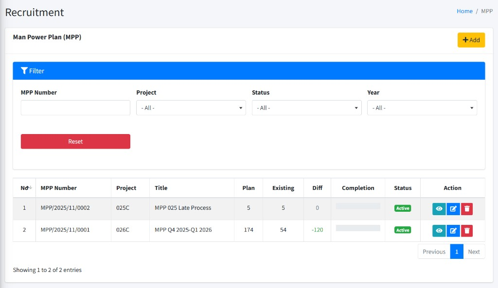
 <em>Gambar 4.1 — Daftar <strong>Man Power Plan (MPP)</strong>: filter, tabel Plan/Existing/Diff/Completion, dan aksi View/Edit/Delete</em>

### Langkah-langkah — membuat MPP (_Add New_)

1. Klik **Add**. Form **MPP Information**:
    - **Project**, **Title** (wajib), **Description** (opsional).
2. Isi baris detail posisi (tabel di form): **Position**, **Plan Quantity**, **Existing Quantity** — sistem menghitung **Difference**.
3. Simpan sesuai tombol di layar (**Save MPP** / **Cancel**). MPP berstatus **Active** siap dipakai di **Sessions** untuk rekrutmen per detail posisi.

    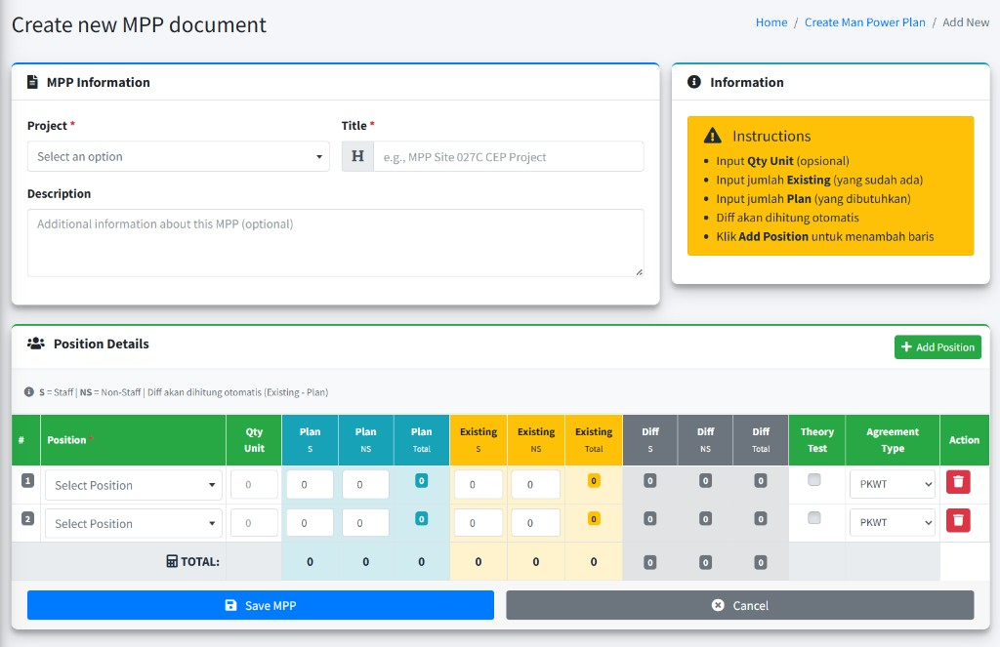
 <em>Gambar 4.2 — Form <strong>Create new MPP document</strong>: <strong>MPP Information</strong>, tabel detail posisi, dan tombol <strong>Save MPP</strong></em>

### Langkah-langkah — melihat detail MPP (_MPP Details_)

1. Dari daftar **Man Power Plan (MPP)**, klik ikon **View** (biru) pada kolom **Action**.
2. Halaman **MPP Details** menampilkan:
    - Kartu **MPP Information** — **MPP Number**, **Project**, **Status**, **Created By**, **Title** (dan **Description** jika diisi).
    - Empat kartu ringkasan: **Total Plan**, **Total Existing**, **Total Diff**, **Completion** (%).
    - Tabel **Position Details & Recruitment Sessions** — per baris posisi: jabatan/department, **Qty Unit**, **Plan** / **Existing** / **Diff** (kolom **S**, **NS**, **Total**), **Theory Test**, **Status** posisi (**Pending** atau **Fulfilled**), dan aksi baris.

**Aksi di header (kanan atas kartu MPP Information)**

| Tombol        | Kapan tampil             | Fungsi                                                                                                                               |
| :------------ | :----------------------- | :----------------------------------------------------------------------------------------------------------------------------------- |
| **Edit**      | MPP berstatus **Active** | Membuka form ubah data MPP dan detail posisi.                                                                                        |
| **Close MPP** | MPP berstatus **Active** | Menutup MPP (konfirmasi SweetAlert). Setelah ditutup, sesi rekrutmen baru **tidak** dapat dibuat; status berubah menjadi **Closed**. |
| **Back**      | Selalu                   | Kembali ke daftar **Requests (MPP)**.                                                                                                |

**Aksi per baris posisi (kolom Action)**

| Tombol            | Kapan tampil                                                     | Fungsi                                                                                                                                                                                                             |
| :---------------- | :--------------------------------------------------------------- | :----------------------------------------------------------------------------------------------------------------------------------------------------------------------------------------------------------------- |
| **View Sessions** | Selalu (ikon mata, biru)                                         | Menampilkan atau menyembunyikan daftar **Recruitment Sessions** untuk posisi tersebut. Sub-tabel menampilkan **Session Number**, **Candidate**, **Applied Date**, **Current Stage**, **Progress**, dan **Status**. |
| **Add Candidate** | MPP **Active** dan posisi belum **Fulfilled** (ikon plus, hijau) | Membuka modal **Add Candidate to MPP Detail** — cari kandidat/CV lalu hubungkan ke baris MPP untuk memulai sesi rekrutmen. Tombol yang sama juga tersedia di area sesi yang dibuka.                                |

**Aksi pada sub-tabel sesi (setelah View Sessions)**

| Tombol   | Fungsi                                                                                                       |
| :------- | :----------------------------------------------------------------------------------------------------------- |
| **View** | Membuka halaman timeline sesi kandidat di tab baru (**Recruitment Session** — lihat bagian **6. Sessions**). |

    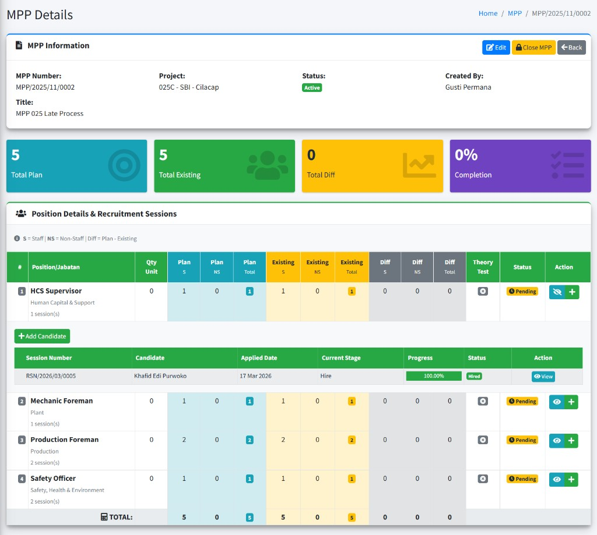
 <em>Gambar 4.3 — Halaman <strong>MPP Details</strong>: ringkasan plan/existing/diff, tabel posisi dengan sesi rekrutmen (contoh baris diperluas), dan tombol <strong>Edit</strong>, <strong>Close MPP</strong>, <strong>Back</strong></em>

**Catatan:** Rekrutmen dari MPP tidak memakai alur FPTK/letter number yang sama; sesi kandidat terhubung ke baris **MPP Detail** (posisi dalam rencana).

---

## 5. Untuk HR — **Candidates (CV)**

Menu **Candidates (CV)** berfungsi sebagai **bank CV** (_candidate pool_) — repositori data pelamar dan berkas CV yang **terpisah** dari permintaan rekrutmen (**Requests (FPTK)** / **Requests (MPP)**). HR terlebih dahulu menyimpan dan mengelola profil kandidat di sini; kandidat dengan **Global Status** **Available** dapat dipilih dan dimasukkan ke proses rekrutmen dengan cara:

- **Apply to FPTK** — dari detail kandidat, pilih FPTK **Approved** yang masih membuka slot (lihat bagian **3. Requests (FPTK)**).
- **Add Candidate** — dari detail **MPP Details**, pilih kandidat untuk baris posisi MPP **Active** (lihat bagian **4. Requests (MPP)**).

Kedua cara di atas membuat **Recruitment Session** baru yang menghubungkan kandidat dengan FPTK atau MPP, lalu melanjutkan tahap rekrutmen di menu **Sessions** (lihat bagian **6**).

 

### Langkah-langkah — daftar kandidat

1. Sidebar **Recruitment Management** → **Candidates (CV)**.
2. Judul: **Recruitment Candidates (CV)**; tombol **Add** menambah kandidat baru.
3. **Filter**: **Candidate Number**, **Full Name**, **Email**, **Phone**, **Education Level**, **Position Applied**, **Global Status**, **Registration Date From/To**.
4. Tabel: **No**, **Candidate Number**, **Full Name**, **Email**, **Phone**, **Education**, **Position Applied**, **Global Status**, **Registration Date**, **Action**.

    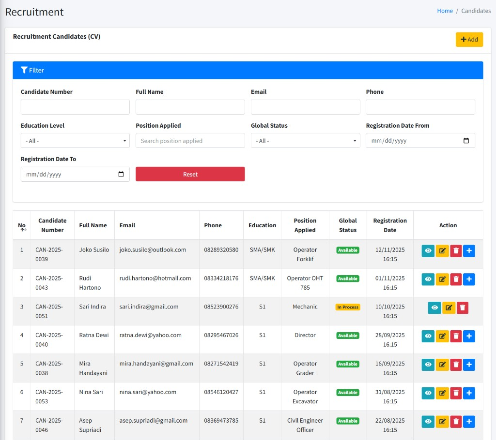
 <em>Gambar 5.1 — Daftar <strong>Recruitment Candidates (CV)</strong>: filter, status <strong>Available</strong>/<strong>In Process</strong>, dan aksi View/Edit/Delete</em>

### Langkah-langkah — menambah kandidat (_Add New_)

1. Dari daftar **Recruitment Candidates (CV)**, klik **Add**.
2. Isi form **Add New Candidate**:

**1. Personal Information** — **Full Name**, **Email**, **Phone Number**, **Date of Birth**, **Address** (wajib).

**2. Professional Information** — **Last Education Level**, **Years of Experience** (wajib); **Position Applied For**, **Skills & Competencies**, **Certifications**, **Previous Companies** (opsional).

**3. Salary Information** — **Current Salary**, **Expected Salary** (opsional).

**4. Remarks** _(panel kanan)_ — **Additional Notes** (opsional).

**5. CV Upload** — unggah berkas CV (**PDF**, **DOC**, **DOCX**, **ZIP**, **RAR**; maks. 10 MB).

**6. Simpan** — **Save Candidate** atau **Back** ke daftar.

    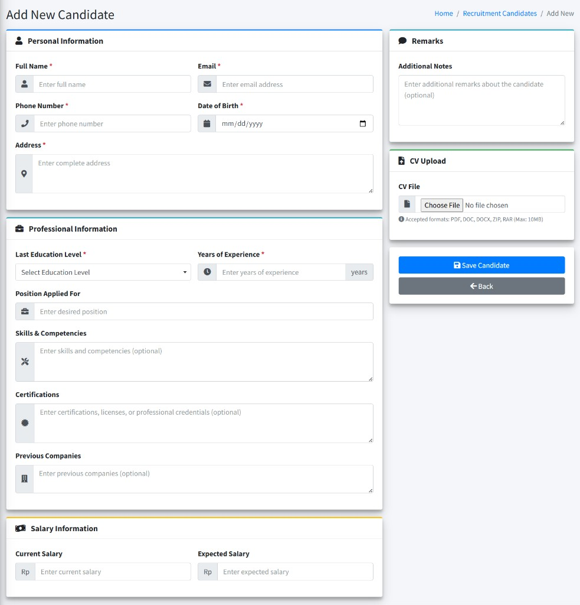
 <em>Gambar 5.2 — Form <strong>Add New Candidate</strong>: data pribadi, profesional, gaji, unggah CV, dan tombol <strong>Save Candidate</strong></em>

### Langkah-langkah — detail kandidat dan aksi

1. Dari daftar **Recruitment Candidates (CV)**, klik ikon **View** (biru) pada kolom **Action**.
2. Halaman detail menampilkan **Candidate Number**, nama, email, dan badge **Global Status** (misalnya **Available**, **In Process**, **Hired**, **Blacklisted**).
3. Baca kartu **Candidate Information**, **Address**, **Skills & Competencies**, **Previous Companies**, dan **Recruitment Sessions** (daftar sesi yang sudah menghubungkan kandidat ke FPTK/MPP).
4. Contoh di bawah: kandidat berstatus **Available** yang **belum** dimasukkan ke FPTK/MPP — bagian **Recruitment Sessions** masih kosong (_No recruitment sessions found for this candidate_) dan tombol **Apply to FPTK** tersedia untuk memulai proses rekrutmen.

    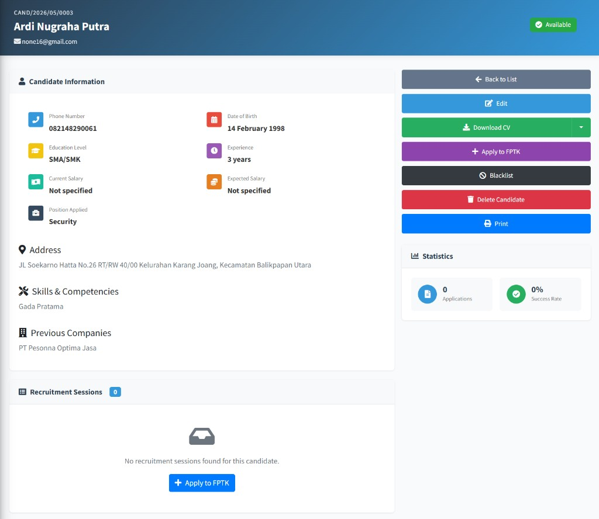
 <em>Gambar 5.3 — Detail kandidat <strong>Available</strong> di bank CV: belum ada sesi rekrutmen, siap dihubungkan ke FPTK lewat <strong>Apply to FPTK</strong></em>

5. Contoh berikut: kandidat berstatus **In Process** — sudah dimasukkan ke FPTK/MPP lewat **Recruitment Session**. Badge **In Process** muncul di header; kartu **Recruitment Sessions** menampilkan tabel dengan **Session Number**, **FPTK/MPP No.**, **Position**, **Department**, **Status**, **Applied Date**, dan tombol **View** untuk membuka timeline sesi. Tombol **Apply to FPTK** **tidak** tampil karena kandidat sedang dalam proses rekrutmen.

    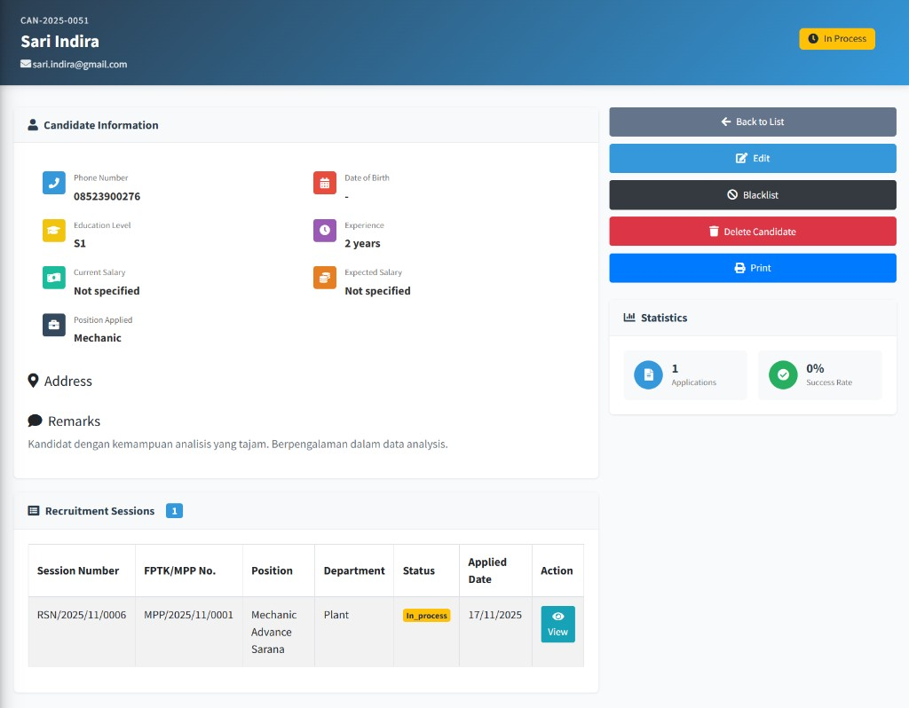
 <em>Gambar 5.4 — Detail kandidat <strong>In Process</strong>: sudah terhubung ke FPTK/MPP (contoh nomor MPP), dengan daftar <strong>Recruitment Sessions</strong></em>

**Aksi (panel kanan, sesuai status dan hak akses)**

| Tombol                    | Fungsi                                                                                                                                                                                                 |
| :------------------------ | :----------------------------------------------------------------------------------------------------------------------------------------------------------------------------------------------------- |
| **Back to List**          | Kembali ke daftar bank CV.                                                                                                                                                                             |
| **Edit**                  | Ubah data kandidat.                                                                                                                                                                                    |
| **Download CV**           | Unduh lampiran CV kandidat.                                                                                                                                                                            |
| **Apply to FPTK**         | Modal **Apply to FPTK**: pilih FPTK **Approved** yang masih membuka slot; sistem membuat **Recruitment Session** baru. Tersedia untuk kandidat **Available** (juga di kartu **Recruitment Sessions**). |
| **Blacklist**             | Modal **Blacklist Candidate** dengan **Blacklist Reason** wajib; kandidat tidak dapat dilamar ke FPTK/MPP baru.                                                                                        |
| **Remove from Blacklist** | Muncul jika kandidat sudah **Blacklisted**; mengembalikan kandidat ke pool.                                                                                                                            |

**Pintasan dari daftar:** ikon plus biru pada kolom **Action** (hanya kandidat **Available**) membuka alur yang sama dengan **Apply to FPTK**.

Untuk MPP, kandidat dari bank CV juga dapat dimasukkan lewat **Add Candidate** pada detail **MPP Details** (bukan dari halaman detail kandidat).

**Catatan:** Bank CV bukan dokumen rekrutmen tersendiri — kandidat baru masuk proses hanya setelah dihubungkan ke FPTK/MPP lewat **Recruitment Session**. Kandidat **Blacklisted** tidak dapat dilamar ke FPTK/MPP baru. **Global Status** berubah otomatis saat masuk sesi (**In Process**) atau selesai (**Hired**).

---

## 6. Untuk HR — **Sessions**

Sesi rekrutmen menghubungkan **kandidat** dengan FPTK **Approved** atau baris **MPP Active**. Satu FPTK/MPP dapat memiliki beberapa sesi (beberapa kandidat).

### 6.1 Daftar **Recruitment Sessions**

1. Sidebar **Recruitment Management** → **Sessions** (tombol **Dashboard** di kanan atas kembali ke dashboard rekrutmen).
2. **Filter**: **FPTK/MPP Number**, **Department**, **Position**, **Required Date From/To**.
3. Tabel: **No**, **Source** (FPTK atau MPP), **Project**, **FPTK/MPP No.**, **Position**, **Candidate Count**, **Overall Progress**, **Final Status**, **Required Date**, **Action**.
4. Klik **View** pada baris untuk membuka halaman sesi FPTK/MPP (daftar kandidat per permintaan).

    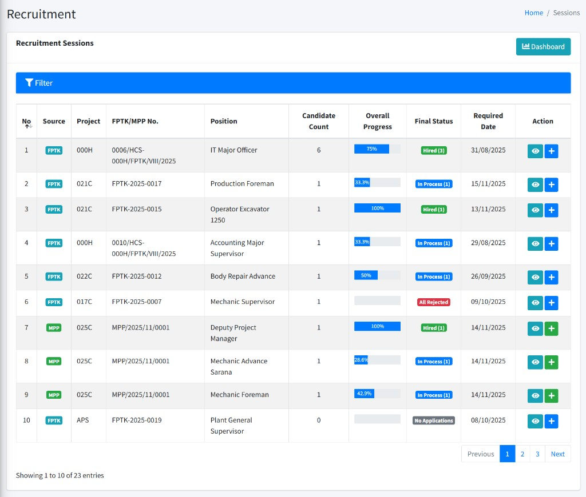
 <em>Gambar 6.1 — Daftar <strong>Recruitment Sessions</strong>: sumber FPTK/MPP, progres, status akhir, dan aksi View/Add</em>

 
 

### 6.2 Halaman sesi FPTK/MPP (Approved / Active)

1. Dari daftar **Recruitment Sessions**, klik **View** (atau **Add** untuk langsung menambah kandidat) pada baris FPTK **Approved** atau MPP **Active**.
2. Header menampilkan proyek, nomor **FPTK/MPP**, tanggal, dan badge status (**Approved** untuk FPTK, **Active** untuk MPP).
3. Baca bagian utama halaman:
    - **FPTK Information** / **MPP Detail** — metadata permintaan (department, posisi, quantity, employment type, theory test requirement, dll.).
    - **Recruitment Progress** — ringkasan visual kandidat **Hired**, **In Process**, **Rejected**; catatan tahap yang di-skip (misalnya posisi tanpa **Tes Teori**).
    - **Summary** _(panel kanan)_ — **Total**, **Hired**, **In Process**, **Fill Rate** (%).
    - **Candidate Sessions** — tabel progres per kandidat per tahap (**CV Review**, **Psikotes**, **Interview HR**, **Interview User**, **Offering**, **MCU**, **Hiring & Onboarding**, **Final Status**).

**Quick Actions (panel kanan)**

| Tombol               | Fungsi                                                                                                                                              |
| :------------------- | :-------------------------------------------------------------------------------------------------------------------------------------------------- |
| **Add Candidate**    | Modal **Add Candidate to FPTK** / **MPP Detail**: cari kandidat di bank CV (**Search Candidate/CV**), pilih **Select**, konfirmasi penambahan sesi. |
| **View Dashboard**   | Kembali ke **Recruitment Dashboard**.                                                                                                               |
| **Back to Sessions** | Kembali ke daftar **Recruitment Sessions**.                                                                                                         |
| **Close Request**    | _(FPTK saja, belum **Closed**)_ Menutup permintaan rekrutmen; konfirmasi di layar; sesi baru tidak dapat dibuat lagi.                               |

**Aksi pada tabel Candidate Sessions**

| Tombol     | Fungsi                                                                 |
| :--------- | :--------------------------------------------------------------------- |
| **View**   | Membuka **Recruitment Timeline** sesi kandidat (lihat §**6.3**).       |
| **Delete** | Menghapus sesi kandidat dari permintaan (sesuai hak akses dan status). |

    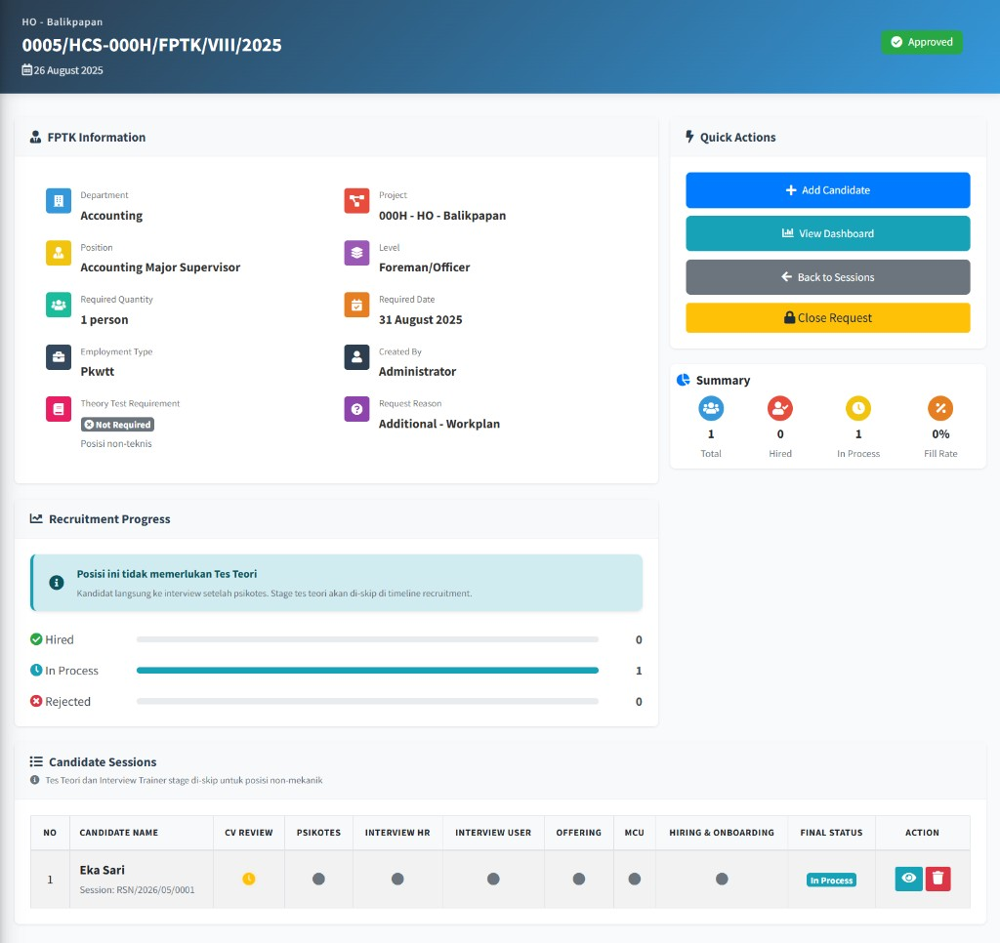
 <em>Gambar 6.2 — Halaman sesi FPTK <strong>Approved</strong>: <strong>FPTK Information</strong>, catatan skip <strong>Tes Teori</strong>, <strong>Recruitment Progress</strong>, <strong>Candidate Sessions</strong> (Eka Sari), <strong>Summary</strong>, dan <strong>Quick Actions</strong></em>

### 6.3 Detail sesi per kandidat (_Recruitment Timeline_)

Klik **View** pada baris kandidat (dari tabel sesi FPTK/MPP atau **Recent Sessions**). Header menampilkan nama kandidat, proyek, badge **Final Status** (**In Process**, **Hired**, **Rejected**, dll.).

**Recruitment Timeline** — urutan tahap dengan indikator warna (abu = belum, kuning = berjalan, hijau = lulus, merah = gagal). Tahap aktif dapat dibuka untuk input penilaian (ikon/edit pada tahap yang **unlocked**).

| Tahap (UI)              | Ringkasan                                                                                                                                                                                                                              |
| :---------------------- | :------------------------------------------------------------------------------------------------------------------------------------------------------------------------------------------------------------------------------------- |
| **CV Review**           | Keputusan **Recommended** / **Not Recommended** + **Review Date**, **Notes**.                                                                                                                                                          |
| **Psikotes**            | Skor **Psikotes Online** dan **Psikotes Offline**; kriteria layar: ≥ 40 lanjut, &lt; 40 tidak direkomendasikan.                                                                                                                        |
| **Tes Teori**           | Hanya jika FPTK mencentang tes teori atau posisi mekanik; skor dan keputusan lulus/gagal.                                                                                                                                              |
| **Interview**           | Sub-tipe **HR Interview**, **User Interview**, **Trainer Interview** (pilih **Interview Type**); keputusan per wawancara; semua wajib selesai sebelum lanjut.                                                                          |
| **Offering**            | **Offering Letter Number** (selector surat), keputusan offering (**Accepted** / **Rejected**).                                                                                                                                         |
| **MCU**                 | **Fit to Work**, **Unfit**, atau **Follow Up** + **Review Date**, **Notes**.                                                                                                                                                           |
| **Hiring & Onboarding** | Formulir gabungan **Personal Data**, **Administration Data**, dan **Agreement** (judul modal di layar: **Hire Stage**). Setelah **Submit Hire**, data otomatis masuk ke **Employee Management** (**Employee** dan **Administration**). |

**Pengecualian alur**

| Kondisi                                                    | Tahap yang dijalankan                                              |
| :--------------------------------------------------------- | :----------------------------------------------------------------- |
| **Employment Type** = **Internship** atau **Daily Worker** | Hanya **MCU** dan **Hiring & Onboarding** (proses disederhanakan). |
| Posisi **tanpa Tes Teori**                                 | Tahap **Tes Teori** dilewati; progress disesuaikan.                |

    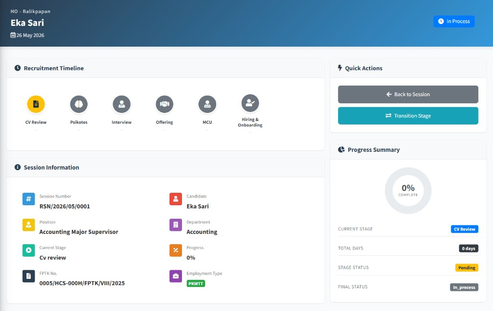
 <em>Gambar 6.3 — <strong>Recruitment Timeline</strong> sesi kandidat <strong>In Process</strong>: timeline tahap, <strong>Session Information</strong>/FPTK, <strong>Quick Actions</strong>, dan <strong>Progress Summary</strong></em>

**Quick Actions (panel kanan)**

| Tombol               | Fungsi                                                                                                                                                                                                |
| :------------------- | :---------------------------------------------------------------------------------------------------------------------------------------------------------------------------------------------------- |
| **Back to Session**  | Kembali ke halaman sesi FPTK/MPP (daftar **Candidate Sessions** per permintaan).                                                                                                                      |
| **Transition Stage** | Memindahkan sesi kandidat ke **tahap rekrutmen lain** secara manual. Hanya tampil jika akun Anda memiliki izin mengubah tahap sesi (**recruitment-sessions.edit-stages**). Lihat penjelasan di bawah. |

#### Tombol **Transition Stage**

Gunakan **Transition Stage** bila HR perlu **memindahkan posisi tahap** sesi kandidat tanpa menunggu alur penilaian otomatis — misalnya koreksi administratif, penyesuaian alur khusus, atau pemulihan setelah kesalahan input. Tombol ini **bukan** pengganti pengisian modal penilaian; setelah pindah tahap, HR tetap mengisi assessment di tahap yang aktif bila diperlukan.

**Langkah-langkah**

1. Di halaman **Recruitment Timeline** sesi kandidat, panel **Quick Actions** → klik **Transition Stage**.
2. Modal **Transition Stage** menampilkan **Current Stage** (tahap saat ini).
3. Pilih **Target Stage** — daftar tahap yang valid untuk sesi ini (mengikuti jenis FPTK/MPP; tahap saat ini tidak muncul di daftar). Contoh label: **CV Review**, **Psikotes**, **Interview**, **Offering**, **MCU**, **Hiring & Onboarding**.
4. Isi **Reason for Transition** (wajib) — alasan perpindahan; sistem **mencatat** teks ini untuk audit.
5. _(Opsional)_ Centang **Force Transition (bypass validation rules)** hanya jika Anda sengaja perlu **melewati aturan validasi** normal (misalnya melewati tahap yang assessment-nya gagal). Gunakan dengan hati-hati.
6. Baca peringatan kuning bila muncul (transisi **mundur** atau **melompati** satu/lebih tahap).
7. Klik **Transition Stage** di modal → konfirmasi _Transition to selected stage? This will update the recruitment progress._ → proses selesai.

    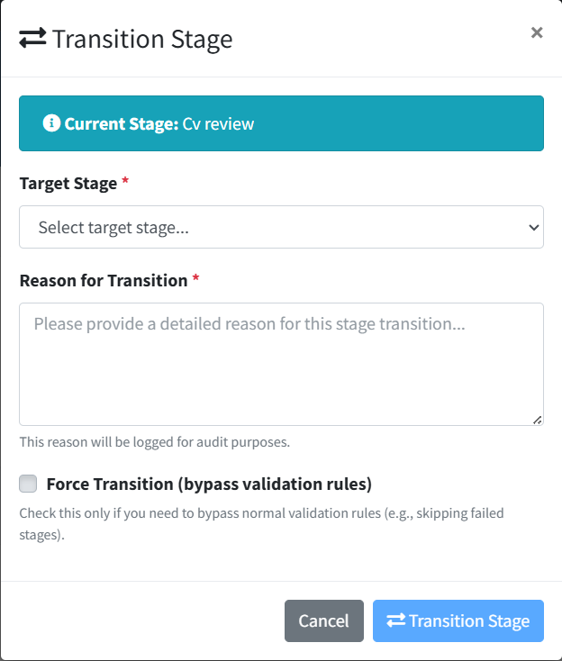
 <em>Gambar 6.3b — Modal <strong>Transition Stage</strong>: <strong>Current Stage</strong>, <strong>Target Stage</strong>, <strong>Reason for Transition</strong>, opsi <strong>Force Transition</strong>, dan tombol aksi</em>

**Apa yang berubah setelah transisi berhasil**

- **Current Stage** pindah ke **Target Stage** yang dipilih.
- **Stage Status** kembali **Pending** (tahap baru menunggu penilaian/input).
- **Overall Progress** dan ringkasan di **Progress Summary** disesuaikan.
- Pesan sukses di layar menyebut tahap asal dan tujuan.

**Aturan validasi (tanpa Force Transition)**

| Arah transisi                                  | Perilaku umum                                                                                                                          |
| :--------------------------------------------- | :------------------------------------------------------------------------------------------------------------------------------------- |
| **Maju** (ke tahap berikutnya atau lebih jauh) | Diizinkan.                                                                                                                             |
| **Mundur** (ke tahap sebelumnya)               | Diizinkan **kecuali** ada tahap di antara yang assessment-nya **gagal** (mis. **Not Recommended**, psikotes gagal) — transisi ditolak. |
| **Ke tahap yang sama**                         | Ditolak.                                                                                                                               |

Daftar **Target Stage** mengikuti alur sesi: FPTK **Internship**/**Daily Worker** hanya **MCU** dan **Hiring & Onboarding**; posisi tanpa tes teori tidak menampilkan **Tes Teori** (selaras §**6.3** _Pengecualian alur_).

 

### 6.4 Mengisi penilaian per tahap (modal)

Setiap tahap aktif pada **Recruitment Timeline** membuka modal khusus. Pola umum:

1. Klik tahap yang **unlocked** (ikon/edit) pada timeline atau baris tahap di tabel **Assessments**.
2. Isi field wajib (bertanda merah / asterisk).
3. Pilih keputusan atau skor sesuai tahap (**Recommended**, **Pass**, **Accepted**, **Fit to Work**, dll.).
4. Klik **Submit Decision** / **Submit Assessment** / **Submit Offering** — konfirmasi _You cannot edit after submission_.
5. Jika lulus, **current stage** berpindah ke tahap berikutnya; jika gagal, **Final Status** dapat menjadi **Rejected**.

Tahap yang muncul mengikuti jenis posisi (misalnya **Tes Teori** dan **Trainer Interview** hanya untuk posisi mekanik/teknis; **Internship**/**Daily Worker** hanya **MCU** dan **Hiring & Onboarding** — lihat tabel pengecualian di §**6.3**).

#### Modal **CV Review** (_Choose Your Decision_)

- **CV Review Decision** — **Recommended** atau **Not Recommended**.
- **Review Date**, **Notes** (wajib).
- **Submit Decision** aktif setelah keputusan dipilih.

    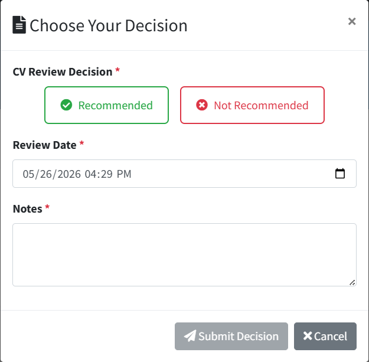
 <em>Gambar 6.4a — Modal <strong>CV Review</strong> (<strong>Choose Your Decision</strong>): keputusan Recommended/Not Recommended, <strong>Review Date</strong>, <strong>Notes</strong>, dan tombol <strong>Submit Decision</strong></em>

#### Modal **Psikotes** (_Psikotes Assessment_)

- **Psikotes Online** — **Rata-rata Hasil** (kriteria ≥ 40 lanjut, &lt; 40 tidak direkomendasikan).
- **Psikotes Offline** — skor **TIU** (kriteria ≥ 8 lanjut, &lt; 8 kurang).
- **Review Date** (wajib), **Catatan** (opsional).
- **Submit Assessment**.

    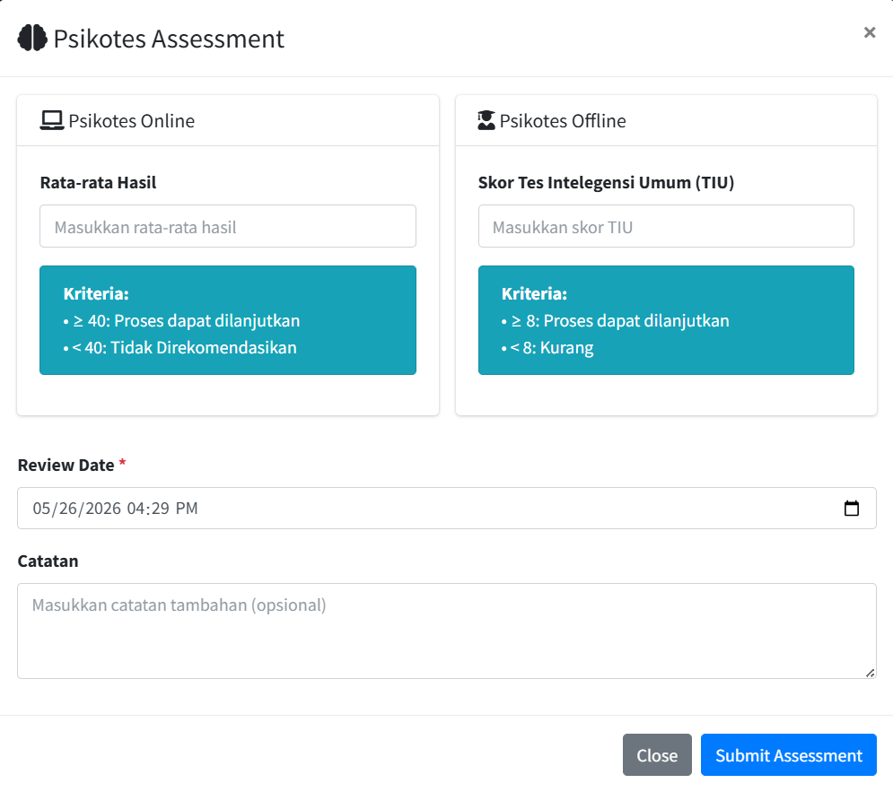
 <em>Gambar 6.4b — Modal <strong>Psikotes Assessment</strong>: skor <strong>Psikotes Online</strong> dan <strong>Psikotes Offline</strong> (TIU), kriteria kelulusan, <strong>Review Date</strong>, <strong>Catatan</strong>, dan <strong>Submit Assessment</strong></em>

#### Modal **Tes Teori** (_Tes Teori Assessment_)

Hanya untuk posisi yang memerlukan tes teori.

- Petunjuk kategori skor (Mechanic Senior/Advance/Mechanic/Helper/Belum Kompeten).
- **Skor Tes Teori**, **Review Date** (wajib), **Catatan** (opsional).
- **Submit Assessment**.

    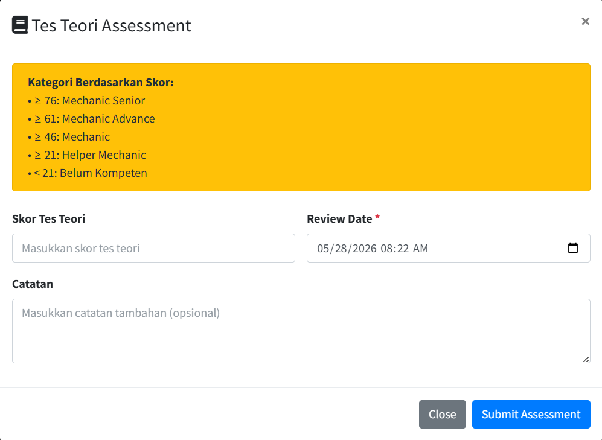
 <em>Gambar 6.4c — Modal <strong>Tes Teori Assessment</strong>: petunjuk <strong>Kategori Berdasarkan Skor</strong> (Mechanic Senior/Advance/Mechanic/Helper Mechanic/Belum Kompeten), <strong>Skor Tes Teori</strong>, <strong>Review Date</strong> (wajib), <strong>Catatan</strong> (opsional), dan <strong>Submit Assessment</strong></em>

#### Modal **Interview** (_Choose Your Decision_)

- **Interview Type** — **HR Interview**, **User Interview**, **Trainer Interview** (tipe yang sudah selesai disabled).
- Ringkasan status wawancara yang sudah diisi (jika ada).
- **Interview Decision** — **Recommended** atau **Not Recommended**.
- **Notes**, **Review Date** (wajib).
- Ulangi pengisian untuk setiap tipe wawancara yang diwajibkan posisi tersebut.

    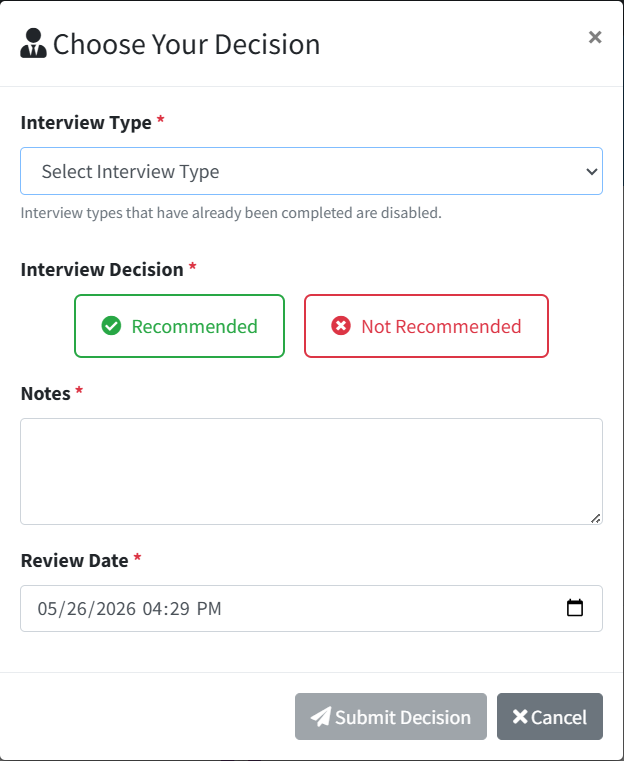
 <em>Gambar 6.4d — Modal <strong>Interview</strong> (<strong>Choose Your Decision</strong>): <strong>Interview Type</strong>, keputusan Recommended/Not Recommended, <strong>Notes</strong>, <strong>Review Date</strong>, dan <strong>Submit Decision</strong></em>

#### Modal **Offering** (_Offering Stage_)

- **Offering Letter Number** — pilih nomor surat lewat selector (**Letter Administration**); nomor offering terisi otomatis.
- **Offering Decision** — **Accepted** atau **Rejected**.
- **Notes** (opsional), **Review Date** (wajib).
- **Submit Offering**.

    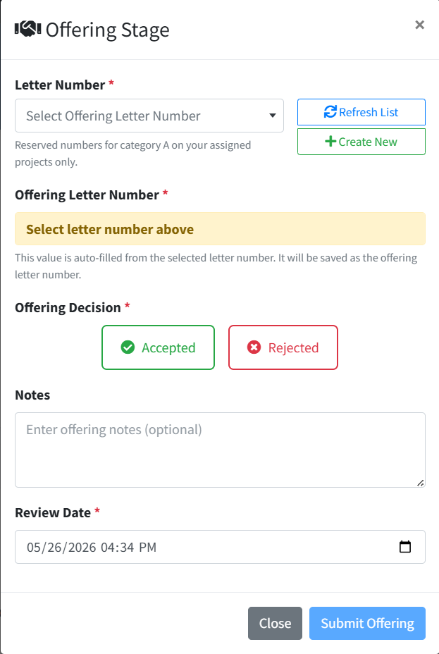
 <em>Gambar 6.4e — Modal <strong>Offering Stage</strong>: pemilihan <strong>Letter Number</strong>, keputusan Accepted/Rejected, <strong>Notes</strong>, <strong>Review Date</strong>, dan <strong>Submit Offering</strong></em>

#### Modal **MCU** (_Medical Check Up Assessment_)

- **MCU Result** — **Fit to Work**, **Unfit**, atau **Follow Up**.
- **Notes** (opsional), **Review Date** (wajib).
- **Submit Assessment**.

    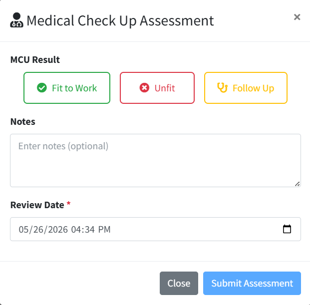
 <em>Gambar 6.4f — Modal <strong>Medical Check Up Assessment</strong>: <strong>MCU Result</strong> (Fit to Work/Unfit/Follow Up), <strong>Notes</strong>, <strong>Review Date</strong>, dan <strong>Submit Assessment</strong></em>

#### Modal **Hiring & Onboarding**

Tahap **Hiring & Onboarding** menggabungkan penyelesaian rekrutmen dan onboarding kandidat dalam **satu formulir** (judul modal di layar: **Hire Stage**).

**Penting:** Setelah Anda klik **Submit Hire**, data yang diisi **otomatis tersimpan** ke modul **Employee Management** sebagai data karyawan (**Employee** dan **Administration**). Anda **tidak perlu** memasukkan ulang data yang sama secara manual di **Employee Management**.

Banner info biru di bagian atas modal menyampaikan hal yang sama.

- **Personal Data** — **Fullname**, **Identity Card No**, **Place/Date of Birth**, **Religion**, **Gender**, **Marital Status**, **Phone**, **Address**, **Email** (wajib sesuai form).
- **Administration Data** — **NIK**, **Date of Hire**, **Place of Hire (POH)**, **Class**, **Position**, **Department** (terisi otomatis dari posisi), **Project**, **Grade**, **Level**, **FPTK No** (terisi otomatis).
- **Agreement** — **Letter Number** (selector surat PKWT/PKWTT; **Refresh List**, **Create New**), **Agreement Type** (mengikuti **Employment Type** FPTK).
- **Notes** (opsional), **Review Date** (wajib).
- **Submit Hire** — setelah sukses, sesi kandidat dapat berstatus **Hired** dan proses rekrutmen selesai.

    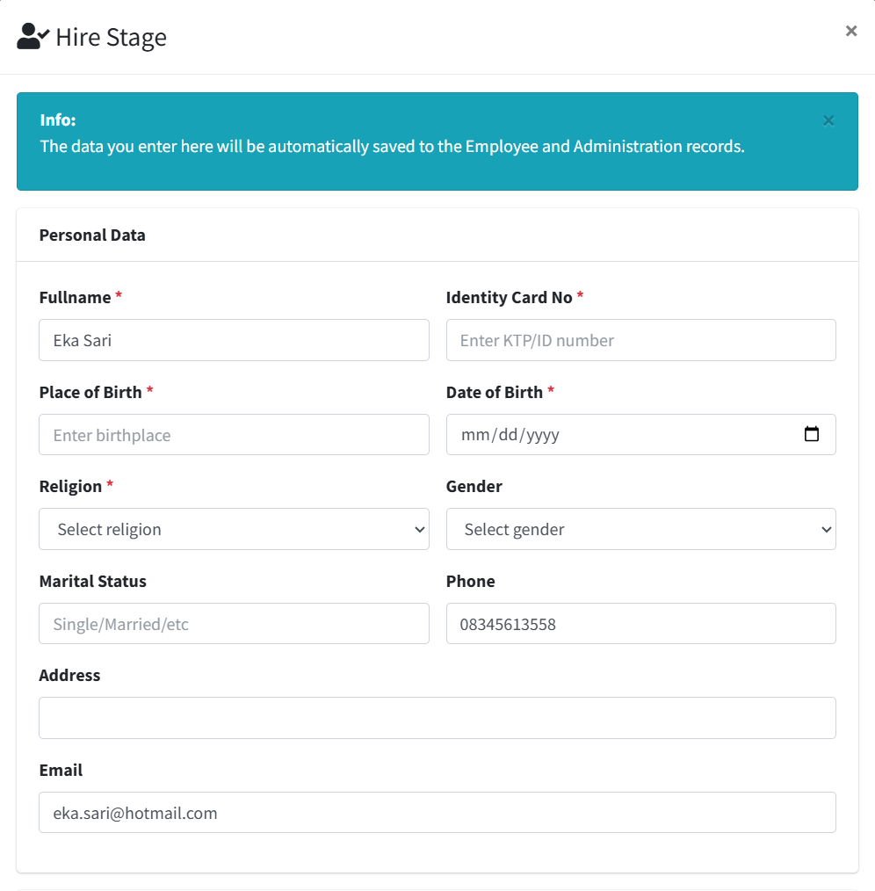
 <em>Gambar 6.4g (1) — Modal <strong>Hiring &amp; Onboarding</strong> (<strong>Hire Stage</strong>): bagian <strong>Personal Data</strong> — banner info data otomatis ke <strong>Employee Management</strong>, identitas dan kontak kandidat</em>
  
    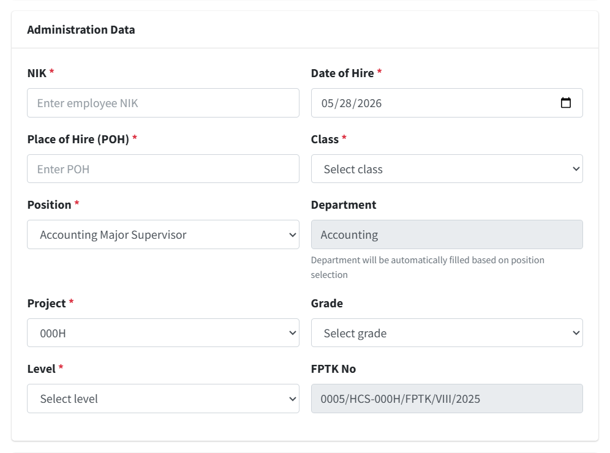
 <em>Gambar 6.4g (2) — Bagian <strong>Administration Data</strong>: <strong>NIK</strong>, <strong>Date of Hire</strong>, <strong>POH</strong>, <strong>Class</strong>, <strong>Position</strong>, <strong>Department</strong> (otomatis dari posisi), <strong>Project</strong>, <strong>Grade</strong>, <strong>Level</strong>, dan <strong>FPTK No</strong> (otomatis)</em>
  
    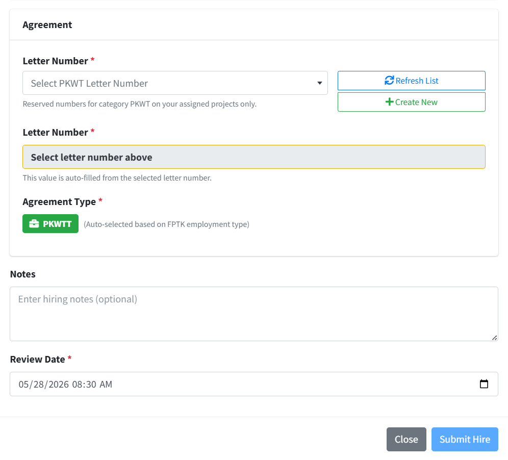
 <em>Gambar 6.4g (3) — Bagian <strong>Agreement</strong>: selector <strong>Letter Number</strong> (PKWT/PKWTT), <strong>Agreement Type</strong>, <strong>Notes</strong>, <strong>Review Date</strong>, dan tombol <strong>Submit Hire</strong></em>

---

## 7. Untuk HR — **Reports**

Buka **HERO SECTION** → **Recruitment Management** → **Reports**. Judul: **Recruitment Reports**. Setiap kartu memiliki tombol **View Report**:

| Laporan                              | Isi singkat                                                |
| :----------------------------------- | :--------------------------------------------------------- |
| **Recruitment Funnel by Stage**      | Progres kandidat per tahap; filter tanggal; ekspor Excel.  |
| **Request Aging & SLA**              | Lama proses FPTK, bottleneck persetujuan, kepatuhan SLA.   |
| **Time-to-Hire Analysis**            | Hari dari pembuatan permintaan hingga onboarding kandidat. |
| **Offer Acceptance Rate**            | Tingkat penerimaan offering per departemen/posisi.         |
| **Interview & Assessment Analytics** | Hasil assessment kandidat yang lulus **CV Review**.        |
| **Stale Candidates Report**          | Kandidat tanpa aktivitas/progres terbaru.                  |

    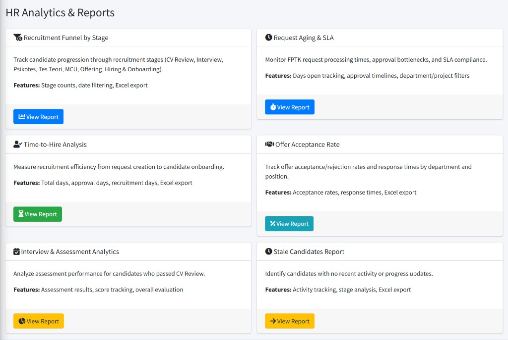
 <em>Gambar 7.1 — Halaman <strong>Reports</strong> (<strong>HR Analytics &amp; Reports</strong>): enam kartu laporan — <strong>Recruitment Funnel by Stage</strong>, <strong>Request Aging &amp; SLA</strong>, <strong>Time-to-Hire Analysis</strong>, <strong>Offer Acceptance Rate</strong>, <strong>Interview &amp; Assessment Analytics</strong>, dan <strong>Stale Candidates Report</strong> — masing-masing dengan tombol <strong>View Report</strong></em>

Pada masing-masing laporan, gunakan filter yang tersedia di layar lalu **Export** / **View Report** sesuai label tombol.

---

## 8. My Recruitment Request

**My Recruitment Request** digunakan untuk mengajukan **FPTK** (_Formulir Permintaan Tenaga Kerja_) — dokumen resmi permintaan rekrutmen karyawan baru. Nomor FPTK resmi akan ditetapkan oleh HR setelah konfirmasi.

**Navigasi:** **My Features** → **My Recruitment Request**

**Catatan:** Halaman ini menampilkan permintaan rekrutmen yang relevan dengan proyek dan departemen Anda.

### Langkah-langkah — Daftar & Filter Permintaan Rekrutmen

Dari sidebar **My Features**, buka **My Recruitment Request**. Halaman **My Recruitment Requests** menampilkan breadcrumb (misalnya **My Dashboard / My Recruitment Request**), judul bagian yang dapat menampilkan permintaan Anda (misalnya dengan nama pengguna), ringkasan filter aktif bila ada (proyek atau departemen yang dipilih), tombol **+ Add**, bilah **Filter**, dan tabel dengan kolom seperti **No**, **FPTK Number**, **Position**, **Department**, **Project**, **Request By**, **Status**, **Requested At**, dan **Actions**. Pada **Actions**, baris berstatus **Draft** biasanya menampilkan **View** dan **Edit**; setelah diajukan (misalnya **Submitted**), umumnya hanya **View** yang tersedia — kombinasi mengikuti status dan hak akses.

    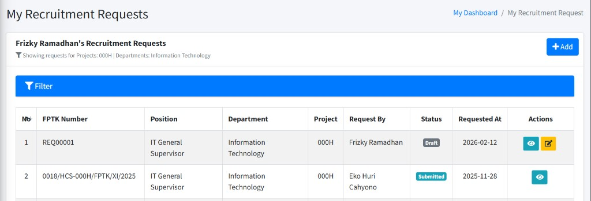
 <em>Gambar 8.1 — Daftar My Recruitment Requests</em>

Tombol **Add** membuka form FPTK baru.

**Filter** tersedia:

- **Status** — Draft, Acknowledged, PM Approved, Approved, Rejected, Cancelled.

### Langkah-langkah — Membuat Permintaan Rekrutmen Baru

Klik **Add**. Halaman **Create My Recruitment Request (FPTK)** terbuka (breadcrumb **Home / My Recruitment Requests / Add New**). Banner informasi menjelaskan bahwa permintaan akan dikirim ke HR dan **nomor FPTK resmi ditetapkan HR setelah konfirmasi**.

**1. FPTK Information**

- **Request Number** — hanya baca; nomor sementara berformat **REQxxxxx** sampai HR menetapkan nomor resmi.
- **Request Date** — tanggal pengajuan; biasanya terisi otomatis dan tidak dapat diubah di layar ini.
- **Department**, **Project**, **Position**, **Level** — wajib dipilih dari dropdown.
- **Job Description** — wajib; uraian tugas dan tanggung jawab posisi.

**2. Request Details**

- **Required Quantity** — jumlah orang yang dibutuhkan (minimal 1).
- **Required Date** — tanggal di mana tenaga kerja diharapkan tersedia.
- **Request Reason** — pilih alasan permintaan dari daftar (misalnya penggantian, tambahan workplan, dll.). Jika layar Anda menampilkan opsi **Other**, isi juga field alasan tambahan yang diminta.
- **Employment Type** — jenis kontrak (misalnya **PKWTT**, **PKWT**, harian, magang) sesuai pilihan di form.

**3. Requirements**

- **Gender** dan **Marital Status** — wajib.
- **Min Age** dan **Max Age** — opsional; pastikan nilai minimum tidak lebih besar dari maksimum jika keduanya diisi.
- **Education**, **Required Skills**, **Required Experience** — pelengkap sesuai kebutuhan posisi.

**4. Additional Requirements** _(panel kanan)_

Isi **Physical Requirements**, **Mental Requirements**, dan **Other Requirements** bila relevan. Centang **Posisi ini memerlukan Tes Teori** jika posisi membutuhkan kompetensi teknis atau tes teori sesuai kebijakan Anda.

**5. Selesai**

- **Submit to HR** — menyimpan permintaan sebagai **Draft** dengan nomor **REQxxxxx**; Anda dapat mengubahnya kemudian dan mengajukan untuk approval melalui alur edit/detail sesuai pesan sukses di layar dan tombol yang tersedia setelah data tersimpan.
- **Cancel** — kembali ke [daftar](#my-recruitment-requests-list) tanpa menyimpan.

    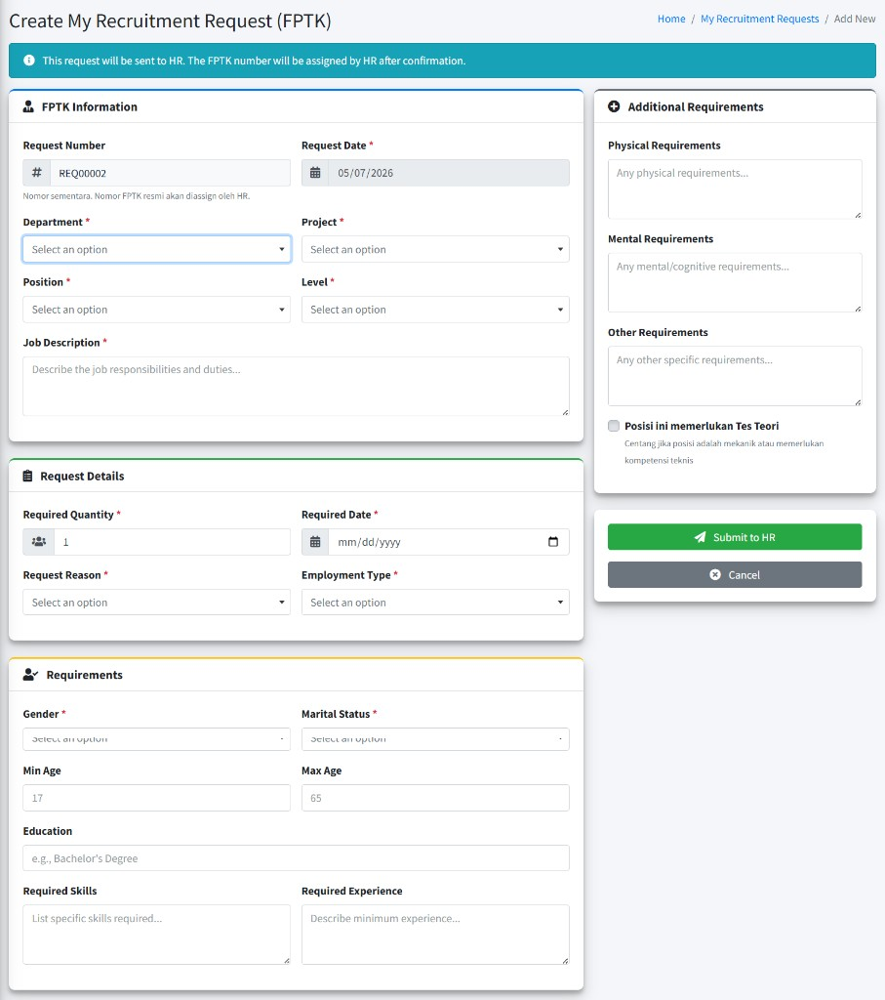
 <em>Gambar 8.2 — Create My Recruitment Request (FPTK)</em>

### Detail permintaan (Draft / belum direview HR)

Pada [daftar](#my-recruitment-requests-list), klik **View** pada baris yang ingin dibuka.

Selama permintaan masih **Draft** dan **belum direview atau ditindaklanjuti oleh HR** seperti penetapan nomor surat resmi, nomor di header biasanya tetap berformat **REQxxxxx** — itu adalah **nomor sementara** dari pengajuan mandiri. **Nomor FPTK resmi** (polanya mengikuti penomoran perusahaan, misalnya **xxxx/HCS-[kode proyek]/FPTK/bulan/tahun**) diberikan oleh **HR setelah konfirmasi**, sebagaimana dijelaskan di banner form pembuatan.

Badge **Draft** pada judul menandakan Anda masih dapat menyunting data. Halaman detail menampilkan ringkasan **FPTK Information** (department, project, position, level, jumlah kebutuhan, tanggal dibutuhkan, jenis kontrak, alasan permintaan, kebutuhan tes teori, dll.), **Job Description & Requirements**, serta kartu **Requested By** (nama, email, cap waktu pembuatan).

    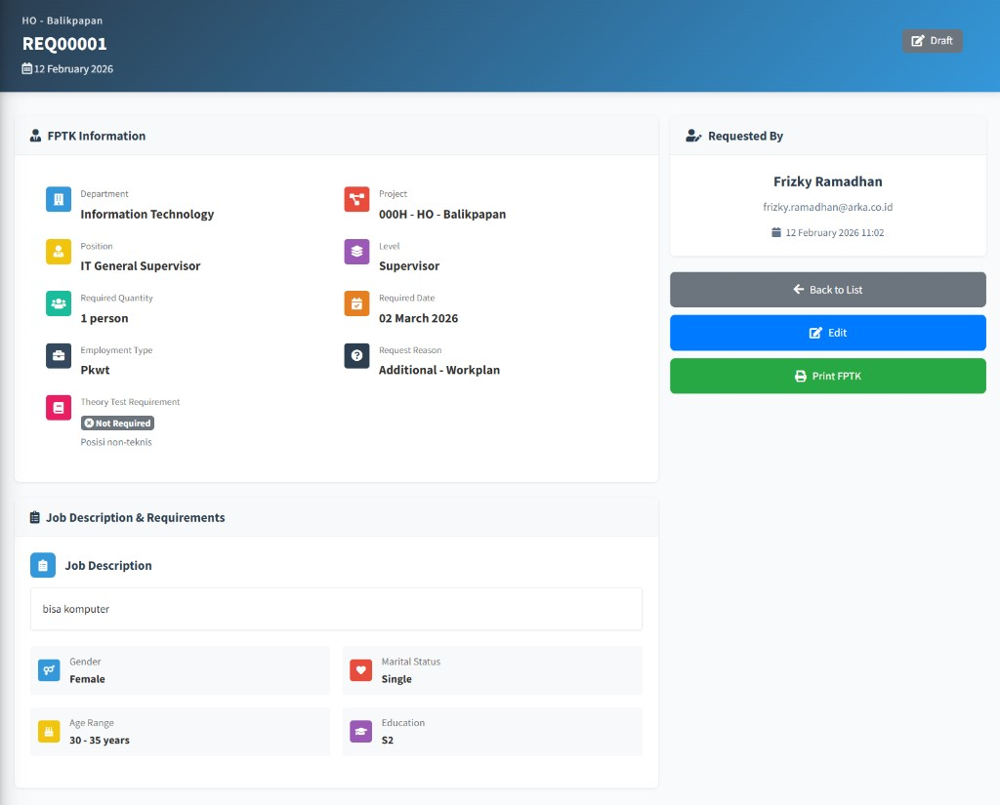
 <em>Gambar 8.3 — Detail permintaan FPTK (Draft)</em>

**Tombol aksi pada Draft di jalur ini**

- **Back to List** — kembali ke **My Recruitment Requests**.
- **Edit** — membuka form perubahan (**Update Recruitment Request**); perbaiki isi di sini selama masih **Draft** dan sebelum HR mengunci alur pengeditan.
- **Print FPTK** — cetak/preview dokumen di tab baru.

Di halaman detail **My Recruitment Requests**, tombol **Submit for Approval** umumnya **tidak** ditampilkan untuk pengguna personal pada status **Draft**; kelanjutan hingga acknowledgment dan nomor resmi mengikuti prosedur **HR**. Jika layar Anda menampilkan opsi pengajuan lain (misalnya setelah pembaruan sistem), ikuti petunjuk yang muncul.

### Detail permintaan dan proses rekrutmen (Recruitment Sessions)

Setelah HR memproses pengajuan, nomor berubah dari **REQxxxxx** menjadi **nomor FPTK resmi** (misalnya **xxxx/HCS-[kode proyek]/FPTK/bulan/tahun**). Badge status bisa **Submitted**, **Acknowledged**, **Approved**, atau lainnya — cuplikan di bawah memakai **Approved**.

Detail halaman memuat kartu **FPTK Information**, **Job Description & Requirements**, **Requested By**, serta blok tes teori jika ada. Di jalur personal, **Edit** biasanya hilang setelah bukan draft; **Back to List** dan **Print FPTK** tetap tersedia.

    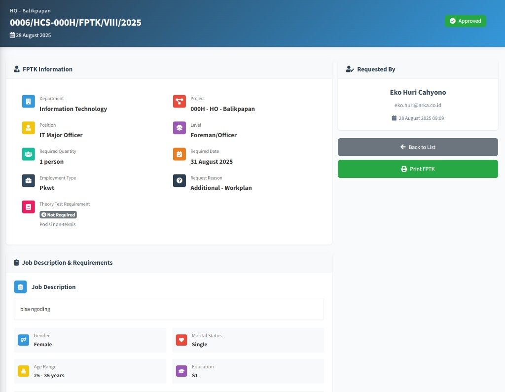
 <em>Gambar 8.4 — Detail permintaan FPTK (Approved)</em>

**Recruitment Sessions** menampilkan badge jumlah session dan satu baris per kandidat. Kolom: **CV Review**, **Psikotes**, **Tes Teori**, **Interview HR**, **Interview User**, **Offering**, **MCU**, **Hire**, **Onboarding**, **Final Status**, **Action** (**View**). Simbol sel menandakan selesai, sedang berjalan, atau belum dimulai. Pada halaman detail utuh, kotak **Theory Test Requirement** di atas tabel dapat menjelaskan jika tes teori dilewati — cocokkan dengan kolom **Tes Teori** tiap baris.

    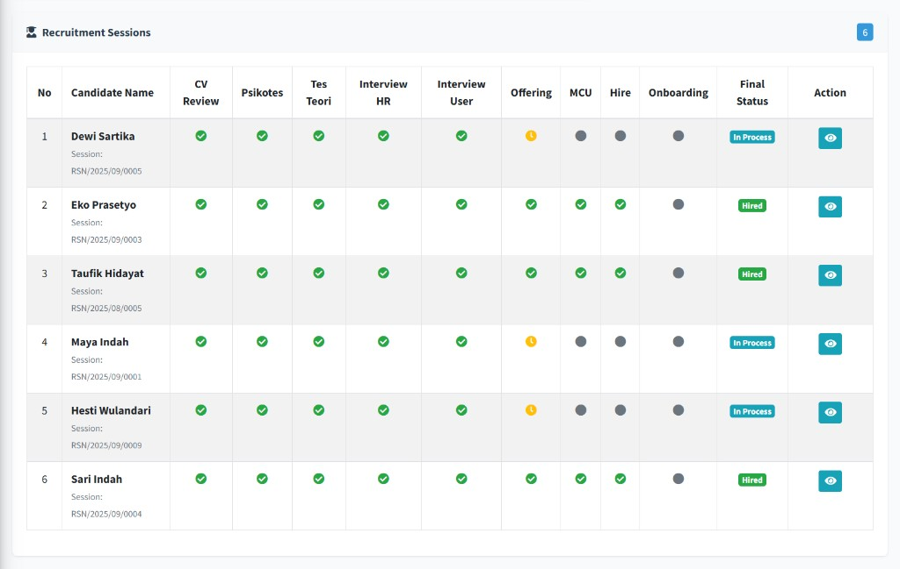
 <em>Gambar 8.5 — Recruitment Sessions</em>

Untuk pertanyaan tentang tahapan atau keputusan pada seorang kandidat, koordinasikan dengan tim **HR** yang menangani FPTK tersebut.

---

## 9. Kesalahan & bantuan

| Gejala / pesan (contoh)                                                        | Kemungkinan penyebab                                                     | Apa yang bisa dicoba                                                                                                                                                                                   |
| :----------------------------------------------------------------------------- | :----------------------------------------------------------------------- | :----------------------------------------------------------------------------------------------------------------------------------------------------------------------------------------------------- |
| **Please select at least one approver before submitting**                      | **Approver Selection** kosong                                            | Pilih minimal satu approver sebelum **Save & Submit** / **Submit for Approval**.                                                                                                                       |
| **Only draft recruitment requests can be submitted**                           | Status bukan **Draft**                                                   | Buka permintaan **Draft** atau minta HR membuat entri baru.                                                                                                                                            |
| **After submitting, this FPTK cannot be edited anymore**                       | FPTK sudah **Submitted**                                                 | Isi FPTK (department, posisi, dll.) tidak bisa **Edit** lagi; untuk ganti approver pending gunakan **Update Approvers** di kartu **Approval Status** (lihat [bagian 3.3](#mengubah-approver-pending)). |
| **Approver yang sudah disetujui atau ditolak tidak dapat diubah atau dihapus** | Mencoba mengubah/menghapus approver yang sudah **Approved**/**Rejected** | Hanya ubah baris **Pending**; approver terkunci tetap di posisinya.                                                                                                                                    |
| **Approver tidak boleh duplikat**                                              | Approver yang sama dipilih lebih dari sekali                             | Pilih approver berbeda untuk setiap urutan.                                                                                                                                                            |
| Tombol **Update Approvers** tidak tampil                                       | Semua langkah sudah diputuskan atau status bukan **Submitted**           | Normal jika tidak ada langkah **Pending**; selesaikan alur approval atau buat FPTK baru bila perlu.                                                                                                    |
| **FPTK hanya dapat dihapus dalam status draft**                                | Menghapus FPTK non-Draft                                                 | Hanya **Draft** yang bisa **Delete**.                                                                                                                                                                  |
| Tombol tahap sesi tidak aktif / terkunci                                       | Tahap sebelumnya belum selesai atau sesi **Rejected**                    | Selesaikan tahap berurutan; baca **Recruitment Timeline** dan tooltip alasan kunci.                                                                                                                    |
| **Psikotes** &lt; 40 / **Not Recommended**                                     | Kandidat tidak memenuhi kriteria tahap                                   | Sesi berakhir **Rejected**; cari kandidat lain atau evaluasi ulang kebijakan penilaian.                                                                                                                |
| **Apply to FPTK** gagal / FPTK tidak muncul                                    | FPTK belum **Approved**, slot penuh, atau kandidat **Blacklisted**       | Pastikan FPTK disetujui dan masih buka; cek **Global Status** kandidat.                                                                                                                                |
| Menu **Recruitment Management** tidak tampil                                   | Hak akses HR rekrutmen belum diberikan                                   | Hubungi administrator untuk role/permission rekrutmen.                                                                                                                                                 |
| Nomor masih **REQxxxxx**                                                       | HR belum assign **Letter Number**                                        | Tunggu konfirmasi HR atau tanyakan status di **Requests (FPTK)**.                                                                                                                                      |

### Menghubungi administrator

Siapkan **username** (bukan password), waktu kejadian, menu yang dibuka (**Requests (FPTK)**, **Sessions**, **My Recruitment Request**, dll.), **Request Number** / **FPTK Number** / **Candidate Number**, nama kandidat bila relevan, dan cuplikan pesan error di layar. Untuk masalah persetujuan, sebutkan juga apakah dokumen sudah muncul di **My Approvals** approver terkait.

---

---

# Official Travel Management (LOT)

| **Versi** | **Tanggal** | **Revisi (ringkas)**                                                                                                         |
| :-------- | :---------- | :--------------------------------------------------------------------------------------------------------------------------- |
| 1.2       | 2026-06-05  | **Update Approvers** pada detail LOT **Submitted**: hanya langkah **Pending** yang dapat diganti; approver yang sudah **Approved**/**Rejected** terkunci. |
| 1.1       | 2026-05-13  | **Multi-stop** & destinasi **manual** (centang).                                                                             |
| 1.0       | 2026-05-08  | Panduan LOT: dashboard & permintaan HR, formulir, stempel & tutup, laporan, **My Official Travel Request**, troubleshooting. |

Panduan ini menjelaskan **Letter of Travel (LOT)** / perjalanan dinas resmi di ARKA HERO untuk **staf HR** yang mengelola data LOT (dashboard, daftar permintaan, alur kedatangan–keberangkatan, pelaporan) dan untuk **karyawan selain HR** yang mengajukan lewat menu pribadi/personal.

| **Istilah**                                                | Arti singkat                                                                                                                                                                                                                                                                                                                                                                                                                                                                                                                                                                                                                                                  |
| :--------------------------------------------------------- | :------------------------------------------------------------------------------------------------------------------------------------------------------------------------------------------------------------------------------------------------------------------------------------------------------------------------------------------------------------------------------------------------------------------------------------------------------------------------------------------------------------------------------------------------------------------------------------------------------------------------------------------------------------ |
| **LOT**                                                    | _Letter of Travel_ — surat/tiket perjalanan dinas; nomor **LOT Number** mengacu pada dokumen ini.                                                                                                                                                                                                                                                                                                                                                                                                                                                                                                                                                             |
| **Official Travels**                                       | Judul halaman daftar permintaan LOT (HR).                                                                                                                                                                                                                                                                                                                                                                                                                                                                                                                                                                                                                     |
| **Letter Number**                                          | Pemilihan nomor surat dari sistem surat (kategori terkait) sebelum LOT terbit.                                                                                                                                                                                                                                                                                                                                                                                                                                                                                                                                                                                |
| **Travel Stops Timeline**                                  | Riwayat perjalanan yang terdiri dari urutan **Stop** / **Checkpoint**; tiap stop dapat memiliki waktu kedatangan (**Arrival**) dan keberangkatan (**Departure**) (keberangkatan).                                                                                                                                                                                                                                                                                                                                                                                                                                                                             |
| **Stop** / **Checkpoint** / **Destination**                | Titik tujuan sepanjang perjalanan dinas (LOT). Satu perjalanan dapat terdiri dari beberapa stop/checkpoint/tujuan. Pada setiap tujuan, dicatat waktu kedatangan (**Arrival**) dan waktu keberangkatan (**Departure**). Tujuan dapat berupa project internal perusahaan, kota, dinas, vendor, dsb. Aturan utama:  - Minimal ada satu tujuan di setiap LOT.  - Jika terdapat beberapa tujuan, maka pemilihan tujuan bukan berarti urutan perjalanan.  - Jika di salah satu tujuan sudah ada pencatatan waktu kedatangan, maka tujuan lain tidak bisa melakukan pencatatan yang sama sampai sudah ada pencatatan waktu keberangkatan di lokasi pertama. |
| **Approver Selection**                                     | Pemilihan satu atau lebih **approver** yang menyetujui pengajuan.                                                                                                                                                                                                                                                                                                                                                                                                                                                                                                                                                                                             |
| **Update Approvers**                                       | Tombol pada kartu **Approval Status** (detail LOT **Submitted**) untuk mengganti approver yang masih **Pending**; approver yang sudah memutuskan tidak dapat diubah.                                                                                                                                                                                                                                                                                                                                                                                                                                                                                          |
| **Flight Request**                                         | Bagian opsional untuk kebutuhan tiket pesawat (terhubung modul penerbangan jika dipakai).                                                                                                                                                                                                                                                                                                                                                                                                                                                                                                                                                                     |
| **Master Data** → **Transportations** / **Accommodations** | Data referensi untuk pilihan **Transportation** dan **Accommodation** pada formulir LOT (di **GENERAL SECTION**).                                                                                                                                                                                                                                                                                                                                                                                                                                                                                                                                             |

---

 

## 1. Untuk HR — Dashboard LOT

### Langkah-langkah — membuka **Official Travel Dashboard** (_Official Travel Dashboard_)

1. **Login** ke ARKA HERO.
2. Di sidebar, buka grup **Official Travel Management**, lalu klik **Dashboard**.
3. Baca ringkasan di layar (masing-masing memberi gambaran cepat tentang keadaan LOT):
    - **Cakupan data (project Anda):** ringkasan angka dan tabel di bawah memakai LOT yang **relevan dengan project ter-assign** pada akun login Anda (biasanya **LOT Origin** dan/atau **stop** yang cocok dengan assignment di sistem). **Pending Arrivals** dan **Pending Departures** hanya bermakna jika Anda punya **hak mencatat stempel**; isinya dibatasi ke LOT / stop yang **menurut aturan boleh Anda tangani**, tidak semua LOT dalam ringkasan umum.
    - **Total Travels** — jumlah LOT dalam **lingkup project** Anda sejak pencatatan (acuan “semua waktu” tetap dipotong oleh filter assignment).
    - **Active Travels** — di antara LOT dalam lingkup tersebut, yang statusnya masih berjalan / belum ditutup.
    - **Pending Arrivals** — jumlah LOT yang proses kedatangannya (**Arrival**) masih pending.
    - **This Month** — jumlah LOT dalam lingkup project Anda yang tercatat pada bulan berjalan.
    - **Travel Status Overview** — kotak hitung per status (**Draft**, **Submitted**, **Approved**, **Rejected**) dalam **lingkup project** yang sama.
    - Tabel **Open Official Travels** — baris LOT terbuka dalam lingkup itu; kolom **Travel Number**, **Traveler**, **Destination**, **Date**, **Status**, **Action**. **Destination** bisa **lebih dari satu baris** jika banyak checkpoint.
4. Di **Quick Actions** gunakan **Pending Arrivals**, **Pending Departures** (jika tersedia dan Anda berhak mencatat stempel kedatangan dan keberangkatan), **View All Travels** ke daftar, atau **New Official Travel** untuk pengajuan baru (jika tombol tampil).

**Catatan:** Jumlah **Pending Arrivals** / **Pending Departures** terkait tugas pencatatan **stempel** untuk perjalanan yang sudah disetujui; tombol terkait hanya tampil jika **hak akses** akun Anda memungkinkan.

---

## 2. Untuk HR — Daftar permintaan (**Requests**)

### Langkah-langkah — **Official Travels** (daftar & filter)

1. **Login** ke ARKA HERO.
2. Di sidebar, **Official Travel Management** → **Requests**.
3. Gunakan **Filter** (buka panel **Filter**) untuk **Date From**, **Date To**, **Travel Number**, **Destination**, **NIK**, **Traveler Name**, **Project**, **Status**, dan kriteria lain jika tersedia. **Destination** memfilter berdasarkan teks di **tiap stop** itinerary. Di tabel, kolom **Destination** menampilkan **daftar bertingkat** (beberapa bullet) jika LOT punya banyak stop; satu teks jika hanya satu tujuan.
4. Baca tabel; gunakan **Export** untuk ekspor data jika perlu.
5. Klik **Add** (tombol kuning dengan ikon **+**) bila diizinkan, untuk buat LOT baru.
6. Pada baris data, gunakan ikon/aksi (misalnya **View** / **Edit**) sesuai tampilan untuk membuka detail atau **Edit**.

**Catatan:** Opsi **Status** di filter dapat mencakup nilai seperti **Draft**, **Menunggu Konfirmasi HR**, **Submitted**, **Approved**, **Rejected**, **Closed** — tergantung proses di perusahaan.

---

## 3. Formulir pengajuan HR — **Letter Number**, **Official Travel Detail**, **Flight Request**, **Approver Selection**

### Langkah-langkah — buat atau ubah LOT (_Add Official Travel (LOT)_ / _Edit Official Travel_)

**1.** Buka **Add** dari halaman **Official Travels** (lihat bagian 2), atau buka data yang sudah ada lewat **Edit** dari daftar.

**2. Letter Number**  
Pilih nomor surat lewat bagian **Letter Number** (kategori surat yang dipakai organisasi; untuk LOT kategorinya (B) Surat Internal). Setelah memilih, **LOT Number** umumnya terisi otomatis; baca teks bantuan di bawah isian jika ada. Jika nomor surat belum ada, klik **Create New**.

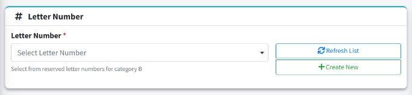

Jika membuat nomor surat lewat **Create New**, tampil form **Create Letter Number** (**Basic Information**, **Next Number Preview**, isian project, kategori, tanggal, subjek, dst.).

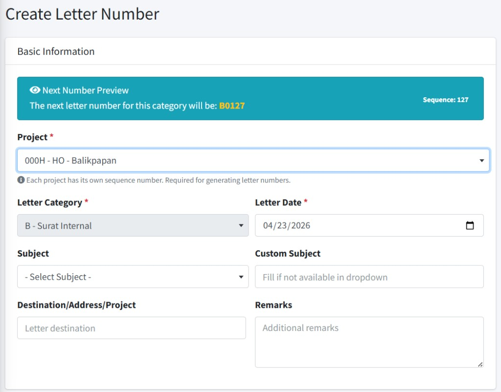

**3. Travel Information**  
Pada kartu **Travel Information**: **LOT Number** memakai pola `ARKA/[Letter Number]/HR-[Project Code]/bulan-romawi/tahun`; isian disesuaikan setelah Anda memilih nomor surat dan **LOT Origin** di langkah sebelumnya (ada teks bantuan di bawah field). Isi **LOT Date**, **LOT Origin** (dropdown **project asal**), dan **Main Traveler**. **Title**, **Business Unit**, dan **Department** di bagian bawah kartu adalah **ringkasan otomatis** dari karyawan yang dipilih sebagai Main Traveler — tidak perlu diketik di sini.

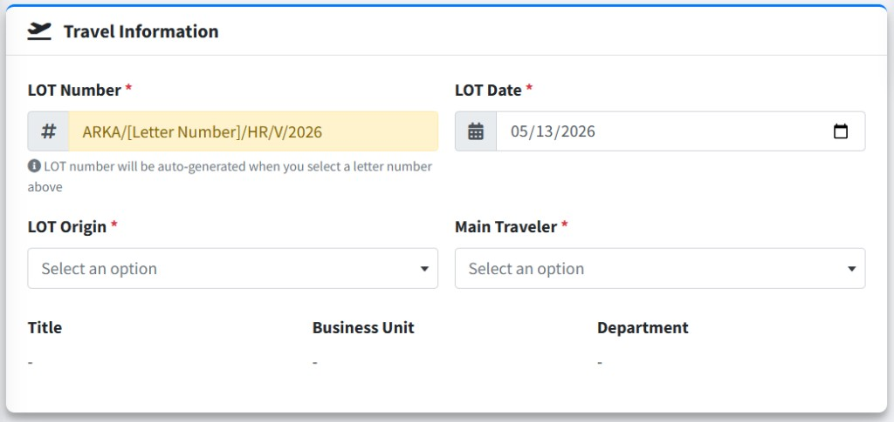

**4. Destination & schedule** (kartu berikutnya pada form yang sama) mengatur **itinerary** dan jadwal ringkas:

- **Beberapa destinasi:** klik **+ Add destination** untuk menambah **stop** (Destination 1, 2, …). Tiap baris punya tautan **Remove** untuk menghapus stop yang tidak dipakai.
- **Pilih project (kotak manual tidak dicentang):** gunakan dropdown **Select project** — destinasi dianggap terikat ke **project aktif** yang dipilih.
- **Input manual (kotak dicentang):** field berubah menjadi teks **Manual destination label**; ketik label destinasi bebas. Sesuai petunjuk di layar, **stempel checkpoint** pada stop **manual** mengikuti **penugasan proyek LOT Origin** (proyek asal perjalanan), bukan daftar project destinasi.
- Isi juga **Purpose**, **Departure Date**, dan **Duration** pada bagian ini.

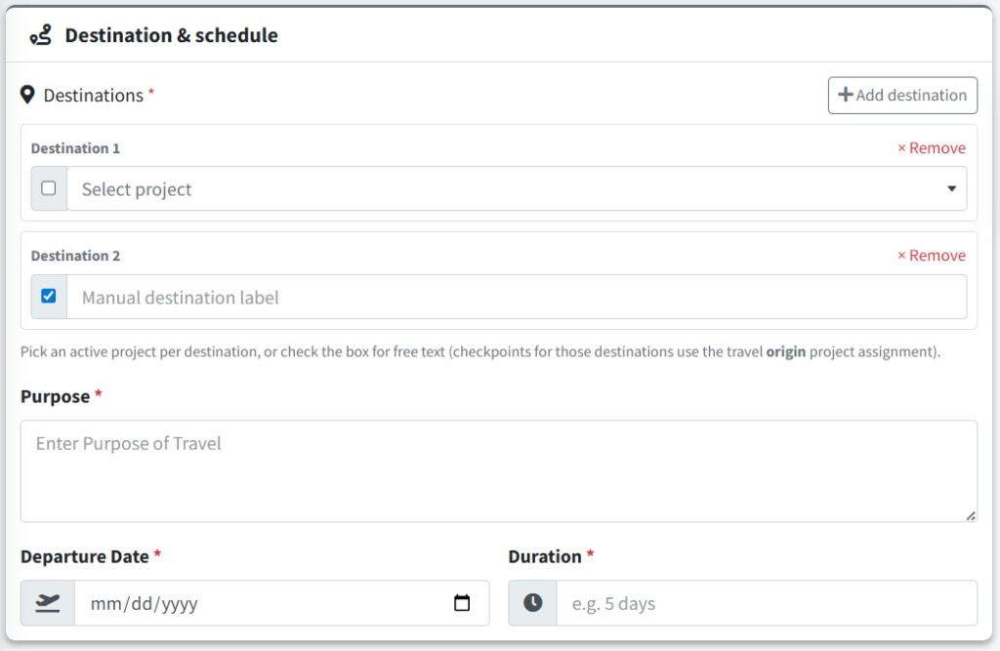

**5. Followers** (opsional)  
Klik **Add Follower** untuk menambah baris, pilih karyawan; **X** / **Remove** untuk menghapus baris.

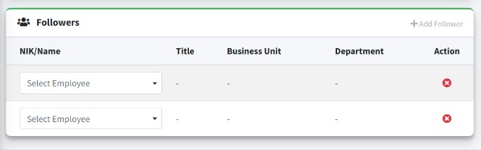

**6. Travel Arrangements**  
Pilih **Transportation** dan **Accommodation** (data dari **Master Data** → **Official Travel Data**).

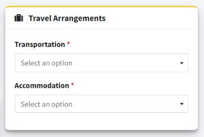

**7. Flight Request** (opsional)  
Centang **Check if you need flight ticket reservation**; isi segmen penerbangan sesuai form. Jika LOT disetujui, pengajuan tiket diproses HR HO Balikpapan sesuai kebijakan.

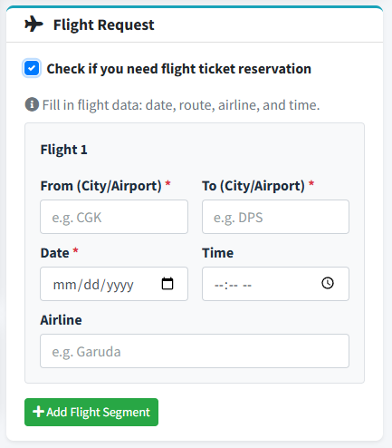

**8. Approver Selection**  
Cari approver (nama atau email), baca **Approval Rules Information** untuk mengetahui aturan pemilihan approval untuk LOT. Jika approver tidak tersedia, hubungi HR/IT HO Balikpapan.

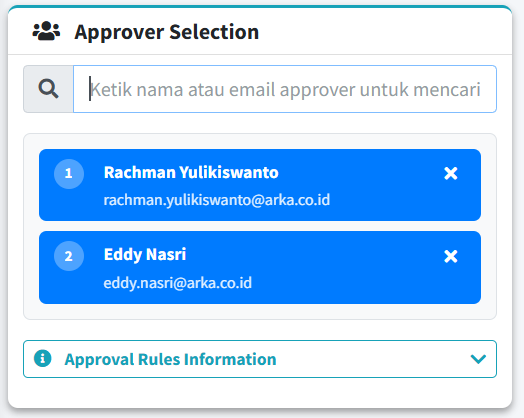

**9.** Simpan: **Save as Draft** (bisa diubah lewat **Edit** sampai disetujui) atau **Save & Submit** (ajukan ke approver). **Cancel** kembali ke daftar.

**Detail LOT — Cetak:** tombol **Print** bertipe **split** (gabungan tombol utama + panah). Bagian utama: cetak **semua** destinasi dan seluruh blok stempel pada satu halaman. **Menu tarik-turun:** pilih **satu stop** — satu lembar cetak hanya untuk destinasi itu (berguna memberikan formulir stempel per lokasi). Jika LOT **hanya satu** destinasi tanpa baris itinerary terpisah, hanya tampil tombol cetak biasa.

**10.** Untuk LOT yang masih **Draft**, buka detail LOT lalu klik **Submit for Approval** untuk mengajukan persetujuan.

**11.** Untuk LOT dari **My Official Travel Request** (nomor **REQxxxxx**), buka detail LOT, klik **Konfirmasi & Isi Nomor Surat**; pilih nomor surat (seperti langkah 2), tentukan approver (seperti langkah 7), **Update**; lalu di detail LOT klik **Submit for Approval** untuk meneruskan ke proses approval.

### Detail LOT — status dan alur persetujuan

Setelah LOT dibuat atau diajukan, buka detail lewat **View** dari daftar **Official Travels**. Panel kanan menampilkan **Travel Stops Timeline**, **Flight Request** (jika ada), dan kartu **Approval Status** (daftar approver beserta status langkah).

**Aksi (panel kanan dan tombol aksi, sesuai status dan hak akses)**

| Status                        | Aksi umum                                                                                                                      |
| :---------------------------- | :----------------------------------------------------------------------------------------------------------------------------- |
| **Draft**                     | **Edit**, **Delete**, **Submit for Approval**                                                                                  |
| **Submitted**                 | Approver memproses lewat **My Approvals**; HR dapat **Update Approvers** selama masih ada langkah **Pending** (lihat di bawah) |
| **Approved** / **Open**       | **Record Arrival**, **Record Departure**, **Edit itinerary** (jika berwenang), **Close Official Travel**, **Print**            |
| Semua (kecuali ditolak/batal) | **Print**, **Back to List**                                                                                                    |

**Catatan:** Setelah **Submit for Approval**, isian LOT (traveler, destinasi, jadwal, transportasi, dll.) **tidak dapat diedit** lagi lewat **Edit**; yang masih dapat disesuaikan HR hanya **approver pada langkah Pending** lewat **Update Approvers** di kartu **Approval Status**.

**Penjelasan singkat — alur persetujuan LOT**

1. Pembuat (HR atau karyawan via **My Official Travel Request** yang dikonfirmasi HR) menyimpan **Draft** atau mengajukan (**Submitted**).
2. **Approver** yang dipilih memberi keputusan di **My Approvals** (jenis dokumen **Official Travel**).
3. Setelah **Approved**, perjalanan dapat distempel (**Arrival** / **Departure**) dan ditutup sesuai bagian 4.

### Langkah-langkah — mengubah approver yang masih **Pending** (_Update Approvers_)

Fitur ini hanya untuk **HR** dengan hak **`official-travels.edit`**, pada detail LOT berstatus **Submitted**, dan **bukan** dari halaman **My Official Travel Request** karyawan.

1. Buka detail LOT (**View** dari daftar **Official Travels**).
2. Pada kartu **Approval Status** di kolom kanan, baca daftar approver:
    - Approver yang sudah **Approved** atau **Rejected** ditampilkan dengan badge status dan **tidak** memiliki tombol hapus (terkunci, border putus-putus).
    - Approver yang masih **Pending** dapat dihapus (ikon **×**) lalu diganti lewat kotak pencarian approver.
3. Untuk **mengganti** approver pending: klik **×** pada baris pending, ketik nama/email approver pengganti (minimal 2 karakter), pilih dari daftar — orang baru akan masuk pada **urutan yang sama**.
4. Anda juga dapat **menghapus** approver pending di akhir daftar atau **menambah** approver pending baru di urutan belakang, selama minimal satu approver tetap ada dan approver terkunci tidak diubah.
5. Klik **Update Approvers**. Pesan sukses mengonfirmasi pembaruan langkah pending; approver baru menerima antrean di **My Approvals**.

**Catatan:**

- Form **Update Approvers** **tidak** muncul jika semua langkah sudah diputuskan (tidak ada **Pending** tersisa) atau LOT bukan **Submitted**.
- Urutan approver mengikuti nomor **1**, **2**, **3**, … pada badge; approver terkunci tetap di posisi semula.
- Approver **tidak boleh duplikat** dalam satu LOT.
- Tampilan kartu **Approval Status** memakai komponen yang sama dengan modul FPTK; perilaku terkunci/pending identik.

---

## 4. Alur Perjalanan Dinas — **Arrivals**, **Departures**, **Stops/Checkpoint**, **Edit Destination**, **Close**

1. Setelah LOT disetujui (sering tampil sebagai **Open** / **Approved** di badge status), karyawan yang melakukan perjalanan dinas akan mendapatkan nomor LOT.
2. Setelah karyawan sampai di lokasi tujuan, **petugas HR di lokasi** mencari LOT berdasarkan nomor LOT, lalu melakukan [Arrival Check](#langkah-langkah--record-arrival-arrival-check).
3. Saat karyawan akan meninggalkan lokasi tujuan dan kembali ke lokasi awal atau ke lokasi selanjutnya, petugas HR yang berwenang mencari LOT tersebut, lalu melakukan [Departure Check](#langkah-langkah--record-departure-departure-check).
4. Jika perjalanan dilanjutkan ke lokasi berikutnya (masih dalam lingkungan perusahaan), **petugas HR di lokasi berikutnya** mengulang **Arrival** dan **Departure** seperti langkah 2–3, mengikuti aturan **checkpoint** di atas. Jika perjalanan dilakukan keluar lingkungan perusahaan, **stop/checkpoint** akan ditangani **petugas HR di lokasi awal** karyawan—sesuai kebijakan setempat.
5. Pencarian nomor LOT bisa dilakukan dari List Official Travel atau dari Dashboard Official Travel
6. Setiap entri memuat **Destination #N** dengan subbagian **Arrival** / **Departure** (jika sudah tercatat) atau keterangan seperti **Arrival Only** / **Departure Only** tergantung isian yang sudah ada di **Travel Stops Timeline**.

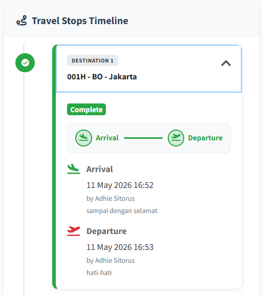

7. Jika belum ada **stop/checkpoint**, timeline dapat menunjukkan bahwa pencatatan belum dimulai.
8. Penutupan LOT: ketika seluruh rangkaian selesai, atau — bila dinas dihentikan lebih awal — melalui aturan **Close** di [menutup perjalanan](#langkah-langkah--menutup-perjalanan-close) (termasuk **penutupan dini** dari project **LOT Origin** setelah minimal satu checkpoint lengkap).

### Langkah-langkah — **Record Arrival** (_Arrival Check_)

1. Di halaman detail LOT (atau lewat **Open Official Travels** / antrean **Pending Arrivals** di dashboard bila Anda berwenang), klik **Record Arrival** jika tersedia. Pada LOT **beberapa destinasi**, bila lebih dari satu stop relevan untuk akun Anda, pilih **Destination (checkpoint)** di formulir sebelum mengisi waktu dan catatan.
2. Pada kartu **Arrival Check**, isi **Arrival Date & Time** dan **Arrival Notes** (wajib).
3. Klik **Confirm Arrival**; baca pertanyaan konfirmasi di jendela pop-up. **Cancel** kembali ke detail.

### Langkah-langkah — **Record Departure** (_Departure Check_)

1. Setelah urutan stempel memungkinkan, klik **Record Departure** di halaman detail.
2. Baca **Current Stop Information** (misalnya **Arrival Confirmed By**, **Arrival Notes**).
3. Isi **Departure Date & Time** dan **Departure Notes** pada **Departure Check**; klik **Confirm Departure**; setujui peringatan bila muncul.

**Catatan:** Pada satu **stop**, **arrival** harus lebih dulu dari **departure**. Pada LOT **multi–destinasi**, **urutan antar stop** mengikuti subbagian **LOT satu checkpoint dan banyak checkpoint**; tombol dapat disembunyikan bila **hak akses** atau fase checkpoint belum mengizinkan.

### Langkah-langkah — Menyesuaikan tujuan setelah LOT disetujui (**Edit itinerary**)

Jika karyawan melakukan perjalanan ke tujuan berbeda di luar rencana, **staf HR pada project LOT Origin** dapat memperbarui (menambah/mengubah) destinasi perjalanan. Sehingga LOT berstatus **Approved** (biasanya badge **Open**) dan sudah memiliki **stop** di database bisa diperbarui tujuannya.

1. Buka **halaman detail LOT**.
2. Pada kolom kanan (di bawah timeline perjalanan), cari kartu **Edit itinerary** — hanya muncul untuk **staf HR pada project LOT Origin**.
3. Baris dengan **Locked** / ikon gembok: stop yang sudah pernah distempel — **tidak boleh** diubah atau dihapus dari form ini.
4. Baris tanpa kunci: dapat diedit, ditambah lewat **+ Add Destinations**, atau dihapus (**Remove**) sesuai kebutuhan; setelah semua stop terkunci, Anda tetap dapat **menambah** destinasi baru di bawahnya.
5. Simpan lewat tombol **Save** pada kartu tersebut.

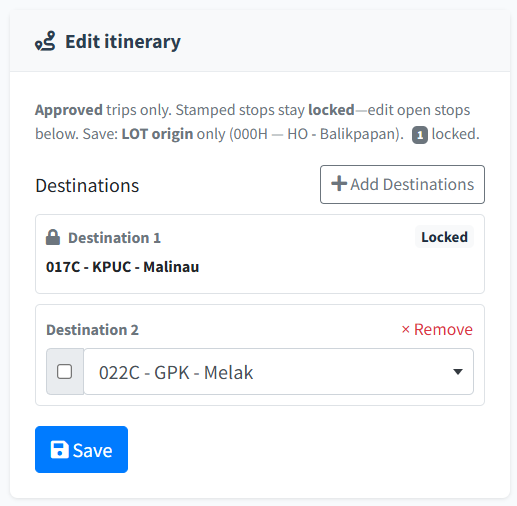

### Langkah-langkah — Menutup Perjalanan (**Close**)

1. Buka detail LOT bila kondisi memungkinkan penutupan (lihat aturan di bawah).
2. Klik **Close Official Travel**; di jendela **Close Travel Request** baca teks peringatan di layar. Jika LOT **multi–destinasi** tetapi **belum semua** checkpoint selesai, akan ada teks tambahan agar penutupan hanya dilakukan bila perjalanan **benar–benar** dihentikan lebih awal (misalnya kembali ke lokasi asal tanpa melanjutkan destinasi berikutnya).
3. Klik **Yes, Close Travel** untuk melanjutkan. Setelah sukses, status dapat menjadi **Closed** dan perubahan berikutnya dibatasi.

**Dua situasi penutupan:**

- **Semua checkpoint selesai** — setiap stop yang direncanakan sudah memiliki **arrival** dan **departure**; **staf HR pada project LOT Origin** dapat menutup LOT (sesuai tampilan tombol di detail atau dashboard).
- **Penutupan dini dari lokasi awal (LOT Origin)** — masih ada stop yang **belum** lengkap, tetapi **minimal satu** stop sudah tercatat **arrival** **dan** **departure**. Untuk skenario “beberapa destinasi tidak jadi dan kembali ke lokasi awal”. Setelah ditutup, stop yang belum terpakai tidak lagi dapat di-stempel.

**Catatan:** Pencatatan stempel dan penutupan hanya tersedia bila **hak akses** dan **penugasan project** Anda sesuai; bila menu atau tombol tidak muncul, minta bantuan **tim HR / IT**.

---

## 5. Untuk HR — **Reports**

### Langkah-langkah — buka ringkasan laporan

1. **Login** ke ARKA HERO.
2. **Official Travel Management** → **Reports**.
3. Baca penjelasan kartu (analitik & laporan LOT), lalu klik **View Report** pada **Official Travel Requests Report** untuk membuka halaman laporan.
4. Di halaman **Report Official Travel Requests**, isi **Filter Options** (**Status**, **Project (origin)**, rentang **LOT date**, **LOT number**, **Destination**, **Traveler**, **Purpose**, dan sebagainya), lalu klik **Tampilkan data** untuk memuat tabel. Isian **Destination** mencocokkan teks pada **tiap stop** itinerary (sama konsepnya dengan filter daftar **Requests**). Kolom **Destination** pada tabel laporan menampilkan **beberapa poin** bila LOT banyak stop; file **Export to Excel** menyertakan rangkuman teks berantai (**A → B → …**) untuk kolom destinasi. Gunakan **Reset** bila perlu mengosongkan filter, dan **Export to Excel** jika tersedia. Tombol **Back to Reports** mengembalikan ke ringkasan laporan.

**Catatan:** Laporan ini umumnya memerlukan setidaknya satu kriteria filter dipilih dulu; jika tabel tampil kosong, coba pilih **Date**, **Status**, project, atau isian filter lain, lalu muat ulang.

---

## 6. Karyawan (non–HR) — **My Official Travel Request**

Bagi karyawan dengan peran “user” (menu **My Features**), pengajuan pribadi lewat item berikut (bukan menu **Official Travel Management** di atas).

### Langkah-langkah — buka daftar & ajukan

1. **Login** ke ARKA HERO.
2. Di sidebar, **My Features** → **My Official Travel Request** (bukan menu HR **Official Travel Management**).
3. Buka panel **Filter** bila perlu; gunakan **Travel Number**, **Status**, **Role** (**Main Traveler** / **Follower**), **Destination** (mencocokkan stop mana pun pada itinerary), dan lainnya. Kolom destinasi pada daftar mengikuti tampilan **banyak tujuan** jika LOT memiliki beberapa stop.
4. Klik **New Request** untuk mengajukan permintaan baru (jika tombol tampil). <a href="#submit-lot-request">Lihat gambar</a>.
5. Isi form **Add My Official Travel (LOT)** — ikuti banner informasi di atas (nomor surat dan LOT final oleh HR). Pada kartu **Travel Information**: nomor sementara **REQxxxxx**, **Main Traveler** (diri Anda, read-only), **LOT Date**, **LOT Origin**, ringkasan Title/BU/Department. Pada **Destination & schedule**: **+ Add destination** untuk beberapa stop; per baris pilih **Select project** atau centang **manual** lalu isi teks bebas (stempel stop manual mengikuti penugasan **LOT Origin**); isi **Purpose**, **Departure Date**, **Duration**. Lengkapi **Followers** (opsional), **Travel Arrangements**, dan **Flight Request** bila perlu; lalu klik **Submit to HR**. LOT tetap berformat **REQxxxxx** sampai HR mengonfirmasi; nomor LOT resmi dan surat ditetapkan HR.

6. Untuk melihat detail atau mengubah: di daftar, gunakan action **View** atau **Edit** pada baris terkait. Di halaman **detail**, tombol **Print** berperilaku sama seperti di modul HR: **cetak penuh** lewat bagian utama tombol; **satu destinasi** lewat menu tarik-turun bila LOT punya beberapa **stop**.
7. Langkah selanjutnya diproses **tim HR** (konfirmasi surat, pengisian nomor LOT resmi seperti ARKA/Bxxxx/HR/IV/2026, dan penetapan approver).

---

## 7. Kesalahan & bantuan

| Gejala / pesan (contoh)                                            | Kemungkinan penyebab                                                                                            | Apa yang bisa dicoba                                                                                                                                                                          |
| :----------------------------------------------------------------- | :-------------------------------------------------------------------------------------------------------------- | :-------------------------------------------------------------------------------------------------------------------------------------------------------------------------------------------- |
| Tombol **Close** tidak muncul padahal satu destinasi sudah selesai | Akun Anda **bukan** penugasan **LOT Origin**, atau belum ada stop dengan **arrival + departure** lengkap        | Penutupan dini hanya untuk project **LOT Origin**. Pastikan minimal **satu** checkpoint **lengkap** untuk skenario dini; lengkapi **semua** stop untuk penutupan penuh.                       |
| Tombol **Add** / **Record Arrival** / **Close** tidak muncul       | Akun tidak memiliki **hak akses** atau penugasan project yang diperlukan                                        | Hubungi **tim HR / pengelola akses** agar peran dan penugasan project disesuaikan dengan tugas Anda.                                                                                          |
| **LOT Number** tidak terisi                                        | **Letter Number** belum dipilih atau aturan surat kantor belum terpenuhi                                        | Pilih kembali surat; ikuti kebijakan **Letter Administration** (nomor surat) di perusahaan Anda.                                                                                              |
| Tabel **Reports** selalu kosong                                    | Filter belum diisi cukup (sering wajib minimal satu kriteria)                                                   | Pilih setidaknya satu kriteria, lalu muat ulang.                                                                                                                                              |
| Tidak dapat **Confirm Arrival** / **Confirm Departure**            | Urutan **checkpoint** / fase paralel–kunci belum memungkinkan, atau akun bukan penanggung stempel destinasi itu | Periksa **Travel Stops Timeline** dan aturan multi–destinasi di bagian 4; pastikan **departure** pada stop yang sedang mengunci sudah selesai bila stop lain menunggu; tanyakan HR bila ragu. |
| Pesan wajib pilih approver ( **Approver Selection** )              | Jumlah approver belum memenuhi syarat                                                                           | Pilih approver lewat pencarian hingga memenuhi aturan.                                                                                                                                        |
| LOT **Submitted** tidak bisa **Edit** isian perjalanan             | LOT sudah diajukan ke approver                                                                                  | Isian LOT (traveler, destinasi, jadwal, dll.) tidak bisa **Edit** lagi; untuk ganti approver pending gunakan **Update Approvers** di kartu **Approval Status** (lihat [bagian 3.1](#mengubah-approver-pending-lot)). |
| Tombol **Update Approvers** tidak tampil                           | Semua langkah sudah diputuskan atau status bukan **Submitted**                                                  | Normal jika tidak ada langkah **Pending**; selesaikan alur approval atau buat LOT baru bila perlu.                                                                                            |
| Pesan tidak dapat menutup LOT                                      | Syarat penutupan (penuh atau dini dari origin) belum terpenuhi, atau akun tidak berwenang                       | Baca [menutup perjalanan](#langkah-langkah--menutup-perjalanan-close); penutupan dini memerlukan akun **LOT Origin** dan minimal satu stop **lengkap**.                                       |
| Menu **Print** tidak punya panah / hanya satu tombol               | LOT hanya **satu** destinasi tanpa baris itinerary terpisah                                                     | Yang ada split button hanya untuk LOT **multi-stop**; LOT tunggal tetap satu tombol **Print**.                                                                                                |
| Kartu **Edit itinerary** tidak tampil                              | LOT belum **Approved**, tidak punya stop, atau Anda bukan staf **LOT Origin**                                   | Periksa status dan **project asal** LOT; kartu ini untuk penugasan **LOT Origin**.                                                                                                            |
| Akses ditolak, atau halaman “tidak ditemukan”                      | Tautan atau nomor bukan milik data Anda, atau bukan bagian wewenang Anda                                        | Buka kembali dari **menu** dan daftar; jangan menebak tautan; pastikan memakai akun yang benar.                                                                                               |

### Eskalasi ke HR / tim dukungan

Hubungi **HR**, **IT**, atau **pengelola akses** di perusahaan Anda jika: menu tidak tampil padahal seharusnya bisa, status LOT tidak berubah setelah tindakan wajar, pesan di layar tidak ada di tabel di atas, atau Anda butuh koreksi data master (**Transportations**, **Accommodations**, **Projects**).

**Jangan** mengirim **password** lewat obrolan atau surel. Cukup sampaikan **username**, nomor **LOT** / **Travel Number**, waktu kejadian, dan cuplikan pesan error.

---

---

# Leave Management

| **Versi** | **Tanggal** | **Revisi (ringkas)**                                                                                                                                                                                                                        |
| :-------- | :---------- | :------------------------------------------------------------------------------------------------------------------------------------------------------------------------------------------------------------------------------------------ |
| 1.1       | 2026-05-20  | **Export/Import entitlement** baru: **satu baris per karyawan**, header **dua baris**, hanya **periode terakhir** (tahunan & cuti panjang), format tanggal **`d M Y`**, **carry over** LSL & annual **Manager/Director** saat **Generate**. |
| 1.0       | —           | Panduan awal: dashboard HR, **Leave Entitlements** (generate, export/import, per karyawan), **Requests**, **Reports**, **My Leave Request**, troubleshooting.                                                                               |

Panduan ini untuk **staff HR** yang mengoperasikan modul cuti/izin di ARKA HERO (**dashboard**, **entitlements**, **requests**, **reports**) dan untuk **karyawan** yang mengajukan lewat menu pribadi. Fitur ini mengacu pada form cuti / Formulir Izin Meninggalkan Pekerjaan dan Formulir Cuti Panjang, sehingga semua aktivitas yang menggunakan form tersebut akan diakomodir oleh fitur ini.

| **Istilah**                       | Arti singkat                                                                                                                                                                                                                                                                                                                                                                                                                                                         |
| --------------------------------- | -------------------------------------------------------------------------------------------------------------------------------------------------------------------------------------------------------------------------------------------------------------------------------------------------------------------------------------------------------------------------------------------------------------------------------------------------------------------- |
| **Leave Management**              | Grup menu di **HERO SECTION** untuk dashboard HR, daftar pengajuan, saldo cuti, dan laporan.                                                                                                                                                                                                                                                                                                                                                                         |
| **Leave Entitlement**             | Hak/saldo cuti per karyawan per periode dan jenis cuti; menjadi acuan saat mengajukan **Leave Request**. Ketentuan **Leave Entitlement** sangat mengacu pada **DOH** di **Employee Management**                                                                                                                                                                                                                                                                      |
| **Deposit Days**                  | Kolom saldo deposit pada blok **Periode Cuti Panjang** di berkas **Export**/**Import**; hanya relevan untuk entitlement kategori **LSL**.                                                                                                                                                                                                                                                                                                                            |
| **Carry Over**                    | Sisa hari periode sebelumnya yang ditambahkan ke hak periode baru. Untuk **LSL** mengikuti flag **carry over** di **Leave Types**; untuk **Cuti Tahunan** hanya level **Manager** dan **Director**. Dihitung otomatis saat **Generate Entitlements**, **bukan** saat **Add**/**Edit** manual.                                                                                                                                                                        |
| **Leave Period**                  | Rentang periode saldo yang terisi otomatis dari **entitlements** saat memilih karyawan dan jenis cuti.                                                                                                                                                                                                                                                                                                                                                               |
| **Leave Request**                 | Pengajuan izin/cuti sesuai **Leave Type** yang berlaku seperti Annual Leave (Cuti Tahunan), Special Leave (Menikah, Sakit, dsb), Unpaid Leave (Izin tidak dibayar), LSL (Cuti Panjang); memiliki **Register No.**, status alur persetujuan, dan dapat dihubungkan dengan **Flight Request**. Pengajuan **Cuti Periodik** di site (misal cuti jam/jadwal shift rutin atau pengaturan rosters) tidak diajukan dari menu ini melainkan dikelola terpisah di fitur lain. |
| **Approver Selection**            | Pemilihan satu atau lebih **approver** untuk menyetujui pengajuan sebelum **Save & Submit**.                                                                                                                                                                                                                                                                                                                                                                         |
| **Flight Request**                | Bagian opsional pada formulir (centang **Check if you need flight ticket reservation**) untuk kebutuhan tiket; terhubung alur modul penerbangan jika dipakai.                                                                                                                                                                                                                                                                                                        |
| **Close Leave Request**           | Penutupan pengajuan yang sudah **Approved** dan selesai masa cutinya agar alur administrasi tertutup.                                                                                                                                                                                                                                                                                                                                                                |
| **Cancellation Request**          | Pengajuan pembatalan sebagian/seluruh hari cuti lewat **Request Leave Cancellation** / **Cancellation Request Form**.                                                                                                                                                                                                                                                                                                                                                |
| **Master Data** → **Leave Types** | Pengaturan jenis cuti & kategori (mis. berbayar/tidak); mendefinisikan apa yang bisa diajukan karyawan.                                                                                                                                                                                                                                                                                                                                                              |

---

## 1. Untuk HR — **Leave Management Dashboard**

### Langkah-langkah — membuka **Leave Management Dashboard** (_Leave Analytics and Management Overview_)

1. **Login** ke ARKA HERO.
2. Di sidebar, grup **HERO SECTION** → **Leave Management** → **Dashboard**.
3. Baca ringkasan kartu statistik:

- **Total Requests** — jumlah pengajuan cuti sepanjang waktu (**All time requests**).
    - **Approved** — pengajuan dengan status disetujui dan persentase terhadap total.
    - **Pending** — menunggu persetujuan (**Awaiting approval**).
    - **This Month** — pengajuan pada bulan berjalan (dengan indikator pertumbuhan vs bulan lalu jika tersedia).

4. Pada kartu **Quick Search Employee Entitlement**, ketik nama atau NIK di kotak pencarian (**Search by employee name or NIK...**), lalu klik **Search** untuk melihat ringkasan saldo; tombol **Reset** mengosongkan isian.
5. Tinjau tabel **Open Leave Requests (Ready to Close)** — cuti yang sudah **Approved** dan layak ditutup; gunakan icon lihat untuk detail atau tombol centang untuk membuka **Close Leave Request** (konfirmasi di jendela pop-up).
6. Tinjau **Pending Cancellation Requests** — pembatalan yang menunggu keputusan; gunakan tombol aksi hijau/merah sesuai izin untuk menyetujui atau menolak (dengan **Notes** di jendela **Action on Cancellation Request** bila diminta).
7. Periksa **Employees Without Entitlements** dan **Employees with Expiring Entitlements** untuk tindak lanjut saldo; gunakan **Action** untuk membuka profil saldo karyawan.
8. Pada **Paid Leave Without Supporting Documents**, pantau cuti berbayar tanpa lampiran yang wajib — sesuai kebijakan, unggah dokumen dari halaman detail pengajuan agar memenuhi ketentuan sebelum batas konversi otomatis.

     <em>Gambar 1a — Ringkasan <strong>Leave Management Dashboard</strong>: kartu statistik, Quick Search entitlement, dan tabel utama (Open Leave Requests, Pending Cancellation, daftar entitlement). Blok lain (mis. cuti berbayar tanpa dokumen) dapat muncul lebih bawah pada layar penuh.</em>

**Catatan:** Tombol **Close**, persetujuan pembatalan, atau **Clear Entitlements** hanya tampil jika **hak akses** peran Anda mengizinkan (beberapa aksi terbatas untuk **administrator**).

---

## 2. Untuk HR — **Leave Entitlements**

**Leave entitlement** adalah kumpulan hak cuti per karyawan yang terdiri dari berbagai **leave type** (jenis cuti) beserta jumlah hari per periode. Data ini menjadi dasar **Leave Period** dan sisa hari pada formulir **Leave Request**; tanpa entitlement untuk periode yang berlaku, karyawan tidak dapat mengambil cuti sesuai jenis yang dipilih.

### Setup awal master data dan pola **Generate** / **Export** / **Import**

Sebelum tim rutin hanya menjalankan **Generate Entitlements**, pastikan fondasi berikut sudah konsisten dengan kebijakan perusahaan:

| Tahap                     | Uraian                                                                                                                                                                                                                                                                                                                                                                                                                             |
| :------------------------ | :--------------------------------------------------------------------------------------------------------------------------------------------------------------------------------------------------------------------------------------------------------------------------------------------------------------------------------------------------------------------------------------------------------------------------------- |
| **Master di sistem**      | **Leave Types** (kategori paid/unpaid, nama kolom di layar), **Projects**, serta penempatan karyawan (**Employee Management**) untuk administration aktif — keliru di master akan ikut terbawa ke saldo.                                                                                                                                                                                                                           |
| **Export**                | Di halaman **Entitlements**, pilih **project**, **Load Employees**, lalu **Export**. Menghasilkan berkas Excel **satu baris per karyawan** dengan header **dua baris** (identitas, **Periode Tahunan**, **Periode Cuti Panjang**, **Deposit Days**). Hanya **periode entitlement terakhir** per karyawan yang diekspor untuk cuti tahunan dan cuti panjang. Berguna untuk template, rekonsiliasi, atau koreksi massal **offline**. |
| **Import**                | Dipakai saat **setup awal** atau **koreksi massal** dalam bentuk Excel (`.xlsx`/`.xls`, maks. **10 MB**). Struktur kolom mengikuti hasil **Export** terbaru; satu baris dapat memperbarui blok **Periode Tahunan** dan/atau **Periode Cuti Panjang** sekaligus. Perbaiki baris gagal lewat **Import Validation Errors** lalu unggah ulang.                                                                                         |
| **Generate Entitlements** | Menjalankan pengisian saldo cuti **secara otomatis dan massal** untuk **semua karyawan aktif** pada **project** yang Anda pilih — Anda tidak perlu mengisi tiap orang secara manual.                                                                                                                                                                                                                                               |

### 2.1 Halaman **Leave Entitlement Management** — secara massal

Di halaman ini proses yang akan dilakukan adalah mengisi hak/saldo cuti dengan **Generate**, mengolah spreadsheet dengan **Export** dan **Import**, serta melihat table **Leave Entitlement** per project.

Untuk **setup awal**, urutan yang disarankan: **Load Employees** → **Generate Entitlements** (untuk men-generate data entitlement ter-update) → **Export** → edit berkas Excel → **Import** kembali.

Setelah operasi rutin, biasanya cukup menjalankan **Generate Entitlements** **secara berkala** misal di saat akhir bulan; **Export**/**Import** dipakai jika perlu rekonsiliasi, audit, atau koreksi massal — tidak sebagai aktivitas mingguan wajib.

1. **Login** ke ARKA HERO → sidebar **HERO SECTION** → **Leave Management** → **Entitlements**. Judul halaman: **Leave Entitlement Management**.

2. Pada kartu **Project Filter & Generate Entitlements**, pilih **Select Project**, lalu **Load Employees**. Gunakan **Clear** jika ingin mengosongkan pilihan project.

3. **Generate Entitlements** — Klik tombol **Generate Entitlements** (jika tersedia), konfirmasi sesuai dialog sistem, lalu tunggu hingga selesai. Baca ulang jendela informasi berikut bila perlu agar selaras dengan kebijakan HR.

     <em>Gambar 2.1a — Kartu filter project, <strong>Load Employees</strong>, <strong>Generate</strong>, <strong>Export</strong>, <strong>Import</strong>.</em>

**Penjelasan singkat — jendela informasi _Generate Entitlements for [kode project]_**

Jendela ini muncul saat Anda akan atau baru saja menjalankan **Generate Entitlements**. Judulnya menyebut **kode project** (contoh: **Generate Entitlements for 000H**). Yang biasanya dijelaskan di layar:

- **Siapa yang dapat saldo** — **Semua karyawan aktif** pada **project** tersebut (administration **aktif**).
- **Jenis cuti yang dibuatkan** — kombinasi **Paid Leave**, **Unpaid Leave**, **Annual Leave** (sering setelah masa kerja tertentu), **LSL** (ambang masa kerja mengikuti aturan sistem) — detail pasti ada di teks jendela.
- **Periode berlaku** — mengacu pada **DOH** di **Employee Management** dan **tahun/periode berjalan** (misalnya **Current Year**).
- **Anti-duplikat** — untuk **periode yang sama**, entitlement yang **sudah ada** akan **dilewati** sehingga tidak terjadi penggandaan data.
- **Carry over (hanya saat Generate)** — untuk **LSL** dengan flag **carry over** aktif di **Leave Types**, sisa periode sebelumnya ditambahkan ke hak periode baru. Untuk **Cuti Tahunan**, carry over otomatis hanya untuk level **Manager** dan **Director**. Penambahan/edit manual lewat **Add Entitlements** / **Edit** memakai angka yang Anda isi di formulir, **tanpa** carry over otomatis.
- **Service Start DOH** (cara menghitung masa kerja untuk keperluan aturan cuti):
    - Penghentian **End of Contract** → masa kerja dapat **diteruskan** dari **DOH pertama** (misalnya rehire dalam satu rantai kontrak).
    - Alasan berhenti **selain** _End of Contract_ → masa kerja **dihitung ulang** dari **DOH penempatan baru**.
    - Karyawan dengan **beberapa NIK** dan riwayat **End of Contract** → perhitungan dapat mengacu ke **DOH paling awal** (sesuai penjelasan di layar).

     <em>Gambar 2.1b — Jendela informasi sebelum/setelah menjalankan <strong>Generate Entitlements</strong> untuk satu project.</em>

4. Setelah data termuat, tampil kartu **Employee Remaining Leave Entitlements**: ringkasan saldo per karyawan dan kolom **Actions**. Nama kolom jenis cuti mengikuti **Leave Types** (misalnya **Cuti Tahunan**, **Sakit**, **Ijin Tanpa Upah**, **Cuti Panjang**) yang diconfigurasi di **Master Data** → **Leave Management Data** → **Leave Types**.

5. **Export** — unduh berkas Excel (template kosong atau berisi data saldo, sesuai parameter **project**). Berkas memakai **satu baris per karyawan** dan **dua baris header** berwarna. Hanya **periode entitlement terakhir** yang ditampilkan per karyawan — jika ada cuti tahunan `01 Jan 2025 – 31 Dec 2025` dan `01 Jan 2026 – 31 Dec 2026`, yang diekspor hanya periode **2026**; aturan yang sama untuk **Periode Cuti Panjang**.

**Struktur kolom berkas Export / template Import**

| Grup (baris 1)                            | Kolom (baris 2)                                                                          | Isi data (baris 3 ke bawah)                                                                                                                                                                                        |
| :---------------------------------------- | :--------------------------------------------------------------------------------------- | :----------------------------------------------------------------------------------------------------------------------------------------------------------------------------------------------------------------- |
| _(merge vertikal A1:A2 … F1:F2)_          | **Nama**, **NIK**, **Level**, **Position**, **DOH**, **Project**                         | Identitas karyawan; **DOH** = **Service Start DOH** (bukan DOH penempatan aktif terakhir — sama dengan logika **Generate**: EOC rehire melanjutkan DOH pertama, terminasi selain EOC reset ke DOH penempatan baru) |
| **Periode Tahunan** _(G1:I1)_             | **Start Period**, **End Period**, **Cuti Tahunan**                                       | Periode & jumlah hari cuti tahunan terbaru                                                                                                                                                                         |
| **Periode Cuti Panjang** _(J1:M1)_        | **Start Period**, **End Period**, **Cuti Panjang - Staff**, **Cuti Panjang - Non Staff** | Periode & jumlah hari LSL terbaru; isi kolom Staff **atau** Non Staff sesuai **Level** karyawan                                                                                                                    |
| **Deposit Days** _(N1:N2 merge vertikal)_ | _(sama)_                                                                                 | Nilai **deposit days** LSL (kosong jika nol)                                                                                                                                                                       |

**Format tanggal:** **`d M Y`** (contoh `01 Jan 2026`, `13 Dec 2025`) — dapat dibaca manusia dan diproses kembali saat **Import**.

6. Edit nilai di Excel sesuai kebutuhan — **pertahankan struktur dua baris header dan nama kolom** dari hasil **Export** agar **Import** dapat memprosesnya. Jangan hapus baris header grup (baris 1) atau nama kolom (baris 2).

     <em>Gambar 2.1c — Contoh berkas/template Excel entitlement hasil <strong>Export</strong> (header dua baris, satu baris per karyawan, periode terakhir saja).</em>

7. **Import:** dari kartu filter yang sama, klik **Import** untuk membuka **Import Leave Entitlements**, pilih **Select Excel File**, lalu **Import**. Sistem mendeteksi header di **baris 2** (format baru) atau **baris 1** (format lama). Jika ada kesalahan, perbaiki berdasarkan **Import Validation Errors**, lalu unggah ulang.

**Catatan Import (format baru):**

- Satu baris Excel dapat memperbarui **Periode Tahunan** (kolom G–I) dan/atau **Periode Cuti Panjang** (kolom J–N) sekaligus.
- **Cuti Panjang - Staff** / **Cuti Panjang - Non Staff** — hanya kolom yang sesuai **Level** karyawan yang diproses; kolom lain dilewati tanpa error.
- Jenis cuti **Paid** / **Unpaid** tidak ada di Excel; jika sudah ada di sistem untuk periode tahunan yang sama, nilainya **dipertahankan** saat import.
- Kolom **(Terpakai)** / **taken days** tidak diimpor — pemakaian cuti tetap dihitung dari pengajuan yang disetujui di sistem.
- Format lama (kolom **Tipe Periode**, satu periode per baris) masih dapat diimpor untuk kompatibilitas berkas lama.

**Import Validation Errors — pesan yang umum muncul**

Tabel di layar menampilkan **Sheet**, **Row**, **Column** (sering berisi referensi **NIK**), **Value**, dan **Error Message**. Baris yang lolos tetap tersimpan; baris gagal harus diperbaiki di Excel lalu **Import** ulang.

| Jenis        | Contoh pesan di layar (bahasa Inggris dari sistem)                                         | Yang harus dicek                                                                                                                   |
| :----------- | :----------------------------------------------------------------------------------------- | :--------------------------------------------------------------------------------------------------------------------------------- |
| Berkas       | _Please select a file to import._                                                          | Pilih berkas sebelum mengunggah.                                                                                                   |
| Berkas       | _The file must be a file of type: xlsx, xls._                                              | Hanya **.xlsx** atau **.xls**.                                                                                                     |
| Berkas       | _The file may not be greater than 10MB._                                                   | Perkecil atau bagi data; batas **10 MB**.                                                                                          |
| Baris data   | _NIK is required_                                                                          | Isi kolom **NIK** pada baris tersebut.                                                                                             |
| Baris data   | _NIK '…' not found or not active_                                                          | Pastikan **NIK** sama dengan karyawan yang administration-nya **aktif** di sistem.                                                 |
| Baris data   | _Start Period and End Period are required_                                                 | Isi **Start Period** dan **End Period** pada blok periode yang Anda ubah (tahunan atau cuti panjang).                              |
| Baris data   | _Start Period and End Period (Periode Tahunan) are required…_                              | Anda mengisi **Cuti Tahunan** tanpa melengkapi tanggal periode tahunan (kolom G–H).                                                |
| Baris data   | _Start Period and End Period (Periode Cuti Panjang) are required…_                         | Anda mengisi kolom cuti panjang/deposit tanpa melengkapi tanggal periode LSL (kolom J–K).                                          |
| Baris data   | _Invalid date format. Use e.g. 01 Jan 2026, DD/MM/YYYY…_                                   | Format tanggal tidak dikenali — gunakan format export (**`d M Y`**, mis. `01 Jan 2026`) atau format tanggal Excel standar.         |
| Baris data   | _Invalid annual period date format…_ / _Invalid LSL period date format…_                   | Tanggal pada blok **Periode Tahunan** atau **Periode Cuti Panjang** tidak valid.                                                   |
| Baris data   | _Start Period must be before End Period_ / _Annual Start Period must be before End Period_ | Tanggal mulai harus **lebih awal** dari tanggal akhir periode.                                                                     |
| Baris data   | _No entitlement data to import for this row_                                               | Baris tidak memiliki data entitlement yang dapat diproses (NIK ada tetapi semua kolom periode/kolom cuti kosong).                  |
| Baris data   | _Deposit Days cannot be negative_                                                          | Kolom **Deposit Days** tidak boleh bernilai negatif.                                                                               |
| Gagal sistem | Pesan _System error_, _Import Failed_, atau teks kesalahan umum                            | Coba lagi; jika berulang, hubungi **administrator** dengan ringkasan waktu impor dan cuplikan pesan (tanpa mengirim **password**). |

**Catatan:**

- **Export** menampilkan hanya **periode entitlement terakhir** per karyawan (bukan seluruh riwayat periode).
- Untuk kombinasi **Cuti Panjang Staff / Non Staff** yang tidak sesuai level jabatan, sistem **melewati** kolom yang tidak relevan **tanpa** menampilkan error baris.
- Nilai non-angka pada kolom jumlah hari cuti sering dianggap **nol**, bukan selalu sebagai error baris.
- **Carry over** hanya dihitung otomatis saat **Generate Entitlements**; angka hasil **Import** atau **Edit** manual adalah nilai yang disimpan apa adanya.

---

### 2.2 Halaman **Leave Entitlement** — per karyawan (**Employee Leave Entitlements**)

1. Di halaman Leave Entitlements (setelah **Load Employees**), di kolom **Actions**, klik icon **View** (tombol biru dengan icon mata) untuk melihat hak/saldo cuti per karyawan.
2. Pada kartu **Employee Information**, baca **NIK**, **Name**, **Project**, **Level**, **Position**, **DOH**, **Years of Service**, **Status**, **Staff Type**, ini berdasarkan data karyawan yang ada di **Employee Management**. Tombol **Back to List** untuk kembali ke daftar karyawan per project.
3. Jika karyawan sudah punya entitlement, pada kartu **Leave Entitlements Summary** terdapat tombol **Add Entitlements** dan daftar **Available Periods** (tiap baris = satu rentang **period_start**–**period_end**, dengan **Edit** / **Delete** per periode). Klik periode untuk melihat rincian di **Entitlement Details** di sebelah kanan — tabel per kategori (misalnya **Annual Leave**, **Paid Leave**, **Unpaid Leave**, **LSL**) dengan kolom **Leave Type**, **Entitled**, **Taken**, **Remaining**, dan **Actions** (termasuk tautan **Calculation** per jenis cuti jika tersedia).

     <em>Gambar 2.2a — Halaman <strong>Employee Leave Entitlements</strong> per karyawan (informasi karyawan, ringkasan periode, rincian saldo).</em>

### 2.3 Tambah entitlement — **Add Entitlements** (**Create Entitlements**)

1. Pada halaman **Employee Leave Entitlements** (satu karyawan), di kartu **Leave Entitlements Summary**, klik **Add Entitlements** (tombol biru dengan ikon **+**).

     <em>Gambar 2.3a — Posisi tombol Add Entitlements (ilustrasi yang sama secara fungsi dengan tangkapan di bagian 2.2).</em>

2. Sistem membuka formulir **Add Employee Leave Entitlements**: **banner** berisi nama, NIK/project, serta **Leave Period**; di kiri ada panel **Employee Info** (**Level**, **Position**, **DOH**, **Service**, **Staff Type**, dll.).

3. Pilih salah satu **kategori cuti** lewat bilah navigasi mendatar (**Annual Leave**, **Paid Leave**, **Unpaid Leave**, **LSL Leave**) — ikon berwarna disertai **badge** jumlah jenis cuti di dalam kategori.

4. Pada kategori yang aktif, baca atau ubah baris pada tabel (**Leave Type** — nama dan kode, **Default** jumlah acuan sistem, **Entitlement (Days)** kotak angka dengan satuan days, serta **Used** jika ada, misalnya bentuk seperti `0/12`).

5. Setelah digit saldo untuk periode baru dirasa tepat di semua baris yang perlu diedit, klik **Create Entitlements** untuk menyimpan. **Back to Summary** membawa Anda kembali ke ringkasan karyawan tanpa mengirim form.

     <em>Gambar 2.3b — Contoh formulir untuk langkah 2–5: banner dan info kiri, navigasi kategori, tabel isian, serta tombol aksi bawah halaman.</em>

**Catatan:** Mode tambah memakai periode yang dihitung untuk tahun/periode berjalan sesuai logika project (bukan mengedit periode lama). Jika saldo untuk periode itu sudah ada, ikuti prosedur edit di bagian berikut atau sesuaikan dengan HR lead.

---

### 2.4 Ubah entitlement per periode — **Edit** (**Save Changes**)

1. Di halaman **Employee Leave Entitlements**, pada kolom **Available Periods**, pilih/perlihatkan periode yang ingin diubah (baris periode dapat ter-highlight seperti saat Anda meninjau entitlement).

     <em>Gambar 2.4a — **Available Periods** untuk memilih rentang entitlement sebelum menyunting saldo.</em>

2. Pada baris periode yang sedang Anda kerjakan, klik **Edit** (ikon pensil) di samping **Delete**, sehingga form pengisian entitlement untuk periode itu terbuka.

3. Tata letak sama seperti formulir tambah (navigasi kategori, tabel entitlement); dalam mode **edit** biasanya ada indikasi **Saved**/`Used` (**taken**) per jenis cuti bila ada histori pemakaian. Sesuaikan hanya kotak **Entitlement (Days)** yang diizinkan.

4. Verifikasi angka baru di semua tab/kategori yang perlu Anda ubah lalu klik **Save Changes** untuk menyimpan. **Back to Summary** meninggalkan form.

     <em>Gambar 2.4b — Contoh form edit entitlement (langkah 3–4).</em>

**Catatan:** Menurunkan hari di bawah yang sudah terpakai dapat dibatasi oleh aturan sistem — ikuti pesan validasi di layar.

---

### 2.5 Hapus entitlement untuk satu periode — **Delete** (**Delete Entitlements**)

1. Di **Employee Leave Entitlements**, sorot/pilih pada **Available Periods** satu rentang periode entitlement (tanggal mulai sampai tanggal akhir) yang akan dihapus seluruh data entitlement-nya.

2. Pada baris periode tersebut, klik **Delete** (tombol merah dengan ikon tong sampah) — biasanya di samping tombol **Edit**.

     <em>Gambar 2.5a — Lokasi **Delete** untuk periode (langkah 1–2).</em>

3. Pada dialog **Delete Entitlements**, bacalah peringatan bahwa pemulihan tidak tersedia, ketik persis **`DELETE`** di kotak konfirmasi, lalu aktifkan **Delete All Entitlements**. **Cancel** menutup dialog tanpa penghapusan.

     <em>Gambar 2.5b — Konfirmasi penghapusan seluruh entitlement periode (langkah 3).</em>

**Catatan:** Penghapusan menghapus **seluruh** entitlement untuk **periode** tersebut (semua jenis cuti dalam periode itu). Pastikan tidak ada kebutuhan audit atau pelaporan yang masih bergantung pada data tersebut. Tombol **Generate Entitlements**, **Import**, **Edit**, dan **Delete** mengikuti **hak akses** (**leave-entitlements.create** / **edit** / **delete**, dll.).

---

## 3. Untuk HR — **Requests** (Pengajuan Cuti, **Flight Request**, **Approver Selection**, Pembatalan Cuti)

### Langkah-langkah — daftar **Leave Requests**

1. Pastikan Anda sudah **login** sebagai pengguna HR, lalu buka sidebar **HERO SECTION** → **Leave Management** → **Requests**. Judul halaman pada umumnya: **Leave Requests**.

2. Buka atau rapatkan panel **Filter** sesuai kebutuhan lalu sesuaikan kriteria misalnya **Status**, **Employee**, **Leave Type**, **Start Date**, **End Date**. **Reset** mengembalikan seluruh kriteria seperti semula di layar Anda.

3. Tabel utama menampilkan nomor/barisan, identitas/register pengajuan, **Employee**, **Project**, **Leave Type**, **Start Date**, **End Date**, **Total Days**, **Status**, waktu (**Requested At** atau nama serupa), dan **Actions**.

4. **Add** membuka **Create Leave Request**. **Add Periodic Leave** (jika ada) mengarah pada pengajuan massal atau jadwal melalui modul **Periodic Leave Requests** di **Roster Management** bila organisasi memakainya.

     <em>Gambar 3.4 — Setelah membuka <strong>HERO SECTION</strong> → <strong>Leave Management</strong> → <strong>Requests</strong>, halaman <strong>Leave Requests</strong> menampilkan bilah Filter, tabel utama, serta tombol <strong>Add</strong> dan <strong>Add Periodic Leave</strong> (langkah 1).</em>

### Langkah-langkah — **Create Leave Request** (_Leave Request Form_)

1. Dari daftar, klik **Add**.

2. Pilih **Project** lalu **Employee** dari daftar aktif dalam project tersebut. Saat **Project** diganti isian karyawan diperbaharui.

     <em>Gambar 3.6 — Pilih <strong>Project</strong> lalu <strong>Employee</strong> dari daftar (misalnya lewat kotak dropdown yang bisa ditelusur); kolom lain seperti <strong>Leave Type</strong>, <strong>Leave Date</strong>, dan <strong>Total Days</strong> ada di blok awal formulir seperti ini (langkah 2).</em>

3. Tentukan **Leave Type**; **Leave Period** biasanya terisi otomatis dari **entitlements** karyawan yang dipilih. Jika **Leave Period** tidak muncul, cek **Leave Entitlement** karyawan tersebut dan pastikan periode cutinya ada; jika belum ada, siapkan entitlement lewat halaman **Entitlements** dalam panduan ini.

     <em>Gambar 3.7 — <strong>Leave Type</strong> dapat dipilih lewat dropdown yang menyertakan ringkasan sisa hari; <strong>Leave Period</strong> mengikuti entitlement yang aktif untuk karyawan; lanjutkan dengan <strong>Leave Date</strong> dan pengisian lain (mis. <strong>Back to Work Date</strong>) seperti pada formulir Anda (langkah 3).</em>

4. Untuk pilihan **Cuti Tahunan** (kode **1.01**), formulir tidak menambahkan bidang dokumen lain; Anda melanjutkan dengan rentang tanggal dan **Total Days** seperti pola umum form.

     <em>Gambar 3.8 — Contoh formulir ketika dipilih <strong>Cuti Tahunan</strong> (<strong>1.01</strong>): <strong>Leave Period</strong> mengikuti entitlement; isi <strong>Leave Date</strong>, <strong>Back to Work Date</strong>, dan <strong>Total Days</strong> (langkah 4).</em>

5. Untuk pilihan **Izin Dibayar** (kode **2.xx**), muncul bidang upload **Supporting Document** (biasanya mendukung format PDF/DOC/JPG dll. hingga ukuran tertentu). Dokumen bisa diisi setelah HR menerima arsip fisik atau surel dari karyawan sesuai kebijakan.

     <em>Gambar 3.9 — Contoh formulir ketika dipilih salah satu izin bergaji (<strong>Mengawinkan anak</strong> <strong>2.04</strong>); bidang <strong>Supporting Document</strong> dipakai untuk lampiran pendukung (langkah 5).</em>

6. Untuk pilihan **Izin Tanpa Upah** (kode **3.01**), muncul bidang wajib **Reason**: isi narasi yang jelas agar reviewer memahami latar izin Anda.

     <em>Gambar 3.10 — Contoh formulir ketika dipilih <strong>Izin Tanpa Upah</strong> (<strong>3.01</strong>); bidang teks <strong>Reason</strong> digunakan untuk menyatakan jelas alasan izin (langkah 6).</em>

7. Untuk pilihan **Cuti Panjang** — **Staff / Non Staff** (kode **4.01**), muncul blok **Long Service Leave (LSL)**: isi **Leave Days** (bisa disesuaikan dengan rentang tanggal), centang **Cash Out** bila membagi sebagian hari ke uang sesuai kebijakan, lalu tinjau **Total Days** sebagai ringkasan jumlah yang diambil plus **Cash Out**.

     <em>Gambar 3.11 — Contoh ketika dipilih <strong>Cuti Panjang - Staff</strong> (<strong>4.01</strong>): blok <strong>Long Service Leave</strong> untuk <strong>Leave Days</strong>, opsi <strong>Cash Out</strong>, dan <strong>Total Days</strong> (langkah 7).</em>

8. Isi **Leave Date** (satu hari atau rentang hari kerja) dan **Back to Work Date** lewat pemilih tanggal pada formulir. Tentukan rentang yang selaras dengan sisa entitlement dan aturan penggunaan jenis cuti yang dipilih; **Total Days** pada form biasanya mengikuti rentang tersebut kecuali Anda menyesuaikan manual sesuai petunjuk di layar. Perilaku kalender mengikuti jenis **project**: pada project **non-roster** (misalnya **HO**, **BO**, **APS**, **021C**, dan setara), **Sabtu** dan **Minggu** **tidak** dipilih; pada project **roster** (contoh **017C**, **022C**) semua tanggal dapat dipilih. **Hari libur nasional** dari master data ikut ditampilkan di kalender (sering dengan penanda atau tooltip) agar Anda tidak memilih tanggal yang bertabrakan dengan libur resmi. Setelah rentang benar, klik **Apply**; gunakan **Clear** bila perlu mengulang pemilih tanggal.

     <em>Gambar 3.12 — Pemilih rentang <strong>Leave Date</strong>: kalender dua bulan, konfirmasi dengan <strong>Apply</strong> atau <strong>Clear</strong>; hari libur dapat dibedakan atau dijelaskan lewat tooltip (langkah 8).</em>

9. Di bagian **Flight Request**, centang **Check if you need flight ticket reservation** ketika Anda memerlukan pemesanan udara dalam pengajuan. Isilah **Flight 1** dan segmen lain (**Return**, **Add** segmen baru) sampai konsisten dengan rencana perjalanan.

10. Di **Approver Selection**, temukan serta tambahkan setidaknya satu nama **approver** lewat kotak telusuran (nama/email) hingga pola minimal terpenuhi menurut teks panduan kartu tersebut.

     <em>Gambar 3.13 — Kartu <strong>Approver Selection</strong> dan daftar approver (langkah 10).</em>

11. Pada **Leave Balance**, gunakan ringkasan tabel **Leave Type** dan **Balance** sebagai pengecek cepat terhadap sisa hak tiap jenis cuti serta konsistensi dengan isian formulir Anda sebelum kirim.

     <em>Gambar 3.14 — Ringkasan <strong>Leave Balance</strong> di formulir pengajuan: kolom saldo per jenis (langkah 11).</em>

12. Klik **Save & Submit** bila Anda siap kirim rangkaian ke jalur otomatis **approval**, atau pakai opsi pembatalan jika Anda ingin meninggalkan form tanpa simpan seperti **Cancel** yang disediakan.

### Leave Request Detail, Approval, Close Request, Request Cancellation

1. Dari halaman daftar **Leave Requests**, gunakan bilah **Filter** bila perlu, lalu baca kolom utama (**Register No.**, **Employee**, **Project**, **Leave Type**, tanggal mulai/selesai, **Total Days**, **Status**, **Requested At**) supaya Anda menunjuk pada barisan yang tepat. Di kolom **Actions**, ikon **mata** (_View_) membuka **Leave Request Detail**.

     <em>Gambar 3.16 — Daftar pengajuan: bilah <strong>Filter</strong>, tombol <strong>Add</strong> / <strong>Add Periodic Leave</strong>, serta kolom utama termasuk <strong>Actions</strong> (ikon mata untuk detail) dan <strong>Status</strong> seperti <strong>Pending</strong> / <strong>Approved</strong> (langkah 1).</em>

2. Di halaman **Leave Request Detail**, bagian atas umumnya memuat register pengajuan, konteks lokasi/unit bila ada, serta **badge status** (**Pending**, **Approved**, **Rejected**, dan varian lain di layar Anda). Panel **Leave Request Information** menyatukan identitas pegawai, **Leave Type**, rentang **Start Date** / **End Date**, **Leave Period**, **Total Days**, **Back to Work Date** (bila diisi), dan **Requested At**. Di samping tampilan utama, blok **Selected Approvers** menyajikan rantai pemeriksa beserta status tiap jenjang approval. Sekumpulan tombol seperti **Back to List**, **Edit Request**, **View Entitlements**, **Close Request**, dan **Request Cancellation** muncul secara selektif — tergantung status pengajuan dan hak akses peran Anda.

    Blok **Additional Information** bersifat mengikuti jenis cuti. Berikut beberapa pola yang umum (urutan di bawah hanya untuk memudahkan referensi dokumentasi):

    — **Tanpa blok tambahan besar** (misalnya **Cuti Tahunan / 1.01**): halaman menjelaskan inti pengajuan, daftar approval, serta aksi seperti menutup pengajuan ketika telah disetujui.

     <em>Gambar 3.17 — Detail dengan <strong>Additional Information</strong> sebagai ringkasan standar (contoh <strong>Cuti Tahunan</strong> berstatus <strong>Approved</strong>); tombol <strong>Close Request</strong> dapat tersedia sesuai kebijakan dan status Anda.</em>

— **Izin dibayar yang mewajibkan dokumen** (misalnya **Sakit / 2.08**): muncul peringatan bila dokumen pendukung belum lengkap, serta area unggah berkas (**Upload Supporting Document**) dengan format yang diperbolehkan.

     <em>Gambar 3.18 — <strong>Additional Information</strong> untuk jenis izin dibayar yang mewajibkan lampiran: peringatan dan unggah <strong>Supporting Document</strong> (contoh <strong>Sakit</strong> <strong>2.08</strong>).</em>

— **Izin Tanpa Upah / 3.01**: bidang narasi **Reason** menampung alasan tertulis atas pengajuan.

     <em>Gambar 3.19 — <strong>Additional Information</strong> berupa bidang <strong>Reason</strong> untuk <strong>Izin Tanpa Upah</strong> (<strong>3.01</strong>).</em>

— **Cuti Panjang / LSL / 4.01**: blok **LSL Breakdown** memisahkan **Leave Taken**, **Cash Out**, serta **Total LSL Used**, sering lengkap dengan catatan sistem bila ada pencairan tunai cuti panjang; **Flight Request** terkait (bila ada) biasanya ditampilkan di kolom sisipan aplikasi Anda.

     <em>Gambar 3.20 — <strong>Additional Information</strong> berupa <strong>LSL Breakdown</strong> dan tautan blok <strong>Flight Request</strong> (contoh <strong>Cuti Panjang - Staff</strong> <strong>4.01</strong>).</em>

3. Pengajuan yang sudah **Approved** dapat ditutup secara administratif setelah **periode cuti selesai**. HR umumnya memakai daftar **Open Leave Requests (Ready to Close)** pada **Leave Management Dashboard** seperti di bab 1 panduan ini; alternatif lain, tombol **Close Request** bisa tersedia dari **Leave Request Detail** bagi peran yang berwenang. Pastikan Anda memahami dialog konfirmasi **Close Leave Request** sebelum memutuskan menutup pengajuan.

4. Pembatalan hari kerja dari cuti yang **Approved** dimulai dari **Request Leave Cancellation** hingga formulir **Cancellation Request Form** (alur menu pada umumnya _Leave Requests_ → detail pengajuan → _Cancellation_). Isi **Days to Cancel** (_wajib_) untuk memilih jumlah hari yang dibatalkan; sistem mendukung **pembatalan parsial**, dan hari yang dibatalkan **dikembalikan ke entitlement** sesuai penjelasan di formulir — tulis juga **Reason for Cancellation** (_wajib_) agar reviewer memahami alasannya. Pada layar Anda tampak ringkasan pengajuan asli, panel **Important Notes** (misalnya pembatalan butuh persetujuan HR, saldo dapat dikoreksi kembali, serta batas satu permohonan pembatalan **pending** sekaligus), serta tombol **Submit Cancellation Request** atau **Cancel** untuk keluar tanpa mengirim.

     <em>Gambar 3.21 — Halaman <strong>Request Leave Cancellation</strong>: <strong>Cancellation Request Form</strong> dengan ringkasan cuti, <strong>Days to Cancel</strong>, <strong>Reason for Cancellation</strong>, panel <strong>Important Notes</strong>, dan tombol kirim atau batal (langkah 4).</em>

5. **HR** meninjau antrean pembatalan pada **Leave Management Dashboard**, di dalam kartu **Pending Cancellation Requests** (cara membuka dashboard ada di bagian awal dokumen ini). Tabel menampilkan **Employee**, **Leave Type**, **Days to Cancel**, **Reason**, serta kolom **Action** berisi tombol **setujui** (ikon centang hijau) dan **tolak** (ikon silang merah) sesuai kebijakan dan hak akses. Manfaatkan **Search**, **Show entries**, dan navigasi halaman bila antrean banyak. Proses tiap permohonan sampai tuntas di aplikasi agar status pengajuan pembatalan dan **pengembalian saldo cuti** konsisten dengan keputusan Anda.

     <em>Gambar 3.22 — Cuplikan blok <strong>Pending Cancellation Requests</strong>: baris tunggal atau beberapa antrean menunggu keputusan HR lewat tombol aksi pada kolom terakhir (langkah 5).</em>

**Catatan:** Proses pengajuan **Flight Request** (tiket/perjalanan) yang terikat pada pengajuan cuti diarahkan kepada **tim HR HO Balikpapan** serta alur **Flight Management** untuk pelaksanaan dan koordinasi, mengikuti kebijakan kantor pusat.

---

## 4. Untuk HR — **Reports**

Modul laporan digunakan untuk rekonsiliasi, audit cepat, dan ekspor data cuti keluar aplikasi (**Excel** atau format setara sesuai tombol pada layar). Struktur antarmuka banyak laporan serupa daftar utama: blok **filter** → tabel ringkasan → unduhan bila ada; selalu cocokkan kriteria (**tanggal**, **project**, **status**) dengan lingkungan data nyata Anda.

### Langkah-langkah — membuka laporan dan memuat data

1. **Login** ke ARKA HERO sebagai pengguna HR, lalu navigasi sidebar **HERO SECTION** → **Leave Management** → **Reports**.

     <em>Gambar 4.1 — Setelah membuka <strong>HERO SECTION</strong> → <strong>Leave Management</strong> → <strong>Reports</strong>, muncul halaman <strong>HR Leave Analytics & Reports</strong> berisi kartu laporan dan tombol <strong>View Report</strong> per tema (langkah 1).</em>

2. Pada grid kartu laporan (setiap kartu bermakna satu tema analitik), pilih tema yang Anda butuhkan dan klik **View Report** atau penamaan tombol pemanggil laporan lain yang setara pada layar Anda:
    - **Leave Request Monitoring** — memantau seluruh alur pengajuan cuti: status seperti **Pending**, **Approved**, **Rejected**, serta varian lain di layar Anda; Anda dapat menyempitkan hasil dengan rentang tanggal, **project**, **employee**, dll.; banyak tema menyediakan **Export Excel** (atau label serupa).

    - **Leave Cancellation Report** — rekapitulasi pembatalan hari kerja beserta pengaruhnya ke saldo/entitlement, membantu dokumentasi perkantoran.

    - **Leave Entitlement Detailed** — penetrasi sampai tingkat detail saldo (**deposit**, **withdraw**, utilisasi versus sisa hari).

    - **Auto Conversion Tracking** — izin dibayar tanpa dokumentasi pendukung mendekati tanggal **konversi otomatis** oleh sistem sehingga HR dapat mengantisipasi (unggahan dokumen, koreksi, atau sesuai SOP internal).

    - **Leave by Project Report** — agregasi pemakaian cuti menurut **project** atau dimensi struktur manpower lain yang dipakai manajemen.

3. Pada halaman hasil (**report view** yang terbuka), biasanya ada judul laporan, tombol kembali seperti **Back to Reports**, lalu blok **Filter Options** dengan bidang yang relevan (misalnya **Status**, **Start Date** / **End Date**, **Employee**, **Leave Type**, **Project** — nama dan urutan dapat berbeda tiap tema). Setelah mengatur kriteria, gunakan **Filter** (atau **Apply**) untuk memuat tabel; tombol seperti **Show All** atau **Reset** membantu melihat semua baris atau mengembalikan filter ke awal. **Export Excel** atau serupa mengunduh snapshot hasil aktual. Perhatikan pesan kosong (misalnya _No leave requests found_) — sering karena rentang tanggal atau penyaringan lain belum cocok dengan data, bukan otomatis bermakna kesalahan sistem.

     <em>Gambar 4.3 — Contoh halaman <strong>Leave Request Monitoring Report</strong> setelah <strong>View Report</strong>: panel <strong>Filter Options</strong>, tombol aksi, dan tabel hasil (kosong bila filter/belum ada data yang cocok) — langkah 3.</em>

**Catatan:** Tabel dapat tampak “kosong” jika kombinasi **tanggal/project/status** Anda tidak bersinggungan dengan data produksi mana pun; geser atau longgarkan satu per satu kriteria sebelum Anda menyimpulkan bug data.

---

## 5. Untuk karyawan secara personal — **My Leave Request**

Fitur **My Leave Request** dipakai untuk pengajuan cuti atau izin yang biasanya memakai **Formulir Izin Meninggalkan Pekerjaan** atau **Formulir Cuti Panjang** secara personal atau pribadi.

### Langkah-langkah — daftar dan pengajuan cuti pribadi

1. **Login** ke ARKA HERO dengan alamat **http://192.168.32.146:8080** dan masukkan username atau email dan password.

     <em>Gambar 5.1 — Halaman <strong>login</strong> sebelum masuk ke menu karyawan (langkah 1).</em>

2. Di kiri layar, buka grup **My Features**, lalu klik **My Leave Request**. Akan muncul halaman yang menunjukkan Anda berada di daftar pengajuan cuti pribadi. Gunakan **filter**, **pencarian**, atau **urutan** di atas tabel jika tersedia, supaya mudah mencari satu baris pengajuan. Perhatikan **Project**, **Leave Type**, tanggal mulai/akhir, **Total Days**, dan **Status** untuk menemukan pengajuan lama atau yang sedang berjalan.

     <em>Gambar 5.2 — Sidebar <strong>My Features</strong> dengan <strong>My Leave Request</strong> aktif, judul halaman dan jejak <strong>breadcrumb</strong>, lalu daftar pengajuan (langkah 2).</em>

3. Untuk **melihat saldo entitlement cuti** Anda (sisa hari per jenis cuti dan per periode), dari halaman **My Leave Request** klik tombol **My Leave Entitlement** di samping tombol **Add**.

    **Apa yang tampil pada halaman My Leave Entitlements:**
    - **My Information** — ringkasan data Anda (misalnya NIK, nama, project, level, jabatan, DOH, lama masa kerja, status, jenis staff). Tombol **Back to My Requests** mengembalikan Anda ke daftar pengajuan pada langkah 2.
    - **Leave Entitlements Summary** — judul blok ringkasan; tombol **+ Request Leave** (bila izin mengajukan aktif) membuka formulir pengajuan cuti baru.
    - **Available Periods** — bila ada **lebih dari satu periode entitlement** aktif di sistem, daftar periode muncul di kolom kiri; klik periode untuk memfilter tabel ke periode tersebut (sampai **10 periode terakhir** tercantum di daftar ini).
    - **Entitlement Details** — tabel per jenis cuti, dikelompokkan menurut kategori (misalnya _Annual Leave_). Kolom utama biasanya: **Leave Type**, **Entitled** (hak hari), **Taken** (sudah terpakai), **Remaining** (sisa), **Period** (tanggal mulai–akhir berlaku entitlement), dan **Actions**. Bilah kemajuan di bawah baris memberi gambaran cepat proporsi sisa terhadap hak.
    - **Actions** — tombol **Request** (bila tersedia) membuka form pengajuan untuk jenis cuti baris tersebut ketika masih ada sisa dan periode belum kedaluwarsa; tombol **Details** membuka **View Calculation Details** untuk melihat penjelasan perhitungan angka pada baris tersebut.
    - Tanda **Expired** atau **Expiring Soon** pada baris membantu melihat entitlement yang sudah tidak berlaku atau akan segera berakhir.
    - Jika tidak ada baris untuk periode yang dipilih, pesan seperti **No Entitlements Found** dapat muncul. Jika Anda belum pernah memiliki entitlement sama sekali, halaman dapat menyarankan menghubungi **HR** sesuai teks di layar.

    Jika tombol **My Leave Entitlement** sama sekali tidak muncul, administrator mungkin belum memberi izin akun Anda untuk melihat entitlement pribadi — hubungi **HR** atau **administrator**.

     <em>Gambar 5.3 — Halaman <strong>My Leave Entitlements</strong>: <strong>My Information</strong>, <strong>Leave Entitlements Summary</strong> dengan <strong>+ Request Leave</strong>, lalu <strong>Entitlement Details</strong> per kategori (misalnya <em>Annual Leave</em>, <em>Paid Leave</em>) dengan badge jumlah entitlement, saldo <strong>Remaining</strong>, dan tombol <strong>Request</strong> / <strong>Details</strong> per baris (langkah 3).</em>

4. Untuk pengajuan baru, klik tombol **Add** dari halaman **My Leave Request**, atau bisa dari halaman **My Leave Entitlement** (inti pembuka formulir bagi HR ada di [bagian 3 (HR), langkah **1**](#leave-request-create-step-1)). Form terbuka sudah memakai data Anda sebagai pemohon—tanpa melakukan [bagian 3 (HR), langkah **2**](#leave-request-create-step-2): **HR** memilih **Project** dan **Employee**, sedangkan data Anda mengacu akun sendiri dari sistem.

     <em>Gambar 5.4 — Tombol <strong>Add</strong> / <strong>+</strong> untuk membuka formulir pengajuan baru (langkah 4).</em>

5. **Isi formulir pengajuan** mengikuti urutan [**Bagian 3 — Langkah-langkah — Create Leave Request**](#leave-request-create-section). Untuk jalur personal Anda **tidak** melakukan [bagian 3 (HR), langkah **2**](#leave-request-create-step-2) (memilih **Project** dan **Employee**) — data sudah mengacu akun Anda. Jika data Employee dan Project menampilkan **N/A - N/A**, silahkan menghubungi HR untuk menghubungkan data karyawan dengan user Anda. Lanjutkan seturut seperti di bagian HR:
    - **Leave Type** dan **Leave Period** (setara [bagian 3 (HR), langkah **3**](#leave-request-create-step-3)) — periode hak biasanya mengikuti entitlement; bila **Leave Period** kosong, hubungi HR soal saldo cuti / **Leave Entitlement**.
    - **Pola per jenis cuti** ([bagian 3 (HR), langkah **4**](#leave-request-create-cutitahunan), [langkah **5**](#leave-request-create-izin-dibayar), [langkah **6**](#leave-request-create-izin-tanpa-upah), [langkah **7**](#leave-request-create-cutipanjang)) — **Cuti Tahunan (1.01)** tanpa dokumen tambahan wajib; **Izin Dibayar (2.xx)** dapat memunculkan **Supporting Document**; **Izin Tanpa Upah (3.01)** wajib isi **Reason**; **Cuti Panjang (4.01)** memunculkan blok **LSL** (**Leave Days**, **Cash Out**, dsb.).
    - **Leave Date**, **Back to Work Date**, **Total Days** ([bagian 3 (HR), langkah **8**](#leave-request-create-leave-date)) — aturan kalender **roster** / **non-roster** dan **hari libur nasional** sama seperti di panduan HR.
    - **Flight Request** ([bagian 3 (HR), langkah **9**](#leave-request-create-step-9)) dan **Approver Selection** ([bagian 3 (HR), langkah **10**](#leave-request-create-step-10)) — centang tiket bila perlu; tambahkan approver sampai aturan di layar terpenuhi.
    - **Save & Submit** atau **Cancel** ([bagian 3 (HR), langkah **12**](#leave-request-create-step-12)) — kirim ke alur persetujuan, atau tinggalkan form tanpa simpan.

     <em>Gambar 5.5 — Formulir <strong>Create My Leave Request</strong>: kiri <strong>Employee</strong>/<strong>Project</strong> terisi otomatis, <strong>Leave Type</strong>, <strong>Leave Period</strong>, tanggal, <strong>Total Days</strong>; kanan <strong>Flight Request</strong>, <strong>Approver Selection</strong>, lalu <strong>Save & Submit</strong>/<strong>Cancel</strong> — setara struktur bagian 3 (HR) (<a href="#leave-request-create-step-9">langkah 9</a>, <a href="#leave-request-create-step-10">10</a>) (langkah 5).</em>

6. **Pembatalan cuti yang sudah disetujui** mengikuti [**Bagian 3 — Leave Request Detail, Approval, Close Request, Request Cancellation**](#leave-request-detail-cancellation-section):
    - Dari daftar **My Leave Request** (lihat [langkah **2**](#my-leave-request-step-2) pada bagian ini), temukan pengajuan berstatus **Approved** → buka **Leave Request Detail** lewat **View** / **Actions** (setara [bagian 3 (HR), langkah **1**](#leave-requests-after-step-1) pada subsection pembatalan: daftar → detail).
    - Di halaman detail, pilih **Request Leave Cancellation** bila tersedia untuk status tersebut (setara [bagian 3 (HR), langkah **2**](#leave-request-detail-step-2)).
    - Pada **Cancellation Request Form**, isi seperti [bagian 3 (HR), langkah **4**](#leave-request-cancellation-step-4): **Days to Cancel** (wajib; bisa parsial), **Reason for Cancellation** (wajib), baca **Important Notes**, lalu **Submit Cancellation Request** atau keluar dengan **Cancel** tanpa mengirim. Detail formulir ada di cuplikan [Gambar 3.21](#leave-request-cancellation-form).
    - **HR** menindaklanjuti antrean seperti [bagian 3 (HR), langkah **5**](#leave-requests-pending-cancellation-table) (**Pending Cancellation Requests**); Anda menunggu keputusan. Pengembalian saldo mengikuti aturan dan persetujuan di aplikasi.

     <em>Gambar 5.6 — Halaman <strong>Request Leave Cancellation</strong>: ringkasan cuti yang dibatalkan, <strong>Days to Cancel</strong>, <strong>Reason for Cancellation</strong>, panel <strong>Important Notes</strong>, serta <strong>Submit Cancellation Request</strong> / <strong>Cancel</strong>; samakan dengan langkah pembatalan di <a href="#leave-request-cancellation-step-4">bagian 3 (HR)</a> (langkah 6).</em>

**Catatan:** Jika **My Leave Request** tidak muncul di **My Features**, kemungkinan besar izin akun Anda belum diaktifkan—tanyakan ke **administrator** atau **HR**, bukan karena kesalahan browser.

---

## 6. Kesalahan & bantuan

| Gejala / pesan (contoh)                                     | Kemungkinan penyebab                                                                                                                                          | Apa yang bisa dicoba                                                                                                                                                                                  |
| ----------------------------------------------------------- | ------------------------------------------------------------------------------------------------------------------------------------------------------------- | ----------------------------------------------------------------------------------------------------------------------------------------------------------------------------------------------------- |
| **Leave Period** kosong / **Leave Type** tidak bisa dipilih | Belum ada **entitlement** aktif untuk karyawan & jenis cuti tersebut                                                                                          | Pastikan HR sudah **Generate** / impor saldo di **Entitlements** untuk project dan periode yang benar.                                                                                                |
| **Import Validation Errors** setelah **Import**             | Format berkas, **NIK** tidak aktif, tanggal periode kosong/tidak valid, struktur header berubah, **Deposit Days** negatif, baris tanpa data entitlement, dll. | Rincian pesan umum ada pada **bagian 2.1** (_Import Validation Errors — pesan yang umum muncul_); pertahankan **dua baris header** format export terbaru; perbaiki baris di Excel, lalu unggah ulang. |
| Tidak bisa **Save & Submit** / pesan approver               | **Approver Selection** belum memenuhi jumlah/aturan                                                                                                           | Tambahkan approver valid lewat pencarian sampai persyaratan terpenuhi.                                                                                                                                |
| **Pending** terus tanpa keputusan                           | Approver belum bertindak atau notifikasi tidak terbaca                                                                                                        | Hubungi approver terkait lewat saluran resmi perusahaan.                                                                                                                                              |
| Cuti berbayar terdeteksi tanpa dokumen                      | Lampiran belum diunggah                                                                                                                                       | Unggah dokumen di detail pengajuan sebelum tenggat **Auto Conversion** (lihat laporan pemantauan).                                                                                                    |
| Menu **Leave Management** / tombol HR tidak ada             | Peran akun tidak mencakup fitur HR                                                                                                                            | Minta **administrator** menyesuaikan peran/izin.                                                                                                                                                      |

### Menghubungi administrator

Hubungi **administrator** (atau **IT** / **HR**) jika menu seharusnya ada tetapi hilang, status tidak berubah setelah tindakan yang wajar, atau Anda membutuhkan koreksi **Master Data** (**Leave Types**, **Projects**, data karyawan).

**Jangan** mengirim **password** lewat obrolan atau surel. Sampaikan **username**, **Register No.** pengajuan bila relevan, waktu kejadian, dan cuplikan pesan di layar.

---

---

# Roster Management

Panduan ini ditujukan kepada **HR** dan administrator yang mengelola jadwal kerja periodik karyawan pada project bertipe **roster**. Modul **Roster Management** mencakup tiga area utama: **Dashboard** ringkasan statistik, halaman **Rosters** untuk manajemen jadwal dan siklus kerja per karyawan, serta **Periodic Leave Requests** untuk pengajuan cuti periodik secara massal.

---

## Glosarium

| **Istilah**                | Arti singkat                                                                                               |
| :------------------------- | :--------------------------------------------------------------------------------------------------------- |
| **Roster**                 | Rekaman jadwal kerja dan cuti periodik milik satu karyawan dalam satu project.                             |
| **Roster Cycle**           | Satu putaran kerja–cuti dalam jadwal roster, terdiri atas **Work Period** dan **Leave Period**.            |
| **Cycle No**               | Nomor urut siklus dalam satu roster; dimulai dari 1.                                                       |
| **Work Period**            | Rentang tanggal kerja aktif dalam satu siklus (Work Start → Work End).                                     |
| **Leave Period**           | Rentang tanggal cuti dalam satu siklus (Leave Start → Leave End), secara default 15 hari setelah Work End. |
| **Work Days**              | Jumlah hari kerja dalam satu siklus, ditentukan oleh konfigurasi **Level** karyawan.                       |
| **Adjusted Days**          | Koreksi jumlah hari kerja terhadap siklus tertentu; positif (+) menambah, negatif (−) mengurangi.          |
| **Leave Entitlement**      | Hak cuti yang terakumulasi dari satu siklus, dihitung berdasarkan Work Days aktual.                        |
| **Accumulated Leave**      | Total hak cuti yang sudah terkumpul dari seluruh siklus yang telah selesai.                                |
| **Leave Taken**            | Total hari cuti yang sudah diambil (disetujui).                                                            |
| **Leave Balance**          | Sisa hak cuti = Accumulated Leave − Leave Taken.                                                           |
| **Work Days Difference**   | Selisih hari kerja setelah memperhitungkan **FB Cycle Ratio**; dipakai untuk deteksi _balancing_.          |
| **FB Cycle Ratio**         | Rasio konversi hari kerja ke hari cuti berdasarkan pola roster level karyawan.                             |
| **Pattern**                | Pola siklus roster (misalnya 63/15) yang ditentukan dari konfigurasi Level.                                |
| **Balancing Roster Cycle** | Kondisi roster yang perlu penyesuaian hari kerja agar siklus tetap seimbang.                               |
| **Periodic Leave**         | Cuti periodik yang diajukan secara massal oleh HR untuk sekelompok karyawan roster yang sudah jatuh tempo. |
| **Batch**                  | Satu kumpulan pengajuan cuti periodik yang disubmit sekaligus; diidentifikasi oleh **Batch ID**.           |
| **Batch ID**               | Kode unik yang dihasilkan sistem untuk setiap pengajuan massal.                                            |
| **Due**                    | Status karyawan yang sudah memasuki atau mendekati masa cuti (Leave Period).                               |
| **W** _(Work Day)_         | Penanda pada kalender: karyawan sedang dalam periode kerja.                                                |
| **L** _(Leave Day)_        | Penanda pada kalender: karyawan sedang dalam periode cuti.                                                 |
| **Off Day**                | Hari di luar Work Period maupun Leave Period; ditampilkan tanda "−" di kalender.                           |
| **Level**                  | Kategori jabatan karyawan yang menentukan jumlah Work Days dan pola roster.                                |
| **Look Ahead Days**        | Jumlah hari ke depan yang dipakai sebagai rentang pencarian karyawan yang akan memasuki masa cuti.         |

---

## 1. Ringkasan Menu

Semua menu berikut dapat diakses melalui sidebar grup **HERO SECTION** → **Roster Management**:

| **Menu**                    | Uraian                                                                                             |
| :-------------------------- | :------------------------------------------------------------------------------------------------- |
| **Dashboard**               | Ringkasan statistik roster, tabel _balancing_, permintaan cuti terbaru, dan statistik project.     |
| **Rosters**                 | Daftar karyawan roster per project; kelola siklus kerja, impor/ekspor data, dan tampilan kalender. |
| **Periodic Leave Requests** | Daftar dan pembuatan pengajuan cuti periodik secara massal per batch.                              |

---

## 2. Dashboard

Halaman **Dashboard** memberikan gambaran menyeluruh kondisi roster di seluruh project yang dapat diakses pengguna. Navigasi: **HERO SECTION** → **Roster Management** → **Dashboard**.

    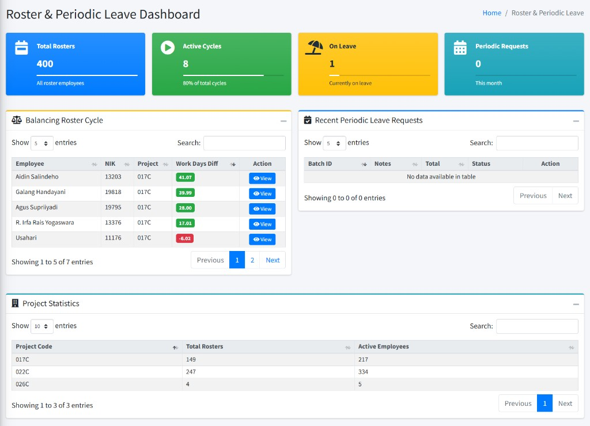
     <em>Gambar 1.1 — Roster &amp; Periodic Leave Dashboard</em>

### Kartu Statistik

Baris paling atas menampilkan empat kartu ringkasan:

- **Total Rosters** — Jumlah seluruh roster aktif yang terdaftar di semua project yang bisa diakses.
- **Active Cycles** — Jumlah siklus yang sedang berjalan saat ini (periode kerja atau cuti), beserta persentasenya terhadap total siklus.
- **On Leave** — Jumlah siklus yang saat ini berada di periode cuti.
- **Periodic Requests** — Jumlah pengajuan cuti periodik yang dibuat pada bulan berjalan, beserta persentase dari total seluruh batch.

### Balancing Roster Cycle

Tabel **Balancing Roster Cycle** menampilkan daftar karyawan yang jadwal kerjanya memerlukan penyesuaian. Kolom yang tersedia:

- **Employee** — Nama lengkap karyawan.
- **NIK** — Nomor Induk Karyawan.
- **Project** — Kode project tempat karyawan bekerja.
- **Work Days Diff** — Selisih hari kerja; badge hijau berarti surplus, badge merah berarti defisit.
- **Action** — Tombol **View** untuk langsung membuka detail roster karyawan bersangkutan.

Contoh tampilan tabel ini ada pada bagian kiri layar di [Gambar 1.1](#gambar-1-1).

### Recent Periodic Leave Requests

Tabel **Recent Periodic Leave Requests** di sisi kanan menampilkan lima batch pengajuan cuti terbaru dengan kolom **Batch ID**, **Notes**, **Total** (jumlah request dalam batch), **Status**, dan **Action** (tombol **View** menuju detail batch). Layout kolom ini terlihat di kanan atas pada [Gambar 1.1](#gambar-1-1).

### Project Statistics

Tabel **Project Statistics** di bagian bawah merangkum kondisi roster per project (lihat bagian bawah [Gambar 1.1](#gambar-1-1)):

- **Project Code** — Kode project.
- **Total Rosters** — Jumlah roster terdaftar di project tersebut.
- **Active Employees** — Jumlah karyawan aktif yang memiliki roster di project tersebut.

---

## 3. Roster Management — Daftar & Siklus Kerja

Halaman **Rosters** adalah pusat pengelolaan jadwal kerja tiap karyawan. Navigasi: **HERO SECTION** → **Roster Management** → **Rosters**.

**Yang perlu dipahami:** Jadwal roster dibuat **per karyawan** dan **per penempatan di satu project** (di aplikasi ini tercatat sebagai satu baris **Administration**: data karyawan + project + posisi + level), sehingga sangat bergantung pada data karyawan yang valid.

Dari penempatan itu aplikasi mengambil informasi berikut:

- **Project** — menentukan **siapa saja** yang muncul ketika Anda memilih project di filter; cuti massal **Periodic Leave** juga mengikuti project bertipe roster.
- **Level** — menentukan **berapa lama kerja dan berapa lama libur/cuti** menurut aturan jabatan, pola yang tertera sebagai **Roster Cycle**. Hitungan seperti **FB Cycle Ratio** dan tanggal kerja/cuti otomatis mengikuti aturan level ini.
- **Position** dan **Department** — untuk menampilkan kolom jabatan/departemen dan untuk mengelompokkan daftar pengajuan di **Periodic Leave Requests**.
- **Cycle** (di kartu **Cycle Management**) — tiap baris adalah **satu giliran kerja–cuti** dalam satu roster yang sama.

### 3.1 Daftar Roster per Project

Halaman diawali dengan kartu **Project Filter** untuk memilih project terlebih dahulu sebelum daftar karyawan muncul.

**Cara menampilkan daftar karyawan:**

1. Pada field **Select Project**, pilih project yang diinginkan. Daftar karyawan akan muncul secara otomatis.
2. Optionally, ketik NIK atau nama di field **Search Employee** lalu klik **Filter** untuk mempersempit hasil.

Di pojok kanan atas kartu **Project Filter** tersedia tombol **Create Periodic Leave**, **Calendar View**, **Export**, dan **Import**. Tombol cuti massal, kalender, dan ekspor baru aktif setelah satu project dipilih; **Import** tetap dapat dibuka kapan saja. Selama belum ada project yang dipilih, kotak **Information** di bawah filter menampilkan pesan **Please select a project to view employees and manage their rosters.**

    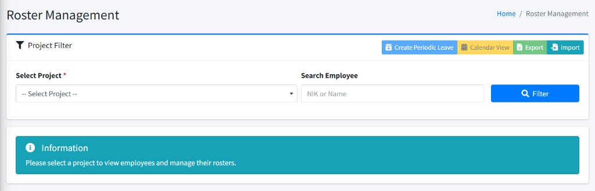
     <em>Gambar 3.1 — Kartu Project Filter pada halaman Rosters</em>

Setelah project dipilih, kartu **Employees** menampilkan tabel dengan kolom berikut:

| Kolom         | Keterangan                                                                                                                         |
| :------------ | :--------------------------------------------------------------------------------------------------------------------------------- |
| **NIK**       | Nomor Induk Karyawan.                                                                                                              |
| **Full Name** | Nama lengkap karyawan.                                                                                                             |
| **Position**  | Nama jabatan.                                                                                                                      |
| **Level**     | Kategori level jabatan (ditampilkan sebagai badge).                                                                                |
| **Pattern**   | Pola siklus roster dari konfigurasi Level (misalnya `2/8`).                                                                        |
| **Cycles**    | Jumlah siklus yang sudah terdaftar dalam roster karyawan tersebut.                                                                 |
| **Status**    | Status siklus aktif saat ini: **Active** (hijau), **On Leave** (kuning), **No Active Cycle** (biru), atau **No Roster** (abu-abu). |
| **Action**    | Tombol aksi sesuai kondisi roster (lihat [bagian 3.2](#section-3-2-create)).                                                       |

Contoh di bawah menampilkan **Project Filter** dengan project yang sudah dipilih, kartu **Employees** beserta jumlah karyawan di badge, serta baris dengan status **No Roster** (tombol **Create**) dan **No Active Cycle** (tombol **View** dan hapus roster).

    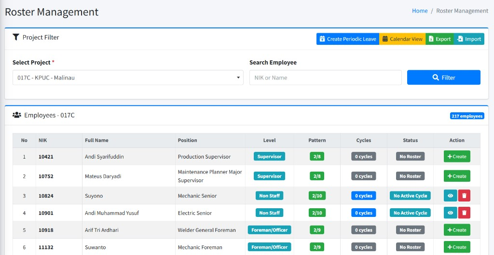
     <em>Gambar 3.2 — Filter project dan daftar karyawan (Employees)</em>

### 3.2 Membuat Roster Baru

Terdapat 2 cara untuk membuat roster, menambah manual masing-masing karyawan dan import excel untuk menambah beberapa karyawan sekaligus. Karyawan yang **belum memiliki roster** dan levelnya sudah dikonfigurasi akan menampilkan tombol **Create** di kolom **Action**.

**Langkah-langkah:**

1. Pada baris karyawan yang belum memiliki roster, klik tombol **Create** (ikon +).
2. Konfirmasi dialog **Create Roster** yang muncul dengan mengklik **Yes, Create**.
3. Sistem akan membuat roster kosong (0 cycles) untuk karyawan tersebut.
4. Kolom **Cycles** berubah menjadi `0 cycles` dan kolom **Action** berganti menampilkan tombol **View** dan **Delete**.

**Catatan:** Jika karyawan belum memiliki konfigurasi roster di Level-nya, kolom **Action** menampilkan badge **Not Available** dan roster tidak dapat dibuat. Cek data karyawan di **Employee Management** → **Employees** untuk melihat level dan project yang dari data tersebut menentukan **Roster Cycle**-nya.

**Menghapus roster:** Klik tombol hapus (ikon tempat sampah merah) pada baris karyawan, lalu konfirmasi dialog **Delete Roster**. Seluruh data siklus akan ikut terhapus.

### 3.3 Detail Roster & Cycle Management

Klik tombol **View** (ikon mata biru) pada baris karyawan untuk membuka halaman detail roster.

#### Informasi Karyawan

Kartu **Employee Information** menampilkan data dasar:

- Kolom kiri: **NIK**, **Full Name**, **Position**, **Department**.
- Kolom kanan: **Project**, **Level**, **Roster Cycle** (pola, misalnya `2/8`), **FB Cycle Ratio** (rasio konversi hari kerja ke hari cuti).

#### Statistik Siklus

Empat kartu statistik di bawahnya menampilkan ringkasan akumulasi:

- **Accumulated Leave** — Total hak cuti yang sudah terakumulasi dari seluruh siklus.
- **Leave Taken** — Total hari cuti yang sudah diambil.
- **Leave Balance** — Sisa saldo cuti.
- **Work Days Difference** — Selisih hari kerja setelah diperhitungkan dengan FB Cycle Ratio; nilai positif berarti surplus kerja, nilai negatif perlu _balancing_.

Judul halaman mengikuti pola **Roster Details - [nama karyawan]**; breadcrumb: **Home / Roster Management / Details**. Pada tangkapan layar berikut, kartu **Employee Information** dan keempat kartu statistik tampil berurutan dari atas ke bawah.

    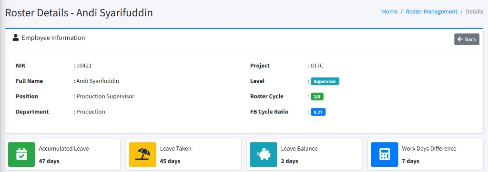
     <em>Gambar 3.4 — Employee Information dan statistik siklus</em>

#### Tabel Cycle Management

Kartu **Cycle Management** menampilkan seluruh siklus dengan kolom:

| Kolom            | Keterangan                                                                                                                         |
| :--------------- | :--------------------------------------------------------------------------------------------------------------------------------- |
| **Cycle**        | Nomor siklus (misalnya `#1`, `#2`).                                                                                                |
| **Work Period**  | Rentang tanggal kerja (format dd/mm/yyyy).                                                                                         |
| **Work Days**    | Jumlah hari kerja aktual pada siklus ini.                                                                                          |
| **Adjusted**     | Nilai penyesuaian; hijau (+), merah (−), abu-abu (0).                                                                              |
| **Leave Period** | Rentang tanggal cuti; tanda `−` jika belum ditetapkan.                                                                             |
| **Leave Days**   | Jumlah hari cuti; tanda `−` jika belum ada Leave Period.                                                                           |
| **Entitlement**  | Hak cuti yang terakumulasi dari siklus ini (desimal).                                                                              |
| **Status**       | Status siklus saat ini, misalnya **Scheduled**, **Active**, **On Leave**, atau **Completed** (ditampilkan sebagai badge berwarna). |
| **Action**       | Tombol **View** (detail), **Edit** (ubah), **Delete** (hapus siklus).                                                              |

Jika karyawan memiliki **Remarks** pada suatu siklus, catatan tersebut ditampilkan di baris abu-abu tepat di bawah baris siklus bersangkutan.

Pada tangkapan layar berikut tampak tombol **Add Cycle** di pojok kanan header kartu, beberapa baris siklus dengan status berbeda (**Completed**, **On Leave**, **Scheduled**), serta contoh baris **Remarks** di bawah siklus pertama.

    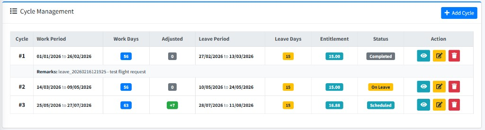
     <em>Gambar 3.5 — Tabel Cycle Management</em>

#### Menambah Siklus Baru

Klik tombol **Add Cycle** di pojok kanan atas kartu **Cycle Management**. Modal pembuka berjudul **Add Cycle Manually** (saat mengubah siklus yang sudah ada, judul modal menjadi **Edit Cycle**).

**Penjelasan singkat — modal Add/Edit Cycle:**

- **Work Period** (kiri):
    - **Start Date** — Tanggal mulai kerja. Jika sudah ada siklus sebelumnya, nilai ini terisi otomatis dari Leave End siklus terakhir + 1 hari (tetap bisa diubah). Teks bantuan: _Auto-set from last cycle if exists_.
    - **End Date** — Dihitung otomatis dari Work Start + Work Days (dari **Level**) + Adjusted Days; field ini hanya baca. Di layar, rumus ditampilkan sebagai _Auto: work_start + [N] days + adjusted_days_ — angka **N** mengikuti konfigurasi level karyawan (contoh cuplikan: 56 hari).
    - **Adjusted Days** — Koreksi hari kerja; positif (+) menambah, negatif (−) mengurangi (teks bantuan menyebut _Positive (+) to add days, Negative (-) to reduce days_).
- **Leave Period** (kanan):
    - **Start Date** — Dihitung otomatis: Work End + 1 hari; hanya baca (_Auto: work_end + 1 day_).
    - **End Date** — Dihitung otomatis dari Leave Start sesuai rumus di layar (_Auto: leave_start + 15 days_); hanya baca.
- **Remarks** — Catatan opsional (_Optional notes..._).

    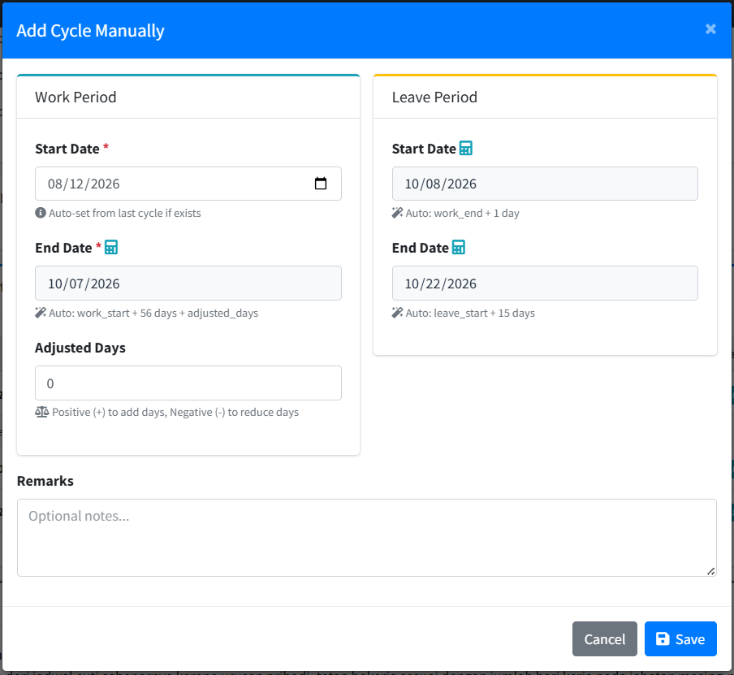
     <em>Gambar 3.6 — Modal Add Cycle Manually</em>

Klik **Save** untuk menyimpan. Halaman akan dimuat ulang dan siklus baru muncul di tabel.

#### Mengedit atau Menghapus Siklus

- **Edit:** Klik tombol edit (ikon pensil kuning). Modal yang sama terbuka dengan data siklus yang ada; ubah **Start Date** atau **Adjusted Days**, lalu klik **Save**.
- **Delete:** Klik tombol hapus (ikon tempat sampah merah), lalu konfirmasi dialog **Delete Cycle**. Siklus akan dihapus permanen.

#### Catatan Kebijakan Perusahaan

Di bagian bawah halaman terdapat kartu **Note** yang memuat kebijakan terkait cuti yang dimundurkan atau dimajukan:

1. Cuti dimundurkan karena kebutuhan perusahaan → karyawan berhak mendapat kompensasi pada cuti berikutnya.
2. Cuti dimundurkan karena keperluan pribadi → tetap bekerja sesuai jumlah hari kerja jabatan.
3. Cuti dimajukan karena keperluan perusahaan → hari kerja berikutnya tetap sesuai ketetapan.
4. Cuti dimajukan karena keperluan pribadi → kekurangan hari kerja ditambahkan ke siklus berikutnya.

---

### 3.4 Ekspor Data Roster

Setelah memilih project di halaman **Rosters**, klik tombol **Export** (hijau) di pojok kanan atas. File Excel akan langsung diunduh berisi data roster untuk project yang dipilih dan bisa digunakan untuk menginput data roster secara massal.

**Catatan:** Tombol **Export** hanya aktif apabila project sudah dipilih. Jika Anda mengisi **Search Employee** (NIK atau nama) lalu klik **Filter**, data yang diekspor mengikuti hasil filter yang sama dengan tabel di layar (bukan seluruh karyawan project).

### 3.5 Impor Data Roster dari Excel

Fitur **Import** memungkinkan pengunggahan data roster secara massal dari file Excel.

**Langkah-langkah (disarankan: ekspor → edit → impor):**

1. **Ekspor template dari project**
    - Buka halaman **Rosters** dan pilih **project** di **Project Filter** (wajib agar tombol **Export** aktif).
    - Klik tombol **Export** (hijau) di pojok kanan atas kartu **Project Filter**.
    - File Excel (`roster-export-YYYY-MM-DD.xlsx`) terunduh berisi daftar karyawan roster project tersebut beserta siklus yang sudah ada (jika ada). Lihat juga **bagian 3.4** di atas.
2. **Edit file Excel**
    - Buka file hasil unduhan di Microsoft Excel atau aplikasi spreadsheet sejenis.
    - **Jangan ubah** baris header (nama kolom) dan urutan kolom.
    - Untuk **menambah siklus baru**: tambahkan baris baru; isi **NIK**, **Cycle No**, **Work Start**, dan **Adjusted Days** (jika perlu). Kolom **Work End**, **Leave Start**, **Leave End**, dan **Status** boleh dikosongkan — sistem menghitungnya otomatis (sama seperti **Add Cycle** di detail roster).
    - Untuk **mengubah siklus yang sudah ada**: cari baris berdasarkan **NIK** + **Cycle No**, lalu ubah **Work Start** dan/atau **Adjusted Days**; kosongkan atau abaikan kolom tanggal cuti dan status agar dihitung ulang saat impor.
    - Kolom **Full Name**, **Position**, dan **Level** hanya informasi; boleh dibiarkan dari hasil ekspor.
    - Simpan file dalam format `.xlsx` atau `.xls`.
3. **Impor file yang sudah diedit**
    - Kembali ke halaman **Rosters**, klik tombol **Import** (biru) di pojok kanan atas kartu **Project Filter**. Modal **Import Roster Data** terbuka.
    - Klik **Select Excel File**, lalu pilih file yang sudah Anda edit (maksimal 10 MB).
    - Klik **Import** untuk memulai proses unggah. Baris dengan **NIK** + **Cycle No** yang sama akan diperbarui; baris baru akan menambah siklus (roster karyawan dibuat otomatis jika belum ada).

**Format kolom Excel yang diterima (sesuai urutan):**

| Kolom         | Wajib | Keterangan                                                                     |
| :------------ | :---: | :----------------------------------------------------------------------------- |
| NIK           |   ✓   | Nomor Induk Karyawan                                                           |
| Full Name     |   —   | Informasional                                                                  |
| Position      |   —   | Informasional                                                                  |
| Level         |   —   | Informasional                                                                  |
| Cycle No      |   ✓   | Nomor siklus                                                                   |
| Work Start    |   ✓   | Tanggal mulai kerja                                                            |
| Work End      |   —   | Dihitung otomatis (Work Start + Work Days level + Adjusted Days); boleh kosong |
| Adjusted Days |   ✓   | Koreksi hari kerja (default 0)                                                 |
| Leave Start   |   —   | Dihitung otomatis (Work End + 1 hari); boleh kosong                            |
| Leave End     |   —   | Dihitung otomatis (Leave Start + 15 hari); boleh kosong                        |
| Remarks       |   —   | Catatan                                                                        |
| Status        |   —   | Ditetapkan otomatis oleh sistem dari tanggal; boleh kosong                     |

Jika ada baris yang gagal divalidasi, sistem menampilkan daftar kesalahan di dalam modal (baris mana dan kolom apa yang bermasalah).

    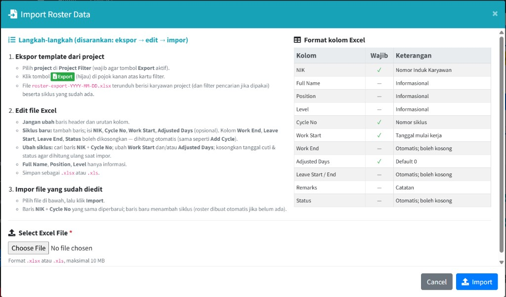
     <em>Gambar 3.7 — Modal impor data roster dari Excel</em>

### 3.6 Calendar View

Tampilan **Calendar View** memperlihatkan status kerja dan cuti seluruh karyawan roster dalam satu project secara visual per hari.

**Cara mengakses:** Dari halaman **Rosters** (setelah memilih project), klik tombol **Calendar View** (kuning). Atau navigasi langsung via URL kalender.

**Filter yang tersedia:**

- **Select Project** — Pilih project (wajib).
- **Month** — Pilih bulan.
- **Year** — Pilih tahun.

Klik **Filter** untuk menampilkan data.

**Legenda warna:**

| Badge                       | Arti                                                |
| :-------------------------- | :-------------------------------------------------- |
| **W** (putih dengan border) | **Work Day** — Karyawan sedang dalam periode kerja. |
| **L** (hijau muda)          | **Leave Day** — Karyawan sedang dalam periode cuti. |
| **−** (abu-abu)             | **Off Day** — Di luar periode kerja/cuti.           |

Nama karyawan pada kolom pertama adalah tautan yang dapat diklik untuk langsung membuka halaman detail roster.

    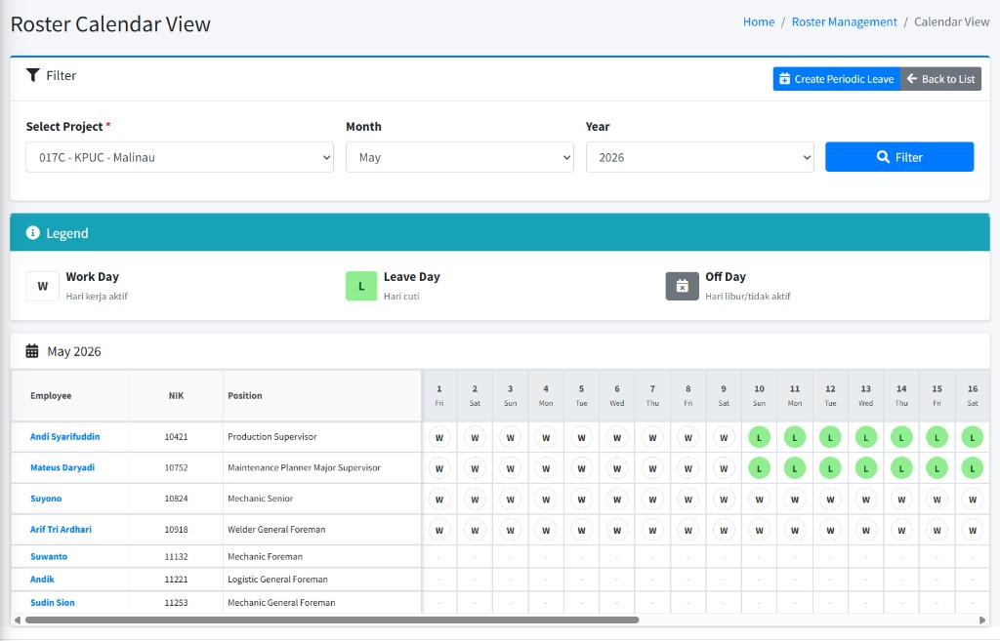
     <em>Gambar 3.8 — Calendar View roster per project</em>

**Catatan:** Kolom **Employee**, **NIK**, dan **Position** bersifat _sticky_ (tetap terlihat saat tabel digulir ke kanan).

---

## 4. Periodic Leave Requests

Menu **Periodic Leave Requests** digunakan untuk mengajukan cuti periodik secara massal bagi karyawan roster yang sudah memasuki atau mendekati masa cuti. Navigasi: **HERO SECTION** → **Roster Management** → **Periodic Leave Requests**.

**Integrasi dengan Leave Management:** Setiap cuti periodik yang berhasil dibuat dari modul ini juga tercatat di menu **Leave Management** → **Requests** sebagai pengajuan cuti **individu per karyawan** (masing-masing dengan nomor register, tanggal cuti, status persetujuan, dan data flight jika ada). Batch di **Periodic Leave Requests** mengelompokkan pengajuan massal; detail dan alur persetujuan per karyawan dapat dilacak dari kedua menu tersebut.

### 4.1 Daftar Batch

Halaman indeks (**Periodic Leave Request Batches**) menampilkan seluruh batch pengajuan cuti periodik yang pernah dibuat. Di pojok kanan atas kartu tersedia tombol **+ Create Periodic Leave Request** (biru).

Jika belum ada batch, halaman menampilkan pesan **No periodic leave requests found** beserta tombol **+ Create Periodic Leave Request** di tengah layar untuk memulai pengajuan pertama (lihat [Gambar 4.1](#gambar-4-1)).

Setelah ada data, tabel batch menampilkan kolom:

- **Batch ID** — Kode unik batch; klik untuk membuka detail.
- **Total Requests** — Jumlah pengajuan cuti dalam batch ini.
- **Notes** — Catatan singkat yang diisi saat pembuatan (jika ada).
- **Created At** — Tanggal dan waktu pembuatan batch.
- **Actions** — Tombol **View** (ikon mata) untuk membuka detail batch.

    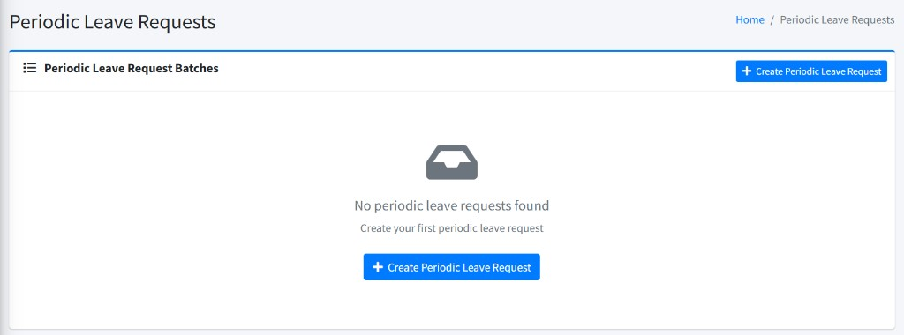
     <em>Gambar 4.1 — Halaman indeks Periodic Leave Requests (belum ada batch)</em>

Akses untuk mengajukan cuti periodik juga tersedia langsung melalui halaman roster.

### 4.2 Membuat Periodic Leave Request

Halaman **Create Periodic Leave Request** terdiri atas beberapa bagian yang harus diisi secara berurutan.

    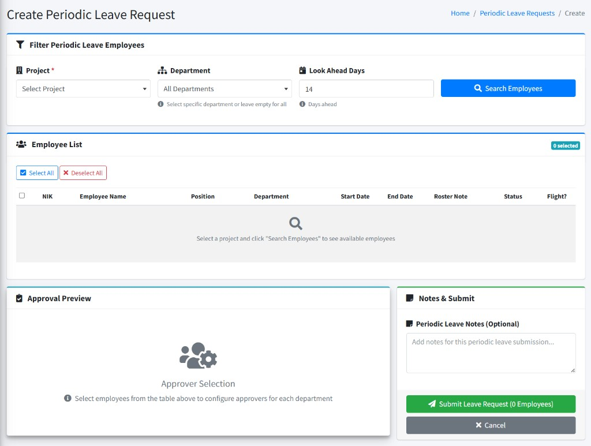
     <em>Gambar 4.2 — Halaman Create Periodic Leave Request (tampilan awal)</em>

#### Langkah-langkah — Filter Karyawan

**1. Filter Periodic Leave Employees**

Isi filter berikut lalu klik **Search Employees**:

- **Project** _(wajib)_ — Pilih project bertipe roster.
- **Department** _(opsional)_ — Biarkan kosong untuk semua departemen, atau pilih departemen tertentu.
- **Look Ahead Days** — Jumlah hari ke depan sebagai rentang pencarian karyawan yang akan memasuki masa cuti (default: 14 hari).

Klik **Search Employees** untuk memuat daftar karyawan.

    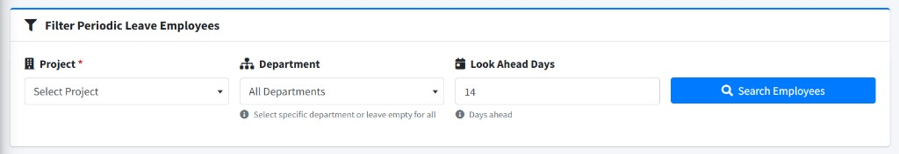
     <em>Gambar 4.3 — Filter pencarian karyawan untuk Periodic Leave</em>

#### Langkah-langkah — Pemilihan Karyawan

**2. Employee List**

Tabel karyawan yang memenuhi kriteria akan muncul dengan kolom:

- **Checkbox** — Centang untuk menyertakan karyawan dalam batch.
- **NIK**, **Employee Name**, **Position**, **Department**.
- **Start Date**, **End Date** — Tanggal leave period yang diusulkan berdasarkan roster.
- **Roster Note** — Catatan khusus dari data roster (jika ada).
- **Status** — Badge **Due** (hijau, sudah saatnya cuti) atau **Upcoming** (kuning, akan segera jatuh tempo).
- **Flight?** — Klik ikon pesawat untuk menambahkan data tiket penerbangan bagi karyawan bersangkutan.

Gunakan tombol **Select All** atau **Deselect All** untuk memilih/membatalkan semua sekaligus. Badge **X selected** di pojok kanan kartu memperlihatkan jumlah karyawan yang dipilih.

    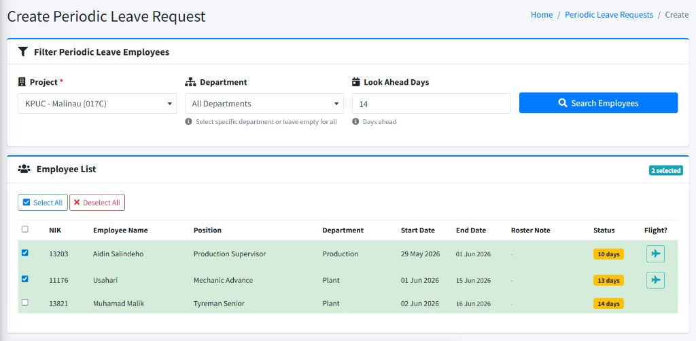
     <em>Gambar 4.4 — Daftar karyawan yang dapat disertakan dalam batch</em>

**Menambah data tiket penerbangan per karyawan (opsional):**

Klik ikon pesawat di kolom **Flight?** pada baris karyawan. Modal **Add Flight Request** terbuka. Centang _Employee needs flight ticket reservation_, lalu isi segmen penerbangan (From, To, Date, Time, Airline). Tambah segmen lebih dari satu jika karyawan memerlukan penerbangan transit dengan klik **Add Flight Segment**. Klik **Save Flight Data** untuk menyimpan. Permintaan tiket pesawat akan masuk ke menu **Flight Management** yang akan diproses oleh HO Balikpapan.

    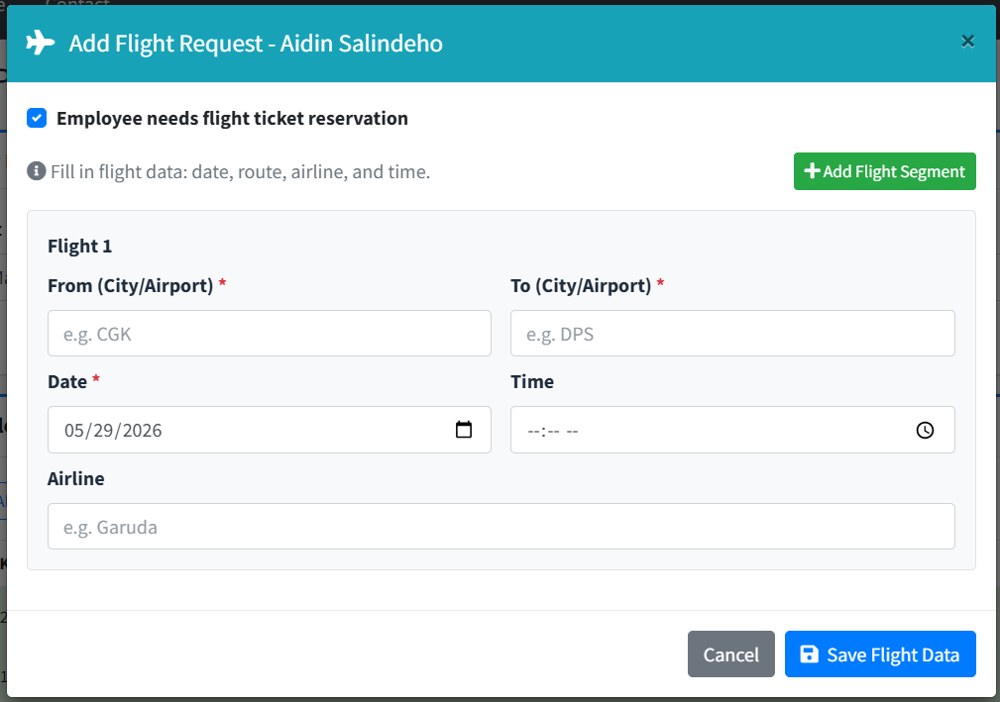
     <em>Gambar 4.5 — Modal Add Flight Request (tiket penerbangan)</em>

#### Langkah-langkah — Approval & Pengiriman

**3. Approval Preview**

Setelah karyawan dipilih, bagian **Approval Preview** memuat alur persetujuan **per departemen** secara otomatis. Pilih approver yang sesuai untuk setiap departemen yang terwakili dalam batch.

**4. Notes & Submit**

- **Periodic Leave Notes** _(opsional)_ — Isi catatan umum untuk seluruh batch ini.
- Klik tombol **Submit Leave Request (N Employees)** untuk mengirim semua pengajuan sekaligus. Nilai N menunjukkan jumlah karyawan yang dipilih.

    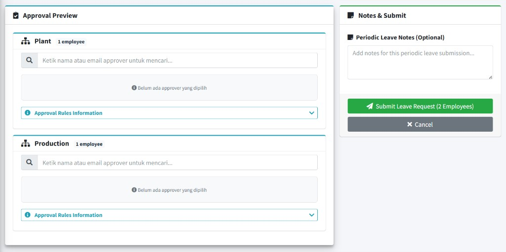
     <em>Gambar 4.6 — Approval Preview dan panel Notes & Submit</em>

**Catatan:** Tombol **Submit** hanya aktif jika setidaknya satu karyawan sudah dipilih dan approver sudah ditentukan untuk setiap departemen yang terlibat.

Setelah **Submit Leave Request** berhasil, cuti yang diajukan per karyawan akan dapat dilihat di **Leave Management** → **Requests** (masing-masing karyawan) serta di halaman detail batch **Periodic Leave Requests** (dikelompokkan per departemen).

### 4.3 Detail Batch

Klik **Batch ID** pada tabel daftar, atau tombol **View**, untuk membuka halaman detail batch.

**Batch Information** (kolom kiri) menampilkan:

- **Batch ID** — Kode unik batch.
- **Total Requests** — Jumlah pengajuan dalam batch.
- **Created At** — Waktu pembuatan.
- **Created By** — Nama pengguna yang membuat batch.
- **Notes** — Catatan batch (jika diisi).

**Batch Actions** (kolom kanan, muncul jika ada request dengan status _Pending_) — Klik **Cancel All Pending Requests** untuk membatalkan semua request yang belum diproses sekaligus.

Di bawah informasi utama, pengajuan dalam batch dikelompokkan berdasarkan **Department**. Tiap tabel departemen memiliki kolom:

- **Register No.** — Nomor register pengajuan cuti.
- **NIK**, **Employee Name**, **Position**, **Project**.
- **Start Date**, **End Date**, **Days** — Rentang dan jumlah hari cuti.
- **Status** — Status masing-masing pengajuan.
- **Flight** — Informasi tiket (jika ada).
- **Action** — Tombol untuk melihat detail pengajuan individual (halaman yang sama dengan membuka baris terkait di **Leave Management** → **Requests**).

    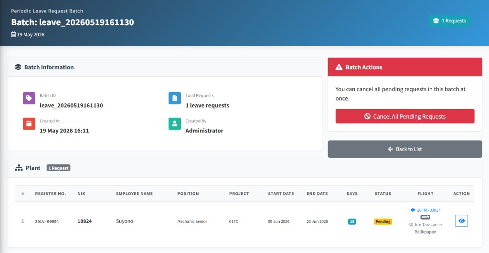
     <em>Gambar 4.7 — Halaman detail batch Periodic Leave Request</em>

---

 
 

## 5. Kesalahan & Bantuan

| Gejala / pesan                                                                          | Kemungkinan penyebab                                                                    | Apa yang bisa dicoba                                                                          |
| :-------------------------------------------------------------------------------------- | :-------------------------------------------------------------------------------------- | :-------------------------------------------------------------------------------------------- |
| Tombol **Create** tidak muncul di kolom Action                                          | Level karyawan belum memiliki konfigurasi roster                                        | Hubungi administrator untuk mengatur konfigurasi Level                                        |
| Tombol **Export** / **Calendar View** / **Create Periodic Leave** tidak aktif (abu-abu) | Project belum dipilih di filter                                                         | Pilih project terlebih dahulu di dropdown **Select Project**                                  |
| Setelah klik **Search Employees**, daftar karyawan kosong                               | Tidak ada karyawan yang jatuh tempo dalam rentang **Look Ahead Days**                   | Tambah nilai **Look Ahead Days** (misalnya 30 atau 60 hari) atau periksa data roster karyawan |
| Import gagal dengan pesan kesalahan per baris                                           | Kolom wajib (NIK, Cycle No, Work Start, Work End) tidak diisi atau format tanggal salah | Periksa file Excel; pastikan format tanggal sesuai (`YYYY-MM-DD`) dan kolom wajib terisi      |
| Tombol **Submit Leave Request** tidak aktif                                             | Belum ada karyawan yang dipilih atau approver belum ditentukan                          | Centang minimal satu karyawan dan pilih approver untuk setiap departemen                      |
| Halaman detail roster menampilkan **Work Days Difference** negatif                      | Siklus belum seimbang (lebih banyak cuti dari yang seharusnya)                          | Tambah **Adjusted Days** positif pada siklus berikutnya untuk menyeimbangkan                  |
| Status karyawan menampilkan **No Roster**                                               | Roster belum dibuat untuk karyawan tersebut                                             | Klik tombol **Create** pada baris karyawan di halaman Rosters                                 |

### Menghubungi administrator

Jika masalah tidak dapat diselesaikan secara mandiri, hubungi administrator sistem dengan menyertakan informasi berikut:

- **Username** yang digunakan saat masalah terjadi.
- **Waktu** terjadinya masalah (tanggal dan jam).
- **Menu yang dibuka** (misalnya: Roster Management → Rosters → Detail Roster #123).
- **NIK karyawan** atau **Batch ID** yang berkaitan (jika relevan).
- **Cuplikan pesan error** yang muncul di layar (jika ada).

---

---

# Overtime Management

Panduan ini menjelaskan modul **Overtime Management** di ARKA HERO: ringkasan dan pengelolaan permintaan lembur untuk **staf HR** (menu grup **Overtime Management** di **HERO SECTION**), serta pengajuan lembur mandiri oleh **semua karyawan** lewat **My Features** → **My Overtime Request**.

**Catatan peran:** Menu **Dashboard**, **Requests**, dan **Reports** hanya tampil jika akun Anda memiliki hak akses pengelolaan lembur (umumnya HR). Menu **My Overtime Request** tersedia untuk karyawan yang berhak mengajukan atau melihat permintaan lembur sendiri.

---

## Glosarium

| **Istilah**             | Arti singkat                                                                                                                 |
| :---------------------- | :--------------------------------------------------------------------------------------------------------------------------- |
| **Overtime Requests**   | Halaman daftar permintaan lembur (HR).                                                                                       |
| **My Overtime Request** | Submenu **My Features** bagi karyawan untuk mengajukan dan memantau lembur sendiri.                                          |
| **Register No.**        | Nomor register permintaan lembur, format **YYOT-xxxxx** (misalnya **26OT-00002**); dibuat otomatis saat permintaan disimpan. |
| **Approver Selection**  | Pemilihan approver manual (biasanya **dua** orang berurutan) sebelum pengajuan.                                              |
| **Close Request**       | Tindakan HR pada permintaan **Approved** untuk menandai selesai (modal **Mark as finished**).                                |
| **Submit for Approval** | Mengajukan draft atau permintaan ditolak ke alur approval.                                                                   |

---

## 1. Ringkasan Menu

| **Menu**                | **Navigasi (sidebar)**                                     | **Uraian**                                                                                                                       |
| :---------------------- | :--------------------------------------------------------- | :------------------------------------------------------------------------------------------------------------------------------- |
| **Dashboard**           | **HERO SECTION** → **Overtime Management** → **Dashboard** | Ringkasan status lembur, tren bulan ini, proyek teratas, lembur mendatang, dan permintaan terbaru.                               |
| **Requests**            | **HERO SECTION** → **Overtime Management** → **Requests**  | Daftar seluruh permintaan lembur (sesuai project yang dapat diakses akun); filter, tambah, ubah, ajukan, tutup.                  |
| **Reports**             | **HERO SECTION** → **Overtime Management** → **Reports**   | Pintu masuk laporan; saat ini **Overtime Request Report** dengan filter dan ekspor Excel.                                        |
| **My Overtime Request** | **My Features** → **My Overtime Request**                  | Self-service karyawan: daftar, buat, ubah, ajukan, dan lihat detail permintaan lembur sendiri atau yang diikuti sebagai peserta. |

---

## 2. Untuk HR — Dashboard

### Langkah-langkah — membuka **Overtime Management Dashboard**

1. **Login** ke ARKA HERO.
2. Di sidebar, buka **HERO SECTION** → **Overtime Management** → **Dashboard**.
3. Judul halaman: **Overtime Management Dashboard**; breadcrumb aktif: **Overtime requests overview**.

    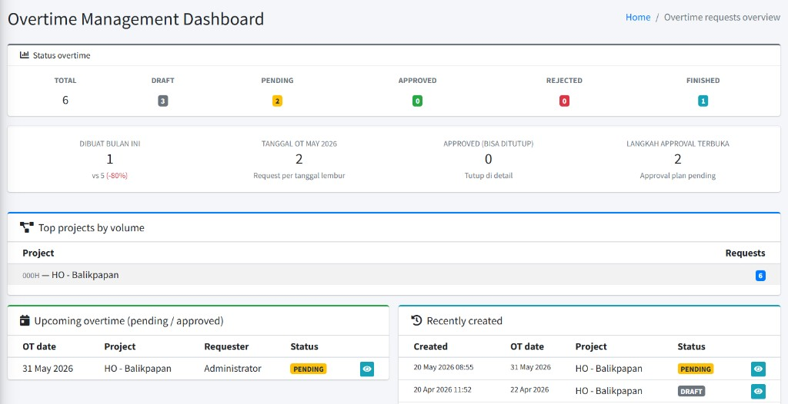
     <em>Gambar 2.1 — Overtime Management Dashboard</em>

### Membaca ringkasan di layar

**Status overtime** — satu baris angka untuk seluruh permintaan lembur di sistem (akses dashboard):

- **Total** — jumlah semua permintaan.
- **Draft** — masih draft.
- **Pending** — menunggu approval.
- **Approved** — disetujui (belum ditutup HR).
- **Rejected** — ditolak.
- **Finished** — sudah ditutup HR.

**Empat metrik di bawahnya:**

- **Dibuat bulan ini** — jumlah permintaan yang dibuat pada bulan berjalan, dibanding bulan sebelumnya (persentase pertumbuhan jika ada).
- **Tanggal OT [bulan tahun]** — jumlah permintaan menurut **tanggal lembur** pada bulan berjalan.
- **Approved (bisa ditutup)** — permintaan berstatus **Approved** yang masih menunggu penutupan HR di detail.
- **Langkah approval terbuka** — jumlah langkah approval plan yang masih **Pending**.

**Top projects by volume** — tabel **Project** (kode — nama) dan jumlah **Requests** per proyek.

**Upcoming overtime (pending / approved)** — lembur dengan tanggal OT mendatang; kolom **OT date**, **Project**, **Requester**, **Status**, ikon **View** ke detail.

**Recently created** — permintaan terbaru; kolom **Created**, **OT date**, **Project**, **Status**, ikon **View**.

**Tombol di bawah halaman:**

- **Open full request list** — ke halaman **Overtime Requests**.
- **Reports** — ke **Overtime Reports**.
- **New request** — ke form **Add Overtime Request** (jika tombol tampil sesuai hak akses).

---

## 3. Untuk HR — Requests

### 3.1 Daftar & filter

### Langkah-langkah — **Overtime Requests** (daftar & filter)

1. **HERO SECTION** → **Overtime Management** → **Requests**.
2. Halaman **Overtime Requests** menampilkan tombol **Add** (ikon plus, jika diizinkan) dan panel **Filter** (klik judul **Filter** untuk membuka).
3. Isi filter sesuai kebutuhan, lalu tabel akan memuat ulang otomatis:
    - **Status** — **- All -**, **Draft**, **Pending**, **Approved**, **Rejected**, **Finished**.
    - **Project** — **- All -** atau satu proyek.
    - **Date from** / **Date to** — rentang tanggal lembur.
    - **Requester** — nama pemohon (cocok sebagian).
    - **Employees** — NIK atau nama karyawan di baris detail.
    - **Remarks** — teks di kolom catatan.
4. Klik **Reset** untuk mengosongkan filter.
5. Tabel kolom: **No**, **Register No.**, **Project**, **Date**, **Status**, **Requester**, **Employees**, **Remarks**, **Actions** (**View**, **Edit**, **Submit**, **Delete** sesuai status dan hak).

    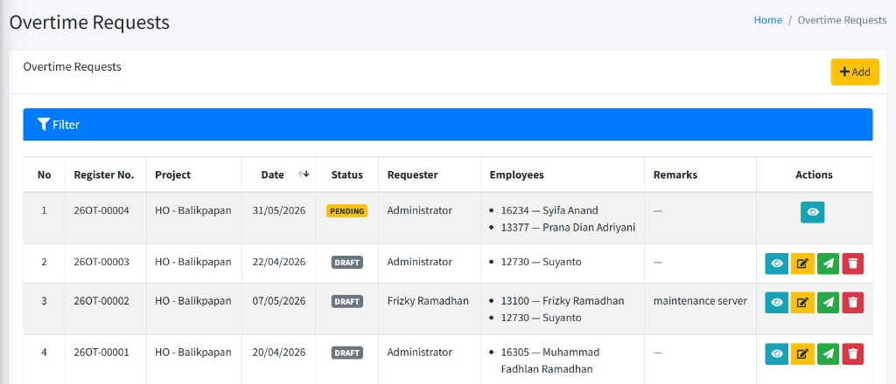
     <em>Gambar 3.1 — Daftar Overtime Requests</em>

**Catatan:** Daftar HR dibatasi ke **project yang ter-assign** pada akun Anda (sama seperti modul HR lain di ARKA HERO).

---

### 3.2 Membuat & mengubah permintaan

### Langkah-langkah — **Add Overtime Request** / **Edit Overtime Request**

1. Dari daftar, klik **Add**, atau buka **Edit** dari baris draft/ditolak yang boleh diubah.
2. Breadcrumb: **Home** → **Overtime Requests** → **Add New** (atau judul edit dengan nomor register).

**Overtime Information**

- **Project** — wajib; pilih dari dropdown (format kode — nama proyek).
- **Overtime date** — tanggal lembur (wajib).
- **Remarks (optional)** — catatan hingga 2000 karakter.

**Employee Details**

- Minimal **satu baris** karyawan.
- **Employee (NIK - Name)** — setelah **Project** dipilih, dropdown terisi karyawan administrasi di proyek tersebut; jika proyek belum dipilih, tampil **— Select project first —**.
- **IN** / **OUT** — jam mulai dan selesai (format waktu).
- **Work description** — deskripsi pekerjaan (placeholder **Description**).
- **Add Row** — tambah baris; ikon hapus di kolom **Action** (minimal satu baris harus tetap ada).

**Approver Selection** (panel kanan)

- Cari approver lewat kotak pencarian (nama atau email).
- Pilih approver sesuai **Approval Rules Information** (buka panel lipat di layar):
    - **Approval pertama:** setara **Department Head / Manager**
    - **Approval kedua:** setara **Project Manager / Direktur**
    - Pilih **tepat dua** approver berurutan (sequential)
- Jika approver tidak ada di daftar, hubungi **HR** (sesuai catatan di panel).

**Tombol simpan**

- **Save as Draft** — simpan status **Draft**.
- **Save & Submit** — simpan dan langsung ajukan (**Pending**).
- **Cancel** — kembali ke daftar tanpa menyimpan.

    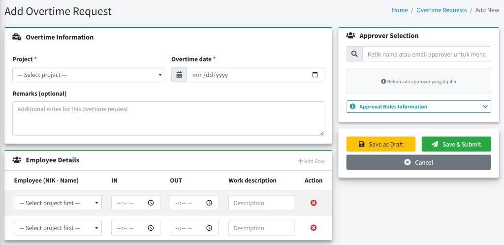
     <em>Gambar 3.2 — Form Add Overtime Request (HR)</em>

---

### 3.3 Detail, pengajuan, dan penutupan HR

### Langkah-langkah — detail permintaan lembur (HR)

1. Dari daftar, klik ikon **View** di kolom **Actions**.
2. Header: **OVERTIME REQUEST**, **Register No.** (mis. **26OT-00001**), nama **Project**, tanggal lembur, badge status (**DRAFT**, **PENDING**, **APPROVED**, dll.).

**Overtime Information** — **Project**, **Overtime date**, **Created by**, **Created at**, **Remarks**.

**Employee Details** — tabel **No**, **Name**, **NIK**, **Time in**, **Time out**, **Description**.

**Approval Status** — jika sudah ada approver / rencana approval, tampil status tiap langkah (**Pending**, **Approved**, **Rejected**, dll.).

**Panel Actions** (kanan):

- **Back to list** — kembali ke **Overtime Requests**.
- **Edit** — jika status masih **Draft**.
- **Submit for Approval** — untuk **Draft** atau **Rejected** (konfirmasi di layar).
- **Delete** — hapus permintaan yang masih boleh dihapus.
- **Close Request** — hanya pada status **Approved** dan jika Anda berhak menutup lembur.

    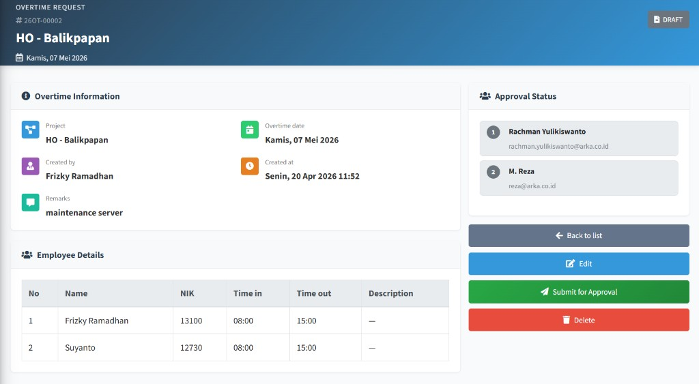
     <em>Gambar 3.3 — Detail permintaan lembur (HR, contoh Draft)</em>

### Langkah-langkah — menutup permintaan (**Close Request**)

1. Pada detail berstatus **Approved**, klik **Close Request**.
2. Modal **Mark as finished** terbuka.
3. Isi **Remarks (optional)** untuk catatan penutupan HR (opsional, maks. 1000 karakter).
4. Klik **Save** (atau **Cancel** untuk membatalkan).
5. Status berubah menjadi **Finished**; bagian **HR completion** menampilkan **Finished at**, **By**, dan **Remarks** penutupan.

    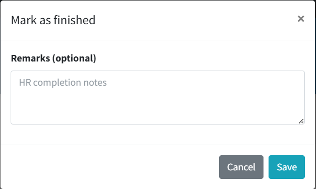
     <em>Gambar 3.4 — Modal Mark as finished</em>

**Alur status (ringkas):** **Draft** → (**Submit for Approval** / **Save & Submit**) → **Pending** → **Approved** atau **Rejected** → (**Close Request** setelah lembur selesai) → **Finished**.

---

## 4. Untuk HR — Reports

### 4.1 Halaman Reports

### Langkah-langkah — **Overtime Reports**

1. **HERO SECTION** → **Overtime Management** → **Reports**.
2. Judul halaman: **Overtime analytics & reports**; breadcrumb **Home** / **Overtime Reports**. Kartu **Overtime Request Report** menjelaskan isi laporan (register **YYOT-xxxxx**, proyek, tanggal lembur, status, pemohon, daftar karyawan di detail, remarks) serta fitur filter dan **Tampilkan data** / ekspor Excel.
3. Klik **View Report** untuk membuka laporan detail.

    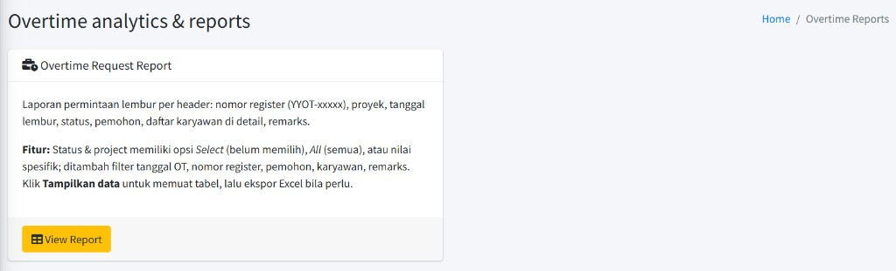
     <em>Gambar 4.1 — Halaman Overtime analytics &amp; reports</em>

---

### 4.2 Overtime Request Report (monitoring)

### Langkah-langkah — **Report Overtime Requests**

1. Dari **Overtime Reports**, buka **View Report** (breadcrumb: **Reports** → **Overtime Requests**).
2. Panel **Filter Options**:
    - **Status** — **Select status**, **All status**, atau nilai spesifik (**Draft** … **Finished**).
    - **Project** — **Select project**, **All projects**, atau satu proyek.
    - **OT date from** / **OT date to**
    - **Register No.** — contoh placeholder **e.g. 26OT-**
    - **Requester**, **Employees**, **Remarks** — filter teks seperti di daftar HR.
3. Klik **Tampilkan data** — wajib mengisi minimal satu filter (misalnya pilih **All status** atau **All projects**, atau tanggal / teks lain). Jika belum, sistem memperingatkan untuk memilih filter terlebih dahulu.
4. Tabel **Report Data** kolom: **No**, **Register No.**, **Project**, **OT date**, **Status**, **Requester**, **Employees**, **Remarks**, **Requested at**, **Action** (ikon lihat detail).
5. **Reset** — muat ulang halaman filter kosong.
6. **Export to Excel** — unduh Excel dengan filter yang sama (minimal satu filter harus aktif).

    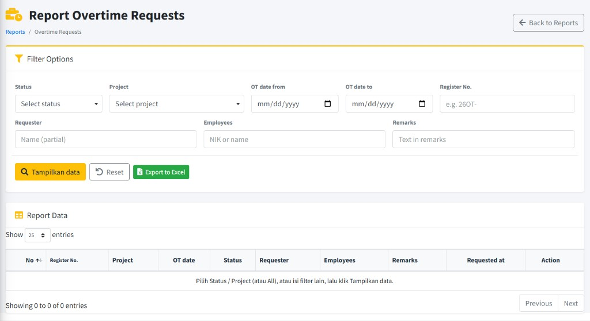
     <em>Gambar 4.2 — Report Overtime Requests (filter &amp; tabel)</em>

**Catatan:** Pesan kosong pada tabel mengingatkan: _Pilih Status / Project (atau All), atau isi filter lain, lalu klik Tampilkan data._

---

## 5. Untuk karyawan — My Overtime Request

Bagian ini untuk **semua karyawan** yang mengajukan lembur sendiri. Ringkasan aktivitas lembur juga tersedia di **My Dashboard** (kartu **Overtime** dan **Recent Overtime Requests**); lihat panduan **My Dashboard & My Features** untuk widget dashboard.

**Navigasi:** **My Features** → **My Overtime Request**

**Catatan:** Halaman menampilkan permintaan yang **Anda buat** dan permintaan yang **Anda ikuti sebagai peserta** di baris **Employee details** (misalnya ditambahkan HR/atasan).

---

### Langkah-langkah — Daftar & filter

Dari sidebar **My Features**, buka **My Overtime Request**. Halaman **My Overtime Requests** menampilkan breadcrumb **Home** / **My Dashboard** / **My Overtime Requests**, tombol **Add**, panel **Filter** (**Status**, **Project**, **Date from**, **Date to**, **Employees**, **Remarks**), dan tabel kolom **No**, **Register No.**, **Project**, **Date**, **Status**, **Employees**, **Remarks**, **Actions**.

    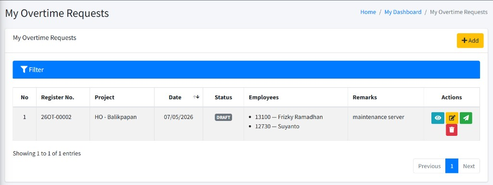
     <em>Gambar 5.1 — Daftar My Overtime Requests</em>

---

### Langkah-langkah — Membuat permintaan lembur baru

1. Klik **Add** — judul form **Add overtime request**.
2. Kartu **Overtime information**:
    - **Project** — wajib.
    - **Overtime date** — wajib.
    - **Remarks** — opsional.
3. Kartu **Employee details**:
    - **Employee (NIK — Name)** — setelah proyek dipilih.
    - **IN**, **OUT**, **Work description**.
    - Tombol **Row** (ikon plus) menambah baris; ikon **×** di **Action** menghapus baris (minimal satu baris).
4. **Approver Selection** — pilih dua approver sesuai **Approval Rules Information** (sama seperti bagian HR di atas).
5. **Save draft** — simpan **Draft**; **Submit** — ajukan langsung (**Pending**); **Cancel** — batalkan.

    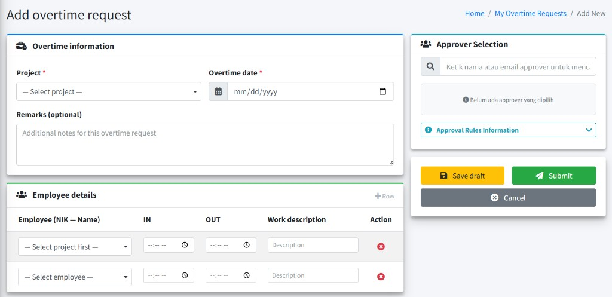
     <em>Gambar 5.2 — Add overtime request (karyawan)</em>

---

### Detail permintaan lembur (karyawan)

Klik ikon **View** di kolom **Actions**.

Halaman detail: header **OVERTIME REQUEST**, **Register No.**, **Project**, tanggal, badge status. **Overtime Information** (**Project**, **Created by**, **Remarks**, **Overtime date**, **Created at**). **Employee Details** (**Name**, **NIK**, **Time in**, **Time out**, **Description**).

    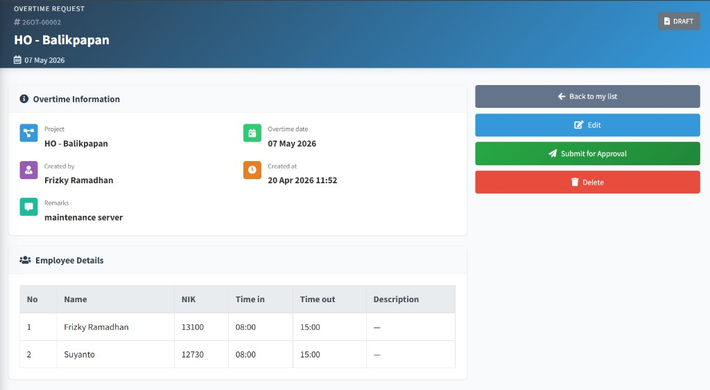
     <em>Gambar 5.3 — Detail permintaan lembur (Draft)</em>

**Jika masih Draft**, panel **Actions** biasanya menampilkan:

- **Back to my list**
- **Edit** — form **Edit overtime request #[Register No.]**
- **Submit for Approval** — ajukan dari detail (konfirmasi)
- **Delete** — hapus permanen (konfirmasi)

Setelah **Pending** / **Approved**, tombol mengikuti status dan hak akses Anda (karyawan umumnya tidak melihat **Close Request**; penutupan dilakukan HR).

---

## 6. Kesalahan & bantuan

| **Gejala / pesan (contoh)**                                         | **Kemungkinan penyebab**                                                  | **Apa yang bisa dicoba**                                                                                     |
| :------------------------------------------------------------------ | :------------------------------------------------------------------------ | :----------------------------------------------------------------------------------------------------------- |
| Menu **Overtime Management** tidak terlihat                         | Akun tanpa hak HR lembur                                                  | Gunakan **My Overtime Request** jika tersedia; hubungi HR untuk hak akses                                    |
| Dropdown karyawan kosong / **— Select project first —**             | **Project** belum dipilih atau tidak ada karyawan di proyek               | Pilih **Project** yang benar; pastikan data administrasi karyawan–proyek sudah ada                           |
| **At least one line is required.** saat menghapus baris             | Hanya tersisa satu baris di **Employee Details**                          | Biarkan minimal satu baris karyawan                                                                          |
| Tidak bisa **Submit** / **Save & Submit**                           | Approver belum dipilih atau kurang dari dua                               | Lengkapi **Approver Selection** sesuai **Approval Rules Information**                                        |
| Laporan: _Pilih Status (atau All status)… lalu klik Tampilkan data_ | Belum ada filter yang dianggap aktif                                      | Pilih **All status** atau **All projects**, atau isi tanggal / register / teks lain, lalu **Tampilkan data** |
| **Export to Excel** tidak mengunduh                                 | Filter belum diisi                                                        | Sama seperti memuat tabel — isi filter lalu ekspor                                                           |
| **Close Request** tidak muncul                                      | Status bukan **Approved** atau bukan akun HR penutup                      | Tunggu approval selesai; pastikan lembur sudah disetujui                                                     |
| Permintaan tidak muncul di daftar HR                                | Di luar project yang di-assign akun HR                                    | Gunakan akun/filter proyek yang sesuai; cek assignment project                                               |
| **Edit** / **Delete** tidak tampil                                  | Status sudah **Pending** / **Approved** / **Finished** atau bukan pembuat | Hanya draft (dan rejected jika diizinkan) yang dapat diubah pemohon                                          |

### Menghubungi administrator

Sampaikan kepada administrator atau HR:

- **Username** (bukan password)
- **Waktu** kejadian
- **Menu** yang dibuka (mis. **Overtime Requests** atau **My Overtime Request**)
- **Register No.** permintaan (mis. **26OT-00012**) bila ada
- **NIK** Anda jika masalah terkait baris karyawan
- **Cuplikan pesan** di layar

---

---

# Flight Management

Panduan ini menjelaskan modul **Flight Management** di ARKA HERO: pengelolaan permintaan tiket penerbangan (**Flight Request Form / FRF**) untuk **staf HR** (menu grup **Flight Management** di **GAMMA SECTION**), serta pengajuan mandiri oleh **karyawan** lewat **My Features** → **My Flight Request**.

**Catatan peran:** Menu **Dashboard**, **Requests**, **Issuances**, dan **Reports** hanya tampil jika akun Anda memiliki hak akses modul penerbangan. **My Flight Request** tersedia bagi karyawan yang berhak mengajukan atau memantau permintaan tiket sendiri.

---

## Glosarium

| **Istilah**                  | Arti singkat                                                                                             |
| :--------------------------- | :------------------------------------------------------------------------------------------------------- |
| **Flight Request (FRF)**     | Formulir permintaan tiket penerbangan; nomor formulir format **YYFRF-xxxxx** (misalnya **26FRF-00001**). |
| **Request Type**             | Jenis sumber permintaan: **Standalone**, **Leave Based**, atau **Travel Based**.                         |
| **Standalone**               | Tiket tidak terikat cuti atau LOT; pemohon dan pengikut (jika ada) diisi pada formulir FRF.              |
| **Leave Based**              | Tiket mengacu pada pengajuan cuti yang sudah ada.                                                        |
| **Travel Based**             | Tiket mengacu pada **Official Travel (LOT)**; data pemohon dan **Followers** mengikuti LOT.              |
| **Followers**                | Karyawan atau penumpang pendamping yang ikut dalam perjalanan (bukan pemohon utama).                     |
| **Letter of Guarantee (LG)** | Surat jaminan tiket yang diterbitkan HR setelah FRF disetujui; dikelola di menu **Issuances**.           |
| **Business Partner**         | Vendor atau mitra bisnis penerbit tiket; dipilih pada LG dan muncul di grafik dashboard.                 |
| **Issued Number**            | Nomor unik LG (misalnya **FR0001/ARKA/LG/I/2026**); terisi otomatis setelah **Letter Number** dipilih.   |
| **Approver Selection**       | Pemilihan approver manual sebelum pengajuan FRF atau penerbitan LG.                                      |

---

## 1. Ringkasan Menu

| **Menu**              | **Navigasi (sidebar)**                                    | **Uraian**                                                 |
| :-------------------- | :-------------------------------------------------------- | :--------------------------------------------------------- |
| **Dashboard**         | **GAMMA SECTION** → **Flight Management** → **Dashboard** | Ringkasan permintaan tiket, status, dan aktivitas terkini. |
| **Requests**          | **GAMMA SECTION** → **Flight Management** → **Requests**  | Daftar seluruh FRF; buat, ubah, ajukan, batalkan, cetak.   |
| **Issuances**         | **GAMMA SECTION** → **Flight Management** → **Issuances** | Penerbitan LG dan detail tiket setelah persetujuan.        |
| **Reports**           | **GAMMA SECTION** → **Flight Management** → **Reports**   | Laporan permintaan tiket (sesuai hak akses).               |
| **My Flight Request** | **My Features** → **My Flight Request**                   | Self-service karyawan: daftar dan pengajuan FRF sendiri.   |

---

## 2. Untuk HR — **Flight Management Dashboard**

Halaman **Flight Management Dashboard** (_Flight Requests & Letter of Guarantee Overview_) memberi gambaran cepat volume FRF, LG, distribusi vendor, serta daftar aktivitas terbaru sebelum Anda membuka menu **Requests** atau **Issuances**.

### Langkah-langkah — membuka **Flight Management Dashboard**

1. **Login** ke ARKA HERO.
2. Buka **GAMMA SECTION** → **Flight Management** → **Dashboard**.
3. Baca ringkasan di layar:

**Bagian atas**

- **Total LG by Business Partner** — diagram pie jumlah LG per **Business Partner** (vendor tiket). Jika belum ada data, tampil pesan **Data not available**.
- **Flight Request, Issuance, and Vendor Statistic** — panel akordion tiga blok (klik judul untuk membuka/menutup):
    - **Flight Request** — hitungan **Total**, **Pending** (gabungan **Draft** + **Submitted**), **Approved**, **Issued**, **Completed**, dan **This Month** (FRF yang dibuat pada bulan berjalan).
    - **Letter of Guarantee (LG)** — hitungan **Total**, **Pending**, **Approved**, dan **This Month** (LG yang dibuat pada bulan berjalan).
    - **Total LG per Vendor** — daftar kode/nama **Business Partner** beserta jumlah LG; jika kosong, tampil **Belum ada data vendor**.

**Bagian tengah**

- **Recent Flight Requests** — tabel hingga delapan FRF terbaru: **FR Number**, **Employee**, **Status** (badge), **Created**, **Action** (ikon **View**). **View All** membuka menu **Requests**.
- **Recent Issuances (LG)** — tabel hingga delapan LG terbaru: **Issued Number**, **Business Partner**, **Status**, **Created**, **Action** (ikon **View**). **View All** membuka menu **Issuances**.

**Bagian bawah — Quick Actions**

- **Flight Requests** — pintasan ke daftar FRF.
- **Issuances (LG)** — pintasan ke daftar LG.
- **Create Letter of Guarantee** — pintasan langsung ke halaman pilih FRF untuk membuat LG (jika tombol tampil dan Anda berhak membuat LG).

    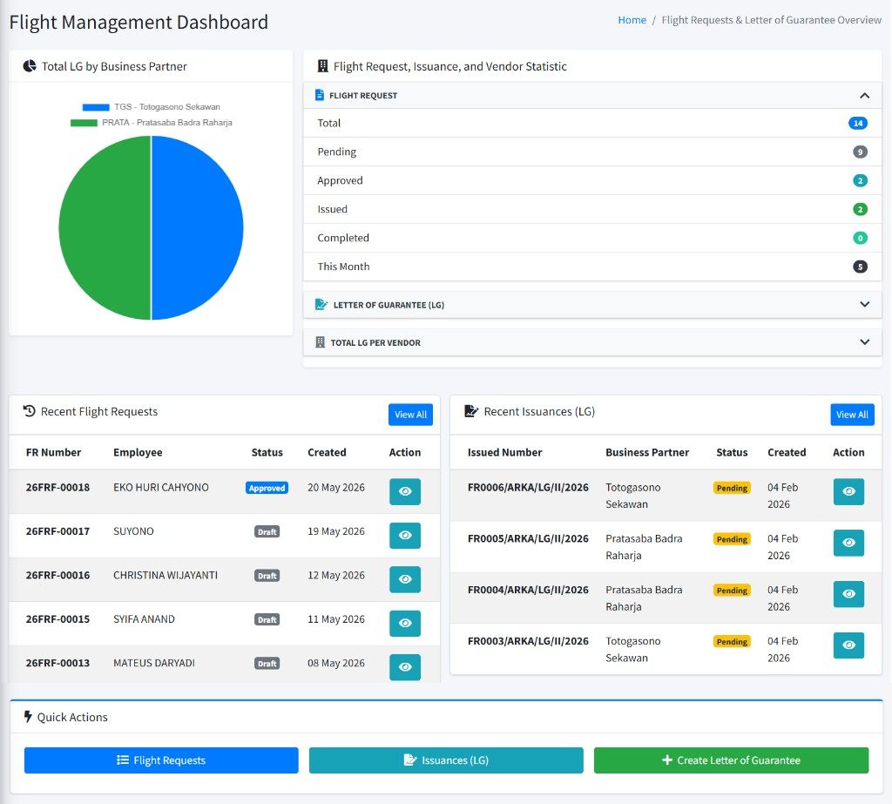
 <em>Gambar 2.1 — Flight Management Dashboard (ringkasan FRF, LG, dan aktivitas terbaru)</em>

**Catatan:**

- Angka pada dashboard mencakup **seluruh** FRF dan LG dalam sistem (bukan hanya milik satu project), kecuali dinyatakan lain di kebijakan internal.
- **Pending** pada **Flight Request** = status **Draft** + **Submitted**; **Pending** pada LG = status persetujuan LG yang masih menunggu.
- Tombol pada **Quick Actions** dan tautan **View All** hanya tampil sesuai **hak akses** akun Anda.

---

## 3. Untuk HR — **Requests** (membuat FRF)

### Langkah-langkah — membuka daftar **Flight Requests**

1. **Login** ke ARKA HERO.
2. Buka **GAMMA SECTION** → **Flight Management** → **Requests**.
3. Buka panel **Filter** (bilah biru dengan ikon corong) untuk menyaring data; tabel menampilkan **No**, **Form Number**, **Employee Name**, **NIK**, **Request Type**, **Purpose**, **Status**, **Requested At**, dan **Actions** (ikon **View**).
4. Untuk membuat FRF baru, klik **Add** di pojok kanan atas kartu daftar.

    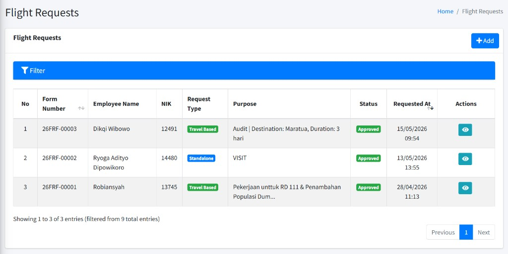
 <em>Gambar 3.1 — Daftar Flight Requests (HR)</em>

### Langkah-langkah — **Create Flight Request** (alur umum)

1. Klik **Add** pada halaman daftar (atau pintasan dari dashboard jika tersedia).
2. Pada kartu **Request Information**, pilih **Select Request Type**, lalu ikuti langkah khusus per tipe:
    - **Leave Request (Cuti)** → [bagian Leave Based](#langkah-langkah--leave-request-cuti-leave-based) di bawah.
    - **Official Travel (LOT)** → [bagian Travel Based](#langkah-langkah--official-travel-lot-travel-based) di bawah.
    - **Standalone** → [bagian Standalone dengan Followers](#langkah-langkah--standalone-dengan-followers) di bawah.
3. Setelah data pemohon terisi, lengkapi **Flight Details** — **Add Flight Segment** untuk setiap segmen (**Departure City**, **Arrival City**, **Flight Date** wajib; **Flight Time (ETD)** dan **Airline** opsional).
4. Isi **Notes** (opsional) pada panel kanan dan **Approver Selection** (wajib saat mengajukan).
5. Klik **Create Flight Request** / **Submit** / **Save as Draft** sesuai tombol yang tampil.

Di daftar FRF, tipe ditampilkan sebagai badge **Leave Based**, **Travel Based**, atau **Standalone**.

---

### Langkah-langkah — **Leave Request (Cuti)** (Leave Based)

FRF **Leave Based** mengacu pada pengajuan cuti yang **sudah tercatat** di modul **Leave Management**. HR membuat atau melengkapi permintaan tiket untuk karyawan yang cutinya sudah ada.

1. Klik **Add** dari daftar **Flight Requests**.
2. Pada **Select Request Type**, pilih **Leave Request (Cuti)**.
3. Field **Select Leave Request** muncul — pilih baris cuti yang benar (biasanya memuat nomor register cuti, nama karyawan, dan rentang tanggal). Daftar diisi dari pengajuan cuti yang memenuhi syarat di sistem.
4. Setelah cuti dipilih, kartu **Employee Information** tampil dan terisi otomatis dari data cuti terpilih (**NAME**, **NIK**, **POSITION**, **DEPT/DIVISION**, **POH**, **DOH**, **PROJECT NUMBER**, **PHONE NUMBER**, **PURPOSE OF TRAVEL**, **TOTAL TRAVEL DAYS**). Periksa dan sesuaikan **Purpose of Travel** bila perlu.
5. Kartu **Followers** untuk input manual **tidak** digunakan pada tipe ini.
6. Lengkapi **Flight Details** — **Add Flight Segment** untuk setiap rute penerbangan.
7. Isi **Notes** (opsional) dan **Approver Selection**, lalu klik **Save as Draft**, **Save & Submit**, atau **Cancel** sesuai kebutuhan.

    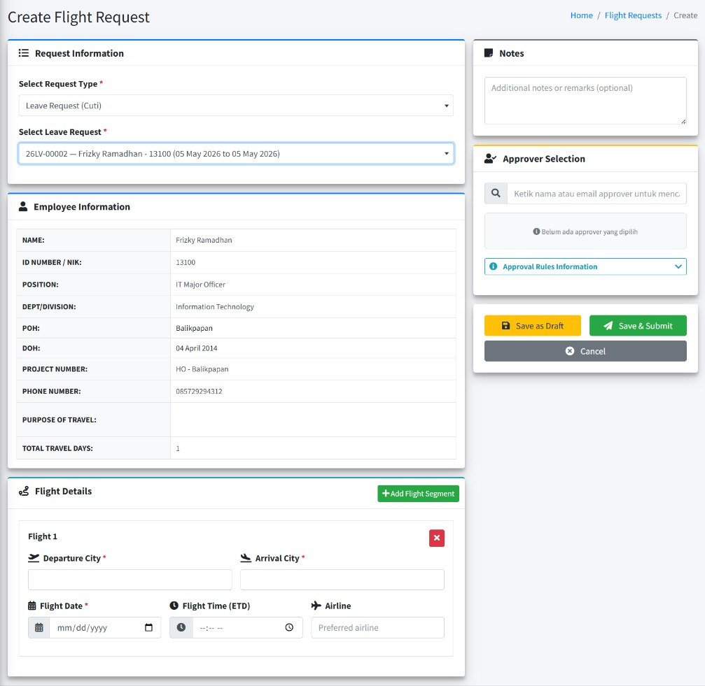
 <em>Gambar 3.2 — Create FRF Leave Based (terikat pengajuan cuti)</em>

**Catatan:**

- Jika daftar **Select Leave Request** kosong, pastikan pengajuan cuti karyawan sudah ada dan memenuhi syarat di **Leave Management** (lihat panduan `11-leave-management.md`).
- FRF ini **bukan** pengganti formulir cuti; cuti tetap diproses di modul cuti, sedangkan FRF hanya mencatat kebutuhan tiket.

---

### Langkah-langkah — **Official Travel (LOT)** (Travel Based)

FRF **Travel Based** mengacu pada **Letter of Travel (LOT)** yang sudah tercatat di modul **Official Travel Management**. Data pemohon utama dan daftar **Followers** mengikuti LOT yang dipilih.

1. Klik **Add** dari daftar **Flight Requests**.
2. Pada **Select Request Type**, pilih **Official Travel (LOT)**.
3. Field **Select Official Travel** muncul — pilih LOT yang benar (biasanya memuat nomor surat/LOT, nama traveler, dan ringkasan perjalanan).
4. Setelah LOT dipilih, kartu **Employee Information** terisi otomatis dari data traveler LOT (**NAME**, **NIK**, jabatan, departemen, proyek, **Purpose of Travel**, **Total Travel Days**, dll.).
5. Kartu **Followers** tampil sebagai **baca saja** — daftar pengikut diambil dari detail LOT (nama, jabatan, departemen, proyek). **Tidak dapat** menambah, mengubah, atau menghapus pengikut di halaman FRF. Jika daftar salah, perbaiki pada pengajuan **Official Travel (LOT)** (lihat panduan `10-official-travel.md`).
6. Lengkapi **Flight Details** — **Add Flight Segment** sesuai rute tiket yang dibutuhkan.
7. Isi **Notes** (opsional) dan **Approver Selection**, lalu klik **Save as Draft**, **Save & Submit**, atau **Cancel** sesuai kebutuhan.

    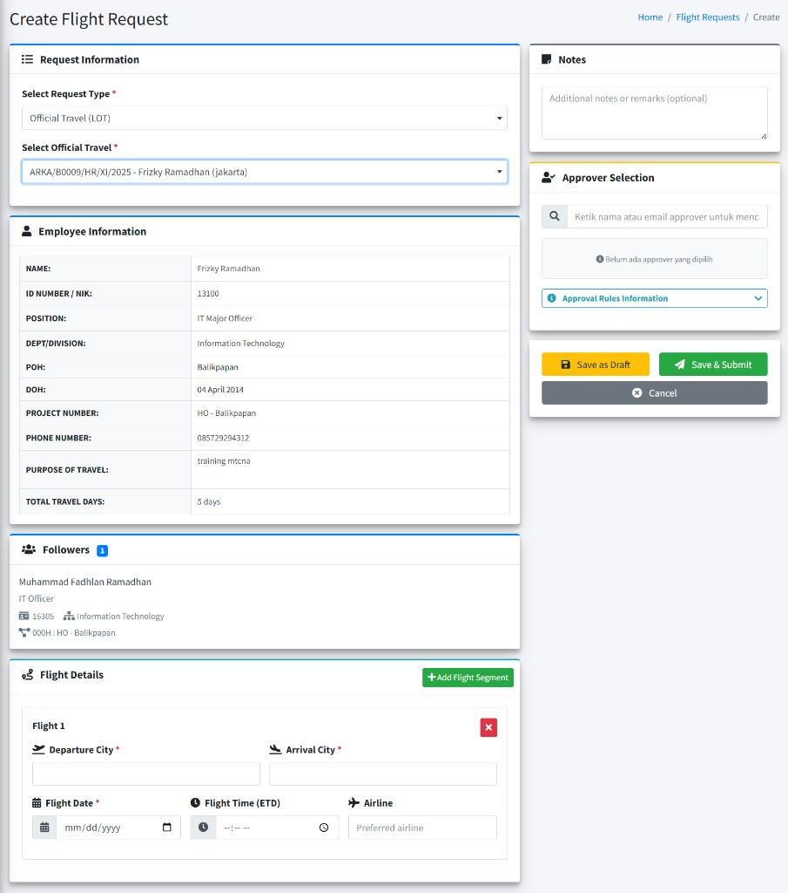
 <em>Gambar 3.3 — Create FRF Travel Based (terikat LOT, Followers dari LOT)</em>

**Catatan:**

- Badge di daftar: **Travel Based**.
- Pengikut yang ikut terbang tetapi tidak tercatat di LOT tidak otomatis masuk FRF — perbarui LOT terlebih dahulu atau buat FRF **Standalone** terpisah sesuai kebijakan HR.

---

### Langkah-langkah — **Standalone** dengan **Followers**

Pada tipe **Standalone**, HR atau karyawan dapat menambahkan **pengikut** yang ikut naik pesawat. Pengikut **hanya** untuk **Standalone**; pada **Travel Based**, daftar mengikuti LOT.

**Data pemohon utama**

1. Pilih **Standalone** di **Select Request Type**.
2. Field **Select Employee** muncul — pilih karyawan dari dropdown (format **Nama (NIK)**). Setelah dipilih, kartu **Employee Information** tampil dengan data terisi otomatis (**NAME**, **NIK**, **POSITION**, **DEPT/DIVISION**, **POH**, **DOH**, **PROJECT NUMBER**, **PHONE NUMBER**). Lengkapi **PURPOSE OF TRAVEL** (wajib) dan **TOTAL TRAVEL DAYS** bila diperlukan.

    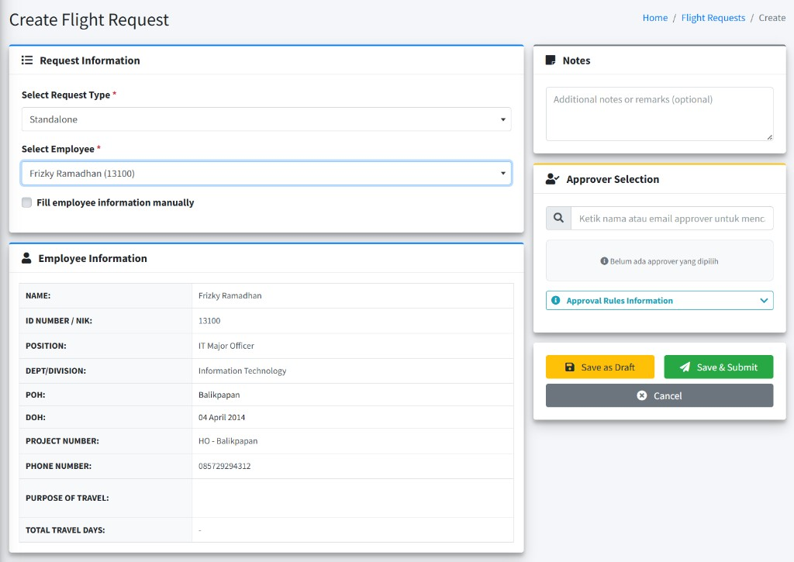
 <em>Gambar 3.4 — Standalone: pilih karyawan di Select Employee (data pemohon utama)</em>

**Atau isian manual pemohon**

3. Centang **Fill employee information manually** pada kartu **Request Information**. Dropdown **Select Employee** tidak dipakai; kartu **Employee Information** tampil dengan field kosong siap diisi.
4. Ketik **NAME**, **ID NUMBER / NIK**, **POSITION**, **DEPT/DIVISION**, **PROJECT NUMBER**, **PHONE NUMBER**, **PURPOSE OF TRAVEL** (wajib), dan **TOTAL TRAVEL DAYS** pada tabel **Employee Information**. Field **POH** dan **DOH** umumnya tetap **—** pada mode manual.

    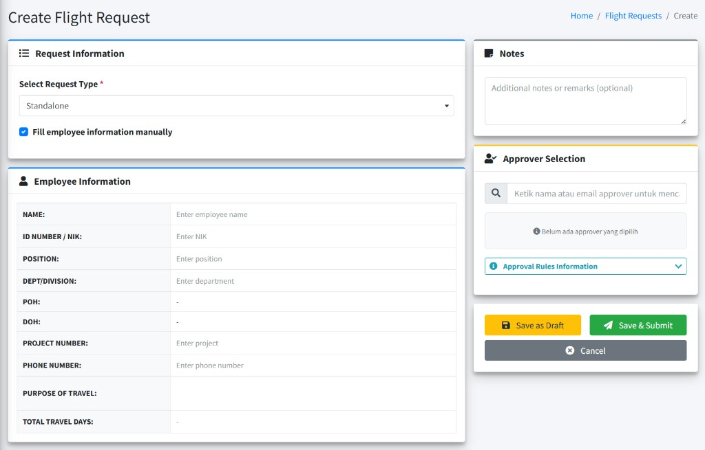
 <em>Gambar 3.5 — Standalone: isian manual data pemohon utama</em>

**Menambah pengikut (opsional)**

5. Setelah kartu **Employee Information** tampil, kartu **Followers** muncul (opsional — standalone only).
6. Klik **Add Follower** untuk menambah baris.
7. **Per baris pengikut**, pilih salah satu cara (kolom tabel: **Employee / Manual**, **Title**, **Name**, **NIK / KTP**, **Phone**, **Action**):
    - **Dari data karyawan** — biarkan checkbox di kolom pertama **tidak** dicentang; pada dropdown **Select Employee** pilih baris **NIK - Nama** (misalnya **12730 - Suyanto**). Kolom **Name**, **NIK / KTP**, dan **Phone** terisi otomatis (baca saja). Pilih **Title** (**Mr.**, **Mrs.**, atau **Inf.**) bila perlu.
    - **Input manual** — centang checkbox di kolom pertama (mode manual per baris); dropdown karyawan disembunyikan. Isi **Title**, ketik **Name**, **NIK / KTP**, dan **Phone** pada field yang dapat diedit di baris tersebut.
8. Klik ikon **X** pada kolom **Action** untuk menghapus baris pengikut.
9. Lengkapi **Flight Details**, **Notes**, dan **Approver Selection**, lalu klik **Save as Draft**, **Save & Submit**, atau **Cancel**.

    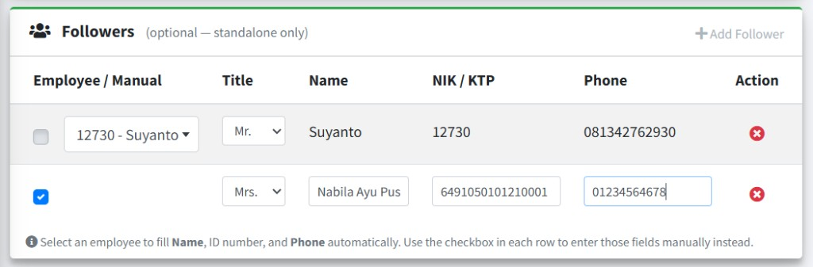
 <em>Gambar 3.6 — Standalone: kartu Followers (karyawan + isian manual dalam satu tabel)</em>

**Catatan:**

- Pengikut **opsional**; jika hanya pemohon utama, biarkan **Followers** kosong.
- Petunjuk: pilih karyawan agar **Name**/NIK/Phone otomatis, centang checkbox untuk input manual per baris.
- Jika **Request Type** diubah dari **Standalone**, data pengikut FRF akan terhapus.
- Untuk **Travel Based**, edit pengikut di modul **Official Travel (LOT)**, bukan di FRF.

---

### Langkah-langkah — melihat detail FRF (HR)

1. Dari daftar **Flight Requests**, klik **View** pada baris yang dipilih.
2. Halaman detail menampilkan **Employee Information** (serta **REQUEST TYPE** — **Leave Based**, **Travel Based**, atau **Standalone**, dengan referensi cuti/LOT bila ada), **Followers** (dari LOT atau Standalone; tidak ada untuk Leave Based), **Flight Details**, **Selected Approvers**, dan **Notes**.
3. Pada **Travel Based**, kartu **Followers** menampilkan daftar dari LOT (nama, jabatan, NIK, departemen, proyek) beserta badge jumlah pengikut. Pada **Standalone**, pengikut karyawan menampilkan jabatan/departemen/proyek; pengikut manual hanya nama, NIK/KTP, dan telepon.
4. Tombol **Edit** (Draft), **Delete** (Draft), **Cancel**, **Print**, dan **Back to List** mengikuti status dan hak akses.
5. Jika FRF berstatus **Approved** atau **Issued**, kartu **Letter of Guarantee (LG)** tampil di **panel kanan** (di bawah **Selected Approvers**). Gunakan tombol **Add LG** pada kartu tersebut untuk membuat LG langsung dari FRF ini — lihat [Jalur 1 — dari detail FRF](#jalur-1--dari-detail-frf-approvedissued) ([Gambar 4.2](#flight-request-detail-add-lg)) di bagian **Issuances**. Jika LG sudah pernah dibuat, daftar LG tampil di kartu yang sama beserta tautan **View Details**.

    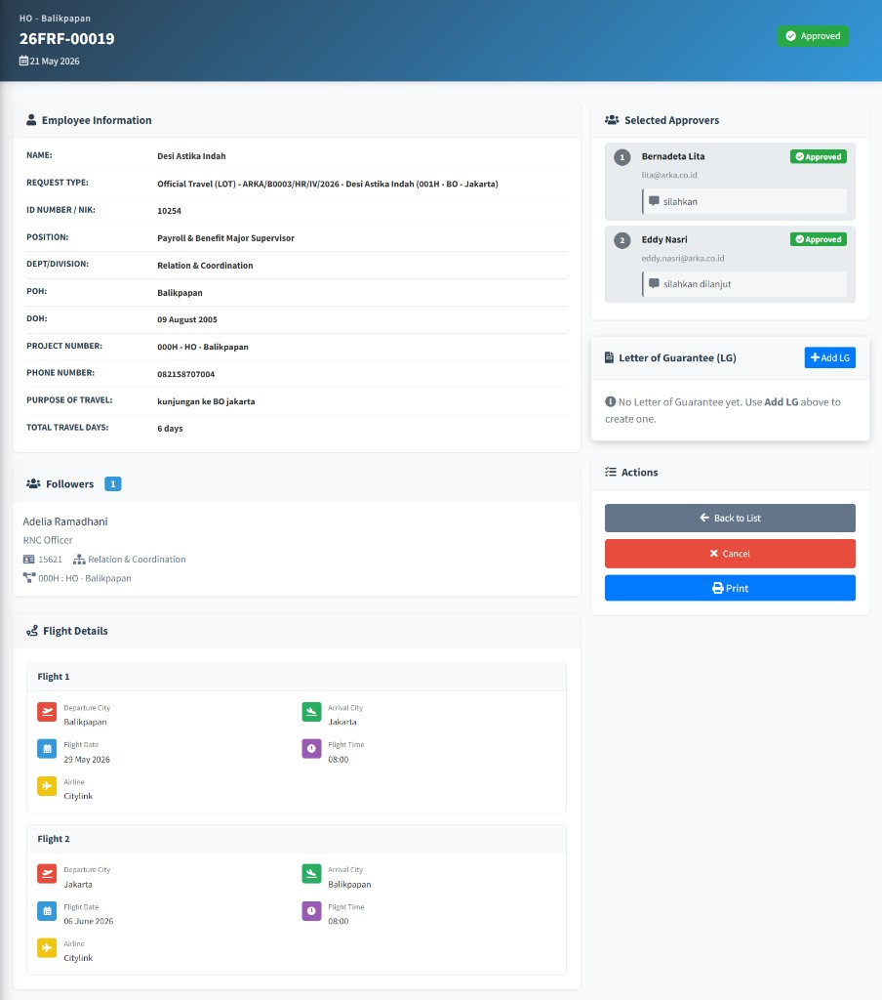
 <em>Gambar 3.8 — Detail FRF Approved (Standalone) dengan Followers, Flight Details, dan kartu Add LG</em>

### Langkah-langkah — **Edit Flight Request** (HR)

1. Buka detail FRF, lalu klik **Edit** (atau **Edit** langsung dari kolom **Actions** pada daftar jika tersedia).
2. Ubah **Request Type**, data pemohon, **Followers** (hanya **Standalone**), **Flight Details**, **Notes**, atau **Approver Selection** sesuai kebutuhan.
3. Klik **Update Flight Request** / **Submit** sesuai tombol yang tampil.
4. Setelah disimpan dari menu **Requests**, sistem mengarahkan kembali ke halaman detail FRF di **Flight Management** → **Requests**, bukan ke **My Flight Request**.

**Catatan:** Pengeditan umumnya hanya untuk status **Draft**.

---

## 4. Untuk HR — **Issuances** (Letter of Guarantee)

Setelah FRF berstatus **Approved** (atau **Issued** bila LG tambahan), tim HR menerbitkan **Letter of Guarantee (LG)**. LG dapat dibuat **langsung dari detail FRF** (pintasan **Add LG**) atau lewat menu **Issuances** bila perlu memilih beberapa FRF sekaligus. LG menghubungkan satu atau beberapa FRF dengan detail tiket per penumpang (booking code, harga, dll.).

### Langkah-langkah — membuka daftar **Flight Issuances**

1. **Login** ke ARKA HERO.
2. Buka **GAMMA SECTION** → **Flight Management** → **Issuances**.
3. Gunakan panel **Filter** untuk menyaring **Issued Number**, **FR Number**, **Business Partner**, **Date From**, dan **Date To**.
4. Tabel menampilkan **No**, **Issued Number**, **Issued Date**, **FR Number** (satu atau lebih FRF per baris), **Business Partner**, **Total Tickets**, **Total Price**, **Issued By**, dan **Actions** (**View**, **Edit**, **Print**).

    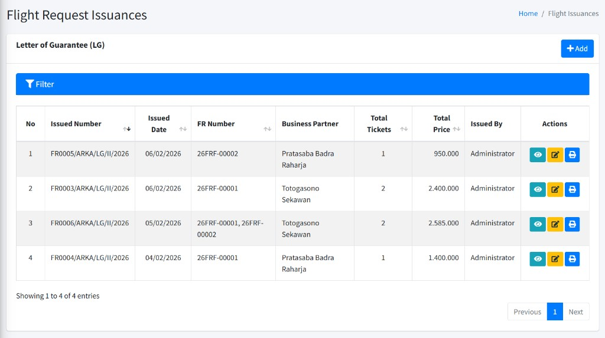
 <em>Gambar 4.1 — Daftar Flight Issuances (HR)</em>

### Langkah-langkah — **Create Letter of Guarantee (LG)**

HR dapat membuat LG lewat **dua jalur**. Keduanya berakhir pada formulir yang sama (**Langkah B**); perbedaannya hanya cara memilih FRF referensi.

#### Jalur 1 — dari detail FRF (Approved/Issued)

Gunakan jalur ini bila Anda sudah membuka FRF yang akan diterbitkan LG-nya — umumnya setelah FRF disetujui approver.

1. Buka **GAMMA SECTION** → **Flight Management** → **Requests**.
2. Pada daftar, klik **View** pada FRF berstatus **Approved** (atau **Issued** jika menambah LG tambahan untuk FRF yang sama).
3. Pada halaman detail, lihat kartu **Letter of Guarantee (LG)** di **panel kanan** (di bawah **Selected Approvers**). Kartu ini tampil setelah FRF disetujui, atau jika FRF sudah pernah memiliki LG.
4. Jika belum ada LG, sistem menampilkan pesan _No Letter of Guarantee yet. Use **Add LG** above to create one._
5. Klik **Add LG** di pojok kanan header kartu. Tombol ini tampil bila FRF berstatus **Approved** atau **Issued** dan Anda memiliki hak membuat LG.
6. Halaman **Create Letter of Guarantee** terbuka **langsung** dengan FRF tersebut sebagai referensi — **tanpa** halaman pilih FRF. Lanjut ke [Langkah B — mengisi formulir LG](#langkah-b--mengisi-formulir-lg).

    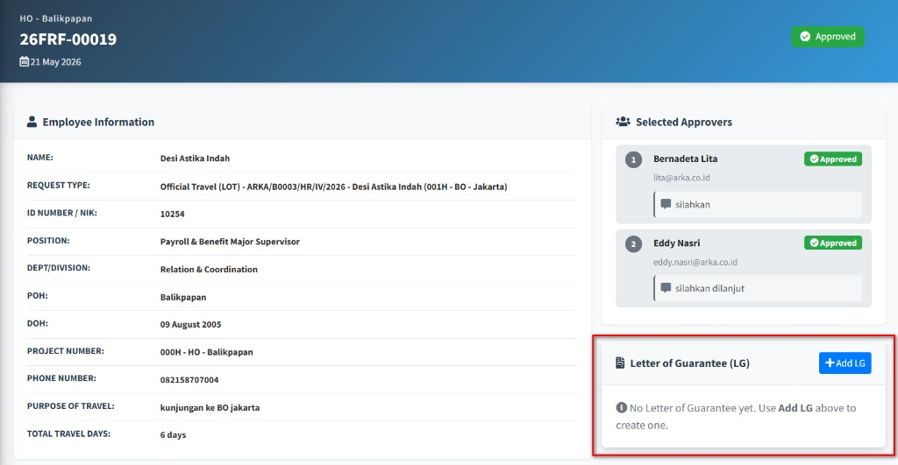
 <em>Gambar 4.2 — Detail FRF Approved dengan kartu Add LG (Jalur 1)</em>

**Catatan jalur 1:**

- Satu FRF dapat memiliki **beberapa LG**; tombol **Add LG** tetap tersedia pada status **Approved** dan **Issued**.
- Setelah LG tersimpan, kartu pada detail FRF menampilkan daftar LG (**Issued Number**, **Issued Date**, **Business Partner**, **Total Tickets**) dan tombol **View Details** ke halaman LG terkait.
- Status FRF dapat berubah menjadi **Issued** setelah LG pertama kali tersimpan.

#### Jalur 2 — dari menu Issuances (beberapa FRF sekaligus)

**Langkah A — memilih Flight Request**

1. Buka **GAMMA SECTION** → **Flight Management** → **Issuances**, lalu klik **Add** pada daftar LG.
2. Halaman **Select Flight Requests for LG** terbuka.
3. Gunakan panel **Filter** (**Status**, **Form Number**, **Date From**, **Date To**) untuk mempersempit daftar. Hanya FRF berstatus **Approved** atau **Issued** yang dapat dipilih.
4. Centang satu atau lebih baris FRF pada tabel (**Form Number**, **Employee Name**, **NIK**, **Purpose of Travel**, **Status**, **Requested At**). Penghitung di bawah tabel menampilkan jumlah baris terpilih (misalnya _0 selected_).
5. Klik **Continue with Selected FR**. Sistem memvalidasi bahwa FRF yang dipilih memenuhi syarat penerbitan LG. Klik **Cancel** untuk kembali ke daftar **Issuances** tanpa melanjutkan.
6. Lanjut ke [Langkah B — mengisi formulir LG](#langkah-b--mengisi-formulir-lg).

    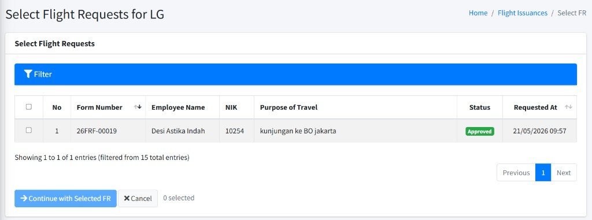
 <em>Gambar 4.3 — Memilih FRF sebelum membuat LG (Jalur 2)</em>

#### Langkah B — mengisi formulir LG

1. Halaman **Create Flight Issuance** / **Create Letter of Guarantee** terbuka; FRF terpilih (dari **Jalur 1** atau **Langkah A**) tercatat sebagai ringkasan pada **sidebar kanan** (**FR Number**, nama/NIK, **Purpose**, **Travel Days**, **Flight Details**).
2. **Letter Number** — pada kartu **Letter Number**, pilih nomor surat kategori **FR** (wajib). Gunakan **Refresh List** atau **+ Create New** bila daftar kosong. Jika muncul peringatan _No available letter numbers found_, pastikan nomor surat kategori **FR** sudah tersedia untuk proyek Anda.
3. **LG Information** — **Issued Number** terisi otomatis (format `[Letter Number]/ARKA/LG/...`) setelah nomor surat dipilih; lengkapi **Issued Date** (wajib), **Business Partner** (opsional), dan **Notes** (opsional).
4. **Ticket Details** — klik **Add Ticket** untuk setiap penumpang yang perlu tiket:
    - **Passenger Name** — pilih karyawan dari dropdown **Select Employee**, **atau** centang **Manual** lalu ketik nama penumpang.
    - Isi **Booking Code**, **Detail Reservation**, **Ticket Price**, serta komponen biaya lain (**Service Charge**, **Service VAT**, **151 (Advance)**, **622 (Company)**) sesuai kebutuhan.
    - Ikon **X** pada kartu tiket menghapus baris tersebut.
5. Pada sidebar, gunakan ringkasan **Flight Request** (dan kartu **Followers** bila FRF memiliki pengikut) sebagai referensi siapa saja yang perlu tiket — pemohon utama dan pengikut dari FRF **Standalone** atau **Travel Based**.
6. **Approver Selection** — cari dan pilih approver LG pada panel kanan sebelum menyimpan.
7. Klik **Create LG**. Klik **Cancel** untuk kembali tanpa menyimpan. Status FRF terkait dapat berubah menjadi **Issued** setelah LG tersimpan.

    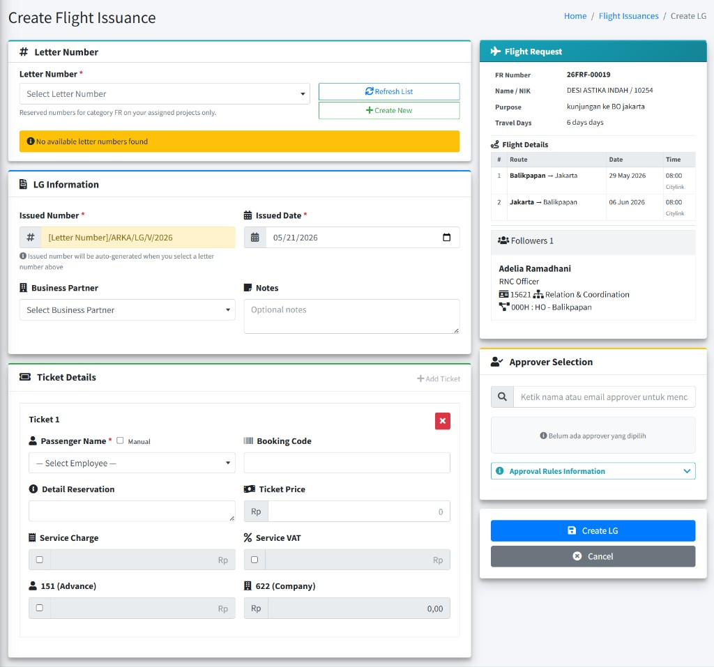
 <em>Gambar 4.4 — Form Create LG (Letter Number, Ticket Details, ringkasan FRF dan Followers)</em>

**Catatan:**

- **Jalur 1** (detail FRF) cocok untuk satu FRF; **Jalur 2** (**Add** dari **Issuances**) cocok bila satu LG menghubungkan **beberapa FRF** sekaligus.
- Daftar **Followers** pada sidebar **tidak** menggantikan entri **Ticket Details**; HR tetap menambahkan baris tiket per penumpang yang benar-benar dipesan.
- Penumpang dapat dipilih dari data karyawan atau diinput **Manual** pada setiap baris tiket.

---

### Langkah-langkah — melihat detail LG (HR)

1. Dari daftar **Issuances**, klik **View** (ikon mata) pada baris LG.
2. Halaman detail menampilkan badge status LG (misalnya **Pending**) di header, lalu:
    - **LG Information** — **Issued Number**, **Issued Date**, **Letter Number**, **Business Partner**, **Issued By**, **Total Tickets**, **Total Price**, **Notes**.
    - **Ticket Details** — kartu per tiket (**Passenger**, **Booking Code**, **Detail Reservation**, rincian **Ticket Price**, **Service Charge**, **Service VAT**, **622 (Company)**, **151 (Advance)**).
    - **Related Flight Request(s)** — ringkasan FRF terkait (**FR Number**, **Purpose**, **Requested Date**) dengan tombol **View**, serta daftar **Followers** bila ada.
    - **Selected Approvers** — approver LG beserta status persetujuan.
3. Panel **Actions** menyediakan **Edit**, **Print**, **Delete**, dan **Back to List** sesuai status dan hak akses.

    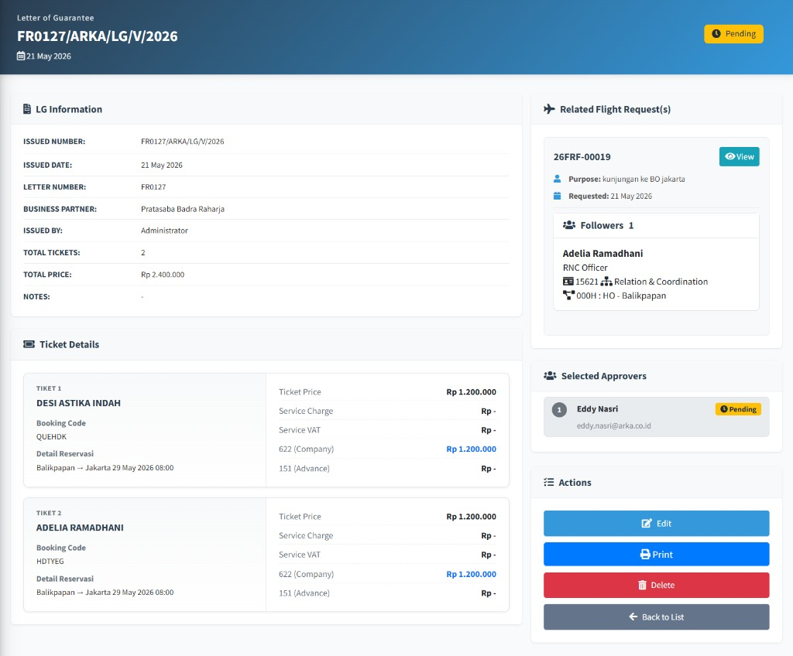
 <em>Gambar 4.5 — Detail LG (Pending) dengan Ticket Details, FRF terkait, dan Followers</em>

### Langkah-langkah — **Edit LG**

1. Buka detail LG, lalu klik **Edit** (atau **Edit** dari kolom **Actions** pada daftar).
2. Ubah **Letter Number**, **Issued Number**, **Issued Date**, **Business Partner**, **Notes**, **Ticket Details**, atau **Approver Selection**.
3. Klik **Update LG** untuk menyimpan, atau **Cancel** untuk kembali ke detail tanpa menyimpan.

**Catatan:** **Edit** mungkin tidak tersedia jika FRF terkait sudah berstatus **Completed** (sesuai aturan aplikasi).

### Langkah-langkah — **Print** dan **Delete**

- **Print** — dari detail atau **Actions** pada daftar, klik **Print** untuk membuka surat LG (format cetak); daftar **Followers** dari FRF terkait ikut tercantum bila ada.
- **Delete** — dari detail, klik **Delete**, konfirmasi penghapusan; gunakan hanya bila LG dibuat salah dan kebijakan internal mengizinkan.

---

 
 
 

## 5. Untuk karyawan — **My Flight Request**

**My Flight Request** digunakan untuk mengajukan permintaan tiket penerbangan, baik yang terkait dengan cuti, perjalanan dinas, maupun perjalanan mandiri (_standalone_).

**Navigasi:** **My Features** → **My Flight Request**

### Langkah-langkah — Daftar permintaan tiket & filter

Tabel pada halaman **My Flight Request** adalah **satu daftar gabungan** untuk semua permintaan tiket yang terkait dengan akun Anda. Selain pengajuan yang Anda mulai di sini lewat **New Request**, baris dapat **muncul otomatis** karena Anda sudah meminta tiket sebelumnya:

- **Berkaitan dengan cuti** — pada formulir **Create My Leave Request**, jika Anda mencentang **Flight Request** dan mengisi segmen penerbangan, sistem mencatat kebutuhan tiket yang terpasang pada nomor pengajuan cuti Anda. Di daftar tiket, permintaan itu biasanya dapat dikenali lewat filter **Request Type** → **Leave Based**.
- **Berkaitan dengan perjalanan dinas (LOT)** — pada form **Add My Official Travel (LOT)**, jika Anda mencentang **Check if you need flight ticket reservation**, kebutuhan tiket terikat dengan permohonan LOT (nomor **REQxxxxx** sampai HR mengonfirmasi). Di daftar, tipe yang dipakai umumnya **Travel Based**.

    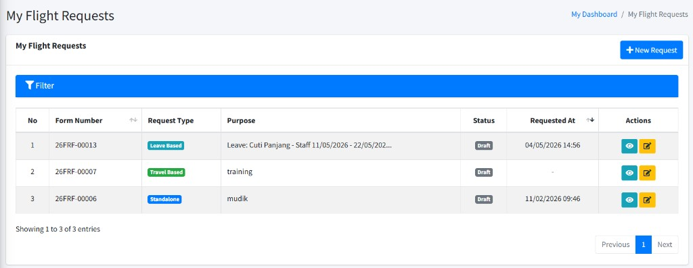
 <em>Gambar 5.1 — Daftar My Flight Requests</em>

Gunakan daftar ini untuk **memantau status** yang sama untuk semua jalur (**Draft**, **Submitted**, **Approved**, **Issued**, dll.) dan membuka detail **View** / **Edit** bila tombol tersebut tersedia. Kolom **Request Type** memuat badge seperti **Leave Based**, **Travel Based**, dan **Standalone**; tombol pada kolom **Actions** mengikuti status dan hak akses. Contoh halaman detail setelah **View**: status **Draft** pada Gambar 5.7; **Submitted** dengan kartu approver pada Gambar 5.8. Alur persetujuan cuti atau LOT tetap berjalan di modul masing-masing; permintaan tiket mengikuti kebijakan **Flight Management** dan koordinasi **HR HO Balikpapan**.

**Filter** tersedia:

- **Status** — Draft, Submitted, Approved, Issued, Completed, Rejected, Cancelled.
- **Request Type** — Standalone, Leave Based, Travel Based.
- **Form Number** — cari berdasarkan nomor formulir.

 

### Langkah-langkah — Membuat permintaan tiket baru

Klik **New Request**. Halaman **Create Flight Request** terbuka (breadcrumb umum: **My Dashboard / My Flight Requests / Create**). Isian tambahan di bawah **Request Type** mengikuti pilihan Anda; langkah **Flight Details** dan tombol akhir sama untuk semua jalur.

**Alur yang sama (semua Request Type)**

1. Di **Select Request Type**, pilih **Standalone**, **Leave Request (Cuti)**, atau **Official Travel (LOT)**. Di daftar permintaan, tipe itu terlihat sebagai badge **Standalone**, **Leave Based**, atau **Travel Based**.
2. Lengkapi blok yang muncul setelah langkah 1 — ringkasannya ada pada daftar **Perbedaan per tipe** di bawah (pemilih cuti/LOT, data karyawan, pengikut, dll.).
3. **Flight Details** — **Add Flight Segment** untuk tiap destination. Field wajib bertanda \*: **Departure City**, **Arrival City**, **Flight Date**. **Flight Time (ETD)** dan **Airline** bersifat pelengkap. Ikon **X** pada kartu segmen menghapus segmen tersebut.
4. **Notes** di panel kanan bersifat opsional.
5. **Create Flight Request** menyimpan/mengajukan sesuai alur aplikasi; **Cancel** keluar tanpa mengirim. Jika layar Anda menampilkan **Save as Draft** atau **Submit**, gunakan opsi itu — **Submit** mengarahkan permohonan ke pemrosesan tiket di HO Balikpapan dan dapat mengubah status menjadi **Submitted**.

**Perbedaan per tipe**

| **Pilihan di form**       | **Badge di daftar** | **Followers di formulir tiket**                                     |
| :------------------------ | :------------------ | :------------------------------------------------------------------ |
| **Standalone**            | **Standalone**      | Dapat ditambah di kartu **Followers** (opsional) — lihat Gambar 5.4 |
| **Leave Request (Cuti)**  | **Leave Based**     | Mengikuti cuti terpilih; tanpa blok pengikut terpisah               |
| **Official Travel (LOT)** | **Travel Based**    | Hanya baca dari LOT; perbaiki pengikut di modul LOT                 |

- **Standalone** — Tiket tidak terikat cuti atau LOT. **Employee Information** umumnya dari profil akun; centang **Fill employee information manually** bila Anda harus mengisi sendiri data pemohon (Gambar 5.2, Gambar 5.3). Pada **Standalone** saja, kartu **Followers** (opsional) memungkinkan menambah pengikut lewat **Add Follower**: pilih karyawan di dropdown (**NIK - Nama**) atau centang checkbox di baris untuk isian manual (**Title**, **Name**, **NIK / KTP**, **Phone**) — Gambar 5.4. Detail pengikut HR dijelaskan pada bagian **Standalone dengan Followers** (bab 3). Field yang masih kosong atau bertanda **—** ikuti perilaku form sampai terisi.
- **Leave Request (Cuti)** — Cuti yang dipilih harus sudah ada di modul cuti. Pada **Select Leave Request**, pilih baris yang tepat (biasanya memuat nomor register dan rentang tanggal). Data karyawan dan ringkasan perjalanan terisi otomatis dari cuti tersebut (Gambar 5.5).
- **Official Travel (LOT)** — LOT harus sudah tercatat di modul perjalanan dinas. Pada **Select Official Travel**, pilih LOT yang benar. Data pemohon utama dan blok **Followers** mengikuti LOT; **daftar pengikut tidak diubah di halaman tiket** — jika salah, perbaiki pada pengajuan LOT atau koordinasikan dengan HR (Gambar 5.6).

Pada **Leave Request** atau **Official Travel**, opsi mirip **Fill employee information manually** bila tampil mengikuti kebijakan layar Anda.

    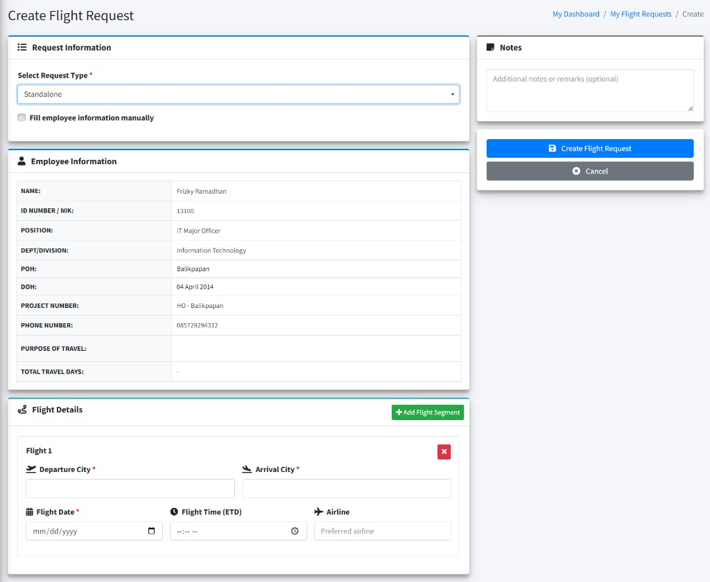
 <em>Gambar 5.2 — Standalone (data dari profil)</em>

    
 <em>Gambar 5.3 — Standalone isian manual</em>

    
 <em>Gambar 5.4 — Standalone dengan kartu Followers</em>

    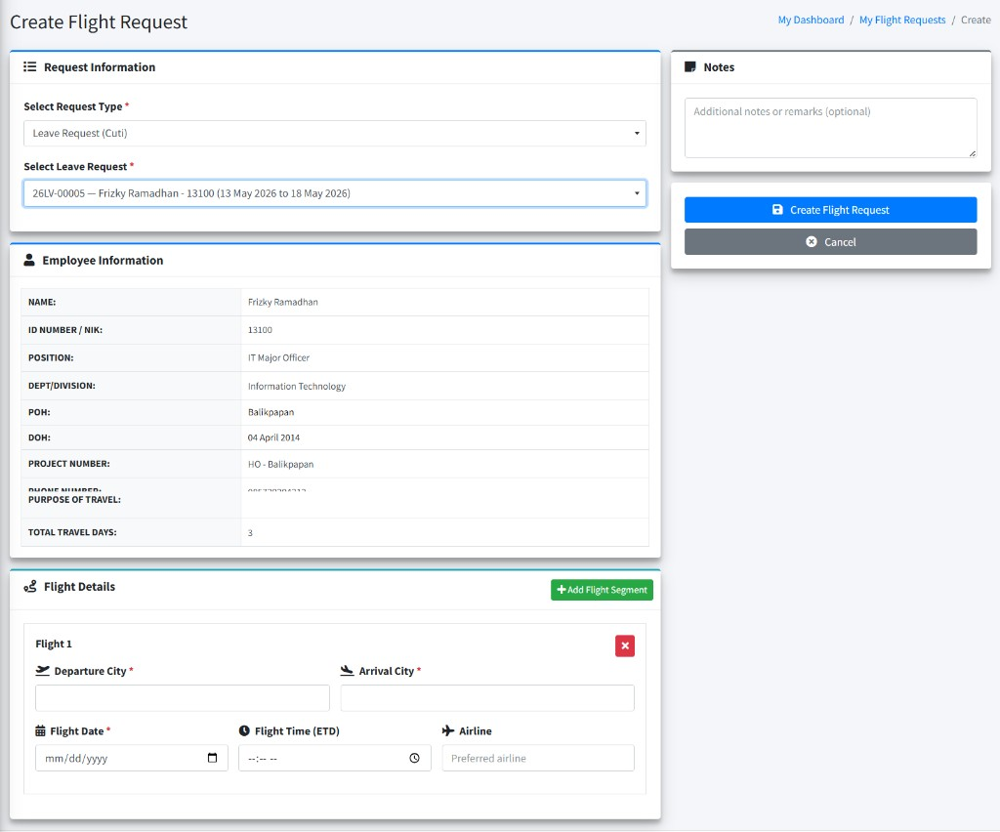
 <em>Gambar 5.5 — Leave Based</em>

    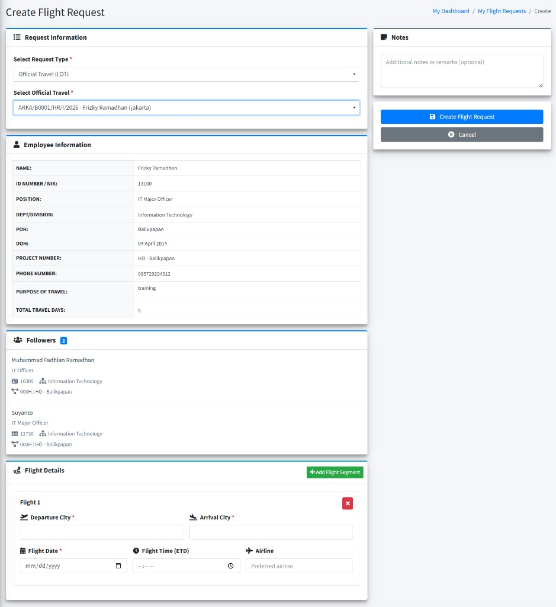
 <em>Gambar 5.6 — Travel Based (LOT)</em>

**Catatan:** Setelah tiket diterbitkan oleh tim HO Balikpapan, status berubah menjadi **Issued**. Pastikan data penumpang dan rute sudah benar sebelum mengajukan.

### Melihat detail permintaan tiket

Pada baris yang dipilih di daftar, klik **View** untuk membuka halaman ringkas satu permohonan tiket.

**Status Draft** pada badge judul berarti permintaan **belum selesai dalam alur pemrosesan HR / tim tiket** pada tahap tersebut — umumnya belum setara dengan pengajuan yang sudah **Submitted**, disetujui (**Approved**), atau tiket sudah **Issued**. Anda masih dapat mengoreksi data lewat **Edit** jika tombol tampil, menghapus (**Delete**), membatalkan (**Cancel**), atau kembali ke daftar (**Back to My Requests**). Tombol **Print** memuat cetak ringkas jika diperlukan; kombinasi tombol mengikuti status dan hak akses akun.

Cuplikan berikut adalah contoh detail permintaan **Travel Based** yang mengacu pada **Official Travel (LOT)** (nomor surat dan ringkasan perjalanan di blok **REQUEST TYPE**), lengkap dengan **Followers** dari LOT dan satu segmen **Flight Details** — masih **Draft** sebelum diproses lebih lanjut oleh HR.

    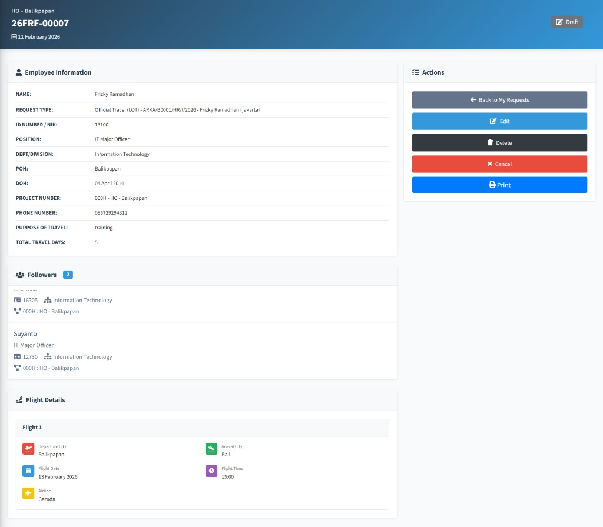
 <em>Gambar 5.7 — Detail tiket Draft (Travel Based)</em>

Setelah permintaan **diajukan** dan masuk ke pemrosesan HR / alur tiket, badge status pada judul detail dapat berubah menjadi **Submitted** (atau status lain yang ditampilkan di lingkungan Anda). Pada tahap ini, halaman detail biasanya menampilkan kartu **Selected Approvers** berisi daftar approver dengan badge status tiap orang (**Pending** sampai ada yang menyetujui atau menolak). Konten **Employee Information**, **Followers**, dan **Flight Details** tetap sebagai referensi; Anda **tidak lagi menyunting** data utama seperti pada **Draft** — tombol **Edit** / **Delete** sering **hilang** atau tidak tersedia. Panel **Actions** pada contoh berikut menyediakan **Back to My Requests**, **Cancel**, dan **Print** (susunan pasti mengikuti status dan hak akses).

    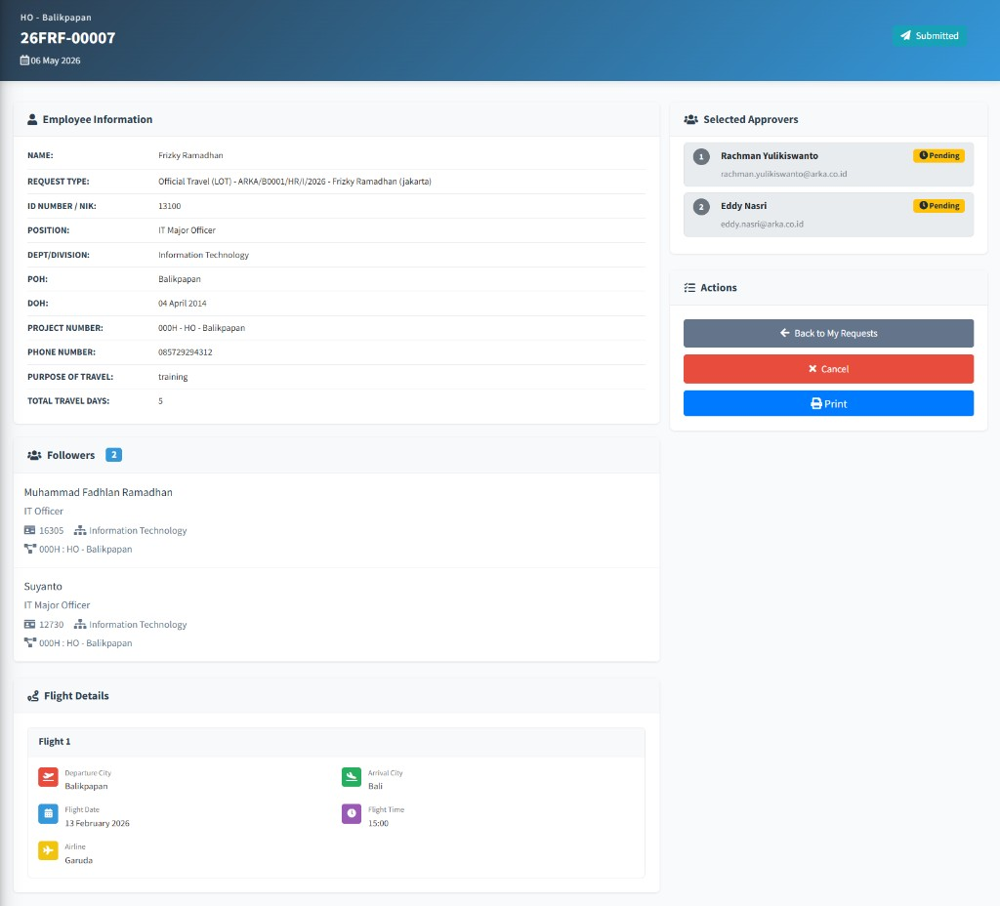
 <em>Gambar 5.8 — Detail tiket Submitted</em>

### Membatalkan permintaan tiket

Pembatalan dilakukan dari **halaman detail** (klik **View** pada baris di daftar).

1. Pada panel **Actions**, klik tombol **Cancel** jika tombol tersebut tampil.
2. Di jendela **Cancel Flight Request**, isi **Reason for Cancellation** (wajib).
3. Klik **Cancel Request** untuk mengirim pembatalan, atau **Close** untuk menutup jendela tanpa mengubah data.

    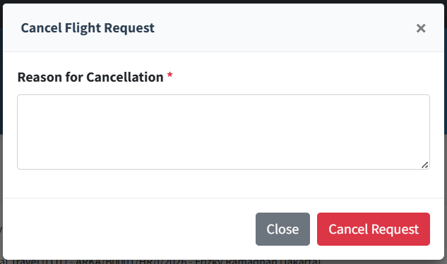
 <em>Gambar 5.9 — Modal Cancel Flight Request</em>

Setelah berhasil, status permintaan menjadi **Cancelled**. Tombol **Cancel** **tidak** ditampilkan untuk status yang sudah tidak bisa dibatalkan melalui jalur ini — misalnya **Issued**, **Completed**, **Rejected**, atau jika permintaan sudah **Cancelled**. Sesuai aturan aplikasi, pembatalan dari akun karyawan umumnya masih diperbolehkan pada status **Draft**, **Submitted**, atau **Approved** (sampai tiket diterbitkan atau alur menutup opsi tersebut).

---

## 6. Kesalahan & bantuan

| Gejala / pesan (contoh)                | Kemungkinan penyebab                                                                                 | Apa yang bisa dicoba                                                                             |
| :------------------------------------- | :--------------------------------------------------------------------------------------------------- | :----------------------------------------------------------------------------------------------- |
| Kartu **Followers** tidak muncul       | **Request Type** bukan **Standalone** / **Travel Based**, atau **Employee Information** belum tampil | **Standalone**: lengkapi pemohon dulu; **Travel Based**: pilih LOT dulu agar pengikut LOT tampil |
| **Select Leave Request** kosong        | Belum ada pengajuan cuti yang memenuhi syarat                                                        | Buat/verifikasi cuti di **Leave Management** terlebih dahulu                                     |
| **Select Official Travel** kosong      | Belum ada LOT yang memenuhi syarat                                                                   | Buat/verifikasi LOT di **Official Travel Management** terlebih dahulu                            |
| Validasi pengikut manual               | **Name**, **NIK**, atau **Phone** kosong saat **Fill follower information manually** dicentang       | Lengkapi ketiga field pada baris yang bermasalah                                                 |
| Validasi pengikut karyawan             | Dropdown karyawan belum dipilih                                                                      | Pilih **NIK - Nama** pada baris tersebut                                                         |
| Pengikut LOT salah                     | FRF bertipe **Travel Based**                                                                         | Ubah pengikut di pengajuan **Official Travel (LOT)**, bukan di FRF                               |
| Tidak bisa mengubah FRF                | Status bukan **Draft** / **Submitted** (sesuai kebijakan)                                            | Hubungi HR; buat permintaan baru jika diperlukan                                                 |
| **Continue with Selected FR** nonaktif | Belum ada FRF dicentang, atau FRF tidak memenuhi syarat LG                                           | Centang minimal satu FRF berstatus **Approved** / **Issued**                                     |
| Tidak bisa **Edit LG**                 | FRF terkait sudah **Completed**                                                                      | Koordinasikan dengan administrator; buat LG baru jika diperlukan                                 |
| Validasi tiket LG                      | **Passenger Name** kosong saat **Manual** tidak dicentang / sebaliknya                               | Pilih karyawan **atau** centang **Manual** dan isi nama                                          |

### Menghubungi administrator

Sertakan **username**, waktu kejadian, menu yang dibuka (**Flight Requests** atau **My Flight Request**), **Form Number** FRF, dan cuplikan pesan error. Jangan mengirim kata sandi.

---

---

# Letter Administration

Panduan ini untuk **staf HR** dan petugas administrasi yang mengelola **nomor surat** di ARKA HERO. Modul **Letter Administration** berada di **GENERAL SECTION**.

Nomor surat yang dibuat di sini dipakai oleh modul lain (misalnya **Official Travel**, **Recruitment**, **Flight Management**) lewat pemilihan **Letter Number** pada formulir terkait. Pengaturan **kategori** dan **subjek** surat ada di **Master Data** → **Letter Management Data** (lihat bab _Master Data_, bagian Letter Categories).

**Catatan peran:** Menu **Dashboard** dan **Letter Numbers** hanya tampil jika akun Anda memiliki hak akses modul nomor surat. Daftar nomor surat dibatasi menurut **project** yang terhubung ke akun Anda.

---

## Glosarium

| **Istilah**                | Arti singkat                                                                                                                                                                              |
| -------------------------- | ----------------------------------------------------------------------------------------------------------------------------------------------------------------------------------------- |
| **Letter Administration**  | Grup menu di **GENERAL SECTION** untuk dashboard penomoran dan daftar **Letter Numbers**.                                                                                                 |
| **Letter Number**          | Nomor surat unik yang dihasilkan sistem; format umum `**[KODE_KATEGORI][URUTAN]`** (misalnya **A0001**, **B0042**, **FR0123**). Urutan empat digit per **project** dan **tahun\*\* surat. |
| **Letter Category**        | Jenis/kelompok surat (kode **A**, **B**, **PKWT**, **PAR**, **FR**, dll.); menentukan perilaku penomoran dan field tambahan pada formulir.                                                |
| **Letter Subject**         | Subjek master per kategori; dipilih dari dropdown atau diganti dengan **Custom Subject**.                                                                                                 |
| **Reserved**               | Status nomor surat baru: siap dipakai, masih dapat **Edit**, **Cancel**, atau **Delete** (jika belum terhubung dokumen).                                                                  |
| **Used**                   | Nomor sudah dipakai pada dokumen modul lain atau ditandai manual; tidak dapat diubah lagi.                                                                                                |
| **Cancelled**              | Nomor dibatalkan; tidak boleh dipakai untuk dokumen baru.                                                                                                                                 |
| **Annual Reset**           | Perilaku penomoran: urutan kembali ke **1** setiap tahun kalender.                                                                                                                        |
| **Continuous**             | Perilaku penomoran: urutan berlanjut tanpa reset tahunan.                                                                                                                                 |
| **Estimated Next Numbers** | Pratinjau nomor berikutnya per kategori di dashboard, berdasarkan project dan tahun berjalan.                                                                                             |
| **Related Document**       | Dokumen sistem (LOT, FPTK, LG, dll.) yang memakai nomor surat; tercatat di detail **Letter Number**.                                                                                      |

---

 
 

## 1. Ringkasan Menu

| **Menu**              | **Navigasi (sidebar)**                                                                     | **Uraian**                                                                                                                      |
| --------------------- | ------------------------------------------------------------------------------------------ | ------------------------------------------------------------------------------------------------------------------------------- |
| **Dashboard**         | **GENERAL SECTION** → **Letter Administration** → **Dashboard**                            | Ringkasan statistik, perkiraan nomor berikutnya per kategori, aktivitas terbaru, pintasan **Create** / **Import** / **Export**. |
| **Letter Numbers**    | **GENERAL SECTION** → **Letter Administration** → **Letter Numbers**                       | Daftar seluruh nomor surat (sesuai project Anda); filter, buat, ubah, batalkan, hapus, ekspor, impor.                           |
| **Letter Categories** | **GENERAL SECTION** → **Master Data** → **Letter Management Data** → **Letter Categories** | Master kategori & subjek surat (bukan operasi penomoran harian).                                                                |

---

## 2. Letter Administration Dashboard

Halaman **Letter Administration Dashboard** (_Letter Numbering System Overview_) memberi gambaran volume nomor surat, perkiraan nomor berikutnya per kategori, serta pintasan operasi sebelum Anda membuka **Letter Numbers**.

### Langkah-langkah — membuka **Letter Administration Dashboard**

1. **Login** ke ARKA HERO.
2. Buka **GENERAL SECTION** → **Letter Administration** → **Dashboard**.
3. Baca tiap bagian dashboard secara berurutan: [ringkasan metrik](#21-letter-administration-summary) → [perkiraan nomor berikutnya](#22-estimated-next-numbers) → [tabel kategori & aktivitas terbaru](#23-letter-categories-dan-recent-letter-numbers) → [pintasan operasi](#24-quick-actions).

### 2.1 Letter Administration Summary

Kartu paling atas berjudul **Letter Administration Summary** (_Overview & Key Metrics_) menampilkan empat metrik utama:

- **Total Letters** — jumlah seluruh nomor surat dalam sistem.
- **Reserved** — nomor berstatus **Reserved** (belum terpakai).
- **Used** — nomor yang sudah dipakai.
- **This Month** — nomor yang dibuat pada bulan berjalan.

Tombol **View All Letters** di pojok kanan header kartu membuka menu **Letter Numbers**.

    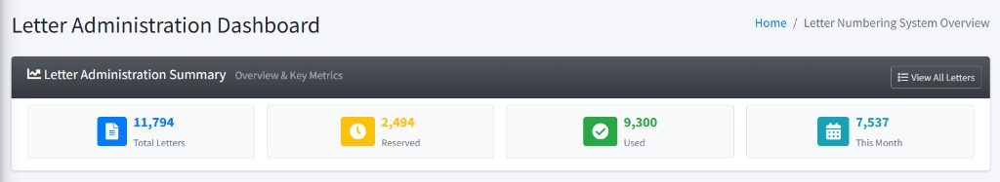
 <em>Gambar 2.1 — Letter Administration Summary (metrik Total Letters, Reserved, Used, This Month)</em>

### 2.2 Estimated Next Numbers

Panel **Estimated Next Numbers** (_Current Year: …_) berisi grid kartu per **Letter Category**. Setiap kartu menampilkan:

- **Next Available Number** — pratinjau nomor berikutnya (tahun berjalan).
- **Sequence** dan **Year** — urutan internal dan tahun penomoran.
- Badge **Annual Reset** atau **Continuous** — perilaku penomoran kategori.
- Jumlah **letters** dan **Recent Numbers** (hingga tiga nomor terakhir).
- Tombol **View All** (filter daftar per kategori) dan **Create** (form buat nomor untuk kategori itu).

Panel dapat dilipat dengan ikon **−** di header kartu.

    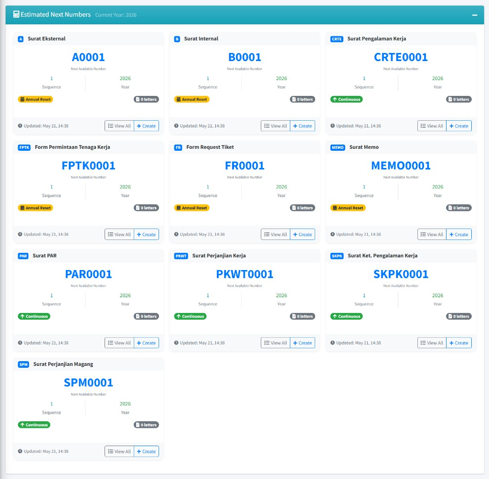
 <em>Gambar 2.2 — Estimated Next Numbers (pratinjau nomor berikutnya per Letter Category)</em>

### 2.3 Letter Categories dan Recent Letter Numbers

Di bawah grid perkiraan nomor, dua tabel berdampingan:

**Letter Categories** (kiri) — daftar kategori dengan kolom **Category**, **Total**, dan **Status** (badge **R** = **Reserved**, **U** = **Used**, **C** = **Cancelled**). Pagination tersedia di bawah tabel.

**Recent Letter Numbers** (kanan) — nomor surat terbaru dengan kolom **Letter #**, **Category**, **Status**, **Created**, dan **Action** (tombol **View** untuk membuka detail). Pagination tersedia di bawah tabel.

### 2.4 Quick Actions

Empat kartu pintasan di bagian bawah halaman:

- **Create New** — **Generate letter number** → tombol **Create Letter Number**
- **Import** — **Bulk import letters** → tombol **Import Excel**
- **Export** — **Download report** → tombol **Export Excel**
- **Manage** — **Letter categories** → tombol **Manage Categories** (menu **Letter Categories** di **Master Data**)

    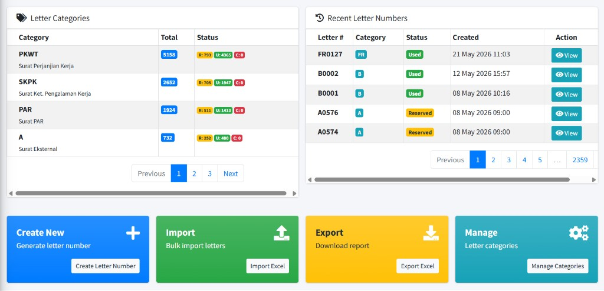
 <em>Gambar 2.3 — Letter Categories, Recent Letter Numbers, dan Quick Actions</em>

**Catatan:**

- Statistik dashboard mencakup data global; daftar **Letter Numbers** tetap difilter menurut **project** akun Anda.
- Kategori **CRTE**, **PKWT**, dan **SKPK** hanya tampil bagi pengguna yang terhubung ke project **000H**.
- Panel **Estimated Next Numbers** dapat dilipat dengan ikon **−** di header kartu.

---

## 3. Letter Numbers — daftar dan filter

### Langkah-langkah — membuka daftar **Letter Numbers**

1. **Login** ke ARKA HERO.
2. Buka **GENERAL SECTION** → **Letter Administration** → **Letter Numbers**.
3. Judul halaman: **Letter Number Administration**; subjudul kartu: **Letter Numbers List**.
4. Di pojok kanan atas kartu daftar tersedia:

- **Export** — unduh data ke Excel.
    - **Import** — buka modal impor Excel.
    - **Add** — buat nomor surat baru.

5. Buka panel **Filter** (bilah biru dengan ikon corong) untuk menyaring data. Filter diterapkan otomatis saat Anda mengubah isian; **Reset Filter** mengosongkan semua filter.

| **Filter**                  | **Fungsi**                                                         |
| --------------------------- | ------------------------------------------------------------------ |
| **Date From** / **Date To** | Rentang **Letter Date**.                                           |
| **Project**                 | Batasi ke satu **project** (hanya project yang Anda miliki akses). |
| **Letter Category**         | Kode dan nama kategori.                                            |
| **Letter Number**           | Pencarian teks sebagian nomor.                                     |
| **Destination**             | Pencarian tujuan/alamat surat.                                     |
| **Remarks**                 | Pencarian catatan.                                                 |
| **Status**                  | **Reserved**, **Used**, atau **Cancelled**.                        |

1. Tabel menampilkan kolom **No**, **Project**, **Letter Number**, **Category**, **Subject**, **Date**, **Destination**, **Remarks**, **Status** (badge warna), dan **Actions**.

    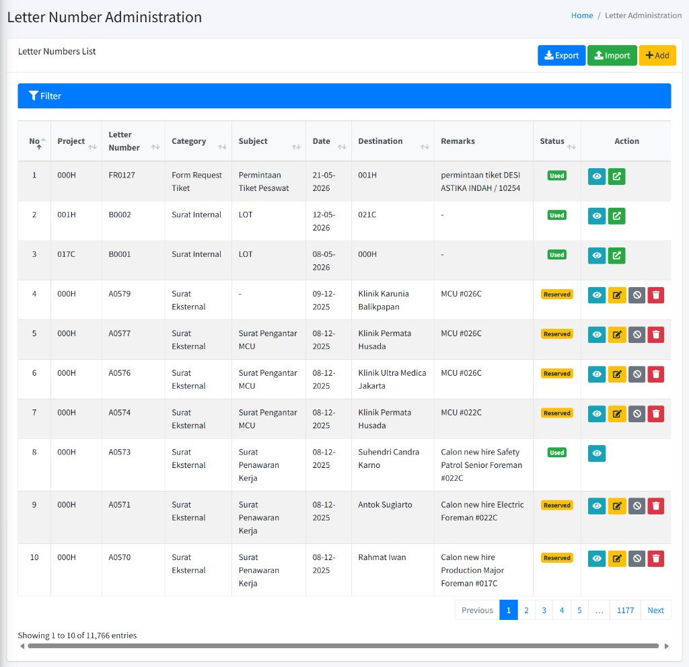
 <em>Gambar 3.1 — Daftar Letter Numbers dengan filter dan tombol Export, Import, Add</em>

**Actions** pada setiap baris (sesuai status dan hak akses):

- **View** (ikon mata) — detail nomor surat.
- **Edit** (ikon pensil) — hanya jika status **Reserved**.
- **Cancel** (ikon larangan) — batalkan nomor **Reserved**.
- **Delete** (ikon tempat sampah) — hanya **Reserved** dan belum terhubung dokumen.
- **View Document** (ikon tautan hijau) — jika nomor sudah dipakai modul lain (misalnya LOT).

Indikator **Filters Applied** muncul di bawah filter bila ada filter aktif; **Quick Reset** mengosongkan filter tanpa meninggalkan halaman.

---

## 4. Membuat nomor surat — **Create Letter Number**

Anda dapat membuka form dari **Add** pada daftar, **Create Letter Number** / **Create** di dashboard, atau tautan **Create** pada kartu kategori di **Estimated Next Numbers** (kategori sudah terpilih).

### Langkah-langkah — **Create Letter Number** (informasi dasar)

1. Klik **Add** atau pintasan **Create** dari dashboard.
2. Pada kartu **Basic Information**, isi field berikut:

**1. Project** (wajib)

Pilih **Project** dari dropdown. Setiap project memiliki urutan nomor sendiri. Teks bantuan: _Each project has its own sequence number. Required for generating letter numbers._

**2. Letter Category** (wajib)

Pilih kategori (misalnya **A - Surat Eksternal**, **B - Surat Internal**, **FR - Form Request Tiket**). Jika Anda masuk lewat kartu kategori di dashboard, field ini sudah terisi dan tidak dapat diubah.

Setelah **Project** dan **Letter Category** dipilih, panel **Next Number Preview** menampilkan pratinjau nomor berikutnya dan **Sequence**.

**3. Letter Date** (wajib)

Tanggal surat; default hari ini. Tahun penomoran mengikuti tanggal ini.

**4. Subject** / **Custom Subject**

Pilih **Subject** dari master subjek kategori, atau isi **Custom Subject** jika subjek tidak ada di daftar.

**5. Destination/Address/Project** dan **Remarks**

Opsional; untuk tujuan surat dan catatan internal.

1. Lengkapi **field dinamis** sesuai kategori (lihat [bagian 4.1](#41-field-dinamis-per-letter-category) di bawah).
2. Panel kanan **Additional Information** menjelaskan bahwa nomor dihasilkan otomatis, format `**[CATEGORY][SEQUENCE]`**, dan status awal **Reserved\*\*.
3. Klik **Save Letter Number**. Pesan sukses menampilkan nomor yang terbentuk; Anda kembali ke daftar **Letter Numbers**.

    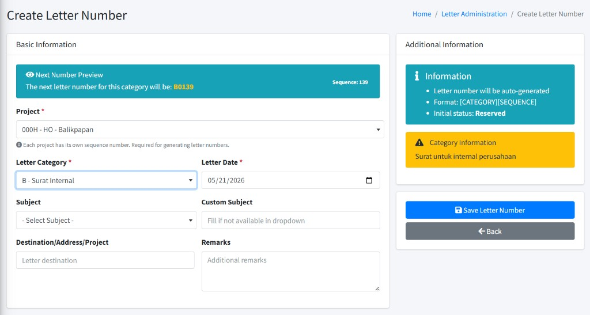
 <em>Gambar 4.1 — Create Letter Number: informasi dasar dan pratinjau nomor berikutnya</em>

### 4.1 Field dinamis per **Letter Category**

Setelah **Letter Category** dipilih, kartu tambahan muncul di bawah **Basic Information** sesuai kode kategori:

| **Kategori**             | **Kartu / field tambahan**             | **Keterangan**                                                                                                             |
| ------------------------ | -------------------------------------- | -------------------------------------------------------------------------------------------------------------------------- |
| **A**                    | **Letter Classification**              | **Classification**: **Umum**, **Lembaga Pendidikan**, atau **Pemerintah** (opsional di form; wajib saat impor kategori A). |
| **B**                    | —                                      | Tidak ada kartu khusus di form create (klasifikasi hanya kategori A).                                                      |
| **PKWT**                 | **Agreement Data** + **Employee Data** | **Type** (**PKWT** / **PKWTT**, wajib), **Duration**, **Start Date**, **End Date**; **Select Employee** opsional.          |
| **PAR**                  | **PAR Data** + **Employee Data**       | **PAR Type** (wajib): **New Hire**, **Promosi**, **Mutasi**, **Demosi**; **Select Employee** opsional.                     |
| **CRTE**, **SKPK**       | **Employee Data**                      | **Select Employee** opsional; NIK dan project karyawan terisi otomatis saat dipilih.                                       |
| **FR**                   | **Ticket Classification Data**         | **Ticket Classification** (wajib): **Pesawat**, **Kereta Api**, atau **Bus**.                                              |
| **MEMO**, **FPTK**, dll. | —                                      | Hanya field dasar; tanpa kartu dinamis khusus di form.                                                                     |

    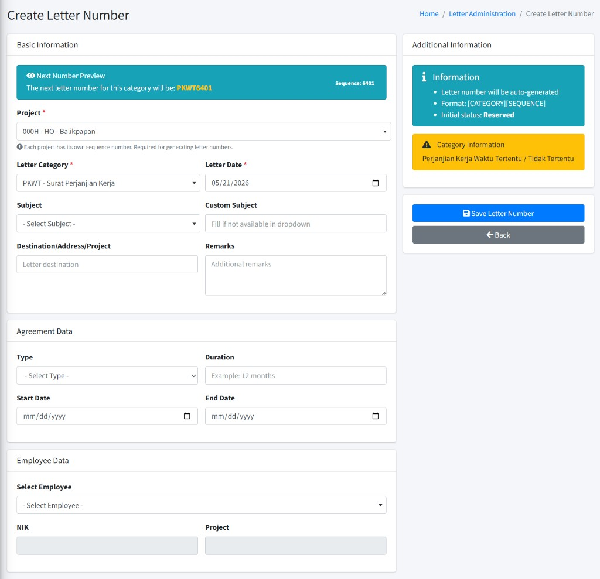
 <em>Gambar 4.2 — Contoh field dinamis kategori PKWT (Agreement Data dan Employee Data)</em>

**Catatan:**

- Memilih karyawan pada **Employee Data** dapat mengisi otomatis **Project** sesuai penempatan karyawan.
- Kategori **CRTE**, **PKWT**, **SKPK** hanya dapat dibuat oleh pengguna dengan akses project **000H**.
- Nomor surat **FR** umumnya dipakai saat menerbitkan **Letter of Guarantee** di modul **Flight Management** (lihat bab _Flight Management_).

---

## 5. Detail, ubah, dan aksi nomor surat

### Langkah-langkah — melihat detail **Letter Number Details**

1. Dari daftar, klik ikon **View** pada baris nomor surat.
2. Halaman **Letter Number Details** menampilkan:

- **Letter Number Information** — nomor, kategori, tanggal, subjek, tujuan, pembuat, tanggal pakai (jika **Used**), **Remarks**, badge status.
    - **Employee Data** — jika ada karyawan terkait (NIK, nama, project, jabatan, DOH).
    - **PKWT Data**, **PAR Data**, **Letter Classification**, atau **Ticket Classification** — sesuai kategori.
    - **Integration Information** — jika nomor sudah dipakai dokumen lain: tipe dokumen, ID, tanggal pakai, tombol **View …** (misalnya **View Letter of Guarantee**, **View Official Travel Letter**) — lihat [bagian 7](#7-integrasi-dengan-modul-lain).

    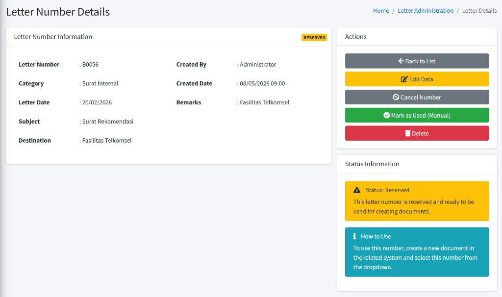
 <em>Gambar 5.1 — Detail nomor surat berstatus Reserved dengan panel Actions</em>

### Langkah-langkah — **Edit Data** (nomor Reserved)

1. Dari detail atau daftar, klik **Edit** / **Edit Data** (hanya status **Reserved**).
2. Ubah field yang diizinkan (sama seperti form create, kecuali nomor dan kategori jika sudah terkunci).
3. Klik **Update Letter Number** / **Save** untuk menyimpan.

Jika status sudah **Used** atau **Cancelled**, sistem menolak pengeditan dengan pesan _Letter number cannot be edited because it has been used or cancelled_.

### Aksi lain pada nomor **Reserved**

| **Tombol / aksi**         | **Kapan tersedia**                           | **Dampak**                                                                     |
| ------------------------- | -------------------------------------------- | ------------------------------------------------------------------------------ |
| **Cancel Number**         | Status **Reserved**                          | Status menjadi **Cancelled**; konfirmasi **Confirm Cancel** di jendela pop-up. |
| **Mark as Used (Manual)** | **Reserved**, belum ada **Related Document** | Menandai nomor terpakai tanpa dokumen sistem; tidak dapat dibatalkan.          |
| **Delete**                | **Reserved**, belum terhubung dokumen        | Menghapus permanen nomor; konfirmasi **Confirm Delete**.                       |

Panel **Status Information** di sisi kanan menjelaskan makna status dan petunjuk **How to Use** untuk nomor **Reserved**: buat dokumen di modul terkait lalu pilih nomor dari dropdown **Letter Number**.

---

## 6. Ekspor dan impor Excel

### Langkah-langkah — **Export**

1. Dari **Letter Numbers** atau dashboard, klik **Export** / **Export Excel**.
2. Berkas Excel terunduh (nama contoh: `letter-numbers-2026-05-21.xlsx`) berisi kolom antara lain: **id**, **year**, **project_code**, **letter_number**, **sequence_number**, **category_code**, **letter_date**, **status**, **destination**, **subject_master**, **nik**, **pkwt_type**, **par_type**, **ticket_classification**, dan lain-lain.
3. Gunakan hasil ekspor sebagai **template** struktur kolom atau arsip data.

### Langkah-langkah — **Import**

1. Klik **Import** / **Import Excel** (daftar atau dashboard).
2. Pada modal **Import Letter Numbers** / **Import Data Nomor Surat**, pilih berkas **.xls** atau **.xlsx**, lalu klik **Import**.
3. Jika semua baris valid, muncul pesan **Data imported successfully!** dan daftar diperbarui.
4. Jika ada baris gagal, kartu merah **Import Validation Errors** menampilkan tabel **Sheet**, **Row**, **Column**, **Value**, **Error Message**. Perbaiki berkas Excel sesuai pesan, lalu impor ulang.

### 6.1 Katalog validasi impor (contoh pesan)

| **Jenis**     | **Contoh pesan**                                                                          | **Yang dicek**                                         |
| ------------- | ----------------------------------------------------------------------------------------- | ------------------------------------------------------ |
| Kategori      | _Category Code is required._ / _The selected Category Code is invalid._                   | Kode kategori ada dan aktif.                           |
| Tanggal       | _The Letter Date must be a valid date._                                                   | **letter_date** dapat diparse.                         |
| Klasifikasi A | _Classification is required for category A._                                              | Kategori **A** wajib **classification**.               |
| PKWT          | _PKWT Type is required for category PKWT._ / _The end date must be after the start date._ | **pkwt_type**, **start_date**, **end_date** konsisten. |
| PAR           | _PAR Type is required for category PAR._                                                  | **par_type** terisi.                                   |
| FR            | _Ticket Classification is required for category FR._                                      | **ticket_classification** terisi.                      |
| Subjek        | _The subject '…' is not valid for category '…'._                                          | **subject_master** cocok dengan subjek kategori.       |
| Status        | _The Status must be one of: reserved, used, cancelled._                                   | Nilai **status** valid.                                |
| Berkas        | _Please select a file to import._ / _The file must be a file of type: xls, xlsx._         | Berkas dipilih dan bertipe Excel.                      |

Untuk daftar lengkap error impor, lihat tabel **Import Validation Errors** setelah unggah; perbaiki baris yang disebutkan sebelum mengimpor ulang.

---

## 7. Integrasi dengan modul lain

Nomor surat **Reserved** dapat dipilih saat membuat atau mengedit dokumen di modul berikut. Setelah dokumen disimpan, status nomor biasanya berubah menjadi **Used** dan muncul di **Integration Information**.

| **Modul**                     | **Pemilihan nomor**                                                           | **Kategori umum**            |
| ----------------------------- | ----------------------------------------------------------------------------- | ---------------------------- |
| **Official Travel (LOT)**     | Bagian **Letter Number** pada form LOT; **Create New** membuka form yang sama | **B** (Surat Internal)       |
| **Recruitment (FPTK)**        | Pemilihan nomor surat pada permintaan rekrutmen                               | **FPTK**                     |
| **Flight Management (LG)**    | **Letter Number** saat **Create Letter of Guarantee**                         | **FR**                       |
| **PKWT / offering rekrutmen** | Otomatis atau manual sesuai alur rekrutmen                                    | **PKWT**, **CRTE**, **SKPK** |

### Langkah-langkah — melihat **Integration Information**

1. Buka detail nomor surat (**Letter Number Details**) yang sudah berstatus **Used** (badge hijau).
2. Di bawah **Letter Number Information**, baca kartu tambahan sesuai kategori (misalnya **Ticket Classification** untuk kategori **FR**).
3. Kartu **Integration Information** menampilkan:
    - Pesan **Letter Number Already Used** — nomor sudah terhubung dokumen sistem.
    - **Document Type** — jenis dokumen sumber (misalnya penerbitan **Letter of Guarantee** / LG).
    - **Document ID** — identifikasi dokumen terkait.
    - **Usage Date** — waktu nomor ditandai terpakai.
4. Klik **View …** (misalnya **View Letter of Guarantee**, **View Official Travel Letter**, **View Recruitment Session**) untuk membuka halaman dokumen terkait.
5. Panel **Status Information** di kanan menampilkan **Status: Used** — nomor tidak dapat diubah lagi; tombol **Actions** hanya **Back to List**.

| **Document Type** (contoh di layar)           | **Tombol tautan**               | **Halaman tujuan**                                |
| :-------------------------------------------- | :------------------------------ | :------------------------------------------------ |
| `Officialtravel`                              | **View Official Travel Letter** | Detail LOT                                        |
| `Recruitment_request`                         | **View Recruitment Request**    | Detail FPTK                                       |
| `Recruitment_offering` / `Recruitment_hiring` | **View Recruitment Session**    | Detail sesi kandidat (rekrutmen)                  |
| `Flight_request_issuance`                     | **View Letter of Guarantee**    | Detail LG (**Flight Management** → **Issuances**) |
| `Employee_bond`                               | **View Employee Bond**          | Detail employee bond                              |

    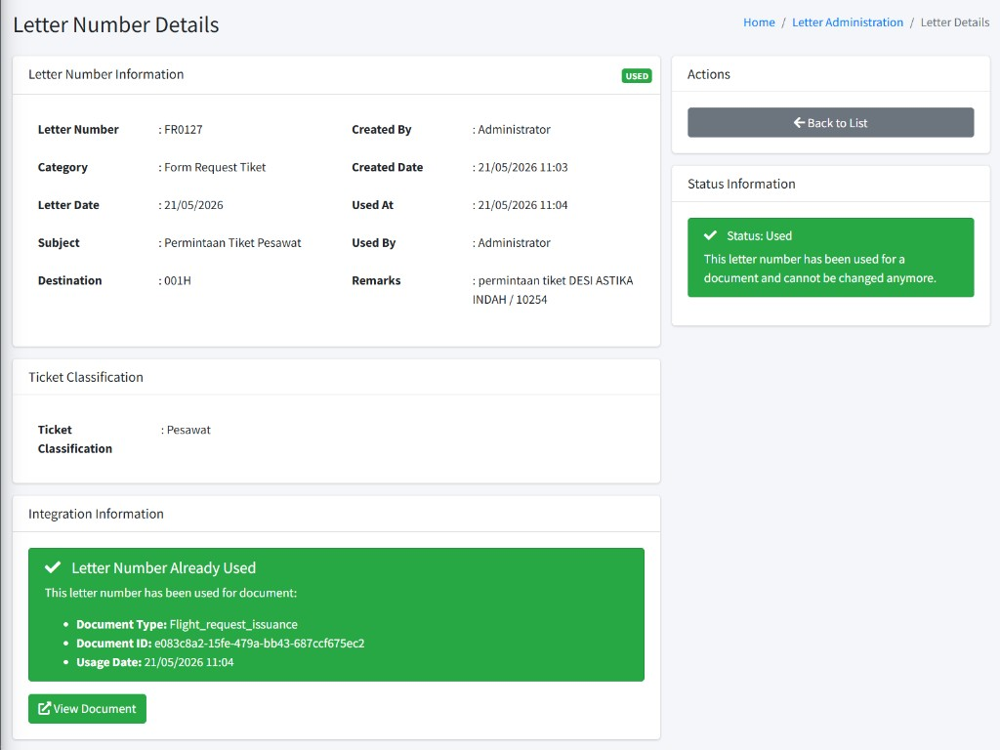
 <em>Gambar 7.1 — Detail nomor surat terintegrasi (contoh kategori FR dipakai Letter of Guarantee)</em>

**Catatan:** Alur pemilihan **Letter Number** pada LOT dijelaskan juga di bab _Official Travel Management_ (bagian formulir **Letter Number**). Modul **Letter Administration** fokus pada pembuatan, persediaan, dan monitoring nomor; pemakaian di formulir modul lain tidak menggantikan pencatatan di sini.

---

## 8. Master data terkait (Letter Categories)

Sebelum penomoran rutin, pastikan **Letter Categories** dan **Letter Subjects** sudah benar di **Master Data** → **Letter Management Data**. Setiap kategori memiliki **Numbering Behavior** (**Annual Reset** / **Continuous**) yang mempengaruhi urutan di dashboard **Estimated Next Numbers**.

### Langkah-langkah — membuka **Letter Categories**

1. Buka **GENERAL SECTION** → **Master Data** → **Letter Management Data** → **Letter Categories** (atau klik **Manage Categories** dari **Quick Actions** di dashboard).
2. Judul halaman: **Letter Categories**; subjudul kartu: **List of Letter Categories**.
3. Tabel menampilkan kolom **No**, **Code**, **Category Name**, **Description**, **Behavior** (**Annual Reset** / **Continuous**), **Subjects** (jumlah subjek), **Status**, dan **Actions** (ikon **Manage Subjects**, **Edit**, **Delete**).
4. Klik **Add Category** untuk kategori baru; dari kolom **Subjects** atau ikon daftar, buka **Letter Subjects** per kategori.

Ringkasan setup:

1. **Letter Categories** — kode, nama, perilaku penomoran, status aktif.
2. **Letter Subjects** — subjek per kategori (**Manage Subjects** dari baris kategori).
3. Jangan hapus kategori/subjek yang masih dipakai nomor aktif.

    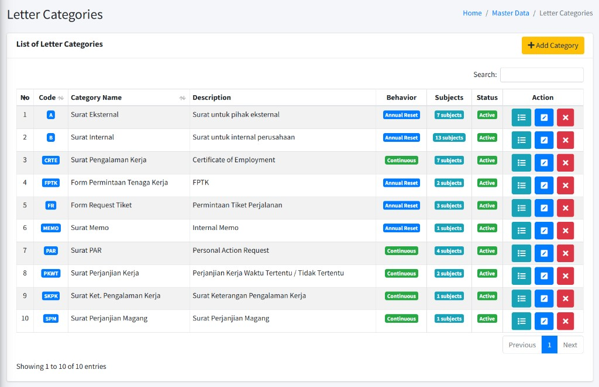
 <em>Gambar 8.1 — Daftar Letter Categories di Master Data</em>

Detail field lengkap dan pengelolaan subjek dijelaskan juga di bab _Master Data_, bagian **Letter Management Data**.

---

## 9. Kesalahan & bantuan

| **Gejala / pesan (contoh)**                                            | **Kemungkinan penyebab**                                      | **Apa yang bisa dicoba**                                                                                                       |
| ---------------------------------------------------------------------- | ------------------------------------------------------------- | ------------------------------------------------------------------------------------------------------------------------------ |
| Menu **Letter Administration** tidak muncul                            | Akun tanpa hak akses nomor surat                              | Minta administrator menambahkan izin modul **Letter Numbers**.                                                                 |
| Daftar nomor kosong padahal ada data                                   | Filter project/status aktif; project akun tidak mencakup data | Reset filter; pastikan akun terhubung ke **project** yang benar.                                                               |
| Tidak bisa pilih kategori **PKWT** / **CRTE** / **SKPK**               | Akun tidak terhubung project **000H**                         | Hubungi administrator project/akses HO.                                                                                        |
| _Letter number cannot be edited because it has been used or cancelled_ | Status bukan **Reserved**                                     | Buat nomor baru; nomor **Used**/**Cancelled** tidak dapat diubah.                                                              |
| _Letter number cannot be deleted because it is linked to a document_   | Nomor sudah dipakai modul lain                                | Buka dokumen terkait dari **Integration Information** atau **View Document**.                                                  |
| _You do not have access to this letter number_                         | Nomor milik project di luar akses Anda                        | Gunakan akun dengan akses project yang sama atau minta penyesuaian hak.                                                        |
| **Next Number Preview** tidak muncul                                   | **Project** atau **Letter Category** belum dipilih            | Lengkapi kedua field; refresh halaman jika perlu.                                                                              |
| Impor gagal banyak baris                                               | Format kolom, kategori, atau field wajib per kategori salah   | Baca **Import Validation Errors** ([bagian 6.1](#61-katalog-validasi-impor-contoh-pesan)); bandingkan dengan hasil **Export**. |
| Nomor tidak muncul di dropdown modul lain                              | Status bukan **Reserved** atau project tidak cocok            | Buat nomor baru **Reserved** untuk project yang sama; cek filter di pemilih nomor.                                             |

### Menghubungi administrator

Siapkan **username** (bukan password), waktu kejadian, menu yang dibuka (**Dashboard** / **Letter Numbers**), **project**, **Letter Category**, nomor surat jika ada, serta cuplikan pesan error atau baris **Import Validation Errors**. Administrator dapat mengecek hak akses project, kategori terbatas **000H**, dan integrasi dokumen terkait.

---

---

# My Dashboard & My Features

Bab ini ditujukan untuk **seluruh karyawan** yang memiliki akun di sistem ARKA HERO. Panduan ini mencakup halaman personal karyawan: **My Dashboard** sebagai pusat ringkasan aktivitas, halaman **Update Profile** untuk mengubah username dan password, serta semua submenu dalam **My Features** — **My Profile**, **My Leave Request**, **My Official Travel Request**, **My Flight Request**, **My Overtime Request**, dan **My Recruitment Request**. Seluruh label antarmuka dalam bab ini menggunakan bahasa Inggris sesuai tampilan di aplikasi.

---

## Glosarium

| **Istilah**              | Arti singkat                                                                                       |
| :----------------------- | :------------------------------------------------------------------------------------------------- |
| **My Dashboard**         | Halaman ringkasan personal karyawan yang menampilkan statistik dan aktivitas terkini seluruh fitur |
| **My Features**          | Kelompok menu di sidebar yang berisi akses ke semua fitur mandiri karyawan                         |
| **LOT**                  | _Letter of Travel_ — surat tugas perjalanan dinas resmi                                            |
| **FPTK**                 | _Formulir Permintaan Tenaga Kerja_ — dokumen permintaan rekrutmen karyawan baru                    |
| **Entitlement**          | Jatah/hak cuti yang diberikan kepada karyawan per periode                                          |
| **NIK**                  | Nomor Induk Karyawan — identitas unik karyawan di sistem                                           |
| **DOH**                  | _Date of Hire_ — tanggal mulai bekerja di perusahaan                                               |
| **FOC**                  | _Final of Contract_ — tanggal berakhirnya kontrak                                                  |
| **Draft**                | Status permintaan yang belum diajukan; masih bisa diedit atau dihapus                              |
| **Pending**              | Permintaan telah diajukan dan menunggu persetujuan approver                                        |
| **Approved**             | Permintaan telah disetujui                                                                         |
| **Rejected**             | Permintaan ditolak oleh approver                                                                   |
| **Cancelled**            | Permintaan dibatalkan oleh karyawan                                                                |
| **Issued**               | Tiket penerbangan telah diterbitkan (khusus Flight Request)                                        |
| **Finished**             | Lembur telah selesai dan dicatat (khusus Overtime Request)                                         |
| **Approver**             | Atasan atau pejabat yang berwenang menyetujui/menolak permintaan                                   |
| **LSL**                  | _Long Service Leave_ — cuti masa kerja panjang yang dapat dikombinasikan dengan _cash out_         |
| **Standalone**           | Permintaan tiket penerbangan yang tidak terkait dengan cuti maupun perjalanan dinas                |
| **Profile Completeness** | Persentase kelengkapan data profil karyawan di sistem                                              |

---

## 1. My Dashboard

**My Dashboard** adalah halaman pertama yang muncul setelah karyawan masuk ke aplikasi. Untuk mengaksesnya, klik menu **My Dashboard** di sidebar.

    
 <em>Gambar 1.1a — Atas: welcome, tab, enam kartu ringkas</em>

    
 <em>Gambar 1.1b — Cuti terkini &amp; perjalanan dinas</em>

    
 <em>Gambar 1.1c — Flight, rekrutmen, profil, lembur</em>

### Langkah-langkah — Membaca My Dashboard

Halaman terdiri atas beberapa area utama yang dapat dibaca dari atas ke bawah:

---

**1. Welcome Card**

Area teratas menampilkan sapaan _"Welcome back, [Nama Anda]"_ beserta kalimat singkat pengantar.

---

**2. Peringatan Username Belum Diisi**

Jika Anda belum mengisi **Username**, sistem menampilkan banner peringatan berwarna kuning bertuliskan **Username Belum Diisi**. Teks penjelasan meminta Anda melengkapi username di halaman yang sama dengan formulir **Change Password** (judul kartu pada halaman tersebut adalah **Update Profile**). Klik **Isi Username Sekarang** di banner untuk dibawa ke halaman itu. Untuk langkah mengisi username dan sandi, lihat [bagian 2. Update Profile](#update-profile). Username diperlukan untuk login selain menggunakan email.

    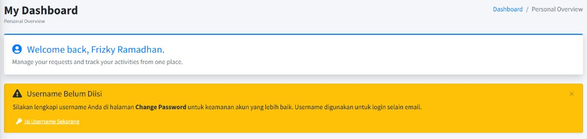
 <em>Gambar 1.2 — Peringatan username belum diisi</em>

**Catatan:** Peringatan ini hanya muncul selama username masih kosong. Setelah diisi, banner tidak akan tampil lagi.

---

**3. Tab Navigasi Fitur**

Di bawah welcome card terdapat baris tab bernama:

- **Overview** — menampilkan semua kartu statistik sekaligus (tampilan default).
- **Profile** — menyaring tampilan ke kartu dan informasi profil saja.
- **Leave Request** — menyaring ke statistik dan riwayat cuti saja.
- **Official Travels Request** — menyaring ke statistik dan riwayat perjalanan dinas.
- **Flight Request** — menyaring ke statistik dan riwayat permintaan tiket pesawat.
- **Overtime Request** — menyaring ke statistik lembur.
- **Recruitment Request** — menyaring ke statistik permintaan rekrutmen.
- **Approvals** — muncul hanya jika Anda memiliki peran _approver_.

Klik salah satu tab untuk fokus pada modul tertentu. Klik **Overview** untuk kembali ke tampilan lengkap.

---

**4. Kartu Statistik**

Setiap fitur ditampilkan sebagai kartu ringkasan yang menunjukkan:

- **Profile** — persentase kelengkapan profil beserta _progress bar_. Tombol **View Profile** membuka halaman **My Profile**.
- **Official Travels** — jumlah total perjalanan dinas dan jumlah yang akan datang (_Upcoming_). Tombol **View Details** membuka **My Official Travel Request**.
- **Leave Requests** — jumlah total permintaan cuti dan jumlah yang disetujui (_Approved_). Tombol **View Details** membuka **My Leave Request**.
- **Flight Requests** — jumlah total permintaan tiket dan yang sudah disetujui/diterbitkan (_Approved/Issued_). Tombol **View Details** membuka **My Flight Request**.
- **Recruitment** — jumlah total permintaan FPTK dan yang disetujui. Tombol **View Details** membuka **My Recruitment Request**.
- **Overtime** — jumlah total permintaan lembur, jumlah _Pending_, dan jumlah yang _Approved/Selesai_. Tombol **View Details** membuka **My Overtime Request**.
- **Pending Approvals** — muncul hanya untuk _approver_; menampilkan jumlah permintaan yang menunggu tindakan. Tombol **Review Now** membuka halaman persetujuan.

    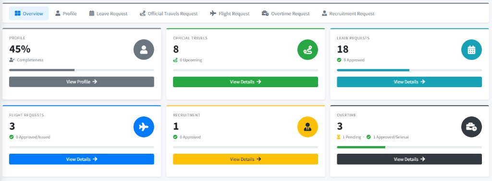
 <em>Gambar 1.3 — Enam kartu statistik tab Overview</em>

---

**5. Daftar Aktivitas Terkini**

Di bawah kartu statistik, aktivitas ditampilkan sebagai **beberapa widget dalam grid**: pada layar lebar biasanya **dua kolom** per baris. Widget-widget ini mengikuti tab dashboard yang aktif — pada tab **Overview**, keenam area berikut tampil bersamaan.

**Baris pertama**

- **Recent Leave Requests** dan **Current Leave Entitlements** berada dalam **satu kartu** dengan **dua tab** di bagian atas kartu. Tab default **Recent Leave Requests** menampilkan daftar permohonan cuti terbaru (jenis cuti, rentang tanggal, jumlah hari, badge status seperti **Approved**, **Pending**, **Rejected**, **Auto approved**, dll.). Tombol **View All** membuka **My Leave Request**. Beralih ke tab **Current Leave Entitlements** untuk melihat saldo per jenis cuti dalam panel _accordion_: **Entitled**, **Used**, **Remaining**, teks **Valid until**, serta tombol **Request [nama jenis cuti]** atau **No Balance Available** jika saldo habis. Gunakan **Expand All** / **Collapse All** untuk membuka atau menutup semua jenis sekaligus; **Details** membuka halaman **My Leave Entitlement**. Jika entitlement belum diatur, muncul pesan untuk menghubungi **HR HO Balikpapan**.
- **Recent Official Travels** — kartu terpisah di kolom kanan: tujuan, tanggal LOT, kode proyek, baris **Departure** atau **Arrival** terakhir (jika ada), dan status (**Submitted**, **Approved**, **Rejected**, **Closed**, dll.). **View All** membuka **My Official Travel Request**.

    
 <em>Gambar 1.4a — Baris pertama: cuti &amp; dinas</em>

**Baris kedua**

- **Recent Flight Requests** — nomor form, nama karyawan, tanggal dibuat, badge status (**Draft**, **Submitted**, **Approved**, **Issued**, **Completed**, **Rejected**, **Cancelled**, dll.). Setiap baris dapat diklik untuk membuka detail. **View All** membuka **My Flight Request**. Jika kosong dan Anda punya hak akses, dapat muncul tombol **Create Flight Request**.
- **Recent Recruitment** — ringkasan permintaan FPTK terbaru: nomor surat/permintaan, nama posisi, departemen, nama proyek (jika ada), tanggal, dan status permohonan. Baris dapat diklik untuk membuka detail. **View All** membuka **My Recruitment Request**. Jika kosong dan Anda punya hak akses, dapat muncul tombol **Create FPTK**.

    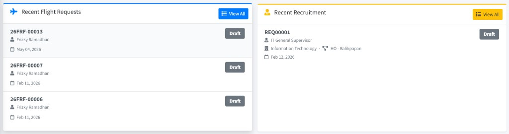
 <em>Gambar 1.4b — Baris kedua: flight &amp; rekrutmen</em>

**Baris ketiga**

- **Profile Completeness** — persentase **Complete** dengan bilah progres berwarna dan tombol **See Profile** menuju **My Profile**. Jika ada data kurang, kotak **Missing Information:** menampilkan label seksi (misalnya **Bank Account**, **Tax Identification**, **Family**, **Job Experience**, **Emergency Contact**, dll.) dan kalimat _"Please contact HR Department to update your profile information."_ Jika sudah lengkap, ditampilkan pesan selamat datang profil lengkap.
- **Recent Overtime Requests** — di bagian atas konten kartu ada baris **Keterangan:** (bahasa Indonesia) yang menjelaskan bahwa daftar mencakup pengajuan yang Anda buat sendiri serta yang Anda ikuti sebagai karyawan pada baris detail (misalnya ditambahkan admin/HR). Setiap entri menampilkan nama proyek, **Tanggal lembur**, cap waktu pembuatan, dan badge status (**DRAFT**, **PENDING**, **APPROVED**, **REJECTED**, **FINISHED**). Klik baris untuk membuka detail; **View All** membuka **My Overtime Request**.

    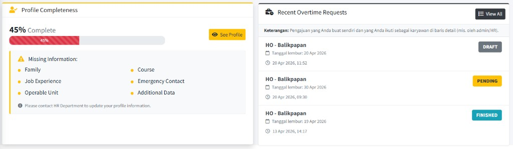
 <em>Gambar 1.4c — Baris ketiga: profil &amp; lembur</em>

**Catatan:** Susunan keempat widget bawah dalam satu cuplikan penuh juga terlihat pada [Gambar 1.1c](#gambar-11c) di pembuka bab.

---

## 2. Update Profile

Halaman **Update Profile** memungkinkan Anda mengubah nama tampilan, mengatur **Username** untuk login, serta mengganti password akun. Halaman ini dapat diakses dengan mengklik nama Anda di panel atas sidebar, atau melalui tautan pada peringatan di **My Dashboard** (tombol **Isi Username Sekarang** pada banner **Username Belum Diisi** — lihat [Gambar 1.2](#my-dashboard-username-warning)).

**Navigasi:** Klik nama Anda di sidebar → halaman **Update Profile** terbuka.

### Langkah-langkah — Update Profile & Change Password

**1. Full Name**

Isi kolom **Full Name** dengan nama lengkap yang ingin ditampilkan di sistem. Field ini wajib diisi.

**2. Username**

Isi kolom **Username** dengan nama pengguna unik yang akan digunakan untuk login selain email. Aturan:

- Minimal 3 karakter
- Hanya boleh mengandung huruf, angka, tanda hubung (`-`), dan _underscore_ (`_`)
- Harus unik — tidak boleh sama dengan pengguna lain

**Catatan:** Username bersifat **wajib**. Jika belum diisi, sistem menampilkan peringatan di **My Dashboard**.

**3. Email**

Kolom **Email** ditampilkan sebagai referensi saja dan **tidak dapat diubah** melalui halaman ini.

**4. Change Password** _(opsional)_

Jika ingin mengganti password, isi tiga field berikut:

- **Current Password** — password yang sedang aktif saat ini
- **New Password** — password baru (minimal 5 karakter)
- **Confirm New Password** — ulangi password baru untuk konfirmasi

Jika tidak ingin mengganti password, **biarkan ketiga field ini kosong**.

**5. Simpan Perubahan**

Klik tombol **Update Profile** untuk menyimpan semua perubahan. Klik **Cancel** untuk kembali ke halaman sebelumnya tanpa menyimpan.

    
 <em>Gambar 2.1 — Update Profile &amp; Change Password</em>

Di sebelah kanan form, panel **User Information** menampilkan informasi akun saat ini: nama, username, email, status akun, nama karyawan tertaut, peran (_Roles_), dan tanggal bergabung (_Member Since_). Informasi ini hanya untuk referensi dan tidak dapat diubah langsung dari panel ini.

---

## 3. My Profile

**My Profile** menampilkan seluruh data karyawan yang tersimpan di sistem, mulai dari data pribadi, data kepegawaian, hingga dokumen pendukung. Halaman ini bersifat **hanya baca** — perubahan data harus diajukan melalui HR Department dengan dokumen pendukung.

**Navigasi:** **My Features** → **My Profile**

**Catatan:** Untuk memperbarui data profil, hubungi HR Department secara tertulis dengan menyertakan dokumen pendukung (KTP, buku tabungan, NPWP, dll.) selama jam kerja.

### Langkah-langkah — Membaca My Profile

Halaman **My Profile** menggunakan navigasi **stepper** (ikon melingkar berjejer) di bagian atas. Klik salah satu tab untuk membuka isi bagian tersebut. Di bawah judul profil, banner informasi menjelaskan bahwa pembaruan data dilakukan melalui HR dengan permohonan tertulis dan dokumen pendukung.

    
 <em>Gambar 3.1 — Stepper tab My Profile</em>

<strong>Baca warna ikon:</strong> lingkaran <strong>biru</strong> — tab yang sedang aktif (isi bagian itu ditampilkan di layar). Lingkaran <strong>abu-abu tua</strong> — untuk bagian tersebut data sudah tersedia di sistem. Lingkaran <strong>abu-abu muda</strong> — data untuk bagian tersebut belum tersedia.

Tab yang tersedia beserta isinya:

**Personal** — Data pribadi: **Full Name**, **ID Card No.**, **Place/Date of Birth**, **Blood Type**, **Religion**, **Nationality**, **Gender**, **Marital**, tautan unduh **KTP** dan **KK**. Di bawahnya: **Address & Contact** (Address, City, Postal Code, Phone, Email).

**Employment** — Data kepegawaian aktif: **NIK**, **Position**, **Department**, **Project**, **Grade**, **Level**, **Class**, **Date of Hire (DOH)**, **End of Contract (FOC)** jika ada. Jika pernah berpindah posisi, tabel **Employment History** menampilkan riwayat lengkap.

**Bank** — Rekening penggajian: **Bank Name**, **Account Number**, **Account Name**, **Branch** (jika ada), dan tautan unduh **Passbook / statement**.

**Tax** — Informasi pajak: **NPWP Number**, **Registration Date**, dan tautan unduh **NPWP document**.

**Insurances** — Tabel asuransi: **Insurance Type** (BPJS Ketenagakerjaan / BPJS Kesehatan), **Insurance Number**, **Health Facility**, **Remarks**, tautan unduh dokumen.

**Licenses** — Tabel SIM/lisensi: **License Type**, **License Number**, **Expiry Date**, tautan unduh dokumen.

**Families** — Tabel anggota keluarga: **Relationship**, **Name**, **Birthplace**, **Date of Birth**, **Remarks**, **BPJS Kesehatan No**.

**Educations** — Tabel riwayat pendidikan: **Education Name**, **Address**, **Year**, **Remarks**, tautan unduh **Ijazah**.

**Courses** — Tabel pelatihan/kursus: **Course Name**, **Address**, **Year**, **Remarks**.

**Experiences** — Tabel riwayat pekerjaan: **Company Name**, **Company Address**, **Position**, **Duration**, **Quit Reason**.

**Emergencies** — Tabel kontak darurat: **Relationship**, **Name**, **Address**, **Phone**.

**Units** — Tabel unit yang dapat dioperasikan: **Unit Name**, **Unit Type / Class**, **Remarks**.

**Additional** — Data tambahan: **Clothing Information** (Shirt Size, Pants Size, Shoes Size) dan **Address Information** (City, Postal Code).

**Images** — Galeri foto karyawan. Klik foto untuk memperbesar.

**Catatan:** Jika sebuah tab menampilkan _"No Data Available"_, artinya data belum tersedia di sistem. Hubungi HR untuk melengkapinya.

---

## 4. My Leave Request

Bagian ini **diselaraskan** dengan _Leave Management_ — bagian 5: Untuk karyawan secara personal — **My Leave Request** supaya langkah, istilah, dan tangkapan layar sama dengan panduan utama cuti.

**My Leave Request** dipakai untuk pengajuan cuti atau izin yang biasanya memakai **Formulir Izin Meninggalkan Pekerjaan** atau **Formulir Cuti Panjang** secara personal atau pribadi.

**Navigasi:** **My Features** → **My Leave Request**

### Langkah-langkah — daftar dan pengajuan cuti pribadi

1. Di kiri layar, buka grup **My Features**, lalu klik **My Leave Request**. Akan muncul halaman yang menunjukkan Anda berada di daftar pengajuan cuti pribadi. Gunakan **filter**, **pencarian**, atau **urutan** di atas tabel jika tersedia, supaya mudah mencari satu baris pengajuan. Perhatikan **Project**, **Leave Type**, tanggal mulai/akhir, **Total Days**, dan **Status** untuk menemukan pengajuan lama atau yang sedang berjalan.

    
 <em>Gambar 4.2 — Daftar My Leave Request</em>

3. Untuk **melihat saldo entitlement cuti** Anda (sisa hari per jenis cuti dan per periode), dari halaman **My Leave Request** klik tombol **My Leave Entitlement** di samping tombol **Add**.

    **Apa yang tampil pada halaman My Leave Entitlements:**
    - **My Information** — ringkasan data Anda (misalnya NIK, nama, project, level, jabatan, DOH, lama masa kerja, status, jenis staff). Tombol **Back to My Requests** mengembalikan Anda ke daftar pengajuan pada langkah 2.
    - **Leave Entitlements Summary** — judul blok ringkasan; tombol **+ Request Leave** (bila izin mengajukan aktif) membuka formulir pengajuan cuti baru.
    - **Available Periods** — bila ada **lebih dari satu periode entitlement** aktif di sistem, daftar periode muncul di kolom kiri; klik periode untuk memfilter tabel ke periode tersebut (sampai **10 periode terakhir** tercantum di daftar ini).
    - **Entitlement Details** — tabel per jenis cuti, dikelompokkan menurut kategori (misalnya _Annual Leave_). Kolom utama biasanya: **Leave Type**, **Entitled** (hak hari), **Taken** (sudah terpakai), **Remaining** (sisa), **Period** (tanggal mulai–akhir berlaku entitlement), dan **Actions**. Bilah kemajuan di bawah baris memberi gambaran cepat proporsi sisa terhadap hak.
    - **Actions** — tombol **Request** (bila tersedia) membuka form pengajuan untuk jenis cuti baris tersebut ketika masih ada sisa dan periode belum kedaluwarsa; tombol **Details** membuka **View Calculation Details** untuk melihat penjelasan perhitungan angka pada baris tersebut.
    - Tanda **Expired** atau **Expiring Soon** pada baris membantu melihat entitlement yang sudah tidak berlaku atau akan segera berakhir.
    - Jika tidak ada baris untuk periode yang dipilih, pesan seperti **No Entitlements Found** dapat muncul. Jika Anda belum pernah memiliki entitlement sama sekali, halaman dapat menyarankan menghubungi **HR** sesuai teks di layar.

    Jika tombol **My Leave Entitlement** sama sekali tidak muncul, administrator mungkin belum memberi izin akun Anda untuk melihat entitlement pribadi — hubungi **HR** atau **administrator**.

    
 <em>Gambar 4.3 — My Leave Entitlements</em>

4. Untuk pengajuan baru, klik tombol **Add** dari halaman **My Leave Request**, atau bisa dari halaman **My Leave Entitlement**.

    
 <em>Gambar 4.4 — Tombol Add pengajuan baru</em>

5. **Isi formulir pengajuan**
    - **Employee** dan **Project**. Data Employee dan Project sudah terisi sesuai dengan data karyawan. Jika data Employee dan Project menampilkan **N/A - N/A**, hubungi HR untuk menghubungkan data karyawan dengan user Anda.
    - **Leave Type** dan **Leave Period** — periode hak biasanya mengikuti entitlement; bila **Leave Period** kosong, hubungi HR soal saldo cuti / **Leave Entitlement**.
    - **Pola per jenis cuti** — **Cuti Tahunan (1.01)** tanpa dokumen tambahan wajib; **Izin Dibayar (2.xx)** dapat memunculkan **Supporting Document**; **Izin Tanpa Upah (3.01)** wajib isi **Reason**; **Cuti Panjang (4.01)** memunculkan blok **LSL** (**Leave Days**, **Cash Out**, dsb.).
    - **Leave Date**, **Back to Work Date**, **Total Days** — aturan kalender **roster** / **non-roster** dan **hari libur nasional** sama seperti di panduan HR.
    - **Flight Request** dan **Approver Selection** — centang tiket bila perlu; tambahkan approver sampai aturan di layar terpenuhi. Klik **Approval Rules Information** untuk melihat aturan approval untuk pengajuan cuti.
    - **Save & Submit** atau **Cancel** — kirim ke alur persetujuan, atau tinggalkan form tanpa simpan.

    
 <em>Gambar 4.5 — Form Create My Leave Request</em>

### Melihat detail permohonan yang sudah diajukan

Setelah Anda mengirim pengajuan, pantau statusnya dari daftar **My Leave Request**. Untuk membuka ringkasannya:

1. Pada baris permohonan yang dimaksud, di kolom **Actions**, klik **View** (ikon mata).
2. Halaman **Leave Request Detail** menampilkan nomor register (misalnya **26LV-00004**), tanggal pengajuan, **badge status** utama (**Pending**, **Approved**, **Rejected**, dll.), serta blok **Leave Request Information**: **Employee**, **Leave Type**, **Start Date** / **End Date**, **Total Days**, **Back to Work Date**, **Requested At**, **Leave Period**.
3. Sebagai contoh, jika Anda mengajukan **Cuti Panjang** (**Long Service Leave**, misalnya kode **4.01**), blok **Additional Information** berisi **LSL Breakdown**: **Leave Taken** (hari dipakai sebagai cuti), **Cash Out** (hari yang dicairkan tunai), dan **Total LSL Used**. Kotak informasi kuning dapat menjelaskan bahwa pengajuan mencakup bagian _cash out_. Blok **Additional Information** tergantung jenis cuti yang dipilih.
4. Di sisi kanan, kartu **Flight Request** muncul bila Anda mencentang pemesanan tiket pada formulir. Kartu itu memuat nomor referensi tiket, ringkasan segmen (asal–tujuan dan tanggal), serta status permintaan tiket sendiri. Status **Draft** pada kartu tersebut berarti permintaan tiket yang terikat dengan cuti itu **belum disetujui / belum diproses lebih lanjut** dalam alur tiket — mengikuti keputusan persetujuan cuti dan prosedur **Flight Management** (koordinasi dengan HR HO Balikpapan sesuai kebijakan). Gunakan **View** pada kartu jika tersedia untuk detail penerbangan.
5. Kartu **Selected Approvers** menampilkan nama dan status tiap **approver** (**Pending** sampai ada keputusan). Tombol seperti **Back to List**, **Edit Request**, dan **View Entitlements** muncul sesuai status pengajuan dan hak akses Anda (**Edit Request** biasanya hanya saat pengajuan masih dapat diubah).

    
 <em>Gambar 4.5b — Detail cuti (LSL &amp; Flight Draft)</em>

### **Cara Membatalkan Cuti yang Sudah Disetujui**

Proses pembatalan cuti yang telah disetujui mengacu pada **Bagian 3 — Leave Request Detail, Approval, Close Request, Request Cancellation** di panduan _Leave Management_. Ikuti langkah-langkah berikut:

1. **Buka Daftar Pengajuan**  
   Masuk ke halaman **My Leave Request**, lalu cari pengajuan cuti yang berstatus **Approved**. Klik **View** pada kolom **Actions** untuk membuka detail pengajuan.

2. **Akses Fitur Pembatalan**  
   Pada halaman **Leave Request Detail**, jika tersedia, klik tombol **Request Leave Cancellation** sesuai dengan status cuti Anda.

3. **Isi Formulir Pembatalan**  
   Lengkapi **Cancellation Request Form** yang muncul:
    - **Days to Cancel** (wajib diisi; bisa pisahkan hari tertentu jika perlu)
    - **Reason for Cancellation** (alasan wajib diisi)
    - Baca dan pahami panel **Important Notes**
      Setelah lengkap, pilih **Submit Cancellation Request** untuk mengirim permintaan pembatalan, atau klik **Cancel** jika ingin membatalkan proses tanpa mengajukan. Contoh tampilan formulir ada pada cuplikan **Gambar 3.21** di panduan _Leave Management_.

4. **Tindak Lanjut oleh HR & Status**  
   Permintaan pembatalan akan diproses oleh tim **HR** sesuai antrean (**Pending Cancellation Requests**). Anda dapat memantau status keputusan pada daftar cuti. Pengembalian saldo cuti akan mengikuti aturan dan keputusan akhir sesuai aplikasi.

    
 <em>Gambar 4.6 — Request Leave Cancellation</em>

**Catatan:** Proses pengajuan **Flight Request** (tiket/perjalanan) yang terikat pada pengajuan cuti diarahkan kepada **tim HR HO Balikpapan** serta alur **Flight Management** untuk pelaksanaan dan koordinasi, mengikuti kebijakan HO Balikpapan.

---

## 5. My Official Travel Request

Bagian ini **diselaraskan** dengan dokumen _Official Travel Management (LOT)_ — bagian 6: Karyawan (non–HR) — **My Official Travel Request**.

**Navigasi:** **My Features** → **My Official Travel Request**

### Langkah-langkah — Daftar Perjalanan Dinas dan Pengajuan Baru

1. Pada sidebar, klik **My Features** lalu pilih **My Official Travel Request**. Halaman ini menampilkan daftar Surat Perjalanan Dinas (LOT) di mana Anda terdaftar sebagai **Main Traveler** maupun **Follower**.
2. Buka panel **Filter** bila perlu; gunakan **Travel Number**, **Status**, **Role** (**Main Traveler** / **Follower**), dan kriteria lain jika tersedia.
3. Klik **New Request** untuk membuka halaman tambah permohonan.
4. Mengisi form **Add My Official Travel (LOT)**. Di bagian atas form terdapat **banner informasi** (latar biru) dengan pesan bahwa permintaan akan dikirim ke HR, serta bahwa **nomor surat** dan **nomor LOT resmi** akan ditetapkan oleh HR setelah konfirmasi.

    
 <em>Gambar 5.1 — Form Add My Official Travel (LOT)</em>

- **Travel Information** (kolom utama; field bertanda \* di layar adalah **wajib**):
- **LOT Number** — **read-only**. Menampilkan nomor sementara berformat **REQxxxxx** (contoh placeholder seperti `# REQ00001`). Nomor final mengikuti keputusan HR setelah pengajuan diproses.
- **Main Traveler** — **read-only**, terisi otomatis dengan NIK dan nama Anda sebagai pengaju utama.
- **LOT Date** \* — tanggal dokumen/permohonan LOT.
- **LOT Origin** \* — pilih asal perjalanan (biasanya project atau lokasi asal) lewat dropdown **Select an option**.
- **Title**, **Business Unit**, **Department** — **read-only**, ringkasan jabatan dan unit kerja pemilih utama; mengikuti data terpasang pada akun/pekerjaan Anda di sistem.
- **Purpose** \* — deskripsi maksud/tujuan perjalanan dinas (area teks).
- **Destination** \* — tujuan perjalanan (teks).
- **Departure Date** \* — tanggal rencana keberangkatan.
- **Duration** \* — lamanya perjalanan (misalnya dalam hari; ikuti contoh placeholder di field seperti `e.g. 5 days`).
- Klik **Add Follower** untuk menambah baris jika ada karyawan lain yang ikut dalam perjalanan.
- Pada tiap baris, pilih karyawan lewat **Select Employee**; kolom **NIK/Name**, **Title**, **Business Unit**, dan **Department** akan mengikuti data karyawan terpilih.
- Gunakan ikon **X** pada kolom **Action** untuk menghapus baris pengikut.
- **Transportation** \* — pilih moda transportasi (nilai dari data master organisasi).
- **Accommodation** \* — pilih opsi akomodasi (nilai dari data master organisasi).
- Centang **Check if you need flight ticket reservation** jika Anda membutuhkan pemesanan tiket pesawat untuk perjalanan ini. Setelah dicentang, isian segmen penerbangan akan mengikuti aturan form di layar Anda.
- **Submit to HR** — mengirim permohonan ke HR. Nomor **REQxxxxx** tetap berlaku sebagai penanda sampai HR menetapkan nomor surat dan LOT resmi.
- **Cancel** — meninggalkan halaman tanpa mengirim (pastikan data tidak hilang jika layar memperingatkan).

5. Untuk melihat detail atau mengubah entri yang sudah ada: kembali ke daftar, lalu gunakan **View** atau **Edit** pada baris terkait (ketersediaan **Edit** mengikuti status dan kebijakan sistem).
6. HR akan memproses konfirmasi, antara lain menetapkan nomor LOT resmi (contoh format **ARKA/Bxxxx/HR-HCS/IV/2026**) dan menentukan **approver** sesuai prosedur kantor.

### Setelah LOT disetujui — arrival, departure, dan closing

Sesudah LOT berstatus **Approved** dan Anda menjalankan dinas, cap waktu perjalanan dicatat lewat **stop** (checkpoint) pada LOT itu:

1. **Arrival** — ketika Anda **tiba** di sebuah lokasi tujuan, **HR/admin** mencatat **Record Arrival** (tanggal, waktu, catatan) untuk stop yang bersangkutan.
2. **Departure** — ketika Anda **akan meninggalkan** lokasi itu menuju lokasi berikutnya atau pulang, **HR/admin** mencatat **Record Departure** pada **stop yang sama**, setelah **arrival** stop itu ada.
3. **Lebih dari satu destinasi** pada LOT yang sama: selama **belum ada arrival** di stop manapun, beberapa lokasi dapat mencatat **arrival** secara paralel (tombol mengikuti penugasan proyek tiap akun); begitu **satu** stop sudah **arrive** dan **belum** **departure**, lokasi lain **tidak** mendapat aksi stempel sampai **departure** di stop itu selesai; lalu pola berulang untuk stop berikutnya.
4. **Perjalanan ke luar area perusahaan** (misalnya ke **vendor**, **instansi pemerintah**, atau lokasi mitra lain di mana HR internal tidak dapat mencatat langsung di sistem) — **cetak LOT** (**Print** dari detail LOT jika tersedia), minta **stampel atau paraf kedatangan dan keberangkatan** sesuai prosedur lokasi tersebut pada dokumen cetak, lalu **serahkan salinan/tanda terima yang sudah berstempel kepada HR** supaya **diinput sebagai catatan arrival/departure** mengikuti kebijakan kantor.
5. **Closing** — setelah perjalanan **selesai** (semua stop yang dipakai sudah lengkap) **atau** dinas dihentikan lebih awal sesuai kebijakan, **HR/admin** dapat menutup LOT (**Close** / status **Closed**). **Penutupan dini** (beberapa destinasi tidak jadi; kembali ke lokasi awal) memerlukan **minimal satu** checkpoint dengan **arrival** dan **departure**; tombol **Close** untuk kasus itu biasanya pada akun yang memegang proyek **LOT Origin** atau **administrator** — lihat panduan **Official Travel Management** bagian menutup perjalanan. Anda sebagai traveler biasanya **memantau** status di **detail LOT**; tombol stempel dan tutup mengikuti **akses HR/admin**.

Untuk langkah formulir lengkap dan tangkapan layar **Record Arrival**, **Record Departure**, dan **Close Official Travel**, merujuk pada panduan **Official Travel Management** bagian alur perjalanan dinas (Arrivals & Departures).

---

## 6. My Flight Request

**My Flight Request** digunakan untuk mengajukan permintaan tiket penerbangan, baik yang terkait dengan cuti, perjalanan dinas, maupun perjalanan mandiri (_standalone_).

**Navigasi:** **My Features** → **My Flight Request**

### Langkah-langkah — Daftar Permintaan Tiket & Filter Permintaan Tiket

Tabel pada halaman **My Flight Request** adalah **satu daftar gabungan** untuk semua permintaan tiket yang terkait dengan akun Anda. Selain pengajuan yang Anda mulai di sini lewat **New Request**, baris dapat **muncul otomatis** karena Anda sudah meminta tiket pada tutorial sebelumnya dalam bab ini:

- **Berkaitan dengan cuti** — pada formulir **Create My Leave Request** ([bagian **My Leave Request**](#section-4-my-leave-request)), jika Anda mencentang **Flight Request** dan mengisi segmen penerbangan, sistem mencatat kebutuhan tiket yang terpasang pada nomor pengajuan cuti Anda. Di daftar tiket, permintaan itu biasanya dapat dikenali lewat filter **Request Type** → **Leave Based** (nama kolom/tipe di layar Anda dapat sedikit berbeda, tetapi maknanya tiket mengikuti dokumen cuti).
- **Berkaitan dengan perjalanan dinas (LOT)** — pada form **Add My Official Travel (LOT)** ([bagian **My Official Travel Request**](#section-5-my-official-travel)), jika Anda mencentang **Check if you need flight ticket reservation**, kebutuhan tiket terikat dengan permohonan LOT (nomor **REQxxxxx** sampai HR mengonfirmasi). Di daftar, tipe yang dipakai umumnya **Travel Based**, sehingga Anda bisa menyaring hanya tiket yang mengikuti LOT.

    
 <em>Gambar 6.1 — Daftar My Flight Requests</em>

Gunakan daftar ini untuk **memantau status** yang sama untuk semua jalur (**Draft**, **Submitted**, **Approved**, **Issued**, dll.) dan membuka detail **View** / **Edit** bila tombol tersebut tersedia. Kolom **Request Type** memuat badge seperti **Leave Based**, **Travel Based**, dan **Standalone**; tombol pada kolom **Actions** mengikuti status dan hak akses. Contoh halaman detail setelah **View**: **Draft** pada [Gambar 6.1b](#my-flight-request-detail-draft); **Submitted** dengan kartu approver pada [Gambar 6.1c](#my-flight-request-detail-submitted). Alur persetujuan cuti atau LOT tetap berjalan di modul masing-masing; permintaan tiket mengikuti kebijakan **Flight Management** dan koordinasi **HR HO Balikpapan**.

**Filter** tersedia:

- **Status** — Draft, Submitted, Approved, Issued, Completed, Rejected, Cancelled.
- **Request Type** — Standalone, Leave Based, Travel Based.
- **Form Number** — cari berdasarkan nomor formulir.

### Langkah-langkah — Membuat Permintaan Tiket Baru

Klik **New Request**. Halaman **Create Flight Request** terbuka (breadcrumb umum: **My Dashboard / My Flight Requests / Create**). Isian tambahan di bawah **Request Type** mengikuti pilihan Anda; langkah **Flight Details** dan tombol akhir sama untuk semua jalur.

**Alur yang sama (semua Request Type)**

1. Di **Select Request Type**, pilih **Standalone**, **Leave Request (Cuti)**, atau **Official Travel (LOT)**. Di [daftar permintaan](#my-flight-requests-list), tipe itu terlihat sebagai badge **Standalone**, **Leave Based**, atau **Travel Based**.
2. Lengkapi blok yang muncul setelah langkah 1 — ringkasannya ada pada daftar **Perbedaan per tipe** di bawah (pemilih cuti/LOT, data karyawan, pengikut, dll.).
3. **Flight Details** — **Add Flight Segment** untuk tiap destination. Field wajib bertanda \*: **Departure City**, **Arrival City**, **Flight Date**. **Flight Time (ETD)** dan **Airline** bersifat pelengkap. Ikon **X** pada kartu segmen menghapus segmen tersebut.
4. **Notes** di panel kanan bersifat opsional.
5. **Create Flight Request** menyimpan/mengajukan sesuai alur aplikasi; **Cancel** keluar tanpa mengirim. Jika layar Anda menampilkan **Save as Draft** atau **Submit**, gunakan opsi itu — **Submit** mengarahkan permohonan ke pemrosesan tiket di HO Balikpapan dan dapat mengubah status menjadi **Submitted**.

**Perbedaan per tipe**

- **Standalone** — Tiket tidak terikat cuti atau LOT. **Employee Information** umumnya dari profil akun; centang **Fill employee information manually** bila Anda harus mengisi sendiri data pemohon ([Gambar 6.3](#my-flight-create-standalone), [Gambar 6.3b](#my-flight-create-standalone-manual)). Pada **Standalone** saja, kartu **Followers** (opsional) memungkinkan menambah pengikut lewat **Add Follower**: pilih karyawan di dropdown (**NIK - Nama**) atau centang checkbox di baris untuk isian manual (**Title**, **Name**, **NIK / KTP**, **Phone**). Detail lengkap pengikut ada di panduan **Flight Management** ([`14-flight-management.md`](14-flight-management.md#flight-create-standalone-followers)). Field yang masih kosong atau bertanda **—** ikuti perilaku form sampai terisi.
- **Leave Request (Cuti)** — Cuti yang dipilih harus sudah ada (lihat [My Leave Request](#section-4-my-leave-request)). Pada **Select Leave Request**, pilih baris yang tepat (biasanya memuat nomor register dan rentang tanggal). Data karyawan dan ringkasan perjalanan terisi otomatis dari cuti tersebut ([Gambar 6.4](#my-flight-create-leave-based)).
- **Official Travel (LOT)** — LOT harus sudah tercatat (lihat [My Official Travel Request](#section-5-my-official-travel)). Pada **Select Official Travel**, pilih LOT yang benar. Data pemohon utama dan blok **Followers** mengikuti LOT; **daftar pengikut tidak diubah di halaman tiket** — jika salah, perbaiki pada pengajuan LOT atau koordinasikan dengan HR ([Gambar 6.5](#my-flight-create-official-travel-lot)).

Pada **Leave Request** atau **Official Travel**, opsi mirip **Fill employee information manually** bila tampil mengikuti kebijakan layar Anda.

    
 <em>Gambar 6.3 — Standalone (data dari profil)</em>

    
 <em>Gambar 6.3b — Standalone isian manual</em>

    
 <em>Gambar 6.3c — Standalone dengan kartu Followers</em>

    
 <em>Gambar 6.4 — Leave Based</em>

    
 <em>Gambar 6.5 — Travel Based (LOT)</em>

**Catatan:** Setelah tiket diterbitkan oleh tim HO Balikpapan, status berubah menjadi **Issued**. Pastikan data penumpang dan rute sudah benar sebelum mengajukan.

### Melihat detail permintaan tiket

Pada baris yang dipilih di daftar, klik **View** untuk membuka halaman ringkas satu permohonan tiket.

**Status Draft** pada badge judul berarti permintaan **belum selesai dalam alur pemrosesan HR / tim tiket** pada tahap tersebut — umumnya belum setara dengan pengajuan yang sudah **Submitted**, disetujui (**Approved**), atau tiket sudah **Issued**. Anda masih dapat mengoreksi data lewat **Edit** jika tombol tampil, menghapus (**Delete**), membatalkan (**Cancel**), atau kembali ke daftar (**Back to My Requests**). Tombol **Print** memuat cetak ringkas jika diperlukan; kombinasi tombol mengikuti status dan hak akses akun.

Cuplikan berikut adalah contoh detail permintaan **Travel Based** yang mengacu pada **Official Travel (LOT)** (nomor surat dan ringkasan perjalanan di blok **REQUEST TYPE**), lengkap dengan **Followers** dari LOT dan satu segmen **Flight Details** — masih **Draft** sebelum diproses lebih lanjut oleh HR.

    
 <em>Gambar 6.1b — Detail tiket Draft (Travel Based)</em>

Setelah permintaan **diajukan** dan masuk ke pemrosesan HR / alur tiket, badge status pada judul detail dapat berubah menjadi **Submitted** (atau status lain yang ditampilkan di lingkungan Anda). Pada tahap ini, halaman detail biasanya menampilkan kartu **Selected Approvers** berisi daftar approver dengan badge status tiap orang (**Pending** sampai ada yang menyetujui atau menolak). Konten **Employee Information**, **Followers**, dan **Flight Details** tetap sebagai referensi; Anda **tidak lagi menyunting** data utama seperti pada **Draft** — tombol **Edit** / **Delete** sering **hilang** atau tidak tersedia. Panel **Actions** pada contoh berikut menyediakan **Back to My Requests**, **Cancel**, dan **Print** (susunan pasti mengikuti status dan hak akses).

    
 <em>Gambar 6.1c — Detail tiket Submitted</em>

### Membatalkan permintaan tiket

Pembatalan dilakukan dari **halaman detail** yang sama seperti saat [melihat ringkasan permintaan](#melihat-detail-permintaan-tiket) (klik **View** pada baris di daftar).

1. Pada panel **Actions**, klik tombol **Cancel** jika tombol tersebut tampil.
2. Di jendela **Cancel Flight Request**, isi **Reason for Cancellation** (wajib).
3. Klik **Cancel Request** untuk mengirim pembatalan, atau **Close** untuk menutup jendela tanpa mengubah data.

    
 <em>Gambar 6.1d — Modal Cancel Flight Request</em>

Setelah berhasil, status permintaan menjadi **Cancelled**. Tombol **Cancel** **tidak** ditampilkan untuk status yang sudah tidak bisa dibatalkan melalui jalur ini — misalnya **Issued**, **Completed**, **Rejected**, atau jika permintaan sudah **Cancelled**. Sesuai aturan aplikasi, pembatalan dari akun karyawan umumnya masih diperbolehkan pada status **Draft**, **Submitted**, atau **Approved** (sampai tiket diterbitkan atau alur menutup opsi tersebut).

---

## 7. My Overtime Request

**My Overtime Request** digunakan untuk mengajukan permintaan lembur. Permintaan dapat dibuat oleh karyawan sendiri, atau oleh atasan/HR atas nama karyawan.

**Navigasi:** **My Features** → **My Overtime Request**

**Catatan:** Halaman ini menampilkan permintaan lembur yang **Anda buat sendiri** maupun yang **Anda ikuti sebagai peserta** (ditambahkan oleh admin/HR di baris detail).

### Langkah-langkah — Daftar & Filter Permintaan Lembur

Dari sidebar **My Features**, buka **My Overtime Request**. Halaman **My Overtime Requests** menampilkan tombol **+ Add**, bilah **Filter**, dan tabel dengan kolom seperti **No**, **Register No.**, **Project**, **Date**, **Status**, **Employees**, **Remarks**, dan **Actions**. Pada kolom **Actions**, ikon yang tampil biasanya mencakup **View**, **Edit**, **Submit** (untuk mengajukan dari draft), dan **Delete** pada draft — susunan mengikuti status permintaan dan hak akses Anda.

    
 <em>Gambar 7.1 — Daftar My Overtime Requests</em>

### Langkah-langkah — Membuat Permintaan Lembur Baru

1. Tombol **Add** membuka form pengajuan lembur baru.

2. Pilih **Project** dari dropdown. Setelah proyek dipilih, tabel **Employee details** di bawah akan memuat daftar karyawan yang terdaftar di proyek tersebut.

3. Pilih tanggal lembur menggunakan field **Overtime date**.

4. Isi **Remarks** untuk catatan tambahan terkait permintaan lembur ini.

5. Tabel **Employee details** digunakan untuk menentukan siapa saja yang lembur beserta jam kerjanya. Setiap baris berisi:

- **Employee (NIK — Name)** — pilih karyawan dari dropdown (hanya karyawan yang terdaftar di proyek terpilih).
- **IN** — jam mulai lembur (format HH:MM).
- **OUT** — jam selesai lembur (format HH:MM).
- **Work description** — deskripsi singkat pekerjaan lembur.

5. Klik tombol **+ Row** di sudut kanan atas tabel untuk menambah baris karyawan. Klik ikon **×** di kolom **Action** untuk menghapus baris.

6. Di panel kanan, gunakan kotak pencarian untuk mencari approver (nama atau email), lalu pilih approver yang akan menyetujui permintaan lembur ini. Approver wajib dipilih sebelum mengajukan. Bagian **Approval Rules Information** dapat dibuka di layar Anda untuk membaca ringkasan aturan approval.

7. **Save draft** atau **Submit**

- **Save draft** — simpan sebagai draft; dapat diedit atau dihapus nanti.
- **Submit** — ajukan ke approver. Status berubah menjadi **Pending**.
- **Cancel** — tinggalkan halaman tanpa menyimpan (pastikan tidak ada kehilangan data jika sistem memperingatkan).

    
 <em>Gambar 7.2 — Add overtime request</em>

### Detail permintaan lembur

Untuk membuka ringkasan satu permintaan, pada [daftar](#my-overtime-requests-list) klik ikon **View** di kolom **Actions**.

Halaman detail menampilkan judul **OVERTIME REQUEST**, nomor register (misalnya **26OT-00002**), nama **Project**, tanggal, serta badge **status** (**DRAFT**, **PENDING**, dll.). Bagian **Overtime Information** memuat ringkasan seperti **Project**, **Created by**, **Remarks**, **Overtime date**, dan **Created at**. Bagian **Employee Details** berisi tabel peserta lembur (**Name**, **NIK**, **Time in**, **Time out**, **Description**).

    
 <em>Gambar 7.3 — Detail permintaan lembur (Draft)</em>

**Mengedit dan mengajukan jika masih Draft**

Saat badge status masih **DRAFT**, panel **Actions** di kanan halaman biasanya menampilkan:

- **Back to my list** — kembali ke daftar **My Overtime Requests**.
- **Edit** — membuka halaman ubah data (form sama seperti saat membuat permintaan). Sesuaikan isian lalu simpan dengan **Save draft** atau langsung ajukan melalui **Submit** pada form edit — kombinasi tombol mengikuti halaman tersebut.
- **Submit for Approval** — mengajukan permintaan draft ini ke approver dari halaman detail (biasanya setelah konfirmasi singkat di layar). Pastikan **Approver Selection** dan data lembur sudah lengkap. Setelah berhasil, status umumnya berubah menjadi **Pending**, dan tombol **Edit** / **Submit for Approval** tidak lagi tampil seperti pada cuplikan **Draft** ([Gambar 7.3](#my-overtime-detail-draft)).
- **Delete** — menghapus permintaan (konfirmasi di layar). Untuk draft yang salah atau tidak dipakai, ini menghapus entri secara permanen — gunakan **Edit** jika Anda hanya perlu memperbaiki data.

Untuk status lain (**Pending**, **Approved**, dll.), tombol yang tersedia mengikuti aturan aplikasi dan hak akses Anda.

---

## 8. My Recruitment Request

**My Recruitment Request** digunakan untuk mengajukan **FPTK** (_Formulir Permintaan Tenaga Kerja_) — dokumen resmi permintaan rekrutmen karyawan baru. Nomor FPTK resmi akan ditetapkan oleh HR setelah konfirmasi.

**Navigasi:** **My Features** → **My Recruitment Request**

**Catatan:** Halaman ini menampilkan permintaan rekrutmen yang relevan dengan proyek dan departemen Anda.

### Langkah-langkah — Daftar & Filter Permintaan Rekrutmen

Dari sidebar **My Features**, buka **My Recruitment Request**. Halaman **My Recruitment Requests** menampilkan breadcrumb (misalnya **My Dashboard / My Recruitment Request**), judul bagian yang dapat menampilkan permintaan Anda (misalnya dengan nama pengguna), ringkasan filter aktif bila ada (proyek atau departemen yang dipilih), tombol **+ Add**, bilah **Filter**, dan tabel dengan kolom seperti **No**, **FPTK Number**, **Position**, **Department**, **Project**, **Request By**, **Status**, **Requested At**, dan **Actions**. Pada **Actions**, baris berstatus **Draft** biasanya menampilkan **View** dan **Edit**; setelah diajukan (misalnya **Submitted**), umumnya hanya **View** yang tersedia — kombinasi mengikuti status dan hak akses.

    
 <em>Gambar 8.1 — Daftar My Recruitment Requests</em>

Tombol **Add** membuka form FPTK baru.

**Filter** tersedia:

- **Status** — Draft, Acknowledged, PM Approved, Approved, Rejected, Cancelled.

### Langkah-langkah — Membuat Permintaan Rekrutmen Baru

Klik **Add**. Halaman **Create My Recruitment Request (FPTK)** terbuka (breadcrumb **Home / My Recruitment Requests / Add New**). Banner informasi menjelaskan bahwa permintaan akan dikirim ke HR dan **nomor FPTK resmi ditetapkan HR setelah konfirmasi**.

**1. FPTK Information**

- **Request Number** — hanya baca; nomor sementara berformat **REQxxxxx** sampai HR menetapkan nomor resmi.
- **Request Date** — tanggal pengajuan; biasanya terisi otomatis dan tidak dapat diubah di layar ini.
- **Department**, **Project**, **Position**, **Level** — wajib dipilih dari dropdown.
- **Job Description** — wajib; uraian tugas dan tanggung jawab posisi.

**2. Request Details**

- **Required Quantity** — jumlah orang yang dibutuhkan (minimal 1).
- **Required Date** — tanggal di mana tenaga kerja diharapkan tersedia.
- **Request Reason** — pilih alasan permintaan dari daftar (misalnya penggantian, tambahan workplan, dll.). Jika layar Anda menampilkan opsi **Other**, isi juga field alasan tambahan yang diminta.
- **Employment Type** — jenis kontrak (misalnya **PKWTT**, **PKWT**, harian, magang) sesuai pilihan di form.

**3. Requirements**

- **Gender** dan **Marital Status** — wajib.
- **Min Age** dan **Max Age** — opsional; pastikan nilai minimum tidak lebih besar dari maksimum jika keduanya diisi.
- **Education**, **Required Skills**, **Required Experience** — pelengkap sesuai kebutuhan posisi.

**4. Additional Requirements** _(panel kanan)_

Isi **Physical Requirements**, **Mental Requirements**, dan **Other Requirements** bila relevan. Centang **Posisi ini memerlukan Tes Teori** jika posisi membutuhkan kompetensi teknis atau tes teori sesuai kebijakan Anda.

**5. Selesai**

- **Submit to HR** — menyimpan permintaan sebagai **Draft** dengan nomor **REQxxxxx**; Anda dapat mengubahnya kemudian dan mengajukan untuk approval melalui alur edit/detail sesuai pesan sukses di layar dan tombol yang tersedia setelah data tersimpan.
- **Cancel** — kembali ke [daftar](#my-recruitment-requests-list) tanpa menyimpan.

    
 <em>Gambar 8.2 — Create My Recruitment Request (FPTK)</em>

### Detail permintaan (Draft / belum direview HR)

Pada [daftar](#my-recruitment-requests-list), klik **View** pada baris yang ingin dibuka.

Selama permintaan masih **Draft** dan **belum direview atau ditindaklanjuti oleh HR** seperti penetapan nomor surat resmi, nomor di header biasanya tetap berformat **REQxxxxx** — itu adalah **nomor sementara** dari pengajuan mandiri. **Nomor FPTK resmi** (polanya mengikuti penomoran perusahaan, misalnya **xxxx/HCS-[kode proyek]/FPTK/bulan/tahun**) diberikan oleh **HR setelah konfirmasi**, sebagaimana dijelaskan di banner form pembuatan.

Badge **Draft** pada judul menandakan Anda masih dapat menyunting data. Halaman detail menampilkan ringkasan **FPTK Information** (department, project, position, level, jumlah kebutuhan, tanggal dibutuhkan, jenis kontrak, alasan permintaan, kebutuhan tes teori, dll.), **Job Description & Requirements**, serta kartu **Requested By** (nama, email, cap waktu pembuatan).

    
 <em>Gambar 8.3 — Detail permintaan FPTK (Draft)</em>

**Tombol aksi pada Draft di jalur ini**

- **Back to List** — kembali ke **My Recruitment Requests**.
- **Edit** — membuka form perubahan (**Update Recruitment Request**); perbaiki isi di sini selama masih **Draft** dan sebelum HR mengunci alur pengeditan.
- **Print FPTK** — cetak/preview dokumen di tab baru.

Di halaman detail **My Recruitment Requests**, tombol **Submit for Approval** umumnya **tidak** ditampilkan untuk pengguna personal pada status **Draft**; kelanjutan hingga acknowledgment dan nomor resmi mengikuti prosedur **HR**. Jika layar Anda menampilkan opsi pengajuan lain (misalnya setelah pembaruan sistem), ikuti petunjuk yang muncul.

### Detail permintaan dan proses rekrutmen (Recruitment Sessions)

Setelah HR memproses pengajuan, nomor berubah dari **REQxxxxx** menjadi **nomor FPTK resmi** (misalnya **xxxx/HCS-[kode proyek]/FPTK/bulan/tahun**). Badge status bisa **Submitted**, **Acknowledged**, **Approved**, atau lainnya — cuplikan di bawah memakai **Approved**.

Detail halaman memuat kartu **FPTK Information**, **Job Description & Requirements**, **Requested By**, serta blok tes teori jika ada. Di jalur personal, **Edit** biasanya hilang setelah bukan draft; **Back to List** dan **Print FPTK** tetap tersedia.

    
 <em>Gambar 8.4 — Detail permintaan FPTK (Approved)</em>

**Recruitment Sessions** menampilkan badge jumlah session dan satu baris per kandidat. Kolom: **CV Review**, **Psikotes**, **Tes Teori**, **Interview HR**, **Interview User**, **Offering**, **MCU**, **Hire**, **Onboarding**, **Final Status**, **Action** (**View**). Simbol sel menandakan selesai, sedang berjalan, atau belum dimulai. Pada halaman detail utuh, kotak **Theory Test Requirement** di atas tabel dapat menjelaskan jika tes teori dilewati — cocokkan dengan kolom **Tes Teori** tiap baris.

    
 <em>Gambar 8.5 — Recruitment Sessions</em>

Untuk pertanyaan tentang tahapan atau keputusan pada seorang kandidat, koordinasikan dengan tim **HR** yang menangani FPTK tersebut.

---

## 9. Kesalahan & Bantuan

| Gejala / pesan (contoh)                                                                                  | Kemungkinan penyebab                                                                     | Apa yang bisa dicoba                                                                |
| :------------------------------------------------------------------------------------------------------- | :--------------------------------------------------------------------------------------- | :---------------------------------------------------------------------------------- |
| Peringatan _"Username Belum Diisi"_ muncul di My Dashboard                                               | Username akun belum pernah diisi                                                         | Klik **Isi Username Sekarang** dan isi field **Username** di halaman Update Profile |
| Pesan _"The username has already been taken"_ saat Update Profile                                        | Username yang dipilih sudah digunakan akun lain                                          | Ganti dengan username yang berbeda dan unik                                         |
| Pesan _"The current password is incorrect"_                                                              | Password lama yang dimasukkan salah                                                      | Periksa kembali; jika lupa password, hubungi administrator                          |
| Tombol **Add** / **New Request** tidak muncul                                                            | Hak akses untuk membuat permintaan belum diberikan                                       | Hubungi administrator untuk verifikasi permission                                   |
| Dropdown **Leave Type** kosong                                                                           | Belum ada jenis cuti yang dikonfigurasi untuk Anda                                       | Hubungi HR — mungkin entitlement belum diatur                                       |
| Saldo cuti di **Current Leave Entitlements** tidak muncul (_"Leave balance/entitlement belum tersedia"_) | Entitlement belum ditetapkan oleh HR                                                     | Hubungi **HR HO Balikpapan** untuk mengatur entitlement                             |
| Karyawan tidak muncul di dropdown **Employee details** (form lembur)                                     | Karyawan belum terdaftar di proyek yang dipilih                                          | Pastikan proyek benar; jika masih tidak muncul, hubungi HR                          |
| Status permintaan tetap **Pending** terlalu lama                                                         | Approver belum memproses permintaan                                                      | Ingatkan approver secara langsung; jika approver tidak dapat diakses, hubungi HR    |
| Halaman **My Profile** menampilkan _"No Data Available"_ di semua tab                                    | Data karyawan belum diinput di sistem                                                    | Hubungi HR untuk melengkapi data                                                    |
| File dokumen tidak bisa diupload                                                                         | Format atau ukuran file melebihi batas (maks. 2 MB, format PDF/DOC/DOCX/JPG/PNG/RAR/ZIP) | Kompres file atau ubah ke format yang didukung, lalu coba lagi                      |

### Menghubungi administrator

Jika mengalami masalah yang tidak dapat diselesaikan secara mandiri, sampaikan informasi berikut kepada administrator atau HR:

- **Username** akun Anda (bukan password)
- **Waktu** kejadian (tanggal dan jam)
- **Menu** yang sedang dibuka saat masalah terjadi
- **NIK** Anda (jika relevan)
- **Cuplikan pesan kesalahan** yang muncul di layar (jika ada)

---

---

# My Approvals

| **Versi** | **Tanggal** | **Revisi (ringkas)**                                                                                                                                           |
| :-------- | :---------- | :------------------------------------------------------------------------------------------------------------------------------------------------------------- |
| 1.1       | 2026-05-22  | Filter **Status** (**All** / **Pending** / **Approved** / **Rejected**, default **Pending**).                                                                  |
| 1.0       | —           | Panduan awal: daftar **Pending Approvals**, filter jenis dokumen & tanggal, **Review**, **Bulk Approve**, panel **Approval Decision** dan **Approval Status**. |

Panduan ini untuk menjelaskan kepada **pemberi persetujuan (approver)** dan akun yang memiliki **hak akses** melihat antrean serta riwayat dokumen yang memerlukan keputusan Anda di ARKA HERO. Anda akan mempelajari cara membuka daftar, menyaring data (termasuk status), meninjau rincian dokumen, serta menyetujui atau menolak lewat **Approval Decision**. Dokumen yang sudah Anda putuskan tetap dapat dibuka kembali dalam mode baca (**View**).

| **Istilah**                         | Arti singkat                                                                                                                                                                                                                                                                                                                                                                                                      |
| ----------------------------------- | ----------------------------------------------------------------------------------------------------------------------------------------------------------------------------------------------------------------------------------------------------------------------------------------------------------------------------------------------------------------------------------------------------------------- |
| **My Approvals**                    | Menu sidebar ke daftar persetujuan; dapat menampilkan **badge** angka jumlah antrean yang masih **Pending**.                                                                                                                                                                                                                                                                                                      |
| **Approval Requests**               | Judul halaman daftar dan nama bagian di **breadcrumb** (misalnya setelah **Home**).                                                                                                                                                                                                                                                                                                                               |
| **Status** (filter)                 | Filter di kartu **Filters**: **All**, **Pending** (default), **Approved**, **Rejected** — menentukan baris mana yang ditampilkan di tabel.                                                                                                                                                                                                                                                                        |
| **Approval Requests** (kartu tabel) | Judul kartu berisi tabel daftar permintaan persetujuan.                                                                                                                                                                                                                                                                                                                                                           |
| **Approver**                        | Peran pengguna yang ditunjuk pada suatu dokumen untuk memberi keputusan persetujuan sesuai urutan aturan kantor.                                                                                                                                                                                                                                                                                                  |
| **Document Type**                   | Jenis dokumen di filter **Filters**; contoh nilai: **Official Travel** (perjalanan dinas/LOT), **Recruitment Request** (pengajuan rekrutmen/FPTK), **Leave Request** (cuti), **Flight Request** (permintaan tiket/penerbangan), **Letter of Guarantee (LG)** (surat penerbitan tiket), **Overtime Request** (lembur). Di kolom tabel, label dapat sedikit berbeda ejaan dengan opsi filter tetapi maksudnya sama. |
| **Document Number**                 | Nomor atau ringkasan identitas dokumen (tergantung jenis).                                                                                                                                                                                                                                                                                                                                                        |
| **Remarks**                         | Kolom keterangan tambahan di tabel (misalnya pemohon, posisi, atau ringkasan terkait dokumen).                                                                                                                                                                                                                                                                                                                    |
| **Submitted By** / **Submitted At** | Siapa yang mengajukan dan kapan diserahkan untuk persetujuan.                                                                                                                                                                                                                                                                                                                                                     |
| **Status** (kolom tabel)            | Badge keputusan **Anda** pada baris (**Pending**, **Approved**, **Rejected**) plus informasi giliran persetujuan dokumen (misalnya menunggu approver tertentu) dan progres langkah `(x/y)`.                                                                                                                                                                                                                       |
| **Review**                          | Tombol membuka halaman tinjauan dokumen yang masih **Pending** dan formulir keputusan.                                                                                                                                                                                                                                                                                                                            |
| **View**                            | Tombol membuka halaman detail dokumen yang sudah Anda setujui/tolak (hanya baca; tanpa **Approval Decision**).                                                                                                                                                                                                                                                                                                    |
| **Approval Decision**               | Panel memilih **Approve** atau **Reject** dan mengisi catatan — hanya tampil bila status keputusan Anda masih **Pending**.                                                                                                                                                                                                                                                                                        |
| **Your Decision**                   | Panel ringkasan keputusan Anda (**Approved** / **Rejected**) beserta catatan — tampil bila Anda membuka dokumen yang sudah diproses.                                                                                                                                                                                                                                                                              |
| **Approval Notes**                  | Catatan wajib sebelum mengirim keputusan.                                                                                                                                                                                                                                                                                                                                                                         |
| **Bulk Approve**                    | Menyetujui sekaligus beberapa baris yang dicentang (hanya persetujuan, bukan penolakan massal). Hanya tersedia saat filter **Status** = **Pending**.                                                                                                                                                                                                                                                              |
| **Sisa Cuti**                       | Pada detail **Leave Request**, saldo cuti tersisa pegawai untuk **Leave Period** yang sama dengan pengajuan; ditampilkan sejajar dengan **Total Days**.                                                                                                                                                                                                                                                           |

**Alamat:** `http://192.168.32.146:8080/approval/requests` — sesuaikan dengan server dan lingkungan perusahaan Anda.

---

## 1. Membuka **My Approvals** dan menyaring daftar (**Filters**)

### Langkah-langkah — daftar persetujuan dan mempersempit tabel

1. **Login** ke ARKA HERO.
2. Di sidebar, klik **My Approvals**. Jika ada **badge** angka di samping menu, itu perkiraan jumlah permintaan yang masih menunggu keputusan Anda (**Pending**).
3. Pastikan judul halaman menampilkan **Approval Requests** dan **breadcrumb** berisi **Home** → **Approval Requests**.
4. Pada kartu **Filters**:
    - **Status** — pilih **Pending** (default, antrean aktif), **Approved**, **Rejected**, atau **All** untuk melihat riwayat keputusan Anda.
    - **Document Type** — pilih jenis dokumen atau biarkan **All Types**.
    - **Date From** / **Date To** — batasi rentang tanggal bila perlu.
5. Klik **Apply Filters** agar tabel memuat ulang data.
6. Gunakan kotak pencarian bawaan tabel (biasanya di kanan atas area tabel) untuk mencari teks yang dikenali sistem; jika tidak ada hasil, muncul pesan seperti **No approval requests match your search criteria.**

    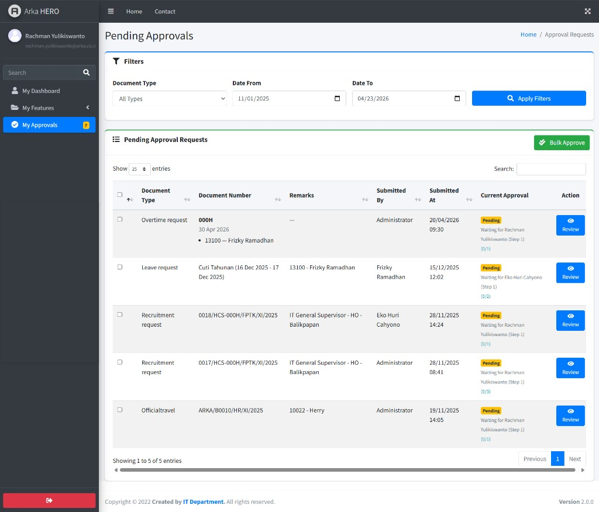

**Catatan filter Status**

| Filter       | Isi tabel                                          | Centang / **Bulk Approve** |
| ------------ | -------------------------------------------------- | -------------------------- |
| **Pending**  | Hanya baris yang belum Anda putuskan               | Tampil                     |
| **Approved** | Hanya baris yang sudah Anda setujui                | Disembunyikan              |
| **Rejected** | Hanya baris yang sudah Anda tolak                  | Disembunyikan              |
| **All**      | Semua keputusan Anda (Pending, Approved, Rejected) | Disembunyikan              |

**Catatan:** Menu **My Approvals** hanya tampil jika akun Anda diberi role approver. Jika tidak ada, hubungi **administrator** (bukan semua karyawan otomatis menjadi approver).

---

## 2. Meninjau dan memutuskan satu dokumen — **Review** / **View**

### Langkah-langkah — dari tabel ke halaman detail

1. Pada kartu **Approval Requests**, baca kolom **Document Type**, **Document Number**, **Remarks**, **Submitted By**, **Submitted At**, dan **Status** (badge keputusan Anda plus informasi giliran persetujuan dokumen).
2. Untuk baris **Pending**, klik **Review**. Untuk baris **Approved** atau **Rejected**, klik **View**. <a href="#my-approvals-review">Lihat gambar</a>.
3. Di halaman tinjauan, baca rincian dokumen (berbeda per jenis: perjalanan dinas, cuti, rekrutmen, dan lain-lain).
4. **Bila status keputusan Anda masih Pending** — di sisi kanan, buka panel **Approval Decision**:
    - Pada bagian **Choose Your Decision**, klik **Approve** atau **Reject**. Tanpa memilih salah satu, tombol **Submit Decision** tetap tidak aktif.
    - Isi **Approval Notes** (wajib, bertanda merah).
    - Klik **Submit Decision** untuk mengirim. Gunakan **Cancel** jika ingin kembali ke daftar tanpa mengirim.
5. **Bila Anda sudah memutuskan** — panel **Your Decision** menampilkan ringkasan (**You approved this request** / **You rejected this request**) dan catatan Anda; tombol **Back to List** mengembalikan ke daftar.
6. Setelah mengirim keputusan baru, Anda biasanya dikembalikan ke daftar **My Approvals** dengan pesan sukses singkat.

    

### Khusus **Leave Request** — **Total Days** dan **Sisa Cuti**

Pada kartu **Leave Request Information**, baris **Total Days** menampilkan dua kolom sejajar:

| **Total Days**            | **Sisa Cuti**              |
| ------------------------- | -------------------------- |
| Jumlah hari yang diajukan | Saldo cuti tersisa pegawai |

**Sisa Cuti** dihitung dari entitlement yang **Leave Period**-nya sama dengan pengajuan (bukan hanya dari tanggal mulai/selesai cuti). Approver dapat membandingkan jumlah hari diajukan dengan sisa saldo sebelum menyetujui.

**Catatan:** Jika dokumen memakai **urutan persetujuan bertingkat**, sistem dapat menolak keputusan Anda sampai approver pada tingkat sebelumnya selesai — pesan di layar menjelaskan bahwa persetujuan sebelumnya harus diselesaikan terlebih dahulu.

---

## 3. Menyetujui banyak dokumen sekaligus — **Bulk Approve**

### Langkah-langkah — centang lalu konfirmasi

1. Pastikan filter **Status** = **Pending** (kolom centang dan tombol **Bulk Approve** hanya tampil pada filter ini).
2. Di tabel **Approval Requests**, centang kotak di baris yang ingin disetujui (atau gunakan kotak centang di header untuk memilih semua yang tampil pada halaman saat ini).
3. Klik **Bulk Approve**.
4. Baca jendela konfirmasi (**Bulk Approval Confirmation**). Jika setuju, lanjutkan dengan opsi konfirmasi (misalnya **Yes, Approve All**); **Cancel** membatalkan.
5. Tunggu hingga proses selesai; sistem dapat menampilkan ringkasan jika sebagian berhasil dan sebagian gagal.
6. Tabel akan dimuat ulang; baris yang sudah diproses tidak lagi muncul pada filter **Pending**.

**Catatan:** **Bulk Approve** hanya untuk **menyetujui** dokumen terpilih yang memang sudah siap diproses oleh Anda (termasuk aturan urutan). Dokumen yang gagal biasanya tetap ada di daftar dengan alasan terkait urutan atau status.

---

## 4. Panel status — **Approval Status**

Di halaman **Review** / **View**, kartu **Approval Status** menampilkan ringkasan seperti **Document Submitter** dan jejak approver lain bila tersedia, sehingga Anda dapat memverifikasi siapa yang mengajukan dan siapa saja yang sudah memutuskan.

---

## Kesalahan & bantuan (end user)

| Gejala / pesan (contoh)                                         | Kemungkinan penyebab                                                            | Apa yang bisa dicoba                                                                |
| --------------------------------------------------------------- | ------------------------------------------------------------------------------- | ----------------------------------------------------------------------------------- |
| Menu **My Approvals** tidak ada                                 | Akun tidak punya izin melihat antrean persetujuan                               | Minta **administrator** menambahkan hak akses yang sesuai peran Anda.               |
| **You are not authorized to approve this request**              | Bukan Anda sebagai approver untuk baris itu, atau tautan bukan milik tugas Anda | Buka lagi dari **My Approvals**; jangan memakai tautan lama dari orang lain.        |
| **This request has already been processed**                     | Keputusan sudah pernah dikirim (saat mencoba approve/reject ulang)              | Buka baris lewat **View** untuk melihat riwayat; ubah filter **Status** bila perlu. |
| **Previous approvals must be completed first**                  | Urutan persetujuan: giliran Anda belum jalan                                    | Tunggu approver sebelumnya; koordinasi internal bila mendesak.                      |
| **Submit Decision** tidak bisa diklik                           | Belum memilih **Approve** atau **Reject**                                       | Klik salah satu tombol keputusan, lalu isi **Approval Notes**.                      |
| **No Selection** / minta pilih permintaan saat **Bulk Approve** | Tidak ada baris yang dicentang                                                  | Centang minimal satu baris; pastikan filter **Status** = **Pending**.               |
| **Bulk Approve** / centang tidak tampil                         | Filter **Status** bukan **Pending**                                             | Pilih **Pending** di filter **Status**, lalu **Apply Filters**.                     |
| Daftar kosong / **No approval requests found**                  | Tidak ada data untuk filter aktif                                               | Ubah **Status** (misalnya **All**) atau kosongkan **Document Type** / tanggal.      |
| **Sisa Cuti: N/A** pada detail cuti                             | Entitlement untuk **Leave Period** pengajuan tidak ditemukan                    | Verifikasi data entitlement pegawai dengan **HR** sebelum memutuskan.               |
| Peringatan **Session Expired** saat tabel memuat                | Sesi login habis                                                                | **Login** ulang dan buka kembali **My Approvals**.                                  |

### Menghubungi administrator

Hubungi **administrator** (atau **IT** / **HR**) jika izin seharusnya ada tetapi menu hilang, status dokumen tidak berubah setelah Anda yakin sudah mengirim keputusan, atau pesan di layar tidak tercakup di tabel di atas.

**Jangan** mengirim **password**. Cukup sampaikan **username** Anda, jenis dokumen (**Document Type**), nomor atau petunjuk dokumen yang terlihat di layar, waktu kejadian, dan kutipan pesan singkat dari aplikasi.
