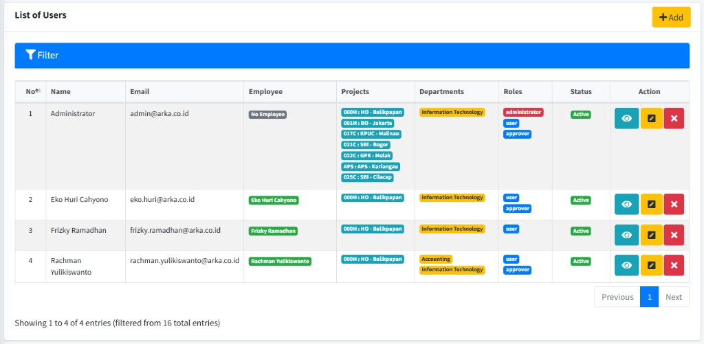
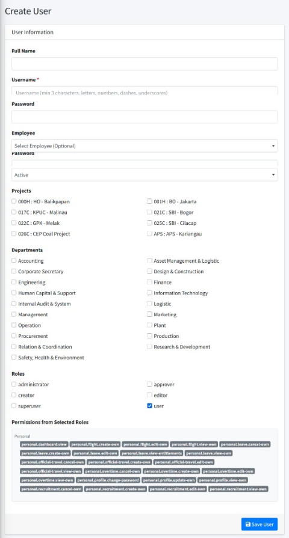
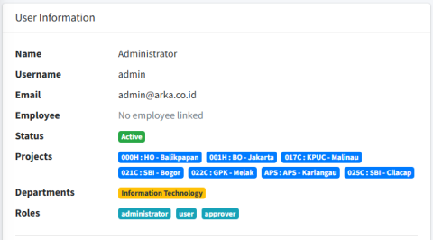
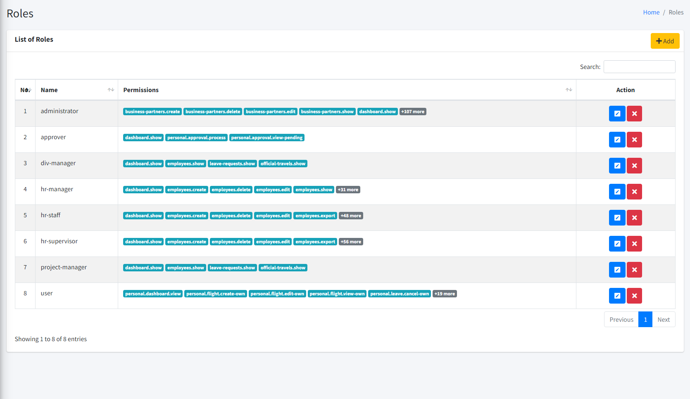
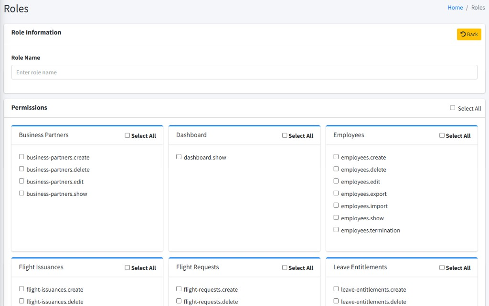
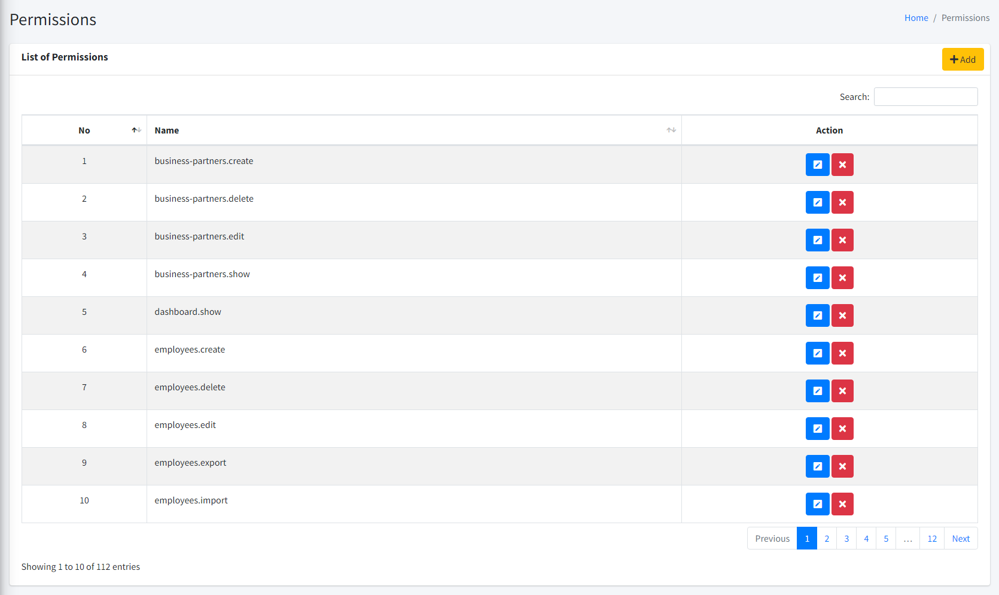

# User, Role, dan Permission

Bagian ini untuk pengguna yang diberi akses ke menu **SYSTEMS** di sidebar: **Users**, **Roles**, dan **Permissions**. Biasanya hanya **administrator** atau staf **IT** yang melihat menu ini.

| Istilah                 | Arti singkat                                                                                    |
| :---------------------- | :---------------------------------------------------------------------------------------------- |
| **User**                | Akun orang yang bisa **login** ke ARKA HERO.                                                    |
| **Role** (_peran_)      | Kumpulan hak akses; satu orang bisa punya satu atau lebih **role**.                             |
| **Permission** (_izin_) | Hak detail per fitur (misalnya boleh melihat daftar cuti atau tidak).                           |
| **Administrator**       | Peran dengan akses pengaturan sistem, termasuk mengatur **user**, **role**, dan **permission**. |

---

## 1. User Management

Menu **Users** dipakai untuk melihat dan mengelola **akun pengguna** (nama login, status, karyawan terkait, **role**, dll.).

### Langkah-langkah — membuka halaman dan membaca daftar

1. **Login** ke ARKA HERO.
2. Di sidebar, grup **SYSTEMS**, klik **Users**.  
   Atau buka alamat: `http://192.168.32.146:8080/users`
3. Pada **List of Users**, gunakan kotak **pencarian** atau **Filter** (jika dibuka) untuk menyaring nama, email, **role**, status, dll.
4. Di atas area daftar biasanya ada ringkasan jumlah **Total Users**, **Total Roles**, dan **Total Permissions** (tautan singkat ke halaman terkait).

### Langkah-langkah — menambah pengguna baru (_Add User_)

1. Pada halaman **Users**, klik tombol **Add** (ikon **+**).
2. Isi **Full Name**, **Username**, **Email** (opsional, biasanya `@arka.co.id`), **Password**, **Status** (aktif/tidak aktif).
3. Pilih **Employee** untuk menghubungkan user dengan data personal karyawannya.
4. Pilih **Projects** untuk menentukan akses data, misal user dengan project **000H** hanya bisa melihat data project **000H**.
5. Pilih **Departments** untuk menentukan departemen yang sesuai.
6. Centang **Roles** minimal satu.
7. Simpan dengan tombol **Simpan** / **Submit** di formulir.

**Catatan:** **Role** khusus **administrator** sering hanya boleh diberikan oleh **administrator** lain.

### Langkah-langkah — melihat detail pengguna

1. Pada baris pengguna di **List of Users**, gunakan tombol **View** / ikon mata (sesuai tampilan) untuk membuka halaman detail.
2. Periksa data yang ditampilkan (nama, email, karyawan, proyek, departemen, **role**, status, dll.).
3. **Permission** yang muncul berdasarkan **role**.

### Langkah-langkah — meng-_edit_ pengguna dan mengaktifkan akun yang masih _Inactive_

Jika seseorang sudah **Register** tetapi belum bisa **Login**, sering karena status akun masih **Inactive**. Administrator dapat mengaktifkannya lewat edit user.

1. Pada baris pengguna, klik **Edit** (atau buka `http://192.168.32.146:8080/users/{id}/edit` dengan **id** yang benar).
2. Cari kolom **Status** pada formulir.
3. Ubah dari **Inactive** menjadi **Active** (atau nilai setara di layar Anda), lalu simpan.
4. Sesuaikan field lain jika perlu (**Roles**, **Employee**, dll.) lalu simpan lagi bila ada perubahan.

### Menonaktifkan atau menghapus

- Gunakan opsi **Inactive** pada edit user, atau **Delete** pada baris jika tersedia dan Anda punya hak; ikuti konfirmasi di layar.

### Jika ada masalah

- Tidak melihat menu **Users** → hubungi **administrator** untuk pemberian **role** yang tepat.

---

## 2. Role Management (_user_, _approver_, _superuser_, _administrator_)

Menu **Roles** dipakai untuk mengatur **nama peran** dan **permission** apa saja yang melekat pada peran itu. Di sistem, sering ada peran seperti **user** (karyawan biasa), **approver** (pemberi persetujuan), **superuser** (akses luas sesuai kebijakan), dan **administrator** (pengelola penuh). **Nama pasti** mengikuti yang tampil di layar Anda.

### Langkah-langkah — membuka halaman dan membaca daftar peran

1. **Login** ke ARKA HERO.
2. Di sidebar **SYSTEMS**, klik **Roles**.  
   Atau buka: `http://192.168.32.146:8080/roles`
3. Pada **List of Roles**, baca nama **role** dan cuplikan **Permissions** (badge); jika izin banyak, bisa ada tanda **+N more**.

### Langkah-langkah — menambah peran baru (_Add Role_)

1. Klik **Add** pada halaman **Roles**.
2. Isi **Role Name** (misalnya nama internal perusahaan; bisa mirip **user**, **approver**, **superuser**, **administrator** sesuai kebutuhan).
3. Centang **Permissions** yang boleh dipakai peran ini; gunakan **Select All** jika tersedia.
4. Simpan formulir.

### Langkah-langkah — menyunting peran (_Edit Role_)

1. Pada baris peran di **List of Roles**, klik **Edit**.
2. Ubah **Role Name** atau centang/uncentang **Permissions** sesuai kebijakan.
3. Simpan formulir.

### Menghapus peran

- Gunakan **Delete** jika ada dan diizinkan; hati-hati jika peran masih dipakai pengguna.

### Peran khusus

- **administrator** biasanya dilindungi: hanya **administrator** yang boleh mengubah atau menetapkan peran ini (pesan di layar akan menjelaskan jika Anda tidak berhak).

### Jika ada masalah

- Tidak bisa memberi **permission** tertentu → minta bantuan **administrator** atau **IT**.

---

## 3. Permission Management

Menu **Permissions** berisi daftar **izin** per fitur (nama pendek di kolom **Name**). **Permission** menentukan apa yang boleh dilihat atau diubah di aplikasi; untuk banyak pengguna, izin dikelompokkan lewat **Roles**.

### Langkah-langkah — membuka halaman dan membaca daftar izin

1. **Login** ke ARKA HERO.
2. Di **SYSTEMS**, klik **Permissions**.  
   Atau buka: `http://192.168.32.146:8080/permissions`
3. Tabel menampilkan nomor urut, **Name** (nama permission), dan kolom **Action**.

### Langkah-langkah — menambah izin baru

1. Klik **Add**.
2. Isi nama **permission** sesuai standar tim (biasanya diisi **IT** / **administrator**).
3. Simpan.

### Langkah-langkah — menyunting atau menghapus izin

1. Klik **Edit** pada baris; ubah nama jika diizinkan; simpan.
2. **Delete** jika tersedia; pastikan tidak merusak **role** yang masih memakai izin itu — tanyakan **IT** jika ragu.

### Jika ada masalah

- Menu tidak tampil atau akses ditolak → hubungi **administrator**.

---
