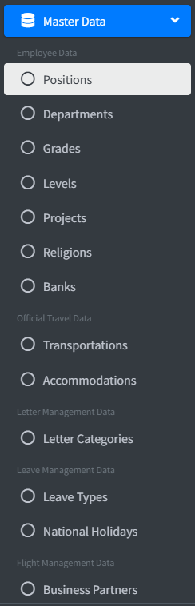
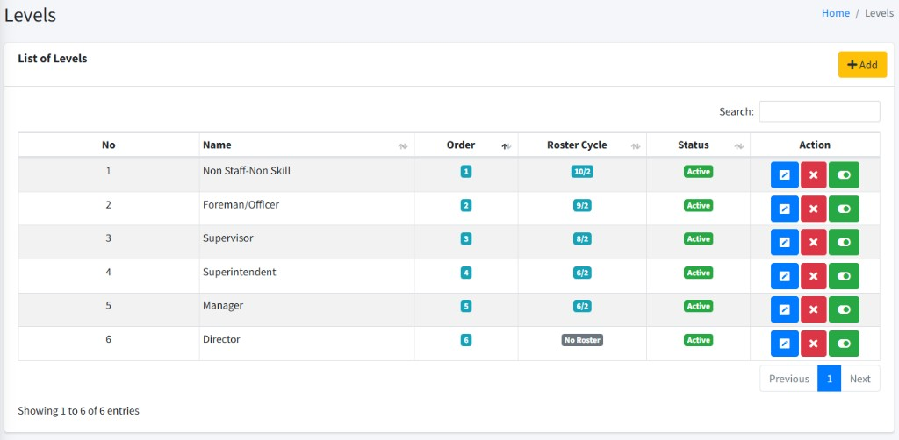
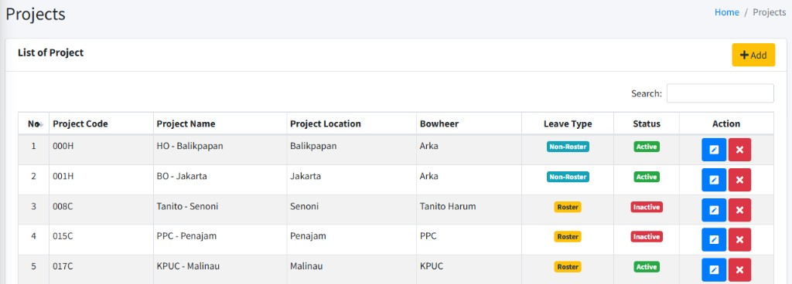
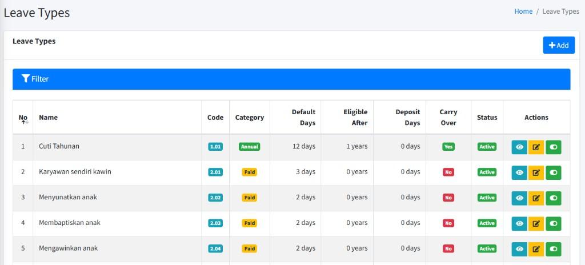
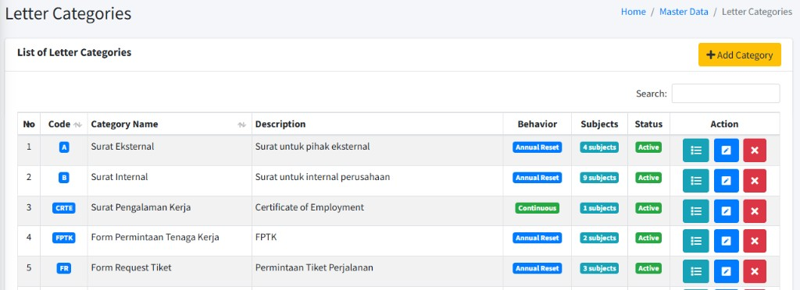

# Master Data

Panduan ini untuk staf **HR** atau pihak yang diberi tugas mengelola **referensi** di ARKA HERO:

- **Employee Data** (Positions, Departments, Grades, Levels, Projects, Religions, Banks)
- **Official Travel Data** (Transportations, Accomodations)
- **Leave Data** (Leave Types, National Holidays)
- **Flight Data** (Business Partners)
- **Letter Number Data** (Letter Categories)

**Catatan:** Item menu **Master Data** hanya tampil jika akun Anda memiliki **hak akses** yang sesuai (baca/tulis master data, serta izin khusus bila suatu submenu hanya untuk peran tertentu, misalnya **Business Partners** / **National Holidays**). Jika menu tidak muncul, hubungi **administrator**.

---

## 1. Mengakses menu Master Data

### Langkah-langkah — membuka _Master Data_

1. **Login** ke ARKA HERO.
2. Di _sidebar_, temukan grup **GENERAL SECTION**.
3. Buka submenu **Master Data** (ikon _database_); akan terbuka daftar anak menu yang dikelompokkan per topik.
4. Klik jenis data yang ingin dikelola (lihat bagian 2–6).

---

## 2. Employee Data (Positions, Departments, Grades, Levels, Projects, Religions, Banks)

**Employee Data** berisi rujukan yang dipakai saat mengelola karyawan, struktur organisasi, dan pilihan pribadi (agama, bank).

### Kegunaan singkat

| Menu (_sidebar_) | Fungsi singkat                                                                      |
| :--------------- | :---------------------------------------------------------------------------------- |
| **Positions**    | Master jabatan/posisi (cth: Accounting Officer, Admin HR, Mechanic I)               |
| **Departments**  | Master departemen (cth: Accounting, HCS, Plant)                                     |
| **Grades**       | Master grade (cth: Senior, Major, General)                                          |
| **Levels**       | Master level; **Level Order** (hirarki) dan **Roster Cycle** (siklus kerja–libur)   |
| **Projects**     | Kode/nama project; **Leave Type** **Non-Roster** / **Roster** (pengaruh skema cuti) |
| **Religions**    | Data pilihan agama (cth: Islam, Kristen, Katholik, Hindu)                           |
| **Banks**        | Data bank (cth: BCA, Mandiri)                                                       |

### Langkah-langkah — pola umum (lihat, tambah, ubah, hapus)

1. Pilih menu yang diinginkan di bawah **Employee Data** (mis. **Departments**).  
   Atau buka contoh: `http://192.168.32.146:8080/departments`
2. Pada daftar, gunakan **Filter** / kolom pencarian jika ada untuk mencari data.
3. Klik **Add** untuk menambah baris baru, atau gunakan aksi di baris (**Edit** / **Delete** / ikon setelan) sesuai tampilan.
4. Isi form atau modal, lalu simpan (**Save** / **Submit** / setara di layar).

**Catatan:**

- **Departments** — di halaman index ada **Import** (unggah massal) dan **Add**; form biasanya meminta **Department Name** dan **Slug**; baris tabel memiliki **Status** (aktif/tidak aktif). Gunakan impor bila unggah banyak baris; ikuti format/ urutan kolom yang dinyatakan di layar atau di template unduhan bila tersedia.
- **Positions** — menyediakan **Export** (unduh), **Import**, dan **Add**; saat menambah/ menyunting, pilih **Department** jabatan tersebut dan atur **Status** (mis. **Active** / **Inactive**). Impor/ ekspor memudahkan diselaraskan dengan tabel lembar kerja; pastikan isi file sesuai aturan unik/ referensi (mis. departemen harus sudah terdaftar).
- **Projects** (atau bisa disebut _site_)— selain kode, nama, lokasi, **Bowheer**, dan **Status**, wajib menentukan **Leave Type** (**Non-Roster** atau **Roster**); penjelasan pengaruhnya ada di [Projects — Leave Type](#projects--leave-type-non-roster-dan-roster). Penempatan karyawan, cuti, dan modul lain merujuk **project** ini—hindari mengubah atau menghapus **Project Code** sembarangan jika data operasional sudah melekat.
- **Grades** — tabel dengan aksi **Edit** / ubah **status**; nonaktifkan alih-alih hapus bila kebijakan perusahaan melarang penghapusan.
- **Levels** — ada kolom **Level Order** dan kolom **Roster Cycle**; uraiannya di [Levels — Level Order dan Roster Cycle](#levels--level-order-dan-roster-cycle).
- **Religions** dan **Banks** — tampil sebagai daftar + **Add** lewat jendela _popup_ di halaman yang sama; daftar agama/ bank memang pendek, jadi penyesuaian kecil cukup lewat sana.
- **Urutan saran (operasional):** isi/ stabilkan **Departments** (dan impor) sebelum memetakan **Positions**; pastikan **Projects**, **Grades**, **Levels**, lalu pilihan **Religions** / **Banks** sudah rapi sebelum puncak pemuatan karyawan—banyak field di **Employees** memilih dari master di atas.
- **Dampak ke modul lain:** jabatan, departemen, project, grade, dan level dipakai alur pendataan karyawan, cuti, perjalanan dinas, rekrutmen, dan **Roster** untuk di site; bila _delete_ ditolak atau muncul peringatan terikat, jangan dipaksakan; hubungi **IT** bila butuh pembersihan data lama.

### Levels — Level Order dan Roster Cycle

Di **Master Data** → **Employee Data** → **Levels**, setiap level punya **Level Name**, **Level Order**, konfigurasi siklus roster (jika dipakai), dan **Status** (**Active**). Daftar memiliki kolom **Order** dan **Roster Cycle**.

| Isian / kolom                  | Penggunaan                                                                                                                                                                                                                                                                                                                     |
| :----------------------------- | :----------------------------------------------------------------------------------------------------------------------------------------------------------------------------------------------------------------------------------------------------------------------------------------------------------------------------- |
| **Level Order**                | Angka urutan **hirarki** jabatan: **1** = level terendah, angka **lebih besar** = level lebih tinggi. Tabel diurutkan menurut **Order** (naik). Saat menambah level baru, fokus ke field **Level Order** dapat mengusulkan nilai **berikutnya** (maksimum order sementara + 1)—sesuaikan bila perusahaan punya lompatan angka. |
| **Off Days**                   | Jumlah **hari libur** dalam **satu siklus** kerja (_roster_). Teks bantuan di form menyebut bawaan **14** hari; boleh diubah sesuai kebijakan (mis. durasi _off_ antar putaran kerja).                                                                                                                                         |
| **Work Days**                  | Jumlah **hari kerja** dalam **satu siklus** yang dipasangkan dengan **Off Days**. Isi bila level ini memakai pola **roster** (kerja–libur bergilir). **Kosongkan** bila level ini **tidak** memakai roster (bukan shift rotasi); petunjuk di layar: _leave empty for non-roster_.                                              |
| **Cycle Length**               | **Total hari** satu putaran siklus (**Work Days** + **Off Days**), umumnya **dihitung otomatis** saat **Off Days** / **Work Days** diubah. Boleh dipakai untuk periksa panjang siklus (mis. 28 hari = 2×14).                                                                                                                   |
| **Roster Cycle** (kolom tabel) | Ringkasan pola roster untuk level yang sudah diisi **Work Days**; jika level **non-roster** (tanpa hari kerja siklus), tampilan mengindikasikan tidak ada konfigurasi siklus. Format angka mengikuti tampilan aplikasi (perbandingan minggu/masa kerja vs libur).                                                              |

**Catatan:** Samakan kebijakan internal: karyawan di **project** bertipe **Roster** (lihat [Projects — Leave Type](#projects--leave-type-non-roster-dan-roster)) sebaiknya memakai **Level** yang juga punya konfigurasi siklus (isi **Work Days**) agar modul **Roster** dan perhitungan cuti konsisten.

### Projects — Leave Type (Non-Roster dan Roster)

Di formulir **Add** / **Edit** **Project**, field **Leave Type** wajib diisi. Daftar project menampilkan kolom **Leave Type**.

| Pilihan        | Maksud penggunaan                                                                                                                                                                                                                                                                                |
| :------------- | :----------------------------------------------------------------------------------------------------------------------------------------------------------------------------------------------------------------------------------------------------------------------------------------------- |
| **Non-Roster** | Project dengan pola kerja “kantor” / harian (bukan jadwal shift rotasi penuh). Jenis project ini memengaruhi **perangkat jenis cuti** yang boleh dipakai (mis. cuti tahunan **annual** bersama jenis cuti berbayar, tidak berbayar, dan cuti panjang layanan / **LSL** sesuai aturan di sistem). |
| **Roster**     | Project karyawan **shift / rotasi** (sesuai modul **Roster**). Skema jenis cuti disesuaikan (mis. penekanan ke cuti berbayar, tidak berbayar, dan **LSL** tanpa pola cuti tahunan standar kantor); pastikan **Level** karyawan dan master **Roster** selaras.                                    |

Pilih **Roster** hanya bila operasional project memang memakai penjadwalan siklus; pilih **Non-Roster** untuk pekerjaan non-shift sesuai definisi perusahaan. Setelah project dipakai massal, mengganti **Leave Type** dapat berdampak ke alur **Leave** dan **Roster**—koordinasikan dengan **HR** bila ragu.

---

## 3. Official Travel Data (Transportations, Accommodations)

Rujukan untuk modul perjalanan dinas (LOT): moda transportasi dan tipe akomodasi.

### Kegunaan singkat

| Menu (_sidebar_)    | Fungsi singkat                                                   |
| :------------------ | :--------------------------------------------------------------- |
| **Transportations** | Data referensi transportasi (cth: Company Car, Public Transport) |
| **Accomodations**   | Data referensi akomodasi (cth: Hotel, Mess, Site)                |

### Langkah-langkah

1. Buka **Master Data** → **Official Travel Data** → **Transportations** atau **Accommodations**.  
   Contoh: `http://192.168.32.146:8080/transportations` atau `http://192.168.32.146:8080/accommodations`
2. Gunakan tabel: **Add** untuk buat baru, **Edit** / **Delete** untuk sunting/hapus sesuai izin.
3. Simpan perubahan; pastikan data tidak terhapus jika masih dirujuk transaksi lama (biasanya muncul pesan jika terikat).

---

## 4. Leave Data (Leave Types, National Holidays)

Pengaturan jenis cuti/kalender untuk modul **Leave**.

### Kegunaan singkat

| Menu (_sidebar_)      | Fungsi singkat                                                              |
| :-------------------- | :-------------------------------------------------------------------------- |
| **Leave Types**       | Master jenis cuti: **Name**, **Code**, **Category**, **Default Days**, dll. |
| **National Holidays** | Hari libur nasional (cth: Tahun Baru, Hari Kemerdekaan Indonesia)           |

### Langkah-langkah — Leave Types

1. Buka `http://192.168.32.146:8080/leave/types`
2. **Add** untuk form tambah, **Edit** / **View** jika tersedia di baris. Isi form lalu simpan; di daftar tersedia tombol **Toggle** untuk mengaktifkan/menonaktifkan jenis cuti.
3. **Delete** hanya tersedia jika jenis cuti tersebut belum pernah dipakai untuk **hak cuti** atau **permintaan cuti**; jika sudah terikat, sistem menolak penghapusan (sesuai pesan di layar).

**Izin:** kelola jenis cuti hanya bila peran Anda memuat hak akses **Leave Types** (lihat, tambah, ubah, hapus) di pengaturan **Roles** / **Permissions**; nama persis mengikuti yang di sistem.

### Leave Types — field di form

Form memakai label layar **bahasa Inggris** (seperti di aplikasi). Teks bantuan di samping/m bawah isian mengikuti tampilan **Create/Edit Leave Type**.

| Field (layar)                   | Wajib              | Keterangan                                                                                                                                                            |
| :------------------------------ | :----------------- | :-------------------------------------------------------------------------------------------------------------------------------------------------------------------- |
| **Name**                        | Ya                 | Nama tampilan jenis cuti (maks. 255 karakter).                                                                                                                        |
| **Code**                        | Ya                 | Kode singkat; **tidak boleh duplikat** dengan jenis cuti lain (maks. 255 karakter).                                                                                   |
| **Category**                    | Ya                 | Pilih satu: **Annual**, **Paid**, **Unpaid**, **Long Service Leave**, **Periodic Leave** — menentukan perilaku jenis cuti di aplikasi.                                |
| **Default Days**                | Ya                 | Angka bulat **≥ 0**; hak hari default (hak jatah) untuk jenis ini.                                                                                                    |
| **Eligible After (Years)**      | Ya                 | Angka bulat **≥ 0**; lama minimum masa kerja (tahun) sebelum karyawan memenuhi syarat jenis cuti ini.                                                                 |
| **Deposit Days (First Period)** | Boleh 0            | Angka bulat **≥ 0**; bila tidak diisi diperlakukan sebagai 0. Teks bantuan form: _For LSL first period only_ — khusus terkait periode pertama **Long Service Leave**. |
| **Allow Carry Over**            | Opsional (centang) | Bila dicentang, hari yang tidak terpakai **boleh dibawa** ke periode berikut. Teks bantuan: _Allow unused days to carry over to next period_.                         |
| **Active** (daftar)             | Dikelola di sana   | Saat **tambah** baru, jenis disimpan **aktif**; nonaktifkan lewat **Edit** atau ikon **Toggle** di daftar. Teks bantuan: _Leave type is available for use_.           |
| **Remarks**                     | Opsional           | Catatan (maks. 1000 karakter).                                                                                                                                        |

### Leave Types — pilihan Category

Di _dropdown_ **Category** pilihan yang tersedia: **Annual**, **Paid**, **Unpaid**, **Long Service Leave**, **Periodic Leave**.

Rangkuman isi panel **Category Information** di halaman **Create Leave Type** (tersedia di sisi form):

- **Annual:** cuti tahunan reguler; contoh porsi 12 hari per tahun; umumnya baru memenuhi syarat setelah 1 tahun masa kerja.
- **Paid:** cuti **ber**gaji untuk keperluan khusus; contoh: pernikahan, kelahiran, dsb.; sering 2–3 hari per kejadian (nilai rincian disesuaikan perusahaan lewat **Default Days**).
- **Unpaid:** cuti **tanpa** gaji; untuk alasan pribadi (detail kebijakan gaji mengikuti aturan perusahaan / HR).
- **Long Service Leave (LSL):** cuti panjang setelah masa kerja panjang; contoh 50 hari per 5–6 tahun; contoh rincian periode pertama: 40 hari ditarik + **10 hari deposit** (selaras dengan maksud field **Deposit Days (First Period)** di form).
- **Periodic:** cuti yang berulang menurut siklus (mis. bulanan, triwulan, tahunan) untuk perawatan, pelatihan, acara, dsb. (mengacu teks panel).

**Persetujuan:** hanya jenis kategori **Paid** dan **Unpaid** yang di aplikasi memerlukan alur **approval**; kategori **Annual** / **LSL** / **Periodic** tidak mengikuti aturan persetujuan itu.

### Leave Types — nilai bawaan saat Category dipilih (form Create)

Saat **Category** diubah, form dapat mengisi ulang sejumlah field secara otomatis sebagai bantuan (Anda masih boleh mengubah sebelum simpan), sesuai perilaku halaman **Create**:

| **Category**           | **Default Days** | **Eligible After (Years)** | **Deposit Days (First Period)** | **Allow Carry Over** |
| :--------------------- | :--------------- | :------------------------- | :------------------------------ | :------------------- |
| **Annual**             | 12               | 1                          | 0                               | Tidak                |
| **Paid**               | 0                | 0                          | 0                               | Tidak                |
| **Unpaid**             | 0                | 0                          | 0                               | Tidak                |
| **Long Service (LSL)** | 50               | 5                          | 10                              | Ya                   |
| **Periodic**           | 1                | 0                          | 0                               | Tidak                |

### Leave Types — aturan simpan

- **Name**, **Code**, **Category**, **Default Days**, **Eligible After (Years)** wajib; **Default Days** dan **Eligible After** angka bulat, minimal **0**.
- **Code** tidak boleh sama dengan jenis cuti lain (pada **edit**, kode yang sama di baris saat ini diperbolehkan).
- **Deposit days** boleh kosong (diperlakukan sebagai 0), minimal **0** jika diisi.
- **Remarks** maks. 1000 karakter; **Carry over** lewat centang; **Status aktif** mengikuti uraian di atas.

### Langkah-langkah — National Holidays

1. Buka `http://192.168.32.146:8080/leave/national-holidays`
2. Tambah, ubah, atau hapus entri libur; simpan.  
   Tampilan bisa memakai tabel dengan pembaruan tanpa pindah halaman; ikuti konfirmasi sebelum **Delete**.

**Catatan:** Submenu **National Holidays** hanya muncul bila peran Anda punya hak tampil untuk modul ini (diminta ke **administrator** jika tidak terlihat).

---

## 5. Flight Data (Business Partners)

Mitra / pihak (misal travel agent atau maskapai) yang dirujuk modul penerbangan.

### Langkah-langkah

1. Pastikan peran Anda punya hak akses **Business Partners**; lalu buka **Master Data** → **Flight Management Data** → **Business Partners**.  
   Atau: `http://192.168.32.146:8080/business-partners`
2. **Add** untuk rekam mitra baru; isi data yang diminta; simpan.
3. **Edit** / **Delete** pada baris jika tersedia; hati-hati jika data sudah dipakai penerbitan/permintaan.

---

## 6. Letter Management Data (Letter Categories & Letter Subjects)

**Letter Category** mengelompokkan jenis surat untuk **penomoran** dan tampilan di **Letter Numbers**. **Letter Subject** (subjek) adalah rincian per kategori; satu kategori bisa punya banyak subjek. Setiap **nomor surat** terhubung ke satu **kategori** dan, bila dipilih, ke satu **subjek**.

**Catatan:** menu **Letter Numbers** (operasi penomoran) ada di **Letter Administration**, bukan di bawah _Master Data_; bab ini hanya **master** kategori & subjek.

### Letter Categories — isian dan perilaku

| Field (layar)          | Wajib    | Keterangan                                                                                                                                                                                                        |
| :--------------------- | :------- | :---------------------------------------------------------------------------------------------------------------------------------------------------------------------------------------------------------------- |
| **Category Code**      | Ya       | Kode singkat, **unik**, maks. **10** karakter.                                                                                                                                                                    |
| **Category Name**      | Ya       | Nama kategori, maks. **100** karakter.                                                                                                                                                                            |
| **Description**        | Opsional | Penjelasan tambahan.                                                                                                                                                                                              |
| **Numbering Behavior** | Ya       | **Annual Reset** — _Sequence number resets to 1 at the start of each year._ **Continuous** — _Sequence number keeps incrementing indefinitely._ Saat menambah kategori, pilihan bawaan biasanya **Annual Reset**. |
| **Status**             | Ya       | **Active** / **Inactive**.                                                                                                                                                                                        |

Kategori baru tercatat atas nama pengguna yang sedang login. Daftar menampilkan **Behavior** (**Annual Reset** / **Continuous**), jumlah **Subjects**, dan aksi.

**Hapus kategori:** tidak diizinkan jika kategori sudah punya **nomor surat** (data di **Letter Numbers**). Pesan di layar umumnya: _Cannot delete category that has letter numbers!_

**Ubah kategori:** lewat **Edit** (modal) pada baris yang sama.

### Letter Subjects — hubungan dengan kategori

- Setiap subjek selalu menempel pada **satu kategori**; di daftar kategori, gunakan tombol **Manage Subjects** (ikon daftar) untuk membuka halaman pengelolaan subjek **hanya untuk kategori tersebut**. Alamat mengikuti pola `http://192.168.32.146:8080/letter-subjects/` + identitas yang dipakai tautan (tekan tombol di layar, jangan susun alamat sendiri). Di atas tabel ada ringkasan **Code**, **Name**, **Description** kategori.
- Pada form subjek di halaman itu, isi **Subject Name** (maks. 255 karakter) dan **Status**; kategori sudah ditentukan oleh halaman yang Anda buka (bukan memilih kategori baru di setiap baris).

Tabel subjek menampilkan **Created By** (siapa yang membuat) dan **Created At**, urut nama subjek.

**Hapus subjek:** gunakan tombol hapus di baris tabel subjek. **Penting:** angka di alamat yang tampak mirip bisa berarti **buka daftar per kategori** (dari menu kategori) atau **hapus satu subjek** — selalu gunakan tombol di layar, jangan menyusun URL sendiri.

Jika subjek masih dipakai **nomor surat**, penghapusan ditolak dengan pesan seperti: _Cannot delete subject because it is still being used in letter numbers_. Di modul lain, daftar pilihan subjek biasanya hanya menampilkan subjek **aktif**, diurut nama.

### Langkah-langkah — ringkas

1. **Kategori** — Buka `http://192.168.32.146:8080/letter-categories` (**Master Data** → **Letter Management Data** → **Letter Categories**). **Add Category** isi kode, nama, perilaku **Numbering**, status; **Edit** / **Delete** dari ikon di baris.
2. **subjek** — Dari jumlah **Subjects** atau tombol **Manage Subjects** pada kategori, buka daftar subjek kategori itu; **Add Subject** isi **Subject Name** dan status, simpan.
3. Sebelum **Delete** kategori atau subjek, pastikan tidak dipakai oleh **nomor surat** yang masih aktif.

---

## 7. Kesalahan umum & bantuan

| Gejala / pesan                                           | Kemungkinan penyebab                                    | Apa yang bisa dicoba                                                                                    |
| :------------------------------------------------------- | :------------------------------------------------------ | :------------------------------------------------------------------------------------------------------ |
| Menu **Master Data** tidak tampil                        | Hak akses belum diberi                                  | Hubungi **administrator**; minta hak **master data** (dan modul khusus bila perlu).                     |
| **403** / Akses ditolak                                  | Izin baca / tulis tidak ada                             | Cek peran; minta hak **buat** / **ubah** / **hapus** sesuai pekerjaan Anda.                             |
| **Import** gagal (Departments)                           | Format berkas / sheet salah, atau tipe data tidak cocok | Unduh contoh, sesuaikan kolom, ulangi unggah.                                                           |
| **Delete** ditolak / gagal                               | Data masih dipakai modul lain                           | Nonaktifkan bila tersedia, atau rujuk **IT** untuk integritas data.                                     |
| Duplikat kode/ nama                                      | Kode atau nama sudah terpakai                           | Ganti kode / label; cek dulu di daftar.                                                                 |
| **National Holidays** / **Business Partners** tidak ada  | Modul hanya untuk peran tertentu                        | Mohon **administrator** mengaktifkan hak tampil untuk **National Holidays** atau **Business Partners**. |
| Pesan **Cannot delete category that has letter numbers** | Kategori punya data di **Letter Numbers**               | Hapus/ pindah nomor surat terkait dulu, atau jangan hapus kategori.                                     |
| Pesan subjek **still being used in letter numbers**      | **Letter Subject** terpakai **Letter Number**           | Hapus/ ganti rujukan nomor surat ke subjek lain jika memungkinkan, lalu coba lagi.                      |

### Menghubungi administrator atau IT

Sampaikan: **modul** yang dibuka, **username** atau email kantor, waktu kejadian, dan **teks error** (atau _screenshot_ tanpa data sensitif). **Jangan** mengirim **password** lewat chat. Untuk batasan aturan perusahaan (apa boleh dihapus, siapa yang meng-**Import** resmi) ikuti **SOP** internal HR/IT.

### Jika ada masalah (ringkas)

- Perubahan tidak tersimpan: periksa validasi form (warna merah di field) dan coba ulang.
- Perilaku tabel/ modal tidak wajar: segarkan halaman, coba peramban lain, laporkan ke **IT** bila terus terjadi.

---
