

# Employee Management

Panduan ini ditujukan untuk **HR** yang mengelola data karyawan di ARKA HERO, mulai dari dashboard, data karyawan aktif, input manual, import-export, termination, sampai ikatan dinas dan pelanggaran ikatan dinas. Teks pada tombol, menu, tab, dan nama field mengikuti label yang tampil di aplikasi, sehingga beberapa istilah tetap menggunakan Bahasa Inggris.

| **Istilah**             | Arti singkat                                                                                                                |
| :---------------------- | :-------------------------------------------------------------------------------------------------------------------------- |
| **Employee Management** | Grup menu HR untuk melihat dashboard karyawan, daftar karyawan, ikatan dinas, dan pelanggaran ikatan dinas.                 |
| **Dashboard**           | Ringkasan statistik dan pintasan cepat terkait data karyawan.                                                               |
| **Employees**           | Daftar utama data karyawan aktif maupun tidak aktif.                                                                        |
| **Personal**            | Tab data identitas, kelahiran, kontak, alamat, dan dokumen pribadi seperti KTP/KK.                                          |
| **Employment**          | Tab data kepegawaian seperti **Employee ID (NIK)**, **Date of Hire**, **Position**, **Project**, **Grade**, dan **Level**.  |
| **Termination**         | Proses mengubah status administrasi karyawan menjadi tidak aktif karena kontrak selesai, resign, retired, atau alasan lain. |
| **Employee Bonds**      | Pencatatan ikatan dinas karyawan, termasuk nomor surat, periode ikatan, nilai investasi, dan dokumen perjanjian.            |
| **Bond Violations**     | Pencatatan pelanggaran ikatan dinas dan nominal penalti yang perlu ditindaklanjuti.                                         |
| **Import** / **Export** | Fitur untuk unggah atau unduh data karyawan menggunakan file Excel sesuai format sistem.                                    |

---

## 1. Ringkasan menu **Employee Management**

| Menu                | Uraian singkat                                                                                                                                                                          |
| :------------------ | :-------------------------------------------------------------------------------------------------------------------------------------------------------------------------------------- |
| **Dashboard**       | Ringkasan total karyawan, komposisi staff/non-staff, status permanen/kontrak, ulang tahun bulan berjalan, grafik per department/project, karyawan baru, dan kontrak yang akan berakhir. |
| **Employees**       | Daftar karyawan, filter data, tombol **Add**, **Import**, **Export**, akses detail, dan tombol **Terminated** bila akun memiliki izin termination.                                      |
| **Employee Bonds**  | Daftar ikatan dinas, filter status/periode/karyawan, tambah ikatan dinas, dan akses pelanggaran.                                                                                        |
| **Bond Violations** | Daftar pelanggaran ikatan dinas, filter pembayaran, tambah pelanggaran, dan tindak lanjut pembayaran penalti.                                                                           |

**Catatan:** Menu atau tombol tertentu hanya tampil bila akun Anda memiliki **hak akses** yang sesuai. Jika menu tidak terlihat, hubungi administrator untuk pengecekan izin.

---

## 2. Dashboard karyawan

### Langkah-langkah - membuka **Employee Dashboard**

1. **Login** ke ARKA HERO.
2. Di sidebar, buka **HERO SECTION** -> **Employee Management** -> **Dashboard**.
3. Baca kartu ringkasan utama:
    - **Total Employees** - jumlah seluruh karyawan dalam cakupan akses akun Anda.
    - **Staff/Non-Staff** - perbandingan karyawan staff dan non-staff.
    - **Permanent/Contract** - perbandingan status kontrak/permanen.
    - **Born this [Month]** - jumlah karyawan yang ulang tahun pada bulan berjalan.
4. Gunakan **Quick Actions** bila tersedia:
    - **Personal Details**, **Administrations**, **Bank Accounts**, **Tax Identification**.
    - **Insurances**, **Driver Licenses**, **Employee Families**, **Emergency Calls**.
    - **Educations**, **Courses**, **Job Experiences**, **Additional Data**.
    - **Operable Units**, **Add New Employee**, **View All Employees**, **Import Data**.
5. Periksa grafik **Employees by Department** dan **Employees by Project** untuk melihat sebaran karyawan. Klik **View All Departments** atau **View All Projects** untuk daftar lebih lengkap.
6. Gunakan tabel **Recently Joined Employees in Last 30 Days** untuk melihat karyawan baru, dan tabel **Contracts Expiring Soon in Next 30 Days** untuk memantau kontrak yang akan selesai.

    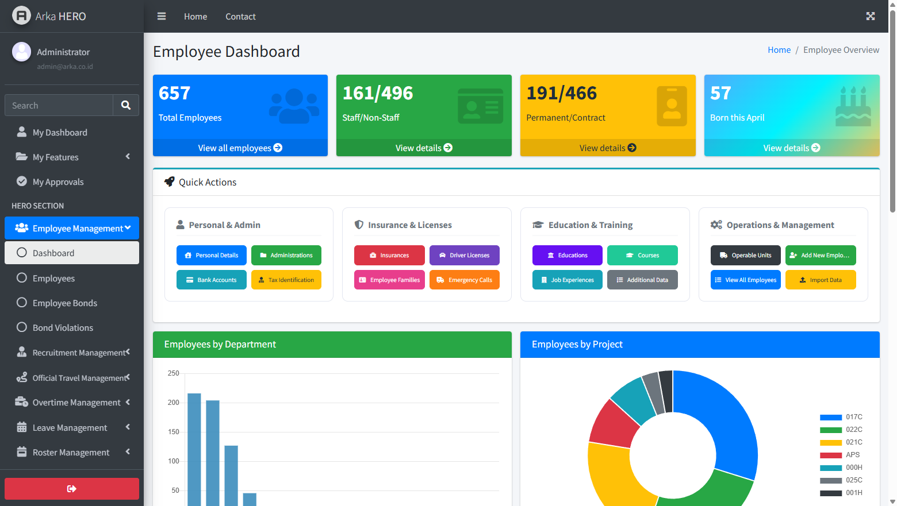

**Catatan:** Angka dashboard mengikuti cakupan project atau data yang boleh dilihat oleh akun Anda. Jika angka berbeda dengan rekap manual, pastikan filter project, status karyawan, dan hak akses sudah sesuai.

---

## 3. Daftar karyawan (**Employees**)

### Langkah-langkah - membuka **List of Employees**

1. **Login** ke ARKA HERO.
2. Di sidebar, buka **HERO SECTION** -> **Employee Management** -> **Employees**.
3. Pada halaman **Employees**, baca kartu **List of Employees**.
4. Gunakan tombol di kanan atas sesuai kebutuhan:
    - **Terminated** - membuka daftar karyawan yang sudah di-termination.
    - **Export** - mengunduh data karyawan.
    - **Import** - membuka modal **Import Data** untuk unggah file.
    - **Add** - membuat data karyawan baru secara manual.
5. Buka panel **Filter** untuk menyaring data berdasarkan **DOH From**, **DOH To**, **NIK**, **Full Name**, **Project**, **Department**, **Position**, **Grade**, **Level**, **Status**, dan **Staff**.
6. Tabel menampilkan kolom **No**, **NIK**, **Full Name**, **Project**, **Department**, **Position**, **Grade**, **Level**, **Status**, dan **Action**.
7. Pada kolom **Action**, klik ikon **Detail** untuk membuka profil lengkap karyawan.

    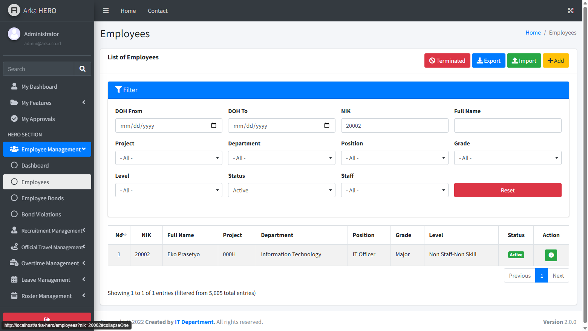

**Catatan:** Filter **Status** biasanya otomatis menampilkan **Active**. Pilih **Not Active** atau **All** jika Anda perlu melihat data yang tidak aktif atau seluruh data.

---

## 4. Input manual data karyawan (**Add Employee**)

### Langkah-langkah - membuat karyawan baru

1. Dari halaman **Employees**, klik **Add**.
2. Sistem membuka halaman **Employee** dengan form **Add Employee**.
3. Isi data dari kiri ke kanan mengikuti tahapan pengisian. Anda dapat berpindah menggunakan tombol **Next** / **Previous** atau klik judul bagian di atas. Pengisian data karyawan minimal bagian **Personal** dan **Employment**
4. Setelah semua bagian yang diperlukan terisi, klik **Save**. Gunakan **Back** untuk kembali ke daftar tanpa menyimpan.

**1. Personal**  
Isi identitas pribadi pada bagian **Personal Information**, **Birth Information**, **Personal Details**, **Contact Information**, dan **Address Information**. Field penting mencakup **Full Name**, **Identity Card**, **Nationality**, **Upload Kartu Tanda Penduduk (KTP)**, **Upload Kartu Keluarga (KK)**, **Place of Birth**, **Date of Birth**, **Blood Type**, **Religion**, **Gender**, **Marital Status**, **Phone Number**, **Email Address**, **Street Address**, **Village**, **Ward**, **District**, dan **City**.

    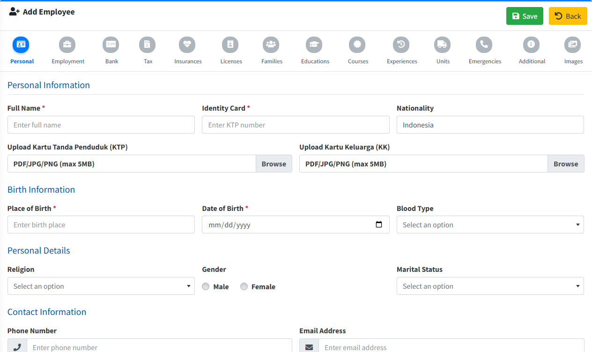

**Catatan:** File KTP dan KK menggunakan label upload **PDF/JPG/PNG (max 5MB)**. Pastikan dokumen terbaca jelas sebelum disimpan.

**2. Employment**  
Isi data pekerjaan pada **Employment Details**, **Hiring Information**, **Position Information**, dan **Certificates & References**. Field penting mencakup **Employee ID (NIK)**, **Employee Class** (**Staff** / **Non Staff**), **Date of Hire**, **Place of Hire**, **FOC Date**, **Agreement Type**, **Position**, **Department**, **Grade**, **Level**, **Project**, **Company Program**, **FPTK Number**, dan **Certificate Number**.

    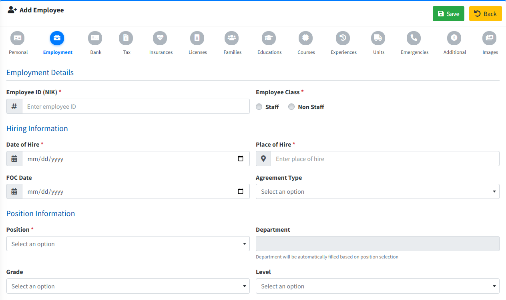

**Catatan:** **Department** biasanya mengikuti **Position** yang dipilih. Jika department tidak sesuai, periksa master data position terlebih dahulu.

**3. Bank**  
Isi rekening pembayaran karyawan. Data yang umum diperlukan meliputi pilihan bank, nomor rekening, nama pemilik rekening, cabang, dan dokumen pendukung seperti buku tabungan bila tersedia.

    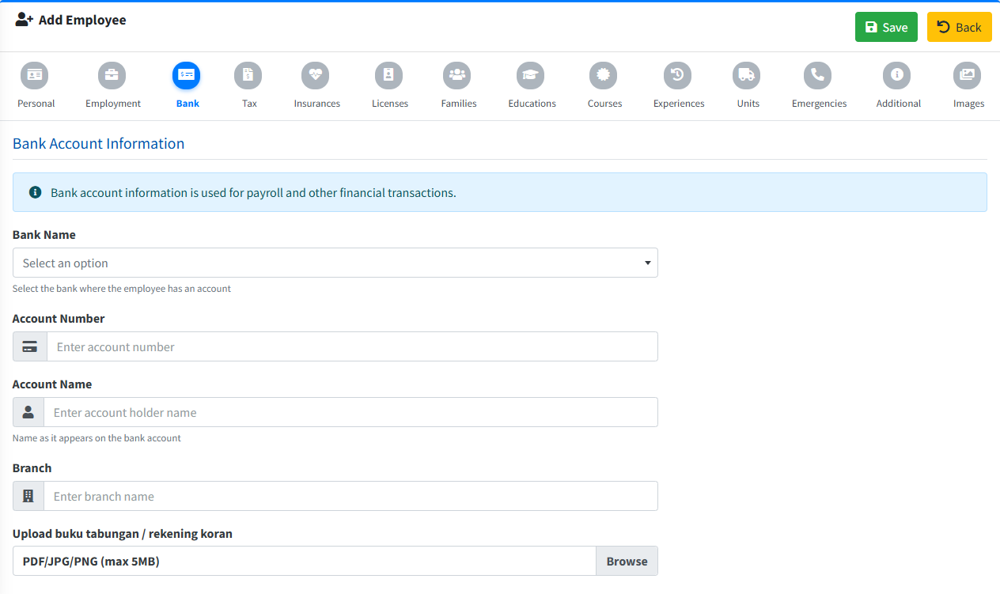

**4. Tax**  
Isi identitas pajak karyawan, termasuk nomor pajak dan dokumen pendukung jika diminta. Pastikan data pajak mengikuti dokumen resmi karyawan.

    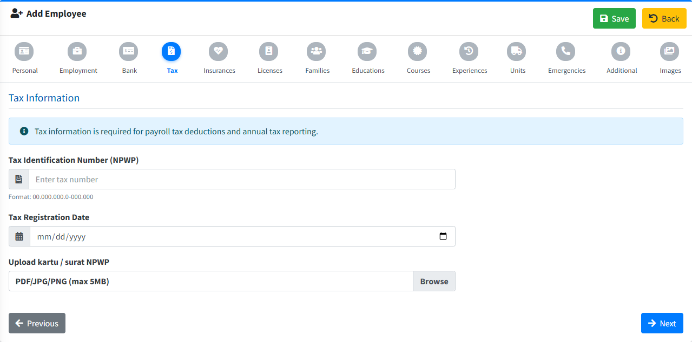

**5. Insurances**  
Isi data asuransi atau BPJS pada bagian **Insurances**. Bila ada lebih dari satu data, tambahkan baris sesuai kebutuhan dan unggah **supporting document** bila tersedia.

    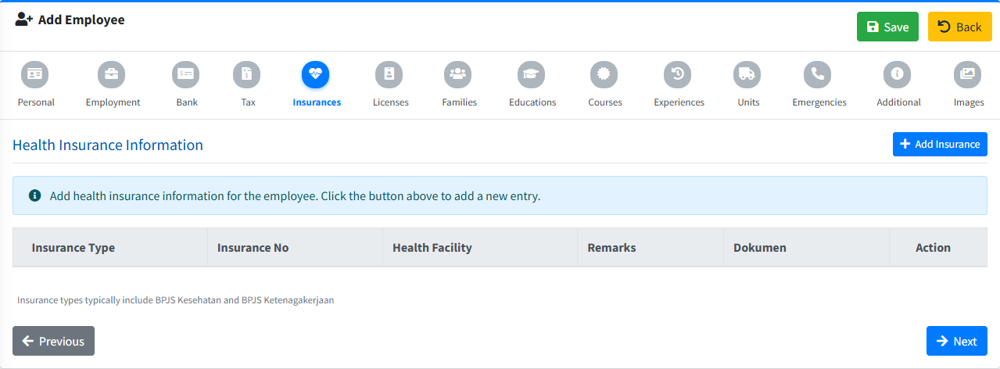

**6. Licenses**  
Isi data lisensi atau surat izin, misalnya SIM atau izin kerja tertentu. Perhatikan tanggal berlaku dan dokumen pendukung agar HR dapat memantau masa berlaku.

    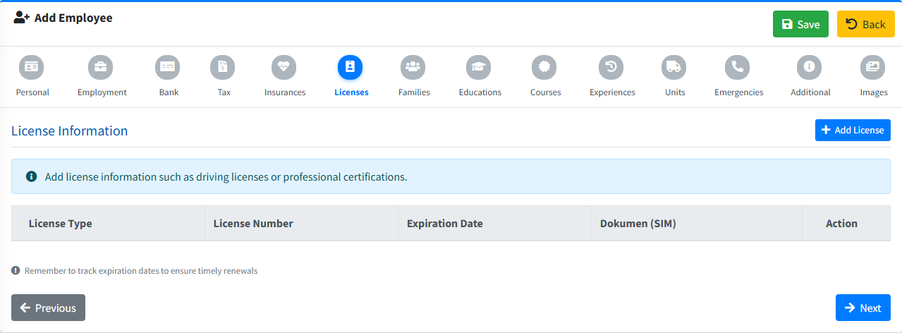

**7. Families**  
Isi data keluarga atau tanggungan karyawan. Gunakan informasi sesuai dokumen resmi karyawan.

    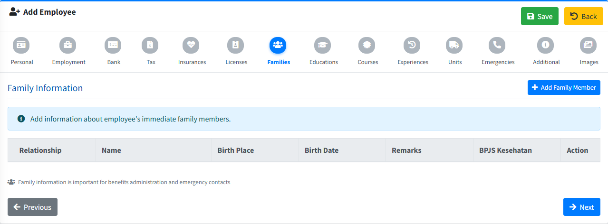

**8. Educations**  
Isi riwayat pendidikan, jurusan, institusi, tahun, dan dokumen pendukung bila ada.

    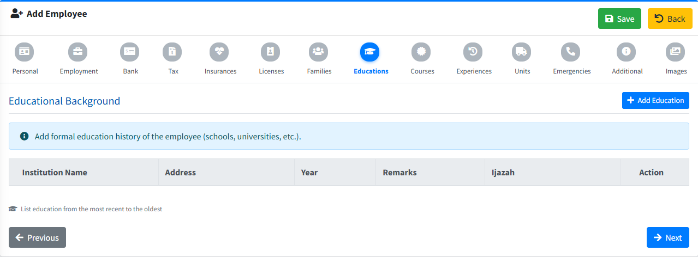

**9. Courses**  
Isi riwayat kursus, pelatihan, sertifikasi, atau training yang relevan.

    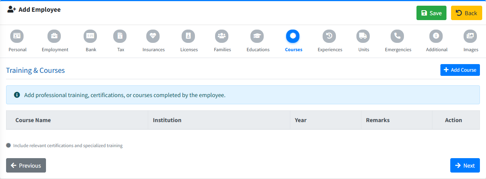

**10. Experiences**  
Isi pengalaman kerja sebelumnya, posisi, perusahaan, periode kerja, dan keterangan lain bila diperlukan.

    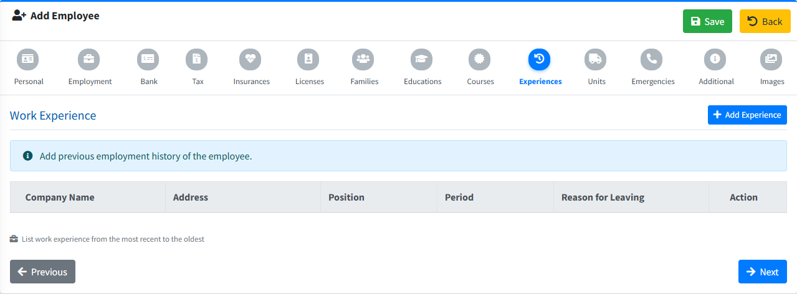

**11. Units**  
Isi data unit operasional yang terkait dengan karyawan, bila karyawan memegang atau menggunakan unit tertentu.

    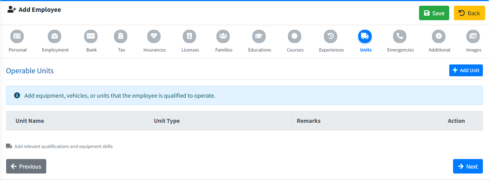

**12. Emergencies**  
Isi kontak darurat karyawan agar perusahaan memiliki nomor yang dapat dihubungi saat keadaan mendesak.

    

**13. Additional**  
Isi informasi tambahan yang tidak tercakup di tab lain, sesuai kebutuhan perusahaan.

    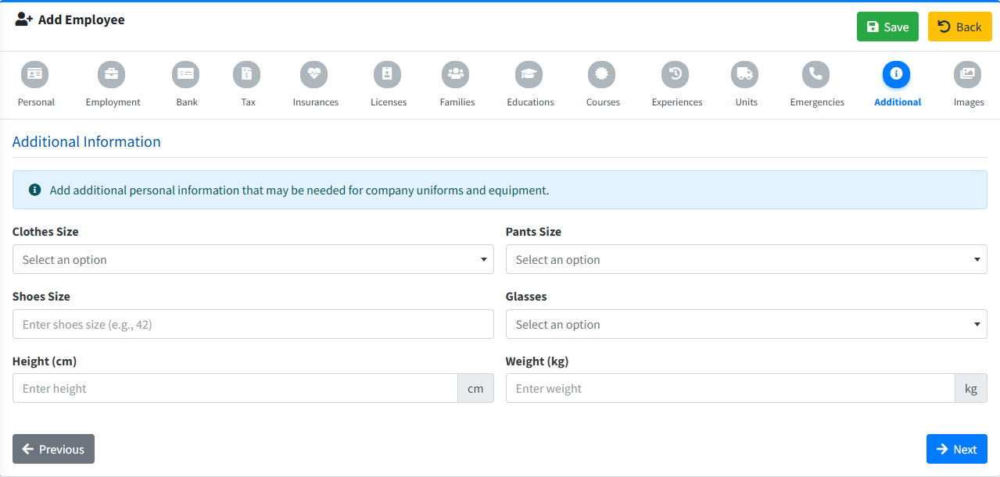

**14. Images**  
Unggah gambar atau foto dokumen lain bila diperlukan. Gunakan file yang jelas dan hindari duplikasi dokumen yang sama.

    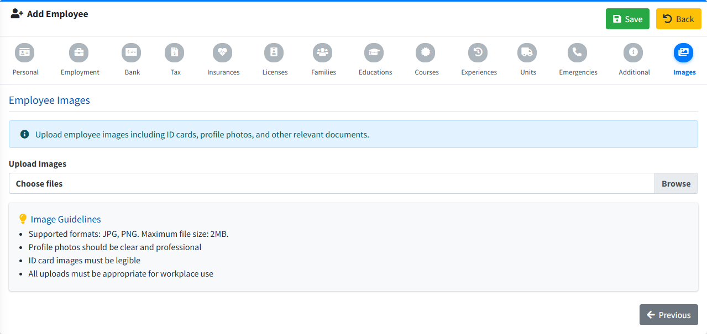

**Catatan:** Field wajib akan menampilkan pesan validasi bila kosong atau tidak sesuai. Field yang sering wajib adalah **Full Name**, **Identity Card**, **Place of Birth**, **Date of Birth**, **Employee ID (NIK)**, **Place of Hire**, **Date of Hire**, **Employee Class**, **Position**, dan **Project**.

---

## 5. Melihat detail, memperbarui data, mencetak, dan menghapus

### Langkah-langkah - membuka detail karyawan

1. Buka **HERO SECTION** -> **Employee Management** -> **Employees**.
2. Cari karyawan menggunakan **Filter** atau pencarian tabel.
3. Pada kolom **Action**, klik ikon **Detail**.
4. Halaman detail menampilkan nama karyawan dan **tab** **Personal**, **Employment**, **Bank**, **Tax**, **Insurances**, **Licenses**, **Families**, **Educations**, **Courses**, **Experiences**, **Units**, **Emergencies**, **Additional**, dan **Images** untuk berpindah antar kategori data.
5. Gunakan tombol **Print** untuk mencetak profil karyawan bila diperlukan.
6. Gunakan tombol **Back** untuk kembali ke daftar.

    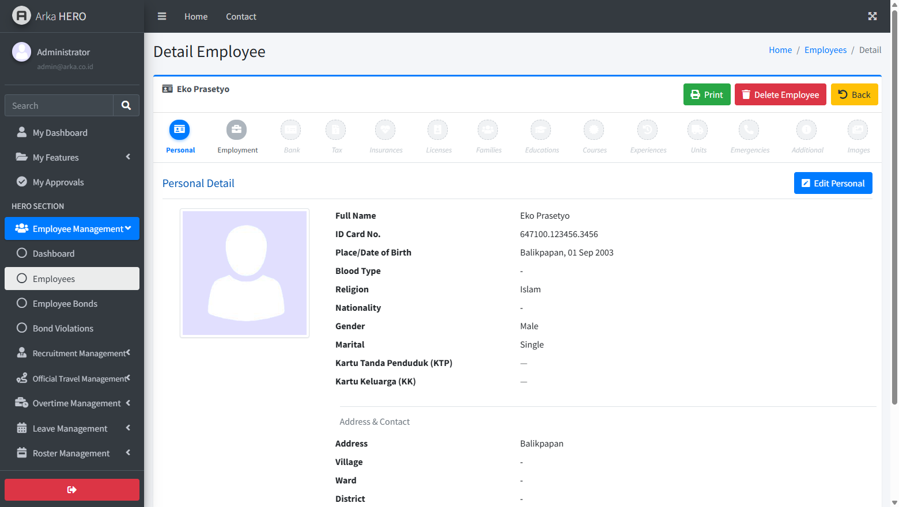

### Langkah-langkah - memperbarui data per bagian

1. Di halaman detail karyawan, buka tab yang ingin diperbarui, misalnya **Personal**, **Employment**, **Bank**, **Tax**, **Insurances**, **Licenses**, atau **Educations**.
2. Gunakan tombol edit atau aksi yang tersedia di bagian tersebut.
3. Ubah data pada modal/form yang muncul.
4. Klik tombol simpan pada modal/form.
5. Periksa kembali tab terkait untuk memastikan data sudah berubah.

**Catatan:**

1. Beberapa bagian seperti **Bank**, **Tax**, **Insurances**, **Licenses**, dan **Educations** dapat memiliki dokumen pendukung. Jika mengganti dokumen, pastikan file baru adalah file final dan sesuai kebijakan perusahaan.
2. Khusus data **Employment**, jika menambahkan NIK baru, maka NIK lama akan otomatis **Inactive**, sementara NIK baru yang aktif tampil sebagai **Active**, sehingga riwayat NIK tercatat di tabel **Employment History** (contoh: Eko Prasetyo, NIK aktif **20025** - _data dummy_).

    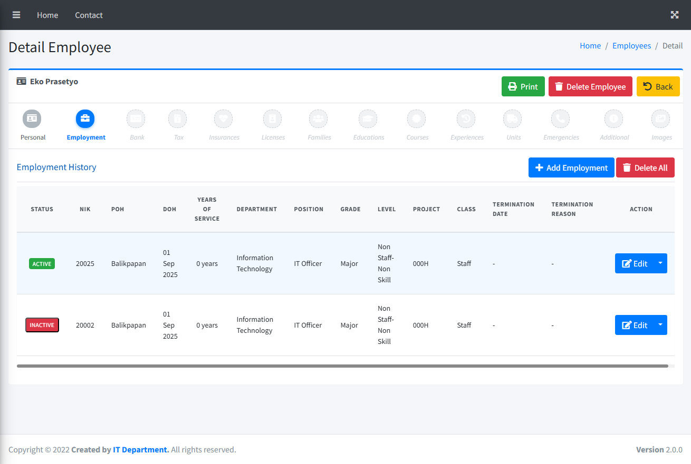

### Langkah-langkah - menghapus data karyawan

1. Buka halaman detail karyawan.
2. Jika akun Anda memiliki izin, tombol **Delete Employee** akan tampil.
3. Klik **Delete Employee** dan baca konfirmasi: **This employee and all associated data will be deleted. Are you sure?**
4. Lanjutkan hanya jika penghapusan memang sudah disetujui secara internal.

**Catatan:** Penghapusan karyawan berdampak pada data terkait. Untuk karyawan yang sudah tidak bekerja, gunakan alur **Termination** bila tujuannya hanya menonaktifkan status kerja.

---

## 6. Import dan export data karyawan

### Langkah-langkah - **Export**

1. Buka **HERO SECTION** -> **Employee Management** -> **Employees**.
2. Klik **Export**.
3. Simpan file yang diunduh.
4. Gunakan file hasil export sebagai bahan rekap atau acuan format import bila tim Anda memakai template yang sama.

### Langkah-langkah - **Import Data**

1. Buka **Employees**, lalu klik **Import**. Dari **Dashboard**, Anda juga dapat memakai **Quick Actions** -> **Import Data** bila tombol tersedia.
2. Pada modal **Import Data** atau **Import Employees**, klik **Choose file** / **Choose file...**.

    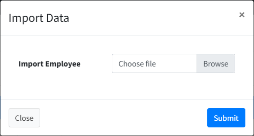

3. Pilih file Excel karyawan. Pada dashboard, keterangan file adalah **Only Excel files (.xlsx, .xls) are allowed**.
4. Klik **Submit** atau **Import**.
5. Untuk mempercepat proses import, pastikan file Excel Anda sudah sesuai dengan template yang diberikan oleh sistem. Gunakan file hasil **Export** resmi sebagai dasar, **hanya isi data yang butuh perubahan/penambahan**, dan jangan mengubah nama sheet maupun judul kolom. Sebelum mengimpor, periksa juga kembali konsistensi data seperti:
    - Nama sheet dan header kolom tidak salah eja
    - Format field seperti **identity_card_no** (nomor KTP) harus unik dan dalam format yang benar
    - Nilai pada field yang menggunakan referensi master data (misal: agama, jabatan, class, termination reason) harus sama persis
    - Field wajib diisi (seperti NIK, full_name, identity_card_no) sudah terisi untuk semua data yang ingin diimpor.
6. Jika muncul **Import Validation Errors**, baca tabel **Sheet**, **Row**, **Column**, **Value**, dan **Error Message**. Perbaiki file Excel, lalu ulangi import.

#### Contoh tampilan **Import Validation Errors**

Kotak peringatan berwarna merah **Import Validation Errors** memuat tabel: **Sheet** (nama lembar di Excel), **Row** (nomor baris data), **Column** (kolom), **Value** (isi sel yang diperiksa), dan **Error Message** (alasan penolakan). Contoh tampilan nyata (beberapa error sekaligus):

    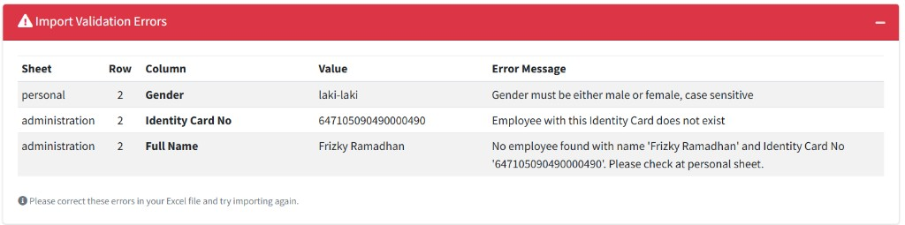

Dari contoh di atas: **Gender** wajib berisi `male` atau `female` (bukan `laki-laki`). Di lembar **administration**, **Identity Card No** dan **Full Name** harus **sama persis** dengan baris karyawan di lembar **personal** (atau data yang sudah tersimpan di sistem); bila KTP belum pernah diimpor di lembar personal pada file yang sama, atau salah ketik, muncul pesan bahwa karyawan tidak ditemukan.

**Contoh pesan error lain (teks yang dapat muncul di kolom Error Message):**

| Lembar (Sheet) / konteks | Kolom (contoh)            | Contoh pesan (mengikuti logika impor)                                                                                                                     |
| :----------------------- | :------------------------ | :-------------------------------------------------------------------------------------------------------------------------------------------------------- |
| **personal**             | `religion`                | `Selected Religion does not exist in our database` (agama harus **persis** seperti di data master)                                                        |
| **personal**             | `email`                   | `Email must be a valid email address`                                                                                                                     |
| **personal**             | `identity_card_no`        | `Identity Card No '...' already exists for employee '...' who appears to be a different person` (KTP ganda diduga untuk orang berbeda)                    |
| **administration**       | `class`                   | `Class must be either "Staff" or "Non Staff" (case sensitive)`                                                                                            |
| **administration**       | `project_code`            | `Project with code '...' does not exist`                                                                                                                  |
| **administration**       | `position` / `department` | `Department '...' is not valid for position '...'. Valid departments are: ...` (departemen harus **sesuai** jabatan di master)                            |
| **administration**       | `project_name`            | `Project name '...' does not match the expected name for code '...'. It should be '...'` (nama proyek harus cocok dengan kode)                            |
| **administration**       | `nik`                     | `NIK '...' already exists for another employee` (NIK karyawan bentrok)                                                                                    |
| **health insurance**     | `health_insurance`        | `Health Insurance Type must be either "BPJS Kesehatan" or "BPJS Ketenagakerjaan"`                                                                         |
| **termination**          | `termination_reason`      | `Termination Reason must be one of: End of Contract, End of Project, Resign, Termination, Retired, Efficiency, Passed Away`                               |
| **termination**          | `project_code`            | `Kode proyek tidak ditemukan.` atau `Proyek di luar penugasan akun Anda (user_project).` bila proyek **tidak ada** atau di luar wewenang proyek akun Anda |
| **Unggahan file**        | (file)                    | `The file must be a file of type: xls, xlsx` bila jenis file bukan Excel                                                                                  |

Jika muncul **System Error** di baris error, baca isi pesannya; seringkali terkait data yang tidak memenuhi aturan bawaan database atau isian yang tidak terbaca.

**Catatan (aturan import data karyawan):**

1. **File dan hak akses** - Hanya file **.xlsx** atau **.xls**. Fitur import dan export hanya untuk akun yang punya izin impor karyawan; bila menu tidak tersedia, hubungi administrator.

2. **Isi buku kerja (workbook)** - Sistem membaca **beberapa lembar (sheet)** dengan nama **persis** seperti template bawaan (misalnya `personal`, `administration`, `bank accounts`, `tax identification no`, `health insurance`, `license`, `family`, `education`, `course`, `job experience`, `operable unit`, `emergency call`, `additional data`, `termination`). Lembar yang **namanya tidak dikenal** akan **dilewati**; setelah sukses, pesan impor dapat menyebut lembar yang di-skip. Pastikan tidak ada typo pada nama lembar.

3. **Baris judul (header) kolom** - **Jangan mengubah teks baris judul** pada template tanpa arahan administrator. Sistem memetakan data berdasarkan nama kolom tersebut.

4. **Hubungan antar lembar** - Lembar **personal** memuat identitas inti (termasuk **Identity Card No** = nomor KTP dan **Full Name**). Lembar berikut (administrasi, bank, pajak, dan seterusnya) mengisi data tambahan dengan **mencocokkan pasangan `full_name` + `identity_card_no`** ke karyawan yang **(a)** baru saja diimpor di lembar `personal` pada file yang sama, atau **(b)** sudah tersimpan di database. Jika nama dan KTP **tidak sama persis** dengan lembar personal (ejaan, spasi), baris di lembar lain dapat ditolak.

5. **Lembar personal (identitas)** - **Nomor KTP wajib unik** di seluruh sistem. Jika nomor KTP sudah terdaftar untuk orang lain, dan **nama** tidak cukup mirip, sistem **menolak** (mencegah menyalahgunakan nomor KTP). Jika KTP sudah ada dan **nama cukup mirip** dengan data lama, sistem memperlakukannya sebagai **pembaruan** data karyawan yang sama, bukan karyawan baru. **Religion (agama)** harus **sama persis** dengan isian di data master agama. **Gender** wajib **`male` atau `female`** (huruf kecil, sesuai sistem). **Email**, bila diisi, harus format email yang benar. Baris yang **tanpa nomor KTP** dianggap kosong dan diabaikan.

6. **Lembar administration (kepegawaian)** - Wajib ada **NIK (Employee ID)**. **Class** hanya **`Staff`** atau **`Non Staff`** (tulisan persis, termasuk huruf besar/kecil). **Kode proyek**, **nama jabatan (position)**, **grade**, **level** harus **sudah terdaftar** di master data aplikasi. Jika kolom **department** diisi, nilainya harus **sesuai** dengan jabatan yang dipilih (bukan sembarang departemen). Jika ada kolom **project name**, harus **cocok** dengan nama proyek resmi berdasarkan **project code** yang diisi. **NIK** tidak boleh **sudah dipakai karyawan lain**. Sistem memelihara **satu** baris administrasi **aktif** per karyawan lewat proses impor (sesuai logika unggah).

7. **Lembar bank, pajak, asuransi, sim, dan seterusnya** - Umumnya membutuhkan **Full Name** dan **Identity Card No** yang valid seperti di poin 4, serta field wajib per lembar (contoh: **tax identification no** untuk pajak, **BPJS** untuk asuransi kesehatan). Untuk tipe asuransi kesehatan, isian yang diterima **hanya** teks **persis** **`BPJS Kesehatan`** atau **`BPJS Ketenagakerjaan`**.

8. **Lembar termination (pemberhentian)** - **Termination reason** harus salah satu nilai resmi, misalnya **End of Contract**, **End of Project**, **Resign**, **Termination**, **Retired**, **Efficiency**, **Passed Away**, **Canceled** (tulisan persis, sesuai pilihan di aplikasi).

9. **Jika validasi gagal** - Sistem menampilkan tabel **Import Validation Errors** berisi lembar, baris, kolom, nilai, dan pesan. **Perbaiki file Excel** pada baris/kolom yang disebut, lalu unggah ulang. Satu baris yang salah pada satu lembar dapat menggagalkan pengecekan; sebaiknya perbaiki semua error yang tercantum, lalu impor kembali.

10. **Acuan aman** - Gunakan file **Export** resmi dari sistem sebagai **pola** nama lembar dan kolom, lalu hanya isi isian data, agar meminimalkan penolakan teknis.

### Hubungan khusus: lembar **personal**, **administration**, dan **termination**

Ketiga lembar ini saling berkaitan lewat **identitas orang yang sama** dan, untuk kepegawaian, lewat **NIK (Employee ID)**.

1. **Peran masing-masing lembar**
    - **`personal`** - Membuat atau memperbarui **profil karyawan** di sistem berdasarkan **nomor KTP** (`identity_card_no`) dan **nama lengkap** (`full_name`). Tanpa baris yang valid di sini, karyawan tidak punya “induk” data di aplikasi.
    - **`administration`** - Menyimpan **data kepegawaian yang masih aktif** untuk karyawan tersebut: antara lain **NIK**, jabatan, proyek, tanggal masuk, dan seterusnya. Lewat impor, sistem mengutamakan **satu** rangkaian data administrasi **aktif** per karyawan (sesuai logika unggah).
    - **`termination`** - **Bukan** lembar untuk menambah karyawan baru. Fungsinya **mengakhiri** hubungan kerja pada **data administrasi** yang sudah dikenal: mengisi **tanggal** dan **alasan** pemberhentian, lalu mengubah status administrasi menjadi **tidak aktif** untuk kombinasi karyawan + NIK yang sama.

2. **Rantai pencocokan identitas** - Sama seperti lembar lain, **termination** mencari karyawan lewat **`full_name` + `identity_card_no`** yang **sama persis** dengan lembar **personal** (atau dengan karyawan yang sudah ada di database). Setelah karyawan ketemu, sistem memproses **baris administrasi** yang **NIK**-nya sama dengan kolom **NIK** pada lembar **termination**. Artinya **NIK pada baris termination harus sama dengan NIK pada data kepegawaian (administration)** yang ingin Anda hentikan—biasanya NIK administrasi **aktif** terakhir untuk orang tersebut.

3. **Urutan dalam satu file impor** - Dalam satu kali unggah, sistem memproses lembar secara **berurutan** (dimulai dari **personal**, lalu **administration**, dan seterusnya hingga **termination** di bagian akhir). Untuk **karyawan baru** dalam file yang sama, isi **personal** dan **administration** terlebih dahulu agar nama, KTP, dan NIK sudah konsisten; baru kemudian baris di **termination** dapat merujuk ke orang dan NIK yang sama. Jika Anda hanya mengisi lembar **termination** (tanpa personal/administration di file itu), karyawan beserta data administrasi aktif **harus sudah tersimpan** di aplikasi dari sebelumnya, dan **NIK** di lembar termination harus cocok dengan administrasi yang akan dihentikan.

4. **Kesalahan yang sering terjadi** - **Nama atau KTP beda ejaan/spasi** antara lembar → karyawan tidak terhubung. **NIK di termination beda** dengan NIK di administration yang diinginkan → sistem tidak memperbarui baris yang Anda maksud. **Menghentikan orang yang administrasinya belum pernah diimpor** → baris tidak punya dasar administrasi yang jelas; pastikan data **administration** sudah ada (dari unggahan ini atau dari data lama di sistem).

**Catatan:** Alur pemberhentian lewat **layar** (bukan impor)—misalnya dari **detail karyawan** tab **Employment** atau halaman **Termination**—dijelaskan pada **§7 Termination karyawan**; prinsipnya sama soal memilih data administrasi **aktif** dan mencatat alasan, tetapi tanpa lembar Excel.

---

## 7. Termination karyawan

### Langkah-langkah - termination **satu karyawan** (dari **Detail**, tab **Employment**)

Cara ini memutus hubungan kerja **per orang** lewat data kepegawaian (baris **Employment History**) pada profil karyawan bila tidak memakai halaman **Termination** massal.

1. Buka **HERO SECTION** -> **Employee Management** -> **Employees**.
2. Pada **List of Employees**, klik ikon **Detail** pada karyawan yang akan di-terminate.
3. Di halaman **Detail Employee**, pilih tab / tahapan **Employment** (ikon **briefcase**, label **Employment**).
4. Scroll ke tabel **Employment History** dan cari **baris administrasi** yang statusnya masih **Active** (hijau). Satu karyawan dapat punya lebih dari satu baris sejarah; pilih **baris yang benar** (biasanya NIK/posisi yang masih dijalankan).
5. Pada kolom **Action** baris tersebut, klik **tombol panah** di samping **Edit** (menu tarik) lalu pilih **Terminate** (ikon siluet keluar, teks **Terminate**). Modal **Terminate Employment** terbuka.

    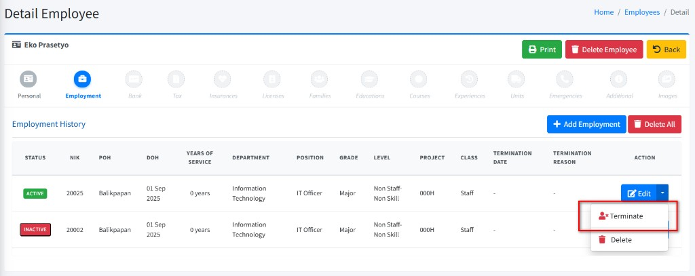

    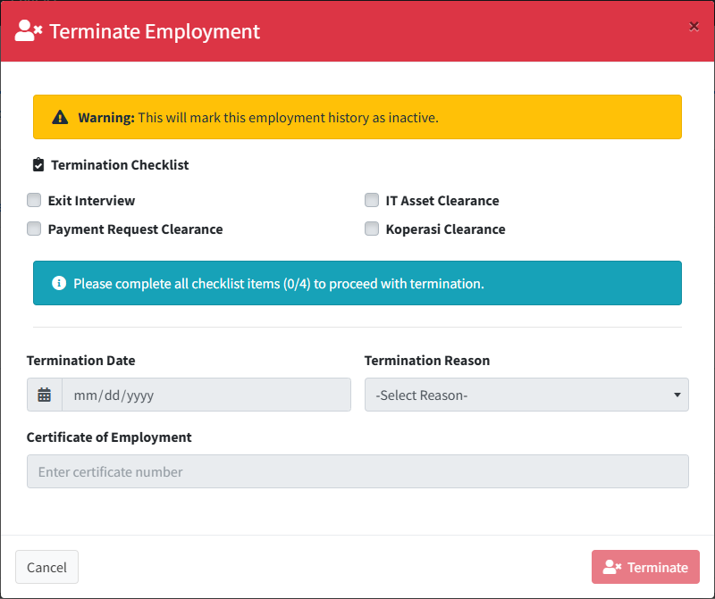

6. Baca peringatan di atas: proses ini akan menandai **employment history** tersebut sebagai **tidak aktif** (bukan menghapus profil karyawan secara utuh).
7. Lengkapi **Termination Checklist** - centang **semua** item berikut agar isian bawahnya bisa diisi: **Exit Interview**, **Payment Request Clearance**, **IT Asset Clearance**, **Koperasi Clearance**. Sistem hanya mengaktifkan field tanggal, alasan, dan CoE setelah keempatnya tercentang; bilah informasi di bawah checklist akan berubah jadi pesan selesai bila semua sudah dicentang.
8. Isi **Termination Date** (tanggal pemberhentian) dengan tanggal yang sesuai kebijakan.
9. Pada **Termination Reason**, pilih salah satu: **End of Contract**, **End of Project**, **Resign**, **Termination**, **Retired**, **Efficiency**, **Passed Away**, atau **Canceled** (bukan -Select Reason-).
10. Bila perlu, isi **Certificate of Employment** (nomor sertifikat) pada lapangan teks; kolom ini opsional menurut tampilan form.
11. Klik **Terminate** (tombol merah). Konfirmasi muncul: **Are you sure you want to terminate this employment history?** pilih **OK** bila yakin, atau batal. Untuk membatalkan tanpa menyimpan, klik **Cancel** di modal.
12. Setelah tersimpan, baris di **Employment History** berubah jadi **Inactive**; **Termination Date** dan **Termination Reason** tampil di tabel. Karyawan tersebut dapat masuk pula ke daftar **List of Terminated Employees** melalui menu **Terminated** (sesuai alur data di sistem).

**Catatan:** Jika akun tidak memiliki izin terkait, tombol aksi mungkin tidak tampil. Jika karyawan sudah **Inactive** untuk baris itu, proses pemberhentian lewat aksi **Terminate** umumnya tidak perlu diulang—cek riwayat di tabel terlebih dahulu.

### Langkah-langkah - membuka daftar **Termination**

1. Buka **HERO SECTION** -> **Employee Management** -> **Employees**.
2. Klik tombol **Terminated**.
3. Halaman **Termination** menampilkan **List of Terminated Employees**.
4. Gunakan **Filter** untuk menyaring **DOH From**, **DOH To**, **NIK**, **Full Name**, **Project**, **POH**, **Department**, **Position**, **Termination Date From**, **Termination Date To**, **Termination Reason**, dan **Certificate of Employment (CoE No)**.
5. Tabel menampilkan **NIK**, **Full Name**, **Department**, **Position**, **Project**, **POH**, **DOH**, **Termination Date**, **Reason**, **CoE No**, dan **Action**.
6. Klik **Back** untuk kembali ke halaman **Employees**.

    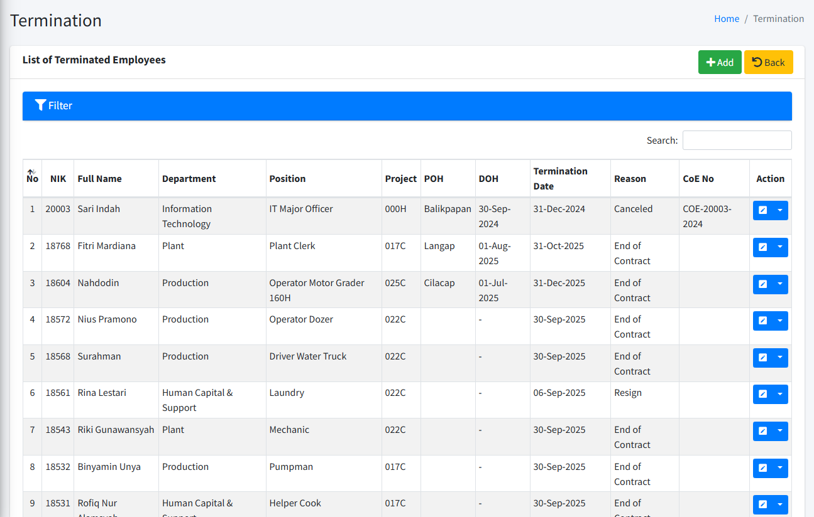

### Langkah-langkah - melakukan termination massal

1. Dari halaman **Termination**, klik **Add**.
2. Pada **Termination Form**, isi **Termination Date**.
3. Pilih **Termination Reason**: **End of Contract**, **End of Project**, **Resign**, **Termination**, **Retired**, **Efficiency**, **Passed Away**, atau **Canceled**.
4. Pada bagian **Active Employee**, gunakan **Filter** untuk mencari karyawan aktif berdasarkan **DOH From**, **DOH To**, **NIK**, **Full Name**, **POH**, **Department**, **Position**, **Project**, atau **Staff**.
5. Centang karyawan yang akan diproses. Gunakan checkbox paling atas bila perlu memilih semua hasil yang tampil.
6. Isi **CoE No** bila diperlukan oleh kebijakan internal.
7. Klik **Save**.
8. Setelah tersimpan, karyawan akan berpindah ke daftar **List of Terminated Employees** dan status administrasinya menjadi tidak aktif.

    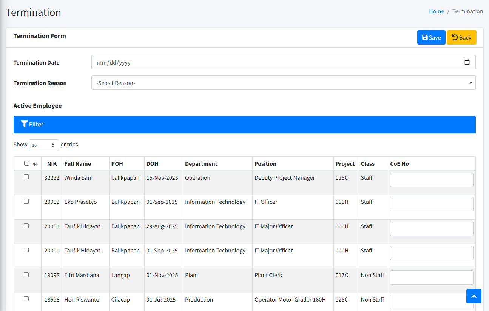

**Catatan:** Pastikan tanggal, alasan, dan nomor **CoE No** sudah benar sebelum klik **Save**. Jika termination perlu dibatalkan, gunakan aksi yang tersedia pada daftar terminated atau hubungi administrator sesuai prosedur perusahaan.

---

## 8. Employee Bonds (Ikatan Dinas)

### Langkah-langkah - membuka daftar **Employee Bonds**

1. Di sidebar, buka **HERO SECTION** -> **Employee Management** -> **Employee Bonds**.
2. Halaman **Employee Bonds (Ikatan Dinas Karyawan)** menampilkan **Employee Bond Management**.
3. Gunakan tombol:
    - **Add Bond** - membuat ikatan dinas baru.
    - **Add Violation** - mencatat pelanggaran ikatan dinas.
4. Buka **Filter** untuk menyaring **Status**, **Employee**, **Bond Name**, **Bond Number**, **Date From**, dan **Date To**. Gunakan **Reset Filter** untuk mengosongkan filter.
5. Tabel menampilkan **Employee**, **Bond Name**, **Bond Number**, **Start Date**, **End Date**, **Duration**, **Investment Value**, **Status**, **Remaining Days**, dan **Actions**.
6. Pada **Actions**, gunakan ikon **View**, **Edit**, atau **Delete** sesuai kebutuhan dan izin.

    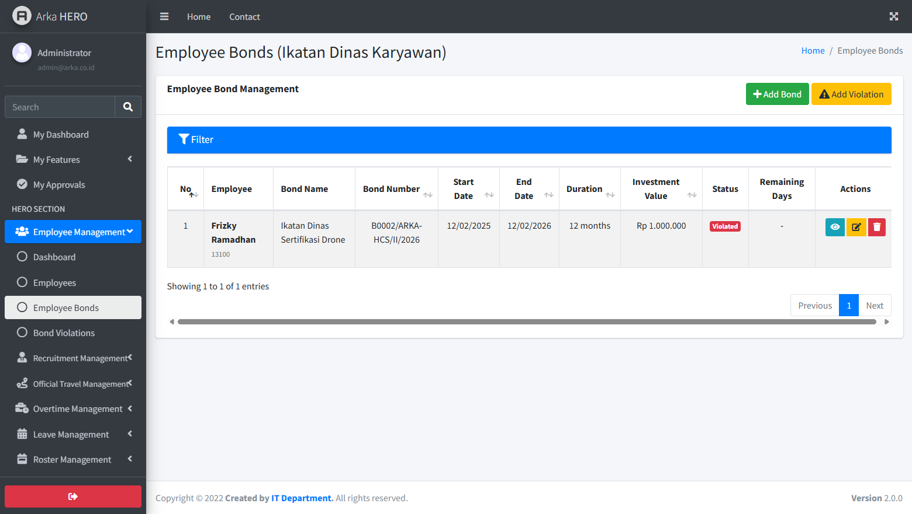

### Langkah-langkah - membuat **Create Employee Bond**

1. Dari halaman **Employee Bonds**, klik **Add Bond**.
2. Pada kartu **Letter Number**, pilih nomor surat. Nomor ini dipakai untuk membentuk **Employee Bond Number**.
3. Pada kartu **Create Employee Bond**, periksa **Employee Bond Number**. Field ini akan otomatis terisi setelah nomor surat dipilih.
4. Pilih **Employee**.
5. Isi **Bond Name** dan **Description**.
6. Isi **Investment Value**. Sistem menghitung **Duration (Months)** secara otomatis berdasarkan nilai investasi.
7. Isi **Start Date**. Sistem menghitung **End Date** berdasarkan durasi.
8. Unggah **Document** bila ada. Keterangan layar: **Upload bond agreement document (PDF, DOC, DOCX)**.
9. Baca panel **Bond Information** di sisi kanan untuk memeriksa ringkasan.
10. Klik **Create Bond**. Gunakan **Cancel** untuk membatalkan.

    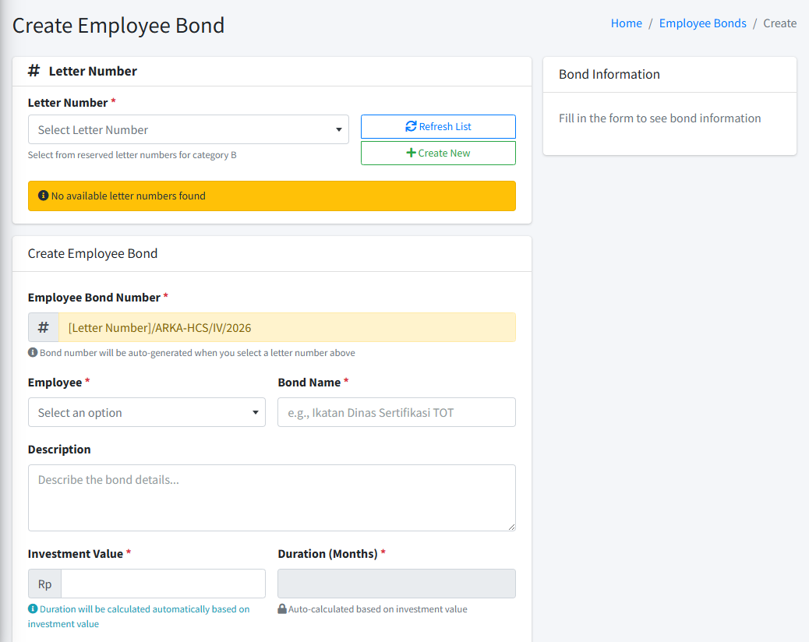

**Catatan:** Jika **Employee Bond Number** belum terbentuk, pastikan **Letter Number** sudah dipilih dan masih tersedia. Jika nomor surat tidak dapat dipakai, hubungi administrator atau tim yang mengelola **Letter Administration**.

---

## 9. Bond Violations (Pelanggaran Ikatan Dinas)

### Langkah-langkah - membuka daftar **Bond Violations**

1. Di sidebar, buka **HERO SECTION** -> **Employee Management** -> **Bond Violations**.
2. Halaman **Bond Violations** menampilkan **Bond Violation Management**.
3. Gunakan tombol **Add Violation** untuk mencatat pelanggaran baru, atau **All Bonds** untuk kembali ke daftar ikatan dinas.
4. Buka **Filter** untuk menyaring **Status**, **Employee**, **Bond Name**, **Reason**, **Date From**, dan **Date To**.
5. Tabel menampilkan **Employee**, **Bond Name**, **Violation Date**, **Reason**, **Days Worked**, **Days Remaining**, **Penalty Amount**, **Paid Amount**, **Status**, dan **Actions**.
6. Status pembayaran dapat tampil sebagai **Paid**, **Partial**, atau **Pending**.

    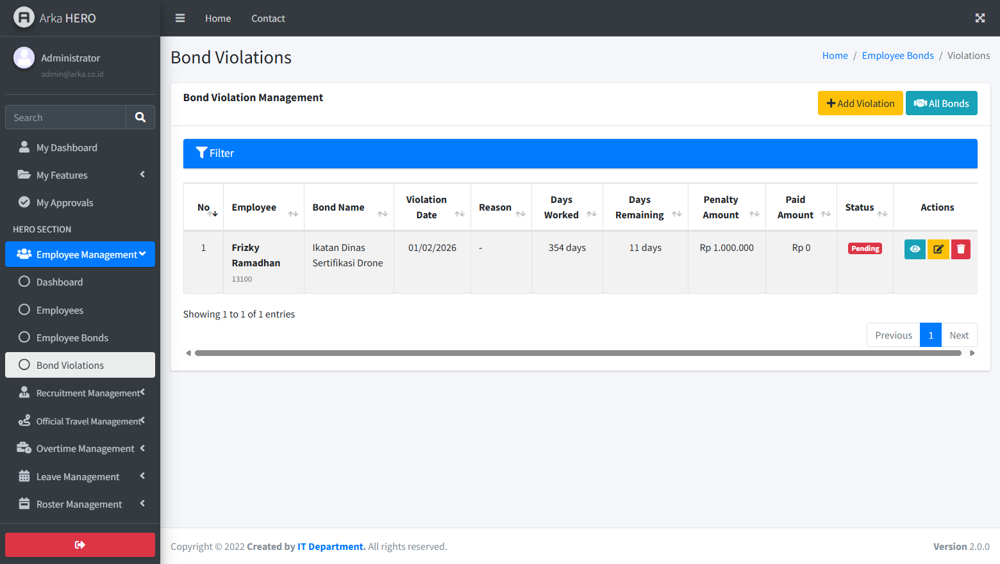

### Langkah-langkah - membuat **Create Bond Violation**

1. Dari halaman **Bond Violations** atau **Employee Bonds**, klik **Add Violation**.
2. Pada field **Employee Bond**, pilih ikatan dinas aktif yang dilanggar.
3. Isi **Violation Date**.
4. Isi **Reason** sebagai keterangan pelanggaran.
5. Isi **Payment Due Date** bila sudah ditentukan.
6. Periksa panel **Penalty Calculation**. Setelah **Employee Bond** dan **Violation Date** dipilih, sistem menampilkan **Total Investment (Biaya Pelatihan)**, **Bond Period**, **Days Worked**, **Remaining Days**, dan **Total Penalty (Fixed)**.
7. Klik **Create Violation**. Gunakan **Cancel** untuk membatalkan.

    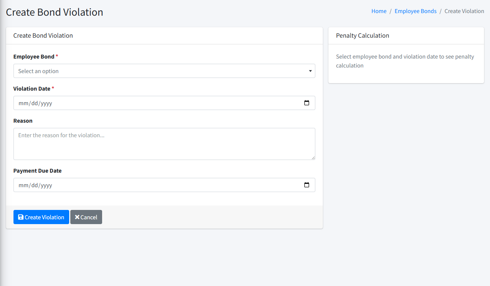

**Catatan:** Setelah pelanggaran dibuat, status ikatan dinas terkait dapat berubah menjadi **Violated**. Pastikan pelanggaran sudah disetujui sesuai prosedur HR sebelum disimpan.

---

## 10. Kesalahan & bantuan

| Gejala / pesan (contoh)                                                | Kemungkinan penyebab                                                                                            | Apa yang bisa dicoba                                                                                                                           |
| :--------------------------------------------------------------------- | :-------------------------------------------------------------------------------------------------------------- | :--------------------------------------------------------------------------------------------------------------------------------------------- |
| Menu **Employee Management** atau tombol tertentu tidak muncul         | Akun tidak memiliki **hak akses** untuk fitur tersebut                                                          | Hubungi administrator agar izin akun disesuaikan dengan tugas HR Anda.                                                                         |
| Data karyawan tidak ditemukan di daftar                                | Filter terlalu sempit, status masih **Active** saja, atau data berada di project yang tidak termasuk akses akun | Klik **Reset**, ubah **Status** menjadi **All**, lalu cari ulang berdasarkan **NIK** atau **Full Name**.                                       |
| Saat **Save**, field wajib ditolak                                     | Data wajib belum diisi atau format tidak sesuai                                                                 | Periksa field bertanda wajib seperti **Full Name**, **Identity Card**, **Employee ID (NIK)**, **Date of Hire**, **Position**, dan **Project**. |
| **Identity Card No already exists** atau data NIK sudah pernah dipakai | Nomor identitas atau NIK sudah ada pada karyawan lain                                                           | Cari data lama terlebih dahulu; jangan membuat data ganda sebelum diverifikasi.                                                                |
| Upload dokumen gagal                                                   | Format atau ukuran file tidak sesuai ketentuan layar                                                            | Gunakan PDF/JPG/PNG untuk dokumen pendukung umum; untuk dokumen ikatan dinas gunakan PDF/DOC/DOCX sesuai keterangan form.                      |
| **Import Validation Errors** muncul setelah import                     | Ada baris Excel yang formatnya salah, data wajib kosong, atau referensi master data tidak cocok                 | Baca kolom **Sheet**, **Row**, **Column**, **Value**, dan **Error Message**, lalu perbaiki file Excel sebelum import ulang.                    |
| **Employee Bond Number** tidak otomatis terbentuk                      | **Letter Number** belum dipilih atau nomor surat tidak tersedia                                                 | Pilih ulang **Letter Number** yang benar; jika tetap gagal, minta bantuan administrator.                                                       |
| **Penalty Calculation** tidak muncul                                   | **Employee Bond** atau **Violation Date** belum dipilih                                                         | Pilih ikatan dinas aktif dan tanggal pelanggaran, lalu tunggu panel menghitung ulang.                                                          |
| Data termination salah tanggal/alasan                                  | Data **Termination Date**, **Termination Reason**, atau **CoE No** keliru saat disimpan                         | Gunakan aksi koreksi jika tersedia atau hubungi administrator/HR yang berwenang untuk perbaikan data.                                          |

### Menghubungi administrator

Hubungi **administrator** atau tim **IT/HR** jika menu tidak tampil padahal seharusnya, import selalu gagal setelah file diperbaiki, data karyawan tidak bisa dibuka, nomor surat ikatan dinas tidak tersedia, atau status karyawan/ikatan dinas tidak berubah setelah proses disimpan.

Jangan mengirim **password** lewat obrolan atau surel. Cukup sampaikan **username**, waktu kejadian, nama menu, **NIK** atau nama karyawan terkait, dan ringkasan pesan yang tampil di layar.

---
