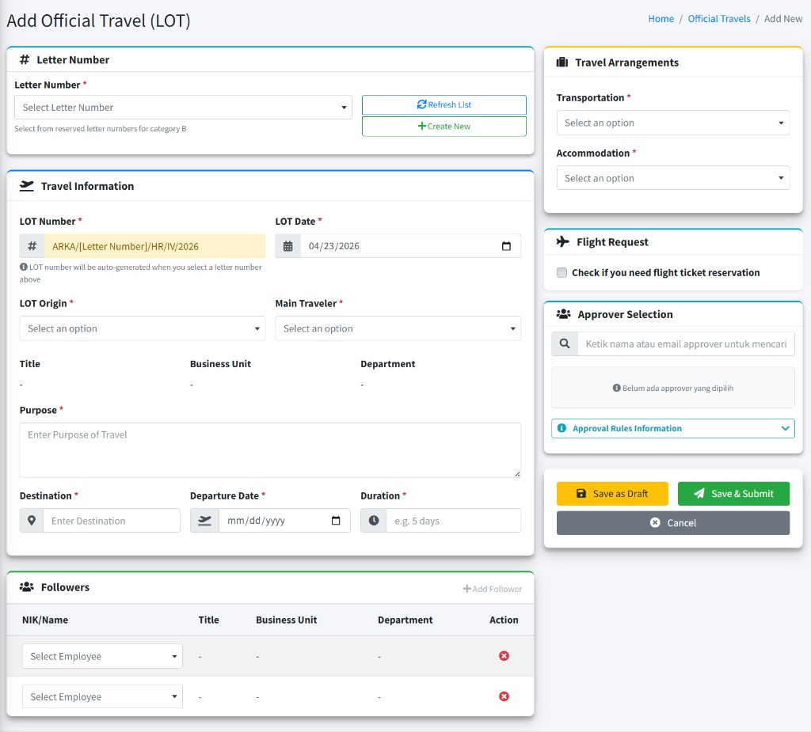
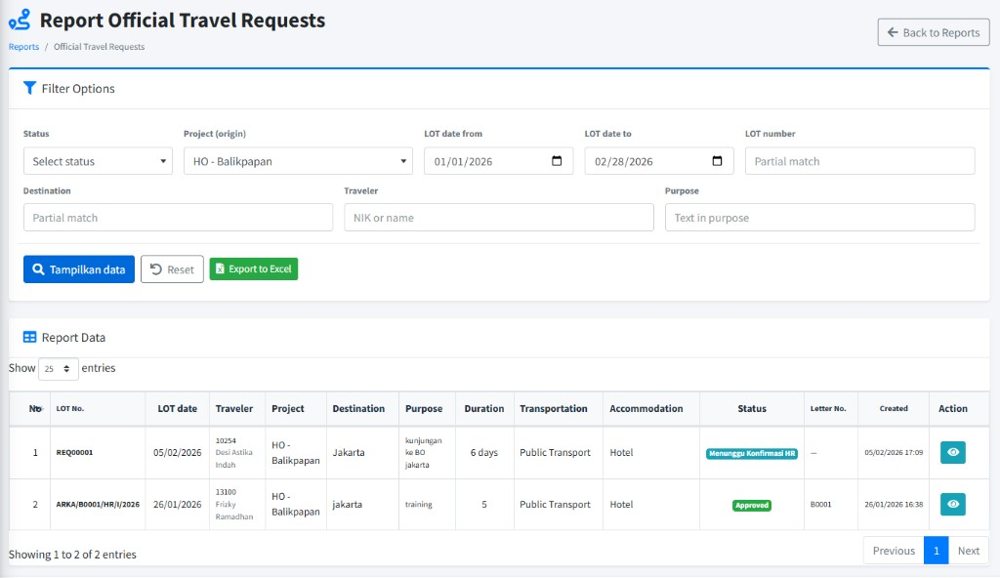
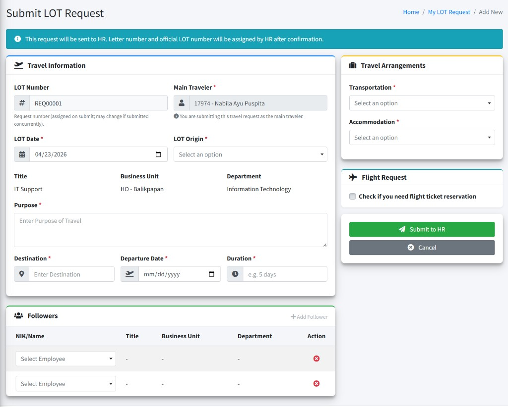

# Official Travel Management (LOT)

Panduan ini menjelaskan **Letter of Travel (LOT)** / perjalanan dinas resmi di ARKA HERO untuk **staf HR** yang mengelola data LOT (dashboard, daftar permintaan, alur kedatangan–keberangkatan, pelaporan) dan untuk **karyawan selain HR** yang mengajukan lewat menu pribadi/personal.

| **Istilah**                                                | Arti singkat                                                                                                      |
| :--------------------------------------------------------- | :---------------------------------------------------------------------------------------------------------------- |
| **LOT**                                                    | _Letter of Travel_ — surat/tiket perjalanan dinas; nomor **LOT Number** mengacu pada dokumen ini.                 |
| **Official Travels**                                       | Judul halaman daftar permintaan LOT (HR).                                                                         |
| **Letter Number**                                          | Pemilihan nomor surat dari sistem surat (kategori terkait) sebelum LOT terbit.                                    |
| **Travel Stops Timeline**                                  | Riwayat **Stop** / **Checkpoint** perjalanan: tiap stop dapat punya **Arrival** dan **Departure**.                |
| **Approver Selection**                                     | Pemilihan satu atau lebih **approver** yang menyetujui pengajuan.                                                 |
| **Flight Request**                                         | Bagian opsional untuk kebutuhan tiket pesawat (terhubung modul penerbangan jika dipakai).                         |
| **Master Data** → **Transportations** / **Accommodations** | Data referensi untuk pilihan **Transportation** dan **Accommodation** pada formulir LOT (di **GENERAL SECTION**). |

---

## 1. Untuk HR — Dashboard LOT

### Langkah-langkah — membuka **Official Travel Dashboard** (_Official Travel Dashboard_)

1. **Login** ke ARKA HERO.
2. Di sidebar, buka grup **Official Travel Management**, lalu klik **Dashboard**.
3. Baca ringkasan: **Total Travels**, **Active Travels**, **Pending Arrivals**, **This Month**; bagian **Travel Status Overview** (misalnya **Draft**, **Submitted**, **Approved**, **Rejected**); dan tabel **Open Official Travels** yaitu ringkasan LOT dengan status Open, berisi **Travel Number**, **Traveler**, **Destination**, **Date**, **Status**, **Action**.
4. Di **Quick Actions** gunakan **Pending Arrivals**, **Pending Departures** (jika tersedia dan Anda berhak mencatat stempel kedatangan dan keberangkatan), **View All Travels** ke daftar, atau **New Official Travel** untuk pengajuan baru (jika tombol tampil).

**Catatan:** Jumlah **Pending Arrivals** / **Pending Departures** terkait tugas pencatatan **stempel** untuk perjalanan yang sudah disetujui; tombol terkait hanya tampil jika **hak akses** akun Anda memungkinkan.

### Setelah membuka dashboard

Anda dapat lanjut ke **Requests** atau membuat **New Official Travel** dari kartu aksi cepat bila tersedia.

---

## 2. Untuk HR — Daftar permintaan (**Requests**)

### Langkah-langkah — **Official Travels** (daftar & filter)

1. **Login** ke ARKA HERO.
2. Di sidebar, **Official Travel Management** → **Requests**.
3. Gunakan **Filter** (buka panel **Filter**) untuk **Date From**, **Date To**, **Travel Number**, **Destination**, **NIK**, **Traveler Name**, **Project**, **Status**, dan kriteria lain jika tersedia.
4. Baca tabel; gunakan **Export** untuk ekspor data jika perlu.
5. Klik **Add** (tombol kuning dengan ikon **+**) bila diizinkan, untuk buat LOT baru.
6. Pada baris data, gunakan ikon/aksi (misalnya **View** / **Edit**) sesuai tampilan untuk membuka detail atau **Edit**.

**Catatan:** Opsi **Status** di filter dapat mencakup nilai seperti **Draft**, **Menunggu Konfirmasi HR**, **Submitted**, **Approved**, **Rejected**, **Closed** — tergantung proses di perusahaan.

---

## 3. Formulir pengajuan HR — **Letter Number**, **Official Travel Detail**, **Flight Request**, **Approver Selection**

### Langkah-langkah — buat atau ubah LOT (_Add Official Travel (LOT)_ / _Edit Official Travel_)

1. Buka **Add** dari halaman **Official Travels** (lihat bagian 2), atau buka data yang sudah ada lewat **Edit** dari daftar. <a href="#add-lot">Lihat gambar</a>.
2. **Letter Number**  
   Pilih nomor surat lewat bagian **Letter Number** (kategori surat yang dipakai organisasi, untuk LOT kategorinya adalah (B) Surat Internal). Setelah memilih, **LOT Number** umumnya terisi otomatis; baca teks bantuan di bawah isian jika ada. Jika nomor surat belum ada, klik **Create New**. <a href="#add-letter">Lihat gambar</a>.
3. **Travel Information**  
   Isi **LOT Date**, **LOT Origin** (pilih project asal), **Main Traveler**, **Purpose**, **Destination**, **Departure Date**, **Duration**. Bagian **Title**, **Business Unit**, **Department** mengikuti pilihan **Main Traveler** (tampil otomatis, bukan diisi manual di sini).
4. **Followers** (opsional)  
   Klik **Add Follower** untuk menambah baris, pilih karyawan ikut; **Remove** baris bila perlu.
5. **Travel Arrangements**  
   Pilih **Transportation** dan **Accommodation** dari daftar. Daftar ini diisi dari data **Master Data** (sidebar **GENERAL SECTION** → **Master Data** → grup **Official Travel Data** → **Transportations** / **Accommodations**).
6. **Flight Request** (opsional)  
   Centang **Check if you need flight ticket reservation** bila butuh reservasi tiket. Isi segmen penerbangan (tanggal, kota berangkat/tujuan, maskapai, waktu) sesuai form yang tampil. Permintaan tiket pesawat akan diproses oleh HR HO Balikpapan jika LOT sudah disetujui.
7. **Approver Selection**  
   Cari approver (ketik nama atau email), pastikan jumlah approver memenuhi syarat di perusahaan (klik **Approval Rules Information** untuk melihat detail informasi approval). Jika approver tidak tersedia, silakan hubungi HR/IT HO Balikpapan. <a href="#approver-selection">Lihat gambar</a>.
8. Simpan: **Save as Draft** untuk draf dan Anda dapat mengubah lewat **Edit** sampai proses persetujuan, atau **Save & Submit** untuk simpan sekaligus ajukan persetujuan ke approver yang dipilih. **Cancel** kembali ke daftar Jika tersedia, Anda juga dapat memakai opsi **Print** lewat action di detail LOT.
9. Untuk LOT yang masih dalam bentk draf, buka rincian LOT kemudian klik Submit for Approval untuk pengajuan approval.
10. Untuk LOT yang diajukan dari menu **My Official Travel Request** (diajukan oleh karyawan secara pribadi/personal), LOT akan terbentuk nomor dengan format **REQxxxxx**. Buka rincian LOT, lihat informasi rencana perjalanan dinas, kemudian klik tombol Konfirmasi & Isi Nomor Surat. Lalu pilih nomor surat yang tersedia (langkah ke no 2) dan tentukan approver yang sesuai (langkah ke no 7), lalu klik Update. Kemudian di halaman rincian LOT klik Submit for Approval untuk pengajuan approval.

Jika membuat nomor surat baru lewat **Create New**, tampilan **Create Letter Number** berisi **Basic Information** (pratinjau **Next Number Preview**, lalu isian **Project** yang sesuai, **Letter Category**, **Letter Date**, **Subject**, **Custom Subject**, tujuan surat, **Remarks**, dan sebagainya) seperti berikut.

Bagian **Approver Selection**: kolom pencarian, daftar approver terpilih (urutan 1, 2, …) dengan **X** untuk menghapus, serta **Approval Rules Information** (dapat dibuka).

---

## 4. Alur Perjalanan Dinas — **Arrivals**, **Departures**, **Stops/Checkpoint**, **Close**

1. Setelah LOT disetujui (sering tampil sebagai **Open** / **Approved** di badge status), karyawan yang melakukan perjalanan dinas akan mendapatkan nomor LOT.
2. Setelah karyawan sampai di lokasi tujuan, admin HR yang di lokasi akan mencari LOT berdasarkan nomor LOT, kemudian melakukan proses [Arrival Check](#langkah-langkah--record-arrival-arrival-check)
3. Saat karyawan akan meninggalkan lokasi tujuan dan kembali ke lokasi awal atau ke lokasi selanjutnya, admin HR akan mencari LOT berdasarkan nomor LOT, kemudian melakukan proses [Departure Check](#langkah-langkah--record-departure-departure-check)
4. Jika karyawan melakukan perjalanan ke lokasi selanjutnya / tidak langsung kembali ke lokasi awal tapi masih dalam lingkungan perusahaan, maka admin HR di lokasi selanjutnya harus melakukan proses **Arrival Check** dan **Departure Check** seperti no.2 dan 3. Jika karyawan melakukan perjalanan ke luar lingkungan perusahaan, maka pencatatan **stop/checkpoint** dilakukan oleh admin HR lokasi awal karyawan.
5. Pencarian nomor LOT bisa dilakukan dari List Official Travel atau dari Dashboard Official Travel
6. Setiap entri memuat **Stop #N** dengan subbagian **Arrival** / **Departure** (jika sudah tercatat) atau keterangan seperti **Arrival Only** / **Departure Only** tergantung isian yang sudah ada.
7. Jika belum ada **stop/checkpoint**, timeline dapat menunjukkan bahwa pencatatan belum dimulai.
8. Jika karyawan sudah kembali ke lokasi awal, admin HR akan mencari LOT berdasarkan nomor LOT, kemudian melakukan proses [Close Official Travel](#langkah-langkah--menutup-perjalanan-close)

### Langkah-langkah — **Record Arrival** (_Arrival Check_)

1. Di halaman detail LOT, klik **Record Arrival** jika tersedia.
2. Pada kartu **Arrival Check**, isi **Arrival Date & Time** dan **Arrival Notes** (wajib).
3. Klik **Confirm Arrival**; baca pertanyaan konfirmasi di jendela pop-up. **Cancel** kembali ke detail.

### Langkah-langkah — **Record Departure** (_Departure Check_)

1. Setelah urutan stempel memungkinkan, klik **Record Departure** di halaman detail.
2. Baca **Current Stop Information** (misalnya **Arrival Confirmed By**, **Arrival Notes**).
3. Isi **Departure Date & Time** dan **Departure Notes** pada **Departure Check**; klik **Confirm Departure**; setujui peringatan bila muncul.

**Catatan:** Urutan wajar: **arrival** pada suatu **stop** sebelum **departure**; aksi mungkin ditolak jika urutan belum benar atau **hak akses** tidak memadai.

### Langkah-langkah — menutup perjalanan (**Close**)

1. Buka detail LOT bila kondisi sudah memenuhi syarat penutupan (misalnya perjalanan selesai menurut kebijakan).
2. Klik **Close Official Travel**; di jendela **Close Travel Request** baca teks peringatan di layar.
3. Klik **Yes, Close Travel** untuk melanjutkan. Setelah sukses, status dapat menjadi **Closed** dan perubahan berikutnya dibatasi.

**Catatan:** Pencatatan stempel dan penutupan hanya tersedia bila **hak akses** Anda sesuai; bila menu atau tombol tidak muncul, hubungi **administrator**.

---

## 5. Untuk HR — **Reports**

### Langkah-langkah — buka ringkasan laporan

1. **Login** ke ARKA HERO.
2. **Official Travel Management** → **Reports**.
3. Baca penjelasan kartu (analitik & laporan LOT), lalu klik **View Report** pada **Official Travel Requests Report** untuk membuka halaman laporan.
4. Di halaman **Report Official Travel Requests**, isi **Filter Options** (**Status**, **Project (origin)**, rentang **LOT date**, **LOT number**, **Destination**, **Traveler**, **Purpose**, dan sebagainya), lalu klik **Tampilkan data** untuk memuat tabel. Gunakan **Reset** bila perlu mengosongkan filter, dan **Export to Excel** jika tersedia. Tombol **Back to Reports** mengembalikan ke ringkasan laporan.

**Catatan:** Laporan ini umumnya memerlukan setidaknya satu kriteria filter dipilih dulu; jika tabel tampil kosong, coba pilih **Date**, **Status**, proyek, atau isian filter lain, lalu muat ulang.

---

## 6. Karyawan (non–HR) — **My Official Travel Request**

Bagi karyawan dengan peran “user” (menu **My Features**), pengajuan pribadi lewat item berikut (bukan menu **Official Travel Management** di atas).

### Langkah-langkah — buka daftar & ajukan

1. **Login** ke ARKA HERO.
2. Di sidebar, **My Features** → **My Official Travel Request** (bukan menu HR **Official Travel Management**).
3. Buka panel **Filter** bila perlu; gunakan **Travel Number**, **Status**, **Role** (**Main Traveler** / **Follower**), dan lainnya.
4. Klik **New Request** untuk mengajukan permintaan baru (jika tombol tampil). <a href="#submit-lot-request">Lihat gambar</a>.
5. Isi form **Submit LOT Request** (informasi perjalanan, **Followers**, **Travel Arrangements**, **Flight Request**, dan seterusnya), lalu klik **Submit to HR** untuk mengirim. LOT akan terbentuk nomor dengan format **REQxxxxx** sampai HR mengonfirmasi; surat resmi dan nomor LOT final ditetapkan HR.
6. Untuk melihat detail atau mengubah: di daftar, gunakan action **View** atau **Edit** pada baris terkait.
7. Langkah selanjutnya akan diproses oleh admin HR untuk proses konfirmasi dengan mengisi nomor LOT yang resmi (ARKA/Bxxxx/HR/IV/2026) dan menentukan approver yang sesuai.

---

## 7. Kesalahan & bantuan

| Gejala / pesan (contoh)                                      | Kemungkinan penyebab                                                        | Apa yang bisa dicoba                                                                             |
| :----------------------------------------------------------- | :-------------------------------------------------------------------------- | :----------------------------------------------------------------------------------------------- |
| Tombol **Add** / **Record Arrival** / **Close** tidak muncul | Akun tidak memiliki **hak akses** yang diperlukan                           | Hubungi **administrator** agar izin memakai fitur ini disesuaikan dengan tugas Anda.             |
| **LOT Number** tidak terisi                                  | **Letter Number** belum dipilih atau aturan surat kantor belum terpenuhi    | Pilih kembali surat; ikuti kebijakan **Letter Administration** (nomor surat) di perusahaan Anda. |
| Tabel **Reports** selalu kosong                              | Filter belum diisi cukup (sering wajib minimal satu kriteria)               | Pilih setidaknya satu kriteria, lalu muat ulang.                                                 |
| Tidak dapat **Confirm Arrival** / **Confirm Departure**      | Urutan pencatatan stempel belum benar, atau pemberi stempel bukan akun Anda | Periksa **Travel Stops Timeline**; selesaikan stempel sebelumnya; tanyakan HR bila ragu.         |
| Pesan wajib pilih approver ( **Approver Selection** )        | Jumlah approver belum memenuhi syarat                                       | Pilih approver lewat pencarian hingga memenuhi aturan.                                           |
| Akses ditolak, atau halaman “tidak ditemukan”                | Tautan atau nomor bukan milik data Anda, atau bukan bagian wewenang Anda    | Buka kembali dari **menu** dan daftar; jangan menebak tautan; pastikan memakai akun yang benar.  |

### Menghubungi administrator

Hubungi **administrator** (atau **IT** / **HR**) jika: menu tidak tampil padahal seharusnya, status LOT tidak berubah setelah tindakan wajar, pesan di layar tidak tercantum di tabel, atau Anda membutuhkan koreksi data master (**Transportations**, **Accommodations**, **Projects**).

**Jangan** mengirim **password** lewat obrolan atau surel. Cukup sampaikan **username**, nomor **LOT** / **Travel Number**, waktu kejadian, dan cuplikan pesan error.

---
