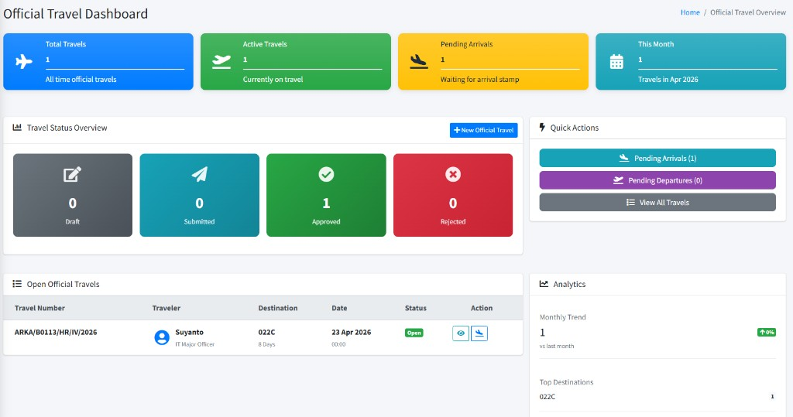
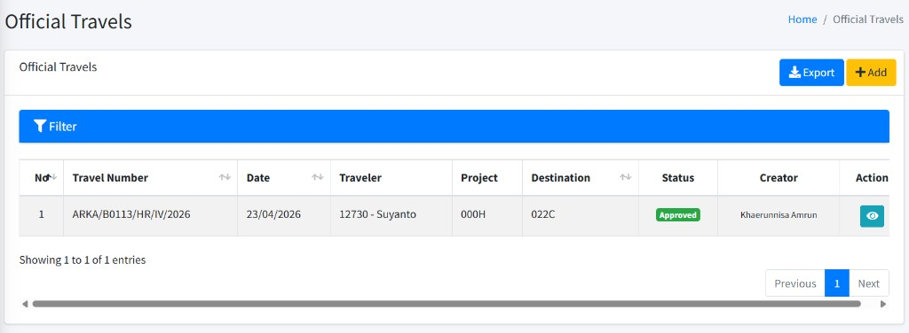
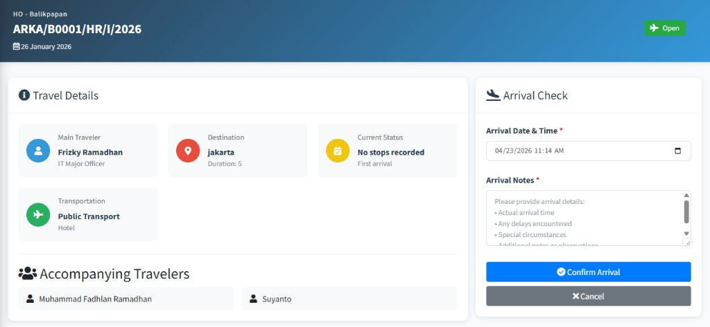
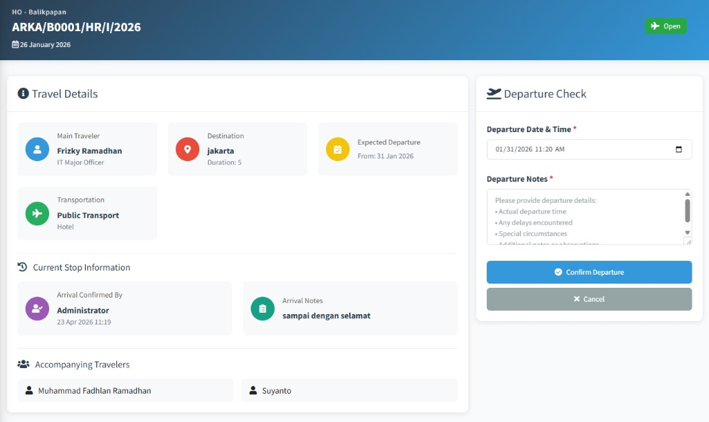

# Official Travel Management (LOT)

Panduan ini menjelaskan **Letter of Travel (LOT)** / perjalanan dinas resmi di ARKA HERO untuk **staf HR** yang mengelola data LOT (dashboard, daftar permintaan, alur kedatangan–keberangkatan, pelaporan) dan untuk **karyawan selain HR** yang mengajukan lewat menu pribadi. Nama menu, tombol, dan teks di layar mengikuti **bahasa Inggris** seperti di aplikasi; istilah penting diringkas di glosarium.

| **Istilah**                                                | Arti singkat                                                                                                      |
| :--------------------------------------------------------- | :---------------------------------------------------------------------------------------------------------------- |
| **LOT**                                                    | _Letter of Travel_ — surat/tiket perjalanan dinas; nomor **LOT Number** mengacu pada dokumen ini.                 |
| **Official Travels**                                       | Judul halaman daftar permintaan LOT (HR).                                                                         |
| **Letter Number**                                          | Pemilihan nomor surat dari sistem surat (kategori terkait) sebelum LOT terbit.                                    |
| **Travel Stops Timeline**                                  | Riwayat **Stop** perjalanan: tiap stop dapat punya **Arrival** dan **Departure**.                                 |
| **Approver Selection**                                     | Pemilihan satu atau lebih **approver** yang menyetujui pengajuan.                                                 |
| **Flight Request**                                         | Bagian opsional untuk kebutuhan tiket pesawat (terhubung modul penerbangan jika dipakai).                         |
| **Master Data** → **Transportations** / **Accommodations** | Data referensi untuk pilihan **Transportation** dan **Accommodation** pada formulir LOT (di **GENERAL SECTION**). |

---

## 1. Untuk HR — Dashboard LOT

### Langkah-langkah — membuka **Official Travel Dashboard** (_Official Travel Dashboard_ / _Official Travel Overview_)

1. **Login** ke ARKA HERO.
2. Di sidebar, buka grup **Official Travel Management**, lalu klik **Dashboard**.
3. Baca ringkasan: **Total Travels**, **Active Travels**, **Pending Arrivals**, **This Month**; bagian **Travel Status Overview** (misalnya **Draft**, **Submitted**, **Approved**, **Rejected**); dan tabel **Open Official Travels** berisi ringkasan seperti **Travel Number**, **Traveler**, **Destination**, **Date**, **Status**, **Action**.
4. Di **Quick Actions** gunakan **Pending Arrivals**, **Pending Departures** (jika tersedia dan Anda berhak mencatat stempel), **View All Travels** ke daftar, atau **New Official Travel** untuk pengajuan baru (jika tombol tampil).

**Catatan:** Jumlah **Pending Arrivals** / **Pending Departures** terkait tugas pencatatan **stempel** untuk perjalanan yang sudah disetujui; tombol terkait hanya tampil jika **hak akses** akun Anda memungkinkan.

### Setelah membuka dashboard

Anda dapat lanjut ke **Requests** atau membuat **New Official Travel** dari kartu aksi cepat bila tersedia.

---

## 2. Untuk HR — Daftar permintaan (**Requests**)

### Langkah-langkah — **Official Travels** (daftar & filter)

1. **Login** ke ARKA HERO.
2. Di sidebar, **Official Travel Management** → **Requests**.
3. Gunakan **Filter** (buka panel **Filter**) untuk **Date From**, **Date To**, **Travel Number**, **Destination**, **NIK**, **Traveler Name**, **Project**, **Status**, dan kriteria lain jika tersedia.
4. Baca tabel; gunakan **Export** untuk ekspor data jika perlu.
5. Klik **Add** (tombol kuning dengan ikon **+**) bila diizinkan, untuk buat LOT baru.
6. Pada baris data, gunakan ikon/aksi (misalnya **View** / **Edit**) sesuai tampilan untuk membuka detail atau **Edit**.

**Catatan:** Opsi **Status** di filter dapat mencakup nilai seperti **Draft**, **Menunggu Konfirmasi HR**, **Submitted**, **Approved**, **Rejected**, **Closed** — tergantung proses di perusahaan.

---

## 3. Formulir pengajuan HR — **Letter Number**, detail LOT, **Flight Request**, **Approver Selection**

### Langkah-langkah — buat atau ubah LOT (_Add Official Travel (LOT)_ / _Edit Official Travel_)

1. Buka **Add** dari halaman **Official Travels** (lihat bagian 2), atau buka data yang sudah ada lewat **Edit** dari daftar.
2. **Letter Number**  
   Pilih nomor surat lewat bagian **Letter Number** (kategori surat yang dipakai organisasi). Setelah memilih, **LOT Number** umumnya terisi otomatis; baca teks bantuan di bawah isian jika ada.
3. **Travel Information**  
   Isi **LOT Date**, **LOT Origin** (pilih proyek asal), **Main Traveler**, **Purpose**, **Destination**, **Departure Date**, **Duration**. Bagian **Title**, **Business Unit**, **Department** mengikuti pilihan **Main Traveler** (tampil otomatis, bukan diisi manual di sini).
4. **Followers** (opsional)  
   Klik **Add Follower** untuk menambah baris, pilih karyawan ikut; **Remove** baris bila perlu.
5. **Travel Arrangements**  
   Pilih **Transportation** dan **Accommodation** dari daftar. Daftar ini diisi dari data **Master Data** (sidebar **GENERAL SECTION** → **Master Data** → grup **Official Travel Data** → **Transportations** / **Accommodations**).
6. **Flight Request** (opsional)  
   Centang **Check if you need flight ticket reservation** bila butuh reservasi tiket. Isi segmen penerbangan (tanggal, kota berangkat/tujuan, maskapai, waktu) sesuai form yang tampil.
7. **Approver Selection**  
   Cari approver (nama atau email), pastikan jumlah approver memenuhi syarat di perusahaan (misalnya minimal satu bila wajib). Di layar tercantum approver terpilih beserta urutannya.
8. Simpan: **Save as Draft** untuk draf, atau **Save & Submit** untuk simpan sekaligus ajukan. **Cancel** kembali ke daftar. Jika tersedia, Anda juga dapat memakai opsi **Print** lewat tindakan di detail LOT.

### Setelah data tersimpan

- **Save as Draft:** status tetap **Draft**; Anda dapat mengubah lewat **Edit** sampai proses setujuan.
- **Save & Submit:** alur lanjut ke pihak approver/HR sesuai kebijakan (tampilan status di detail LOT).

---

## 4. Alur resmi perjalanan — **Arrivals**, **Departures**, **Stops**, **Close**

Setelah LOT disetujui (sering tampil sebagai **Open** / **Approved** di badge status), pencatatan perjalanan memakai **stempel** dan riwayat **stops** di detail.

### Langkah-langkah — melihat **Travel Stops Timeline**

1. Buka detail LOT: dari daftar, klik tindakan **View** pada baris terkait.
2. Geser ke bagian **Travel Stops Timeline**. Setiap entri memuat **Stop #N** dengan subbagian **Arrival** / **Departure** (jika sudah tercatat) atau keterangan seperti **Arrival Only** / **Departure Only** tergantung isian yang sudah ada.
3. Jika belum ada stop, timeline dapat menunjukkan bahwa pencatatan belum dimulai.

### Langkah-langkah — **Record Arrival** (_Arrival Check_)

1. Di halaman detail LOT, klik **Record Arrival** jika tersedia.
2. Pada kartu **Arrival Check**, isi **Arrival Date & Time** dan **Arrival Notes** (wajib).
3. Klik **Confirm Arrival**; baca pertanyaan konfirmasi di jendela pop-up. **Cancel** kembali ke detail.

### Langkah-langkah — **Record Departure** (_Departure Check_)

1. Setelah urutan stempel memungkinkan, klik **Record Departure** di halaman detail.
2. Baca **Current Stop Information** (misalnya **Arrival Confirmed By**, **Arrival Notes**).
3. Isi **Departure Date & Time** dan **Departure Notes** pada **Departure Check**; klik **Confirm Departure**; setujui peringatan bila muncul.

**Catatan:** Urutan wajar: **arrival** pada suatu **stop** sebelum **departure**; aksi mungkin ditolak jika urutan belum benar atau **hak akses** tidak memadai.

### Langkah-langkah — menutup perjalanan (**Close**)

1. Buka detail LOT bila kondisi sudah memenuhi syarat penutupan (misalnya perjalanan selesai menurut kebijakan).
2. Klik **Close Official Travel**; di jendela **Close Travel Request** baca teks peringatan di layar.
3. Klik **Yes, Close Travel** untuk melanjutkan. Setelah sukses, status dapat menjadi **Closed** dan perubahan berikutnya dibatasi.

**Catatan:** Pencatatan stempel dan penutupan hanya tersedia bila **hak akses** Anda sesuai; bila menu atau tombol tidak muncul, hubungi **administrator**.

---

## 5. Untuk HR — **Reports**

### Langkah-langkah — buka ringkasan laporan

1. **Login** ke ARKA HERO.
2. **Official Travel Management** → **Reports**.
3. Baca penjelasan kartu (analitik & laporan LOT), lalu klik **View Report** pada **Official Travel Requests Report** untuk membuka tabel.
4. Di halaman laporan, atur filter (status, proyek, rentang tanggal, nomor LOT, tujuan, pencarian traveler, maksud, dan lainnya yang tersedia), lalu tampilkan kembali data. Gunakan **export** (misalnya ke Excel) bila tersedia.

**Catatan:** Laporan ini umumnya memerlukan setidaknya satu kriteria filter dipilih dulu; jika tabel tampil kosong, coba pilih **Date**, **Status**, proyek, atau isian filter lain, lalu muat ulang.

---

## 6. Karyawan (non–HR) — **My Official Travel Request**

Bagi karyawan dengan peran “user” (menu **My Features**), pengajuan pribadi lewat item berikut (bukan menu **Official Travel Management** di atas).

### Langkah-langkah — buka daftar & ajukan

1. **Login** ke ARKA HERO.
2. Di sidebar, **My Features** → **My Official Travel Request** (bukan menu HR **Official Travel Management**).
3. Buka panel **Filter** bila perlu; gunakan **Travel Number**, **Status**, **Role** (**Main Traveler** / **Follower**), dan lainnya.
4. Klik **New Request** untuk mengajukan permintaan baru (jika tombol tampil).
5. Isi form (informasi perjalanan, **Followers**, **Travel Arrangements**, **Flight Request**, **Approver Selection**, dan seterusnya), lalu simpan.
6. Untuk melihat detail atau mengubah: di daftar, gunakan tindakan **View** atau **Edit** pada baris terkait.

**Catatan:** Breadcrumb mungkin menunjuk ke **My Dashboard**; judul internal bisa tampil sebagai **My LOT Request** / **My Official Travels** — mengacu modul yang sama.

---

## 7. Kesalahan & bantuan

| Gejala / pesan (contoh)                                      | Kemungkinan penyebab                                                        | Apa yang bisa dicoba                                                                             |
| :----------------------------------------------------------- | :-------------------------------------------------------------------------- | :----------------------------------------------------------------------------------------------- |
| Tombol **Add** / **Record Arrival** / **Close** tidak muncul | Akun tidak memiliki **hak akses** yang diperlukan                           | Hubungi **administrator** agar izin memakai fitur ini disesuaikan dengan tugas Anda.             |
| **LOT Number** tidak terisi                                  | **Letter Number** belum dipilih atau aturan surat kantor belum terpenuhi    | Pilih kembali surat; ikuti kebijakan **Letter Administration** (nomor surat) di perusahaan Anda. |
| Tabel **Reports** selalu kosong                              | Filter belum diisi cukup (sering wajib minimal satu kriteria)               | Pilih setidaknya satu kriteria, lalu muat ulang.                                                 |
| Tidak dapat **Confirm Arrival** / **Confirm Departure**      | Urutan pencatatan stempel belum benar, atau pemberi stempel bukan akun Anda | Periksa **Travel Stops Timeline**; selesaikan stempel sebelumnya; tanyakan HR bila ragu.         |
| Pesan wajib pilih approver ( **Approver Selection** )        | Jumlah approver belum memenuhi syarat                                       | Pilih approver lewat pencarian hingga memenuhi aturan.                                           |
| Akses ditolak, atau halaman “tidak ditemukan”                | Tautan atau nomor bukan milik data Anda, atau bukan bagian wewenang Anda    | Buka kembali dari **menu** dan daftar; jangan menebak tautan; pastikan memakai akun yang benar.  |

### Menghubungi administrator

Hubungi **administrator** (atau **IT** / HR) jika: menu tidak tampil padahal seharusnya, status LOT tidak berubah setelah tindakan wajar, pesan di layar tidak tercantum di tabel, atau Anda membutuhkan koreksi data master (**Transportations**, **Accommodations**, **Projects**).

**Jangan** mengirim **password** lewat obrolan atau surel. Cukup sampaikan **username**, nomor **LOT** / **Travel Number**, waktu kejadian, dan cuplikan pesan error.

---
