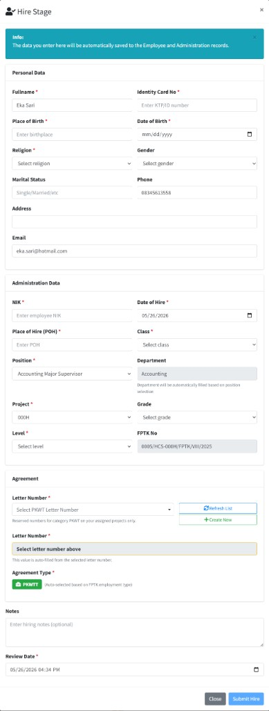

# Recruitment Management

| **Versi** | **Tanggal** | **Revisi (ringkas)**                                                                                                                                                                      |
| :-------- | :---------- | :---------------------------------------------------------------------------------------------------------------------------------------------------------------------------------------- |
| 1.1       | 2026-05-25  | **Update Approvers** pada detail FPTK **Submitted**: hanya langkah **Pending** yang dapat diganti; approver yang sudah **Approved**/**Rejected** terkunci.                                |
| 1.0       | 2026-05-25  | Panduan awal: dashboard HR, **Requests (FPTK)** & **Requests (MPP)**, **Candidates (CV)**, **Sessions** (alur tahap rekrutmen), **Reports**, **My Recruitment Request**, troubleshooting. |

Panduan ini menjelaskan modul rekrutmen di ARKA HERO untuk **staf HR** yang mengoperasikan menu grup **Recruitment Management** di **HERO SECTION** (dashboard, permintaan FPTK/MPP, kandidat, sesi rekrutmen, laporan) dan untuk **semua karyawan** yang mengajukan permintaan tenaga kerja lewat **My Features** → **My Recruitment Request**.

| **Istilah**                | Arti singkat                                                                                                                                                                                                                         |
| :------------------------- | :----------------------------------------------------------------------------------------------------------------------------------------------------------------------------------------------------------------------------------- |
| **Recruitment Management** | Grup menu di **HERO SECTION** untuk dashboard HR, permintaan rekrutmen, kandidat, sesi, dan laporan.                                                                                                                                 |
| **FPTK**                   | _Formulir Permintaan Tenaga Kerja_ — dokumen resmi permintaan rekrutmen; di sistem tercatat sebagai **Recruitment Request (FPTK)** dengan **Request Number** / **FPTK Number**.                                                      |
| **MPP**                    | _Man Power Plan_ — rencana kebutuhan tenaga kerja per proyek; di menu **Requests (MPP)**.                                                                                                                                            |
| **Letter Number**          | Nomor surat dari modul **Letter Administration**; dipilih saat HR membuat FPTK agar **FPTK Number** ter-generate otomatis.                                                                                                           |
| **Approver Selection**     | Pemilihan satu atau lebih **approver** sebelum **Save & Submit** atau **Submit for Approval**; alur persetujuan mengikuti **My Approvals**.                                                                                          |
| **Update Approvers**       | Tombol pada kartu **Approval Status** (detail FPTK **Submitted**) untuk mengganti approver yang masih **Pending**; approver yang sudah memutuskan tidak dapat diubah.                                                                |
| **Recruitment Session**    | Satu proses rekrutmen yang menghubungkan **kandidat** dengan FPTK/MPP yang **Approved**/**Active**; berjalan per tahap (**CV Review**, **Psikotes**, **Interview HR-User-Trainer**, **Offering**, **MCU**, **Hiring & Onboarding**). |
| **Transition Stage**       | Tombol HR pada **Recruitment Timeline** untuk memindahkan sesi kandidat ke tahap rekrutmen lain secara manual (dengan alasan audit); memerlukan izin khusus.                                                                         |
| **Candidate (CV)**         | Data pelamar beserta curriculum vitae di **bank CV** (pool kandidat); dapat dipilih dan dimasukkan ke FPTK **Approved** atau baris MPP **Active** lewat **Recruitment Session**.                                                     |
| **Global Status**          | Status kandidat di pool: **Available**, **In Process**, **Hired**, **Blacklisted**.                                                                                                                                                  |
| **Final Status**           | Status akhir sesi: **In Process**, **Hired**, **Rejected**, **Withdrawn**, **Cancelled**.                                                                                                                                            |
| **My Recruitment Request** | Submenu **My Features** bagi karyawan untuk mengajukan dan memantau FPTK mandiri (nomor sementara **REQxxxxx** sampai HR menetapkan nomor resmi).                                                                                    |
| **Close Request**          | Penutupan FPTK/MPP yang sudah terpenuhi atau tidak lagi dibuka rekrutmen; tersedia di halaman sesi FPTK/MPP yang disetujui.                                                                                                          |

---

## 1. Ringkasan Menu

| **Menu**                   | **Navigasi (sidebar)**                                              | **Uraian**                                                                                                   |
| :------------------------- | :------------------------------------------------------------------ | :----------------------------------------------------------------------------------------------------------- |
| **Dashboard**              | **HERO SECTION** → **Recruitment Management** → **Dashboard**       | Ringkasan FPTK aktif, pool kandidat, sesi, grafik tahap, dan sesi terbaru.                                   |
| **Requests (FPTK)**        | **HERO SECTION** → **Recruitment Management** → **Requests (FPTK)** | Daftar permintaan FPTK HR; filter, tambah, ubah, ajukan, cetak, assign nomor surat.                          |
| **Requests (MPP)**         | **HERO SECTION** → **Recruitment Management** → **Requests (MPP)**  | Daftar **Man Power Plan** per proyek; tambah dan kelola rencana kebutuhan tenaga kerja.                      |
| **Candidates (CV)**        | **HERO SECTION** → **Recruitment Management** → **Candidates (CV)** | **Bank CV** / pool kandidat; simpan profil pelamar, lalu pilih kandidat untuk FPTK/MPP lewat sesi rekrutmen. |
| **Sessions**               | **HERO SECTION** → **Recruitment Management** → **Sessions**        | Daftar FPTK/MPP yang siap rekrutmen beserta progres kandidat; pintu masuk ke detail sesi per kandidat.       |
| **Reports**                | **HERO SECTION** → **Recruitment Management** → **Reports**         | Pintu masuk laporan funnel, aging, time-to-hire, offer acceptance, assessment, stale candidates.             |
| **My Recruitment Request** | **My Features** → **My Recruitment Request**                        | Self-service karyawan: daftar, buat, ubah, lihat FPTK mandiri.                                               |

**Catatan peran:** Menu **Dashboard** sampai **Reports** hanya tampil jika akun memiliki hak akses rekrutmen HR. **My Recruitment Request** tampil terpisah di grup **My Features** dan tidak membuka submenu **Recruitment Management**.

---

## 2. Untuk HR — **Recruitment Dashboard**

### Langkah-langkah — membuka **Recruitment Dashboard** (_Recruitment Analytics and Overview_)

1. **Login** ke ARKA HERO.
2. Di sidebar, buka **HERO SECTION** → **Recruitment Management** → **Dashboard**.
3. Baca kartu ringkasan:

- **Active/Approved FPTK** — jumlah permintaan FPTK yang masih aktif/disahkan (**All requests currently active**).
- **Candidate Pool** — kandidat **Available** atau **In Process** (**Available or in process**).
- **Total Sessions** — total sesi rekrutmen sepanjang waktu (**All time applications**).
- **New Applications** — sesi baru pada bulan berjalan (**Applications in [bulan tahun]**).

4. Tinjau grafik **Active Sessions by Stage** (donut) dan panel **Quick Statistics**: **Success Rate**, **Active Rate**, **Rejection Rate**.
5. Pada tabel **Recent Sessions**, baca kolom **FPTK/MPP Number**, **Position**, **Candidate**, **Stage**, **Status**, **Applied Date**; gunakan ikon **View** atau tombol **View All** untuk ke halaman **Sessions**.
6. Panel **Stage Breakdown** menampilkan jumlah sesi per tahap aktif; **Quick Actions** → **View All Sessions** membuka daftar sesi lengkap.

    
 <em>Gambar 2.1 — Recruitment Dashboard</em>

---

## 3. Untuk HR — **Requests (FPTK)**

### 3.1 Daftar dan filter **Recruitment Request (FPTK)**

1. **Login** → sidebar **HERO SECTION** → **Recruitment Management** → **Requests (FPTK)**.
2. Judul kartu: **Recruitment Request (FPTK)**. Tombol **Export** (jika tersedia) mengunduh data; tombol **Add** (kuning, ikon **+**) membuka form baru.
3. Buka panel **Filter** untuk menyaring:

- **Request Number**, **Department**, **Position**, **Level**
- **Date From** / **Date To**
- **Status** — **Draft**, **Submitted**, **Approved**, **Rejected**, **Cancelled**, **Closed**

4. Tabel menampilkan kolom **No**, **Request Number**, **Department**, **Position**, **Level**, **Employment Type**, **Status**, **Requested By**, **Action** (ikon **View**).
5. Klik **Reset** di filter untuk mengosongkan kriteria.

    
 <em>Gambar 3.1 — Daftar Requests (FPTK)</em>

### 3.2 Form tambah atau ubah FPTK (_Create Recruitment Request (FPTK)_ / _Edit Recruitment Request (FPTK)_)

Klik **Add** dari daftar, atau buka **Edit** dari detail FPTK berstatus **Draft**.

**1. Letter Number**

Pilih nomor surat kategori **FPTK** lewat komponen **Letter Number**. Setelah dipilih, field **FPTK Number** terisi otomatis (format mengikuti penomoran perusahaan, misalnya **[Letter Number]/HCS-[Project Code]/FPTK/[bulan Romawi]/[tahun]**). Jika nomor surat belum ada, gunakan opsi **Create New** dari selector (selaras modul **Letter Administration**).

**2. FPTK Information**

- **FPTK Number** — ter-generate dari **Letter Number**.
- **Request Date** — tanggal permintaan.
- **Department**, **Project**, **Position**, **Level** — wajib.
- **Job Description** — wajib; uraian tugas posisi.

**3. Request Details**

- **Required Quantity** — jumlah orang (1–50).
- **Required Date** — tanggal kebutuhan tenaga kerja.
- **Request Reason** — **Additional - Workplan**, **Replacement - Promotion, Mutation, Demotion**, atau **Replacement - Resign, Termination, End of Contract**.
- **Employment Type** — **PKWTT (Permanent)**, **PKWT (Contract)**, **Daily Worker**, **Internship**.

**4. Requirements**

- **Gender** — **Male**, **Female**, **Any**.
- **Marital Status** — **Single**, **Married**, **Any**.
- **Min Age** / **Max Age**, **Education**, **Required Skills**, **Required Experience** — pelengkap sesuai kebutuhan.

**5. Additional Requirements** _(panel kanan)_

- **Physical Requirements**, **Mental Requirements**, **Other Requirements**.
- Centang **Posisi ini memerlukan Tes Teori** jika posisi mekanik atau membutuhkan kompetensi teknis (**Tes Teori** akan muncul di alur sesi).

**6. Approver Selection**

Pilih approver sesuai dengan aturan approval yang berlaku. Klik **Approval Rules Information** untuk melihat aturanya. Wajib diisi sebelum pengajuan.

**7. Simpan**

- **Save as Draft** — dapat diedit kemudian.
- **Save & Submit** — langsung mengajukan; setelah submit FPTK **tidak dapat diedit** lagi (konfirmasi di layar).
- **Cancel** — kembali ke daftar tanpa menyimpan.

    
 <em>Gambar 3.2 — Form Create Recruitment Request (FPTK)</em>

**Catatan:** Pengajuan mandiri karyawan lewat **My Recruitment Request** tidak memakai **Letter Number** di form awal; nomor sementara **REQxxxxx** diganti HR setelah konfirmasi — lihat [bagian 8](#section-8-my-recruitment-request).

### 3.3 Detail FPTK, persetujuan, dan nomor resmi

Buka detail lewat ikon **View** pada daftar. Judul: **Detail Recruitment Request**; header menampilkan nomor FPTK, proyek, tanggal, dan badge status.

**Membaca halaman detail**

- Kartu **FPTK Information** — department, project, position, level, quantity, required date, employment type, alasan, kebutuhan tes teori, job description, requirements.
- **Approval Status** — daftar approver berurutan dengan badge status (**Pending**, **Approved**, **Rejected**, dll.) bila sudah diajukan. Pada FPTK **Submitted** yang masih punya langkah **Pending**, HR dapat membuka form **Approver Selection** di kartu yang sama (lihat [mengubah approver pending](#mengubah-approver-pending) di bawah).
- **Requested By** — pembuat permintaan.
- Tabel **Recruitment Sessions** — muncul setelah ada kandidat terdaftar; kolom tahap (**CV Review**, **Psikotes**, **Tes Teori**, **Interview HR**, **Interview User**, **Offering**, **MCU**, **Hiring & Onboarding**, **Final Status**).

    
 <em>Gambar 3.3 — Membaca halaman detail FPTK Submitted: <strong>FPTK Information</strong> dan <strong>Approval Status</strong></em>

    
 <em>Gambar 3.4 — <strong>Job Description &amp; Requirements</strong>, kebutuhan posisi, dan <strong>Requested By</strong> pada detail FPTK Submitted</em>

**Aksi (panel kanan, sesuai status dan hak akses)**

| Status                        | Aksi umum                                                                                                                      |
| :---------------------------- | :----------------------------------------------------------------------------------------------------------------------------- |
| **Draft**                     | **Edit**, **Delete**, **Submit for Approval** (HR; konfirmasi SweetAlert — setelah submit isi FPTK tidak bisa diedit)          |
| **Submitted**                 | Approver memproses lewat **My Approvals**; HR dapat **Update Approvers** selama masih ada langkah **Pending** (lihat di bawah) |
| **Approved**                  | **Assign Letter Number** jika belum ada nomor surat resmi                                                                      |
| Semua (kecuali ditolak/batal) | **Print FPTK**, **Back to List**                                                                                               |

**Catatan:** Setelah **Submit for Approval**, field FPTK (department, posisi, quantity, dll.) **tidak dapat diedit** lagi; yang masih dapat disesuaikan HR hanya **approver pada langkah Pending** lewat **Update Approvers**.

**Penjelasan singkat — alur persetujuan FPTK**

1. Pembuat (HR atau karyawan via HR) menyimpan **Draft** atau mengajukan (**Submitted**).
2. **Approver** yang dipilih memberi keputusan di **My Approvals** (lihat panduan **My Approvals**, jenis dokumen **Recruitment Request**).
3. Setelah **Approved**, HR menetapkan **Letter Number** bila belum otomatis — tombol **Assign Letter Number**.
4. FPTK **Approved** dengan nomor resmi siap menerima kandidat di menu **Sessions**.

### Langkah-langkah — mengubah approver yang masih **Pending** (_Update Approvers_)

Fitur ini hanya untuk **HR** dengan hak **`recruitment-requests.edit`**, pada detail FPTK berstatus **Submitted**, dan **bukan** dari halaman **My Recruitment Request** karyawan.

1. Buka detail FPTK (**View** dari daftar **Requests (FPTK)**).
2. Pada kartu **Approval Status** di kolom kanan, baca daftar approver:
    - Approver yang sudah **Approved** atau **Rejected** ditampilkan dengan badge status dan **tidak** memiliki tombol hapus (terkunci).
    - Approver yang masih **Pending** dapat dihapus (ikon **×**) lalu diganti lewat kotak pencarian approver.
3. Untuk **mengganti** approver pending: klik **×** pada baris pending, ketik nama/email approver pengganti (minimal 2 karakter), pilih dari daftar — orang baru akan masuk pada **urutan yang sama**.
4. Anda juga dapat **menghapus** approver pending di akhir daftar atau **menambah** approver pending baru di urutan belakang, selama minimal satu approver tetap ada dan approver terkunci tidak diubah.
5. Klik **Update Approvers**. Pesan sukses mengonfirmasi pembaruan langkah pending; approver baru menerima antrean di **My Approvals**.

**Catatan:**

- Form **Update Approvers** **tidak** muncul jika semua langkah sudah diputuskan (tidak ada **Pending** tersisa) atau FPTK bukan **Submitted**.
- Urutan approver mengikuti nomor **1**, **2**, **3**, … pada badge; approver terkunci tetap di posisi semula.
- Approver **tidak boleh duplikat** dalam satu FPTK.

    
 <em>Gambar 3.5 — Kartu Approval Status: approver terkunci (Approved) dan pending (ikon ×) dengan tombol Update Approvers</em>

---

## 4. Untuk HR — **Requests (MPP)**

**Man Power Plan (MPP)** merencanakan kebutuhan tenaga kerja per **Project** untuk periode tertentu, terpisah dari FPTK per posisi.

### Langkah-langkah — daftar dan filter MPP

1. Sidebar **HERO SECTION** → **Recruitment Management** → **Requests (MPP)**.
2. Judul kartu: **Man Power Plan (MPP)**; tombol **Add** untuk MPP baru.
3. **Filter**: **MPP Number**, **Project**, **Status** (**Active** / **Closed**), **Year**; **Reset** mengosongkan filter.
4. Tabel: **No**, **MPP Number**, **Project**, **Title**, **Plan**, **Existing**, **Diff**, **Completion**, **Status**, **Action**.

    
 <em>Gambar 4.1 — Daftar <strong>Man Power Plan (MPP)</strong>: filter, tabel Plan/Existing/Diff/Completion, dan aksi View/Edit/Delete</em>

### Langkah-langkah — membuat MPP (_Add New_)

1. Klik **Add**. Form **MPP Information**:
    - **Project**, **Title** (wajib), **Description** (opsional).
2. Isi baris detail posisi (tabel di form): **Position**, **Plan Quantity**, **Existing Quantity** — sistem menghitung **Difference**.
3. Simpan sesuai tombol di layar (**Save MPP** / **Cancel**). MPP berstatus **Active** siap dipakai di **Sessions** untuk rekrutmen per detail posisi.

    
 <em>Gambar 4.2 — Form <strong>Create new MPP document</strong>: <strong>MPP Information</strong>, tabel detail posisi, dan tombol <strong>Save MPP</strong></em>

### Langkah-langkah — melihat detail MPP (_MPP Details_)

1. Dari daftar **Man Power Plan (MPP)**, klik ikon **View** (biru) pada kolom **Action**.
2. Halaman **MPP Details** menampilkan:
    - Kartu **MPP Information** — **MPP Number**, **Project**, **Status**, **Created By**, **Title** (dan **Description** jika diisi).
    - Empat kartu ringkasan: **Total Plan**, **Total Existing**, **Total Diff**, **Completion** (%).
    - Tabel **Position Details & Recruitment Sessions** — per baris posisi: jabatan/department, **Qty Unit**, **Plan** / **Existing** / **Diff** (kolom **S**, **NS**, **Total**), **Theory Test**, **Status** posisi (**Pending** atau **Fulfilled**), dan aksi baris.

**Aksi di header (kanan atas kartu MPP Information)**

| Tombol        | Kapan tampil             | Fungsi                                                                                                                               |
| :------------ | :----------------------- | :----------------------------------------------------------------------------------------------------------------------------------- |
| **Edit**      | MPP berstatus **Active** | Membuka form ubah data MPP dan detail posisi.                                                                                        |
| **Close MPP** | MPP berstatus **Active** | Menutup MPP (konfirmasi SweetAlert). Setelah ditutup, sesi rekrutmen baru **tidak** dapat dibuat; status berubah menjadi **Closed**. |
| **Back**      | Selalu                   | Kembali ke daftar **Requests (MPP)**.                                                                                                |

**Aksi per baris posisi (kolom Action)**

| Tombol            | Kapan tampil                                                     | Fungsi                                                                                                                                                                                                             |
| :---------------- | :--------------------------------------------------------------- | :----------------------------------------------------------------------------------------------------------------------------------------------------------------------------------------------------------------- |
| **View Sessions** | Selalu (ikon mata, biru)                                         | Menampilkan atau menyembunyikan daftar **Recruitment Sessions** untuk posisi tersebut. Sub-tabel menampilkan **Session Number**, **Candidate**, **Applied Date**, **Current Stage**, **Progress**, dan **Status**. |
| **Add Candidate** | MPP **Active** dan posisi belum **Fulfilled** (ikon plus, hijau) | Membuka modal **Add Candidate to MPP Detail** — cari kandidat/CV lalu hubungkan ke baris MPP untuk memulai sesi rekrutmen. Tombol yang sama juga tersedia di area sesi yang dibuka.                                |

**Aksi pada sub-tabel sesi (setelah View Sessions)**

| Tombol   | Fungsi                                                                                                       |
| :------- | :----------------------------------------------------------------------------------------------------------- |
| **View** | Membuka halaman timeline sesi kandidat di tab baru (**Recruitment Session** — lihat bagian **6. Sessions**). |

    
 <em>Gambar 4.3 — Halaman <strong>MPP Details</strong>: ringkasan plan/existing/diff, tabel posisi dengan sesi rekrutmen (contoh baris diperluas), dan tombol <strong>Edit</strong>, <strong>Close MPP</strong>, <strong>Back</strong></em>

**Catatan:** Rekrutmen dari MPP tidak memakai alur FPTK/letter number yang sama; sesi kandidat terhubung ke baris **MPP Detail** (posisi dalam rencana).

---

## 5. Untuk HR — **Candidates (CV)**

Menu **Candidates (CV)** berfungsi sebagai **bank CV** (_candidate pool_) — repositori data pelamar dan berkas CV yang **terpisah** dari permintaan rekrutmen (**Requests (FPTK)** / **Requests (MPP)**). HR terlebih dahulu menyimpan dan mengelola profil kandidat di sini; kandidat dengan **Global Status** **Available** dapat dipilih dan dimasukkan ke proses rekrutmen dengan cara:

- **Apply to FPTK** — dari detail kandidat, pilih FPTK **Approved** yang masih membuka slot (lihat bagian **3. Requests (FPTK)**).
- **Add Candidate** — dari detail **MPP Details**, pilih kandidat untuk baris posisi MPP **Active** (lihat bagian **4. Requests (MPP)**).

Kedua cara di atas membuat **Recruitment Session** baru yang menghubungkan kandidat dengan FPTK atau MPP, lalu melanjutkan tahap rekrutmen di menu **Sessions** (lihat bagian **6**).

 

### Langkah-langkah — daftar kandidat

1. Sidebar **Recruitment Management** → **Candidates (CV)**.
2. Judul: **Recruitment Candidates (CV)**; tombol **Add** menambah kandidat baru.
3. **Filter**: **Candidate Number**, **Full Name**, **Email**, **Phone**, **Education Level**, **Position Applied**, **Global Status**, **Registration Date From/To**.
4. Tabel: **No**, **Candidate Number**, **Full Name**, **Email**, **Phone**, **Education**, **Position Applied**, **Global Status**, **Registration Date**, **Action**.

    
 <em>Gambar 5.1 — Daftar <strong>Recruitment Candidates (CV)</strong>: filter, status <strong>Available</strong>/<strong>In Process</strong>, dan aksi View/Edit/Delete</em>

### Langkah-langkah — menambah kandidat (_Add New_)

1. Dari daftar **Recruitment Candidates (CV)**, klik **Add**.
2. Isi form **Add New Candidate**:

**1. Personal Information** — **Full Name**, **Email**, **Phone Number**, **Date of Birth**, **Address** (wajib).

**2. Professional Information** — **Last Education Level**, **Years of Experience** (wajib); **Position Applied For**, **Skills & Competencies**, **Certifications**, **Previous Companies** (opsional).

**3. Salary Information** — **Current Salary**, **Expected Salary** (opsional).

**4. Remarks** _(panel kanan)_ — **Additional Notes** (opsional).

**5. CV Upload** — unggah berkas CV (**PDF**, **DOC**, **DOCX**, **ZIP**, **RAR**; maks. 10 MB).

**6. Simpan** — **Save Candidate** atau **Back** ke daftar.

    
 <em>Gambar 5.2 — Form <strong>Add New Candidate</strong>: data pribadi, profesional, gaji, unggah CV, dan tombol <strong>Save Candidate</strong></em>

### Langkah-langkah — detail kandidat dan aksi

1. Dari daftar **Recruitment Candidates (CV)**, klik ikon **View** (biru) pada kolom **Action**.
2. Halaman detail menampilkan **Candidate Number**, nama, email, dan badge **Global Status** (misalnya **Available**, **In Process**, **Hired**, **Blacklisted**).
3. Baca kartu **Candidate Information**, **Address**, **Skills & Competencies**, **Previous Companies**, dan **Recruitment Sessions** (daftar sesi yang sudah menghubungkan kandidat ke FPTK/MPP).
4. Contoh di bawah: kandidat berstatus **Available** yang **belum** dimasukkan ke FPTK/MPP — bagian **Recruitment Sessions** masih kosong (_No recruitment sessions found for this candidate_) dan tombol **Apply to FPTK** tersedia untuk memulai proses rekrutmen.

    
 <em>Gambar 5.3 — Detail kandidat <strong>Available</strong> di bank CV: belum ada sesi rekrutmen, siap dihubungkan ke FPTK lewat <strong>Apply to FPTK</strong></em>

5. Contoh berikut: kandidat berstatus **In Process** — sudah dimasukkan ke FPTK/MPP lewat **Recruitment Session**. Badge **In Process** muncul di header; kartu **Recruitment Sessions** menampilkan tabel dengan **Session Number**, **FPTK/MPP No.**, **Position**, **Department**, **Status**, **Applied Date**, dan tombol **View** untuk membuka timeline sesi. Tombol **Apply to FPTK** **tidak** tampil karena kandidat sedang dalam proses rekrutmen.

    
 <em>Gambar 5.4 — Detail kandidat <strong>In Process</strong>: sudah terhubung ke FPTK/MPP (contoh nomor MPP), dengan daftar <strong>Recruitment Sessions</strong></em>

**Aksi (panel kanan, sesuai status dan hak akses)**

| Tombol                    | Fungsi                                                                                                                                                                                                 |
| :------------------------ | :----------------------------------------------------------------------------------------------------------------------------------------------------------------------------------------------------- |
| **Back to List**          | Kembali ke daftar bank CV.                                                                                                                                                                             |
| **Edit**                  | Ubah data kandidat.                                                                                                                                                                                    |
| **Download CV**           | Unduh lampiran CV kandidat.                                                                                                                                                                            |
| **Apply to FPTK**         | Modal **Apply to FPTK**: pilih FPTK **Approved** yang masih membuka slot; sistem membuat **Recruitment Session** baru. Tersedia untuk kandidat **Available** (juga di kartu **Recruitment Sessions**). |
| **Blacklist**             | Modal **Blacklist Candidate** dengan **Blacklist Reason** wajib; kandidat tidak dapat dilamar ke FPTK/MPP baru.                                                                                        |
| **Remove from Blacklist** | Muncul jika kandidat sudah **Blacklisted**; mengembalikan kandidat ke pool.                                                                                                                            |

**Pintasan dari daftar:** ikon plus biru pada kolom **Action** (hanya kandidat **Available**) membuka alur yang sama dengan **Apply to FPTK**.

Untuk MPP, kandidat dari bank CV juga dapat dimasukkan lewat **Add Candidate** pada detail **MPP Details** (bukan dari halaman detail kandidat).

**Catatan:** Bank CV bukan dokumen rekrutmen tersendiri — kandidat baru masuk proses hanya setelah dihubungkan ke FPTK/MPP lewat **Recruitment Session**. Kandidat **Blacklisted** tidak dapat dilamar ke FPTK/MPP baru. **Global Status** berubah otomatis saat masuk sesi (**In Process**) atau selesai (**Hired**).

---

## 6. Untuk HR — **Sessions**

Sesi rekrutmen menghubungkan **kandidat** dengan FPTK **Approved** atau baris **MPP Active**. Satu FPTK/MPP dapat memiliki beberapa sesi (beberapa kandidat).

### 6.1 Daftar **Recruitment Sessions**

1. Sidebar **Recruitment Management** → **Sessions** (tombol **Dashboard** di kanan atas kembali ke dashboard rekrutmen).
2. **Filter**: **FPTK/MPP Number**, **Department**, **Position**, **Required Date From/To**.
3. Tabel: **No**, **Source** (FPTK atau MPP), **Project**, **FPTK/MPP No.**, **Position**, **Candidate Count**, **Overall Progress**, **Final Status**, **Required Date**, **Action**.
4. Klik **View** pada baris untuk membuka halaman sesi FPTK/MPP (daftar kandidat per permintaan).

    
 <em>Gambar 6.1 — Daftar <strong>Recruitment Sessions</strong>: sumber FPTK/MPP, progres, status akhir, dan aksi View/Add</em>

 
 

### 6.2 Halaman sesi FPTK/MPP (Approved / Active)

1. Dari daftar **Recruitment Sessions**, klik **View** (atau **Add** untuk langsung menambah kandidat) pada baris FPTK **Approved** atau MPP **Active**.
2. Header menampilkan proyek, nomor **FPTK/MPP**, tanggal, dan badge status (**Approved** untuk FPTK, **Active** untuk MPP).
3. Baca bagian utama halaman:
    - **FPTK Information** / **MPP Detail** — metadata permintaan (department, posisi, quantity, employment type, theory test requirement, dll.).
    - **Recruitment Progress** — ringkasan visual kandidat **Hired**, **In Process**, **Rejected**; catatan tahap yang di-skip (misalnya posisi tanpa **Tes Teori**).
    - **Summary** _(panel kanan)_ — **Total**, **Hired**, **In Process**, **Fill Rate** (%).
    - **Candidate Sessions** — tabel progres per kandidat per tahap (**CV Review**, **Psikotes**, **Interview HR**, **Interview User**, **Offering**, **MCU**, **Hiring & Onboarding**, **Final Status**).

**Quick Actions (panel kanan)**

| Tombol               | Fungsi                                                                                                                                              |
| :------------------- | :-------------------------------------------------------------------------------------------------------------------------------------------------- |
| **Add Candidate**    | Modal **Add Candidate to FPTK** / **MPP Detail**: cari kandidat di bank CV (**Search Candidate/CV**), pilih **Select**, konfirmasi penambahan sesi. |
| **View Dashboard**   | Kembali ke **Recruitment Dashboard**.                                                                                                               |
| **Back to Sessions** | Kembali ke daftar **Recruitment Sessions**.                                                                                                         |
| **Close Request**    | _(FPTK saja, belum **Closed**)_ Menutup permintaan rekrutmen; konfirmasi di layar; sesi baru tidak dapat dibuat lagi.                               |

**Aksi pada tabel Candidate Sessions**

| Tombol     | Fungsi                                                                 |
| :--------- | :--------------------------------------------------------------------- |
| **View**   | Membuka **Recruitment Timeline** sesi kandidat (lihat §**6.3**).       |
| **Delete** | Menghapus sesi kandidat dari permintaan (sesuai hak akses dan status). |

    
 <em>Gambar 6.2 — Halaman sesi FPTK <strong>Approved</strong>: <strong>FPTK Information</strong>, catatan skip <strong>Tes Teori</strong>, <strong>Recruitment Progress</strong>, <strong>Candidate Sessions</strong> (Eka Sari), <strong>Summary</strong>, dan <strong>Quick Actions</strong></em>

### 6.3 Detail sesi per kandidat (_Recruitment Timeline_)

Klik **View** pada baris kandidat (dari tabel sesi FPTK/MPP atau **Recent Sessions**). Header menampilkan nama kandidat, proyek, badge **Final Status** (**In Process**, **Hired**, **Rejected**, dll.).

**Recruitment Timeline** — urutan tahap dengan indikator warna (abu = belum, kuning = berjalan, hijau = lulus, merah = gagal). Tahap aktif dapat dibuka untuk input penilaian (ikon/edit pada tahap yang **unlocked**).

| Tahap (UI)              | Ringkasan                                                                                                                                                                                                                              |
| :---------------------- | :------------------------------------------------------------------------------------------------------------------------------------------------------------------------------------------------------------------------------------- |
| **CV Review**           | Keputusan **Recommended** / **Not Recommended** + **Review Date**, **Notes**.                                                                                                                                                          |
| **Psikotes**            | Skor **Psikotes Online** dan **Psikotes Offline**; kriteria layar: ≥ 40 lanjut, &lt; 40 tidak direkomendasikan.                                                                                                                        |
| **Tes Teori**           | Hanya jika FPTK mencentang tes teori atau posisi mekanik; skor dan keputusan lulus/gagal.                                                                                                                                              |
| **Interview**           | Sub-tipe **HR Interview**, **User Interview**, **Trainer Interview** (pilih **Interview Type**); keputusan per wawancara; semua wajib selesai sebelum lanjut.                                                                          |
| **Offering**            | **Offering Letter Number** (selector surat), keputusan offering (**Accepted** / **Rejected**).                                                                                                                                         |
| **MCU**                 | **Fit to Work**, **Unfit**, atau **Follow Up** + **Review Date**, **Notes**.                                                                                                                                                           |
| **Hiring & Onboarding** | Formulir gabungan **Personal Data**, **Administration Data**, dan **Agreement** (judul modal di layar: **Hire Stage**). Setelah **Submit Hire**, data otomatis masuk ke **Employee Management** (**Employee** dan **Administration**). |

**Pengecualian alur**

| Kondisi                                                    | Tahap yang dijalankan                                              |
| :--------------------------------------------------------- | :----------------------------------------------------------------- |
| **Employment Type** = **Internship** atau **Daily Worker** | Hanya **MCU** dan **Hiring & Onboarding** (proses disederhanakan). |
| Posisi **tanpa Tes Teori**                                 | Tahap **Tes Teori** dilewati; progress disesuaikan.                |

    
 <em>Gambar 6.3 — <strong>Recruitment Timeline</strong> sesi kandidat <strong>In Process</strong>: timeline tahap, <strong>Session Information</strong>/FPTK, <strong>Quick Actions</strong>, dan <strong>Progress Summary</strong></em>

**Quick Actions (panel kanan)**

| Tombol               | Fungsi                                                                                                                                                                                                |
| :------------------- | :---------------------------------------------------------------------------------------------------------------------------------------------------------------------------------------------------- |
| **Back to Session**  | Kembali ke halaman sesi FPTK/MPP (daftar **Candidate Sessions** per permintaan).                                                                                                                      |
| **Transition Stage** | Memindahkan sesi kandidat ke **tahap rekrutmen lain** secara manual. Hanya tampil jika akun Anda memiliki izin mengubah tahap sesi (**recruitment-sessions.edit-stages**). Lihat penjelasan di bawah. |

#### Tombol **Transition Stage**

Gunakan **Transition Stage** bila HR perlu **memindahkan posisi tahap** sesi kandidat tanpa menunggu alur penilaian otomatis — misalnya koreksi administratif, penyesuaian alur khusus, atau pemulihan setelah kesalahan input. Tombol ini **bukan** pengganti pengisian modal penilaian; setelah pindah tahap, HR tetap mengisi assessment di tahap yang aktif bila diperlukan.

**Langkah-langkah**

1. Di halaman **Recruitment Timeline** sesi kandidat, panel **Quick Actions** → klik **Transition Stage**.
2. Modal **Transition Stage** menampilkan **Current Stage** (tahap saat ini).
3. Pilih **Target Stage** — daftar tahap yang valid untuk sesi ini (mengikuti jenis FPTK/MPP; tahap saat ini tidak muncul di daftar). Contoh label: **CV Review**, **Psikotes**, **Interview**, **Offering**, **MCU**, **Hiring & Onboarding**.
4. Isi **Reason for Transition** (wajib) — alasan perpindahan; sistem **mencatat** teks ini untuk audit.
5. _(Opsional)_ Centang **Force Transition (bypass validation rules)** hanya jika Anda sengaja perlu **melewati aturan validasi** normal (misalnya melewati tahap yang assessment-nya gagal). Gunakan dengan hati-hati.
6. Baca peringatan kuning bila muncul (transisi **mundur** atau **melompati** satu/lebih tahap).
7. Klik **Transition Stage** di modal → konfirmasi _Transition to selected stage? This will update the recruitment progress._ → proses selesai.

    
 <em>Gambar 6.3b — Modal <strong>Transition Stage</strong>: <strong>Current Stage</strong>, <strong>Target Stage</strong>, <strong>Reason for Transition</strong>, opsi <strong>Force Transition</strong>, dan tombol aksi</em>

**Apa yang berubah setelah transisi berhasil**

- **Current Stage** pindah ke **Target Stage** yang dipilih.
- **Stage Status** kembali **Pending** (tahap baru menunggu penilaian/input).
- **Overall Progress** dan ringkasan di **Progress Summary** disesuaikan.
- Pesan sukses di layar menyebut tahap asal dan tujuan.

**Aturan validasi (tanpa Force Transition)**

| Arah transisi                                  | Perilaku umum                                                                                                                          |
| :--------------------------------------------- | :------------------------------------------------------------------------------------------------------------------------------------- |
| **Maju** (ke tahap berikutnya atau lebih jauh) | Diizinkan.                                                                                                                             |
| **Mundur** (ke tahap sebelumnya)               | Diizinkan **kecuali** ada tahap di antara yang assessment-nya **gagal** (mis. **Not Recommended**, psikotes gagal) — transisi ditolak. |
| **Ke tahap yang sama**                         | Ditolak.                                                                                                                               |

Daftar **Target Stage** mengikuti alur sesi: FPTK **Internship**/**Daily Worker** hanya **MCU** dan **Hiring & Onboarding**; posisi tanpa tes teori tidak menampilkan **Tes Teori** (selaras §**6.3** _Pengecualian alur_).

 

### 6.4 Mengisi penilaian per tahap (modal)

Setiap tahap aktif pada **Recruitment Timeline** membuka modal khusus. Pola umum:

1. Klik tahap yang **unlocked** (ikon/edit) pada timeline atau baris tahap di tabel **Assessments**.
2. Isi field wajib (bertanda merah / asterisk).
3. Pilih keputusan atau skor sesuai tahap (**Recommended**, **Pass**, **Accepted**, **Fit to Work**, dll.).
4. Klik **Submit Decision** / **Submit Assessment** / **Submit Offering** — konfirmasi _You cannot edit after submission_.
5. Jika lulus, **current stage** berpindah ke tahap berikutnya; jika gagal, **Final Status** dapat menjadi **Rejected**.

Tahap yang muncul mengikuti jenis posisi (misalnya **Tes Teori** dan **Trainer Interview** hanya untuk posisi mekanik/teknis; **Internship**/**Daily Worker** hanya **MCU** dan **Hiring & Onboarding** — lihat tabel pengecualian di §**6.3**).

#### Modal **CV Review** (_Choose Your Decision_)

- **CV Review Decision** — **Recommended** atau **Not Recommended**.
- **Review Date**, **Notes** (wajib).
- **Submit Decision** aktif setelah keputusan dipilih.

    
 <em>Gambar 6.4a — Modal <strong>CV Review</strong> (<strong>Choose Your Decision</strong>): keputusan Recommended/Not Recommended, <strong>Review Date</strong>, <strong>Notes</strong>, dan tombol <strong>Submit Decision</strong></em>

#### Modal **Psikotes** (_Psikotes Assessment_)

- **Psikotes Online** — **Rata-rata Hasil** (kriteria ≥ 40 lanjut, &lt; 40 tidak direkomendasikan).
- **Psikotes Offline** — skor **TIU** (kriteria ≥ 8 lanjut, &lt; 8 kurang).
- **Review Date** (wajib), **Catatan** (opsional).
- **Submit Assessment**.

    
 <em>Gambar 6.4b — Modal <strong>Psikotes Assessment</strong>: skor <strong>Psikotes Online</strong> dan <strong>Psikotes Offline</strong> (TIU), kriteria kelulusan, <strong>Review Date</strong>, <strong>Catatan</strong>, dan <strong>Submit Assessment</strong></em>

#### Modal **Tes Teori** (_Tes Teori Assessment_)

Hanya untuk posisi yang memerlukan tes teori.

- Petunjuk kategori skor (Mechanic Senior/Advance/Mechanic/Helper/Belum Kompeten).
- **Skor Tes Teori**, **Review Date** (wajib), **Catatan** (opsional).
- **Submit Assessment**.

    
 <em>Gambar 6.4c — Modal <strong>Tes Teori</strong> (placeholder)</em>

#### Modal **Interview** (_Choose Your Decision_)

- **Interview Type** — **HR Interview**, **User Interview**, **Trainer Interview** (tipe yang sudah selesai disabled).
- Ringkasan status wawancara yang sudah diisi (jika ada).
- **Interview Decision** — **Recommended** atau **Not Recommended**.
- **Notes**, **Review Date** (wajib).
- Ulangi pengisian untuk setiap tipe wawancara yang diwajibkan posisi tersebut.

    
 <em>Gambar 6.4d — Modal <strong>Interview</strong> (<strong>Choose Your Decision</strong>): <strong>Interview Type</strong>, keputusan Recommended/Not Recommended, <strong>Notes</strong>, <strong>Review Date</strong>, dan <strong>Submit Decision</strong></em>

#### Modal **Offering** (_Offering Stage_)

- **Offering Letter Number** — pilih nomor surat lewat selector (**Letter Administration**); nomor offering terisi otomatis.
- **Offering Decision** — **Accepted** atau **Rejected**.
- **Notes** (opsional), **Review Date** (wajib).
- **Submit Offering**.

    
 <em>Gambar 6.4e — Modal <strong>Offering Stage</strong>: pemilihan <strong>Letter Number</strong>, keputusan Accepted/Rejected, <strong>Notes</strong>, <strong>Review Date</strong>, dan <strong>Submit Offering</strong></em>

#### Modal **MCU** (_Medical Check Up Assessment_)

- **MCU Result** — **Fit to Work**, **Unfit**, atau **Follow Up**.
- **Notes** (opsional), **Review Date** (wajib).
- **Submit Assessment**.

    
 <em>Gambar 6.4f — Modal <strong>Medical Check Up Assessment</strong>: <strong>MCU Result</strong> (Fit to Work/Unfit/Follow Up), <strong>Notes</strong>, <strong>Review Date</strong>, dan <strong>Submit Assessment</strong></em>

#### Modal **Hiring & Onboarding**

Tahap **Hiring & Onboarding** menggabungkan penyelesaian rekrutmen dan onboarding kandidat dalam **satu formulir** (judul modal di layar: **Hire Stage**).

**Penting:** Setelah Anda klik **Submit Hire**, data yang diisi **otomatis tersimpan** ke modul **Employee Management** sebagai data karyawan (**Employee** dan **Administration**). Anda **tidak perlu** memasukkan ulang data yang sama secara manual di **Employee Management**.

Banner info biru di bagian atas modal menyampaikan hal yang sama.

- **Personal Data** — **Fullname**, **Identity Card No**, **Place/Date of Birth**, **Religion**, **Gender**, **Marital Status**, **Phone**, **Address**, **Email** (wajib sesuai form).
- **Administration Data** — **NIK**, **Date of Hire**, **Place of Hire (POH)**, **Class**, **Position**, **Department** (terisi otomatis dari posisi), **Project**, **Grade**, **Level**, **FPTK No** (terisi otomatis).
- **Agreement** — **Letter Number** (selector surat PKWT/PKWTT; **Refresh List**, **Create New**), **Agreement Type** (mengikuti **Employment Type** FPTK).
- **Notes** (opsional), **Review Date** (wajib).
- **Submit Hire** — setelah sukses, sesi kandidat dapat berstatus **Hired**.

    
 <em>Gambar 6.4g — Modal <strong>Hiring &amp; Onboarding</strong> (<strong>Hire Stage</strong>): <strong>Personal Data</strong>, <strong>Administration Data</strong>, <strong>Agreement</strong>; setelah <strong>Submit Hire</strong> data otomatis masuk ke <strong>Employee Management</strong></em>

---

## 7. Untuk HR — **Reports**

Buka **HERO SECTION** → **Recruitment Management** → **Reports**. Judul: **Recruitment Reports**. Setiap kartu memiliki tombol **View Report**:

| Laporan                              | Isi singkat                                                |
| :----------------------------------- | :--------------------------------------------------------- |
| **Recruitment Funnel by Stage**      | Progres kandidat per tahap; filter tanggal; ekspor Excel.  |
| **Request Aging & SLA**              | Lama proses FPTK, bottleneck persetujuan, kepatuhan SLA.   |
| **Time-to-Hire Analysis**            | Hari dari pembuatan permintaan hingga onboarding kandidat. |
| **Offer Acceptance Rate**            | Tingkat penerimaan offering per departemen/posisi.         |
| **Interview & Assessment Analytics** | Hasil assessment kandidat yang lulus **CV Review**.        |
| **Stale Candidates Report**          | Kandidat tanpa aktivitas/progres terbaru.                  |

    
 <em>Gambar 7.1 — Halaman Reports (placeholder)</em>

Pada masing-masing laporan, gunakan filter yang tersedia di layar lalu **Export** / **View Report** sesuai label tombol.

---

## 8. Untuk karyawan — **My Recruitment Request**

Bagian ini untuk **semua karyawan** yang berhak mengajukan FPTK mandiri. Navigasi: **My Features** → **My Recruitment Request** (bukan submenu **Recruitment Management**).

**Alur singkat karyawan**

1. Buat permintaan (**Add**) → isi form **Create My Recruitment Request (FPTK)** → **Submit to HR** (menyimpan **Draft** dengan nomor **REQxxxxx**).
2. HR meninjau, dapat mengubah/mengajukan ke approver, menetapkan **Letter Number** / nomor FPTK resmi.
3. Setelah **Approved**, karyawan memantau **Recruitment Sessions** di detail permintaan.

Narasi lengkap (daftar, filter, form, detail Draft/Approved, tabel sesi) selaras dengan bab **My Dashboard & My Features** — lihat **bagian 8** pada `16-my-features.md` dan figur berikut:

    
 <em>Gambar 8.1 — My Recruitment Requests (reuse dari My Features)</em>

    
 <em>Gambar 8.2 — Create My Recruitment Request (FPTK)</em>

    
 <em>Gambar 8.3 — Recruitment Sessions (tampilan karyawan)</em>

**Catatan penting untuk karyawan**

- **Submit for Approval** pada detail **My Recruitment Request** umumnya **tidak** ditampilkan; kelanjutan approval dan nomor resmi ditangani **HR**.
- **Assign Letter Number** hanya tersedia untuk HR di menu **Requests (FPTK)**.
- Approver yang dipilih pada form HR berbeda dengan pengajuan mandiri; karyawan cukup melengkapi data permintaan dan menunggu tindak lanjut HR.

---

## 9. Kesalahan & bantuan

| Gejala / pesan (contoh)                                                        | Kemungkinan penyebab                                                     | Apa yang bisa dicoba                                                                                                                                                                                   |
| :----------------------------------------------------------------------------- | :----------------------------------------------------------------------- | :----------------------------------------------------------------------------------------------------------------------------------------------------------------------------------------------------- |
| **Please select at least one approver before submitting**                      | **Approver Selection** kosong                                            | Pilih minimal satu approver sebelum **Save & Submit** / **Submit for Approval**.                                                                                                                       |
| **Only draft recruitment requests can be submitted**                           | Status bukan **Draft**                                                   | Buka permintaan **Draft** atau minta HR membuat entri baru.                                                                                                                                            |
| **After submitting, this FPTK cannot be edited anymore**                       | FPTK sudah **Submitted**                                                 | Isi FPTK (department, posisi, dll.) tidak bisa **Edit** lagi; untuk ganti approver pending gunakan **Update Approvers** di kartu **Approval Status** (lihat [bagian 3.3](#mengubah-approver-pending)). |
| **Approver yang sudah disetujui atau ditolak tidak dapat diubah atau dihapus** | Mencoba mengubah/menghapus approver yang sudah **Approved**/**Rejected** | Hanya ubah baris **Pending**; approver terkunci tetap di posisinya.                                                                                                                                    |
| **Approver tidak boleh duplikat**                                              | Approver yang sama dipilih lebih dari sekali                             | Pilih approver berbeda untuk setiap urutan.                                                                                                                                                            |
| Tombol **Update Approvers** tidak tampil                                       | Semua langkah sudah diputuskan atau status bukan **Submitted**           | Normal jika tidak ada langkah **Pending**; selesaikan alur approval atau buat FPTK baru bila perlu.                                                                                                    |
| **FPTK hanya dapat dihapus dalam status draft**                                | Menghapus FPTK non-Draft                                                 | Hanya **Draft** yang bisa **Delete**.                                                                                                                                                                  |
| Tombol tahap sesi tidak aktif / terkunci                                       | Tahap sebelumnya belum selesai atau sesi **Rejected**                    | Selesaikan tahap berurutan; baca **Recruitment Timeline** dan tooltip alasan kunci.                                                                                                                    |
| **Psikotes** &lt; 40 / **Not Recommended**                                     | Kandidat tidak memenuhi kriteria tahap                                   | Sesi berakhir **Rejected**; cari kandidat lain atau evaluasi ulang kebijakan penilaian.                                                                                                                |
| **Apply to FPTK** gagal / FPTK tidak muncul                                    | FPTK belum **Approved**, slot penuh, atau kandidat **Blacklisted**       | Pastikan FPTK disetujui dan masih buka; cek **Global Status** kandidat.                                                                                                                                |
| Menu **Recruitment Management** tidak tampil                                   | Hak akses HR rekrutmen belum diberikan                                   | Hubungi administrator untuk role/permission rekrutmen.                                                                                                                                                 |
| Nomor masih **REQxxxxx**                                                       | HR belum assign **Letter Number**                                        | Tunggu konfirmasi HR atau tanyakan status di **Requests (FPTK)**.                                                                                                                                      |

### Menghubungi administrator

Siapkan **username** (bukan password), waktu kejadian, menu yang dibuka (**Requests (FPTK)**, **Sessions**, **My Recruitment Request**, dll.), **Request Number** / **FPTK Number** / **Candidate Number**, nama kandidat bila relevan, dan cuplikan pesan error di layar. Untuk masalah persetujuan, sebutkan juga apakah dokumen sudah muncul di **My Approvals** approver terkait.

---
