# Leave Management

Panduan ini untuk **staff HR** yang mengoperasikan modul cuti/izin di ARKA HERO (**dashboard**, **entitlements**, **requests**, **reports**) dan untuk **karyawan** yang mengajukan lewat menu pribadi. Fitur ini mengacu pada form cuti / Formulir Izin Meninggalkan Pekerjaan dan Formulir Cuti Panjang, sehingga semua aktivitas yang menggunakan form tersebut akan diakomodir oleh fitur ini.

| **Istilah**                       | Arti singkat                                                                                                                                                                                                                                                                                                                                                                                                                                                         |
| --------------------------------- | -------------------------------------------------------------------------------------------------------------------------------------------------------------------------------------------------------------------------------------------------------------------------------------------------------------------------------------------------------------------------------------------------------------------------------------------------------------------- |
| **Leave Management**              | Grup menu di **HERO SECTION** untuk dashboard HR, daftar pengajuan, saldo cuti, dan laporan.                                                                                                                                                                                                                                                                                                                                                                         |
| **Leave Entitlement**             | Hak/saldo cuti per karyawan per periode dan jenis cuti; menjadi acuan saat mengajukan **Leave Request**. Ketentuan **Leave Entitlement** sangat mengacu pada **DOH** di **Employee Management**                                                                                                                                                                                                                                                                      |
| **Leave Period**                  | Rentang periode saldo yang terisi otomatis dari **entitlements** saat memilih karyawan dan jenis cuti.                                                                                                                                                                                                                                                                                                                                                               |
| **Leave Request**                 | Pengajuan izin/cuti sesuai **Leave Type** yang berlaku seperti Annual Leave (Cuti Tahunan), Special Leave (Menikah, Sakit, dsb), Unpaid Leave (Izin tidak dibayar), LSL (Cuti Panjang); memiliki **Register No.**, status alur persetujuan, dan dapat dihubungkan dengan **Flight Request**. Pengajuan **Cuti Periodik** di site (misal cuti jam/jadwal shift rutin atau pengaturan rosters) tidak diajukan dari menu ini melainkan dikelola terpisah di fitur lain. |
| **Approver Selection**            | Pemilihan satu atau lebih **approver** untuk menyetujui pengajuan sebelum **Save & Submit**.                                                                                                                                                                                                                                                                                                                                                                         |
| **Flight Request**                | Bagian opsional pada formulir (centang **Check if you need flight ticket reservation**) untuk kebutuhan tiket; terhubung alur modul penerbangan jika dipakai.                                                                                                                                                                                                                                                                                                        |
| **Close Leave Request**           | Penutupan pengajuan yang sudah **Approved** dan selesai masa cutinya agar alur administrasi tertutup.                                                                                                                                                                                                                                                                                                                                                                |
| **Cancellation Request**          | Pengajuan pembatalan sebagian/seluruh hari cuti lewat **Request Leave Cancellation** / **Cancellation Request Form**.                                                                                                                                                                                                                                                                                                                                                |
| **Master Data** → **Leave Types** | Pengaturan jenis cuti & kategori (mis. berbayar/tidak); mendefinisikan apa yang bisa diajukan karyawan.                                                                                                                                                                                                                                                                                                                                                              |

---

## 1. Untuk HR — **Leave Management Dashboard**

### Langkah-langkah — membuka **Leave Management Dashboard** (_Leave Analytics and Management Overview_)

1. **Login** ke ARKA HERO.
2. Di sidebar, grup **HERO SECTION** → **Leave Management** → **Dashboard**.
3. Baca ringkasan kartu statistik:

- **Total Requests** — jumlah pengajuan cuti sepanjang waktu (**All time requests**).
    - **Approved** — pengajuan dengan status disetujui dan persentase terhadap total.
    - **Pending** — menunggu persetujuan (**Awaiting approval**).
    - **This Month** — pengajuan pada bulan berjalan (dengan indikator pertumbuhan vs bulan lalu jika tersedia).

4. Pada kartu **Quick Search Employee Entitlement**, ketik nama atau NIK di kotak pencarian (**Search by employee name or NIK...**), lalu klik **Search** untuk melihat ringkasan saldo; tombol **Reset** mengosongkan isian.
5. Tinjau tabel **Open Leave Requests (Ready to Close)** — cuti yang sudah **Approved** dan layak ditutup; gunakan icon lihat untuk detail atau tombol centang untuk membuka **Close Leave Request** (konfirmasi di jendela pop-up).
6. Tinjau **Pending Cancellation Requests** — pembatalan yang menunggu keputusan; gunakan tombol aksi hijau/merah sesuai izin untuk menyetujui atau menolak (dengan **Notes** di jendela **Action on Cancellation Request** bila diminta).
7. Periksa **Employees Without Entitlements** dan **Employees with Expiring Entitlements** untuk tindak lanjut saldo; gunakan **Action** untuk membuka profil saldo karyawan.
8. Pada **Paid Leave Without Supporting Documents**, pantau cuti berbayar tanpa lampiran yang wajib — sesuai kebijakan, unggah dokumen dari halaman detail pengajuan agar memenuhi ketentuan sebelum batas konversi otomatis.

    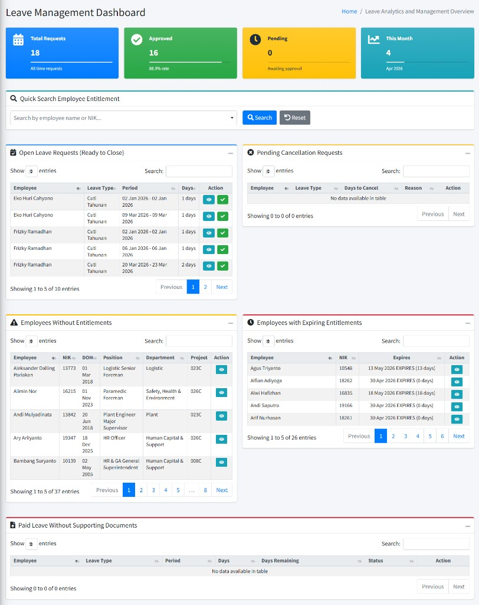 <em>Gambar 1a — Ringkasan <strong>Leave Management Dashboard</strong>: kartu statistik, Quick Search entitlement, dan tabel utama (Open Leave Requests, Pending Cancellation, daftar entitlement). Blok lain (mis. cuti berbayar tanpa dokumen) dapat muncul lebih bawah pada layar penuh.</em>

**Catatan:** Tombol **Close**, persetujuan pembatalan, atau **Clear Entitlements** hanya tampil jika **hak akses** peran Anda mengizinkan (beberapa aksi terbatas untuk **administrator**).

---

## 2. Untuk HR — **Leave Entitlements**

**Leave entitlement** adalah kumpulan hak cuti per karyawan yang terdiri dari berbagai **leave type** (jenis cuti) beserta jumlah hari per periode. Data ini menjadi dasar **Leave Period** dan sisa hari pada formulir **Leave Request**; tanpa entitlement untuk periode yang berlaku, karyawan tidak dapat mengambil cuti sesuai jenis yang dipilih.

### Setup awal master data dan pola **Generate** / **Export** / **Import**

Sebelum tim rutin hanya menjalankan **Generate Entitlements**, pastikan fondasi berikut sudah konsisten dengan kebijakan perusahaan:

| Tahap                     | Uraian                                                                                                                                                                                                                                                                           |
| :------------------------ | :------------------------------------------------------------------------------------------------------------------------------------------------------------------------------------------------------------------------------------------------------------------------------- |
| **Master di sistem**      | **Leave Types** (kategori paid/unpaid, nama kolom di layar), **Projects**, serta penempatan karyawan (**Employee Management**) untuk administration aktif — keliru di master akan ikut terbawa ke saldo.                                                                         |
| **Export**                | Di halaman **Entitlements**, pilih **project**, **Load Employees**, lalu **Export**. Berguna untuk: mendapatkan **template** struktur kolom + opsional **data saldo** (`include_data`) sebagai baseline; dokumentasi; atau penyelerasian dengan spreadsheet HR lain **offline**. |
| **Import**                | Dipakai saat **setup awal** atau **koreksi massal** dalam bentuk Excel (format `.xlsx`/`.xls` sesuai batas aplikasi). Isi berkas mengikuti hasil/kolom dari ekspor; setelah unggah, perbaiki entri yang gagal lewat tabel **Import Validation Errors** lalu unggah ulang.        |
| **Generate Entitlements** | Menjalankan pengisian saldo cuti **secara otomatis dan massal** untuk **semua karyawan aktif** pada **project** yang Anda pilih — Anda tidak perlu mengisi tiap orang secara manual.                                                                                             |

### 2.1 Halaman **Leave Entitlement Management** — secara massal

Di halaman ini proses yang akan dilakukan adalah mengisi hak/saldo cuti dengan **Generate**, mengolah spreadsheet dengan **Export** dan **Import**, serta melihat table **Leave Entitlement** per project.

Untuk **setup awal**, urutan yang disarankan: **Load Employees** → **Generate Entitlements** (untuk men-generate data entitlement ter-update) → **Export** → edit berkas Excel → **Import** kembali.

Setelah operasi rutin, biasanya cukup menjalankan **Generate Entitlements** **secara berkala** misal di saat akhir bulan; **Export**/**Import** dipakai jika perlu rekonsiliasi, audit, atau koreksi massal — tidak sebagai aktivitas mingguan wajib.

1. **Login** ke ARKA HERO → sidebar **HERO SECTION** → **Leave Management** → **Entitlements**. Judul halaman: **Leave Entitlement Management**.

2. Pada kartu **Project Filter & Generate Entitlements**, pilih **Select Project**, lalu **Load Employees**. Gunakan **Clear** jika ingin mengosongkan pilihan project.

3. **Generate Entitlements** — Klik tombol **Generate Entitlements** (jika tersedia), konfirmasi sesuai dialog sistem, lalu tunggu hingga selesai. Baca ulang jendela informasi berikut bila perlu agar selaras dengan kebijakan HR.

    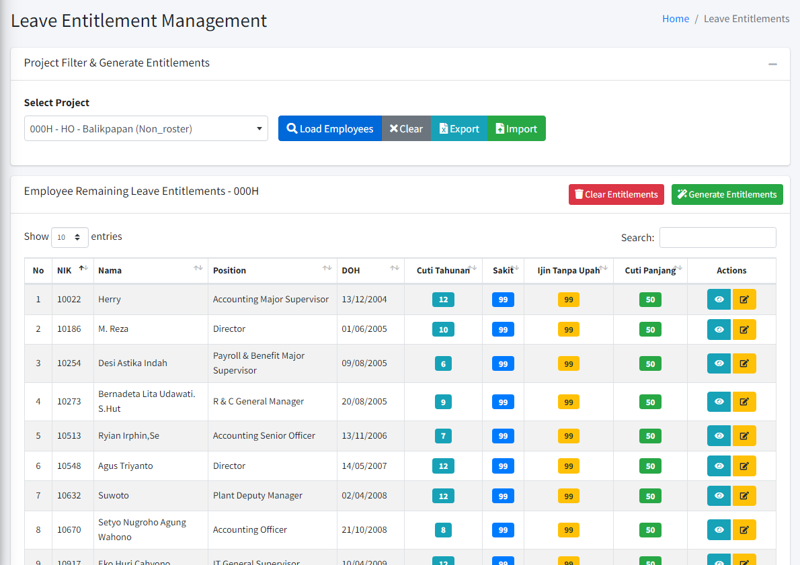 <em>Gambar 2.1a — Kartu filter project, <strong>Load Employees</strong>, <strong>Generate</strong>, <strong>Export</strong>, <strong>Import</strong>.</em>

**Penjelasan singkat — jendela informasi _Generate Entitlements for [kode project]_**

Jendela ini muncul saat Anda akan atau baru saja menjalankan **Generate Entitlements**. Judulnya menyebut **kode project** (contoh: **Generate Entitlements for 000H**). Yang biasanya dijelaskan di layar:

- **Siapa yang dapat saldo** — **Semua karyawan aktif** pada **project** tersebut (administration **aktif**).
- **Jenis cuti yang dibuatkan** — kombinasi **Paid Leave**, **Unpaid Leave**, **Annual Leave** (sering setelah masa kerja tertentu), **LSL** (ambang masa kerja mengikuti aturan sistem) — detail pasti ada di teks jendela.
- **Periode berlaku** — mengacu pada **DOH** di **Employee Management** dan **tahun/periode berjalan** (misalnya **Current Year**).
- **Anti-duplikat** — untuk **periode yang sama**, entitlement yang **sudah ada** akan **dilewati** sehingga tidak terjadi penggandaan data.
- **Service Start DOH** (cara menghitung masa kerja untuk keperluan aturan cuti):
    - Penghentian **End of Contract** → masa kerja dapat **diteruskan** dari **DOH pertama** (misalnya rehire dalam satu rantai kontrak).
    - Alasan berhenti **selain** _End of Contract_ → masa kerja **dihitung ulang** dari **DOH penempatan baru**.
    - Karyawan dengan **beberapa NIK** dan riwayat **End of Contract** → perhitungan dapat mengacu ke **DOH paling awal** (sesuai penjelasan di layar).

    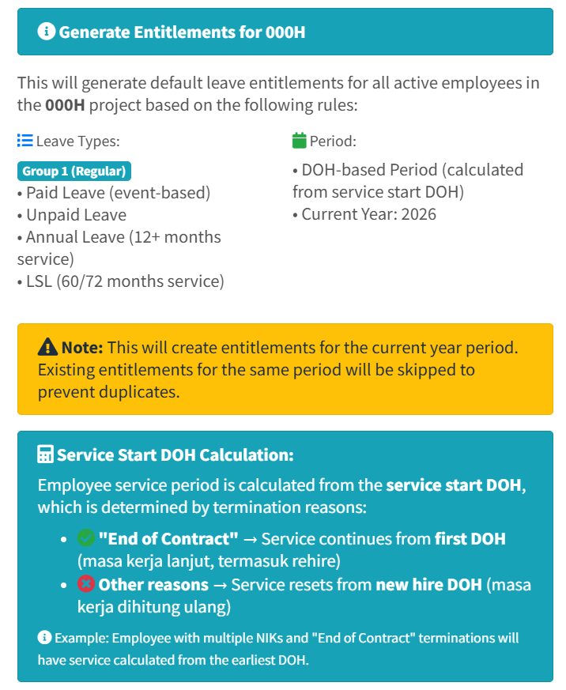 <em>Gambar 2.1b — Jendela informasi sebelum/setelah menjalankan <strong>Generate Entitlements</strong> untuk satu project.</em>

4. Setelah data termuat, tampil kartu **Employee Remaining Leave Entitlements**: ringkasan saldo per karyawan dan kolom **Actions**. Nama kolom jenis cuti mengikuti **Leave Types** (misalnya **Cuti Tahunan**, **Sakit**, **Ijin Tanpa Upah**, **Cuti Panjang**) yang diconfigurasi di **Master Data** → **Leave Management Data** → **Leave Types**.

5. **Export** — unduh berkas Excel (template beserta data, sesuai parameter **project**). Berikut **contoh** bentuk berkas yang akan Anda edit di aplikasi spreadsheet luar (nama kolom, warna header, dan jumlah kolom dapat sedikit berbeda mengikuti **Leave Types** serta **project** Anda):

6. Edit nilai di Excel sesuai kebutuhan — **pertahankan struktur kolom dan format template** dari hasil **Export** agar **Import** dapat memprosesnya.

    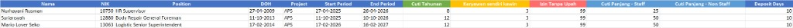 <em>Gambar 2.1c — Contoh berkas/template Excel entitlement hasil <strong>Export</strong> (struktur kolom mengikuti <strong>Leave Types</strong> dan project Anda).</em>

7. **Import:** dari kartu filter yang sama, klik **Import** untuk membuka **Import Leave Entitlements**, pilih **Select Excel File**, lalu **Import**. Jika ada kesalahan, perbaiki berdasarkan **Import Validation Errors**, lalu unggah ulang.

**Import Validation Errors — pesan yang umum muncul**

Tabel di layar menampilkan **Sheet**, **Row**, **Column** (sering berisi referensi **NIK**), **Value**, dan **Error Message**. Baris yang lolos tetap tersimpan; baris gagal harus diperbaiki di Excel lalu **Import** ulang.

| Jenis        | Contoh pesan di layar (bahasa Inggris dari sistem)              | Yang harus dicek                                                                                                                   |
| :----------- | :-------------------------------------------------------------- | :--------------------------------------------------------------------------------------------------------------------------------- |
| Berkas       | _Please select a file to import._                               | Pilih berkas sebelum mengunggah.                                                                                                   |
| Berkas       | _The file must be a file of type: xlsx, xls._                   | Hanya **.xlsx** atau **.xls**.                                                                                                     |
| Berkas       | _The file may not be greater than 10MB._                        | Perkecil atau bagi data; batas **10 MB**.                                                                                          |
| Baris data   | _NIK is required_                                               | Isi kolom **NIK** pada baris tersebut.                                                                                             |
| Baris data   | _NIK '…' not found or not active_                               | Pastikan **NIK** sama dengan karyawan yang administration-nya **aktif** di sistem.                                                 |
| Baris data   | _Start Period and End Period are required_                      | Isi **Start Period** dan **End Period** (nama kolom bisa mengikuti template **Export**).                                           |
| Baris data   | _Invalid date format. Use YYYY-MM-DD or Excel date format_      | Format tanggal tidak dikenali — gunakan format tanggal standar atau format tanggal Excel (angka serial) seperti dari **Export**.   |
| Baris data   | _Start Period must be before End Period_                        | Tanggal mulai harus **lebih awal** dari tanggal akhir periode.                                                                     |
| Baris data   | _Deposit Days cannot be negative_                               | Kolom **Deposit Days** tidak boleh bernilai negatif.                                                                               |
| Gagal sistem | Pesan _System error_, _Import Failed_, atau teks kesalahan umum | Coba lagi; jika berulang, hubungi **administrator** dengan ringkasan waktu impor dan cuplikan pesan (tanpa mengirim **password**). |

**Catatan:**

- Untuk kombinasi **Cuti Panjang Staff / Non Staff** yang tidak sesuai level jabatan, sistem biasanya **melewati** kolom yang tidak relevan **tanpa** menampilkan error baris untuk hal itu.
- Nilai non-angka pada kolom jenis cuti sering dianggap **nol**, bukan selalu sebagai error baris.

---

### 2.2 Halaman **Leave Entitlement** — per karyawan (**Employee Leave Entitlements**)

1. Di halaman Leave Entitlements (setelah **Load Employees**), di kolom **Actions**, klik icon **View** (tombol biru dengan icon mata) untuk melihat hak/saldo cuti per karyawan.
2. Pada kartu **Employee Information**, baca **NIK**, **Name**, **Project**, **Level**, **Position**, **DOH**, **Years of Service**, **Status**, **Staff Type**, ini berdasarkan data karyawan yang ada di **Employee Management**. Tombol **Back to List** untuk kembali ke daftar karyawan per project.
3. Jika karyawan sudah punya entitlement, pada kartu **Leave Entitlements Summary** terdapat tombol **Add Entitlements** dan daftar **Available Periods** (tiap baris = satu rentang **period_start**–**period_end**, dengan **Edit** / **Delete** per periode). Klik periode untuk melihat rincian di **Entitlement Details** di sebelah kanan — tabel per kategori (misalnya **Annual Leave**, **Paid Leave**, **Unpaid Leave**, **LSL**) dengan kolom **Leave Type**, **Entitled**, **Taken**, **Remaining**, dan **Actions** (termasuk tautan **Calculation** per jenis cuti jika tersedia).

    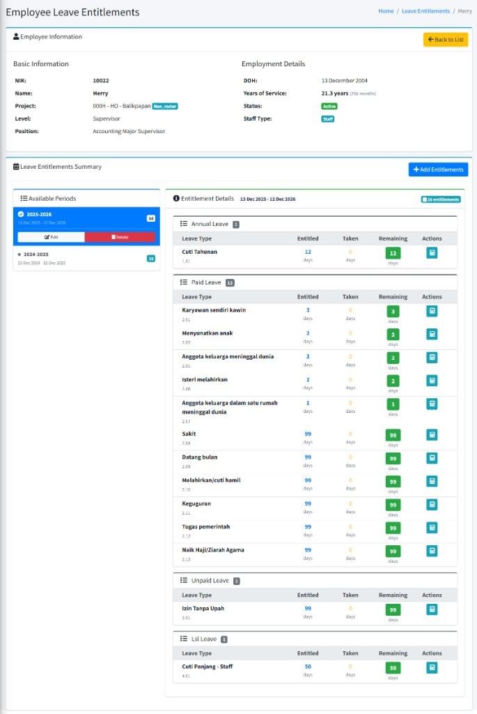 <em>Gambar 2.2a — Halaman <strong>Employee Leave Entitlements</strong> per karyawan (informasi karyawan, ringkasan periode, rincian saldo).</em>

### 2.3 Tambah entitlement — **Add Entitlements** (**Create Entitlements**)

1. Pada halaman **Employee Leave Entitlements** (satu karyawan), di kartu **Leave Entitlements Summary**, klik **Add Entitlements** (tombol biru dengan ikon **+**).

     <em>Gambar 2.3a — Posisi tombol Add Entitlements (ilustrasi yang sama secara fungsi dengan tangkapan di bagian 2.2).</em>

2. Sistem membuka formulir **Add Employee Leave Entitlements**: **banner** berisi nama, NIK/project, serta **Leave Period**; di kiri ada panel **Employee Info** (**Level**, **Position**, **DOH**, **Service**, **Staff Type**, dll.).

3. Pilih salah satu **kategori cuti** lewat bilah navigasi mendatar (**Annual Leave**, **Paid Leave**, **Unpaid Leave**, **LSL Leave**) — ikon berwarna disertai **badge** jumlah jenis cuti di dalam kategori.

4. Pada kategori yang aktif, baca atau ubah baris pada tabel (**Leave Type** — nama dan kode, **Default** jumlah acuan sistem, **Entitlement (Days)** kotak angka dengan satuan days, serta **Used** jika ada, misalnya bentuk seperti `0/12`).

5. Setelah digit saldo untuk periode baru dirasa tepat di semua baris yang perlu diedit, klik **Create Entitlements** untuk menyimpan. **Back to Summary** membawa Anda kembali ke ringkasan karyawan tanpa mengirim form.

    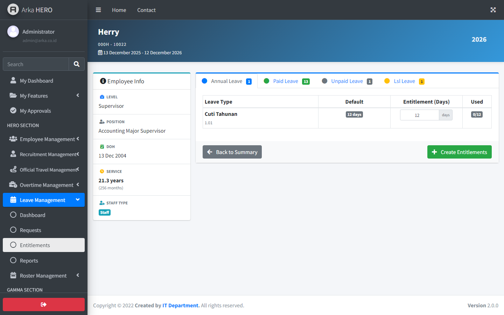 <em>Gambar 2.3b — Contoh formulir untuk langkah 2–5: banner dan info kiri, navigasi kategori, tabel isian, serta tombol aksi bawah halaman.</em>

**Catatan:** Mode tambah memakai periode yang dihitung untuk tahun/periode berjalan sesuai logika project (bukan mengedit periode lama). Jika saldo untuk periode itu sudah ada, ikuti prosedur edit di bagian berikut atau sesuaikan dengan HR lead.

---

### 2.4 Ubah entitlement per periode — **Edit** (**Save Changes**)

1. Di halaman **Employee Leave Entitlements**, pada kolom **Available Periods**, pilih/perlihatkan periode yang ingin diubah (baris periode dapat ter-highlight seperti saat Anda meninjau entitlement).

     <em>Gambar 2.4a — **Available Periods** untuk memilih rentang entitlement sebelum menyunting saldo.</em>

2. Pada baris periode yang sedang Anda kerjakan, klik **Edit** (ikon pensil) di samping **Delete**, sehingga form pengisian entitlement untuk periode itu terbuka.

3. Tata letak sama seperti formulir tambah (navigasi kategori, tabel entitlement); dalam mode **edit** biasanya ada indikasi **Saved**/`Used` (**taken**) per jenis cuti bila ada histori pemakaian. Sesuaikan hanya kotak **Entitlement (Days)** yang diizinkan.

4. Verifikasi angka baru di semua tab/kategori yang perlu Anda ubah lalu klik **Save Changes** untuk menyimpan. **Back to Summary** meninggalkan form.

    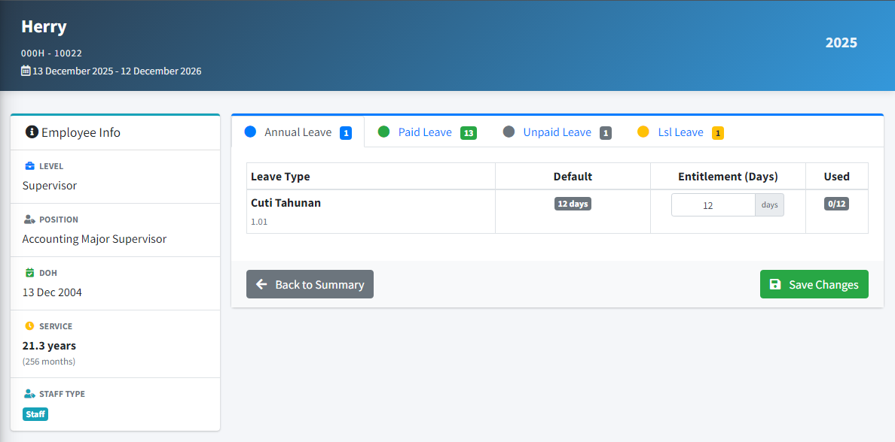 <em>Gambar 2.4b — Contoh form edit entitlement (langkah 3–4).</em>

**Catatan:** Menurunkan hari di bawah yang sudah terpakai dapat dibatasi oleh aturan sistem — ikuti pesan validasi di layar.

---

### 2.5 Hapus entitlement untuk satu periode — **Delete** (**Delete Entitlements**)

1. Di **Employee Leave Entitlements**, sorot/pilih pada **Available Periods** satu rentang periode entitlement (tanggal mulai sampai tanggal akhir) yang akan dihapus seluruh data entitlement-nya.

2. Pada baris periode tersebut, klik **Delete** (tombol merah dengan ikon tong sampah) — biasanya di samping tombol **Edit**.

     <em>Gambar 2.5a — Lokasi **Delete** untuk periode (langkah 1–2).</em>

3. Pada dialog **Delete Entitlements**, bacalah peringatan bahwa pemulihan tidak tersedia, ketik persis **`DELETE`** di kotak konfirmasi, lalu aktifkan **Delete All Entitlements**. **Cancel** menutup dialog tanpa penghapusan.

    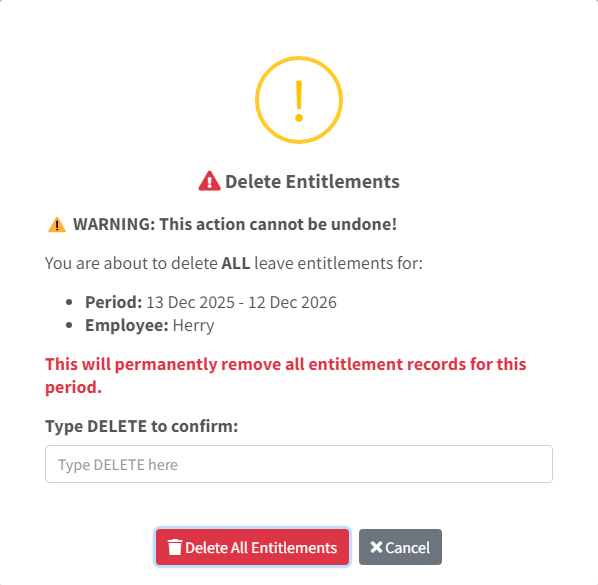 <em>Gambar 2.5b — Konfirmasi penghapusan seluruh entitlement periode (langkah 3).</em>

**Catatan:** Penghapusan menghapus **seluruh** entitlement untuk **periode** tersebut (semua jenis cuti dalam periode itu). Pastikan tidak ada kebutuhan audit atau pelaporan yang masih bergantung pada data tersebut. Tombol **Generate Entitlements**, **Import**, **Edit**, dan **Delete** mengikuti **hak akses** (**leave-entitlements.create** / **edit** / **delete**, dll.).

---

## 3. Untuk HR — **Requests** (Pengajuan Cuti, **Flight Request**, **Approver Selection**, Pembatalan Cuti)

### Langkah-langkah — daftar **Leave Requests**

1. Pastikan Anda sudah **login** sebagai pengguna HR, lalu buka sidebar **HERO SECTION** → **Leave Management** → **Requests**. Judul halaman pada umumnya: **Leave Requests**.

2. Buka atau rapatkan panel **Filter** sesuai kebutuhan lalu sesuaikan kriteria misalnya **Status**, **Employee**, **Leave Type**, **Start Date**, **End Date**. **Reset** mengembalikan seluruh kriteria seperti semula di layar Anda.

3. Tabel utama menampilkan nomor/barisan, identitas/register pengajuan, **Employee**, **Project**, **Leave Type**, **Start Date**, **End Date**, **Total Days**, **Status**, waktu (**Requested At** atau nama serupa), dan **Actions**.

4. **Add** membuka **Create Leave Request**. **Add Periodic Leave** (jika ada) mengarah pada pengajuan massal atau jadwal melalui modul **Periodic Leave Requests** di **Roster Management** bila organisasi memakainya.

    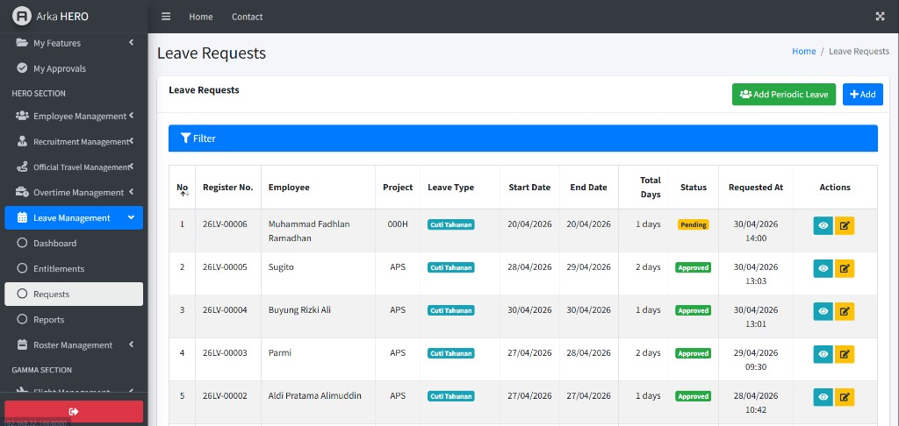 <em>Gambar 3.4 — Setelah membuka <strong>HERO SECTION</strong> → <strong>Leave Management</strong> → <strong>Requests</strong>, halaman <strong>Leave Requests</strong> menampilkan bilah Filter, tabel utama, serta tombol <strong>Add</strong> dan <strong>Add Periodic Leave</strong> (langkah 1).</em>

### Langkah-langkah — **Create Leave Request** (_Leave Request Form_)

1. Dari daftar, klik **Add**.

2. Pilih **Project** lalu **Employee** dari daftar aktif dalam project tersebut. Saat **Project** diganti isian karyawan diperbaharui.

    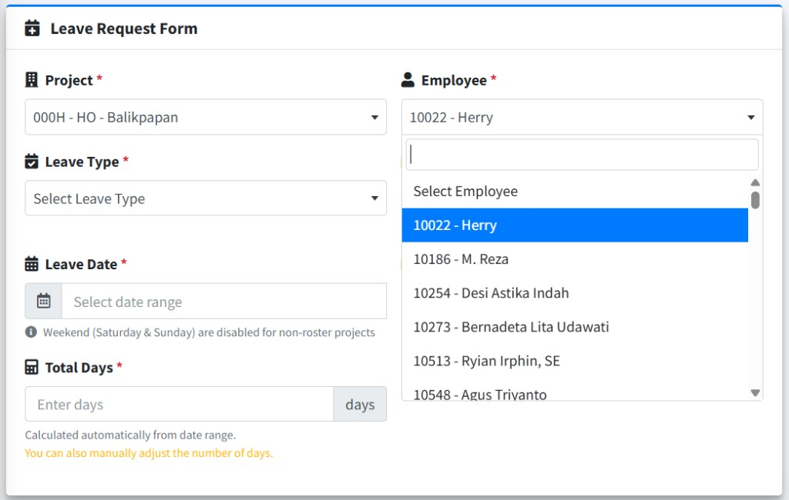 <em>Gambar 3.6 — Pilih <strong>Project</strong> lalu <strong>Employee</strong> dari daftar (misalnya lewat kotak dropdown yang bisa ditelusur); kolom lain seperti <strong>Leave Type</strong>, <strong>Leave Date</strong>, dan <strong>Total Days</strong> ada di blok awal formulir seperti ini (langkah 2).</em>

3. Tentukan **Leave Type**; **Leave Period** biasanya terisi otomatis dari **entitlements** karyawan yang dipilih. Jika **Leave Period** tidak muncul, cek **Leave Entitlement** karyawan tersebut dan pastikan periode cutinya ada; jika belum ada, siapkan entitlement lewat halaman **Entitlements** dalam panduan ini.

    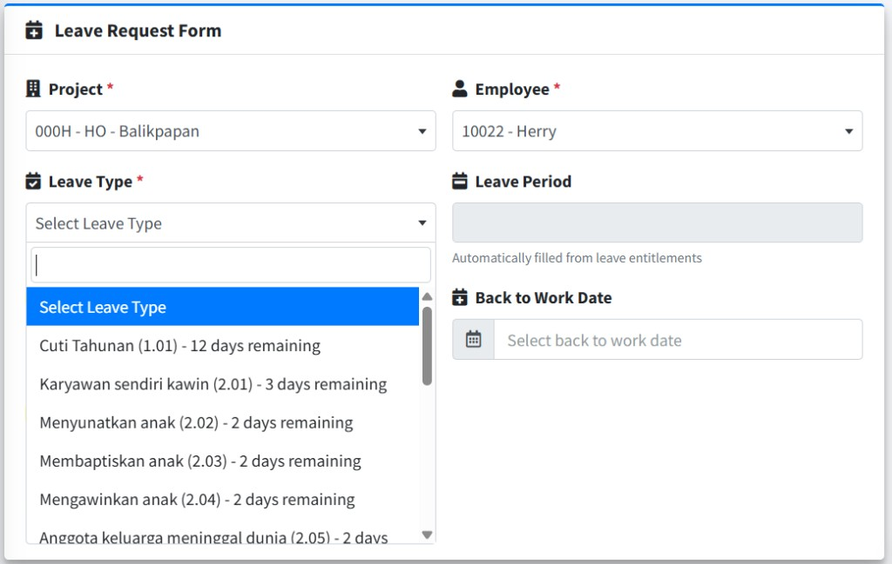 <em>Gambar 3.7 — <strong>Leave Type</strong> dapat dipilih lewat dropdown yang menyertakan ringkasan sisa hari; <strong>Leave Period</strong> mengikuti entitlement yang aktif untuk karyawan; lanjutkan dengan <strong>Leave Date</strong> dan pengisian lain (mis. <strong>Back to Work Date</strong>) seperti pada formulir Anda (langkah 3).</em>

4. Untuk pilihan **Cuti Tahunan** (kode **1.01**), formulir tidak menambahkan bidang dokumen lain; Anda melanjutkan dengan rentang tanggal dan **Total Days** seperti pola umum form.

    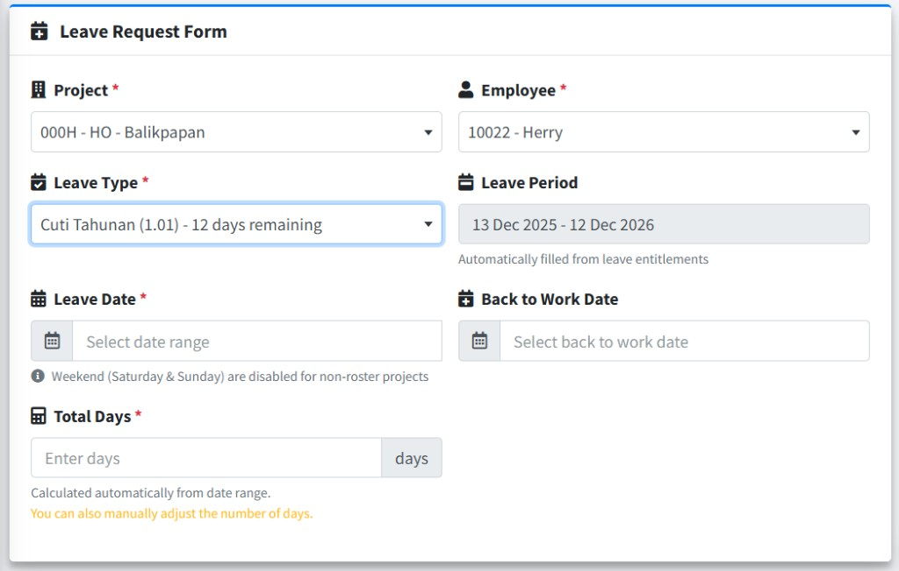 <em>Gambar 3.8 — Contoh formulir ketika dipilih <strong>Cuti Tahunan</strong> (<strong>1.01</strong>): <strong>Leave Period</strong> mengikuti entitlement; isi <strong>Leave Date</strong>, <strong>Back to Work Date</strong>, dan <strong>Total Days</strong> (langkah 4).</em>

5. Untuk pilihan **Izin Dibayar** (kode **2.xx**), muncul bidang upload **Supporting Document** (biasanya mendukung format PDF/DOC/JPG dll. hingga ukuran tertentu). Dokumen bisa diisi setelah HR menerima arsip fisik atau surel dari karyawan sesuai kebijakan.

    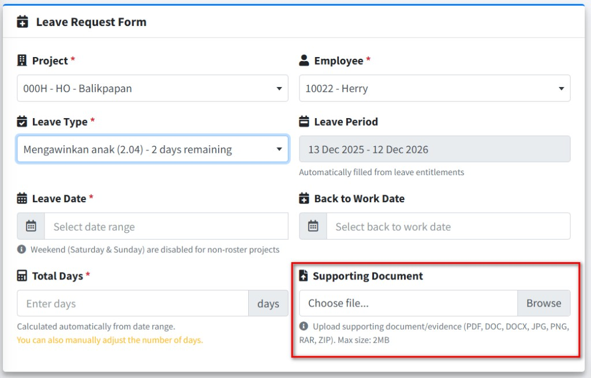 <em>Gambar 3.9 — Contoh formulir ketika dipilih salah satu izin bergaji (<strong>Mengawinkan anak</strong> <strong>2.04</strong>); bidang <strong>Supporting Document</strong> dipakai untuk lampiran pendukung (langkah 5).</em>

6. Untuk pilihan **Izin Tanpa Upah** (kode **3.01**), muncul bidang wajib **Reason**: isi narasi yang jelas agar reviewer memahami latar izin Anda.

    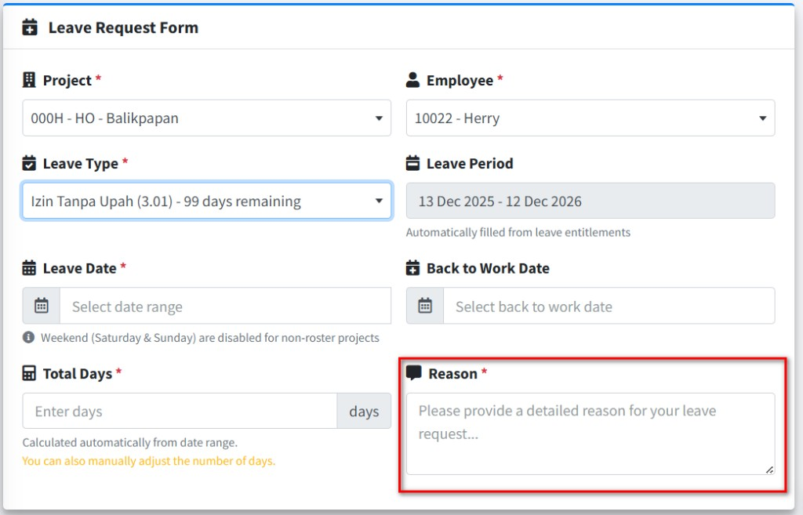 <em>Gambar 3.10 — Contoh formulir ketika dipilih <strong>Izin Tanpa Upah</strong> (<strong>3.01</strong>); bidang teks <strong>Reason</strong> digunakan untuk menyatakan jelas alasan izin (langkah 6).</em>

7. Untuk pilihan **Cuti Panjang** — **Staff / Non Staff** (kode **4.01**), muncul blok **Long Service Leave (LSL)**: isi **Leave Days** (bisa disesuaikan dengan rentang tanggal), centang **Cash Out** bila membagi sebagian hari ke uang sesuai kebijakan, lalu tinjau **Total Days** sebagai ringkasan jumlah yang diambil plus **Cash Out**.

    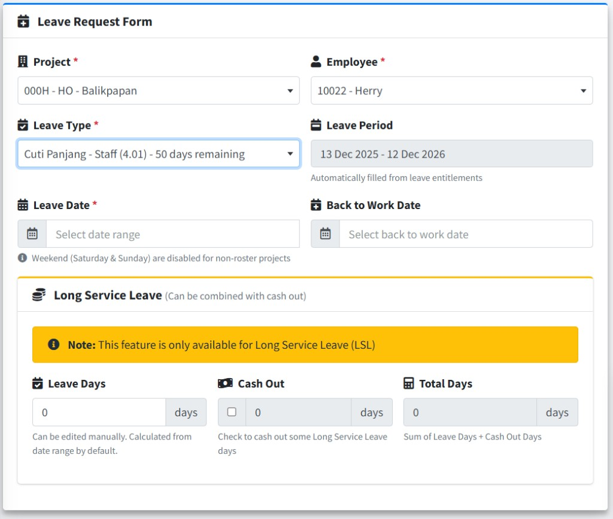 <em>Gambar 3.11 — Contoh ketika dipilih <strong>Cuti Panjang - Staff</strong> (<strong>4.01</strong>): blok <strong>Long Service Leave</strong> untuk <strong>Leave Days</strong>, opsi <strong>Cash Out</strong>, dan <strong>Total Days</strong> (langkah 7).</em>

8. Isi **Leave Date** (satu hari atau rentang hari kerja) dan **Back to Work Date** lewat pemilih tanggal pada formulir. Tentukan rentang yang selaras dengan sisa entitlement dan aturan penggunaan jenis cuti yang dipilih; **Total Days** pada form biasanya mengikuti rentang tersebut kecuali Anda menyesuaikan manual sesuai petunjuk di layar. Perilaku kalender mengikuti jenis **project**: pada project **non-roster** (misalnya **HO**, **BO**, **APS**, **021C**, dan setara), **Sabtu** dan **Minggu** **tidak** dipilih; pada project **roster** (contoh **017C**, **022C**) semua tanggal dapat dipilih. **Hari libur nasional** dari master data ikut ditampilkan di kalender (sering dengan penanda atau tooltip) agar Anda tidak memilih tanggal yang bertabrakan dengan libur resmi. Setelah rentang benar, klik **Apply**; gunakan **Clear** bila perlu mengulang pemilih tanggal.

    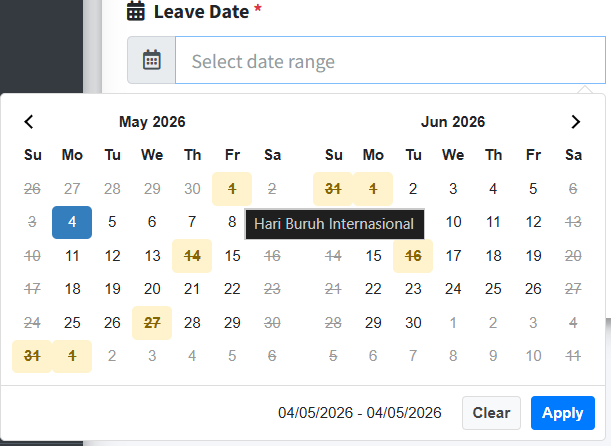 <em>Gambar 3.12 — Pemilih rentang <strong>Leave Date</strong>: kalender dua bulan, konfirmasi dengan <strong>Apply</strong> atau <strong>Clear</strong>; hari libur dapat dibedakan atau dijelaskan lewat tooltip (langkah 8).</em>

9. Di bagian **Flight Request**, centang **Check if you need flight ticket reservation** ketika Anda memerlukan pemesanan udara dalam pengajuan. Isilah **Flight 1** dan segmen lain (**Return**, **Add** segmen baru) sampai konsisten dengan rencana perjalanan.

10. Di **Approver Selection**, temukan serta tambahkan setidaknya satu nama **approver** lewat kotak telusuran (nama/email) hingga pola minimal terpenuhi menurut teks panduan kartu tersebut.

    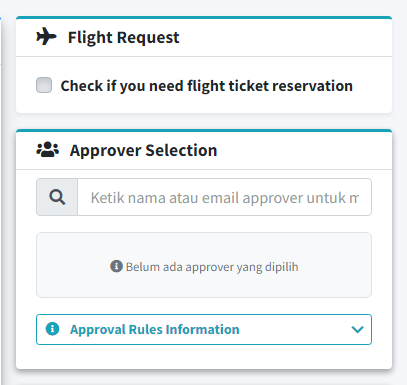 <em>Gambar 3.13 — Kartu <strong>Approver Selection</strong> dan daftar approver (langkah 10).</em>

11. Pada **Leave Balance**, gunakan ringkasan tabel **Leave Type** dan **Balance** sebagai pengecek cepat terhadap sisa hak tiap jenis cuti serta konsistensi dengan isian formulir Anda sebelum kirim.

    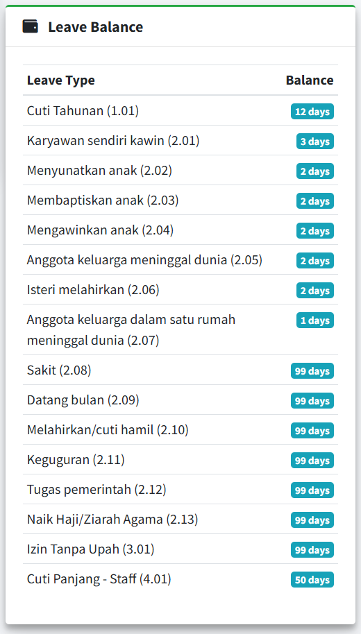 <em>Gambar 3.14 — Ringkasan <strong>Leave Balance</strong> di formulir pengajuan: kolom saldo per jenis (langkah 11).</em>

12. Klik **Save & Submit** bila Anda siap kirim rangkaian ke jalur otomatis **approval**, atau pakai opsi pembatalan jika Anda ingin meninggalkan form tanpa simpan seperti **Cancel** yang disediakan.

### Leave Request Detail, Approval, Close Request, Request Cancellation

1. Dari halaman daftar **Leave Requests**, gunakan bilah **Filter** bila perlu, lalu baca kolom utama (**Register No.**, **Employee**, **Project**, **Leave Type**, tanggal mulai/selesai, **Total Days**, **Status**, **Requested At**) supaya Anda menunjuk pada barisan yang tepat. Di kolom **Actions**, ikon **mata** (_View_) membuka **Leave Request Detail**.

    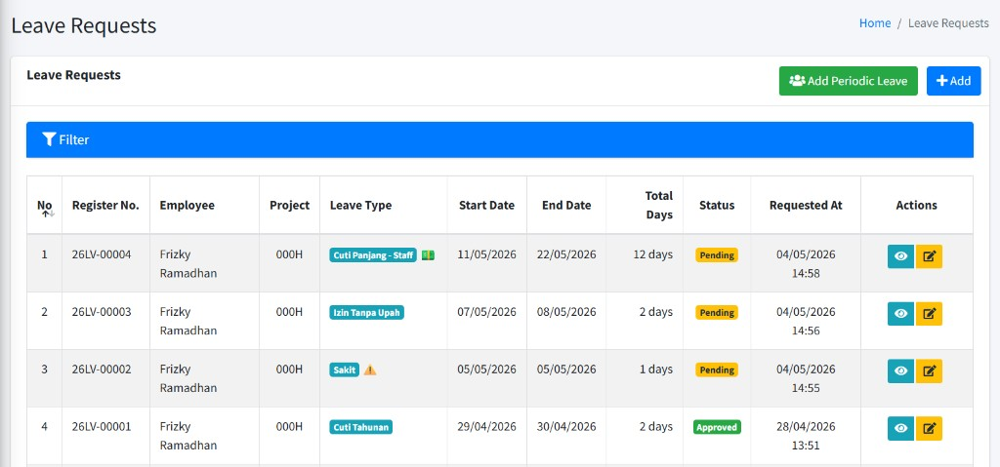 <em>Gambar 3.16 — Daftar pengajuan: bilah <strong>Filter</strong>, tombol <strong>Add</strong> / <strong>Add Periodic Leave</strong>, serta kolom utama termasuk <strong>Actions</strong> (ikon mata untuk detail) dan <strong>Status</strong> seperti <strong>Pending</strong> / <strong>Approved</strong> (langkah 1).</em>

2. Di halaman **Leave Request Detail**, bagian atas umumnya memuat register pengajuan, konteks lokasi/unit bila ada, serta **badge status** (**Pending**, **Approved**, **Rejected**, dan varian lain di layar Anda). Panel **Leave Request Information** menyatukan identitas pegawai, **Leave Type**, rentang **Start Date** / **End Date**, **Leave Period**, **Total Days**, **Back to Work Date** (bila diisi), dan **Requested At**. Di samping tampilan utama, blok **Selected Approvers** menyajikan rantai pemeriksa beserta status tiap jenjang approval. Sekumpulan tombol seperti **Back to List**, **Edit Request**, **View Entitlements**, **Close Request**, dan **Request Cancellation** muncul secara selektif — tergantung status pengajuan dan hak akses peran Anda.

    Blok **Additional Information** bersifat mengikuti jenis cuti. Berikut beberapa pola yang umum (urutan di bawah hanya untuk memudahkan referensi dokumentasi):

    — **Tanpa blok tambahan besar** (misalnya **Cuti Tahunan / 1.01**): halaman menjelaskan inti pengajuan, daftar approval, serta aksi seperti menutup pengajuan ketika telah disetujui.

    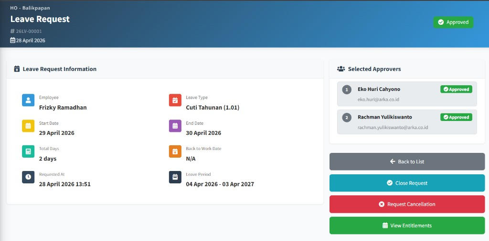 <em>Gambar 3.17 — Detail dengan <strong>Additional Information</strong> sebagai ringkasan standar (contoh <strong>Cuti Tahunan</strong> berstatus <strong>Approved</strong>); tombol <strong>Close Request</strong> dapat tersedia sesuai kebijakan dan status Anda.</em>

— **Izin dibayar yang mewajibkan dokumen** (misalnya **Sakit / 2.08**): muncul peringatan bila dokumen pendukung belum lengkap, serta area unggah berkas (**Upload Supporting Document**) dengan format yang diperbolehkan.

    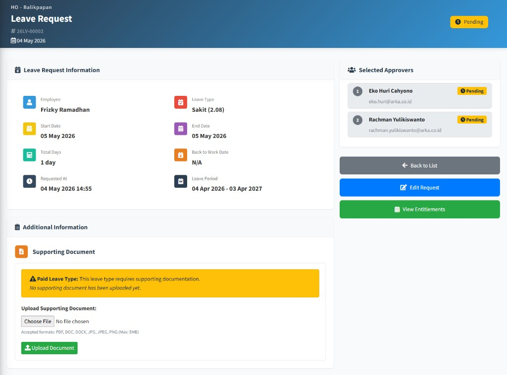 <em>Gambar 3.18 — <strong>Additional Information</strong> untuk jenis izin dibayar yang mewajibkan lampiran: peringatan dan unggah <strong>Supporting Document</strong> (contoh <strong>Sakit</strong> <strong>2.08</strong>).</em>

— **Izin Tanpa Upah / 3.01**: bidang narasi **Reason** menampung alasan tertulis atas pengajuan.

    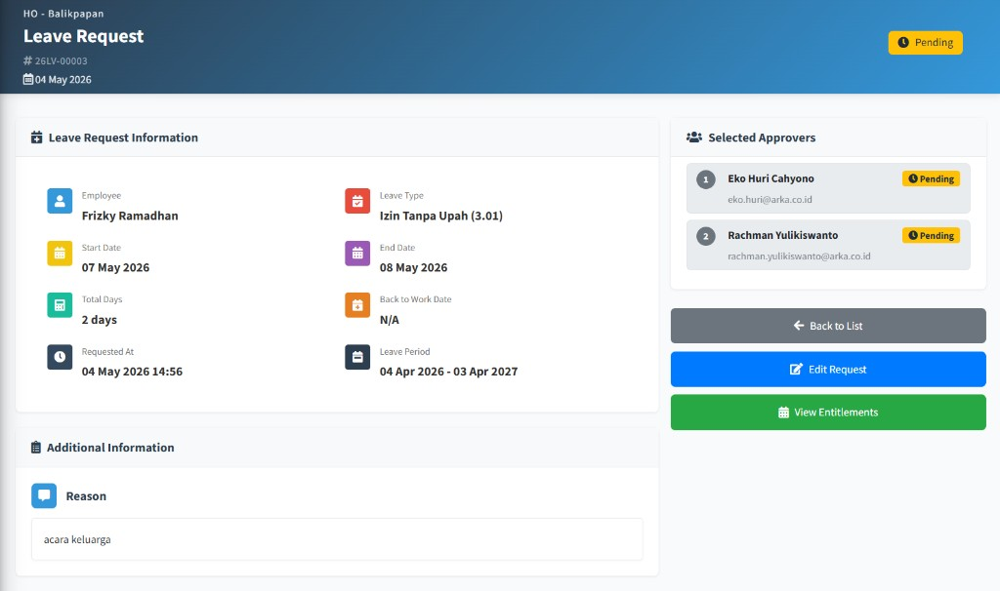 <em>Gambar 3.19 — <strong>Additional Information</strong> berupa bidang <strong>Reason</strong> untuk <strong>Izin Tanpa Upah</strong> (<strong>3.01</strong>).</em>

— **Cuti Panjang / LSL / 4.01**: blok **LSL Breakdown** memisahkan **Leave Taken**, **Cash Out**, serta **Total LSL Used**, sering lengkap dengan catatan sistem bila ada pencairan tunai cuti panjang; **Flight Request** terkait (bila ada) biasanya ditampilkan di kolom sisipan aplikasi Anda.

    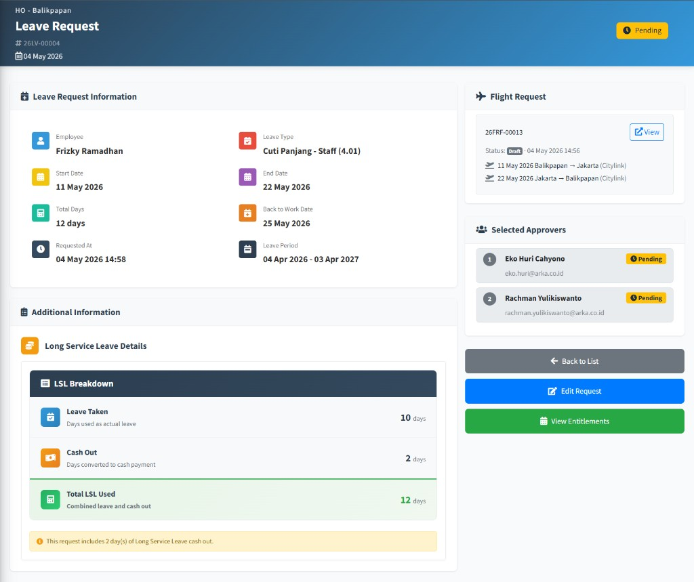 <em>Gambar 3.20 — <strong>Additional Information</strong> berupa <strong>LSL Breakdown</strong> dan tautan blok <strong>Flight Request</strong> (contoh <strong>Cuti Panjang - Staff</strong> <strong>4.01</strong>).</em>

3. Pengajuan yang sudah **Approved** dapat ditutup secara administratif setelah **periode cuti selesai**. HR umumnya memakai daftar **Open Leave Requests (Ready to Close)** pada **Leave Management Dashboard** seperti di bab 1 panduan ini; alternatif lain, tombol **Close Request** bisa tersedia dari **Leave Request Detail** bagi peran yang berwenang. Pastikan Anda memahami dialog konfirmasi **Close Leave Request** sebelum memutuskan menutup pengajuan.

4. Pembatalan hari kerja dari cuti yang **Approved** dimulai dari **Request Leave Cancellation** hingga formulir **Cancellation Request Form** (alur menu pada umumnya _Leave Requests_ → detail pengajuan → _Cancellation_). Isi **Days to Cancel** (_wajib_) untuk memilih jumlah hari yang dibatalkan; sistem mendukung **pembatalan parsial**, dan hari yang dibatalkan **dikembalikan ke entitlement** sesuai penjelasan di formulir — tulis juga **Reason for Cancellation** (_wajib_) agar reviewer memahami alasannya. Pada layar Anda tampak ringkasan pengajuan asli, panel **Important Notes** (misalnya pembatalan butuh persetujuan HR, saldo dapat dikoreksi kembali, serta batas satu permohonan pembatalan **pending** sekaligus), serta tombol **Submit Cancellation Request** atau **Cancel** untuk keluar tanpa mengirim.

    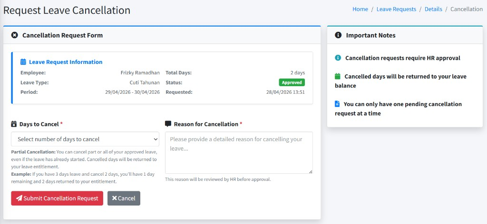 <em>Gambar 3.21 — Halaman <strong>Request Leave Cancellation</strong>: <strong>Cancellation Request Form</strong> dengan ringkasan cuti, <strong>Days to Cancel</strong>, <strong>Reason for Cancellation</strong>, panel <strong>Important Notes</strong>, dan tombol kirim atau batal (langkah 4).</em>

5. **HR** meninjau antrean pembatalan pada **Leave Management Dashboard**, di dalam kartu **Pending Cancellation Requests** (cara membuka dashboard ada di bagian awal dokumen ini). Tabel menampilkan **Employee**, **Leave Type**, **Days to Cancel**, **Reason**, serta kolom **Action** berisi tombol **setujui** (ikon centang hijau) dan **tolak** (ikon silang merah) sesuai kebijakan dan hak akses. Manfaatkan **Search**, **Show entries**, dan navigasi halaman bila antrean banyak. Proses tiap permohonan sampai tuntas di aplikasi agar status pengajuan pembatalan dan **pengembalian saldo cuti** konsisten dengan keputusan Anda.

    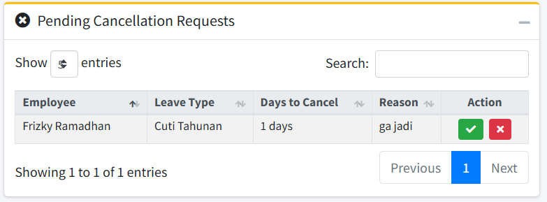 <em>Gambar 3.22 — Cuplikan blok <strong>Pending Cancellation Requests</strong>: baris tunggal atau beberapa antrean menunggu keputusan HR lewat tombol aksi pada kolom terakhir (langkah 5).</em>

**Catatan:** Proses pengajuan **Flight Request** (tiket/perjalanan) yang terikat pada pengajuan cuti diarahkan kepada **tim HR HO Balikpapan** serta alur **Flight Management** untuk pelaksanaan dan koordinasi, mengikuti kebijakan kantor pusat.

---

## 4. Untuk HR — **Reports**

Modul laporan digunakan untuk rekonsiliasi, audit cepat, dan ekspor data cuti keluar aplikasi (**Excel** atau format setara sesuai tombol pada layar). Struktur antarmuka banyak laporan serupa daftar utama: blok **filter** → tabel ringkasan → unduhan bila ada; selalu cocokkan kriteria (**tanggal**, **project**, **status**) dengan lingkungan data nyata Anda.

### Langkah-langkah — membuka laporan dan memuat data

1. **Login** ke ARKA HERO sebagai pengguna HR, lalu navigasi sidebar **HERO SECTION** → **Leave Management** → **Reports**.

    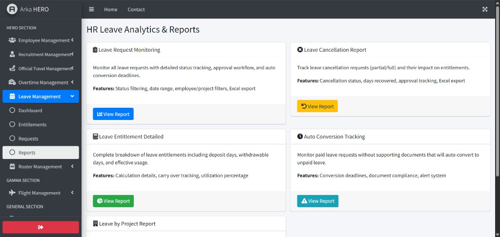 <em>Gambar 4.1 — Setelah membuka <strong>HERO SECTION</strong> → <strong>Leave Management</strong> → <strong>Reports</strong>, muncul halaman <strong>HR Leave Analytics & Reports</strong> berisi kartu laporan dan tombol <strong>View Report</strong> per tema (langkah 1).</em>

2. Pada grid kartu laporan (setiap kartu bermakna satu tema analitik), pilih tema yang Anda butuhkan dan klik **View Report** atau penamaan tombol pemanggil laporan lain yang setara pada layar Anda:
    - **Leave Request Monitoring** — memantau seluruh alur pengajuan cuti: status seperti **Pending**, **Approved**, **Rejected**, serta varian lain di layar Anda; Anda dapat menyempitkan hasil dengan rentang tanggal, **project**, **employee**, dll.; banyak tema menyediakan **Export Excel** (atau label serupa).

    - **Leave Cancellation Report** — rekapitulasi pembatalan hari kerja beserta pengaruhnya ke saldo/entitlement, membantu dokumentasi perkantoran.

    - **Leave Entitlement Detailed** — penetrasi sampai tingkat detail saldo (**deposit**, **withdraw**, utilisasi versus sisa hari).

    - **Auto Conversion Tracking** — izin dibayar tanpa dokumentasi pendukung mendekati tanggal **konversi otomatis** oleh sistem sehingga HR dapat mengantisipasi (unggahan dokumen, koreksi, atau sesuai SOP internal).

    - **Leave by Project Report** — agregasi pemakaian cuti menurut **project** atau dimensi struktur manpower lain yang dipakai manajemen.

3. Pada halaman hasil (**report view** yang terbuka), biasanya ada judul laporan, tombol kembali seperti **Back to Reports**, lalu blok **Filter Options** dengan bidang yang relevan (misalnya **Status**, **Start Date** / **End Date**, **Employee**, **Leave Type**, **Project** — nama dan urutan dapat berbeda tiap tema). Setelah mengatur kriteria, gunakan **Filter** (atau **Apply**) untuk memuat tabel; tombol seperti **Show All** atau **Reset** membantu melihat semua baris atau mengembalikan filter ke awal. **Export Excel** atau serupa mengunduh snapshot hasil aktual. Perhatikan pesan kosong (misalnya _No leave requests found_) — sering karena rentang tanggal atau penyaringan lain belum cocok dengan data, bukan otomatis bermakna kesalahan sistem.

    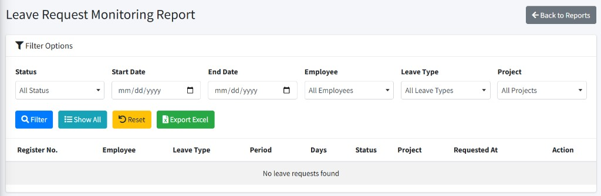 <em>Gambar 4.3 — Contoh halaman <strong>Leave Request Monitoring Report</strong> setelah <strong>View Report</strong>: panel <strong>Filter Options</strong>, tombol aksi, dan tabel hasil (kosong bila filter/belum ada data yang cocok) — langkah 3.</em>

**Catatan:** Tabel dapat tampak “kosong” jika kombinasi **tanggal/project/status** Anda tidak bersinggungan dengan data produksi mana pun; geser atau longgarkan satu per satu kriteria sebelum Anda menyimpulkan bug data.

---

## 5. Untuk karyawan secara personal — **My Leave Request**

Fitur **My Leave Request** dipakai untuk pengajuan cuti atau izin yang biasanya memakai **Formulir Izin Meninggalkan Pekerjaan** atau **Formulir Cuti Panjang** secara personal atau pribadi.

### Langkah-langkah — daftar dan pengajuan cuti pribadi

1. **Login** ke ARKA HERO dengan alamat **http://192.168.32.146:8080** dan masukkan username atau email dan password.

    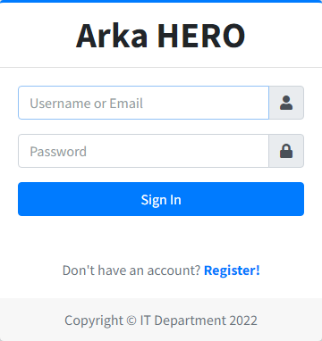 <em>Gambar 5.1 — Halaman <strong>login</strong> sebelum masuk ke menu karyawan (langkah 1).</em>

2. Di kiri layar, buka grup **My Features**, lalu klik **My Leave Request**. Akan muncul halaman yang menunjukkan Anda berada di daftar pengajuan cuti pribadi. Gunakan **filter**, **pencarian**, atau **urutan** di atas tabel jika tersedia, supaya mudah mencari satu baris pengajuan. Perhatikan **Project**, **Leave Type**, tanggal mulai/akhir, **Total Days**, dan **Status** untuk menemukan pengajuan lama atau yang sedang berjalan.

    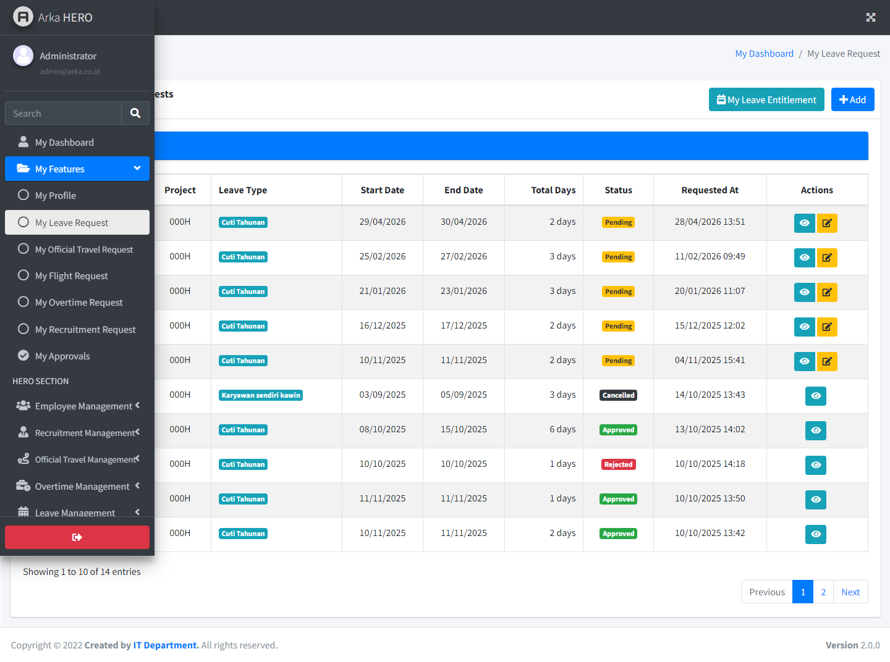 <em>Gambar 5.2 — Sidebar <strong>My Features</strong> dengan <strong>My Leave Request</strong> aktif, judul halaman dan jejak <strong>breadcrumb</strong>, lalu daftar pengajuan (langkah 2).</em>

3. Untuk **melihat saldo entitlement cuti** Anda (sisa hari per jenis cuti dan per periode), dari halaman **My Leave Request** klik tombol **My Leave Entitlement** di samping tombol **Add**.

    **Apa yang tampil pada halaman My Leave Entitlements:**
    - **My Information** — ringkasan data Anda (misalnya NIK, nama, project, level, jabatan, DOH, lama masa kerja, status, jenis staff). Tombol **Back to My Requests** mengembalikan Anda ke daftar pengajuan pada langkah 2.
    - **Leave Entitlements Summary** — judul blok ringkasan; tombol **+ Request Leave** (bila izin mengajukan aktif) membuka formulir pengajuan cuti baru.
    - **Available Periods** — bila ada **lebih dari satu periode entitlement** aktif di sistem, daftar periode muncul di kolom kiri; klik periode untuk memfilter tabel ke periode tersebut (sampai **10 periode terakhir** tercantum di daftar ini).
    - **Entitlement Details** — tabel per jenis cuti, dikelompokkan menurut kategori (misalnya _Annual Leave_). Kolom utama biasanya: **Leave Type**, **Entitled** (hak hari), **Taken** (sudah terpakai), **Remaining** (sisa), **Period** (tanggal mulai–akhir berlaku entitlement), dan **Actions**. Bilah kemajuan di bawah baris memberi gambaran cepat proporsi sisa terhadap hak.
    - **Actions** — tombol **Request** (bila tersedia) membuka form pengajuan untuk jenis cuti baris tersebut ketika masih ada sisa dan periode belum kedaluwarsa; tombol **Details** membuka **View Calculation Details** untuk melihat penjelasan perhitungan angka pada baris tersebut.
    - Tanda **Expired** atau **Expiring Soon** pada baris membantu melihat entitlement yang sudah tidak berlaku atau akan segera berakhir.
    - Jika tidak ada baris untuk periode yang dipilih, pesan seperti **No Entitlements Found** dapat muncul. Jika Anda belum pernah memiliki entitlement sama sekali, halaman dapat menyarankan menghubungi **HR** sesuai teks di layar.

    Jika tombol **My Leave Entitlement** sama sekali tidak muncul, administrator mungkin belum memberi izin akun Anda untuk melihat entitlement pribadi — hubungi **HR** atau **administrator**.

    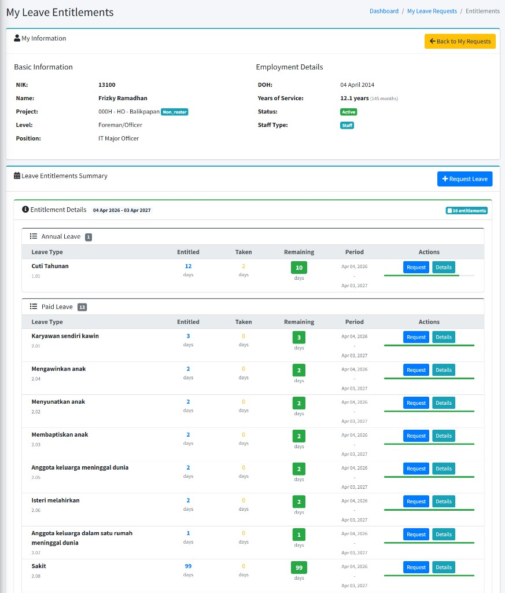 <em>Gambar 5.3 — Halaman <strong>My Leave Entitlements</strong>: <strong>My Information</strong>, <strong>Leave Entitlements Summary</strong> dengan <strong>+ Request Leave</strong>, lalu <strong>Entitlement Details</strong> per kategori (misalnya <em>Annual Leave</em>, <em>Paid Leave</em>) dengan badge jumlah entitlement, saldo <strong>Remaining</strong>, dan tombol <strong>Request</strong> / <strong>Details</strong> per baris (langkah 3).</em>

4. Untuk pengajuan baru, klik tombol **Add** dari halaman **My Leave Request**, atau bisa dari halaman **My Leave Entitlement** (inti pembuka formulir bagi HR ada di [bagian 3 (HR), langkah **1**](#leave-request-create-step-1)). Form terbuka sudah memakai data Anda sebagai pemohon—tanpa melakukan [bagian 3 (HR), langkah **2**](#leave-request-create-step-2): **HR** memilih **Project** dan **Employee**, sedangkan data Anda mengacu akun sendiri dari sistem.

     <em>Gambar 5.4 — Tombol <strong>Add</strong> / <strong>+</strong> untuk membuka formulir pengajuan baru (langkah 4).</em>

5. **Isi formulir pengajuan** mengikuti urutan [**Bagian 3 — Langkah-langkah — Create Leave Request**](#leave-request-create-section). Untuk jalur personal Anda **tidak** melakukan [bagian 3 (HR), langkah **2**](#leave-request-create-step-2) (memilih **Project** dan **Employee**) — data sudah mengacu akun Anda. Jika data Employee dan Project menampilkan **N/A - N/A**, silahkan menghubungi HR untuk menghubungkan data karyawan dengan user Anda. Lanjutkan seturut seperti di bagian HR:
    - **Leave Type** dan **Leave Period** (setara [bagian 3 (HR), langkah **3**](#leave-request-create-step-3)) — periode hak biasanya mengikuti entitlement; bila **Leave Period** kosong, hubungi HR soal saldo cuti / **Leave Entitlement**.
    - **Pola per jenis cuti** ([bagian 3 (HR), langkah **4**](#leave-request-create-cutitahunan), [langkah **5**](#leave-request-create-izin-dibayar), [langkah **6**](#leave-request-create-izin-tanpa-upah), [langkah **7**](#leave-request-create-cutipanjang)) — **Cuti Tahunan (1.01)** tanpa dokumen tambahan wajib; **Izin Dibayar (2.xx)** dapat memunculkan **Supporting Document**; **Izin Tanpa Upah (3.01)** wajib isi **Reason**; **Cuti Panjang (4.01)** memunculkan blok **LSL** (**Leave Days**, **Cash Out**, dsb.).
    - **Leave Date**, **Back to Work Date**, **Total Days** ([bagian 3 (HR), langkah **8**](#leave-request-create-leave-date)) — aturan kalender **roster** / **non-roster** dan **hari libur nasional** sama seperti di panduan HR.
    - **Flight Request** ([bagian 3 (HR), langkah **9**](#leave-request-create-step-9)) dan **Approver Selection** ([bagian 3 (HR), langkah **10**](#leave-request-create-step-10)) — centang tiket bila perlu; tambahkan approver sampai aturan di layar terpenuhi.
    - **Save & Submit** atau **Cancel** ([bagian 3 (HR), langkah **12**](#leave-request-create-step-12)) — kirim ke alur persetujuan, atau tinggalkan form tanpa simpan.

    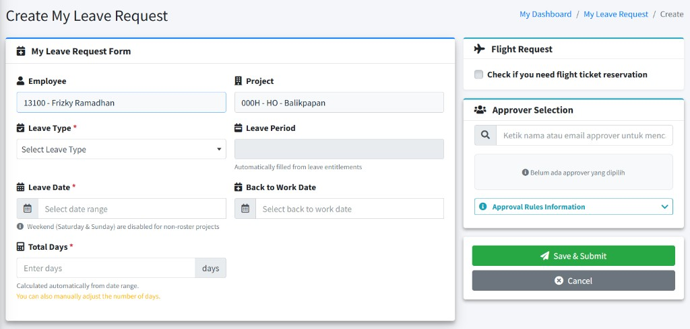 <em>Gambar 5.5 — Formulir <strong>Create My Leave Request</strong>: kiri <strong>Employee</strong>/<strong>Project</strong> terisi otomatis, <strong>Leave Type</strong>, <strong>Leave Period</strong>, tanggal, <strong>Total Days</strong>; kanan <strong>Flight Request</strong>, <strong>Approver Selection</strong>, lalu <strong>Save & Submit</strong>/<strong>Cancel</strong> — setara struktur bagian 3 (HR) (<a href="#leave-request-create-step-9">langkah 9</a>, <a href="#leave-request-create-step-10">10</a>) (langkah 5).</em>

6. **Pembatalan cuti yang sudah disetujui** mengikuti [**Bagian 3 — Leave Request Detail, Approval, Close Request, Request Cancellation**](#leave-request-detail-cancellation-section):
    - Dari daftar **My Leave Request** (lihat [langkah **2**](#my-leave-request-step-2) pada bagian ini), temukan pengajuan berstatus **Approved** → buka **Leave Request Detail** lewat **View** / **Actions** (setara [bagian 3 (HR), langkah **1**](#leave-requests-after-step-1) pada subsection pembatalan: daftar → detail).
    - Di halaman detail, pilih **Request Leave Cancellation** bila tersedia untuk status tersebut (setara [bagian 3 (HR), langkah **2**](#leave-request-detail-step-2)).
    - Pada **Cancellation Request Form**, isi seperti [bagian 3 (HR), langkah **4**](#leave-request-cancellation-step-4): **Days to Cancel** (wajib; bisa parsial), **Reason for Cancellation** (wajib), baca **Important Notes**, lalu **Submit Cancellation Request** atau keluar dengan **Cancel** tanpa mengirim. Detail formulir ada di cuplikan [Gambar 3.21](#leave-request-cancellation-form).
    - **HR** menindaklanjuti antrean seperti [bagian 3 (HR), langkah **5**](#leave-requests-pending-cancellation-table) (**Pending Cancellation Requests**); Anda menunggu keputusan. Pengembalian saldo mengikuti aturan dan persetujuan di aplikasi.

    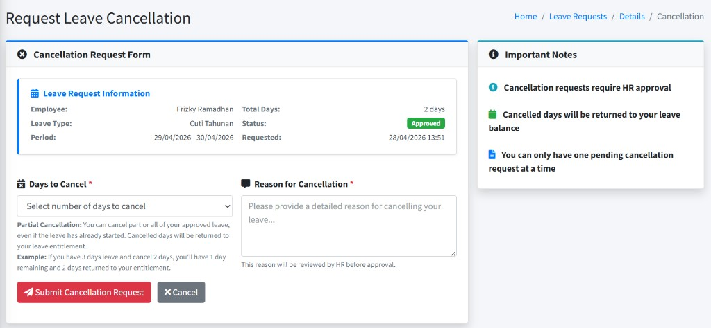 <em>Gambar 5.6 — Halaman <strong>Request Leave Cancellation</strong>: ringkasan cuti yang dibatalkan, <strong>Days to Cancel</strong>, <strong>Reason for Cancellation</strong>, panel <strong>Important Notes</strong>, serta <strong>Submit Cancellation Request</strong> / <strong>Cancel</strong>; samakan dengan langkah pembatalan di <a href="#leave-request-cancellation-step-4">bagian 3 (HR)</a> (langkah 6).</em>

**Catatan:** Jika **My Leave Request** tidak muncul di **My Features**, kemungkinan besar izin akun Anda belum diaktifkan—tanyakan ke **administrator** atau **HR**, bukan karena kesalahan browser.

---

## 6. Kesalahan & bantuan

| Gejala / pesan (contoh)                                     | Kemungkinan penyebab                                                                                                                       | Apa yang bisa dicoba                                                                                                                                                      |
| ----------------------------------------------------------- | ------------------------------------------------------------------------------------------------------------------------------------------ | ------------------------------------------------------------------------------------------------------------------------------------------------------------------------- |
| **Leave Period** kosong / **Leave Type** tidak bisa dipilih | Belum ada **entitlement** aktif untuk karyawan & jenis cuti tersebut                                                                       | Pastikan HR sudah **Generate** / impor saldo di **Entitlements** untuk project dan periode yang benar.                                                                    |
| **Import Validation Errors** setelah **Import**             | Format berkas (tipe/ukuran), **NIK** tidak aktif, **Start**/**End Period** kosong atau tanggal tidak valid, **Deposit Days** negatif, dll. | Rincian pesan umum ada pada **bagian 2.1** (_Import Validation Errors — pesan yang umum muncul_); perbaiki baris di Excel mengikuti **Error Message**, lalu unggah ulang. |
| Tidak bisa **Save & Submit** / pesan approver               | **Approver Selection** belum memenuhi jumlah/aturan                                                                                        | Tambahkan approver valid lewat pencarian sampai persyaratan terpenuhi.                                                                                                    |
| **Pending** terus tanpa keputusan                           | Approver belum bertindak atau notifikasi tidak terbaca                                                                                     | Hubungi approver terkait lewat saluran resmi perusahaan.                                                                                                                  |
| Cuti berbayar terdeteksi tanpa dokumen                      | Lampiran belum diunggah                                                                                                                    | Unggah dokumen di detail pengajuan sebelum tenggat **Auto Conversion** (lihat laporan pemantauan).                                                                        |
| Menu **Leave Management** / tombol HR tidak ada             | Peran akun tidak mencakup fitur HR                                                                                                         | Minta **administrator** menyesuaikan peran/izin.                                                                                                                          |

### Menghubungi administrator

Hubungi **administrator** (atau **IT** / **HR**) jika menu seharusnya ada tetapi hilang, status tidak berubah setelah tindakan yang wajar, atau Anda membutuhkan koreksi **Master Data** (**Leave Types**, **Projects**, data karyawan).

**Jangan** mengirim **password** lewat obrolan atau surel. Sampaikan **username**, **Register No.** pengajuan bila relevan, waktu kejadian, dan cuplikan pesan di layar.

---
