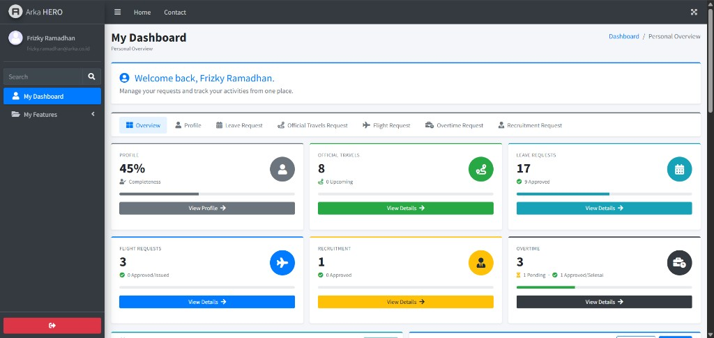
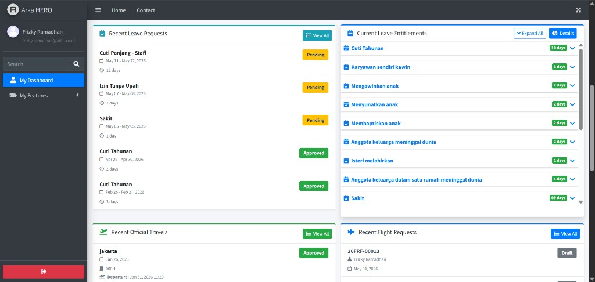
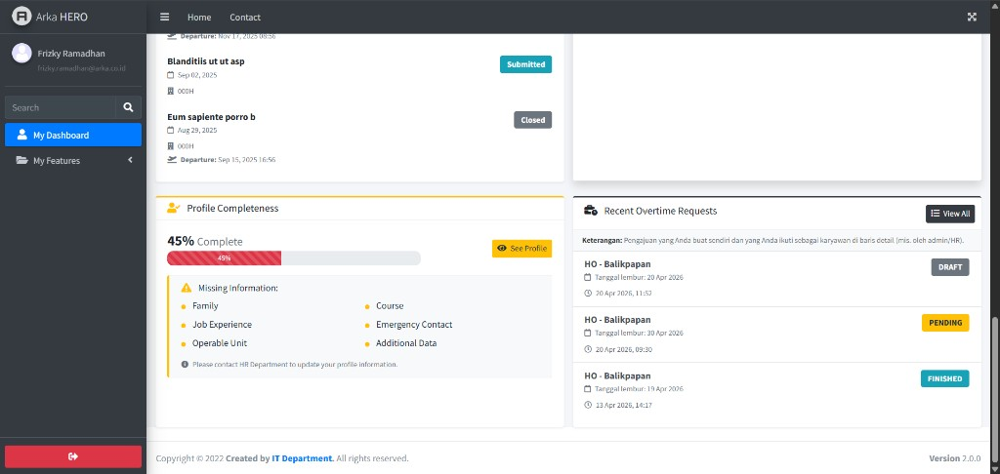
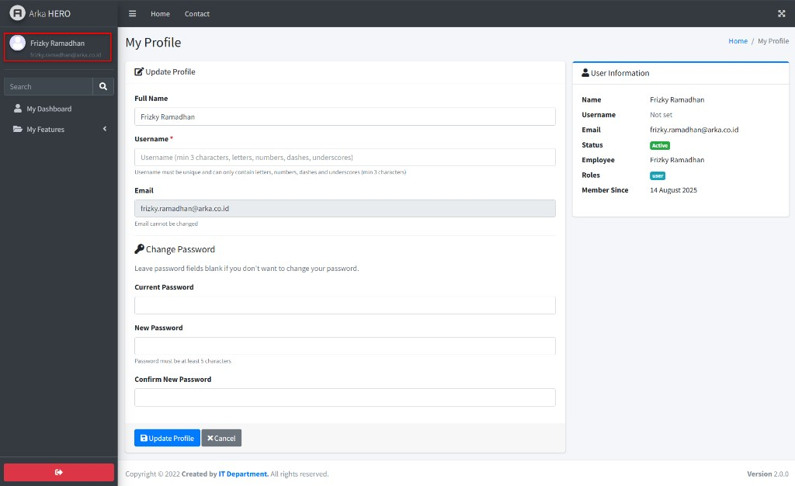
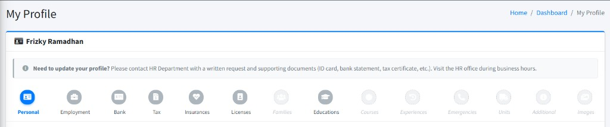

# My Dashboard & My Features

Bab ini ditujukan untuk **seluruh karyawan** yang memiliki akun di sistem ARKA HERO. Panduan ini mencakup halaman personal karyawan: **My Dashboard** sebagai pusat ringkasan aktivitas, halaman **Update Profile** untuk mengubah username dan password, serta semua submenu dalam **My Features** — **My Profile**, **My Leave Request**, **My Official Travel Request**, **My Flight Request**, **My Overtime Request**, dan **My Recruitment Request**. Seluruh label antarmuka dalam bab ini menggunakan bahasa Inggris sesuai tampilan di aplikasi.

---

## Glosarium

| **Istilah**              | Arti singkat                                                                                       |
| :----------------------- | :------------------------------------------------------------------------------------------------- |
| **My Dashboard**         | Halaman ringkasan personal karyawan yang menampilkan statistik dan aktivitas terkini seluruh fitur |
| **My Features**          | Kelompok menu di sidebar yang berisi akses ke semua fitur mandiri karyawan                         |
| **LOT**                  | _Letter of Travel_ — surat tugas perjalanan dinas resmi                                            |
| **FPTK**                 | _Formulir Permintaan Tenaga Kerja_ — dokumen permintaan rekrutmen karyawan baru                    |
| **Entitlement**          | Jatah/hak cuti yang diberikan kepada karyawan per periode                                          |
| **NIK**                  | Nomor Induk Karyawan — identitas unik karyawan di sistem                                           |
| **DOH**                  | _Date of Hire_ — tanggal mulai bekerja di perusahaan                                               |
| **FOC**                  | _Final of Contract_ — tanggal berakhirnya kontrak                                                  |
| **Draft**                | Status permintaan yang belum diajukan; masih bisa diedit atau dihapus                              |
| **Pending**              | Permintaan telah diajukan dan menunggu persetujuan approver                                        |
| **Approved**             | Permintaan telah disetujui                                                                         |
| **Rejected**             | Permintaan ditolak oleh approver                                                                   |
| **Cancelled**            | Permintaan dibatalkan oleh karyawan                                                                |
| **Issued**               | Tiket penerbangan telah diterbitkan (khusus Flight Request)                                        |
| **Finished**             | Lembur telah selesai dan dicatat (khusus Overtime Request)                                         |
| **Approver**             | Atasan atau pejabat yang berwenang menyetujui/menolak permintaan                                   |
| **LSL**                  | _Long Service Leave_ — cuti masa kerja panjang yang dapat dikombinasikan dengan _cash out_         |
| **Standalone**           | Permintaan tiket penerbangan yang tidak terkait dengan cuti maupun perjalanan dinas                |
| **Profile Completeness** | Persentase kelengkapan data profil karyawan di sistem                                              |

---

## 1. My Dashboard

**My Dashboard** adalah halaman pertama yang muncul setelah karyawan masuk ke aplikasi. Untuk mengaksesnya, klik menu **My Dashboard** di sidebar.

    
     <em>Gambar 1.1a — Bagian atas: welcome banner, tab navigasi, dan enam kartu statistik ringkas</em> 
    
     <em>Gambar 1.1b — Bagian tengah: Recent Leave Requests, Current Leave Entitlements, Recent Official Travels, Recent Flight Requests</em> 
    
     <em>Gambar 1.1c — Bagian bawah: Profile Completeness, Recent Overtime Requests, serta footer halaman</em>

### Langkah-langkah — Membaca My Dashboard

Halaman terdiri atas beberapa area utama yang dapat dibaca dari atas ke bawah:

---

**1. Welcome Card**

Area teratas menampilkan sapaan _"Welcome back, [Nama Anda]"_ beserta kalimat singkat pengantar. Di sinilah Anda mengetahui bahwa semua permintaan dan aktivitas dapat dikelola dari satu tempat. <a href="#my-dashboard">Lihat gambar</a>.

---

**2. Peringatan Username Belum Diisi**

Jika Anda belum mengisi **Username**, sistem menampilkan banner peringatan berwarna kuning bertuliskan _"Username Belum Diisi"_. Klik tombol **Isi Username Sekarang** untuk langsung diarahkan ke halaman **Update Profile**. Username diperlukan untuk login selain menggunakan email.

**Catatan:** Peringatan ini hanya muncul selama username masih kosong. Setelah diisi, banner tidak akan tampil lagi.

---

**3. Tab Navigasi Fitur**

Di bawah welcome card terdapat baris tab bernama:

- **Overview** — menampilkan semua kartu statistik sekaligus (tampilan default).
- **Profile** — menyaring tampilan ke kartu dan informasi profil saja.
- **Leave Request** — menyaring ke statistik dan riwayat cuti saja.
- **Official Travels Request** — menyaring ke statistik dan riwayat perjalanan dinas.
- **Flight Request** — menyaring ke statistik dan riwayat permintaan tiket pesawat.
- **Overtime Request** — menyaring ke statistik lembur.
- **Recruitment Request** — menyaring ke statistik permintaan rekrutmen.
- **Approvals** — muncul hanya jika Anda memiliki peran _approver_.

Klik salah satu tab untuk fokus pada modul tertentu. Klik **Overview** untuk kembali ke tampilan lengkap.

---

**4. Kartu Statistik**

Setiap fitur ditampilkan sebagai kartu ringkasan yang menunjukkan:

- **Profile** — persentase kelengkapan profil beserta _progress bar_. Tombol **View Profile** membuka halaman **My Profile**.
- **Official Travels** — jumlah total perjalanan dinas dan jumlah yang akan datang (_Upcoming_). Tombol **View Details** membuka **My Official Travel Request**.
- **Leave Requests** — jumlah total permintaan cuti dan jumlah yang disetujui (_Approved_). Tombol **View Details** membuka **My Leave Request**.
- **Flight Requests** — jumlah total permintaan tiket dan yang sudah disetujui/diterbitkan (_Approved/Issued_). Tombol **View Details** membuka **My Flight Request**.
- **Recruitment** — jumlah total permintaan FPTK dan yang disetujui. Tombol **View Details** membuka **My Recruitment Request**.
- **Overtime** — jumlah total permintaan lembur, jumlah _Pending_, dan jumlah yang _Approved/Selesai_. Tombol **View Details** membuka **My Overtime Request**.
- **Pending Approvals** — muncul hanya untuk _approver_; menampilkan jumlah permintaan yang menunggu tindakan. Tombol **Review Now** membuka halaman persetujuan.

---

**5. Daftar Aktivitas Terkini**

Di bagian bawah kartu statistik, dashboard menampilkan empat daftar aktivitas terkini:

- **Recent Leave Requests** — daftar permohonan cuti terbaru beserta jenis cuti, tanggal, jumlah hari, dan badge status (_Approved_, _Pending_, _Rejected_, dll.). Klik **View All** untuk membuka halaman **My Leave Request**.
- **Current Leave Entitlements** — panel _accordion_ yang menampilkan saldo cuti Anda per jenis. Klik nama jenis cuti untuk melihat detail: **Entitled** (jatah), **Used** (terpakai), **Remaining** (sisa), dan masa berlaku (_Valid until_). Jika saldo tersedia, tombol **Request [Jenis Cuti]** langsung mengarahkan ke form pengajuan. Klik **Expand All** / **Collapse All** untuk membuka/menutup semua panel sekaligus. Klik **Details** untuk membuka halaman **My Leave Entitlement**.
- **Recent Official Travels** — daftar perjalanan dinas terbaru beserta tujuan, tanggal, kode proyek, dan status. Klik **View All** untuk membuka **My Official Travel Request**.
- **Recent Flight Requests** — daftar permintaan tiket terbaru beserta nomor form, nama karyawan, tanggal, dan status. Klik salah satu baris untuk melihat detail. Klik **View All** untuk membuka **My Flight Request**.
- **Profile Completeness** — menampilkan persentase kelengkapan profil secara visual beserta daftar seksi yang belum dilengkapi (_Missing Information_). Jika ada data yang kurang, hubungi HR Department untuk memperbaruinya.
- **Recent Overtime Requests** — daftar lembur terbaru beserta nama proyek, tanggal lembur, dan status. Klik baris untuk melihat detail. Klik **View All** untuk membuka **My Overtime Request**.

    

 <em>Gambar 1.2 — Daftar aktivitas terkini di bagian bawah My Dashboard</em>

---

## 2. Update Profile

Halaman **Update Profile** memungkinkan Anda mengubah nama tampilan, mengatur **Username** untuk login, serta mengganti password akun. Halaman ini dapat diakses dengan mengklik nama Anda di panel atas sidebar, atau melalui tautan pada peringatan di **My Dashboard**.

**Navigasi:** Klik nama Anda di sidebar → halaman **Update Profile** terbuka.

### Langkah-langkah — Update Profile & Change Password

**1. Full Name**

Isi kolom **Full Name** dengan nama lengkap yang ingin ditampilkan di sistem. Field ini wajib diisi.

**2. Username**

Isi kolom **Username** dengan nama pengguna unik yang akan digunakan untuk login selain email. Aturan:

- Minimal 3 karakter
- Hanya boleh mengandung huruf, angka, tanda hubung (`-`), dan _underscore_ (`_`)
- Harus unik — tidak boleh sama dengan pengguna lain

**Catatan:** Username bersifat **wajib**. Jika belum diisi, sistem menampilkan peringatan di **My Dashboard**.

**3. Email**

Kolom **Email** ditampilkan sebagai referensi saja dan **tidak dapat diubah** melalui halaman ini.

**4. Change Password** _(opsional)_

Jika ingin mengganti password, isi tiga field berikut:

- **Current Password** — password yang sedang aktif saat ini
- **New Password** — password baru (minimal 5 karakter)
- **Confirm New Password** — ulangi password baru untuk konfirmasi

Jika tidak ingin mengganti password, **biarkan ketiga field ini kosong**.

**5. Simpan Perubahan**

Klik tombol **Update Profile** untuk menyimpan semua perubahan. Klik **Cancel** untuk kembali ke halaman sebelumnya tanpa menyimpan.

    

 <em>Gambar 2.1 — Halaman Update Profile dengan panel User Information di sebelah kanan</em>

Di sebelah kanan form, panel **User Information** menampilkan informasi akun saat ini: nama, username, email, status akun, nama karyawan tertaut, peran (_Roles_), dan tanggal bergabung (_Member Since_). Informasi ini hanya untuk referensi dan tidak dapat diubah langsung dari panel ini.

---

## 3. My Profile

**My Profile** menampilkan seluruh data karyawan yang tersimpan di sistem, mulai dari data pribadi, data kepegawaian, hingga dokumen pendukung. Halaman ini bersifat **hanya baca** — perubahan data harus diajukan melalui HR Department dengan dokumen pendukung.

**Navigasi:** **My Features** → **My Profile**

**Breadcrumb:** Home → Dashboard → **My Profile**

**Catatan:** Untuk memperbarui data profil, hubungi HR Department secara tertulis dengan menyertakan dokumen pendukung (KTP, buku tabungan, NPWP, dll.) selama jam kerja.

### Langkah-langkah — Membaca My Profile

Halaman **My Profile** menggunakan navigasi tab bertingkat (_stepper_) di bagian atas. Klik tab yang diinginkan untuk beralih antar-seksi data.

    

 <em>Gambar 3.1 — Tab stepper navigasi pada halaman My Profile</em>

Tab yang tersedia beserta isinya:

**Personal** — Data pribadi: **Full Name**, **ID Card No.**, **Place/Date of Birth**, **Blood Type**, **Religion**, **Nationality**, **Gender**, **Marital**, tautan unduh **KTP** dan **KK**. Di bawahnya: **Address & Contact** (Address, City, Postal Code, Phone, Email).

**Employment** — Data kepegawaian aktif: **NIK**, **Position**, **Department**, **Project**, **Grade**, **Level**, **Class**, **Date of Hire (DOH)**, **End of Contract (FOC)** jika ada. Jika pernah berpindah posisi, tabel **Employment History** menampilkan riwayat lengkap.

**Bank** — Rekening penggajian: **Bank Name**, **Account Number**, **Account Name**, **Branch** (jika ada), dan tautan unduh **Passbook / statement**.

**Tax** — Informasi pajak: **NPWP Number**, **Registration Date**, dan tautan unduh **NPWP document**.

**Insurances** — Tabel asuransi: **Insurance Type** (BPJS Ketenagakerjaan / BPJS Kesehatan), **Insurance Number**, **Health Facility**, **Remarks**, tautan unduh dokumen.

**Licenses** — Tabel SIM/lisensi: **License Type**, **License Number**, **Expiry Date**, tautan unduh dokumen.

**Families** — Tabel anggota keluarga: **Relationship**, **Name**, **Birthplace**, **Date of Birth**, **Remarks**, **BPJS Kesehatan No**.

**Educations** — Tabel riwayat pendidikan: **Education Name**, **Address**, **Year**, **Remarks**, tautan unduh **Ijazah**.

**Courses** — Tabel pelatihan/kursus: **Course Name**, **Address**, **Year**, **Remarks**.

**Experiences** — Tabel riwayat pekerjaan: **Company Name**, **Company Address**, **Position**, **Duration**, **Quit Reason**.

**Emergencies** — Tabel kontak darurat: **Relationship**, **Name**, **Address**, **Phone**.

**Units** — Tabel unit yang dapat dioperasikan: **Unit Name**, **Unit Type / Class**, **Remarks**.

**Additional** — Data tambahan: **Clothing Information** (Shirt Size, Pants Size, Shoes Size) dan **Address Information** (City, Postal Code).

**Images** — Galeri foto karyawan. Klik foto untuk memperbesar. Tab yang aktif memiliki lingkaran biru; tab dengan data kosong ditandai dengan lingkaran abu-abu bergaris putus-putus.

**Catatan:** Jika sebuah tab menampilkan _"No Data Available"_, artinya data belum tersedia di sistem. Hubungi HR untuk melengkapinya.

---

## 4. My Leave Request

**My Leave Request** adalah modul untuk mengajukan dan memantau permohonan cuti Anda. Modul ini terdiri atas dua halaman utama: daftar permohonan cuti dan halaman saldo cuti (**My Leave Entitlement**).

**Navigasi:** **My Features** → **My Leave Request**

**Breadcrumb:** My Dashboard → **My Leave Request**

### 4.1 Daftar Permohonan Cuti

Saat membuka menu **My Leave Request**, Anda langsung melihat tabel daftar semua permohonan cuti Anda.

**Tombol tersedia:**

- **My Leave Entitlement** — membuka halaman saldo cuti per jenis (lihat [bagian 4.2](#my-leave-entitlement)).
- **Add** — membuka form pengajuan cuti baru (lihat [bagian 4.3](#membuat-permohonan-cuti-baru)).

**Filter** tersedia dengan klik panel **Filter** (dapat dilipat/dibuka):

- **Status** — pilih: Draft, Pending, Approved, Rejected, Cancelled, Closed, atau kosong untuk semua.
- **Leave Type** — pilih jenis cuti.
- Kolom tanggal mulai dan akhir.

    

 <em>Gambar 4.1 — Daftar permohonan cuti pada halaman My Leave Request</em>

### 4.2 My Leave Entitlement

Halaman ini menampilkan saldo hak cuti Anda per jenis cuti beserta informasi kepegawaian.

Klik tombol **My Leave Entitlement** dari halaman daftar untuk membukanya. Halaman menampilkan:

- Panel **My Information**: NIK aktif, nama, proyek, tanggal mulai bekerja (DOH).
- Tabel hak cuti per jenis: kolom **Entitled** (jatah), **Used** (terpakai), **Remaining** (sisa), dan **Valid Until** (masa berlaku).

Klik **Back to My Requests** untuk kembali ke daftar permohonan.

### 4.3 Membuat Permohonan Cuti Baru

Klik tombol **Add** pada halaman daftar. Form **My Leave Request Form** terbuka.

**1. Employee & Project**

Field **Employee** dan **Project** terisi otomatis berdasarkan data kepegawaian aktif Anda dan bersifat _readonly_.

**2. Leave Type**

Pilih jenis cuti dari dropdown **Leave Type**. Setelah dipilih, field **Leave Period** akan terisi otomatis sesuai periode entitlement yang berlaku.

**3. Leave Date**

Klik field **Leave Date** untuk memilih rentang tanggal cuti melalui kalender. Hari libur nasional ditandai dengan warna kuning di kalender. Untuk proyek non-roster, hari Sabtu dan Minggu dinonaktifkan.

**4. Back to Work Date**

Isi atau pilih **Back to Work Date** — tanggal Anda kembali bekerja setelah cuti.

**5. Total Days**

Field **Total Days** dihitung otomatis dari rentang tanggal yang dipilih. Anda dapat menyesuaikan jumlahnya secara manual jika diperlukan.

**6. Reason** _(muncul untuk jenis cuti tertentu)_

Isi alasan permohonan cuti di field **Reason** jika ditampilkan oleh sistem.

**7. Supporting Document** _(opsional, muncul untuk jenis cuti tertentu)_

Upload dokumen pendukung jika diperlukan. Format yang diterima: PDF, DOC, DOCX, JPG, PNG, RAR, ZIP. Ukuran maksimum: 2 MB.

**8. Long Service Leave — LSL** _(muncul khusus jika memilih jenis cuti LSL)_

Jika jenis cuti yang dipilih adalah **Long Service Leave**, muncul panel tambahan yang memungkinkan kombinasi dengan _cash out_. Ikuti panduan di dalam panel tersebut.

**9. Simpan atau Ajukan**

Gunakan tombol di panel kanan:

- **Save as Draft** — menyimpan tanpa mengajukan; dapat diedit atau dihapus nanti.
- **Submit** — mengajukan permohonan untuk diproses approver. Status berubah menjadi **Pending**.

**Catatan:** Setelah status berubah menjadi **Pending**, permohonan tidak dapat diedit. Hubungi approver atau HR jika terjadi kesalahan.

    

 <em>Gambar 4.3 — Form pengajuan cuti baru</em>

---

## 5. My Official Travel Request

**My Official Travel Request** digunakan untuk mengajukan permohonan perjalanan dinas (_LOT — Letter of Travel_). Nomor LOT resmi akan ditetapkan oleh HR setelah konfirmasi.

**Navigasi:** **My Features** → **My Official Travel Request**

**Breadcrumb:** My Dashboard → **My LOT Request**

### Langkah-langkah — Daftar & Filter Permohonan Perjalanan Dinas

Pada halaman daftar, tombol **New Request** membuka form pengajuan baru.

**Filter** tersedia:

- **Travel Number** — cari berdasarkan nomor perjalanan.
- **Status** — pilih: Draft, Menunggu Konfirmasi HR, Submitted, Approved, Rejected, Closed, Cancelled.
- **Role** — pilih: Main Traveler (pengaju utama) atau Follower (peserta perjalanan yang ditambahkan oleh pengaju utama).

### Langkah-langkah — Membuat Permohonan Perjalanan Dinas Baru

Klik **New Request**. Form **Travel Information** terbuka.

**1. LOT Number**

Field **LOT Number** diisi otomatis sebagai nomor sementara. Nomor LOT resmi akan ditetapkan oleh HR setelah diajukan.

**2. Main Traveler**

Field **Main Traveler** diisi otomatis dengan NIK dan nama Anda sebagai pengaju utama perjalanan.

**3. LOT Date**

Pilih **LOT Date** — tanggal surat tugas perjalanan dinas.

**4. Destination & Purpose**

Isi tujuan perjalanan dan maksud/tujuan dari perjalanan dinas.

**5. Transportation & Accommodation**

Pilih jenis transportasi dan akomodasi sesuai rencana perjalanan.

**6. Stops / Rencana Perjalanan**

Tambahkan detail setiap perhentian perjalanan (kota tujuan, tanggal tiba, tanggal berangkat dari kota tersebut).

**7. Simpan atau Ajukan**

- **Save as Draft** — simpan tanpa mengajukan ke HR.
- **Submit** — ajukan ke HR untuk konfirmasi. Status berubah menjadi **Menunggu Konfirmasi HR** (_pending_hr_).

**Catatan:** Setelah diajukan, HR akan menugaskan nomor LOT resmi dan mengubah status menjadi **Submitted** untuk dilanjutkan ke proses persetujuan.

    

 <em>Gambar 5.1 — Form pengajuan perjalanan dinas baru</em>

---

## 6. My Flight Request

**My Flight Request** digunakan untuk mengajukan permintaan tiket penerbangan, baik yang terkait dengan cuti, perjalanan dinas, maupun perjalanan mandiri (_standalone_).

**Navigasi:** **My Features** → **My Flight Request**

**Breadcrumb:** My Dashboard → **My Flight Requests**

### Langkah-langkah — Daftar & Filter Permintaan Tiket

Tombol **New Request** membuka form pengajuan tiket baru.

**Filter** tersedia:

- **Status** — Draft, Submitted, Approved, Issued, Completed, Rejected, Cancelled.
- **Request Type** — Standalone, Leave Based, Travel Based.
- **Form Number** — cari berdasarkan nomor formulir.

### Langkah-langkah — Membuat Permintaan Tiket Baru

Klik **New Request**. Form **Create Flight Request** terbuka dengan dua kolom utama.

**1. Request Information — Select Request Type**

Pilih jenis permintaan tiket:

- **Leave Request (Cuti)** — tiket terkait dengan permohonan cuti yang sudah ada.
- **Official Travel (LOT)** — tiket terkait dengan perjalanan dinas yang sudah ada.
- **Standalone** — tiket mandiri yang tidak terhubung ke cuti atau perjalanan dinas.

**2. Source Document** _(muncul jika tipe bukan Standalone)_

Setelah memilih tipe, pilih dokumen sumber yang terkait (nomor cuti atau nomor LOT). Dropdown akan menampilkan daftar dokumen milik Anda yang tersedia.

**3. Fill Employee Information Manually** _(khusus Standalone)_

Untuk tipe **Standalone**, centang **Fill employee information manually** jika ingin mengisi data karyawan secara manual.

**4. Employee Information**

Tabel **Employee Information** menampilkan data karyawan yang akan menggunakan tiket: nama, NIK, proyek, rute penerbangan, kelas, dan keterangan.

**5. Flight Details**

Isi detail penerbangan: rute, tanggal, jam keberangkatan, maskapai, dan informasi lainnya.

**6. Simpan atau Ajukan**

- **Save as Draft** — simpan sebagai draft.
- **Submit** — ajukan ke bagian GAMMA untuk diproses penerbitan tiket. Status menjadi **Submitted**.

**Catatan:** Setelah tiket diterbitkan oleh tim GAMMA, status berubah menjadi **Issued**. Pastikan data penumpang dan rute sudah benar sebelum mengajukan.

    

 <em>Gambar 6.1 — Form pengajuan tiket penerbangan baru dengan pilihan Request Type</em>

---

## 7. My Overtime Request

**My Overtime Request** digunakan untuk mengajukan permintaan lembur. Permintaan dapat dibuat oleh karyawan sendiri, atau oleh atasan/HR atas nama karyawan.

**Navigasi:** **My Features** → **My Overtime Request**

**Breadcrumb:** Home → My Dashboard → **My Overtime Requests**

**Catatan:** Halaman ini menampilkan permintaan lembur yang **Anda buat sendiri** maupun yang **Anda ikuti sebagai peserta** (ditambahkan oleh admin/HR di baris detail).

### Langkah-langkah — Daftar & Filter Permintaan Lembur

Tombol **Add** membuka form pengajuan lembur baru.

**Filter** tersedia:

- **Status** — Draft, Pending, Approved, Rejected, Finished.
- **Project** — saring berdasarkan nama proyek.

### Langkah-langkah — Membuat Permintaan Lembur Baru

Klik **Add**. Form **Overtime information** terbuka.

**1. Project**

Pilih **Project** dari dropdown. Setelah proyek dipilih, tabel **Employee details** di bawah akan memuat daftar karyawan yang terdaftar di proyek tersebut.

**2. Overtime date**

Pilih tanggal lembur menggunakan field **Overtime date**.

**3. Remarks** _(opsional)_

Isi **Remarks** untuk catatan tambahan terkait permintaan lembur ini.

**4. Employee Details**

Tabel **Employee details** digunakan untuk menentukan siapa saja yang lembur beserta jam kerjanya. Setiap baris berisi:

- **Employee (NIK — Name)** — pilih karyawan dari dropdown (hanya karyawan yang terdaftar di proyek terpilih).
- **IN** — jam mulai lembur (format HH:MM).
- **OUT** — jam selesai lembur (format HH:MM).
- **Work description** — deskripsi singkat pekerjaan lembur.

Klik tombol **+ Row** di sudut kanan atas tabel untuk menambah baris karyawan. Klik ikon **×** di kolom **Action** untuk menghapus baris.

**5. Approver Selection**

Di panel kanan, pilih approver yang akan menyetujui permintaan lembur ini. Approver wajib dipilih sebelum mengajukan.

**6. Simpan atau Ajukan**

- **Save draft** — simpan sebagai draft; dapat diedit atau dihapus nanti.
- **Submit** — ajukan ke approver. Status berubah menjadi **Pending**.

    

 <em>Gambar 7.1 — Form pengajuan lembur dengan tabel detail karyawan dan Approver Selection</em>

---

## 8. My Recruitment Request

**My Recruitment Request** digunakan untuk mengajukan **FPTK** (_Formulir Permintaan Tenaga Kerja_) — dokumen resmi permintaan rekrutmen karyawan baru. Nomor FPTK resmi akan ditetapkan oleh HR setelah konfirmasi.

**Navigasi:** **My Features** → **My Recruitment Request**

**Breadcrumb:** My Dashboard → **My Recruitment Request**

**Catatan:** Halaman ini menampilkan permintaan rekrutmen yang relevan dengan proyek dan departemen Anda.

### Langkah-langkah — Daftar & Filter Permintaan Rekrutmen

Tombol **Add** membuka form FPTK baru.

**Filter** tersedia:

- **Status** — Draft, Acknowledged, PM Approved, Approved, Rejected, Cancelled.

### Langkah-langkah — Membuat Permintaan Rekrutmen Baru

Klik **Add**. Form **FPTK Information** terbuka.

**1. Request Number**

Field **Request Number** diisi otomatis sebagai nomor sementara. Nomor FPTK resmi akan ditetapkan oleh HR.

**2. Request Date**

Field **Request Date** diisi otomatis dengan tanggal hari ini dan bersifat _readonly_.

**3. Department**

Pilih **Department** yang memerlukan tenaga kerja baru.

**4. Position & Grade/Level**

Pilih posisi yang dibutuhkan dari dropdown **Position**. Pilih **Grade** dan **Level** yang sesuai.

**5. Jumlah & Jenis Tenaga Kerja**

Isi jumlah karyawan yang dibutuhkan dan jenis kontrak/ketenagakerjaan.

**6. Alasan Kebutuhan**

Jelaskan alasan kebutuhan tenaga kerja baru di field yang tersedia (misalnya: penggantian karyawan, ekspansi proyek, dll.).

**7. Simpan atau Ajukan**

- **Save as Draft** — simpan sebagai draft.
- **Submit** — ajukan ke HR. Status berubah menjadi **Acknowledged** setelah HR mengakui permohonan, lalu berlanjut ke **PM Approved** dan **Approved** sesuai alur persetujuan.

    

 <em>Gambar 8.1 — Form pengajuan FPTK (My Recruitment Request)</em>

---

## 9. Kesalahan & Bantuan

| Gejala / pesan (contoh)                                                                                  | Kemungkinan penyebab                                                                     | Apa yang bisa dicoba                                                                |
| :------------------------------------------------------------------------------------------------------- | :--------------------------------------------------------------------------------------- | :---------------------------------------------------------------------------------- |
| Peringatan _"Username Belum Diisi"_ muncul di My Dashboard                                               | Username akun belum pernah diisi                                                         | Klik **Isi Username Sekarang** dan isi field **Username** di halaman Update Profile |
| Pesan _"The username has already been taken"_ saat Update Profile                                        | Username yang dipilih sudah digunakan akun lain                                          | Ganti dengan username yang berbeda dan unik                                         |
| Pesan _"The current password is incorrect"_                                                              | Password lama yang dimasukkan salah                                                      | Periksa kembali; jika lupa password, hubungi administrator                          |
| Tombol **Add** / **New Request** tidak muncul                                                            | Hak akses untuk membuat permintaan belum diberikan                                       | Hubungi administrator untuk verifikasi permission                                   |
| Dropdown **Leave Type** kosong                                                                           | Belum ada jenis cuti yang dikonfigurasi untuk Anda                                       | Hubungi HR — mungkin entitlement belum diatur                                       |
| Saldo cuti di **Current Leave Entitlements** tidak muncul (_"Leave balance/entitlement belum tersedia"_) | Entitlement belum ditetapkan oleh HR                                                     | Hubungi **HR HO Balikpapan** untuk mengatur entitlement                             |
| Karyawan tidak muncul di dropdown **Employee details** (form lembur)                                     | Karyawan belum terdaftar di proyek yang dipilih                                          | Pastikan proyek benar; jika masih tidak muncul, hubungi HR                          |
| Status permintaan tetap **Pending** terlalu lama                                                         | Approver belum memproses permintaan                                                      | Ingatkan approver secara langsung; jika approver tidak dapat diakses, hubungi HR    |
| Halaman **My Profile** menampilkan _"No Data Available"_ di semua tab                                    | Data karyawan belum diinput di sistem                                                    | Hubungi HR untuk melengkapi data                                                    |
| File dokumen tidak bisa diupload                                                                         | Format atau ukuran file melebihi batas (maks. 2 MB, format PDF/DOC/DOCX/JPG/PNG/RAR/ZIP) | Kompres file atau ubah ke format yang didukung, lalu coba lagi                      |

### Menghubungi administrator

Jika mengalami masalah yang tidak dapat diselesaikan secara mandiri, sampaikan informasi berikut kepada administrator atau HR:

- **Username** akun Anda (bukan password)
- **Waktu** kejadian (tanggal dan jam)
- **Menu** yang sedang dibuka saat masalah terjadi
- **NIK** Anda (jika relevan)
- **Cuplikan pesan kesalahan** yang muncul di layar (jika ada)

---
