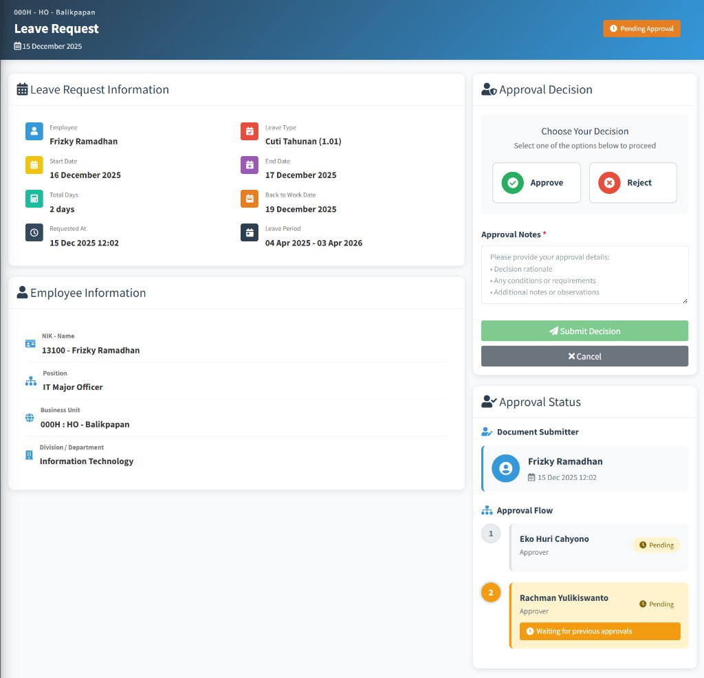

# My Approvals

Panduan ini untuk menjelaskan kepada **pemberi persetujuan (approver)** dan akun yang memiliki **hak akses** melihat antrean dokumen menunggu keputusan Anda di ARKA HERO. Anda akan mempelajari cara membuka daftar, menyaring data, meninjau rincian dokumen, serta menyetujui atau menolak lewat **Approval Decision**.

| **Istilah**                         | Arti singkat                                                                                                                                                                                                                                                                                                                                                                                                      |
| ----------------------------------- | ----------------------------------------------------------------------------------------------------------------------------------------------------------------------------------------------------------------------------------------------------------------------------------------------------------------------------------------------------------------------------------------------------------------- |
| **My Approvals**                    | Menu sidebar ke daftar persetujuan yang menunggu giliran Anda; dapat menampilkan **badge** angka jumlah antrean.                                                                                                                                                                                                                                                                                                  |
| **Pending Approvals**               | Judul utama halaman daftar (antrean dokumen yang belum Anda putuskan).                                                                                                                                                                                                                                                                                                                                            |
| **Approval Requests**               | Nama bagian di **breadcrumb** (misalnya setelah **Home**).                                                                                                                                                                                                                                                                                                                                                        |
| **Pending Approval Requests**       | Judul kartu berisi tabel daftar permintaan.                                                                                                                                                                                                                                                                                                                                                                       |
| **Approver**                        | Peran pengguna yang ditunjuk pada suatu dokumen untuk memberi keputusan persetujuan sesuai urutan aturan kantor.                                                                                                                                                                                                                                                                                                  |
| **Document Type**                   | Jenis dokumen di filter **Filters**; contoh nilai: **Official Travel** (perjalanan dinas/LOT), **Recruitment Request** (pengajuan rekrutmen/FPTK), **Leave Request** (cuti), **Flight Request** (permintaan tiket/penerbangan), **Letter of Guarantee (LG)** (surat penerbitan tiket), **Overtime Request** (lembur). Di kolom tabel, label dapat sedikit berbeda ejaan dengan opsi filter tetapi maksudnya sama. |
| **Document Number**                 | Nomor atau ringkasan identitas dokumen (tergantung jenis).                                                                                                                                                                                                                                                                                                                                                        |
| **Remarks**                         | Kolom keterangan tambahan di tabel (misalnya pemohon, posisi, atau ringkasan terkait dokumen).                                                                                                                                                                                                                                                                                                                    |
| **Submitted By** / **Submitted At** | Siapa yang mengajukan dan kapan diserahkan untuk persetujuan.                                                                                                                                                                                                                                                                                                                                                     |
| **Current Approval**                | Status giliran persetujuan (misalnya **Pending**) dan progres urutan approver.                                                                                                                                                                                                                                                                                                                                    |
| **Review**                          | Tombol membuka halaman tinjauan dokumen dan formulir keputusan.                                                                                                                                                                                                                                                                                                                                                   |
| **Approval Decision**               | Panel memilih **Approve** atau **Reject** dan mengisi catatan.                                                                                                                                                                                                                                                                                                                                                    |
| **Approval Notes**                  | Catatan wajib sebelum mengirim keputusan.                                                                                                                                                                                                                                                                                                                                                                         |
| **Bulk Approve**                    | Menyetujui sekaligus beberapa baris yang dicentang (hanya persetujuan, bukan penolakan massal).                                                                                                                                                                                                                                                                                                                   |

**Alamat:** `http://192.168.32.146:8080/approval/requests` — sesuaikan dengan server dan lingkungan perusahaan Anda.

---

## 1. Membuka **My Approvals** dan menyaring daftar (**Filters**)

### Langkah-langkah — **Pending Approvals** dan mempersempit tabel

1. **Login** ke ARKA HERO.
2. Di sidebar, klik **My Approvals**. Jika ada **badge** angka di samping menu, itu perkiraan jumlah permintaan yang masih menunggu keputusan Anda.
3. Pastikan judul halaman menampilkan **Pending Approvals** dan **breadcrumb** berisi **Home** → **Approval Requests**.
4. Pada kartu **Filters**, buka isian **Document Type** dan pilih jenis dokumen atau biarkan **All Types** untuk semua jenis yang tampil di sistem.
5. Isi **Date From** dan **Date To** bila ingin membatasi rentang tanggal (sesuai kebutuhan).
6. Klik **Apply Filters** agar tabel memuat ulang data.
7. Gunakan kotak pencarian bawaan tabel (biasanya di kanan atas area tabel) untuk mencari teks yang dikenali sistem; jika tidak ada hasil, muncul pesan seperti **No approval requests match your search criteria.**

    

**Catatan:** Menu **My Approvals** hanya tampil jika akun Anda diberi role=approver. Jika tidak ada, hubungi **administrator** (bukan semua karyawan otomatis menjadi approver).

---

## 2. Meninjau dan memutuskan satu dokumen — **Review**

### Langkah-langkah — dari tabel ke **Approval Decision**

1. Pada kartu **Pending Approval Requests**, baca kolom **Document Type**, **Document Number**, **Remarks**, **Submitted By**, **Submitted At**, dan **Current Approval** untuk memahami konteks dan apakah giliran Anda sudah aktif (urutan bisa paralel atau berjenjang sesuai pengaturan perusahaan).
2. Klik **Review** pada baris yang ingin diproses. <a href="#my-approvals-review">Lihat gambar</a>.
3. Di halaman tinjauan, baca rincian dokumen (berbeda per jenis: perjalanan dinas, cuti, rekrutmen, dan lain-lain). Di sisi kanan, buka panel **Approval Decision**.
4. Pada bagian **Choose Your Decision**, klik salah satu tombol besar: **Approve** atau **Reject**. Tanpa memilih salah satu, tombol **Submit Decision** tetap tidak aktif.
5. Isi **Approval Notes** (wajib, bertanda merah): jelaskan alasan setuju/tolak, syarat, atau catatan lain yang relevan.
6. Klik **Submit Decision** untuk mengirim. Gunakan **Cancel** jika ingin kembali ke daftar tanpa mengirim.
7. Setelah berhasil, Anda biasanya dikembalikan ke daftar **My Approvals** dan melihat pesan sukses singkat di aplikasi.

    

**Catatan:** Jika dokumen memakai **urutan persetujuan bertingkat**, sistem dapat menolak keputusan Anda sampai approver pada tingkat sebelumnya selesai — pesan di layar menjelaskan bahwa persetujuan sebelumnya harus diselesaikan terlebih dahulu.

---

## 3. Menyetujui banyak dokumen sekaligus — **Bulk Approve**

### Langkah-langkah — centang lalu konfirmasi

1. Di tabel **Pending Approval Requests**, centang kotak di baris yang ingin disetujui (atau gunakan kotak centang di header untuk memilih semua yang tampil pada halaman saat ini, jika tersedia).
2. Klik **Bulk Approve**.
3. Baca jendela konfirmasi (**Bulk Approval Confirmation**). Jika setuju, lanjutkan dengan opsi konfirmasi (misalnya **Yes, Approve All**); **Cancel** membatalkan.
4. Tunggu hingga proses selesai; sistem dapat menampilkan ringkasan jika sebagian berhasil dan sebagian gagal.
5. Tabel akan dimuat ulang; baris yang sudah diproses tidak lagi menunggu keputusan Anda.

**Catatan:** **Bulk Approve** hanya untuk **menyetujui** dokumen terpilih yang memang sudah siap diproses oleh Anda (termasuk aturan urutan). Dokumen yang gagal biasanya tetap ada di daftar dengan alasan terkait urutan atau status.

---

## 4. Panel status — **Approval Status**

Di halaman **Review**, kartu **Approval Status** menampilkan ringkasan seperti **Document Submitter** dan jejak approver lain bila tersedia, sehingga Anda dapat memverifikasi siapa yang mengajukan dan siapa saja yang sudah memutuskan.

---

## Kesalahan & bantuan (end user)

| Gejala / pesan (contoh)                                         | Kemungkinan penyebab                                                            | Apa yang bisa dicoba                                                                |
| --------------------------------------------------------------- | ------------------------------------------------------------------------------- | ----------------------------------------------------------------------------------- |
| Menu **My Approvals** tidak ada                                 | Akun tidak punya izin melihat antrean persetujuan                               | Minta **administrator** menambahkan hak akses yang sesuai peran Anda.               |
| **You are not authorized to approve this request**              | Bukan Anda sebagai approver untuk baris itu, atau tautan bukan milik tugas Anda | Buka lagi dari **My Approvals**; jangan memakai tautan lama dari orang lain.        |
| **This request has already been processed**                     | Keputusan sudah pernah dikirim                                                  | Muat ulang daftar; abaikan entri yang sudah tidak **Pending**.                      |
| **Previous approvals must be completed first**                  | Urutan persetujuan: giliran Anda belum jalan                                    | Tunggu approver sebelumnya; koordinasi internal bila mendesak.                      |
| **Submit Decision** tidak bisa diklik                           | Belum memilih **Approve** atau **Reject**                                       | Klik salah satu tombol keputusan, lalu isi **Approval Notes**.                      |
| **No Selection** / minta pilih permintaan saat **Bulk Approve** | Tidak ada baris yang dicentang                                                  | Centang minimal satu baris yang valid.                                              |
| Daftar kosong / **No approval requests found**                  | Tidak ada antrean untuk Anda, atau filter terlalu sempit                        | Kosongkan filter atau pilih **All Types**; pastikan dokumen sudah diajukan ke Anda. |
| Peringatan **Session Expired** saat tabel memuat                | Sesi login habis                                                                | **Login** ulang dan buka kembali **My Approvals**.                                  |

### Menghubungi administrator

Hubungi **administrator** (atau **IT** / **HR**) jika izin seharusnya ada tetapi menu hilang, status dokumen tidak berubah setelah Anda yakin sudah mengirim keputusan, atau pesan di layar tidak tercakup di tabel di atas.

**Jangan** mengirim **password**. Cukup sampaikan **username** Anda, jenis dokumen (**Document Type**), nomor atau petunjuk dokumen yang terlihat di layar, waktu kejadian, dan kutipan pesan singkat dari aplikasi.

---

