# Room & Consumption Management

Panduan ini menjelaskan modul **Room & Consumption** di ARKA HERO: pemantauan dan pengelolaan permintaan ruang meeting serta konsumsi untuk **staf yang berwenang** (menu grup **Room & Consumption** di **GAMMA SECTION**), serta pengajuan mandiri oleh **karyawan** lewat **My Features** → **My Room & Consumption**.

**Catatan peran:** Menu **Dashboard**, **Requests**, dan **Reports** hanya tampil jika akun memiliki hak akses pengelolaan Room & Consumption (umumnya GA/HR atau peran sejenis). Menu **My Room & Consumption** tersedia untuk karyawan yang berhak mengajukan atau melihat permintaan sendiri. Master ruangan (**Meeting Rooms**) berada di **GENERAL SECTION** → **Master Data** → **Room & Consumption Data**.

---

## Glosarium

| **Istilah**                          | Arti singkat                                                                                                                                                                                               |
| :----------------------------------- | :--------------------------------------------------------------------------------------------------------------------------------------------------------------------------------------------------------- |
| **Room & Consumption Request (RCR)** | Dokumen permintaan pemakaian ruang meeting beserta opsi konsumsi dan/atau Zoom Meeting ID.                                                                                                                 |
| **Reg. No**                          | Nomor register resmi, contoh **0001/HCS-000H/RCR/VII/2026** — dibentuk dari **Letter Number** kategori **RCR** + kode project + bulan Romawi + tahun.                                                      |
| **REQxxxxx**                         | Nomor sementara pengajuan mandiri karyawan (contoh **REQ00001**), sama pola **My Official Travel**. Diganti **Reg. No** resmi saat HR mengonfirmasi (pilih Letter Number).                                 |
| **Menunggu Konfirmasi HR**           | Badge/filter untuk RCR dari **My Room & Consumption** yang sudah **Submit to HR**, belum punya Letter Number resmi.                                                                                        |
| **Letter Number**                    | Nomor surat cadangan di **Letter Administration** (kategori **RCR**). Begitu dipilih dan disimpan (termasuk **Draft**), status nomor otomatis **used** (sama seperti LOT/FPTK).                            |
| **Meeting Room**                     | Ruangan meeting pada master data (**Meeting Rooms**), terikat ke satu **Project** (lokasi). Hanya status **Active** yang muncul di form RCR.                                                               |
| **Active / Inactive / Maintenance**  | Status master ruangan: aktif untuk booking, nonaktif, atau dalam perawatan.                                                                                                                                |
| **Need Zoom Meeting ID**             | Opsi Zoom di form. **IT Work Order** dibuat otomatis saat status **Submitted** (setelah letter + approver, lalu **Save & Submit** / **Submit for Approval**). **Submit to HR** (**REQ**) belum membuat WO. |
| **Zoom Meeting ID Availability**     | Panel ketersediaan akun Zoom (**131** / **132** / **134**) per tanggal — mirip widget di IT Work Order.                                                                                                    |
| **Approver Selection**               | Pemilihan approver manual berurutan sebelum pengajuan. Pada form karyawan (**My Request**) belum tampil sampai HR mengonfirmasi.                                                                           |
| **Submit to HR**                     | Tombol karyawan: kirim pengajuan dengan nomor **REQxxxxx**; menunggu konfirmasi HR (bukan langsung ke approval).                                                                                           |
| **Submit for Approval**              | Mengajukan request berstatus **Draft** (sudah punya Letter Number + approver) ke alur approval.                                                                                                            |
| **Request Zoom via IT WO**           | Tombol di halaman detail untuk (ulang) membuat IT Work Order Zoom bila diperlukan.                                                                                                                         |
| **Refresh Zoom Status**              | Memperbarui data Zoom (Meeting ID, passcode, join URL) dari IT Work Order.                                                                                                                                 |
| **Target (days)**                    | Pada laporan: selisih hari antara **Created At** dan tanggal meeting (informasi monitoring).                                                                                                               |

---

 
 

## 1. Ringkasan Menu

| **Menu**                  | **Navigasi (sidebar)**                                                                  | **Uraian**                                                                                            |
| :------------------------ | :-------------------------------------------------------------------------------------- | :---------------------------------------------------------------------------------------------------- |
| **Dashboard**             | **GAMMA SECTION** → **Room & Consumption** → **Dashboard**                              | Ringkasan volume request, meeting bulan ini, zoom/konsumsi, kalender meeting, top ruangan/project.    |
| **Requests**              | **GAMMA SECTION** → **Room & Consumption** → **Requests**                               | Daftar seluruh request; filter (termasuk **Menunggu Konfirmasi HR**); tambah, konfirmasi REQ, ajukan. |
| **Reports**               | **GAMMA SECTION** → **Room & Consumption** → **Reports**                                | Pintu masuk laporan; **Room & Consumption Request Report** dengan filter dan ekspor Excel.            |
| **My Room & Consumption** | **My Features** → **My Room & Consumption**                                             | Self-service: buat & kirim ke HR (**REQxxxxx**), ubah selama menunggu konfirmasi, lihat detail.       |
| **Meeting Rooms**         | **GENERAL SECTION** → **Master Data** → **Room & Consumption Data** → **Meeting Rooms** | Master data ruangan (prasyarat agar form bisa memilih **Room** per project).                          |

---

## 2. Untuk pengelola — Dashboard

### Langkah-langkah — membuka **Room & Consumption Dashboard**

1. **Login** ke ARKA HERO.
2. Di sidebar, buka **GAMMA SECTION** → **Room & Consumption** → **Dashboard**.
3. Judul halaman: **Room & Consumption Dashboard**; breadcrumb: **Meeting room & consumption requests overview**.

    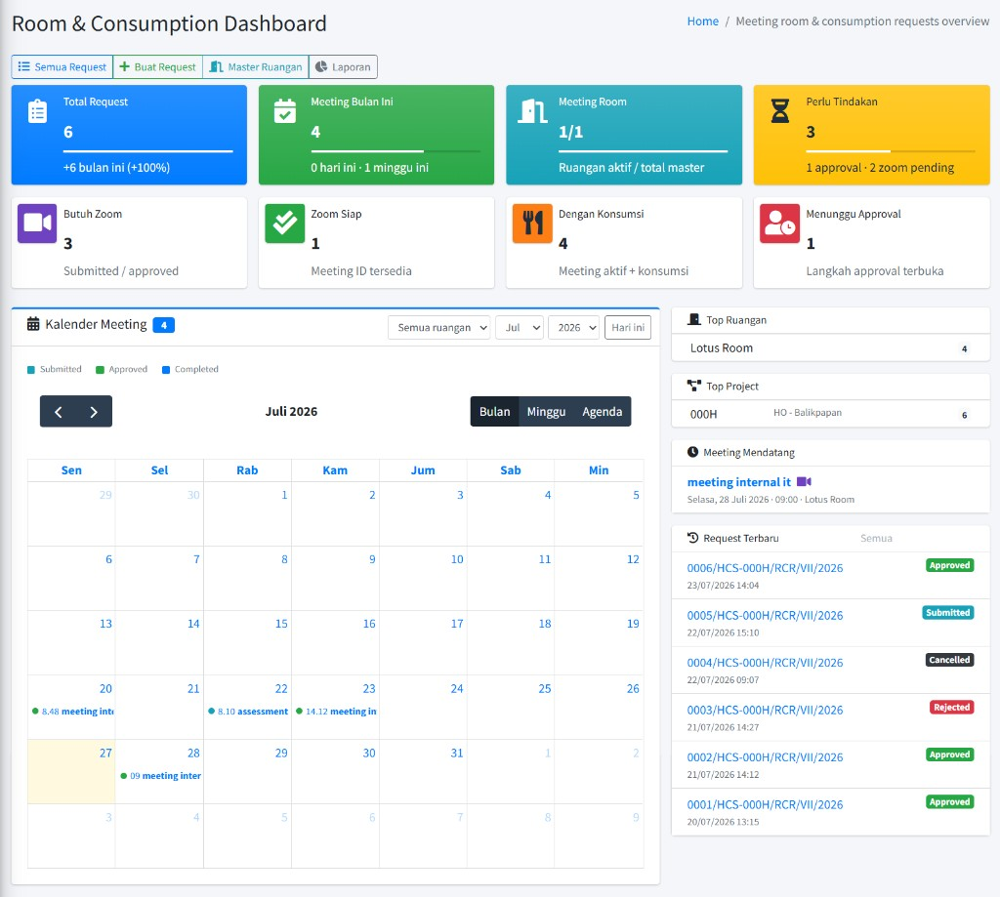
     <em>Gambar 2.1 — Room & Consumption Dashboard</em>

### Membaca ringkasan di layar

**Kartu utama:**

- **Total Request** — jumlah seluruh request; keterangan **+N bulan ini** (pertumbuhan dibanding bulan sebelumnya bila ada).
- **Meeting Bulan Ini** — meeting menurut **Meeting Date** pada bulan berjalan; keterangan hari ini / minggu ini.
- **Meeting Room** — jumlah ruangan aktif dibanding total master.
- **Perlu Tindakan** — gabungan langkah approval terbuka + request yang butuh Zoom tetapi belum siap.

**Kartu zoom & konsumsi:**

- **Butuh Zoom** — request (submitted/approved) dengan opsi Zoom.
- **Zoom Siap** — Meeting ID sudah tersedia.
- **Dengan Konsumsi** — meeting aktif yang memilih minimal satu jenis konsumsi.
- **Menunggu Approval** — jumlah langkah approval yang masih terbuka.

**Kalender Meeting** — tampilan kalender FullCalendar; filter **Semua ruangan**, **bulan**, **tahun**, tombol **Hari ini**. Warna legenda: **Submitted**, **Approved**, **Completed**. Klik event untuk membuka detail request.

**Panel samping:**

- **Top Ruangan** / **Top Project** — volume request terbanyak.
- **Meeting Mendatang** — daftar singkat meeting ke depan (ikon video bila butuh Zoom).
- **Request Terbaru** — request paling baru; tautan **Semua** ke daftar **Requests**.

**Tombol cepat di atas halaman (jika hak akses mengizinkan):**

- **Semua Request** — ke daftar **Requests**.
- **Buat Request** — form create.
- **Master Ruangan** — ke **Meeting Rooms**.
- **Laporan** — ke **Reports**.

---

## 3. Untuk pengelola — Requests

### 3.1 Daftar & filter

### Langkah-langkah — **Room & Consumption Requests** (daftar & filter)

1. **GAMMA SECTION** → **Room & Consumption** → **Requests**.
2. Halaman **Room & Consumption Requests** / subtitle **List of Requests**; tombol **Add** (jika diizinkan).
3. Buka panel **Filter**, isi sesuai kebutuhan (tabel memuat ulang otomatis):
    - **Status** — **- All -**, **Draft**, **Menunggu Konfirmasi HR**, **Submitted**, **Approved**, **Rejected**, **Cancelled**, **Completed**.
    - **Project** — **- All -** atau satu project.
    - **Meeting from** / **Meeting to** — rentang tanggal meeting.
    - **Reg. No / Title** — nomor register (**REQxxxxx** atau resmi) atau judul meeting.
    - **Requester** — nama pemohon (sebagian teks).
    - **Room** — nama ruangan.
4. Klik **Reset** untuk mengosongkan filter.
5. Kolom tabel: **No**, **Reg. No**, **Project**, **Room**, **Meeting Date**, **Time**, **Status**, **Requester**, **Actions** (**View**, **Edit**, **Submit**, **Delete** sesuai status dan hak).

**Catatan — Menunggu Konfirmasi HR:** Request dari karyawan (nomor **REQxxxxx**) tampil dengan badge **Menunggu Konfirmasi HR**. Filter status **Menunggu Konfirmasi HR** memudahkan HR menemukan pengajuan yang perlu diisi Letter Number dan approver — lihat [bagian 3.4](#rcr-hr-confirm).

    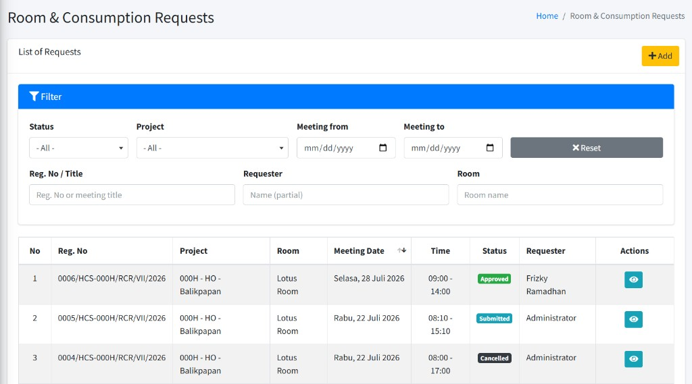
     <em>Gambar 3.1 — Daftar Room & Consumption Requests</em>

**Catatan:** Daftar dibatasi ke **project yang ter-assign** pada akun Anda.

---

### 3.2 Membuat & mengubah request

### Langkah-langkah — **Create Room & Consumption Request** / **Edit Room & Consumption Request**

1. Dari daftar, klik **Add**, atau **Edit** pada baris berstatus **Draft** yang boleh diubah.
2. Breadcrumb: **Home** → **Room & Consumption Requests** → **Add New** (atau **Edit**).
3. Isi formulir per blok berikut, lalu **Save as Draft** atau **Save & Submit**.

**1. Letter Number**

- Pilih nomor cadangan kategori **RCR** dari daftar **Letter Number** (project Anda).
- Gunakan **Refresh List** jika nomor baru saja dibuat di **Letter Administration**.
- **Create New** membuka pembuatan nomor surat (tab baru) bila diperlukan.
- Preview **Reg. No** terisi otomatis setelah nomor dipilih.
- **Catatan:** Seperti LOT/FPTK, begitu nomor dipilih dan request disimpan (termasuk **Draft**), letter number berstatus **used** di Letter Administration. Jika diganti saat masih draft, nomor lama dapat kembali **reserved** dan nomor baru menjadi **used**.

**2. Meeting Information**

- **Reg. No** — hanya tampilan (otomatis).
- **Meeting Date** — wajib.
- **Location (Project)** — wajib; menentukan daftar ruangan.
- **Room** — wajib; pilih setelah project (placeholder **— Select project first —** jika project belum dipilih).
- **Division / Department** — opsional.
- **Meeting Title** — wajib.
- **Start Time** / **End Time** — wajib; waktu selesai harus setelah mulai.
- **Attendees** — jumlah peserta (minimal 1).
- **Facilities** — fasilitas ruangan; dapat terisi otomatis dari master ruangan, boleh diubah.

    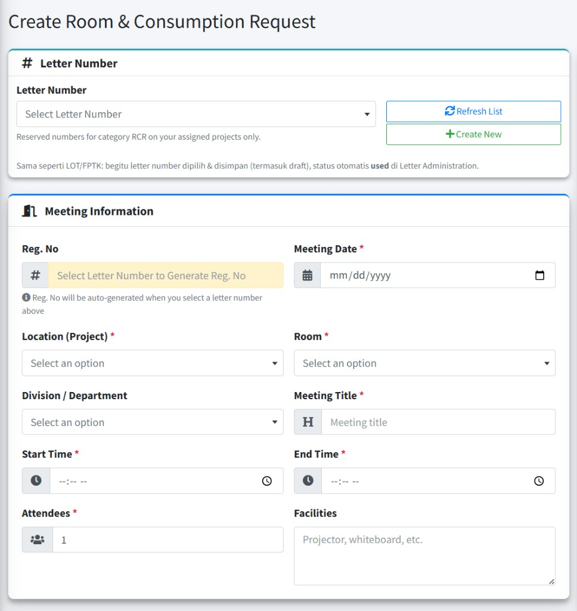
     <em>Gambar 3.2 — Form Create: Letter Number dan Meeting Information</em>

**3. Consumption**

Centang jenis konsumsi yang dibutuhkan dan isi deskripsi (opsional):

- **Coffee Break Pagi**
- **Coffee Break Sore**
- **Lunch**
- **Dinner**

Tidak wajib memilih konsumsi; biarkan kosong jika hanya memesan ruangan.

    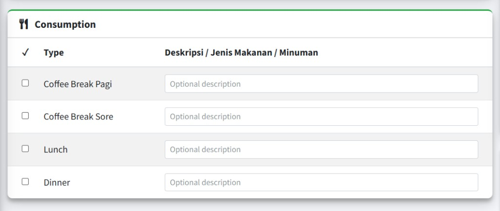
     <em>Gambar 3.3 — Form Create: Consumption</em>

**4. Options**

- **Need Zoom Meeting ID** — centang jika butuh Meeting ID Zoom. **IT Work Order** dibuat otomatis baru saat request berstatus **Submitted** (bukan saat **Draft** atau **Submit to HR**). Meeting ID muncul di halaman detail setelah IT mengisi.
- Saat opsi Zoom dicentang, panel **Zoom Meeting ID Availability** menampilkan ketersediaan akun **131** / **132** / **134** untuk tanggal yang dicek (**Date** + **Check**). Status tipikal: **Available**, **Booked**, **Unavailable (All Day)**.
- **Notes** — catatan tambahan (opsional).

    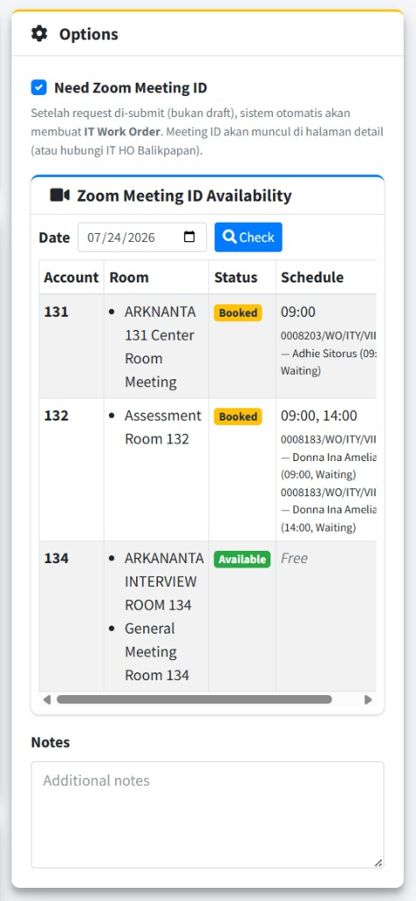
     <em>Gambar 3.4 — Form Create: Options dan Zoom Meeting ID Availability</em>

**5. Approver Selection**

- Pilih minimal **satu** approver berurutan sebelum **Save & Submit**.
- Untuk **Save as Draft**, approver dapat dilengkapi kemudian sebelum submit.

**6. Tombol aksi**

- **Save as Draft** — simpan tanpa mengajukan approval.
- **Save & Submit** — simpan sekaligus ajukan (konfirmasi); butuh letter number + minimal satu approver; sistem mengecek bentrok jadwal ruangan.
- **Cancel** — kembali tanpa menyimpan perubahan form ini.

**Catatan — bentrok ruangan:** Jika ruang sudah dipakai pada rentang waktu yang sama oleh request aktif lain, sistem menolak submit dengan pesan **Ruangan Terpakai** (detail bentrok ditampilkan). Ubah tanggal/waktu/ruangan lalu coba lagi.

---

### 3.3 Detail request, Zoom, cetak, dan pembatalan

### Langkah-langkah — melihat detail & aksi

1. Dari daftar, klik **View** (ikon mata) pada baris yang diinginkan.
2. Halaman **Room & Consumption Request** / **Request Detail** menampilkan **Reg. No** (atau judul jika masih draft), badge status, informasi meeting, fasilitas, konsumsi, catatan, dan **Approval Status**.

    
     <em>Gambar 3.5 — Detail request (Meeting Details, Zoom Meeting ID, Approval Status)</em>

**Kartu Zoom Meeting ID** (jika **Need Zoom Meeting ID** aktif):

- Status sinkronisasi (mis. menunggu IT, sedang diproses, Meeting ID siap, atau gagal).
- **WO number**, **Topic**, **Meeting ID**, **Passcode**, tautan **Buka Zoom** bila sudah ada.
- **Request Zoom via IT WO** — buat/ulang IT Work Order (konfirmasi).
- **Refresh Zoom Status** — tarik ulang data dari IT Work Order.
- Hubungi **IT HO Balikpapan** jika perlu bantuan membuka meeting atau ada kendala.

**Panel Actions** (tergantung status & hak):

- **Back** — kembali ke daftar.
- **Edit** — **Draft** atau **Menunggu Konfirmasi HR** (pengajuan karyawan).
- **Submit for Approval** — dari detail draft yang sudah punya Letter Number (bukan dari **REQxxxxx** pending HR).
- **Print** — cetak dokumen (tab baru).
- **Cancel Request** — batalkan request yang masih boleh dibatalkan (konfirmasi).

**Catatan:** Approval dilakukan melalui **My Approvals** oleh approver yang dipilih. Setelah disetujui penuh, status menjadi **Approved**. Penolakan mengisi alasan penolakan dan mengubah status menjadi **Rejected**.

---

### 3.4 Konfirmasi pengajuan karyawan (REQxxxxx)

Pengajuan dari **My Room & Consumption** memakai nomor sementara **REQxxxxx** dan badge **Menunggu Konfirmasi HR**. HR menetapkan **Letter Number** RCR, melihat preview **Reg. No** resmi, memilih approver, lalu menyimpan / mengajukan approval — pola sama dengan konfirmasi **My Official Travel**.

### Langkah-langkah — konfirmasi RCR dari karyawan

1. **GAMMA SECTION** → **Room & Consumption** → **Requests**.
2. Filter **Status** = **Menunggu Konfirmasi HR** (atau cari **REQxxxxx** di **Reg. No / Title**).
3. Klik **Edit** pada baris terkait.
4. Banner kuning mengingatkan: request dikirim karyawan (**REQxxxxx**); pilih **RCR Letter Number** dan approver.
5. Di kartu **Letter Number**, pilih nomor cadangan kategori **RCR**.
6. Field **Reg. No** (read-only) beralih dari **REQxxxxx** ke format resmi, contoh **0001/HCS-000H/RCR/VII/2026** (angka dari letter number, kode project, bulan Romawi dari **Meeting Date**, tahun).
7. Lengkapi / periksa **Meeting Information**, **Consumption**, **Options** bila perlu.
8. Isi **Approver Selection** (minimal satu approver).
9. Simpan:
    - **Save as Draft** — konfirmasi nomor resmi; request menjadi **Draft** dengan **Reg. No** formal. Lanjutkan **Submit for Approval** dari detail bila siap.
    - **Save & Submit** — konfirmasi sekaligus ajukan approval (status **Submitted**). Jika **Need Zoom Meeting ID** dicentang, **IT Work Order** dibuat pada tahap ini.
10. **Cancel** — kembali tanpa menyimpan perubahan form ini.

**Catatan:** Selama masih **Menunggu Konfirmasi HR**, karyawan dapat mengubah datanya lewat **My Room & Consumption** (**Save Changes**). Setelah HR mengonfirmasi (Letter Number terisi), karyawan tidak lagi mengedit; proses lanjut di sisi HR/approver.

---

## 4. Untuk pengelola — Reports

### Langkah-langkah — membuka laporan

1. **GAMMA SECTION** → **Room & Consumption** → **Reports**.
2. Pada kartu **Room & Consumption Request Report**, klik **View Report**.
3. Halaman **Report Room & Consumption Requests**.

### Filter & ekspor

1. Isi **Filter Options**:
    - **Status** — **Select status**, **All status**, atau status spesifik.
    - **Project** — **Select project**, **All projects**, atau satu project.
    - **Meeting from** / **Meeting to**
    - **Reg. No**, **Requester**, **Room**, **Meeting title**
2. Klik **Tampilkan data** (wajib ada setidaknya satu filter aktif, misalnya **All status**).
3. **Reset** mengosongkan filter.
4. **Export to Excel** mengunduh data sesuai filter yang sama.

Kolom tabel laporan: **No**, **Reg. No**, **Project**, **Room**, **Title**, **Date**, **Created At**, **Target**, **Time**, **Status**, **Requester**, **Actions** (lihat detail).

    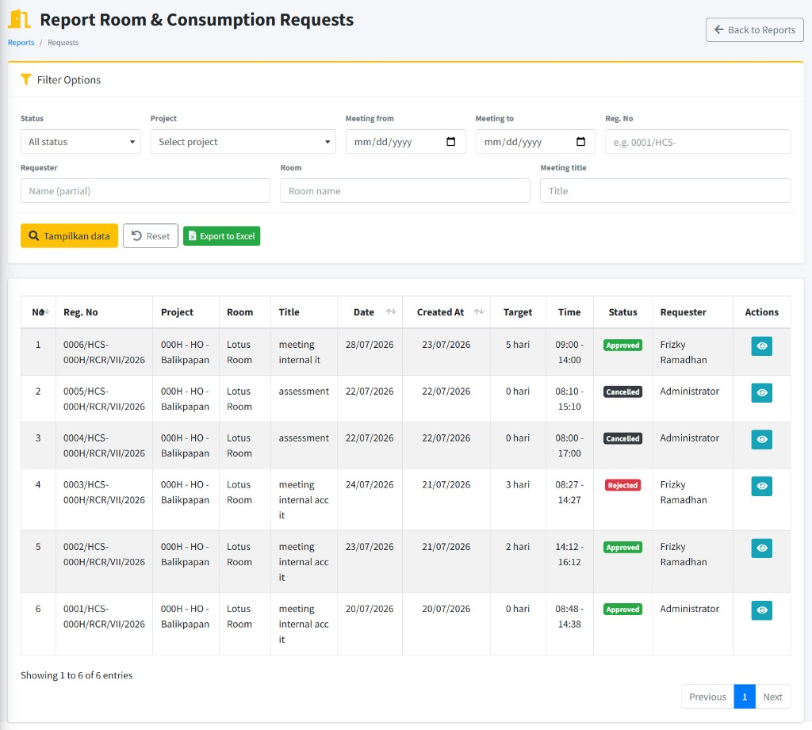
     <em>Gambar 4.1 — Report Room & Consumption Requests</em>

**Catatan:** **Target** menampilkan selisih hari (mis. **3 hari**) antara tanggal dibuat dan tanggal meeting — berguna untuk memantau lead time pengajuan.

---

## 5. Untuk karyawan — My Room & Consumption

### 5.1 Daftar permintaan sendiri

### Langkah-langkah — membuka **My Room & Consumption**

1. **Login** ke ARKA HERO.
2. Sidebar: **My Features** → **My Room & Consumption**.
3. Halaman **My Room & Consumption Requests** / **My Requests**.
4. Gunakan **Filter** (status termasuk **Menunggu Konfirmasi HR**, project, tanggal meeting, Reg. No/title, room) dan tombol **Add** untuk membuat request baru.
5. Kolom mirip daftar HR, tanpa kolom **Requester** (semua baris milik Anda). Nomor sementara tampil sebagai **REQxxxxx** sampai HR mengonfirmasi.

    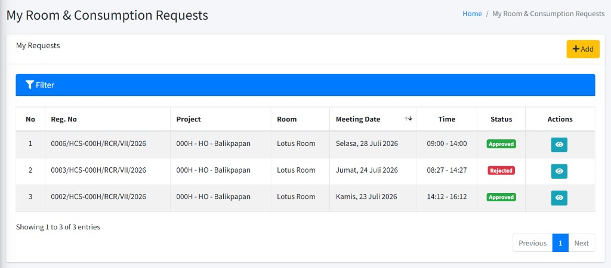
     <em>Gambar 5.1 — Daftar My Room & Consumption</em>

---

### 5.2 Membuat, mengubah, dan mengajukan ke HR

Alur **My Room & Consumption** mengikuti **My Official Travel**:

- Karyawan **tidak** memilih **Letter Number** dan **tidak** mengisi **Approver Selection**.
- Sistem memberi nomor sementara **REQxxxxx** (contoh **REQ00001**).
- **Reg. No** resmi dan nomor surat **RCR** ditetapkan **HR** saat konfirmasi di menu **Requests** (lihat [bagian 3.4](#rcr-hr-confirm)).
- Form karyawan: **Meeting Information**, **Consumption**, **Options** (termasuk panel Zoom availability bila dicentang).

### Langkah-langkah — **Add** / **Edit** My Room & Consumption

1. Dari daftar **My Room & Consumption**, klik **Add** (atau **Edit** pada request yang masih menunggu konfirmasi HR).
2. Baca banner biru: nomor surat RCR dan **Reg. No** resmi akan diisi HR setelah konfirmasi.
3. **Reg. No** menampilkan preview **REQxxxxx** (read-only; nomor final di-assign saat submit jika ada concurrent).
4. Isi **Meeting Information**: **Meeting Date**, **Location (Project)**, **Room**, **Division / Department** (opsional), **Meeting Title**, **Start Time** / **End Time**, **Attendees**, **Facilities**.
5. (Opsional) Centang jenis **Consumption** dan isi deskripsi.
6. (Opsional) Centang **Need Zoom Meeting ID** dan cek ketersediaan di panel **Zoom Meeting ID Availability**. Isi **Notes** bila perlu.
7. Tombol aksi:
    - **Submit to HR** (create baru) — kirim pengajuan; nomor **REQxxxxx**; status **Menunggu Konfirmasi HR**. **IT Work Order Zoom belum dibuat** pada tahap ini.
    - **Save Changes** (edit pending) — simpan perubahan selama masih menunggu HR.
    - **Cancel** — kembali ke daftar.
8. Setelah sukses, Anda kembali ke daftar dengan pesan menunggu konfirmasi HR.

    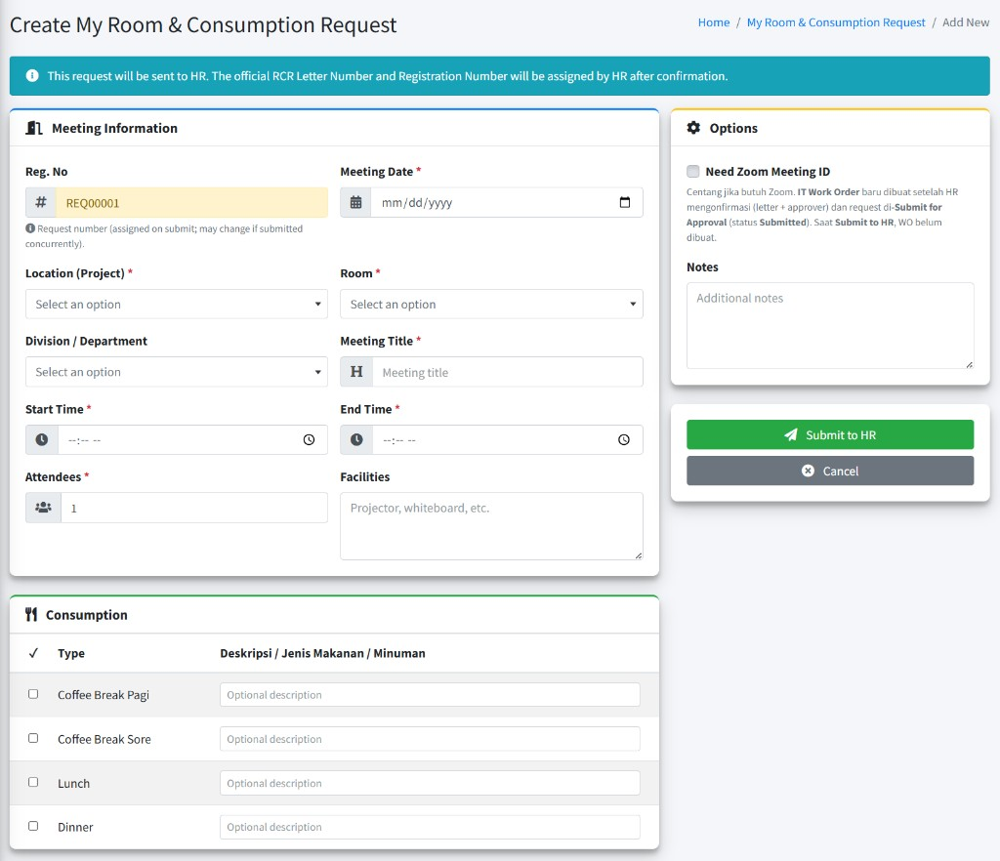
     <em>Gambar 5.2 — Form create karyawan (REQxxxxx, Submit to HR)</em>

**Catatan Zoom:** Mencentang **Need Zoom Meeting ID** saat **Submit to HR** hanya menandai kebutuhan Zoom. WO ke IT dibuat nanti setelah HR assign letter + approver dan request benar-benar **Submitted** (approval).

---

### 5.3 Detail, Zoom, dan pembatalan (karyawan)

Klik **View** pada baris permintaan.

- Badge status **Menunggu Konfirmasi HR** selama nomor masih **REQxxxxx** dan HR belum mengonfirmasi.
- Setelah HR mengonfirmasi, **Reg. No** berubah ke format resmi; status mengikuti alur approval (**Draft** / **Submitted** / **Approved**, dll.).
- Informasi meeting, konsumsi, approval, dan kartu **Zoom Meeting ID** sama seperti bagian [3.3 Detail request](#rcr-request-detail).
- **Edit** / **Save Changes** hanya selama masih **Menunggu Konfirmasi HR**.
- **Cancel Request** membatalkan permintaan Anda yang masih boleh dibatalkan.
- **Print** untuk mencetak (berguna setelah nomor resmi tersedia).

    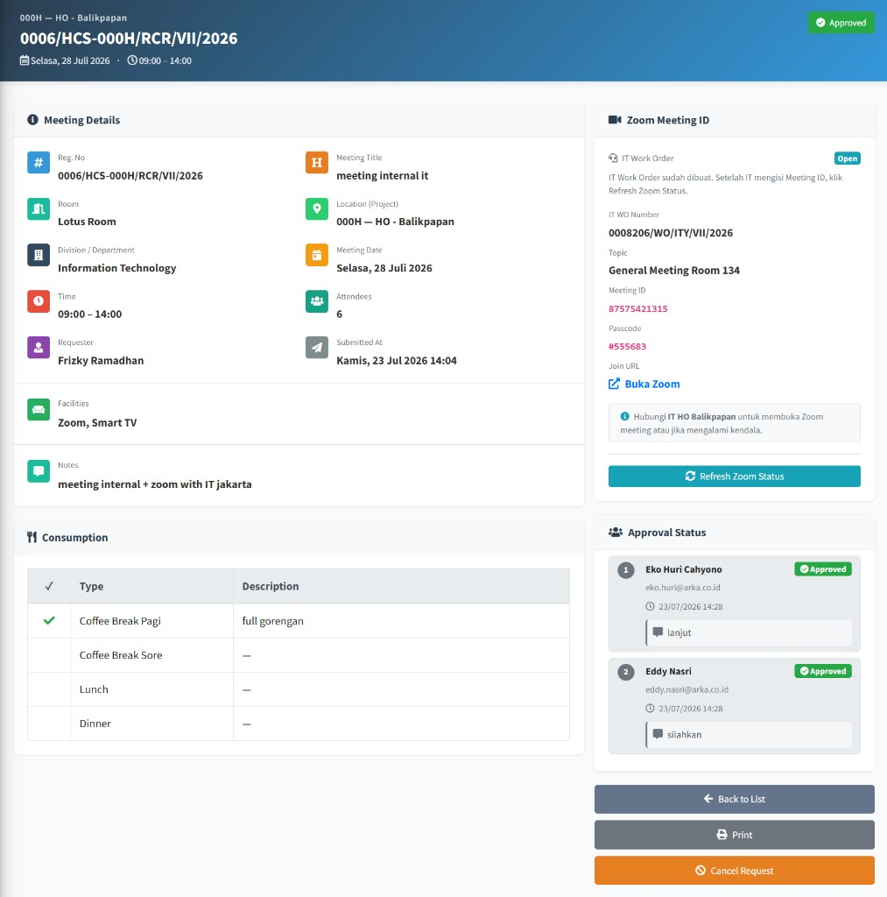
     <em>Gambar 5.3 — Detail request karyawan (Meeting Details, Zoom Meeting ID, Approval Status)</em>

**Catatan:** Progress approval dipantau di panel **Approval Status** atau oleh approver lewat **My Approvals**. Setelah Meeting ID siap, gunakan tautan **Buka Zoom** atau hubungi **IT HO Balikpapan** bila ada kendala teknis Zoom.

---

## 6. Master Data — Meeting Rooms

Master **Meeting Rooms** adalah daftar ruangan yang dapat dipilih pada form RCR. Tanpa ruangan **Active** untuk project terkait, dropdown **Room** di form permintaan akan kosong.

**Catatan:** Menu ini biasanya dikelola GA/admin master data, bukan setiap karyawan. Hak akses terpisah dari menu **Room & Consumption** di **GAMMA SECTION**.

### 6.1 Membuka daftar Meeting Rooms

### Langkah-langkah — **Meeting Rooms** (daftar & filter)

1. **Login** ke ARKA HERO.
2. Di sidebar: **GENERAL SECTION** → **Master Data** → grup **Room & Consumption Data** → **Meeting Rooms**.
3. Judul halaman: **Meeting Rooms**; subtitle: **List of Meeting Rooms**.
4. (Opsional) Dari **Room & Consumption Dashboard**, klik tombol **Master Ruangan** untuk membuka halaman yang sama.
5. Buka panel **Filter** bila perlu:
    - **Project** — **- All -** atau satu lokasi/project.
    - **Status** — **- All -**, **Active**, **Inactive**, **Maintenance**.
    - **Room / Facilities** — cari nama ruangan atau teks fasilitas.
6. Klik **Reset** untuk mengosongkan filter.
7. Kolom tabel: **No**, **Room Name**, **Location (Project)**, **Capacity**, **Facilities**, **Status**, **Action** (**Edit**, **Delete** sesuai hak).

    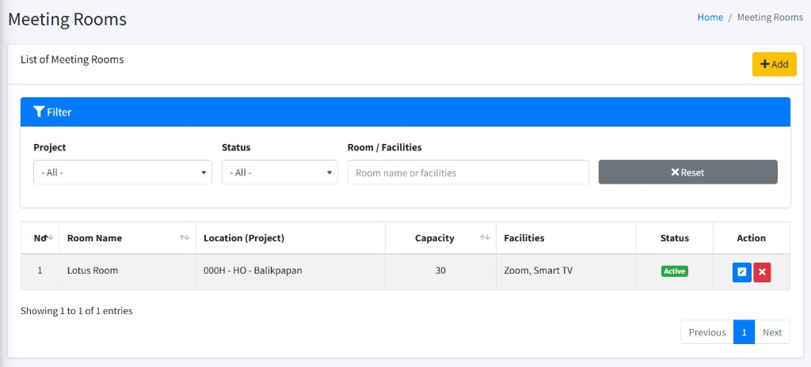
     <em>Gambar 6.1 — Daftar Meeting Rooms</em>

**Catatan:** Daftar dibatasi ke **project yang ter-assign** pada akun Anda.

---

### 6.2 Menambah Meeting Room

### Langkah-langkah — **Add Meeting Room**

1. Di halaman **Meeting Rooms**, klik **Add**.
2. Modal **Add Meeting Room** terbuka. Isi field:
    - **Location (Project)** — wajib; pilih dari daftar (**— Select Project —**).
    - **Room Name** — wajib; nama ruangan yang akan tampil di form RCR.
    - **Capacity** — opsional; kapasitas orang (angka minimal 1).
    - **Facilities** — opsional; contoh placeholder di layar: _Projector, whiteboard, Zoom, etc._ Teks ini dapat ikut terisi ke field **Facilities** pada form RCR saat ruangan dipilih.
    - **Status** — wajib: **Active**, **Inactive**, atau **Maintenance** (default biasanya **Active**).
    - **Notes** — opsional; catatan internal master data.
3. Klik **Submit** untuk menyimpan, atau **Close** untuk menutup tanpa menyimpan.

    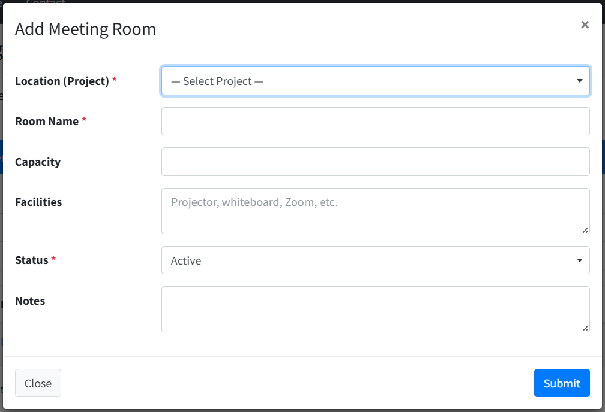
     <em>Gambar 6.2 — Modal Add Meeting Room</em>

**Catatan status:**

| **Status**      | **Arti untuk pengguna RCR**                                          |
| :-------------- | :------------------------------------------------------------------- |
| **Active**      | Muncul di dropdown **Room** pada form create/edit RCR.               |
| **Inactive**    | Tidak muncul di form RCR (ruangan tidak dipakai untuk booking baru). |
| **Maintenance** | Tidak muncul di form RCR (misalnya sedang perbaikan).                |

---

### 6.3 Mengubah & menghapus Meeting Room

### Langkah-langkah — **Edit Meeting Room**

1. Pada baris ruangan, klik ikon **Edit** (pulpen) di kolom **Action**.
2. Modal **Edit Meeting Room** menampilkan data yang sama seperti form tambah.
3. Ubah field yang diperlukan, lalu klik **Update**, atau **Close** untuk membatalkan.

    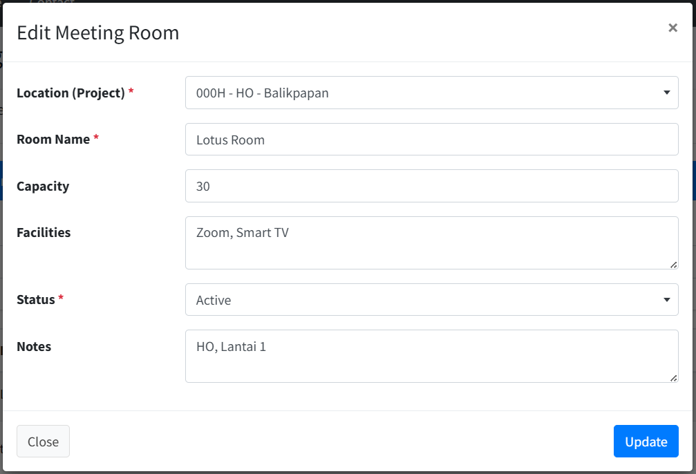
     <em>Gambar 6.3 — Modal Edit Meeting Room</em>

### Langkah-langkah — menghapus ruangan

1. Klik ikon **Delete** (silang) pada baris ruangan.
2. Konfirmasi: **Are you sure you want to delete this room?**
3. Jika ruangan **sudah punya request RCR**, penghapusan ditolak dengan pesan bahwa ruangan tidak dapat dihapus karena masih terkait permintaan. Gunakan status **Inactive** atau **Maintenance** sebagai alternatif.

**Catatan:** Mengubah status menjadi **Inactive** / **Maintenance** tidak menghapus histori request yang sudah memakai ruangan tersebut; hanya mencegah pemilihan pada pengajuan baru.

---

## 7. Prasyarat & referensi singkat

| **Kebutuhan**                                        | **Di mana disiapkan**                                                                                           |
| :--------------------------------------------------- | :-------------------------------------------------------------------------------------------------------------- |
| Ruangan meeting per project                          | **Meeting Rooms** — lihat [bagian 6](#meeting-rooms-list)                                                       |
| Letter number kategori **RCR** (status **reserved**) | **Letter Administration** → **Letter Numbers** / **Create Letter Number** (diisi HR saat konfirmasi My Request) |
| Approver yang valid                                  | Data user/approver aktif; dipilih di **Approver Selection** (HR/admin, bukan form karyawan My Request)          |
| Zoom Meeting ID                                      | Opsi **Need Zoom Meeting ID** + IT Work Order otomatis saat status **Submitted**                                |

Untuk detail penomoran surat secara umum, lihat bab **Letter Administration**. Untuk menyetujui request yang masuk ke Anda, lihat bab **My Approvals**.

---

## 8. Kesalahan & bantuan

| **Gejala / pesan (contoh)**                            | **Kemungkinan penyebab**                                          | **Apa yang bisa dicoba**                                                       |
| :----------------------------------------------------- | :---------------------------------------------------------------- | :----------------------------------------------------------------------------- |
| Menu **Room & Consumption** tidak terlihat             | Akun tanpa hak pengelola                                          | Gunakan **My Room & Consumption** jika tersedia; hubungi admin untuk hak akses |
| Menu **My Room & Consumption** tidak terlihat          | Belum diberi permission self-service                              | Hubungi administrator                                                          |
| Menu **Meeting Rooms** tidak terlihat                  | Akun tanpa hak master ruangan                                     | Hubungi administrator untuk permission **Meeting Rooms**                       |
| Daftar **Letter Number** kosong                        | Belum ada nomor **RCR** reserved untuk project Anda               | Buat/reservasi nomor di **Letter Administration**; klik **Refresh List**       |
| Letter number _not available_ / sudah **used**         | Nomor sudah dipakai dokumen lain                                  | Pilih nomor **reserved** lain                                                  |
| **— Select project first —** pada **Room**             | **Location (Project)** belum dipilih                              | Pilih project terlebih dahulu                                                  |
| Tidak ada ruangan di dropdown form RCR                 | Belum ada **Meeting Room** berstatus **Active** untuk project itu | Tambah/aktifkan ruangan di **Meeting Rooms** (bagian 6)                        |
| **Cannot delete room that has existing requests.**     | Ruangan sudah dipakai pada RCR                                    | Jangan hapus; set status **Inactive** atau **Maintenance**                     |
| **Ruangan Terpakai** saat submit                       | Jadwal bentrok dengan request aktif lain                          | Ubah tanggal, jam, atau ruangan                                                |
| Tidak bisa **Save & Submit** / **Submit for Approval** | Approver kosong, letter number belum dipilih, atau masih **REQ**  | Lengkapi **Approver Selection** dan **Letter Number** (HR konfirmasi dulu)     |
| Nomor masih **REQxxxxx**                               | HR belum konfirmasi Letter Number                                 | Tunggu HR; HR filter **Menunggu Konfirmasi HR** di **Requests**                |
| **Edit** tidak tersedia (karyawan)                     | HR sudah mengonfirmasi / status bukan pending HR                  | Hubungi HR; perubahan lanjut di sisi pengelola                                 |
| Panel Zoom tidak muncul                                | **Need Zoom Meeting ID** belum dicentang                          | Centang opsi tersebut di form                                                  |
| Meeting ID masih kosong setelah **Submit to HR**       | WO baru dibuat saat status **Submitted**, bukan saat ke HR        | Tunggu HR konfirmasi + submit approval; lalu **Refresh Zoom Status**           |
| Meeting ID masih kosong setelah **Submitted**          | IT belum mengisi / WO belum selesai                               | Klik **Refresh Zoom Status**; hubungi **IT HO Balikpapan**                     |
| Laporan: harus pilih filter dulu                       | Belum ada filter aktif                                            | Pilih **All status** atau isi filter lain, lalu **Tampilkan data**             |
| **Export to Excel** tidak mengunduh                    | Filter belum diisi                                                | Sama seperti memuat tabel                                                      |
| **Edit** / **Delete** tidak tampil (RCR admin)         | Status sudah bukan **Draft** / pending HR, atau tanpa hak         | Hanya draft / pending HR yang dapat diubah sesuai aturan                       |
| **Edit** / **Delete** tidak tampil (**Meeting Rooms**) | Akun tanpa hak ubah/hapus master                                  | Hubungi administrator                                                          |

### Menghubungi administrator

Sampaikan kepada administrator, GA, atau HR:

- **Username** (bukan password)
- **Waktu** kejadian
- **Menu** yang dibuka (mis. **Requests**, **My Room & Consumption**, **Meeting Rooms**, atau **Reports**)
- **Reg. No** permintaan (mis. **REQ00001** atau **0006/HCS-000H/RCR/VII/2026**) atau **Room Name** bila masalah master ruangan
- **NIK** Anda jika relevan
- **Cuplikan pesan** di layar (termasuk pesan bentrok ruangan, gagal hapus ruangan, atau kegagalan Zoom)

---
